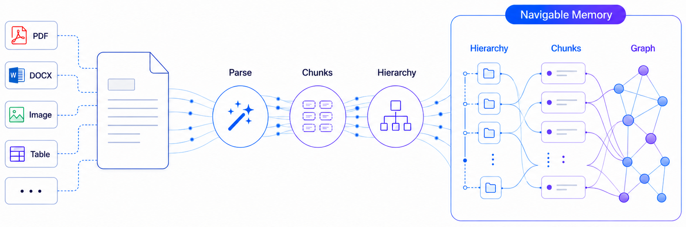
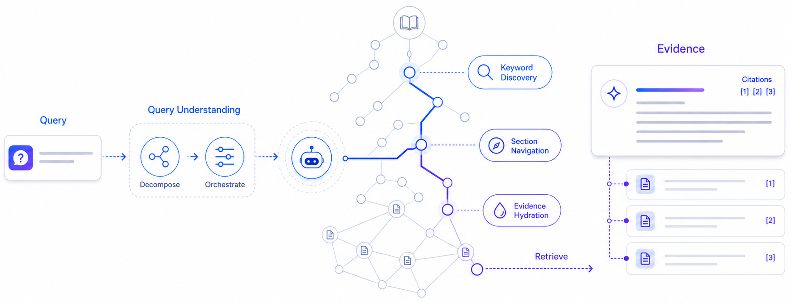
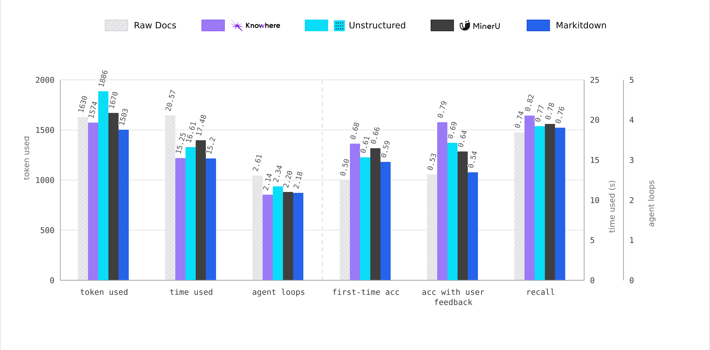

<h1 align="center">Ziru API</h1>

<p align="center">
  
</p>

## Overview

**Ziru is the memory layer between complex, dirty documents and AI agents.**

This directory contains the API core of the Ziru monorepo: a FastAPI REST API
(`apps/api`), a Celery worker for async document processing (`apps/worker`),
and a shared Python library (`packages/shared-python`). The dashboard,
notebook-style web UI, and self-hosted packaging live in sibling directories —
see the [root README](../README.md) for the full layout.

Ziru ingests unstructured documents and produces persistent, navigable
memory: parsing, hierarchy extraction, multi-modal structuring, and graph
construction in a single pipeline. Every chunk retains full semantic context,
making the output a natural fit for *Agentic RAG*, *vector-based RAG*, or any
LLM workflow.

## How it Works

Ziru runs in two steps: build memory from documents, then let agents retrieve from it.

### Step 1: Parse and Build Memory

<p align="center">
  
</p>

- **Parse**: Route PDFs, Office files, images, tables, Markdown, and text to specialized parsers.
- **Structure**: A tree-based algorithm reconstructs the full document hierarchy instead of flattening it into a sequence, preventing semantic fragmentation across chunks.
- **Build Memory**: Store chunks, navigation trees, summaries, and graph links as agent-ready context.

### Step 2: Agentic Retrieval

<p align="center">
  
</p>

- **Discover**: Fuse keyword, path, content, and semantic signals for broad first-pass coverage.
- **Navigate**: Walk section trees and graph links to drill into the most relevant document regions.
- **Cite Evidence**: Return traceable results with source document, section, chunk, and linked assets.

## FAQ

**Q: What is Ziru's relationship with MinerU?**

A: Ziru uses MinerU as its default parser because it performs best in our tests. Any parser only gets you raw Markdown. Ziru's value is what comes after: hierarchy reconstruction, multi-modal normalization, and cross-document graph construction. Any Markdown-outputting tool works.

**Q: What LLM / VLM dependencies does Ziru have?**

A: By default, DeepSeek (`deepseek-chat`) handles text and table summarization, and Qwen-VL (`qwen3.6-flash`) handles image OCR and descriptions. Ziru is model-agnostic. Swap in OpenAI, DashScope, Zhipu, or Volcengine via environment variables.

**Q: How is Agentic Retrieval different from traditional RAG?**

A: Traditional RAG does a flat vector lookup and returns isolated snippets. Ziru's agents navigate the document's section tree and cross-document graph, drilling into the most relevant regions the way a human reader would, returning traceable, well-contextualized evidence.

**Q: Does it handle images and tables?**

A: Yes. Ziru extracts them, runs them through VLMs for summarization and feature extraction, and links them back to their source chunks so agents can retrieve and cite multi-modal assets at inference time.

## Performance Benchmark

Agents using Ziru outperform those working from raw documents, Markitdown, Unstructured, or MinerU output on real-world tasks: searching, modifying, and answering questions.

<p align="center">
  
</p>

### Key Advantages

- **Accuracy**: +36% first-try accuracy and +11% recall over raw documents.
- **Reliability**: 79% accuracy with feedback, vs. a ~53% ceiling on raw docs.
- **Efficiency**: Fewer loops, fewer tokens, less time. Agents navigate a structured graph instead of reading monolithic text.

*(Internal evaluation across identical agentic RAG tasks. Baselines: raw documents and parser output fed directly to agents.)*

## Features

- **Multi-modal Parsing**: High-fidelity extraction from PDF, Office, and images, preserving headings, tables, and hierarchical paths.
- **Lightweight Memory Graph**: Context-aware organization that links documents and chunks for better relationship understanding.
- **Agentic RAG**: A hybrid retrieval engine combining traditional search (RRF) with autonomous agent navigation.
- **Evidence-based Citations**: Every result is backed by traceable source paths, ensuring reliability for AI Agent decision-making.

## Supported Formats

**✅ Supported**

- [x] `.pdf` `.docx` `.pptx` `.xlsx` `.csv`
- [x] `.jpg` `.png`
- [x] `.md` `.txt` `.json`

**⏳ Coming Soon**

- [ ] `.epub` `.html` `.xml`
- [ ] `.mp4` `.mp3`
- [ ] `.skills.md`

## Prerequisites

- Python 3.11+
- `uv`
- Docker with `docker compose`

## Quick Start

1. Sync the workspace dependencies:

```bash
uv sync --all-packages
```

2. Copy the environment examples:

```bash
cp apps/api/.env.example apps/api/.env
cp apps/worker/.env.example apps/worker/.env
```

3. Update the copied `.env` files with the values you need for local work:

- database and Redis connection settings
- S3-compatible storage credentials
- at least one LLM provider key: `DS_KEY`, `ALI_API_KEYS`, `GPT_API_KEY`, or `GLM_API_KEY`
- `MINERU_API_KEYS` if you need PDF parsing
- a vision-capable model provider if you need image summaries, OCR, atlas classification, or image-aware retrieval
- any optional billing or webhook providers you want to enable

Most parser and retrieval tuning values have code defaults. Start with the
required external services first, then override model names, provider URLs,
budgets, or concurrency limits only when your deployment needs different
behavior. See [deploy/docs/configuration.md](../deploy/docs/configuration.md)
for the operator-facing configuration reference.

4. Start the local infrastructure stack:

```bash
./deploy/local-dev/start-dev.sh
```

5. Start the API and worker in separate terminals:

```bash
cd apps/api && uv run main.py
cd apps/worker && uv run worker.py
```

The API runs migrations during startup.

For API-only development without the dashboard, create an API-only user/key
after the API service starts:

```bash
cd apps/api
uv run scripts/init_user.py --email you@example.com
```

If you plan to use the dashboard, register through the dashboard instead of
using `scripts/init_user.py`.

The API is now running at `http://localhost:5005`. For the full product
experience with a UI, run the dashboard and web UI from this monorepo
(`admin/` and `webui/`) alongside it; they connect to this API out of the box.

## Quality Checks

Run lint checks from the repository root:

```bash
make lint
```

Apply safe Ruff fixes:

```bash
make lint-fix
```

Run type checks across the API, worker, and shared source code:

```bash
make typecheck
```

Run both lint and type checks:

```bash
make check
```

## Local Endpoints

- API: `http://localhost:5005`
- OpenAPI docs: `http://localhost:5005/docs`
- LocalStack: `http://localhost:4566`
- PostgreSQL: `localhost:5432`
- Redis: `localhost:6379`

## Additional Guides

- Deployment configuration reference:
  [deploy/docs/configuration.md](../deploy/docs/configuration.md)
- Architecture decisions:
  [docs/adr/README.md](docs/adr/README.md)

## Telemetry

Self-hosted Ziru emits **anonymous** product telemetry (install liveness,
usage aggregates, client/document mix). Events never include filenames,
prompts, emails, IPs, or geo. Schema and allowlists are locked in
[ADR-0004](docs/adr/0004-anonymous-self-hosted-telemetry.md).

Telemetry is **off by default** in the Ziru fork (`TELEMETRY_ENABLED=false`).
If you operate your own analytics endpoint, you can opt in:

```bash
TELEMETRY_ENABLED=true
```

Related settings live in `apps/api/.env.example` under `TELEMETRY_*`. Private
deployments should review the configured telemetry endpoint before enabling.

## Citation

If you use Ziru in your research, please cite it as:

```bibtex
@software{ziru2026,
  author       = {Gordon Yuen},
  title        = {Ziru: Prepare Unstructured Data for AI Agents},
  year         = {2026},
  publisher    = {GitHub},
  version      = {0.1.0},
  license      = {Apache-2.0}
}
```

## Communication

- Open an issue in this repository for bug reports and feature requests.

## Contribution

Any contributions to Ziru are more than welcome!

For guidelines on branching, commit conventions, and the review process, take
a look at [CONTRIBUTING.md](CONTRIBUTING.md).

Other useful references:

- [SECURITY.md](SECURITY.md): how to report vulnerabilities responsibly.
- [CODE_OF_CONDUCT.md](CODE_OF_CONDUCT.md): community behavior expectations.
- [LICENSE](LICENSE) and [NOTICE](NOTICE): Apache 2.0.

## Acknowledgements

Ziru is a fork of [Knowhere](https://github.com/Ontos-AI/knowhere) by
Ontos-AI, distributed under the Apache License 2.0. The upstream attribution
notices are preserved in `NOTICE` (this directory) and in the root
[NOTICE](../NOTICE). Ziru uses [MinerU](https://github.com/opendatalab/MinerU)
as its default PDF parser (see [MinerU/LICENSE.md](../MinerU/LICENSE.md)).
