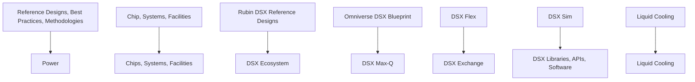
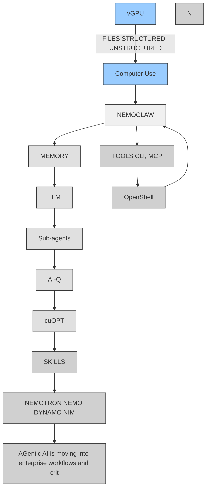
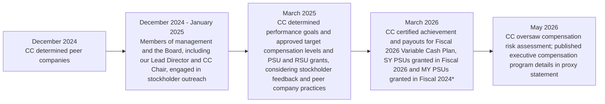

## 2026

## NVIDIA Corporation

## Annual Review

Notice of Annual Meeting

Proxy Statement

Form 10-K


<details>
<summary>natural_image</summary>

Abstract 3D geometric design with green spiral and rectangular forms on a grid background (no text or symbols)
</details>

## For most of computing history, software was pre-recorded.

Humans described an algorithm. Computers executed it.

Now software is trained. It learns from data and generates intelligence in real time.

General-purpose computing has run its course. Moore's Law slowed. Dennard scaling ended. Accelerated computing became foundational.

Because intelligence is produced in real time, the entire computing stack beneath it had to be reinvented.

AI runs on real hardware, real energy, and real economics. It takes raw materials and converts them into intelligence at scale.

This is not a normal upgrade cycle.

The world is going through a platform shift.


<details>
<summary>flowchart</summary>

```mermaid
graph TD
  A["APPLICATIONS"] --> B
  C["MODELS"] --> D
  EINFRASTRUCTURE] --> F
  CHIPS --> G
  ENERGY --> H
```
</details>

  
CHATBOTS

  
DIGITAL BIOLOGY

  
ROBOTAXI

  
ENTERPRISE
AI AGENTS

  
SCIENCE

  
ROBOTICS

  
MANUFACTURING

  
AI CODER


<details>
<summary>text_image</summary>

LLM
VLM
VLA
MMLLM
GPT
DM
GNN
MOE
SSM
LBM
</details>

AI FACTORIES  


<details>
<summary>natural_image</summary>

Stacked cylindrical containers with transparent lids, arranged in two rows (no visible text or symbols)
</details>

## AI Is a Five-Layer Cake

It is not a clever app or a single model; it is essential infrastructure, like electricity and the internet.

When you look at AI industrially, it resolves into a five-layer stack. Energy → chips and systems → infrastructure → models → applications.

Every successful application pulls on every layer beneath it, all the way down to the power plant that powers it.

Energy becomes computation. Computation becomes intelligence. The amount of intelligence a system can produce is bounded by energy.

When applications scale, the entire stack must scale with them.

## AI Is Driving the Largest Infrastructure Buildout in Human History

Data centers are becoming AI factories.

Land, power, cooling, networking, and systems must scale in parallel. Every company will use AI. Every country will build AI infrastructure. This is the next industrial revolution. We are only a few hundred billion dollars into it. Trillions more still need to be built.


<details>
<summary>flowchart</summary>


</details>

## AI Factories Manufacture Intelligence

Intelligence is now produced, not stored.

Modern data centers are AI factories, converting energy into tokens—just as power plants convert energy into electricity.

Throughput per megawatt defines production. Cost per token defines efficiency.

Token output and performance per watt directly determine revenue.

## Inference Defines the Economics of AI

For agentic AI—low-latency, long-context, multi-step reasoning—throughput per megawatt determines cost per token.

Inference runs continuously and directly drives revenue.

Reasoning models generate dramatically more tokens. They generate many more “thinking” tokens before they answer, and they have to do it fast enough to stay interactive.

SemiAnalysis InferenceX measured GB300 NVL72 delivering up to 50x higher throughput per megawatt and up to 35x lower cost per token compared to Hopper, with the greatest gains in low-latency workloads.

Inference is not a chip problem. It is a systems architecture problem—GPU, networking, memory, and software designed as one.


<details>
<summary>text_image</summary>

semianalysis
InferenceMAX
KING
</details>

## Open Models Power the Ecosystem

Open models have reached the frontier.

Researchers, startups, enterprises, and entire nations rely on open models to participate in advanced AI. Most of the world's models are free.

At this level of capability, they do not just change software. They activate demand across the entire stack.

Open models lower barriers to entry. They enable deep customization. They allow teams to build domain-specific systems on common platforms.

As developers build, customize, and deploy intelligence, token generation grows—and demand for AI infrastructure grows with it.


<details>
<summary>line chart</summary>

| Month     | NVIDIA | Alibaba Cloud | Hugging Face | Ai2  | Meta | Google | IBM  | ByteDance | Baidu | Tencent | Microsoft | Zai  |
| --------- | ------ | ------------- | ------------ | ---- | ---- | ------ | ---- | --------- | ----- | ------- | --------- | ---- |
| Jan 2025  | ~10    | ~10           | ~10          | ~10  | ~10  | ~10    | ~10  | ~10       | ~10   | ~10     | ~10       | ~10  |
| Feb 2026  | ~450   | ~350          | ~200         | ~180 | ~150 | ~130   | ~120 | ~110      | ~100  | ~90     | ~80       | ~70  |
</details>


<details>
<summary>natural_image</summary>

Six-panel illustration showing molecular structures, a globe, a person waving, a spiral, a humanoid robot waving, and a car (no text or symbols)
</details>

## Agentic AI Enters Production

AI now perceives, reasons, plans, and acts.

Agentic systems break complex problems into steps. They evaluate alternatives. They use tools. They retrieve information. They act across long-running workflows. They coordinate across models, tools, and environments in real time.

OpenClaw showed what happens when agentic AI becomes open: every developer can build agents that put AI to work. As agents move from chat to work, they will access data, use tools, execute code, and communicate with other systems. All of this must happen securely, privately, and under policy control.


<details>
<summary>flowchart</summary>


</details>

Agentic AI is moving into enterprise workflows and critical systems.

## Physical AI Puts Intelligence in Motion

Robotics, autonomous vehicles, and intelligent machines combine perception and reasoning with an understanding of physics.

They operate in dynamic environments and act in the physical world.

Foundation models are trained at scale, refined in simulation, and deployed at the edge—creating a continuous loop between virtual training and real-world experience.

Physical AI is transforming factories, warehouses, transportation, and healthcare.

Everything that moves will be autonomous.


<details>
<summary>natural_image</summary>

Interior of a modern exhibition space featuring a large excavator, humanoid robots, and a car with a child in an orange costume (no visible text or symbols)
</details>

# AI Reinvents Computer Graphics

GeForce brought AI to the world. Now AI has come home to GeForce.

Computer graphics is no longer limited by traditional rendering.

With neural rendering and DLSS, AI predicts pixels instead of computing them directly. For every pixel we render, AI generates the rest in real time.

Neural networks now run alongside shaders and ray tracing cores. AI does not replace graphics. It enhances it.

In the era of neural rendering, graphics is learned.

“AI has crossed the threshold from generating answers to performing work. The next industrial revolution will be built on factories that manufacture intelligence—and NVIDIA is building the platform to power them.”


<details>
<summary>text_image</summary>

Jahibing
</details>


<details>
<summary>natural_image</summary>

Elderly man in a black leather jacket gesturing while holding a handheld device (no visible text or symbols)
</details>

# Dear NVIDIAs and Stakeholders,

## Computing platforms shift every 10 to 15 years—from mainframe to PC to internet to cloud to mobile-cloud.

What is happening now is bigger. Computing is undergoing a complete reset not seen since IBM introduced modern computing with the System/360 in 1964. We are moving from computers as tools to a new kind of infrastructure that manufactures intelligence in real time.

NVIDIA is driving this platform shift, building the computing infrastructure of the AI era.

AI is transforming every layer of the computing stack—shifting from human coding to machine learning, from running code on CPUs to running neural networks on GPUs.

AI is more than a model—it is a new computing paradigm. Intelligence, unlike information, cannot be prerecorded, stored, and retrieved. It is generated in real time, taking into account context, prior knowledge, and instructions.

AI is still software running on chips. But because the computer can now understand, reason, plan, and use tools, it appears intelligent—hence, artificial intelligence.

Over the past year, investors and enterprises questioned the ROI in AI—and for good reason. Early systems, such as chatbots, greatly improved access to information but did little productive work. Over the past six months, however, the landscape has shifted sharply. Enterprise adoption has surged.

Inference—running trained AI models to generate responses, reasoning, and actions—is driving cloud demand, and demand for GPU compute is accelerating.

Agentic AI has arrived and is delivering remarkable results. Generative AI creates. Reasoning AI thinks through problems. Agentic AI uses tools to perform tasks after thoughtful planning, research, and learning. AI has crossed an important threshold: it no longer simply answers questions—it does useful work.

The first major enterprise breakout use case is AI coding agents, now sweeping across the industry. Within a few years, AI will generate much of the world's software. Soon after, AI will produce orders of magnitude more software than all human engineers combined. Limited only by imagination, the pace of innovation will accelerate across industries.

Software can codify nearly all enterprise information. As a result, AI agents can accelerate or fully automate every business process through the software they generate. Organizations will rethink their operations end-to-end, from customer engagement through internal workflows and across the supply chain. Every business process will be enhanced and accelerated by AI agents.

Companies that adopt AI agents—and build the infrastructure to support them—will out-innovate, out-execute, and attract the world's best talent.

This shift is driving a fundamental change in the economics of computing.


<details>
<summary>text_image</summary>

Reimagine What's Possible
Poster Gallery
Reimagine What's Possible
JOSÉ CIVIC
Bough Discoveries
</details>

Compute is no longer just a cost to support software; it is a productive asset that generates intelligence, productivity, and revenue. Compute is now the infrastructure of this new economy.

A computer used to be a tool. In the age of AI, it is manufacturing equipment. AI requires a new kind of computing infrastructure that runs continuously. Traditional data centers were built to store and serve files. Today, they are AI factories—systems designed to turn energy into tokens, the basic units of digital intelligence, and tokens into answers, reasoning, actions, and work. AI factories are not cost centers—they are productive assets that generate revenue.

NVIDIA delivers a full-stack AI computing platform that spans the entire AI lifecycle—from training to inference—and every domain of intelligence, from language and video to biology, autonomous driving, and robotics.

NVIDIA is a vertically integrated, horizontally open platform. We architect with a vertically integrated mindset, executing extreme co-design across chips, systems, networking, storage, and software—spanning GPUs, CPUs, LPUs, DPUs, and full AI factory systems. At the same time, our platform remains open and integrates with the broadest software and hardware ecosystems.

Our platform powers AI wherever it runs—across clouds, on-premises data centers, telecom networks, medical instruments, vehicles, and robots.

NVIDIA is building the computing infrastructure of the AI era.

## Driving the AI Platform Shift

GTC is where the industry comes together across every layer of the AI stack, from land, power, and infrastructure to chips, models, and applications. This year, what has become unmistakably clear is that AI has moved from experimentation to production.

We laid out the roadmap from Blackwell to Blackwell Ultra to Vera Rubin to Vera Rubin Ultra to Feynman. AI infrastructure builders plan over years, across factories, ecosystems, and supply chains.

Today, we have visibility into more than \$1 trillion in cumulative Blackwell and Rubin revenue from the start of 2025 through 2027. Since GTC DC in October 2025, we have received additional purchase orders and further diversified our customer base, including Anthropic, Meta, and a growing set of world-class model builders such as Cursor, Perplexity, Thinking Machines Lab, Reflection, and Skild.

At the same time, the scale of our cloud service providers continues to accelerate. In addition to the significant buildouts already underway at Azure and OCI, AWS and Google have announced plans for major NVIDIA GPU infrastructure expansions through 2027. NVIDIA AI cloud partners—including CoreWeave, Nebius, and Nscale—are also experiencing exponential demand and have secured significant long-term offtake agreements.

This momentum reflects the economics of this new industry: AI factories are revenue-generating infrastructure. They produce tokens, and tokens produce revenue.

## AI is a new industry: The Five-Layer Cake

Like steam power, electricity, and information technology before it, AI is forming a new industry. AI is more than a model—it's a new industry with a five-layer stack: energy at the foundation; compute—chips and systems—above it; then infrastructure, models, and finally applications at the top.

In the industrial age, turbines and generators produced electricity, priced in dollars per kilowatt-hour, distributed globally, and enabled entirely new industries. In the AI era, electricity powers GPUs that produce digital intelligence, priced in dollars per million tokens—transforming existing industries and creating new ones. AI factories are not designed to store information, but to produce intelligence.

Each industrial revolution created new infrastructure and companies. Power plants and utilities emerged in the age of electricity. Data centers, chips, and software companies defined the information technology era. Today, AI factories have emerged as the infrastructure of this new age, alongside entirely new classes of chips, systems, and computing platforms—and tens of thousands of AI-native startups.

Above the infrastructure are models. While large language models are widely known, the frontier extends much further. AI now includes models that understand biology, chemistry, physics, finance, medicine, and the physical world—bringing intelligence into the core of every major industry.

At the top are applications—where AI creates economic and social value—such as software development, customer support, drug discovery, industrial automation, autonomous vehicles, and robotics. In the years ahead, companies will orchestrate tens of billions of digital and physical agents working alongside people to help us be more productive, more creative, and more capable.

Every successful AI application pulls on every layer beneath it—from energy to chips to infrastructure to models. Applications are where AI infrastructure becomes productivity, growth, and national capability.

## Fiscal 2026: A Defining Year

Revenue grew 65 percent to \$216 billion. Operating income rose 60 percent to \$130 billion. Diluted EPS increased 67 percent to \$4.90. We generated \$103 billion in operating cash flow and returned \$41 billion to shareholders.

Demand remained strong across cloud providers, hyperscalers, AI model makers, enterprises, and sovereigns. AI infrastructure is now essential, and investment is accelerating worldwide.

Fiscal 2026 also marked a turning point in adoption. AI moved from experimentation to measurable revenue and efficiency, with software development, healthcare, customer support, and industrial automation among the first domains to show strong productivity gains.


<details>
<summary>text_image</summary>

Inference At-Scale is Extreme Computing
Throughput
Revenue
Tokens per Second For Factory
FLOPS
HBM Memory
HBM Bandwidth
Software and Architecture
Smart AI
Fast Response
Tokens per Second For C
for C
</details>

## Inference Inflection Driving Compute Growth

Marking a fundamental shift, inference has overtaken training as the dominant workload. AI is no longer just being built; it is being used at scale. With that shift, the economics of AI have changed. Demand is no longer conceptual—the AI flywheel is accelerating.

Inference demand is surging as multiple exponential forces converge. Models are becoming more capable. Agents built on these models can reason, plan, and solve complex problems, generating tokens at every step. As these agents prove their value, they are deployed across more workflows, by more users, in more industries—generating still more tokens.

More tokens require more compute. More compute enables smarter AI. Compute produces intelligence, intelligence drives demand, and demand drives more compute. The supply-demand flywheel is formed and accelerating.

In fiscal 2026, Data Center revenue reached \$194 billion, up 68 percent year over year. Major cloud service providers, hyperscalers, AI model makers, and enterprises have deployed nearly 9 gigawatts of Blackwell AI factory capacity. Our networking revenue exceeded \$31 billion. Our sovereign AI business more than tripled to over \$30 billion.

## Computing Architecture Defines AI Factory Economics

An AI factory is not a conventional data center. It is a production system—a revenue-generating engine.

Its purpose is to manufacture tokens at scale—with the highest intelligence, the highest throughput, the lowest latency, and the greatest energy and cost efficiency. In an AI factory, token throughput determines how much work can be performed. Cost per token determines the economics. Tokens per watt determine revenue per megawatt.

Computing architecture determines it all—directly shaping the performance, economics, and revenue of the AI factory.

Blackwell changed the economics of inference, and the results are reflected in our FY26 scale. Independent benchmarks show up to 50x higher throughput per megawatt and up to 35x lower cost per token than Hopper, with the greatest gains in low-latency workloads. NVIDIA delivers the lowest cost per token and the highest revenue potential for the AI factories our customers operate. Our extreme co-design across silicon, systems, networking, and software is what makes that possible.

Inference is one of the hardest computing challenges and is mission-critical to our customers' businesses. That is why we made it a company-wide priority. With Grace Blackwell, NVIDIA leads across the full lifecycle of AI—from training to inference. Grace Blackwell—the world's first rack-scale system—integrates NVLink, NVFP4, TensorRT-LLM, Spectrum-X, and InfiniBand into a single, unified computer. Dynamo—our inference operating system—optimizes every query, every token, every watt—maximizing throughput, minimizing cost, and increasing factory output.

Grace Blackwell delivered a step-function leap in LLM training and inference. We built the Vera Rubin platform to run agents. Where Grace Blackwell introduced rack-scale systems, Vera Rubin extends to pod-scale production.

Vera Rubin is not a chip. It is an AI factory platform—realized through extreme co-design across Rubin GPUs, Vera CPUs, Groq LPUs, BlueField DPUs, NVLink switching, Spectrum-X and InfiniBand networking, storage, systems, and software.

With the addition of Groq technology, the platform now includes a new tier of ultra-low-latency inference—built for real-time, agentic workloads.

The computing demands of agentic systems are massive and complex. Vera Rubin has arrived just in time.

## CUDA Installed Base Powering AI Flywheel

This year marked the 20th anniversary of CUDA.

CUDA is a revolutionary programming model—and the foundation of the NVIDIA platform. Over two decades, CUDA has created a powerful developer flywheel that continues to compound performance, adoption, and innovation across a global ecosystem. Its capabilities attract developers. Developers create new algorithms. New algorithms drive breakthroughs. Breakthroughs create new markets. New markets expand the installed base. And the installed base attracts more developers. The flywheel is now accelerating.

CUDA also extends the lifespan of NVIDIA systems. Our platforms are architecturally compatible across generations, and we continuously optimize the software stack. Improvements in libraries, runtimes, compilers, and frameworks benefit the entire installed base. Customers do not just get the hardware's performance on day one—they get continuous performance gains and runtime cost reductions over the life of the system.

This dynamic is foundational to AI infrastructure builders and operators. CUDA attracts developers and customers. It lowers the total cost of ownership for operators and users. It extends the useful life of every system.

It is why prior-generation products remain valuable. It is why customers build with confidence across Blackwell, Vera Rubin, and beyond.

The confidence to build on NVIDIA—driven by CUDA—is one of the deepest moats we have created.

## A Global AI Ecosystem

The NVIDIA ecosystem now reaches the market through every major route: hyperscalers, cloud providers, AI-native clouds, enterprise IT, sovereign deployments, and industrial systems. Our business is broad and diversified.

AWS, Google Cloud, Microsoft Azure, and Oracle Cloud Infrastructure are expected to be among the first major cloud providers to deploy Vera Rubin-based infrastructure. Meta expanded to a multi-year, multigenerational strategic partnership spanning on-premises, cloud, and AI infrastructure. CoreWeave, Nebius, Nscale, and many other AI clouds continue to expand AI factory capacity. OpenAI, Anthropic, xAI, and new frontier and open model builders are scaling on NVIDIA.

We are also extending that reach into on-prem and air-gapped deployments. With partners such as Palantir and Dell, we are enabling customers to stand up AI platforms in any country, region, or field environment where privacy, sovereignty, resilience, and control matter most.

To help customers design, build, and operate AI factories, we provide reference designs, blueprints, and a partner ecosystem.

The Vera Rubin DSX AI Factory reference design and NVIDIA Omniverse DSX Blueprint bring together compute, networking, storage, power, cooling, and operations into an open, modular architecture supported by partners including Vertiv, Schneider Electric, Eaton, Jacobs, Phaidra, Procore, PTC, Siemens, Switch, Trane Technologies, Cadence, and Dassault Systèmes. The broader power-to-rack ecosystem now also includes GE Vernova, which is using digital twins aligned with the Omniverse DSX Blueprint to model grid behavior, substations, and AI factory loads before deployment. Across industrial AI, Caterpillar is using NVIDIA Omniverse digital twins to accelerate AI-driven manufacturing and automation.

## Reindustrializing America and Creating Skilled Jobs

AI is driving the largest infrastructure buildout in human history and creating a once-in-a-generation opportunity to reindustrialize America and bring advanced manufacturing back to the United States. Manufacturing in America strengthens supply chain resilience, reduces geopolitical risk, and creates high-quality jobs for people who choose careers outside of traditional four-year degrees—helping build a more balanced and inclusive economy.

Building an AI factory requires electricians, pipefitters, welders, ironworkers, HVAC technicians, and networking and computer specialists.

This buildout extends far beyond the data center. It spans semiconductor fabs, advanced packaging facilities, server and supercomputer assembly, power generation, transmission lines, substations, and the vast upstream supply chains and downstream services that support this new multi-trillion-dollar industry.

Once operational, these AI factories create permanent, high-skill careers—data center technicians, critical facility engineers, and site managers—where degreed engineers and skilled tradespeople work side by side as peers.

In the United States alone, this buildout can create opportunities for hundreds of thousands of skilled craft workers in the years ahead to build and operate AI infrastructure.

NVIDIA is helping lead America's reindustrialization. We have begun domestic production of NVIDIA AI infrastructure, including chip manufacturing in Arizona with TSMC, advanced packaging with Amkor and SPIL, and AI supercomputer assembly in Texas with Foxconn and Wistron—ramping over the coming year.

## Democratizing Enterprise Agentic AI

Every enterprise software company needs an agentic AI strategy.

OpenClaw showed how quickly open agentic computing can spread. Agents will not replace software tools—they will dramatically increase their use, operating at accelerated machine speed and requiring tools that keep up.

Enterprise software platforms will embed specialized agents trained on proprietary data and domain-specific skills—capable of securely accessing sensitive information and operating in regulated environments. General-purpose and specialized agents will work together as a digital workforce to orchestrate complex workflows, from designing chips and running cloud services to operating factories.

NVIDIA provides the open, full-stack platform for the enterprise agent lifecycle—from build, evaluation, and guardrails to deployment.

OpenShell and NVIDIA Agent Toolkit help agents access tools, follow policies, protect data, and operate inside companies. NeMo enables enterprises to build and customize models and agents on proprietary data. NIM packages optimized AI models into production-ready services. Nemotron provides open reasoning and agentic models.

The enterprise ecosystem around this platform is expanding rapidly. Adobe, Cisco, Palantir, SAP, Salesforce, ServiceNow, Siemens, Synopsys, Cadence, Dassault Systèmes, and other industry leaders are building domain-specific agents and AI systems on NVIDIA.

## Open Models Accelerate AI for All Industries

Frontier model services are excellent for general intelligence use cases. They work out of the box and are continuously getting smarter. At NVIDIA, we use OpenAI Codex, Anthropic Claude Code, and Cursor.

Still, open models are essential.

Open models advance the field of AI. They expose architectures, weights, and training methods—enabling comparison, validation, and rapid innovation. Breakthroughs compound across the ecosystem.

Open models improve safety and security. Cybersecurity companies fine-tune open models and deploy swarms of specialized agents to defend against cyberattacks. In regulated industries and national deployments, enterprises build agents to enforce compliance and operate within strict controls.

Open models enable sovereignty. Nations build AI aligned with their language, culture, and values—and keep data within their borders.


<details>
<summary>natural_image</summary>

Outdoor scene with people using green IoT robots near a decorated park, no visible text or symbols on the robots or background.
</details>

Open models enable specialization at scale. Enterprises build domain-specific models trained on proprietary data and deep expert knowledge.

The open model ecosystem is large and accelerating. Nearly 3 million open models now span language, vision, biology, physics, and robotics. NVIDIA is a leading contributor, with six families of frontier models, plus the data, recipes, and frameworks developers need to customize them.

We build open models across the major domains of AI: Nemotron for reasoning and language, Cosmos for physical AI, GROOT for robotics, Alpamayo for autonomous driving, BioNeMo for biology and chemistry, and Earth-2 for weather and climate. These models enable domain-specific intelligence on a common NVIDIA platform.

Adoption spans industries—from cybersecurity to drug discovery to mobility. CrowdStrike, Lilly, and Mercedes-Benz are building specialized AI systems on NVIDIA. Researchers in Japan, France, Sweden, India, and Israel are building national models.

Scientists worldwide are advancing research with open models.

## AI as National Infrastructure

In every industrial revolution—from electricity to telecommunications to the internet—nations build infrastructure to turn new technology into national capability, economic growth, and strategic independence. Every country will deploy AI infrastructure—whether with global partners or domestic companies—aligned with its language, culture, and industries.

We saw this accelerate sharply in fiscal 2026. Demand broadened as countries and regions built their own AI capacity, cloud services, research infrastructure, and industrial ecosystems.

## The ChatGPT Moment for Physical AI Has Arrived

The next wave of AI is physical. AI is moving from screens into factories, warehouses, hospitals, vehicles, and robots. To operate in the real world, AI must understand geometry, motion, causality, and physics. It must reason and act safely in dynamic, unpredictable environments.

Physical AI is a new frontier in computing.

NVIDIA is building the full training-to-deployment loop for physical AI. AI factories train models. Omniverse, with Cosmos World Foundation Models, simulates worlds, robots, and workflows with physical fidelity. GROOT advances general-purpose robotics. AGX computers deploy intelligence into robots, instruments, industrial systems, and autonomous vehicles.

This ecosystem is already taking shape. Agility Robotics, Amazon Robotics, Boston Dynamics, Figure, Uber, Mercedes-Benz, and many other robotics, automotive, and industrial leaders are building on NVIDIA platforms. Industrial software leaders, including Cadence, Dassault Systèmes, PTC, Siemens, and Synopsys, are bringing NVIDIA-accelerated design, simulation, and digital twins to millions of engineers, researchers, and manufacturers. Biology is also entering this loop, with BioNeMo expanding AI-driven drug discovery and co-innovation efforts such as our work with Lilly.

Physical AI is no longer a research project. It is moving into production.


<details>
<summary>natural_image</summary>

Silhouette of a person standing on a platform overlooking Earth with cloud patterns and a colorful sky (no text or symbols visible)
</details>

## The Buildout Has Just Begun

AI has been advancing at an extraordinary pace. In just a few years, ChatGPT awakened the world to AI. Reasoning systems allow models to think before answering. Now agents can use tools and do work. Enterprise adoption is surging, settling the ROI debate: AI can perform valuable work, demand is accelerating, and AI services are delivering compelling economics—because tokens now perform valuable work at scale.

Ahead lies the largest infrastructure buildout in human history—AI factories are being built around the world, powering digital and robotic agents that will supercharge every industry. Building a new industry requires resources—but it also creates opportunities. AI will demand energy, computing, networking, software, and advanced manufacturing.

AI will transform how we work—and how the world works. It will automate most tasks, reshape every job, eliminate some, and create entirely new ones. That is why it is important to distinguish between a task and the purpose of a job. Coding is a task; innovation is the purpose. Reading scans is a task; caring for patients is the purpose. AI will automate more tasks so people can do more of the work that matters.

As tasks are automated, the purpose of work will rise—AI will amplify human potential and expand what humanity can achieve. New companies will emerge on this foundation, extending AI into every industry. Companies and nations must build now. The future is arriving faster than any platform shift in history.

NVIDIA has spent more than three decades preparing for this moment.

We are building the computers, the networks, the software, the models, and the factories that manufacture intelligence. We are building the computing platform for companies, industries, nations, and all of us to thrive in the age of AI.

To our employees, partners, developers, customers, and shareholders around the world—thank you.

NVIDIA is the result of a decades-long vision and the life's work of our people. We carry this opportunity forward with humility, responsibility, determination, and optimism for what comes next.

$$
j u l t h y
$$

Jensen Huang

Founder and CEO, NVIDIA

May 2026

# NVIDIA Corporation

Notice of 2026 Annual Meeting

Proxy Statement and Form 10-K

## Forward-Looking Statements

Certain statements in this document including, but not limited to, statements as to: the benefits, impact, performance, growth, and availability of NVIDIA's products, services, and technologies, and related trends and drivers; expectations with respect to supply and demand for NVIDIA's products, services and technologies; expectations with respect to NVIDIA's revenue; expectations with respect to NVIDIA's third party arrangements, including with its collaborators and partners; expectations with respect to technology developments; expectations with respect to AI and related industries; NVIDIA driving the computing platform shift, building the computing infrastructure of the AI era; NVIDIA building the computing infrastructure of the AI era; NVIDIA helping lead America's reindustrialization; NVIDIA building the full training-to-deployment loop for physical AI; NVIDIA building the computers, the networks, the software, the models, and the factories that manufacture intelligence; NVIDIA building the computing platform for companies, industries, nations, and all of us to thrive in the age of AI; and other statements that are not historical facts are forward-looking statements within the meaning of Section 27A of the Securities Act of 1933, as amended, and Section 21E of the Securities Exchange Act of 1934, as amended, which are subject to the “safe harbor” created by those sections based on management’s beliefs and assumptions and on information currently available to management and are subject to risks and uncertainties that could cause results to be materially different than expectations. Important factors that could cause actual results to differ materially include: global economic and political conditions; NVIDIA’s reliance on third parties to manufacture, assemble, package and test NVIDIA’s products; the impact of technological development and competition; development of new products and technologies or enhancements to NVIDIA’s existing product and technologies; market acceptance of NVIDIA’s products or NVIDIA’s partners’ products; design, manufacturing or software defects; changes in consumer preferences or demands; changes in industry standards and interfaces; unexpected loss of performance of NVIDIA’s products or technologies when integrated into systems; NVIDIA’s ability to realize the potential benefits of business investments or acquisitions; and changes in applicable laws and regulations, as well as other factors detailed from time to time in the most recent reports NVIDIA files with the Securities and Exchange Commission, or SEC, including, but not limited to, its annual report on Form 10-K and quarterly reports on Form 10-Q. Copies of reports filed with the SEC are posted on the company’s website and are available from NVIDIA without charge. These forward-looking statements are not guarantees of future performance and speak only as of the date hereof, and, except as required by law, NVIDIA disclaims any obligation to update these forward-looking statements to reflect future events or circumstances.

# NVIDIA®

## NOTICE OF 2026 ANNUAL MEETING OF STOCKHOLDERS

Date and time: Wednesday, June 24, 2026 at 9:00 a.m. Pacific Time

Location: Virtually at www.virtualshareholdermeeting.com/NVDA2026

Items of • Election of ten directors nominated by the Board of Directors

• Advisory approval of our executive compensation  
- Ratification of the selection of PricewaterhouseCoopers LLP as our independent registered public accounting firm for fiscal year 2027  
• Four stockholder proposals, if properly presented  
• Transaction of other business properly brought before the meeting

Record date: You can attend and vote at the 2026 Meeting if you were a stockholder of record at the close of business on April 27, 2026.

Virtual meeting admission: We will be holding the 2026 Meeting virtually at the location listed above. To participate, you will need the Control Number included on your notice of proxy materials or printed proxy card.

Pre-meeting forum: To communicate with our stockholders in connection with the 2026 Meeting, we have established a pre-meeting forum located at www.proxyvote.com where you can submit questions in advance.

Your vote is very important. Whether or not you plan to attend the 2026 Meeting, PLEASE VOTE YOUR SHARES. As an alternative to voting during the 2026 Meeting, you may vote in advance online, by telephone, or, if you have elected to receive a paper proxy card in the mail, by mailing the completed proxy card.

Important notice regarding the availability of proxy materials for the Annual Meeting of Stockholders to be held on June 24, 2026. This Notice, our Proxy Statement, our Annual Report on Form 10-K, and our Annual Review are available at www.nvidia.com/proxy.

By Order of the Board of Directors


Timothy S. Teter

Secretary

2788 San Tomas Expressway, Santa Clara, California 95051

May 12, 2026

## NVIDIA Corporation

## Table of Contents

Page

DEFINITIONS 3

BUSINESS OVERVIEW 4

PROXY SUMMARY 6

PROXY STATEMENT 10

Information About the 2026 Meeting 10

Proposal 1—Election of Directors 14

Director Qualifications and Nomination of Directors 15

Our Director Nominees 17

Information About the Board of Directors and Corporate Governance 23

Independence of the Members of the Board of Directors 23

Board Leadership Structure 23

Committees of the Board of Directors 25

Compensation Committee Interlocks and Insider Participation 26

Role of the Board in Risk Oversight 27

Corporate Governance 28

Stockholder Communications with the Board of Directors 30

Majority Vote Standard 30

Stockholder Special Meeting Right 31

Board Meeting Information 31

Corporate Sustainability 31

Public Policy Engagement and Accountability 31

Director Compensation 32

Review of Transactions with Related Persons 34

Security Ownership of Certain Beneficial Owners and Management 35

Proposal 2—Advisory Approval of Executive Compensation 37

Executive Compensation 38

Compensation Discussion and Analysis 38

Compensation Committee Report 49

Risk Analysis of Our Compensation Plans 49

Summary Compensation Table for Fiscal 2026, 2025, and 2024 50

Grants of Plan-Based Awards for Fiscal 2026 51

Outstanding Equity Awards as of January 25, 2026 52

Option Exercises and Stock Vested in Fiscal 2026 53

Employment, Severance, and Change-in-Control Arrangements 53

Potential Payments Upon Termination or Change-in-Control 54

Pay Ratio 54

Pay Versus Performance 55

Proposal 3—Ratification of the Selection of Independent Registered Public Accounting Firm for Fiscal 2027 58

Fees Billed by the Independent Registered Public Accounting Firm 59

Report of the Audit Committee of the Board of Directors 60

Stockholder Proposals 61

Equity Compensation Plan Information 69

Additional Information 69

Delinquent Section 16(a) Reports 69

Other Matters 69

This proxy statement contains forward-looking statements. All statements other than statements of historical or current facts made in this document are forward-looking. Forward-looking statements within the meaning of Section 27A of the Securities Act of 1933, as amended, and Section 21E of the Securities Exchange Act of 1934, as amended, which are subject to the "safe harbor" created by those sections, are based on our management's beliefs and assumptions and on information currently available to our management. In some cases, you can identify forward-looking statements by terms such as "may," "will," "should," "could," "goal," "would," "expect," "plan," "anticipate," "believe," "estimate," "project," "predict," "potential," and similar expressions intended to identify forward-looking statements. Actual results could differ materially for a variety of reasons. Risks and uncertainties that could cause our actual results to differ significantly from management's expectations are described in our Annual Report on Form 10-K for the fiscal year ended January 25, 2026.

DEFINITIONS

<table><tr><td>2007 Plan</td><td>NVIDIA Corporation Amended and Restated 2007 Equity Incentive Plan</td></tr><tr><td>AC</td><td>Audit Committee of the Board</td></tr><tr><td>ASC 718</td><td>Financial Accounting Standards Board Accounting Standards Codification Topic 718: Compensation - Stock Compensation</td></tr><tr><td>Base Compensation Plan</td><td>Performance goal necessary to earn the target award under the Variable Cash Plan and for the target numbers of SY PSUs and MY PSUs to become eligible to vest</td></tr><tr><td>Board</td><td>The Company&#x27;s board of directors</td></tr><tr><td>Bylaws</td><td>The Company&#x27;s Amended and Restated Bylaws</td></tr><tr><td>CAP</td><td>&quot;Compensation actually paid,&quot; as defined under Item 402(v) of Regulation S-K</td></tr><tr><td>CC</td><td>Compensation Committee of the Board</td></tr><tr><td>CD&amp;A</td><td>Compensation Discussion and Analysis</td></tr><tr><td>CEO</td><td>Chief Executive Officer</td></tr><tr><td>CFO</td><td>Chief Financial Officer</td></tr><tr><td>Charter</td><td>The Company&#x27;s Restated Certificate of Incorporation</td></tr><tr><td>Control Number</td><td>Identification number for each stockholder included in Notice or proxy card</td></tr><tr><td>CS</td><td>Corporate Sustainability</td></tr><tr><td>CSSC</td><td>Corporate Sustainability Steering Committee</td></tr><tr><td>DEI</td><td>Diversity, Equity, and Inclusion</td></tr><tr><td>ERM</td><td>Enterprise Risk Management</td></tr><tr><td>ESPP</td><td>NVIDIA Corporation Amended and Restated 2012 Employee Stock Purchase Plan</td></tr><tr><td>EVP</td><td>Executive Vice President</td></tr><tr><td>Exchange Act</td><td>Securities Exchange Act of 1934, as amended</td></tr><tr><td>Fiscal 20__</td><td>The Company&#x27;s fiscal year ended on the last Sunday in January of the stated year</td></tr><tr><td>Form 10-K</td><td>The Company&#x27;s Annual Report on Form 10-K for Fiscal 2026 filed with the SEC on February 25, 2026</td></tr><tr><td>GAAP</td><td>Generally accepted accounting principles in the United States</td></tr><tr><td>GHG</td><td>Greenhouse gas</td></tr><tr><td>Internal Revenue Code</td><td>U.S. Internal Revenue Code of 1986, as amended</td></tr><tr><td>Lead Director</td><td>Lead independent director</td></tr><tr><td>Meeting</td><td>Annual Meeting of Stockholders</td></tr><tr><td>MY PSUs</td><td>Multi-year PSUs based on 3-year TSR relative to the S&amp;P 500 with a three-year performance metric, vesting after three years</td></tr><tr><td>Nasdaq</td><td>The Nasdaq Stock Market LLC</td></tr><tr><td>NCGC</td><td>Nominating and Corporate Governance Committee of the Board</td></tr><tr><td>NEOs</td><td>Named Executive Officers consisting of our CEO, our CFO, and our other three most highly compensated executive officers as of the end of Fiscal 2026</td></tr><tr><td>Non-GAAP Operating Income</td><td>GAAP operating income, as the Company reports in its SEC filings, excluding stock-based compensation expense, acquisition-related and other costs, and other. Please see Reconciliation of Non-GAAP Financial Measures in our CD&amp;A for a reconciliation between the non-GAAP financial measures and GAAP results</td></tr><tr><td>Notice</td><td>Notice of Internet Availability of Proxy Materials</td></tr><tr><td>NVIDIA, Company, we, us, our</td><td>NVIDIA Corporation, a Delaware corporation</td></tr><tr><td>NYSE</td><td>New York Stock Exchange</td></tr><tr><td>PSU</td><td>Performance stock unit</td></tr><tr><td>PwC</td><td>PricewaterhouseCoopers LLP</td></tr><tr><td>RSU</td><td>Restricted stock unit</td></tr><tr><td>S&amp;P 500</td><td>Standard &amp; Poor&#x27;s 500 Composite Index</td></tr><tr><td>SEC</td><td>U.S. Securities and Exchange Commission</td></tr><tr><td>Section 162(m)</td><td>Section 162(m) of the Internal Revenue Code</td></tr><tr><td>Securities Act</td><td>Securities Act of 1933, as amended</td></tr><tr><td>Stretch Compensation Plan</td><td>Performance goal necessary to earn the maximum award under the Variable Cash Plan and for the maximum numbers of SY PSUs and MY PSUs to become eligible to vest</td></tr><tr><td>SY PSUs</td><td>PSUs based on annual Non-GAAP Operating Income performance with a single-year performance metric, vesting over four years</td></tr><tr><td>Threshold</td><td>Minimum performance goal necessary to earn an award under the Variable Cash Plan and for SY PSUs and MY PSUs to become eligible to vest</td></tr><tr><td>TSR</td><td>Total shareholder return</td></tr><tr><td>Variable Cash Plan</td><td>The Company&#x27;s variable cash compensation plan</td></tr></table>

## BUSINESS OVERVIEW

Fiscal 2026 marked another year of strong growth for NVIDIA, with revenue surging 65% year on year to \$215.9 billion reflecting continued momentum across our platform transitions to accelerated computing and AI. Growth was led by Compute & Networking, where Data Center compute revenue grew 59% driven by demand for our Blackwell platform, and Data Center networking revenue increased 142% driven by the ramp of NVLink compute fabric for Blackwell systems, as well as continued growth in Ethernet and InfiniBand. Gross margin was 71.1%, operating income reached \$130.4 billion and diluted earnings per share increased 67% to \$4.90.

Fiscal 2026 Results

<table><tr><td>Revenue</td><td>Gross Margin</td><td>Operating Income</td><td>Diluted Earnings Per Share</td></tr><tr><td>$215.9 billion</td><td>71.1%</td><td>$130.4 billion</td><td>$4.90</td></tr><tr><td>up 65% year on year</td><td>down 3.9 points year on year</td><td>up 60% year on year</td><td>up 67% year on year</td></tr></table>

## Fiscal 2026 Reportable Segments

Our two reportable segments are “Compute & Networking” and “Graphics”:

<table><tr><td></td><td>Compute &amp; Networking</td><td>Graphics</td><td>Total</td></tr><tr><td rowspan="2">Revenue</td><td>$193.5 billion (1)</td><td>$22.5 billion (1)</td><td>$215.9 billion</td></tr><tr><td>up 67% year on year</td><td>up 57% year on year</td><td>up 65% year on year</td></tr><tr><td rowspan="2">Operating Income (2)</td><td>$130.1 billion</td><td>$9.2 billion</td><td>$139.3 billion</td></tr><tr><td>up 57% year on year</td><td>up 80% year on year</td><td>up 58% year on year</td></tr></table>

(1) This figure has been rounded to the nearest tenth of a billion. Due to rounding, the sum of the figures does not equal the total as presented.  
(2) Segment operating income differs from consolidated operating income as certain expenses are not allocated to either Compute & Networking or Graphics for purposes of making operating decisions or assessing financial performance.

## Fiscal 2026 Market Platforms

Our platforms address four large markets where our expertise is critical:


<details>
<summary>natural_image</summary>

Exterior view of a black server rack with multiple drive bays (no visible text or labels)
</details>

Data Center


<details>
<summary>natural_image</summary>

Black and white electronic device with green abstract background, no visible text or symbols
</details>

Gaming


<details>
<summary>text_image</summary>

Desktop scene with laptop displaying a webpage interface and a cartoon character, next to a bookshelf and office items
</details>

Professional Visualization


<details>
<summary>natural_image</summary>

X-ray diagram of a car showing internal components and wiring (no text or labels)
</details>

Automotive

\$193.7 billion revenue

\$16.0 billion revenue

\$3.2 billion revenue

\$2.3 billion revenue

up 68% year on year

up 41% year on year

up 70% year on year

up 39% year on year

## Business Highlights

- Launched and scaled the NVIDIA Blackwell Ultra platform – built on the architectural breakthroughs of Blackwell, delivering 50x higher throughput and 35x lower token cost versus Hopper  
- Extended our inference leadership – sweeping MLPerf and SemiAnalysis InferenceMax benchmarks – by leveraging our extreme co-design approach, where GPUs, CPUs, networking, security, software, power delivery, and cooling are architected together as a single system, rather than optimized in isolation to maximize performance per watt  
- Introduced the NVIDIA Vera Rubin platform – including new chips and racks – built for agentic AI and co-designed to deliver up to 10x lower token cost versus Blackwell  
- Entered into a non-exclusive licensing agreement with Groq and introduced the NVIDIA Groq 3 LPX, an accelerator for NVIDIA Vera Rubin, designed to meet the low-latency and large-context demands of agentic systems  
- Announced new and expanding partnerships to cultivate ecosystem growth, unlock new markets, and accelerate NVIDIA platform adoption, including those with Anthropic, Meta, Nokia, and OpenAI  
- Turbocharged AI market development with an accelerating release cadence of NVIDIA open models including Nemotron for agentic AI, Cosmos for physical AI, and Alpamayo for autonomous vehicles  
- Announced key physical AI milestones including \$6 billion in Fiscal 2026 physical AI revenue, NVIDIA DRIVE-powered L4-ready Mercedes-Benz vehicles, and an Uber partnership to scale the world's largest L4-ready mobility network  
- Advanced quantum computing with new technologies and NVIDIA-powered systems including NVIDIA NVQLink GPU-QPU interconnect and ABCI-Q, the world's largest Quantum research supercomputer

## Fiscal 2026 Shareholder Returns

Total Shareholder Return (TSR)\*  


<details>
<summary>bar chart</summary>

| Period | Value (%) |
|---|---|
| 1-Year | 32 |
| 3-Year | 822 |
| 5-Year | 1,349 |
</details>

\*Represents cumulative stock price appreciation with dividends reinvested and is measured for the applicable fiscal year periods based on the closing price (\$187.67) of NVIDIA's common stock on January 23, 2026, the last trading day before the end of our Fiscal 2026, as reported by Nasdaq.

Return of Capital to Shareholders (in billions)  


<details>
<summary>stacked bar chart</summary>

| Maturity | Dividends ($) | Stock Repurchases ($) |
| :--- | :--- | :--- |
| 1-Year | 0 | 40.4 |
| 3-Year | 2.2 | 84.1 |
| 5-Year | 3.0 | 94.2 |
The chart displays a single bar for stock repurchases and a separate purple bar for dividends. Values are explicitly labeled on each segment: $41.4 for 1-Year, $86.3 for 3-Year, and $97.2 for 5-Year. The total value per segment is also displayed.
</details>

Please see our Form 10-K for more financial information for Fiscal 2026.

## PROXY SUMMARY

This summary highlights information contained elsewhere in the proxy statement. This summary does not contain all the information that you should consider, and you should read the entire proxy statement carefully before voting.

## 2026 Annual Meeting of Stockholders

Date and time: Wednesday, June 24, 2026 at 9:00 a.m. Pacific Time

Location: Virtually at www.virtualshareholdermeeting.com/NVDA2026

Record date: Stockholders as of April 27, 2026 are entitled to vote

Admission to meeting: You will need your Control Number to attend the 2026 Meeting

## Voting Matters and Board Recommendations

A summary of the 2026 Meeting proposals is below. Every stockholder's vote is important. Our Board urges you to vote your shares FOR each of the nominees listed in Proposal 1, FOR Proposals 2 and 3, and AGAINST Proposals 4, 5, 6, and 7.

<table><tr><td colspan="2">Matter</td><td>Page</td><td>Board Recommends</td><td>Vote Required for Approval</td><td>Effect of Abstentions</td><td>Effect of Broker Non-Votes</td></tr><tr><td colspan="7">Management Proposals:</td></tr><tr><td>1</td><td>Election of Ten Directors</td><td>14</td><td>FOR each director nominee</td><td>More FOR than AGAINST votes</td><td>None</td><td>None</td></tr><tr><td>2</td><td>Advisory Approval of Our Executive Compensation</td><td>37</td><td>FOR</td><td>Majority of shares present, in person or represented by proxy, and entitled to vote on this matter</td><td>Against</td><td>None</td></tr><tr><td>3</td><td>Ratification of the Selection of PwC as Our Independent Registered Public Accounting Firm for Fiscal 2027</td><td>58</td><td>FOR</td><td>Majority of shares present, in person or represented by proxy, and entitled to vote on this matter</td><td>Against</td><td>N/A*</td></tr><tr><td colspan="7">Stockholder Proposals:</td></tr><tr><td>4</td><td>Simple Majority Vote Standard</td><td>61</td><td>AGAINST</td><td>Majority of shares present, in person or represented by proxy, and entitled to vote on this matter</td><td>Against</td><td>None</td></tr><tr><td>5</td><td>Report on Faith-Based Community Resource Groups</td><td>63</td><td>AGAINST</td><td>Majority of shares present, in person or represented by proxy, and entitled to vote on this matter</td><td>Against</td><td>None</td></tr><tr><td>6</td><td>Report on Workforce Civil Liberties</td><td>65</td><td>AGAINST</td><td>Majority of shares present, in person or represented by proxy, and entitled to vote on this matter</td><td>Against</td><td>None</td></tr><tr><td>7</td><td>Greenhouse Gas Emissions Disclosure</td><td>67</td><td>AGAINST</td><td>Majority of shares present, in person or represented by proxy, and entitled to vote on this matter</td><td>Against</td><td>None</td></tr></table>

\* Because this is a routine proposal, there are no broker non-votes.

## Election of Directors (Proposal 1)

The following table provides summary information about each director nominee:

<table><tr><td>Name</td><td>Age</td><td>Director Since</td><td>Independent</td><td>Financial Expert (1)</td><td>Committee Membership</td><td>Number of Other Public Company Boards</td></tr><tr><td>Tench Coxe</td><td>68</td><td>1993</td><td>√</td><td></td><td>AC, CC</td><td></td></tr><tr><td>John O. Dabiri</td><td>46</td><td>2020</td><td>√</td><td></td><td>CC, NCGC</td><td></td></tr><tr><td>Jen-Hsun Huang</td><td>63</td><td>1993</td><td></td><td></td><td></td><td></td></tr><tr><td>Dawn Hudson</td><td>68</td><td>2013</td><td>√</td><td>√</td><td>CC Chairperson</td><td></td></tr><tr><td>Harvey C. Jones</td><td>73</td><td>1993</td><td>√</td><td>√</td><td>AC, NCGC</td><td></td></tr><tr><td>Melissa B. Lora</td><td>63</td><td>2023</td><td>√</td><td>√</td><td>AC, NCGC</td><td>1</td></tr><tr><td>Stephen C. Neal(Lead Director)</td><td>77</td><td>2019</td><td>√</td><td></td><td>NCGC Chairperson</td><td></td></tr><tr><td>A. Brooke Seawell</td><td>78</td><td>1997</td><td>√</td><td>√</td><td>AC Chairperson</td><td>1</td></tr><tr><td>Aarti Shah</td><td>61</td><td>2020</td><td>√</td><td></td><td>AC, CC</td><td>1</td></tr><tr><td>Mark A. Stevens</td><td>66</td><td>2008 (2)</td><td>√</td><td></td><td>CC, NCGC</td><td></td></tr></table>

(1) Qualified as an AC financial expert.  
(2) Previously served as a member of our Board from 1993 until 2006.

The Board recommends that you vote FOR each director nominee.

## Recent Refreshment and Nominee Qualifications

Our director nominees reflect a broad range of competencies, professional experience, and backgrounds, and contribute diverse viewpoints and perspectives to our Board. The Board seeks to balance the benefits of continuity and institutional knowledge of our longer-serving directors with the introduction of new perspectives and ideas through the appointment of new directors. In furtherance of this approach, one-third of our independent directors have joined the Board since 2020. The Board, through the NCGC, actively oversees Board composition to maintain an appropriate mix of skills, experience, and perspectives aligned with the Company's strategy and evolving business needs. As a part of this process, the Board also periodically refreshes committee membership and chairpersons to promote a variety of viewpoints and broaden director engagement across key areas of oversight on the Board committees.

On May 7, 2026, the Board approved an increase in the size of the Board from ten to eleven directors and appointed Suzanne Nora Johnson to fill the newly created directorship, in each case effective July 13, 2026. Ms. Nora Johnson will join the Board effective July 13, 2026, due to a prior professional commitment. She is expected to join the AC on the effective date of her appointment.

Nominee Skills, Competencies, and Attributes

Below are the skills, competencies, and attributes that our NCGC and Board consider important for our directors to have, considering our current business and future market opportunities, and the director nominees who possess them:

<table><tr><td rowspan="2"></td><td>Senior Leadership &amp; Operations Experience</td><td>Industry &amp; Technical</td><td>Financial / Financial Community</td><td>Governance &amp; Public Company Board</td><td>Emerging Technologies &amp; Business Models</td><td>Marketing, Communications &amp; Brand Management</td><td>Regulatory, Legal &amp; Risk Management</td><td>Human Capital Management Experience</td></tr><tr><td></td><td></td><td></td><td></td><td></td><td></td><td></td><td></td></tr><tr><td>Coxe</td><td></td><td></td><td>✓</td><td>✓</td><td>✓</td><td></td><td></td><td>✓</td></tr><tr><td>Dabiri</td><td></td><td>✓</td><td></td><td></td><td>✓</td><td></td><td></td><td></td></tr><tr><td>Huang</td><td>✓</td><td>✓</td><td>✓</td><td>✓</td><td>✓</td><td>✓</td><td>✓</td><td>✓</td></tr><tr><td>Hudson</td><td>✓</td><td></td><td>✓</td><td>✓</td><td></td><td>✓</td><td></td><td>✓</td></tr><tr><td>Jones</td><td>✓</td><td>✓</td><td>✓</td><td>✓</td><td>✓</td><td>✓</td><td></td><td>✓</td></tr><tr><td>Lora</td><td>✓</td><td></td><td>✓</td><td>✓</td><td>✓</td><td>✓</td><td></td><td>✓</td></tr><tr><td>Neal</td><td>✓</td><td></td><td></td><td>✓</td><td></td><td>✓</td><td>✓</td><td>✓</td></tr><tr><td>Seawell</td><td>✓</td><td></td><td>✓</td><td>✓</td><td>✓</td><td></td><td>✓</td><td>✓</td></tr><tr><td>Shah</td><td>✓</td><td>✓</td><td></td><td>✓</td><td>✓</td><td>✓</td><td>✓</td><td>✓</td></tr><tr><td>Stevens</td><td></td><td>✓</td><td>✓</td><td>✓</td><td>✓</td><td></td><td></td><td></td></tr></table>

## Corporate Governance Highlights

Our Board is committed to strong corporate governance to promote the long-term interests of the Company and our stockholders. We seek a collaborative approach to stockholder issues that affect our business and to ensure that our stockholders see our governance and executive pay practices as well-structured. In Fall 2025, we contacted our top institutional stockholders, representing an aggregate ownership of 34% of our shares, to gain insights into their views on our corporate governance, compensation and corporate sustainability practices. Highlights of our corporate governance practices include:

√ All directors independent, except for our CEO  
√ Independent Lead Director  
√ Proxy access  
√ Declassified Board  
√ Majority voting for directors  
√ Active Board oversight of risk management  
√ Stockholders can call a special meeting

√ 75% or greater attendance by each director at meetings of the Board and applicable committees  
√ Independent directors frequently meet in executive sessions  
√ At least annual Board and committee self-assessments  
√ Annual stockholder outreach, including Lead Director participation  
√ Stock ownership guidelines for our directors and NEOs

## Advisory Approval of Executive Compensation for Fiscal 2026 (Proposal 2)

We are asking our stockholders to cast a non-binding vote, also known as “say-on-pay,” to approve our NEOs’ compensation. The Board believes that our compensation policies and practices are effective in achieving our goals of paying for performance, providing competitive pay so that we may attract and retain a high-caliber executive team, aligning our executives’ interests with those of our stockholders to create long-term value, and achieving simplicity and transparency with our compensation program. The Board and our stockholders have approved holding our “say-on-pay” votes annually. The Board recommends that you vote FOR Proposal 2.

## Executive Compensation Highlights

Our executive compensation program is designed to reward performance. We use compensation elements that align our NEOs' interests with those of stockholders to drive long-term value. Our NEOs' compensation is heavily weighted toward performance-based, "at-risk" variable cash and long-term equity awards, which are earned only if the Company achieves pre-established financial metrics, with caps on maximum payouts. In recent years, over 90% of our CEO's and over 45% of our other NEOs' total target pay have been performance-based and at-risk. Additionally, 100% of our CEO's equity awards have been granted solely as PSUs.

For Fiscal 2026, the CC kept NEO cash compensation constant as compared to Fiscal 2025, but increased target equity opportunities for all NEOs to recognize the complexity and scope of their roles and responsibilities. The CC also set Fiscal 2026 target equity opportunities at levels that aligned total target pay for all NEOs other than our CEO to reflect their comparable, significant contributions and impact on corporate performance. To motivate executives, the CC set the Base Compensation Plan revenue goal for the Fiscal 2026 Variable Cash Plan in line with our record Fiscal 2025 results and the Base Compensation Plan Non-GAAP Operating Income goal for SY PSUs granted in Fiscal 2026 in line with our corresponding Fiscal 2025 Stretch Compensation Plan goal.

## Financial Performance and Link to Executive Pay

As described in CD&A, a significant portion of our executive pay opportunities are tied to the achievement of financial measures that drive business value and contribute to our long-term success. The tables below show our goals for the applicable periods that were completed at the end of Fiscal 2026, performance achievement against the goals, and their impacts on our executives' pay.

<table><tr><td colspan="7">PERFORMANCE GOALS</td></tr><tr><td rowspan="2"></td><td colspan="2">Variable Cash Plan</td><td colspan="2">SY PSUs</td><td colspan="2">MY PSUs</td></tr><tr><td>Fiscal 2026 Revenue</td><td>Payout as a % of Target Opportunity</td><td>Fiscal 2026 Non-GAAP Operating Income (1)</td><td>Shares Eligible to Vest as a % of Target Opportunity</td><td>Fiscal 2024 to 2026 3-Year Relative TSR</td><td>Shares Eligible to Vest as a % of Target Opportunity</td></tr><tr><td>Threshold</td><td>$100.0 billion</td><td>50%</td><td>$46.0 billion</td><td>50%</td><td>25th percentile</td><td>25%</td></tr><tr><td>Base Compensation Plan</td><td>$130.0 billion</td><td>100%</td><td>$71.0 billion</td><td>100%</td><td>50th percentile</td><td>100%</td></tr><tr><td>Stretch Compensation Plan</td><td>$160.0 billion (2)</td><td>200%</td><td>$96.0 billion (2)</td><td>CEO 150%Other NEOs 200%</td><td>75th percentile</td><td>CEO 150%Other NEOs 200%</td></tr></table>

<table><tr><td colspan="4">PERFORMANCE ACHIEVEMENT AND PAYOUTS</td></tr><tr><td></td><td>Variable Cash Plan</td><td>SY PSUs</td><td>MY PSUs</td></tr><tr><td>Performance Achievement for Period Ended Fiscal 2026 (3)</td><td>$215.9 billion revenue</td><td>$137.3 billion Non-GAAP Operating Income (1)</td><td>100th percentile 3-year TSR relative to S&amp;P 500 (1,055%)</td></tr><tr><td>Payout as % of Target Opportunity</td><td>200%</td><td>CEO 150% Other NEOs 200%</td><td>CEO 150% Other NEOs 200%</td></tr></table>

(1) See Reconciliation of Non-GAAP Financial Measures in CD&A for a reconciliation between the non-GAAP financial measures and GAAP results.  
(2) Our original Fiscal 2026 Stretch Compensation Plan revenue goal of \$190.0 billion was automatically adjusted to \$160.0 billion, and our original Fiscal 2026 Stretch Compensation Plan Non-GAAP Operating Income goal of \$120.0 billion was automatically adjusted to \$96.0 billion, due to the imposition of additional export controls on the Company's H2O products during the first half of Fiscal 2026. See Fiscal 2026 Compensation Actions and Achievements—Performance Metrics and Goals for Executive Compensation in CD&A for further discussion of these adjustments.  
(3) See Performance Metrics and Goals for Executive Compensation in CD&A for a description and further discussion of revenue, Non-GAAP Operating Income, and 3-year relative TSR.

## Ratification of Selection of PwC as our Independent Registered Public Accounting Firm for Fiscal 2027 (Proposal 3)

While not required, we are asking our stockholders to ratify the AC's selection of PwC as our independent registered public accounting firm for Fiscal 2027, as we believe it is a matter of good corporate practice. If our stockholders do not ratify the selection, the AC will reconsider the appointment, but may nevertheless retain PwC. Even if the selection is ratified, the AC may select a different independent registered public accounting firm at any time if it determines that such a change would be in the best interests of NVIDIA and our stockholders. The Board recommends that you vote FOR Proposal 3.

## Stockholder Proposal 4

A stockholder is asking our Board to take steps to replace the supermajority voting provisions in our Charter and Bylaws with a simple majority standard. The proposal is advisory only and approval of the proposal would not, by itself, implement a simple majority voting standard. At our 2025 Meeting, the Board proposed and recommended that stockholders approve an amendment and restatement of our Charter to eliminate the remaining supermajority voting provisions, which did not pass. The Board recommends that you vote AGAINST Proposal 4.

## Stockholder Proposal 5

A stockholder is asking our Board to evaluate and report on faith-based community resource groups. NVIDIA is committed to ensuring that our employees are protected and supported through enterprise-wide policies, practices, and reporting mechanisms. Our Board believes that our existing policies, practices, and feedback mechanisms already address the issues raised in Proposal 5. The Board recommends that you vote AGAINST Proposal 5.

## Stockholder Proposal 6

A stockholder is asking our Board to evaluate and report on civil rights and non-discrimination related to DEI. NVIDIA complies with applicable law and is committed to equal employment opportunity requirements. In addition, the Board maintains strong oversight and compliance mechanisms to ensure these policies and practices are effectively implemented. Our Board believes these oversight structures provide sufficient and comprehensive governance and accountability for the policies and practices addressed by Proposal 6. The Board recommends that you vote AGAINST Proposal 6.

## Stockholder Proposal 7

A stockholder is asking our Board to report and disclose GHG emissions from the use of the Company's sold products. Our Board believes Proposal 7 is unnecessary given NVIDIA's history of robust climate reporting and targets, and our future disclosure plans. The Board believes NVIDIA's management is best positioned to make decisions regarding the specific content and methodology of our climate disclosures. The Board recommends that you vote AGAINST Proposal 7.

## IN MEMORIAM

## ROBERT K. BURGESS

The Board of Directors and the entire NVIDIA family mourn the passing of Robert K. Burgess, who served as a valued member of our Board from 2011 to 2025.

Over his 14 years of dedicated service, Rob provided exceptional leadership and unwavering commitment to the Company and its stockholders, offering invaluable guidance throughout a period of significant growth. Beyond his many professional contributions, Rob was admired for his warmth, candor, and sense of humor. He will be deeply missed.

# PROXY STATEMENT FOR THE 2026 ANNUAL MEETING OF STOCKHOLDERS - JUNE 24, 2026

## Information About the 2026 Meeting

Your proxy is being solicited on behalf of the Board for use at the 2026 Meeting. Our 2026 Meeting will take place virtually on Wednesday, June 24, 2026 at 9:00 a.m. Pacific Time.

## Virtual Meeting Philosophy and Benefits

The Board believes holding the 2026 Meeting in a virtual format invites participation from stockholders regardless of location, while reducing costs to stockholders and the Company. This balance allows the 2026 Meeting to remain focused on matters directly relevant to stockholder interests in an efficient way. We have designed the virtual format to protect stockholder rights, including by offering multiple opportunities to ask questions, publishing answers to questions received for the 2026 Meeting on our Investor Relations website, and providing a replay of the webcast after the 2026 Meeting.

## Meeting Attendance

If you were an NVIDIA stockholder as of the close of business on the April 27, 2026 record date, or if you hold a valid proxy, you can attend, ask questions before and during, and vote at our 2026 Meeting at www.virtualshareholdermeeting.com/NVDA2026. Our 2026 Meeting will be held virtually; use the Control Number included on your Notice or printed proxy card to enter. Anyone can also listen to the 2026 Meeting live; if you encounter any difficulties accessing the virtual 2026 Meeting, please call the technical support number available at www.virtualshareholdermeeting.com/NVDA2026.

A replay of the webcast will be available at www.nvidia.com/proxy through June 24, 2027.

Even if you plan to attend the 2026 Meeting virtually, we recommend that you also vote by proxy as described below so that your vote will be counted if you later decide not to attend.

## Asking Questions

We encourage stockholders to submit questions through our pre-meeting forum at www.proxyvote.com (using the Control Number included on your Notice or printed proxy card), as well as during the 2026 Meeting at www.virtualshareholdermeeting.com/NVDA2026. During the 2026 Meeting, we will answer as many stockholder-submitted questions related to the business of the 2026 Meeting as time permits. We will publish on our Investor Relations website answers to questions as soon as practicable after the 2026 Meeting. We intend to group questions and answers by topic and answer substantially similar questions only once. To promote fairness to all stockholders and efficient use of the Company's resources, we will respond to one question per stockholder. We reserve the right to exclude questions that are not pertinent to company business or are otherwise unsuitable for the conduct of the 2026 Meeting.

## Quorum and Voting

To hold our 2026 Meeting, we need a majority of the outstanding shares entitled to vote at the close of business on the April 27, 2026 record date, or a quorum, represented at the 2026 Meeting either by attendance virtually or by proxy. On April 27, 2026, there were 24,220,525,225 shares of common stock outstanding and entitled to vote, meaning 12,110,262,613 shares must be represented at the 2026 Meeting or by proxy to have a quorum. A list of stockholders entitled to vote at the close of business on the record date will be available at our headquarters, 2788 San Tomas Expressway, Santa Clara, California, for 10 days prior to the 2026 Meeting to stockholders of record for any legally valid purpose germane to the 2026 Meeting. To schedule an appointment to view the stockholder list during this period, please contact us at shareholdermeeting@nvidia.com.

Your shares will count towards the quorum only if you submit a valid proxy or vote at the 2026 Meeting. Abstentions and broker non-votes will count towards the quorum requirement. If there is not a quorum, a majority of the votes present may adjourn the 2026 Meeting to another date.

For Proposal 1, you may vote FOR or AGAINST each Board nominee, or you may ABSTAIN from voting. For each other matter to be voted on, you may vote FOR or AGAINST or ABSTAIN from voting.

## Stockholder of Record

You are a stockholder of record if your shares were registered directly in your name with our transfer agent, Computershare, on April 27, 2026. You can vote shares, change your vote, or revoke your proxy before the final vote at the 2026 Meeting in any of the following ways:

<table><tr><td></td><td>Vote</td><td>Change Your Vote</td><td>Revoke Your Proxy</td></tr><tr><td>Virtually attend and vote at the 2026 Meeting</td><td>√</td><td>√</td><td></td></tr><tr><td>Via mail, by signing and mailing your proxy card to us before the 2026 Meeting</td><td>√</td><td></td><td></td></tr><tr><td>By telephone or online, by following the instructions provided in the Notice or your proxy materials</td><td>√</td><td>√</td><td></td></tr><tr><td>Submit another properly completed proxy card with a later date</td><td></td><td>√</td><td></td></tr><tr><td>Send a written notice that you are revoking your proxy to NVIDIA Corporation, 2788 San Tomas Expressway, Santa Clara, California 95051, Attention: Timothy S. Teter, Secretary, or via email to shareholdermeeting@nvidia.com</td><td></td><td></td><td>√</td></tr></table>

If you do not vote using any of the ways described above, your shares will not be voted.

## Street Name Holder

If your shares were held through a nominee, such as a bank or broker, as of April 27, 2026, then you were the beneficial owner of shares held in “street name,” and you have the right to direct the nominee how to vote those shares for the 2026 Meeting. The nominee should provide you a separate Notice or voting instructions, which you should follow to tell the nominee how to vote. To vote by attending the 2026 Meeting virtually, you must obtain a valid proxy from your nominee.

If you are a beneficial holder and do not provide voting instructions to your nominee, the nominee will not be authorized to vote your shares on “non-routine” matters, including elections of directors (even if not contested) and executive compensation (including any advisory stockholder votes on executive compensation), and stockholder proposals. This is called a “broker non-vote.” However, the nominee can still register your shares as being present at the 2026 Meeting for determining quorum, and the nominee will have discretion to vote for matters considered by the NYSE to be “routine,” including Proposal 3 regarding the ratification of the selection of our independent registered public accounting firm. If you are a beneficial owner and want to ensure that all of the shares you beneficially own are voted for or against Proposal 3, you must give your nominee specific instructions to do so or the nominee will have discretion to vote on that proposal.

For Proposals 1, 2, 4, 5, 6, and 7, which are “non-discretionary” items, you MUST give your nominee instructions in order for your vote to be counted. We strongly encourage you to vote.

Any NVIDIA stockholder whose shares are held in street name by a member brokerage firm may revoke a proxy and vote their shares at the 2026 Meeting only in accordance with applicable rules and procedures of the national stock exchanges, as used by the holder's brokerage firm.

## Vote Count

On each matter to be voted upon, stockholders have one vote for each share of NVIDIA common stock owned as of April 27, 2026. Votes will be counted by the inspector of election as follows:

<table><tr><td>Proposal Number</td><td>Proposal Description</td><td>Vote Required for Approval</td><td>Effect of Abstentions</td><td>Broker Non-Votes</td></tr><tr><td>1</td><td>Election of ten directors</td><td>More FOR than AGAINST votes</td><td>None</td><td>None</td></tr><tr><td>2</td><td>Advisory approval of our executive compensation</td><td>Majority of shares present, in person or represented by proxy, and entitled to vote on this matter</td><td>Against</td><td>None</td></tr><tr><td>3</td><td>Ratification of the selection of PwC as our independent registered public accounting firm for Fiscal 2027</td><td>Majority of shares present, in person or represented by proxy, and entitled to vote on this matter</td><td>Against</td><td>N/A*</td></tr><tr><td>4</td><td>Stockholder Proposal: Simple Majority Vote Standard</td><td>Majority of shares present, in person or represented by proxy, and entitled to vote on this matter</td><td>Against</td><td>None</td></tr><tr><td>5</td><td>Stockholder Proposal: Report on Faith-Based Community Resource Groups</td><td>Majority of shares present, in person or represented by proxy, and entitled to vote on this matter</td><td>Against</td><td>None</td></tr><tr><td>6</td><td>Stockholder Proposal: Report on Workforce Civil Liberties</td><td>Majority of shares present, in person or represented by proxy, and entitled to vote on this matter</td><td>Against</td><td>None</td></tr><tr><td>7</td><td>Stockholder Proposal: Greenhouse Gas Emissions Disclosure</td><td>Majority of shares present, in person or represented by proxy, and entitled to vote on this matter</td><td>Against</td><td>None</td></tr></table>

\* Because this is a routine proposal, there are no broker non-votes.

If you are a stockholder of record and you return a signed proxy card without marking any selections, your shares will be voted FOR each of the nominees listed in Proposal 1, FOR Proposals 2 and 3, and AGAINST Proposals 4, 5, 6, and 7. If any other matter is properly presented at the 2026 Meeting, one of the proxyholders will vote your shares using his best judgment.

## Vote Results

Preliminary voting results will be announced at the 2026 Meeting. Final voting results will be published in a current report on Form 8-K, which will be filed with the SEC by June 30, 2026.

## Proxy Materials

As permitted by SEC rules, we are making our proxy materials available to stockholders online at www.nvidia.com/proxy. On or about May 12, 2026, we sent stockholders who owned our common stock at the close of business on April 27, 2026 (except those who previously requested electronic or paper delivery) a Notice with instructions on how to access our proxy materials, vote online or by telephone, and elect to receive future proxy materials electronically or in printed form by mail.

If you choose to receive future proxy materials electronically (via www.proxyvote.com for stockholders of record and www.icsdelivery.com/nvda for street name holders), you will receive an email next year with links to the proxy materials and proxy voting site.

SEC rules also permit companies and intermediaries, such as brokers, to satisfy Notice and proxy material delivery requirements for multiple stockholders with the same address by delivering a single Notice or set of proxy materials addressed to those stockholders. We follow this practice, known as “householding,” unless we have received contrary instructions from any stockholder at that address.

If you received more than one Notice or full set of proxy materials, your shares are either registered in more than one name or held in different accounts. Please vote the shares covered by each Notice or proxy card. To modify your instructions so that you receive one Notice or proxy card for each account or name, contact your broker. Your “householding” election will continue until you are notified otherwise or until you revoke your consent.

To change how you receive proxy materials (electronically or in print), or to request receipt of a separate set of documents to a household, contact our Investor Relations Department through our website at www.nvidia.com, by email to shareholdermeeting@nvidia.com, by phone at (408) 486-2000, or by mail at 2788 San Tomas Expressway, Santa Clara, California 95051.

We will pay the entire cost of soliciting proxies. Our directors and employees may also solicit proxies in person, by telephone, by mail, via the Internet, or by other means. Our directors and employees will not receive any additional compensation for soliciting proxies. We have also retained MacKenzie Partners on an advisory basis for an approximate fee of \$20,000; they may help us solicit proxies from brokers, bank nominees, and other institutional owners. We may also reimburse brokerage firms, banks, and other agents for the cost of forwarding proxy materials to beneficial owners.

## 2027 Meeting Deadlines for Submission of Stockholder Proposals, Nomination of Directors, and Other Business

## Proposals to be Considered for Inclusion in Our Proxy Materials Pursuant to Rule 14a-8

Stockholders who wish to present proposals pursuant to Rule 14a-8 promulgated under the Exchange Act for inclusion in our 2027 Meeting proxy materials must submit their proposals in writing to NVIDIA Corporation, 2788 San Tomas Expressway, Santa Clara, California 95051, Attention: Timothy S. Teter, Secretary, or by email to shareholdermeeting@nvidia.com, on or before January 12, 2027.

## Director Nominations Under Our Proxy Access Bylaw

A stockholder (or a group of up to 20 stockholders) who has owned at least 3% of the voting power of our outstanding capital stock for at least three continuous years and has complied with the other requirements in our Bylaws may nominate and include in our proxy materials director nominees constituting up to the greater of (a) up to two director candidates or (b) up to 20% of the number of directors in office on the last day that a submission may be delivered. Notice of a proxy access nomination for consideration at our 2027 Meeting must be received following the above instructions not later than the close of business on March 26, 2027, and not earlier than February 24, 2027. If we hold the 2027 Meeting more than 30 days prior to, or delayed by more than 30 days after, the first anniversary of the 2026 Meeting, for written notice by the stockholder to be timely, such notice must be delivered following the above instructions not earlier than the close of business on the 120th day prior to the 2027 Meeting and not later than the close of business on the 90th day prior to the 2027 Meeting or the 10th day following the day on which public announcement of the date of the 2027 Meeting is first made by us, whichever is later.

## Other Director Nominations and Proposals

Apart from Rule 14a-8 and the proxy access provision of our Bylaws, under our Bylaws certain procedures must be followed for a stockholder to nominate a director or introduce an item of business at an annual meeting of stockholders. If you wish to nominate a director or introduce an item of business at the 2027 Meeting that is not included in our 2027 Meeting proxy materials, you must do so in writing following the above instructions not later than the close of business on March 26, 2027, and not earlier than February 24, 2027. If we hold the 2027 Meeting more than 30 days prior to, or delayed by more than 70 days after, the first anniversary of the 2026 Meeting, for written notice by the stockholder to be timely, such notice must be delivered following the above instructions not earlier than the close of business on the 120th day prior to the 2027 Meeting and not later than the close of business on the 90th day prior to the 2027 Meeting or the 10th day following the day on which public announcement of the date of the 2027 Meeting is first made by us, whichever is later.

## Additional Requirements and Information

We advise you to review our Bylaws, which include additional requirements for advance notice of stockholder proposals, director nominations, and proxy access nominations. We recognize the importance of stockholders' ability to nominate directors to our Board. Accordingly, our Board will consider feedback received through our stockholder engagement process regarding the process and disclosure requirements of our Bylaws for nominating directors and other proposals. Our Board will engage with stockholders of various holdings size regarding any proposed amendments to our Bylaws that would require a nominating stockholder to disclose to us (i) such stockholder's plans to nominate candidates to the boards of other public companies, or disclose prior director nominations or proposals that such stockholder privately submitted to other public companies, or (ii) information about such stockholder's limited partners or business associates beyond the existing requirements of our Bylaws.

What am I voting on? Electing the 10 director nominees identified below to hold office until the 2027 Meeting and until his or her successor is elected or appointed.

Vote required for approval: Directors are elected if they receive more FOR votes than AGAINST votes.

Effect of abstentions: None.

Effect of broker non-votes: None.

Our Board currently consists of 10 members. Our nominees include 9 independent directors, as defined by the rules and regulations of Nasdaq, and one NVIDIA officer: Mr. Huang, who serves as our President and CEO.

All of our directors have one-year terms and stand for election annually. Each nominee is currently a director of NVIDIA previously elected by our stockholders.

The Board expects the nominees will be available for election. If a nominee declines or is unable to act as a director, your proxy may be voted for any substitute nominee proposed by the Board or the size of the Board may be reduced.

## Recommendation of the Board

The Board recommends that you vote FOR the election of each of the following nominees:

<table><tr><td>Name</td><td>Age</td><td>Director Since</td><td>Occupation</td><td>Independent</td><td>Financial Expert (1)</td><td>Committee Membership</td><td>Number of Other Public Company Boards</td></tr><tr><td>Tench Coxe</td><td>68</td><td>1993</td><td>Former Managing Director, Sutter Hill Ventures</td><td>√</td><td></td><td>AC, CC</td><td></td></tr><tr><td>John O. Dabiri</td><td>46</td><td>2020</td><td>Centennial Professor of Aeronautics and Mechanical Engineering, California Institute of Technology</td><td>√</td><td></td><td>CC, NCGC</td><td></td></tr><tr><td>Jen-Hsun Huang</td><td>63</td><td>1993</td><td>President &amp; CEO, NVIDIA Corporation</td><td></td><td></td><td></td><td></td></tr><tr><td>Dawn Hudson</td><td>68</td><td>2013</td><td>Former Chief Marketing Officer, National Football League &amp; Former CEO Pepsi-Cola North America</td><td>√</td><td>√</td><td>CC Chairperson</td><td></td></tr><tr><td>Harvey C. Jones</td><td>73</td><td>1993</td><td>Managing Partner, Square Wave Ventures</td><td>√</td><td>√</td><td>AC, NCGC</td><td></td></tr><tr><td>Melissa B. Lora</td><td>63</td><td>2023</td><td>Former President, Taco Bell International</td><td>√</td><td>√</td><td>AC, NCGC</td><td>1</td></tr><tr><td>Stephen C. Neal (Lead Director)</td><td>77</td><td>2019</td><td>Chairman Emeritus &amp; Senior Counsel, Cooley LLP</td><td>√</td><td></td><td>NCGC Chairperson</td><td></td></tr><tr><td>A. Brooke Seawell</td><td>78</td><td>1997</td><td>Venture Partner, New Enterprise Associates</td><td>√</td><td>√</td><td>AC Chairperson</td><td>1</td></tr><tr><td>Aarti Shah</td><td>61</td><td>2020</td><td>Former Senior Vice President &amp; Chief Information and Digital Officer, Eli Lilly and Company</td><td>√</td><td></td><td>AC, CC</td><td>1</td></tr><tr><td>Mark A. Stevens</td><td>66</td><td>2008 (2)</td><td>Managing Partner, S-Cubed Capital</td><td>√</td><td></td><td>CC, NCGC</td><td></td></tr></table>

(1) Qualified as an AC financial expert.  
(2) Previously served as a member of our Board from 1993 until 2006.

## Director Qualifications and Nomination of Directors

The NCGC identifies, reviews and assesses the qualifications of current and potential directors and recommends nominees for Board approval. In accordance with our Corporate Governance Policies and the NCGC Charter, the NCGC considers a nominee's background and experience to ensure that a broad range of perspectives is represented. The NCGC may conduct appropriate and necessary inquiries into the backgrounds and qualifications of possible candidates and engage a professional search firm to assist the committee in identifying, evaluating, and conducting due diligence on potential director nominees. The NCGC has not established specific age, gender, education, experience, or skill requirements, and instead considers numerous factors regarding the nominee, including those listed below, taking into account our current and future business models:

- Integrity and candor  
- Independence  
• Senior leadership and operational experience  
• Professional, technical and industry knowledge  
• Financial expertise  
• Financial community experience (including as an investor in other companies)  
- Marketing, communications and brand management background  
• Governance and public company board experience  
- Experience with emerging technologies and new business models  
• Regulatory, legal, and risk management expertise, including in cybersecurity matters

- Mix of backgrounds, experiences, and perspectives  
• Human capital management experience  
• Experience in academia  
- Willingness and ability to devote substantial time and effort to Board responsibilities and Company oversight  
- Ability to represent the interests of the stockholders as a whole rather than special interest groups or constituencies  
- All relationships between the proposed nominee and any of our stockholders, competitors, customers, suppliers, or other persons with a relationship to NVIDIA  
- For nominees for re-election, overall service to NVIDIA, including past attendance, participation and contributions to the activities of the Board and its committees

The NCGC and the Board understand the importance of Board refreshment, and strive to maintain an appropriate mix of tenure, professional experiences and backgrounds, skills, and education on the Board. The Board seeks to balance the benefits of continuity and institutional knowledge of our longer-serving directors, with the introduction of new perspectives and ideas through the appointment of new directors. In furtherance of this approach, one-third of our independent directors have joined the Board since 2020. The Board, through the NCGC, actively oversees Board composition to maintain an appropriate mix of skills, experience and perspectives, aligned with the Company's strategy and evolving business needs. Our longer-tenured directors are familiar with our operations and business areas and have the perspective of overseeing our activities from a variety of economic and competitive environments, which enhances the Board's oversight of strategy and risks. Given our growth and the breadth of our product offerings, as well as the increasingly complex macroeconomic and geopolitical factors we face, these experienced directors are a significant asset to the Board. Our newer directors have brought expertise in brand development and cybersecurity, familiarity with technology developments at leading academic institutions, and senior management, operating, and finance experience, all of which are important to supporting NVIDIA as it enters new markets. Each year, the NCGC and Board review each director's individual performance, including the director's past contributions, outside experiences and activities, and committee participation, and determine how his or her experience and skills continue to add value to NVIDIA and the Board. As a part of this process, the Board also periodically refreshes committee membership and chairpersons to help promote a variety of viewpoints and broaden director engagement across key areas of oversight on the Board committees. Since the 2025 Meeting, Ms. Lora and Dr. Dabiri have joined the NCGC.

Below are the skills, competencies, and attributes that our Board considers important for our directors to have, considering our current business and future market opportunities:

<table><tr><td></td><td>Senior Leadership &amp; Operations Experience</td><td>Directors with senior leadership and operations experience provide informed oversight of our business, and unique experiences and perspectives. They are uniquely positioned to contribute practical insight into business strategy and operations, driving growth, building and strengthening corporate culture, and supporting the achievement of strategic priorities and objectives.</td></tr><tr><td></td><td>Industry &amp; Technical</td><td>Directors with industry experience and technical backgrounds facilitate within the Board a deeper understanding of innovations and a technical assessment of our products and services.</td></tr><tr><td></td><td>Financial/Financial Community</td><td>Experience in financial matters and the financial community assists our Board with review of our operations and finances, including overseeing our financial statements, capital structure and internal controls. Those with a venture capital background also offer valuable stockholder perspectives.</td></tr><tr><td></td><td>Governance &amp; Public Company Board</td><td>Directors with experience in corporate governance, such as service on boards and board committees, or as executives of other large, public companies, are familiar with the dynamics and operation of a board of directors and the impact that governance policies have on a company. This experience supports our goals of strong Board and management accountability, transparency, and protection of stockholder interests. Public company board experience also helps our directors identify challenges and risks we face as a public company, including oversight of strategic, operational, and compliance-related matters, and stockholder relations.</td></tr><tr><td></td><td>Emerging Technologies &amp; Business Models</td><td>Experience in emerging technologies and business models is integral to our growth strategies given our unique business model and provides important insights as our business expands into new areas.</td></tr><tr><td></td><td>Marketing, Communications &amp; Brand Management</td><td>Directors with experience in marketing, communications, and brand management offer guidance on our products directly marketed to consumers, important perspectives on expanding our market share, and expertise in communicating with our customers and other stakeholders.</td></tr><tr><td></td><td>Regulatory, Legal &amp; Risk Management</td><td>Our business requires compliance with a variety of regulatory requirements in different jurisdictions. We face new regulatory matters and regulations as our business grows. We are also subject to multiple lawsuits. Directors with experience in governmental, public policy, legal, and risk management areas, including cybersecurity, help provide valuable insights and oversight for our Company.</td></tr><tr><td></td><td>Human Capital Management Experience</td><td>Our people are critical to our success. Directors with experience in organizational management, talent development, and developing values and culture in a large global workforce provide key insights. Human capital management experience also assists our Board in overseeing executive and employee compensation, development, and engagement.</td></tr></table>

The NCGC evaluates candidates proposed by stockholders using the same criteria it uses for other candidates. Stockholders seeking to recommend a prospective nominee should follow the instructions under Stockholder Communications with the Board of Directors below. The stockholder(s) must provide timely written notice of such recommended nominee and the stockholder(s) and such recommended nominee must satisfy the other requirements specified in our Bylaws and Corporate Governance Policies, both of which are available on the Investor Relations section of our website at www.nvidia.com. Stockholders are advised to review these documents.

## Proxy Access

Our Board voluntarily adopted proxy access. We will include in our proxy statement information regarding the greater of (i) up to two director candidates or (ii) up to 20% of the number of directors in office on the last day that a submission may be delivered, if nominated by a stockholder (or group of up to 20 stockholders) owning at least 3% of the voting power of our outstanding capital stock for at least three continuous years. The stockholder(s) must provide timely written notice of such nomination and the stockholder(s) and nominee must satisfy the other requirements specified in our Bylaws. This summary of our proxy access rules is not intended to be complete and is subject to limitations set forth in our Bylaws and Corporate Governance Policies, both of which are available on the Investor Relations section of our website at www.nvidia.com. Stockholders are advised to review these documents. The NCGC did not receive any stockholder nominations during Fiscal 2026.

## Our Director Nominees

The biographies below include information, as of the date of this proxy statement, regarding the particular experience, qualifications, attributes or skills of each director, relative to the skills matrix above, that led the NCGC and Board to believe that he or she should continue to serve on the Board.

TENCH COXE  
Former Managing Director, Sutter Hill Ventures

<table><tr><td>Age: 68</td><td>Director Since: 1993</td><td>Committees: AC, CC</td></tr><tr><td>Other Current Public Company Boards: None</td><td>Independent Director</td><td></td></tr></table>

Tench Coxe was a Managing Director of Sutter Hill Ventures, a venture capital investment firm, from 1989 to 2020, where he focused on investments in the IT sector. Prior to joining Sutter Hill Ventures in 1987, he was Director of Marketing and MIS at Digital Communication Associates. He was a director of Artisan Partners Asset Management Inc., an institutional money management firm from 1995 to 2025. Mr. Coxe holds a BA degree in Economics from Dartmouth College and an MBA degree from Harvard Business School.

Mr. Coxe brings to the Board expertise in financial and transactional analysis and provides valuable perspectives on corporate strategy and emerging technology trends. His significant financial community experience gives the Board an understanding of the methods by which companies can increase value for their stockholders.


Financial/Financial
Community


Governance & Public
Company Board


Emerging Technologies & Business Models


Human Capital
Management
Experience

JOHN O. DABIRI  
Centennial Professor of Aeronautics and Mechanical Engineering, California Institute of Technology

<table><tr><td>Age: 46</td><td>Director Since: 2020</td><td>Committees: CC, NCGC</td></tr><tr><td>Other Current Public Company Boards: None</td><td>Independent Director</td><td></td></tr></table>

John O. Dabiri is the Centennial Professor of Aeronautics and Mechanical Engineering at the California Institute of Technology. He is a recipient of the National Medal of Science, a MacArthur Foundation "Genius Grant," the National Science Foundation Alan T. Waterman Award, and the Presidential Early Career Award for Scientists and Engineers. He heads the Dabiri Lab, which conducts research at the intersections of fluid mechanics, energy and environment, and biology. From 2021 to January 2025, he served on President Biden's Council of Advisors on Science and Technology (PCAST) and Energy Secretary Granholm's Energy Advisory Board (SEAB). From 2015 to 2019, he served as a Professor of Civil and Environmental Engineering and of Mechanical Engineering at Stanford University, where he was recognized with the Eugene L. Grant Award for Excellence in Teaching. From 2005 to 2015, he was a Professor of Aeronautics and Bioengineering at the California Institute of Technology, during which time he also served as Director of the Center for Bioinspired Wind Energy, Chair of the Faculty, and Dean of Students. Dr. Dabiri is a Fellow of the American Physical Society, where he previously served as Chair of the Division of Fluid Dynamics. He also serves on the board of trustees of the Gordon and Betty Moore Foundation and previously served as a member of the National Academies' Committee on Science, Technology, and Law. Dr. Dabiri holds a PhD degree in Bioengineering and an MS degree in Aeronautics from the California Institute of Technology, and a BSE degree summa cum laude in Mechanical and Aerospace Engineering from Princeton University.

Dr. Dabiri brings to the Board a versatile research background and cutting-edge expertise in various engineering fields, along with a proven record of successful innovation.


Industry & Technical


Emerging Technologies & Business Models

## JEN-HSUN HUANG

## President and Chief Executive Officer, NVIDIA Corporation

Age: 63

Director Since: 1993

Committees: None

## Other Current Public Company

## Boards: None

Jen-Hsun Huang founded NVIDIA in 1993 and has served since its inception as President, Chief Executive Officer, and a member of the Board.

Since its founding, NVIDIA has pioneered accelerated computing. The Company's invention of the GPU in 1999 sparked the growth of the PC gaming market, redefined computer graphics, and ignited the era of modern AI. NVIDIA is now driving the platform shift of accelerated computing and generative AI, transforming the world's largest industries and profoundly impacting society.

Mr. Huang has been elected to the National Academy of Engineering and in 2026 was appointed to the President's Council of Advisors of Science and Technology. He is a recipient of the Semiconductor Industry Association's highest honor, the Robert N. Noyce Award; the IEEE Founder's Medal; the Dr. Morris Chang Exemplary Leadership Award; and honorary doctorate degrees from Taiwan's National Chiao Tung University, National Taiwan University, Oregon State University, Huazhong University of Science and Technology and Linköping University. He has been named the world's best CEO by Fortune, the Economist, and Brand Finance, as well as one of TIME magazine's 100 most influential people.

Prior to founding NVIDIA, Mr. Huang worked at LSI Logic, a semiconductor and software company, and Advanced Micro Devices, a global semiconductor company. He holds a BSEE degree from Oregon State University and an MSEE degree from Stanford University.

Mr. Huang is one of the technology industry's most respected executives, having taken NVIDIA from a startup to a world leader in accelerated computing. Under his guidance, NVIDIA has compiled a record of consistent innovation and sharp execution, marked by products that have gained strong market share.


Senior Leadership & Operations Experience


Industry & Technical


Financial/Financial
Community


Governance & Public Company Board


Emerging Technologies & Business Models


Marketing,
Communications &
Brand Management


Regulatory, Legal & Risk Management


Human Capital
Management
Experience

## DAWN HUDSON

## Former Chief Marketing Officer, National Football League & Former CEO Pepsi-Cola North America

Age: 68

Director Since: 2013

Committees: CC

Other Current Public Company Boards: None

Independent Director

Financial Expert

Dawn Hudson serves on the boards of various companies. From 2014 to 2018, Ms. Hudson served as Chief Marketing Officer for the National Football League. Previously, she served from 2009 to 2014 as Vice Chairman of The Parthenon Group, an advisory firm focused on strategy consulting. She was President and Chief Executive Officer of Pepsi-Cola North America, the beverage division of PepsiCo, Inc. for the U.S. and Canada, from 2005 to 2007 and President from 2002, and simultaneously served as Chief Executive Officer of the foodservice division of PepsiCo, Inc. from 2005 to 2007. Previously, she spent 13 years in marketing, advertising and branding strategy, holding leadership positions at major agencies, such as D'Arcy Masius Benton & Bowles and Omnicom Group Inc. Ms. Hudson currently serves on the board of directors of a private skincare company and a private consumer diagnostic portfolio company. She was a director of P.F. Chang's China Bistro, Inc., a restaurant chain, from 2010 to 2012; of Allergan, Inc., a biopharmaceutical company, from 2008 to 2014; of Lowes Companies, Inc., a home improvement retailer, from 2001 to 2015; of Amplify Snack Brands, Inc., a snack food company, from 2014 to 2018; of Modern Times Group MTG AB, a gaming company, from 2020 to 2023; and of the Interpublic Group of Companies, Inc., an advertising company, from 2011 to 2025. She holds a BA degree in English from Dartmouth College.

Ms. Hudson brings to the board experience in executive leadership. As a longtime marketing executive, she has valuable expertise and insights in leveraging brands, brand development and consumer behavior. She also has considerable corporate governance experience, gained from more than two decades of serving on the boards of public companies.


Senior Leadership & Operations Experience


Financial/Financial Community


Governance & Public
Company Board


Marketing,
Communications &
Brand Management


Human Capital Management Experience

## HARVEY C. JONES

## Managing Partner, Square Wave Ventures

Age: 73

Director Since: 1993

Committees: AC, NCGC

Other Current Public Company Boards: None

Independent Director

Financial Expert

Harvey C. Jones has been the Managing Partner of Square Wave Ventures, a private family office, since 2004. Mr. Jones has been an entrepreneur, high technology executive, and active venture investor for over 30 years. In 1981, he co-founded Daisy Systems Corp., a computer-aided engineering company, ultimately serving as its President and Chief Executive Officer until 1987. Between 1987 and 1998, he led Synopsys, Inc., a major electronic design automation company, serving as its Chief Executive Officer for seven years and then as Executive Chairman. In 1997, Mr. Jones co-founded Tensilica Inc., a privately held technology IP company that developed and licensed high performance embedded processing cores. He served as Chairman of the Tensilica board of directors from inception through its 2013 acquisition by Cadence Design Systems, Inc. Mr. Jones holds a BS degree in Mathematics and Computer Sciences from Georgetown University and an MS degree in Management from Massachusetts Institute of Technology.

Mr. Jones brings to the board an executive management background, an understanding of semiconductor technologies and complex system design. He provides valuable insight into innovation strategies, research and development efforts, as well as management and development of our technical employees. His significant financial community experience gives the Board an understanding of the methods by which companies can increase value for their stockholders.


Senior Leadership & Operations Experience


Industry & Technical


Financial/Financial
Community


Governance & Public
Company Board


Emerging Technologies & Business Models


Marketing,
Communications &
Brand Management


Human Capital
Management
Experience

## MELISSA B. LORA

## Former President, Taco Bell International

<table><tr><td>Age: 63</td><td>Director Since: 2023</td><td>Committees: AC, NCGC</td></tr><tr><td>Other Current Public Company Boards: Conagra Brands, Inc. (since 2019)</td><td>Independent Director</td><td>Financial Expert</td></tr></table>

Melissa B. Lora has served in several senior executive roles over her 31-year career at Taco Bell Corp., a subsidiary of Yum! Brands, Inc., one of the world's largest restaurant companies, including as President of Taco Bell International at her retirement in 2018 and Global Chief Financial and Development Officer at Taco Bell Corp. Ms. Lora served on the board of directors of KB Home, a homebuilding company, from 2004 to April 2024, and was a Lead Independent Director thereof from 2016. She was the chair of the audit committee from 2008 to 2018 at KB Home. She has served on the board of directors of Conagra Brands, Inc., a consumer packaged goods holding company, since 2019 and is the chair of the nominating and corporate governance committee and a member of the human resources committee and the executive committee. Ms. Lora previously served on the board of directors of MGIC Investment Corporation from 2018 to 2022. Ms. Lora holds a BS degree in Finance from California State University-Long Beach and an MBA degree emphasizing Corporate Finance from the University of Southern California.

Ms. Lora brings to the Board senior management and operating experience as well as finance experience gained in a large corporate setting. Additionally, she has decades of public company board of director experience in a variety of industries and board governance roles.

<table><tr><td></td><td>Senior Leadership &amp; Operations Experience</td><td></td><td>Financial/Financial Community</td><td></td><td>Governance &amp; Public Company Board</td></tr><tr><td></td><td>Emerging Technologies &amp; Business Models</td><td></td><td>Marketing, Communications &amp; Brand Management</td><td></td><td>Human Capital Management Experience</td></tr></table>

## STEPHEN C. NEAL

## Chairman Emeritus and Senior Counsel, Cooley LLP

<table><tr><td>Age: 77</td><td>Director Since: 2019</td><td>Committees: NCGC</td></tr><tr><td>Other Current Public Company Boards: None</td><td>Independent Director</td><td>Lead Director</td></tr></table>

Stephen C. Neal serves as Chairman Emeritus and Senior Counsel of the law firm Cooley LLP, where he was also Chief Executive Officer from 2001 until 2008. In addition to his extensive experience as a trial lawyer on a broad range of corporate issues, Mr. Neal has represented and advised numerous boards of directors, special committees of boards, and individual directors on corporate governance and other legal matters. Prior to joining Cooley in 1995, Mr. Neal was a partner of the law firm Kirkland & Ellis LLP. Mr. Neal served on the board of directors of Levi Strauss & Co. from 2007 to 2021 and as Chairperson from 2011 to 2021. Mr. Neal also is Chairman of the Oversight Board Trust, a perpetual Delaware special purpose trust. Previously, Mr. Neal served as Chairman of the boards of the William and Flora Hewlett Foundation and of the Monterey Bay Aquarium. Mr. Neal holds an AB degree from Harvard University and a JD degree from Stanford Law School.

Mr. Neal brings to the Board deep knowledge and broad experience in corporate governance as well as his perspectives drawn from advising many companies throughout his career.

<table><tr><td></td><td>Senior Leadership &amp; Operations Experience</td><td></td><td>Governance &amp; Public Company Board</td><td></td><td>Marketing, Communications &amp; Brand Management</td></tr><tr><td></td><td>Regulatory, Legal &amp; Risk Management</td><td></td><td>Human Capital Management Experience</td><td></td><td></td></tr></table>

A. BROOKE SEAWELL  
Venture Partner, New Enterprise Associates

<table><tr><td>Age: 78</td><td>Director Since: 1997</td><td>Committees: AC</td></tr><tr><td>Other Current Public Company Boards: Tenable Holdings, Inc. (since 2017)</td><td>Independent Director</td><td>Financial Expert</td></tr></table>

A. Brooke Seawell has served since 2005 as a Venture Partner at New Enterprise Associates, and was a Partner from 2000 to 2005 at Technology Crossover Ventures. He was Executive Vice President from 1997 to 1998 at NetDynamics, Inc., an application server software company, which was acquired by Sun Microsystems, Inc. He was Senior Vice President and Chief Financial Officer from 1991 to 1997 of Synopsys, Inc., an electronic design automation software company. He serves on the board of directors of Tenable Holdings, Inc., a cybersecurity company, and one privately held company. Mr. Seawell served on the board of directors and as audit chair of Glu Mobile, Inc., a publisher of mobile games, from 2006 to 2014, of Informatica Corp., a data integration software company, from 1997 to 2015, of Tableau Software, Inc., a business intelligence software company, from 2011 to 2019, and of Eargo, Inc., a medical device company, from 2020 to 2022. In 2024, the National Association of Corporate Directors named Mr. Seawell as one of the Top 100 directors in the nation. He also previously served as a member of the Stanford University Athletic Board and on the Management Board of the Stanford Graduate School of Business. Mr. Seawell holds a BA degree in Economics and an MBA degree in Finance from Stanford University.

Mr. Seawell brings to the Board operational expertise and senior management experience, including knowledge of the complex issues facing public companies, and a deep understanding of accounting principles and financial reporting. His significant financial community experience gives the Board an understanding of the methods by which companies can increase value for their stockholders.


Senior Leadership & Operations Experience


Financial/Financial
Community


Governance & Public
Company Board


Emerging Technologies & Business Models


Regulatory, Legal & Risk Management


Human Capital
Management
Experience

AARTI SHAH  
Former Senior Vice President & Chief Information and Digital Officer, Eli Lilly and Company

<table><tr><td>Age: 61</td><td>Director Since: 2020</td><td>Committees: AC, CC</td></tr><tr><td>Other Current Public Company Boards: Sandoz Group AG (since 2023)</td><td>Independent Director</td><td></td></tr></table>

Aarti Shah serves on the boards of various companies and non-profit organizations. Dr. Shah worked at Eli Lilly and Company for 27 years until 2021 and served in several functional and business leadership roles, most recently as Senior Vice President and Chief Information and Digital Officer, as well as Senior Statistician, Research Scientist, Vice President for Biometrics, and Global Brand Development Leader in Lilly's Bio-Medicines business unit. Dr. Shah has served on the board and as a member of the science, innovation & development committee and human capital and ESG committee of Sandoz Group AG, a pharmaceutical company, since 2023. Dr. Shah has served on the board of trustees and as a member of the audit committee and distribution and technology committee of Northwestern Mutual since 2020, a financial services organization. Dr. Shah serves on the board, strategic planning committee, and global and technology committee of St. Jude Children's Research Hospital and American Lebanese Syrian Associated Charities (ALSAC), a non-profit organization. She also serves as the secretary and a trustee of the non-profit organization, Shrimad Rajchandra Mission Dharampur USA. She served on the Indianapolis Public Library Foundation board for the full term of 9 years and on the Center for Interfaith Cooperation for the full term of 4 years. Dr. Shah received her BS and MS degrees in Statistics and Mathematics in India before completing her PhD degree in Applied Statistics from the University of California, Riverside.

Dr. Shah brings to the Board executive leadership and senior operating experience. Additionally she brings expertise in drug development and technical expertise in the areas of information technology, cybersecurity, advanced analytics, data sciences, and digital health.


Senior Leadership & Operations Experience


Industry & Technical


Governance & Public
Company Board


Emerging Technologies & Business Models


Marketing,
Communications &
Brand Management


Regulatory, Legal & Risk Management


## MARK A. STEVENS

## Managing Partner, S-Cubed Capital

Age: 66

Director Since: 2008

(previously served 1993-2006)

Committees: CC, NCGC

## Other Current Public Company Boards: None

## Independent Director

Mark A. Stevens has been the Managing Partner of S-Cubed Capital, a private family office investment firm, since 2012. He was a Managing Partner from 1993 to 2011 of Sequoia Capital, a venture capital investment firm, where he had been an associate for the preceding four years. Previously, he held technical sales and marketing positions at Intel Corporation, and was a member of the technical staff at Hughes Aircraft Co. Mr. Stevens is a trustee and the chair of investment committee of the University of Southern California. He was a director of Quantenna Communications, Inc., a provider of Wi-Fi solutions, from 2016 until 2019. Mr. Stevens holds a BSEE degree, a BA degree in Economics and an MS degree in Computer Engineering from the University of Southern California, and an MBA degree from Harvard Business School.

Mr. Stevens brings to the Board a deep understanding of the technology industry, and the drivers of structural change and high-growth opportunities. He provides valuable insight regarding corporate strategy development and the analysis of acquisitions and divestitures. His significant financial community experience gives the Board an understanding of the methods by which companies can increase value for their stockholders.


Industry & Technical


Financial/Financial Community


Governance & Public
Company Board


Emerging Technologies & Business Models

# Information About the Board of Directors and Corporate Governance

## Independence of the Members of the Board of Directors

Nasdaq rules and our Corporate Governance Policies (as further described below) require that a majority of our directors not have a relationship that would interfere with their exercise of independent judgment in carrying out their responsibilities and that they meet any other qualification requirements required by the SEC and Nasdaq.

After considering all relevant relationships and transactions, our Board determined that, except for Mr. Huang, all of our directors who currently serve on the Board are, and all of our directors who served on the Board during Fiscal 2026 were, “independent” as defined by Nasdaq’s rules and regulations. The Board also determined that all members of our AC, CC, and NCGC are independent under applicable Nasdaq listing standards, and that each of Mr. Seawell, Mr. Jones and Ms. Lora of the AC are “audit committee financial experts” as defined under applicable SEC rules.

## Board Leadership Structure

Our Board ensures that each member has an equal voice in the affairs and management of NVIDIA by having an independent Lead Director, rather than a chairperson. The independent directors consider the role and designation of the person to serve as Lead Director on an annual basis. The Board recognizes that different board leadership structures may be appropriate under different circumstances and its annual review includes consideration of whether having a Lead Director continues to best meet NVIDIA's evolving needs and serves in the best interest of its stockholders.

Our Board believes its current leadership structure is appropriate because:

- The active involvement of each of our independent directors, combined with the qualifications and significant responsibilities of, and strong oversight by, our Lead Director, provide balance on the Board;  
• It promotes independent oversight of our management and affairs;  
- It effectively allocates authority, responsibility, and oversight between management and our independent directors; and  
- It provides the right foundation to pursue the Company's strategic and operational objectives as our business and operating environment continue to evolve.

Our CEO has primary responsibility for the operational leadership and strategic direction of the Company. Our Lead Director facilitates our Board's independent oversight of management, promotes communication between management and our Board, and supports our Board's consideration of key governance matters. This arrangement promotes open dialogue among the Board, including quarterly executive sessions of independent directors led by our Lead Director without the presence of our CEO.

We believe that our current structure best serves our stockholders, without the need to appoint a person to serve as chairperson of the Board. Under our Corporate Governance Policies, the Board may select a chairperson, but if it does not, a Lead Director shall be designated annually by a majority of the independent directors and identified in the Company's proxy statement. These policies help to ensure a robust independent leadership structure on our Board. While the Board has discretion to adopt other leadership structures, including having the Lead Director (or chairperson, if any) and CEO roles filled by a single individual, it would only consider a change if it best aligned with the interests of our stockholders, management, and the Board, and it complied with applicable laws and regulations. If in the future our CEO were to take a leadership position on the Board, such as chairperson, we expect that the Board would continue to appoint an independent Lead Director to maintain a balanced and strong leadership structure and otherwise represent the Board independently from the Company's management team. Any changes to the Board's leadership structure would take into account stockholder views, including through our ongoing stockholder outreach, and would be communicated on our Investor Relations website and in our proxy statement. Our Lead Director may provide input on the design of the Board as requested by the NCGC. In his role as NCGC Chairperson, our Lead Director will continue to lead discussions, provide input, and oversee the design of the Board itself.

## Our Lead Director

## Stephen C. Neal

Director since 2019

Chairperson of the NCGC

## Experience

√ Extensive experience as a trial attorney  
√ Has advised numerous companies, boards and individuals on governance and legal matters  
√ Helped clients manage internal and government investigations  
√ Executive experience as Cooley LLP's CEO, and board and chairman experience on the Levi Strauss & Co. board of directors

The Board believes Mr. Neal's experience, breadth of knowledge, and contributions to the Board position him well to provide strong leadership, oversight, and the ability to contribute valuable insight with respect to the Company's business.

Our Lead Director may require Board consideration of risk matters, including adding them to Board agendas or as topics for executive sessions of the independent members of the Board. The Board believes that Mr. Neal is highly qualified to assist the Board as Lead Director in effectively overseeing the identification, assessment, and management of the Company's exposure to various risks as a result of his extensive risk management, legal, and executive experience. Further information on the Board's oversight of risk management and its work with the CEO to address risk management matters is detailed below under Role of the Board in Risk Oversight.

Our Lead Director has significant responsibilities, which are detailed in our Corporate Governance Policies, and include the duties listed below.

## Duties of Our Lead Director

√ Determining an appropriate schedule of Board meetings and seeking to ensure that the independent members of the Board can perform their duties responsibly while not interfering with the flow of our operations  
√ Working with the CEO, and seeking input from other directors and relevant management, to prepare Board meeting agendas  
√ Advising the CEO on a regular basis as to the quality, quantity, and timeliness of the information requested by the Board from our management, to provide what is necessary for the independent members of the Board to effectively and responsibly perform their duties. Although management is responsible for preparing materials for the Board, the Lead Director may specifically request the inclusion of certain information  
√ Coordinating, developing the agenda for, and moderating executive sessions of the independent members of the Board and acting as principal liaison between them and the CEO on sensitive issues  
√ Presiding over Board meetings when the CEO is not present  
√ Convening meetings of the independent directors, as necessary or appropriate  
√ Performing such other duties as the Board may determine from time to time

In addition, our Lead Director may represent the Board in communications with stockholders and other stakeholders. The Lead Director makes themself available for consultation with major stockholders pursuant to our Corporate Governance Policies. As Lead Director, Mr. Neal has participated in our annual stockholder outreach meetings and we expect this practice to continue.

## Committees of the Board of Directors

The Board has three committees: an AC, a CC, and a NCGC. Each of these committees operates under a written charter, which may be viewed in the Investor Relations section of our website at www.nvidia.com.

Committee assignments are determined based on background and the expertise that individual directors can bring to a committee. Our Board believes regular committee rotations are a good corporate governance practice and introduce a variety of perspectives and ideas, more fully inform its members regarding the full scope of the Board and our activities, and benefit each committee and the Board as a whole. Since our 2025 Meeting, Ms. Lora and Dr. Dabiri have joined the NCGC. The composition and functions of our committees are set forth below.

## AC

## Members as of our 2026 Meeting

• A. Brooke Seawell (Chairperson)  
- Tench Coxe  
• Harvey C. Jones  
- Melissa B. Lora  
- Aarti Shah

In Fiscal 2026, the AC met four times. Selected highlights from its agenda topics included: capitalization review and strategy, tax, treasury, internal audit, information security, enterprise risk management, and insurance reviews.

## Committee Role and Responsibilities

• Oversees our corporate accounting and financial reporting process;  
• Oversees our internal audit function;  
- Determines and approves the engagement, compensation, retention, and termination of the independent registered public accounting firm;  
• Evaluates the performance and qualifications of our independent registered public accounting firm;  
- Reviews and approves the retention of the independent registered public accounting firm for permissible audit and non-audit services;  
- Confers with management and our independent registered public accounting firm on the results of the annual audit, our quarterly financial statements and results, and the effectiveness of internal control over financial reporting, including those regarding information security;  
• Reviews the financial statements to be included in our quarterly reports on Form 10-Q and annual reports on Form 10-K;  
- Reviews earnings press releases and the substance of financial information and outlook provided to investors and analysts on earnings calls;  
- Adopts and maintains policies regarding preapproval of employment of individuals employed or formerly employed by auditors and engaged on our account;  
- Prepares their report as required to be included by SEC rules in our annual proxy statement or annual report on Form 10-K;  
- Establishes procedures for the receipt, retention, and treatment of complaints we receive regarding accounting, internal accounting controls or auditing matters and the confidential and anonymous submission by employees of concerns regarding accounting or auditing matters;  
• Oversees risks related to financial reporting and exposures, internal audit functions, regulatory, and accounting policies; and  
- Reviews and reports on the adequacy and effectiveness of the Company's information security policies and practices and the internal controls regarding information security risks

## CC

## Members as of our 2026 Meeting

• Dawn Hudson (Chairperson)  
- Tench Coxe  
• John O. Dabiri  
- Aarti Shah  
• Mark A. Stevens

In Fiscal 2026, the CC met three times. Selected highlights from its agenda topics included: executive, employee, and director compensation, review of employee support programs, executive protection, and human capital management.

## Committee Role and Responsibilities

• Reviews and approves our overall compensation strategy and policies;  
• Reviews and recommends to the Board the compensation of our Board members;  
• Reviews and approves the compensation of Mr. Huang and other executive officers;  
- Reviews and approves corporate performance goals and objectives related to the compensation of our executive officers and other senior management;  
- Reviews and approves our CD&A disclosure for inclusion in the proxy statement and annual report on Form 10-K;  
- Prepares their report on executive compensation as required to be included by SEC rules in our annual proxy statement or annual report on Form 10-K;  
• Administers our stock purchase plans, variable compensation plans, and other similar programs;  
• Oversees our human capital management;  
• Assesses and monitors whether our compensation policies and programs could create material risks; and  
• Oversees risks related to compensation plans, programs and policies

## NCGC

## Members as of our 2026 Meeting

• Stephen C. Neal (Chairperson)  
• John O. Dabiri  
• Harvey C. Jones  
- Melissa B. Lora  
• Mark A. Stevens

In Fiscal 2026, the NCGC met three times. Selected highlights from its agenda topics included: Board recruiting, governmental relations, trade compliance and regulatory matters, stockholder proposals, corporate governance matters, and stockholder outreach.

## Committee Role and Responsibilities

• Identifies, reviews, and evaluates candidates to serve as directors;  
• Recommends candidates for election to our Board;  
• Makes recommendations to the Board regarding committee membership and chairpersons;  
• Assesses the performance of the Board and its committees;  
• Reviews and assesses our corporate governance principles and practices;  
• Monitors changes in corporate governance practices, rules, and regulations;  
- Approves related party transactions;  
- Reviews and assesses our CS strategy, risks, and opportunities periodically, including related programs and initiatives;  
• Oversees and reviews policies and practices on governmental relations, trade compliance, regulatory matters, and related risks;  
- Establishes procedures for receiving, retaining, and addressing complaints we receive regarding violations of our Code of Conduct;  
• Monitors the effectiveness of our anonymous tip process; and  
- Oversees the Company's policies, practices, and investigation procedures in connection with the Company's compliance program

## Compensation Committee Interlocks and Insider Participation

At the beginning of Fiscal 2026, the CC initially consisted of Messrs. Burgess and Coxe, Ms. Hudson, and Drs. Dabiri and Shah. After the 2025 Meeting, the CC consisted of Messrs. Coxe and Stevens, Ms. Hudson, and Drs. Dabiri, Drell and

Shah, until Dr. Drell resigned from the Board in January 2026. No member of the CC is an officer or employee of NVIDIA, and none of our executive officers serve as a member of the board or compensation committee of any entity that has one or more executive officers serving as a member of our Board or CC. Other than Dr. Shah, no member of the CC had a relationship requiring disclosure in Review of Transactions with Related Persons below.

## Role of the Board in Risk Oversight

The Board reviews risks, oversees risk management, and delegates oversight of appropriate topics to its committees to support the Company's long-term objectives. The oversight responsibility of our Board and its committees is enabled by management reporting processes, including our ERM process, that are designed to provide visibility to our Board about the identification, assessment, and management of critical risks and management's risk mitigation strategies.

RISK OVERSIGHT AT NVIDIA

<table><tr><td colspan="3">Board of Directors</td></tr><tr><td colspan="3">Oversees management of major risks, including:</td></tr><tr><td>√ Business model, including AI</td><td>√ Strategic execution</td><td>√ Product quality and safety</td></tr><tr><td>√ Operational, including supply chain and sourcing</td><td>√ Regulatory, public policy, legal, intellectual property, and compliance</td><td>√ Financial and macroeconomic</td></tr><tr><td>√ Information security, including cybersecurity</td><td>√ Brand and reputation</td><td>√ Business continuity</td></tr><tr><td>√ Corporate development, acquisitions, and investments</td><td>√ Management development</td><td>√ Enterprise resource planning</td></tr><tr><td>√ ERM</td><td></td><td></td></tr></table>

<table><tr><td>AC</td><td>CC</td><td>NCGC</td></tr><tr><td>√ Financial statement and earnings materials integrity and reporting√ Financial risk exposures, including investments, cash management, foreign exchange management and insurance coverage√ Disclosure controls and procedures√ Information security and cybersecurity policies and practices and the internal controls regarding information security risks√ Internal audit performance, including auditor functions, performance, and independence√ Accounting and audit principles and policies, and regulatory and accounting initiatives√ Legal and regulatory compliance, particularly as related to the above matters√ ERM</td><td>√ Compensation policies, plans, practices and programs for directors, executives, and employees√ Human capital management, including recruiting, retention, development, and other workforce matters</td><td>√ Governance structure, processes and policies, including regulatory changes and other developments√ Stockholder concerns and communications√ Compliance program and effectiveness of our anonymous tip process√ CS, including environmental, social, and corporate governance matters√ Trade compliance and non-financial regulatory matters√ Board and committee composition and board evaluation√ Related party transactions√ Policies and practices related to government relations, public policy, and related expenditures</td></tr></table>

Management

Management identifies, evaluates, and mitigates business risks and reports to the Board on them

Internal Audit

Provides independent assurance on design and effectiveness of internal controls and governance processes

Our Board retains direct oversight of strategic risks to NVIDIA and other risk areas not delegated to its committees. Delegation to Board committees enhances risk oversight by allocating authority and responsibility to the committee best suited to oversee specific risks, as outlined in their charters, with escalation to the full Board when appropriate. Committee chairpersons regularly report to the full Board on reviewed matters, including key risks, and collaborate with the Board to ensure effective risk management oversight. The Board believes its leadership structure facilitates robust risk oversight, with the independent Lead Director and independent committees proactively engaging with management. For further details, see Board Leadership Structure above.

The Board retains full oversight of information security matters, including cybersecurity. The AC reviews the adequacy and effectiveness of the Company's information security policies, practices, and internal controls. The AC receives regular updates on information security from management, including the Chief Security Officer and security team, while the Board receives annual reports on these matters. The AC also meets in executive session with leaders of key control functions, ensuring direct access to management teams and appropriate staffing and resources.

The Company's ERM process is an annual assessment of its risk environment, integrating risk evaluation with the Company's operations and strategies. This process examines internal and external factors, risk amplifiers, and emerging trends to prioritize mitigation efforts based on the risk horizon. It evaluates the potential impact and likelihood of risks materializing over relevant timeframes, considers future threats and trends, and identifies the actions, strategies, processes, controls, and procedures in place or to be implemented to manage and mitigate these risks.

## ERM Process

√ Annual assessment of the Company’s risk environment led by management  
√ Identifies and evaluates risks across different timeframes, including short-, intermediate- and long-term  
Identifies, assesses, and manages the Company's most significant risks and uncertainties that could materially impact the long-term health of the Company or prevent the achievement of strategic objectives  
√ Regular updates reported to senior management, including CEO  
√ Overseen and reviewed by the Board and AC, at least annually  
√ Board and committees have direct access to management to receive updates on risk exposures and mitigation strategies, and give feedback on key and emerging risks, including cybersecurity, trade compliance, risk management and the ERM process  
√ Board and committee agendas adjusted throughout the year by CEO and Lead Director to address emerging risks and key topics  
√ Includes interviews with senior management and Board members to identify major risks  
√ The Board, its committees, and senior management may engage outside advisors, experts, and consultants to help develop and analyze the Company's risk management and mitigation efforts, and anticipate future threats and trends

While the Company does not have a Chief Compliance Officer, the ERM process and action plan are reviewed by the CEO, other NEOs reporting directly to the CEO, and senior management members. These leaders are responsible for managing and monitoring key risks within their respective functional areas. The Company's internal audit team administers the ERM program on behalf of management.

The ERM process is designed to align the Board's risk oversight with the Company's disclosure controls and procedures. Management involved in the ERM process prepares reports that are reviewed by the Board or its committees to ensure that disclosure controls and procedures function effectively.

## Corporate Governance

## Board Refreshment

As discussed above, the NCGC and the Board understand the importance of Board refreshment. On May 7, 2026, the Board approved an increase in its size from ten to eleven directors and appointed Suzanne Nora Johnson to fill the newly created directorship, in each case effective July 13, 2026. Ms. Nora Johnson will join the Board effective July 13, 2026, due to a prior professional commitment. Ms. Nora Johnson is the retired Vice Chairman of The Goldman Sachs Group, Inc., where she spent 21 years in various leadership roles. She currently serves on the board of directors of Pfizer Inc., and serves on the Boards of Trustees of The Brookings Institution, the Broad Foundation, and the University of Southern California. Ms. Nora Johnson will bring to the Board extensive senior leadership experience, experience managing large, complex, global institutions and deep knowledge of global financial markets, risk management, and regulatory issues. Ms. Nora Johnson is not currently a member of the Board and is not a nominee for election at the 2026 Meeting. She is expected to join the AC on the effective date of her appointment.

## Corporate Governance Policies

The Board has adopted Corporate Governance Policies to ensure that the Board has the necessary authority and processes in place to review and evaluate our business operations as needed and to make decisions that are independent of our management. These policies include practices the Board follows with respect to its composition and selection, regular evaluations of the Board and its committees, Board meetings and involvement of senior management, senior management development, and Board committees and compensation. These policies may be viewed in the Investor Relations section of our website at www.nvidia.com.

## Executive Sessions of the Board

As required under Nasdaq's listing standards, our independent directors meet regularly in scheduled executive sessions at which only independent directors are present, as well as in sessions with the CEO. In Fiscal 2026, our independent directors met in both types of executive sessions at all four of our scheduled quarterly Board meetings.

## Director Attendance at Annual Meeting

We expect that our directors will attend each annual meeting, absent a valid reason. All Board members as of our 2025 Meeting attended our 2025 Meeting.

## Board Self-Assessments

The NCGC oversees an evaluation process, conducted at least annually, whereby outside counsel for NVIDIA interviews each director to obtain his or her evaluation of the Board as a whole, and of the committees on which he or she serves. The interviews solicit ideas from the directors about, among other things, improving the quality of Board and/or committee oversight, effectiveness regarding strategic direction, financial and audit matters, executive compensation, acquisition activity, and other key topics. The interviews also focus on Board process and identifying specific issues for future discussion. After these evaluations are complete, our outside counsel summarizes the results, reviews them with our Lead Director, and then submits the summary for NCGC discussion. The NCGC Chair and outside counsel then report evaluation results to the full Board.

In response to the evaluations conducted in Fiscal 2026, our Board determined to focus on geopolitical and regulatory risks, government affairs, supply chain, cybersecurity, AI regulations, growth planning, the use and applications of AI, the Company's strategic roadmap, and management development. The Board also determined to continue to focus on the Board's composition and process for Board refreshment.

## Director Orientation and Continuing Education

The NCGC and our General Counsel are responsible for new director orientation and for administering or approving eligible director continuing education programs. Continuing education programs for directors may include a combination of internally developed materials and presentations, programs presented by third parties, and financial and administrative support for attendance at qualifying academic or other independent programs.

## Director Time Commitment and Outside Board Memberships

Our directors are expected to devote sufficient time to Board and committee duties and to understanding the Company's business. The NCGC reviews the other commitments of potential Board candidates, and does so annually for existing Board members, to determine if this expectation can be met. In making this determination, the NCGC considers, among other factors, stakeholder guidelines regarding numerical limits on public company boards on which a director may sit. None of our directors serve on more than two public company boards (including NVIDIA), and none of our non-employee directors serve as a CEO or executive officer of a public company.

## Director Stock Ownership Guidelines

Our Corporate Governance Policies require each non-employee director to hold shares of our common stock with a total value equal to six times the annual cash retainer for Board service during the period in which he or she serves as a director (or ten times his base salary, in the case of the CEO). The shares may include vested deferred stock, shares held in trust, and shares held by immediate family members, but not unvested equity awards. Non-employee directors have five years after their Board appointment to reach the ownership threshold. Our stock ownership guidelines are intended to further align director interests with stockholder interests.

Each non-employee director and Mr. Huang currently meets or exceeds the stock ownership requirements.

## Senior Management Development

We believe in extensive leadership development. Our internal leadership structure ensures that many senior managers work directly with our CEO to execute our corporate strategies. This approach results in strategic alignment, exposes leaders to a broad spectrum of corporate activities, and presents the Board with a pool of excellent candidates for future promotion. Our CEO also selects senior leaders to engage directly with the Board on key initiatives and provides periodic updates to our Board on management development.

## Outside Advisors

The Board and each of its principal committees may retain outside advisors and consultants of their choosing at our expense. The Board does not need management's consent to retain outside advisors and the principal committees do not need consent from the Board or management' to retain outside advisors.

## Code of Conduct

Our directors, executives, and employees are expected to conduct themselves with the highest degree of integrity, ethics, and honesty. Our credibility and reputation depend upon their good judgment, ethical standards, and personal integrity. Our Code of Conduct applies to all executive officers, directors, and employees, including our principal executive officer, principal financial officer, and principal accounting officer. The Financial Team Code of Conduct applies to our executive officers, directors, members of our finance department, and all employees involved in the preparation and review of externally-reported periodic financial reports, filings, and documents. We regularly review our Code of Conduct and related policies to ensure that they provide clear guidance to our directors, executives, and employees. We also regularly train our employees on our Code of Conduct and other policies.

The Code of Conduct and the Financial Team Code of Conduct may be viewed in the Investor Relations section of our website at www.nvidia.com. If we make any amendments to either code, or grant any waiver from a provision of either code to any executive officer or director, we will promptly disclose the nature of the amendment or waiver on our website or in a report on Form 8-K. Information contained on our website is not incorporated by reference into this or any other report we file with the SEC.

## Insider Trading Policy

Our Insider Trading Policy governs transactions in our securities and applies to the Board and our employees, contractors, and consultants. We believe our Insider Trading Policy is reasonably designed to promote compliance with insider trading laws, rules and regulations applicable to NVIDIA. Section 16 directors and officers must obtain preclearance before trading in NVIDIA's stock. In addition, we comply with applicable laws and regulations relating to insider trading with respect to transactions in our securities such as open market repurchases of our common stock from time to time.

Under our Insider Trading Policy, hedging ownership of NVIDIA stock, including but not limited to trading in options, puts, calls, or other derivative instruments related to NVIDIA stock or debt, is not permitted. Additional prohibitions include purchasing NVIDIA stock on margin or holding NVIDIA stock in a margin account, or pledging NVIDIA stock as collateral for a loan. We allow participation in certain exchange funds for portfolio diversification.

## Corporate Hotline

We have established an independent corporate hotline to allow any employee, contractor, customer, or partner to confidentially and anonymously submit a complaint about any accounting, internal controls, auditing, Code of Conduct, or other matter of concern (unless prohibited by local privacy laws).

## Stockholder Communications with the Board of Directors

Stockholders who wish to communicate with the Board regarding nominations of directors or other matters may do so by sending electronic written communications addressed to Timothy S. Teter, our Secretary, at shareholdermeeting@nvidia.com. All stockholder communications we receive that are addressed to the Board will be compiled by our Secretary. If no particular director is named, letters will be forwarded, depending on the subject matter, to the chairperson of the AC, CC, or NCGC. Matters put forth by our stockholders will be reviewed by the NCGC, which will determine whether these matters should be presented to the Board. The NCGC will give serious consideration to all such matters and will make its determination in accordance with its charter and applicable laws.

## Majority Vote Standard

Under our Bylaws, in an uncontested election, stockholders will be given the choice to cast votes FOR or AGAINST the election of directors or to ABSTAIN from such vote. A director shall be elected by the affirmative vote of the majority of the votes cast with respect to that director, meaning the number of shares voted FOR a director must exceed the number of votes cast AGAINST that director. If the votes cast FOR an incumbent director in a non-contested election do not exceed the number of AGAINST votes, such incumbent director shall offer to tender his or her resignation to the Board. The NCGC or other committee that may be designated by the Board will make a recommendation to the Board on whether to accept or reject the resignation or whether other action should be taken. The Board will act on such committee's recommendation and publicly disclose its decision and the rationale within 90 days from the date of certification of the election results. In making their decision, such committee and the Board will evaluate the best interests of the Company and its stockholders and shall consider all factors and information deemed relevant. The director who tenders his or her resignation will not participate in such committee's recommendation or the Board's decision.

In a contested election, in which the number of nominees exceeds the number of directors to be elected, stockholders will be given the choice to cast FOR or WITHHOLD votes for the election of directors. Our directors will be elected by a plurality of the shares represented at any such meeting or by proxy and entitled to vote on the election of directors at that meeting. The directors receiving the greatest number of FOR votes will be elected.

In either case, abstentions and broker non-votes will each be counted as present for purposes of determining the presence of a quorum but will otherwise have no effect on the vote.

## Stockholder Special Meeting Right

As part of our Board and management's comprehensive review of current corporate governance practices, our Board amended our Bylaws in 2024 to let stockholders owning at least $15\%$ of our shares, and who have owned such shares continuously for at least one year, to request a special meeting of stockholders. Those requestors must also satisfy the disclosure, timing and other requirements set forth in our Bylaws intended to ensure that stockholders receive adequate, timely, and accurate information in connection with a special meeting. Our Board believes that this special meeting right strikes a balance between enabling urgent action and protecting the Company and its stockholders from narrow, short-term interests.

## Board Meeting Information

The Board met five times during Fiscal 2026, including meetings during which the Board discussed the strategic direction of NVIDIA, new business and strategic opportunities, the product roadmap, and other matters facing NVIDIA. We expect each Board member to attend each meeting of the Board and the committees on which he or she serves. Each Board member attended 75% or more of the applicable meetings of the Board and of each committee on which he or she served during Fiscal 2026.

## Corporate Sustainability

NVIDIA invents computing technologies that improve lives and address global challenges. Our goal is to integrate sound CS principles and practices across the Company. Our Board and management believe that environmental stewardship, social responsibility, and solid governance are important to our business strategy and long-term value creation. While the full Board has ultimate responsibility for CS matters that impact our business, each committee of the Board oversees CS matters across our business operations in the areas that align with their respective responsibilities. The NCGC is responsible for reviewing and discussing with management our policies, issues, and reporting related to sustainability, including overall sustainability strategy, risks, and opportunities, and related programs and initiatives. Our CS team updates the NCGC at least semiannually on these topics, as well as pertinent regulations and stakeholder inputs, and gathers feedback from the NCGC on issues such as climate change and human rights. The CS team also reports on sustainability issues to the full Board annually.

Our CSSC comprises members of our executive leadership team. The CSSC oversees and provides input on our sustainability strategy and program. Feedback from the Board, the NCGC and CSSC, along with specific input from our executive team, helps to determine the focus and scope of our sustainability strategy and program.

More information can be found on the Corporate Sustainability section of our website and in our annual Sustainability Report. Information contained on our website or in our annual Sustainability Report is not incorporated by reference into this or any other report we file with the SEC. Refer to “Item 1A. Risk Factors” in our Form 10-K for a discussion of risks and uncertainties we face related to CS.

## Climate and Efficiency

In Fiscal 2025, we purchased or generated enough renewable energy to match 100% of our global electricity usage for sites under our operational control.

In Fiscal 2026, we announced two new emission reduction targets validated by the Science Based Targets Initiative. NVIDIA's goal is to, from a Fiscal 2023 base year:

- Reduce absolute scope 1 and 2 emissions by $50\%$ by Fiscal 2030  
- Reduce scope 3 emissions intensity from use of sold GPU products by 75% per petaFLOP of computing performance by Fiscal 2030

## Public Policy Engagement and Accountability

Our NCGC oversees and periodically reviews our public policy engagement and accountability. We engage in the public policy process to advance the long-term interests of the Company and its stockholders. NVIDIA's U.S. federal lobbying activities are disclosed quarterly and publicly reported. We belong to trade associations worldwide. Management reports to the NCGC about our policies and practices in connection with government relations, public policy, and related expenditures.

## Director Compensation

NVIDIA's non-employee director compensation program is designed to attract and retain a world-class Board of Directors while balancing our stockholders' interests, and aligns with annual service starting on the dates of our annual meetings. We do not pay additional fees for serving as Lead Director or as chairperson or member of our committees, or for meeting attendance. Directors who are also employees do not receive compensation for service on the Board.

## Roles of the Board, the Compensation Committee, and Compensation Consultant

The CC reviews our director compensation annually with the assistance of its independent compensation consultant, Semler Brossy, and assesses peer group data, compensation trends, and best practices. Following this review, the CC recommended the non-employee director compensation for the year following our 2025 Meeting, or the 2025 Program, as described below, which the Board approved in December 2024.

## 2025 Program

The 2025 Program maintained the same target compensation as the previous year with a total value of \$340,000—slightly below the median paid to peer group non-employee directors (based on the peer group determined in late 2024):

\$85,000 Annual Cash Retainer Paid Quarterly

\$255,000 Equity Retainer RSUs (1)

(1) Represents target annual value of RSUs granted on the day following our 2025 Meeting, or the 2025 Program RSUs. 50% of the 2025 Program RSUs vested on the third Wednesday in November 2025 and 50% will vest on the third Wednesday in May 2026, subject to the director's continuous service.

The number of shares subject to each director's 2025 Program RSUs equaled the target value of the grant divided by the 30-calendar day trailing average closing price of our common stock that ended the business day before the 2025 Meeting, to smooth the effects of market volatility.

## New Directors

Any new non-employee director who is appointed or elected to the Board with an effective date after the 2026 Meeting, or a New Director, will be entitled to receive (i) an annual cash retainer of \$85,000, prorated to reflect the New Director's service, paid quarterly, (ii) an initial grant of RSUs with a target value of \$255,000, converted to a number of shares by dividing such value by the 30-calendar day trailing average closing price of our common stock ending the business day before the New Director's effective date of appointment or election, 1/6th of which will vest approximately every six months following the grant date, and (iii) a second grant of RSUs with a target value of \$255,000, converted to a number of shares by dividing such value by the 30-calendar day trailing average closing price of our common stock ending the business day before the 2026 Meeting, prorated to reflect the New Director's service until the 2027 Meeting, or the New Director Annual Grant. 50% of the New Director Annual Grant will vest on the third Wednesday in May 2027, and the balance will vest on the third Wednesday in November 2026; provided that if the New Director's first day of service is on or after November 1, 2026, the New Director Annual Grant will vest in full on the third Wednesday in May 2027 ((ii) and (iii) collectively referred to as the New Director RSUs).

## Deferred Compensation Program

Non-employee directors can elect to defer the settlement of RSUs upon vesting for tax planning purposes. Deferrals can be made to the earlier of (i) the third Wednesday of March of a future year (no sooner than 2027 for the 2025 Program RSUs or 2028 for the New Director RSUs), or the 15th of March of any year that is 2029 or later, or (ii) the director's cessation of service or certain change-in-control events, in accordance with Section 409A of the Internal Revenue Code.

## Other Compensation/Benefits

Our directors are reimbursed for expenses incurred in attending Board and committee meetings, and continuing educational programs. We do not offer change-in-control benefits to directors, except for vesting acceleration under our equity plans that applies to all plan award holders if an acquirer does not assume or substitute those awards, provided that the award holder's continuous service with us has not terminated prior to the change-in-control. If a director's service terminates due to death, their RSU grants will immediately vest in full.

Directors do not receive dividends on unvested, or vested but deferred, RSUs.

Director Compensation for Fiscal 2026

<table><tr><td>Name</td><td>Fees Earned or Paid in Cash ($)</td><td>Stock Awards ($) (1)</td><td>Total ($)</td></tr><tr><td>Robert K. Burgess (2)</td><td>63,750</td><td>278,809</td><td>342,559</td></tr><tr><td>Tench Coxe</td><td>85,000</td><td>278,809</td><td>363,809</td></tr><tr><td>John O. Dabiri</td><td>85,000</td><td>278,809</td><td>363,809</td></tr><tr><td>Persis S. Drell</td><td>85,000</td><td>278,809</td><td>363,809</td></tr><tr><td>Dawn Hudson</td><td>85,000</td><td>278,809</td><td>363,809</td></tr><tr><td>Harvey C. Jones</td><td>85,000</td><td>278,809</td><td>363,809</td></tr><tr><td>Melissa B. Lora</td><td>85,000</td><td>278,809</td><td>363,809</td></tr><tr><td>Stephen C. Neal</td><td>85,000</td><td>278,809</td><td>363,809</td></tr><tr><td>Ellen Ochoa (3)</td><td>42,500</td><td>278,809</td><td>321,309</td></tr><tr><td>A. Brooke Seawell</td><td>85,000</td><td>278,809</td><td>363,809</td></tr><tr><td>Aarti Shah</td><td>85,000</td><td>278,809</td><td>363,809</td></tr><tr><td>Mark A. Stevens</td><td>85,000</td><td>278,809</td><td>363,809</td></tr></table>

(1) Amounts shown do not reflect amounts actually received by the director. Instead, these amounts reflect the aggregate full grant date fair value calculated in accordance with ASC 718 for RSU awards granted during the fiscal year. The assumptions used in the calculation are set forth in Note 3 to our consolidated financial statements titled Stock-Based Compensation in our Form 10-K. On June 26, 2025, each non-employee director then serving on the Board received their 2025 Program RSU grant for 1,799 shares, with an ASC 718 grant date fair value per share of \$154.98.  
(2) Mr. Burgess passed away in December 2025, prior to the date of the final quarterly cash retainer payment under the 2025 Program.  
(3) Dr. Ochoa resigned from the Board in July 2025, prior to the dates of the two final quarterly cash retainer payments under the 2025 Program.

The following table provides information regarding the aggregate number of unvested RSUs held by each of our non-employee directors as of January 25, 2026:

<table><tr><td>Name</td><td>RSUs</td><td>Name</td><td>RSUs</td></tr><tr><td>Robert K. Burgess (1)</td><td>—</td><td>Melissa B. Lora (3)</td><td>1,880</td></tr><tr><td>Tench Coxe</td><td>900</td><td>Stephen C. Neal</td><td>900</td></tr><tr><td>John O. Dabiri</td><td>900</td><td>Ellen Ochoa (4)</td><td>—</td></tr><tr><td>Persis S. Drell (2)</td><td>—</td><td>A. Brooke Seawell</td><td>900</td></tr><tr><td>Dawn Hudson</td><td>900</td><td>Aarti Shah</td><td>900</td></tr><tr><td>Harvey C. Jones</td><td>900</td><td>Mark A. Stevens</td><td>900</td></tr></table>

(1) Mr. Burgess passed away in December 2025. Pursuant to the terms of our 2007 Plan, upon his death, unvested RSUs then held by Mr. Burgess accelerated and became fully vested.  
(2) Dr. Drell resigned from the Board in January 2026.  
(3) Includes initial RSUs granted to Ms. Lora in connection with her appointment to the Board in 2023.  
(4) Dr. Ochoa resigned from the Board in July 2025. Pursuant to the terms of our non-employee director compensation program, RSUs previously deferred by Dr. Ochoa were issued on the date of her resignation.

# Review of Transactions with Related Persons

Employees, officers, and directors must avoid any activity that conflicts with, or has the appearance of conflicting with, our interests. This policy is included in our Code of Conduct and our Financial Team Code of Conduct. We regularly conduct a review of all related party transactions for potential conflicts of interest and all transactions involving executive officers or directors must be approved by the NCGC in compliance with the Company's policies and Nasdaq listing standards. Except as discussed below, there were no transactions with related persons since the beginning of Fiscal 2026 or currently proposed transactions that would require disclosure in this proxy statement or approval by the NCGC.

## Transactions with Related Persons

The daughter and son of Jen-Hsun Huang, our President and CEO and a member of our Board, are employed by the Company. Neither of them shares a household with Mr. Huang, is one of our executive officers, or reports directly to Mr. Huang. Additionally, the son of Dr. Shah, one of our directors, is employed by the Company. He does not share a household with Dr. Shah and is not one of our executive officers.

The compensation of these individuals was determined in accordance with NVIDIA's compensation practices applicable to employees with comparable qualifications and responsibilities and holding similar positions and without the involvement of Mr. Huang or Dr. Shah, respectively. The total compensation for Fiscal 2026 of the daughter and son of Mr. Huang was approximately \$1,232,000 and \$1,320,000, respectively. The total compensation for Fiscal 2026 of the son of Dr. Shah was approximately \$265,000.

Each of them has received and continues to be eligible for equity awards on the same general terms and conditions as applicable to employees in similar positions who do not have such family relationships.

The Jen-Hsun and Lori Huang Foundation, or the Huang Foundation, a charitable organization, has entered into an agreement with CoreWeave, Inc., a third-party cloud services provider, to purchase GPU compute time for donation to university and other non-profit research institutes to develop open science and AI research, of which \$108.3 million has been donated to date. NVIDIA routinely offers engineering services for no charge in the ordinary course of business to developers of NVIDIA accelerated computing and we plan to offer similar engineering services for no charge to certain recipients of GPU compute time grants from the Huang Foundation.

We have entered into indemnity agreements with our executive officers and directors. The agreements provide that we will indemnify them, under certain circumstances, for liabilities they may be required to pay in actions or proceedings by reason of their position with NVIDIA, and otherwise to the fullest extent permitted under Delaware law, our Charter, and our Bylaws. We intend to execute similar agreements with our future executive officers and directors. See Employment, Severance, and Change-in-Control Arrangements below for a description of the terms of the 2007 Plan related to a change-in-control of NVIDIA.

During Fiscal 2026, we granted RSUs to our non-employee directors, and RSUs and PSUs to our executive officers (other than Mr. Huang, who received PSUs only). See Director Compensation above and Executive Compensation below.

## Security Ownership of Certain Beneficial Owners and Management

The following table sets forth information as of March 23, 2026 as to shares of our common stock beneficially owned by each of our NEOs, each of our directors, all of our directors and executive officers as a group, and all known by us to be beneficial owners of more than $5\%$ of our common stock, unless otherwise indicated in the footnotes to the table. Beneficial ownership is determined in accordance with the SEC's rules and generally includes voting or investment power with respect to securities as well as shares of common stock subject to PSUs or RSUs that will vest within 60 days of March 23, 2026.

This table is based upon information provided to us by our executive officers and directors. Information about principal stockholders, other than percentages of beneficial ownership, is based solely on Schedules 13G/A filed with the SEC. Unless otherwise indicated and subject to community property laws where applicable, we believe that each of the stockholders named in the table has sole voting and investment power with respect to the shares indicated as beneficially owned. Percentages are based on 24,312,141,810 shares of our common stock outstanding as of March 23, 2026, adjusted as required by SEC rules.

<table><tr><td>Name of Beneficial Owner</td><td>Shares Owned</td><td>Shares Issuable Within 60 Days</td><td>Total Shares Beneficially Owned</td><td>Percent</td></tr><tr><td colspan="5">NEOs:</td></tr><tr><td>Jen-Hsun Huang</td><td>870,604,104 (1)</td><td>—</td><td>870,604,104</td><td>3.58%</td></tr><tr><td>Colette M. Kress</td><td>4,443,523 (2)</td><td>—</td><td>4,443,523</td><td>*</td></tr><tr><td>Ajay K. Puri</td><td>3,266,897 (3)</td><td>—</td><td>3,266,897</td><td>*</td></tr><tr><td>Debora Shoquist</td><td>1,580,729 (4)</td><td>—</td><td>1,580,729</td><td>*</td></tr><tr><td>Timothy S. Teter</td><td>2,687,197 (5)</td><td>—</td><td>2,687,197</td><td>*</td></tr><tr><td colspan="5">Directors, not including Mr. Huang:</td></tr><tr><td>Tench Coxe</td><td>30,555,240 (6)</td><td>—</td><td>30,555,240</td><td>*</td></tr><tr><td>John O. Dabiri</td><td>13,888</td><td>900</td><td>14,788</td><td>*</td></tr><tr><td>Dawn Hudson</td><td>367,987</td><td>900</td><td>368,887</td><td>*</td></tr><tr><td>Harvey C. Jones</td><td>7,002,787 (7)</td><td>900</td><td>7,003,687</td><td>*</td></tr><tr><td>Melissa B. Lora</td><td>899 (8)</td><td>900</td><td>1,799</td><td>*</td></tr><tr><td>Stephen C. Neal</td><td>183,967 (9)</td><td>900</td><td>184,867</td><td>*</td></tr><tr><td>A. Brooke Seawell</td><td>2,505,707 (10)</td><td>900</td><td>2,506,607</td><td>*</td></tr><tr><td>Aarti Shah</td><td>25,620 (11)</td><td>—</td><td>25,620</td><td>*</td></tr><tr><td>Mark A. Stevens</td><td>34,068,672 (12)</td><td>900</td><td>34,069,572</td><td>*</td></tr><tr><td>Directors and executive officers as a group (14 persons)</td><td>957,307,217 (13)</td><td>6,300</td><td>957,313,517</td><td>3.94%</td></tr><tr><td colspan="5">5% Stockholders:</td></tr><tr><td>BlackRock, Inc.</td><td>1,805,935,550 (14)</td><td>—</td><td>1,805,935,550</td><td>7.43%</td></tr><tr><td>Vanguard Capital Management</td><td>1,777,408,252 (15)</td><td>—</td><td>1,777,408,252</td><td>7.31%</td></tr></table>

\* Represents less than 1% of the outstanding shares of our common stock.  
(1) Includes (a) 528,531,547 shares of common stock held by Jen-Hsun Huang and Lori Huang, as co-trustees of the Jen-Hsun and Lori Huang Living Trust, u/a/d May 1, 1995, or the Huang Trust, (b) 31,421,011 shares of common stock held by The Huang 2012 Irrevocable Trust, of which Mr. Huang and his wife are co-trustees, (c) 109,040,602 shares of common stock held by The Huang Irrevocable Remainder Trust u/a/d 2/19/2016, of which Mr. Huang and his wife are co-trustees, (d) 6,632,667 shares of common stock held by TARG M LLC, of which the Huang Trust is the sole member, (e) 6,632,667 shares of common stock held by TARG S LLC, of which the Huang Trust is the sole member, (f) 30,000,000 shares of common stock held by TARG M2 LLC, of which the Huang Trust is the sole member, (g) 30,000,000 shares of common stock held by TARG S2 LLC, of which the Huang Trust is the sole member, and (h) 58,683,830 shares of common stock held by The Jen-Hsun & Lori Huang Foundation, or the Huang Foundation, of which Mr. Huang and his wife are board members. By virtue of their status as co-trustees of the Huang Trust, The Huang 2012 Irrevocable Trust, and The Huang Irrevocable Remainder Trust, each of Mr. Huang and his wife may be deemed to have shared beneficial ownership of, and to exercise shared voting and investment power over, the shares referenced in (a)-(g). By virtue of their status as board members of the Huang Foundation since 2007, Mr. Huang and his wife may be deemed to have shared beneficial ownership of, and to exercise shared voting and investment power over, the shares referenced in (h), and therefore the Huang Foundation's shares are being reported in accordance with Item 403 of Regulation S-K. Mr. Huang and his wife have no pecuniary interest in the Huang Foundation's shares.  
(2) Includes (a) 4,000 shares held by immediate family member 1, (b) 4,000 shares held by immediate family member 2, (c) 712,934 shares held by a limited liability company, the sole member of which is an irrevocable trust of which the trustee is an independent institution, (d) 451,498 shares held by Grantor Retained Annuity Trust 1, of which Ms. Kress is trustee, (e) 451,498 shares held by Grantor Retained Annuity Trust 2, of which Ms. Kress's husband is trustee and exercises sole voting and investment power, (f) 83,060 shares held by a trust, of which Ms. Kress is trustee, (g) 2,032,048 shares held by Grantor Retained Annuity Trust 3, of which Ms. Kress and her husband are co-trustees, and (h) 271,592 shares held by Grantor Retained Annuity Trust 4, of which Ms. Kress and her husband are co-trustees. By virtue of their status as co-trustees of the Grantor Retained Annuity Trusts 3

and 4, each of Ms. Kress and her husband may be deemed to have shared beneficial ownership of, and to exercise shared voting and investment power over, the shares referenced in (g) and (h).  
(3) Includes (a) 3,018,547 shares of common stock held by the Ajay K Puri Revocable Trust dtd 12/10/2015, of which Mr. Puri is trustee, and (b) 46,360 shares of common stock held by The Puri 2019 Irrevocable Children's Trust dtd 12/06/2019, of which Mr. Puri is one of the trustees. Mr. Puri disclaims beneficial ownership of the shares held by The Puri 2019 Irrevocable Children's Trust, except to the extent of his pecuniary interest therein.  
(4) Includes 1,424,603 shares of common stock held by the Debora C. Shoquist Revocable Living Trust dtd 6/13/2002, of which Ms. Shoquist is trustee.  
(5) Represents shares of common stock held by the Horne Teter Family Living Trust, dated February 1, 2019, of which Mr. Teter is a co-trustee and exercises shared voting and investment power.  
(6) Includes (a) 4,852,480 shares of common stock held in a retirement trust, and (b) 25,671,360 shares of common stock held in The Coxe Revocable Trust, of which Mr. Coxe is a co-trustee and exercises shared voting and investment power. Mr. Coxe disclaims beneficial ownership of the shares held by The Coxe Revocable Trust, except to the extent of his pecuniary interest therein. Mr. Coxe shares pecuniary interest in shares held in his individual name pursuant to a contractual relationship, and disclaims beneficial ownership of these shares, except to the extent of his pecuniary interest therein.  
Does not include an additional 23,867 shares of common stock underlying vested RSUs that Mr. Coxe has deferred for future issuance.  
(7) Includes 6,933,280 shares of common stock held in the H.C. Jones Living Trust, of which Mr. Jones is trustee.  
(8) Does not include an additional 12,878 shares of common stock underlying vested RSUs that Ms. Lora has deferred for future issuance.  
(9) Includes (a) 30,428 shares of shares of common stock held by the 2013 Stephen C. Neal Revocable Trust, of which Mr. Neal is trustee, (b) 143,410 shares of common stock held by the Neal/Rhyu Revocable Trust dated 05/02/2017, of which Mr. Neal is a co-trustee and exercises shared voting and investment power, and (c) 7,142 shares of common stock held by the 2013 Michelle S. Rhyu Revocable Trust, of which Mr. Neal's wife is trustee and exercises sole voting and investment power.  
(10) Includes 2,500,000 shares of common stock held by The Alexander Brooke Seawell Revocable Trust U/A dated 1/20/2009, of which Mr. Seawell is trustee.  
(11) Does not include an additional 9,487 shares of common stock underlying vested RSUs that Dr. Shah has deferred for future issuance.  
(12) Includes (a) 7,399,771 shares of common stock held by the 3rd Millennium Trust, of which Mr. Stevens is co-trustee and exercises shared voting and investment power, (b) 15,017,750 shares of common stock held by the Envy Trust u/a/d December 7, 2021, of which Mr. Stevens is trustee, and (c) 108,650 shares of common stock held by the 970 Foundation, of which Mr. Stevens and his wife are board members. By virtue of their status as board members of the 970 Foundation, Mr. Stevens and his wife may be deemed to have shared beneficial ownership of, and to exercise shared voting and investment power over, the shares referenced in (c), and therefore the 970 Foundation's shares are being reported in accordance with Item 403 of Regulation S-K. Mr. Stevens and his wife have no pecuniary interest in the 970 Foundation's shares.  
(13) Includes shares owned by all directors and executive officers.  
(14) This information is based solely on a Schedule 13G/A, dated January 26, 2024, filed with the SEC on January 26, 2024 by BlackRock, Inc. reporting its beneficial ownership as of December 31, 2023. On an adjusted basis to reflect our June 2024 ten-for-one stock split, the Schedule 13G/A reported that BlackRock had sole voting power with respect to 1,628,565,130 shares and sole dispositive power with respect to 1,805,935,550 shares. BlackRock is located at 50 Hudson Yards, New York, New York 10001.  
(15) This information is based solely on a Schedule 13G, dated April 28, 2026, filed with the SEC on April 28, 2026 by Vanguard Capital Management reporting its beneficial ownership as of March 31, 2026. The Schedule 13G reported that Vanguard had sole voting power with respect to 238,857,870 shares and sole dispositive power with respect to 1,777,408,252 shares. Vanguard is located at 100 Vanguard Boulevard, Malvern, Pennsylvania 19355.

## Proposal 2—Advisory Approval of Executive Compensation

What am I voting on? A non-binding vote, known as “say-on-pay,” to approve our Fiscal 2026 NEO compensation.

Vote required for approval: A majority of the shares present, in person or represented by proxy, and entitled to vote on this matter.

Effect of abstentions: Same as a vote AGAINST.

Effect of broker non-votes: None.

In accordance with Section 14A of the Exchange Act, we are asking our stockholders to vote on an advisory basis, commonly referred to as “say-on-pay,” to approve the Fiscal 2026 compensation paid to our NEOs as disclosed in the CD&A, the compensation tables and the accompanying narrative discussion. This vote is intended to address the overall compensation of our NEOs and the philosophy, policies, and practices described in this proxy statement, rather than any specific compensation component.

In response to our stockholders' preference, our Board has adopted a policy of providing for annual “say-on-pay” votes.

This advisory proposal is not binding on the Board nor us. Nevertheless, the views expressed by our stockholders are important to the Board and, accordingly, the Board and the CC intend to consider the results of this vote in making future NEO compensation decisions.

## Recommendation of the Board

The Board recommends that our stockholders adopt the following resolution:

"RESOLVED, that the Fiscal 2026 compensation paid to the Company's named executive officers, as disclosed pursuant to Item 402 of Regulation S-K, including the Compensation Discussion and Analysis, compensation tables, and narrative discussion, is hereby APPROVED."

## Executive Compensation

## Compensation Discussion and Analysis

This CD&A describes our Fiscal 2026 executive compensation philosophy, design, and process, and how our corporate results affected the payout of performance-based awards. Our Fiscal 2026 NEOs were: Jen-Hsun Huang, President and CEO; Colette M. Kress, EVP and CFO; Ajay K. Puri, EVP, Worldwide Field Operations; Debora Shoquist, EVP, Operations; and Timothy S. Teter, EVP, General Counsel and Secretary.

## Fiscal 2026 Executive Compensation Summary

## Continued Focus on Pay for Performance

NVIDIA's executive compensation program in Fiscal 2026 continued to be guided by a pay for performance philosophy to link competitive NEO pay with our stockholders' interests. $96\%$ of our CEO's and $48\%$ of our other NEOs' Fiscal 2026 total target pay was dependent on corporate performance.

## Executive Pay Heavily Weighted Towards Equity Awards

The vast majority of our NEOs' total target pay for Fiscal 2026 was comprised of equity awards:

• SY PSUs that can be earned based on annual Non-GAAP Operating Income performance, vesting over 4 years,  
• MY PSUs that can be earned based on 3-year TSR performance relative to the S&P 500, vesting over 3 years, and  
• RSUs vesting over 4 years (for NEOs other than our CEO)

CEO Fiscal 2026 Target Pay Mix (1)  


<details>
<summary>stacked bar chart</summary>

| Category | Percentage (%) |
| :--- | :--- |
| SY PSUs | 44 |
| MY PSUs | 44 |
| Variable Cash | 8 |
| Base Salary | 4 |
</details>

Other NEO Fiscal 2026 Target Pay Mix (1)(2)  


<details>
<summary>stacked bar chart</summary>

| Category | Percentage (%) |
| :--- | :--- |
| SY PSUs | 23 |
| MY PSUs | 23 |
| RSUs | 46 |
| Variable Cash | 6 |
| Base Salary | 2 |
</details>

(1) Based on total target pay as approved by the CC, consisting of annual base salary, and, assuming the Company achieves associated performance goals at a Base Compensation Plan level, target payout opportunity under our Variable Cash Plan and target equity opportunities the CC intended to deliver.  
(2) Reflects the average total target pay mix for our NEOs other than our CEO.

NEOs were also eligible for variable cash awards based on annual revenue, in addition to base salary and other compensation and benefits.

## Key NEO Compensation Actions for Fiscal 2026

- Cash Compensation Remained Constant: no changes compared to Fiscal 2025 base salary or variable cash opportunity  
- Increased Target Equity Opportunities: increased target equity opportunities for all NEOs to recognize the complexity and scope of NEOs' roles and responsibilities; by increasing target equity opportunities, aligned total target pay for all NEOs other than our CEO to reflect their comparable, significant contributions and impact on corporate performance  
- Continued Increased Rigor of Performance Goals: set the Base Compensation Plan revenue goal for the Fiscal 2026 Variable Cash Plan in line with our record Fiscal 2025 results and the Base Compensation Plan Non-GAAP Operating Income goal for SY PSUs granted in Fiscal 2026 in line with our corresponding Fiscal 2025 Stretch Compensation Plan goal

Record Performance Resulting in Maximum Payouts

<table><tr><td></td><td>Fiscal 2026 Revenue</td><td>Fiscal 2026 Non-GAAP Operating Income (1)</td><td>3-Year TSR Relative to S&amp;P 500 (Fiscal 2024 to 2026) (2)</td></tr><tr><td>Stretch Compensation Plan Goal</td><td>$160.0 billion (3)</td><td>$96.0 billion (3)</td><td>75th percentile</td></tr><tr><td>Performance Achievement for Period Ended Fiscal 2026</td><td>$215.9 billion</td><td>$137.3 billion</td><td>100th Percentile (1,055%)</td></tr></table>

(1) See Reconciliation of Non-GAAP Financial Measures below for a reconciliation between the non-GAAP financial measures and GAAP results.  
(2) Represents TSR for purposes of the MY PSU performance goal, calculated using cumulative stock price appreciation with dividends reinvested and the average closing stock price for the 60 trading days preceding the start, and preceding and including the last day, of the three-year performance period.  
(3) Our original Fiscal 2026 Stretch Compensation Plan revenue goal of \$190.0 billion was automatically adjusted to \$160.0 billion, and our original Fiscal 2026 Stretch Compensation Plan Non-GAAP Operating Income goal of \$120.0 billion was automatically adjusted to \$96.0 billion, due to the imposition of additional export controls on the Company's H2O products during the first half of Fiscal 2026. See Fiscal 2026 Compensation Actions and Achievements —Performance Metrics and Goals for Executive Compensation below for further discussion of these adjustments.

As a result of the above performance achievements, each exceeding the CC's pre-established Stretch Compensation Plan goals, our NEOs earned the maximum payouts possible for our Fiscal 2026 Variable Cash Plan, SY PSUs granted in Fiscal 2026 (which remain subject to service-based vesting), and MY PSUs granted in Fiscal 2024.

## Our Compensation Philosophy and Practices

NVIDIA is building a one-of-a-kind company that invents the future, builds amazing technologies, and strives to achieve the highest level of craft. To achieve this vision, we must attract and retain a high-caliber executive team while balancing our stockholders' interests. While our CC considers numerous factors in making executive pay decisions, our compensation program is guided by the following philosophies:

- Pay for Performance: emphasize at-risk and performance-based cash and equity for NEOs based on multiple corporate metrics  
• Competitive Pay: structure competitive NEO target compensation to reflect job impact, scope, and responsibilities, that attracts and retains talent  
- Stockholder Alignment: align NEO pay with stockholders' long-term interests and consider feedback from our annual stockholder engagement efforts and "say-on-pay" vote  
- Simplicity and Transparency: design a compensation program with simple, objective metrics

In this CD&A, total target pay refers to (i) an NEO's annual base salary, (ii) target variable cash opportunity, which means the potential payout under our Variable Cash Plan, assuming the Company achieves the associated performance goal at a Base Compensation Plan level, and (iii) target equity opportunity, which means the value of the equity opportunities granted during the year that the CC intended to deliver at grant, assuming the Company achieves associated performance goals at a Base Compensation Plan level.

Our executive compensation program adheres to the following practices:

## What We Do

√ Emphasize at-risk, performance-based compensation, with simple, objective performance goals  
√ Use annual and multi-year performance targets to determine PSU awards earned  
√ Set rigorous performance goals and use different metrics for annual and multi-year awards  
√ Require NEOs to provide continuous service for 4 years to fully vest in RSU awards and SY PSU awards earned based on performance  
√ Evaluate our program annually based on feedback from stockholder engagement efforts and make adjustments when appropriate  
√ Mitigate compensation risks  
√ Cap performance-based variable cash and PSU payouts  
√ Retain an independent compensation consultant reporting directly to the independent CC  
√ Require NEOs to maintain meaningful stock ownership  
√ Maintain a clawback policy for performance-based compensation

## What We Don't Do

X Enter into agreements with NEOs providing for specific terms of employment or severance benefits  
X Give our executive officers special change-in-control benefits  
X Provide automatic equity vesting upon a change-in-control (except for the provisions in our equity plans that apply to all employees if an acquiring company does not assume or substitute our outstanding stock awards)  
X Give NEOs supplemental retirement benefits  
X Provide tax gross-ups  
X Pay dividends or the equivalent on unearned or unvested equity  
X Permit executive officers, employees, or directors to hedge their ownership of NVIDIA stock or to pledge NVIDIA stock as collateral for a loan (though we do allow participation in certain exchange funds for portfolio diversification)

The CC's oversight and decision-making for our Fiscal 2026 executive compensation program was a multi-year process:


<details>
<summary>flowchart</summary>


</details>

\* The CC is expected to certify achievement and payouts for MY PSUs granted in Fiscal 2026 by March 2028.

## Roles of the Compensation Committee, Compensation Consultant, and Management

The roles of (i) our CC, (ii) our independent compensation consultant, and (iii) management, including our CEO and Finance and Human Resources departments, are summarized below.

For advice regarding our Fiscal 2026 NEO compensation program, our CC utilized Semler Brossy for its experience working with our CC and with compensation committees at other technology companies. Our CC analyzed whether Semler Brossy's role raised any conflict of interests, taking into consideration the following:

- Semler Brossy did not provide any services directly to NVIDIA (although we paid Semler Brossy on the CC's behalf);  
- The percentage of Semler Brossy's total revenue resulting from fees paid by us on the CC's behalf;  
Semler Brossy's conflict of interest policies and procedures;  
- Any business or personal relationship between Semler Brossy and an executive officer, or between Semler Brossy's individual compensation advisors and an executive officer or any member of our CC; and  
• Any NVIDIA stock owned by Semler Brossy or its individual compensation advisors.

After considering these factors, our CC determined that Semler Brossy's work did not create any conflict of interests.

Our CC reviews and approves all NEO compensation decisions, with input from Mr. Huang and Semler Brossy. At the CC's direction, Semler Brossy and management recommended a peer group for our Fiscal 2026 executive pay program, which the CC approved. Semler Brossy provided data on CEO compensation from the peer group companies to inform the CC on Mr. Huang's compensation and management gathered peer data from the Radford Global Technology Survey, or the Radford Survey, to inform Mr. Huang's recommendations for other NEOs' compensation. The CC considered Semler Brossy's advice, Mr. Huang's recommendations, and management's proposed Fiscal 2026 performance goals, before making its final decisions on Fiscal 2026 NEO compensation. The CC certified compensation payouts for performance periods that concluded at the end of Fiscal 2026 under the Variable Cash Plan and for SY PSUs granted in Fiscal 2026 and MY PSUs granted in Fiscal 2024. The CC also oversaw management's Fiscal 2026 compensation risk analysis.

## Peer Companies and Market Compensation Data

We believe our peers should be companies that compete with us for executive talent, have an established business, market presence, and complexity similar to NVIDIA, and are of similar size, measured by revenue or market capitalization at approximately 1/3 - 3.5x ours. After consulting with management, and based on Semler Brossy's recommendation, the CC determined in December 2024 that the existing peer group remained appropriate for Fiscal 2026, with the following adjustments: (i) removing Adobe Inc., Advanced Micro Devices, Inc., and SAP SE due to their revenue and market capitalization being below our target range (and also, for Adobe and SAP, because of limited direct business relevance); and (ii) adding Alphabet Inc., Amazon.com, Inc., Apple Inc., and Microsoft Corporation as competitors for talent with revenue and market capitalization being within our target range. These changes resulted in the following Fiscal 2026 peer group:

Fiscal 2026 Peer Group

<table><tr><td>Alphabet Inc. (GOOG)</td><td>Meta Platforms, Inc. (META)</td></tr><tr><td>Amazon.com, Inc. (AMZN)</td><td>Microsoft Corporation (MSFT)</td></tr><tr><td>Apple Inc. (AAPL)</td><td>Netflix, Inc. (NFLX)</td></tr><tr><td>Broadcom Inc. (AVGO)</td><td>Oracle Corporation (ORCL)</td></tr><tr><td>Cisco Systems, Inc. (CSCO)</td><td>Qualcomm Incorporated (QCOM)</td></tr><tr><td>International Business Machines Corporation (IBM)</td><td>Salesforce, Inc. (CRM)</td></tr><tr><td>Intel Corporation (INTC)</td><td>Visa Inc. (V)</td></tr></table>

Our CC selected each member of the peer group based on a combination of the factors described above. As a result, while some peer companies were outside our targeted size range, the CC determined they were still appropriate due to their established businesses and relevance as competitors for talent.

To determine our Fiscal 2026 peer group, the CC reviewed our trailing 12-month revenue (reported through our third quarter results for Fiscal 2025) and market capitalization as of November 2024. They compared these metrics to the 75th percentile, median, and 25th percentile of peer group companies, as follows:

Revenue (in billions)  


<details>
<summary>bar chart</summary>

| Category | Value ($) |
|---|---|
| 75th Percentile | 229.70 |
| NVIDIA | 113.27 |
| Median | 54.03 |
| 25th Percentile | 40.93 |
</details>

Market Capitalization (in billions)  


<details>
<summary>bar chart</summary>

| Category | Value ($) |
|---|---|
| NVIDIA | 3,471.92 |
| 75th Percentile | 1,913.24 |
| Median | 536.35 |
| 25th Percentile | 242.70 |
</details>

For our NEOs other than our CEO, Mr. Huang reviewed market practices and compensation data from the Radford Survey and peer company proxy data for comparable executives before recommending their Fiscal 2026 compensation for approval by the CC. The CC reviewed the same information for peer companies' CEOs, before determining the components of our executive compensation program, as well as total compensation, for all NEOs. We compared the total compensation opportunity for our NEOs and similarly situated executives at the 25th, 50th, and 75th percentiles of peer company data where available, and the CC considered the factors below in setting NEO compensation.

## Factors Used in Determining Executive Compensation

In addition to peer data, our CC considers the following factors in making executive compensation decisions. The weight given to each factor may differ among NEOs and each component of pay, and is subject to the CC's sole discretion.

√ The need to attract and retain talent in a highly competitive industry  
√ Stockholder feedback regarding our executive pay  
√ The desire for simplicity of the overall program and transparency of the performance metrics  
√ An NEO's past performance and anticipated future contributions  
√ Our financial performance and forecasted results, as well as our prior financial performance and resulting impact on our executives' compensation  
√ Changes in the scale and complexity of our business  
√ Each NEO’s current total compensation  
√ The scope and complexity of the department(s) or function(s) the NEO manages

√ Each NEO's unvested equity  
√ Internal pay equity relative to similarly situated executives  
√ Our CEO's recommendations for the NEOs other than himself, including his understanding of each NEO's performance, capabilities, and contributions  
√ Our CC's independent judgment  
√ Our philosophy that an NEO's total compensation opportunity and percentage of at-risk pay should increase with responsibility  
√ The total compensation cost and the growth in such cost, including from executive compensation, to maintain a responsible cost structure for our compensation programs \*

## Fiscal 2026 Compensation Actions and Achievements

## Stockholder Outreach and Feedback

We value stockholder feedback and conduct an annual outreach program. In Fall 2024, in preparation for Fiscal 2026 compensation decisions, we contacted our top institutional stockholders representing an aggregate ownership of 31% of our shares. Management and the Board, including our Lead Director, met with stockholders holding 30% of our shares to discuss a wide range of topics including executive compensation. Stockholders provided positive feedback on our linkage of pay and performance and shared their views on multi-year performance goals and long equity vesting terms.

In response to this feedback and considering our 92% say-on-pay approval rate for Fiscal 2024 NEO compensation, our CC maintained generally the same elements and performance-based metrics for Fiscal 2026, but (i) increased target equity opportunities for all NEOs to recognize the complexity and scope of their roles and responsibilities, (ii) by increasing target equity opportunities, aligned total target pay for all NEOs other than our CEO to reflect their comparable, significant contributions and impact on corporate performance, and (iii) increased the rigor of the Company's performance-based executive pay opportunities by referencing our record Fiscal 2025 results and Fiscal 2025 Stretch Compensation Plan goals in setting Fiscal 2026 Base Compensation Plan goals to further motivate our NEOs. Our CC believed that structuring performance-based components of our executive pay program solely around NVIDIA's financial performance goals continued to align management's incentives with stockholder interests.

## Total Target Compensation Approach

In setting Fiscal 2026 compensation, our CC reviewed each NEO's total target pay opportunity and distribution across multiple pay elements. Our CC compared Mr. Huang's base salary, target variable cash opportunity, target total cash opportunity, target equity opportunity, and total target pay opportunity against chief executives at peer companies. For our other NEOs, Mr. Huang reviewed their total target pay against similarly situated executives at peer companies where the data was available from the Radford Survey, considering internal pay equity, individual performance, unvested equity levels, and the increasing complexity of their roles. These factors informed Mr. Huang's recommendations to the CC. The CC also considered the factors outlined in Factors Used in Determining Executive Compensation and its compensation objectives for Fiscal 2026. Rather than applying a formula or assigning specific weights to each factor, our CC used its judgment and experience to set total target compensation, the mix of cash and equity, and fixed and at-risk pay opportunities for each NEO. When setting pay elements, the CC evaluated them in the context of the levels of the other pay elements and total target pay to ensure alignment with program objectives. The CC established amounts and designed a structure to reward NEOs with above-market value from equity awards and variable cash incentives only upon exceptional corporate performance.

## Components of Pay

The primary components of NVIDIA's Fiscal 2026 executive compensation program are summarized below:

<table><tr><td rowspan="2"></td><td>Fixed Compensation</td><td colspan="4">At-Risk Compensation</td></tr><tr><td>Base Salary</td><td>Variable Cash</td><td>SY PSUs</td><td>MY PSUs</td><td>RSUs (1)</td></tr><tr><td>Form</td><td>Cash</td><td>Cash</td><td>Equity</td><td>Equity</td><td>Equity</td></tr><tr><td>Who Receives</td><td>NEOs</td><td>NEOs</td><td>NEOs</td><td>NEOs</td><td>NEOs (except our CEO, whose equity awards are solely PSUs)</td></tr><tr><td>Performance Measure</td><td>N/A</td><td>Revenue (determines cash payout)</td><td>Non-GAAP Operating Income (determines number of shares eligible to vest)</td><td>TSR relative to the S&amp;P 500 (determines number of shares eligible to vest)</td><td>N/A</td></tr><tr><td>Performance Period</td><td>N/A</td><td>1 year</td><td>1 year</td><td>3 years</td><td>N/A</td></tr><tr><td>Vesting Period</td><td>N/A</td><td>N/A</td><td>4 years from grant</td><td>3 years from grant</td><td>4 years from grant</td></tr><tr><td>Vesting Terms</td><td>N/A</td><td>N/A</td><td>If at least Threshold goal achieved, 25% on approximately the 1-year anniversary of the grant date; 6.25% quarterly thereafter</td><td>If at least Threshold goal achieved, 100% on approximately the 3-year anniversary of the grant period</td><td>6.25% vests quarterly from the grant date (2)</td></tr><tr><td>Timeframe Emphasized</td><td>Annual</td><td>Annual</td><td>Long-term</td><td>Long-term</td><td>Long-term</td></tr><tr><td>Purpose</td><td>Compensate for expected day-to-day performance</td><td>Reward for annual corporate financial performance</td><td>Align with stockholder interests by linking NEO pay to annual operational performance and ongoing stock price performance during the vesting period</td><td>Align with long-term stockholder interests by linking NEO pay to multi-year relative shareholder return and ongoing stock price performance during the vesting period</td><td>Align with stockholder interests by linking NEO pay to ongoing stock price performance</td></tr><tr><td>Maximum Amount That Can Be Earned</td><td>N/A</td><td>200% of target opportunity under our Variable Cash Plan</td><td>150% of Mr. Huang&#x27;s SY PSU target opportunity and 200% of our other NEOs&#x27; respective SY PSU target opportunityUltimate value delivered depends on stock price on date earned shares vest</td><td>150% of Mr. Huang&#x27;s MY PSU target opportunity and 200% of our other NEOs&#x27; respective MY PSU target opportunityUltimate value delivered depends on stock price on date earned shares vest</td><td>100% of grantUltimate value delivered depends on stock price on date shares vest</td></tr></table>

(1) Our CC considers RSUs to be at-risk pay because the realized value depends on our stock price, a financial performance measure.  
(2) Reflects vesting schedule for annual RSU grants.

Our NEOs have insurance benefits and are eligible to participate in our ESPP and 401(k) plan on the same basis as our other employees. We also provide a limited set of perquisites to our NEOs from time to time. See Other Compensation and Benefits below for more information.

## Pay Mix Considerations

For Fiscal 2026, the CC decided that cash compensation for all NEOs would remain constant with Fiscal 2025 levels and that the largest portion of NEOs' total target pay would remain in the form of at-risk equity. The CC believes an emphasis on long-term, at-risk opportunities drives results and increases NEO and stockholder alignment, while providing sufficient annual cash compensation to be competitive and retain our NEOs. PSUs and RSUs provide long-term incentives and retention benefits as PSUs require achieving predetermined performance goals, and both PSUs and RSUs are subject to meaningful service-based vesting requirements (3 years for MY PSUs and 4 years for SY PSUs and RSUs).

Given Mr. Huang's position as CEO, to even more tightly align his interests with stockholders, the CC determined that $100\%$ of his equity grants should be at-risk and performance-based. Consistent with prior years, the CC split Mr. Huang's target equity opportunity evenly between SY PSUs (aligned with our annual corporate financial performance) and MY PSUs (aligned with our 3-year relative shareholder return).

For other NEOs, the CC maintained a proportional equity mix and granted 50% of the target equity opportunity as RSUs and 50% as PSUs, with the PSU portion evenly split between SY PSUs and MY PSUs. The CC determined this structure balanced performance over short- and long-time horizons while providing a meaningful amount of time-vesting RSUs as a retention benefit.

## Setting Executive Compensation Values

For Fiscal 2026, the CC decided that increases to each NEO's total target pay were appropriate in light of the scope and complexity of their roles and responsibilities.

The CC raised Mr. Huang's total target pay by \$3.5 million, or 11%, to \$35.5 million, all in the form of equity, to align more closely with the median of the updated group of peer company CEOs. The CC split the target equity increase evenly between SY PSUs and MY PSUs to balance short- and long-term performance-based awards.

For other NEOs, the CC decided, on Mr. Huang's recommendation, to align their total target pay to \$16 million each, to reflect their comparable, significant contributions and impact on corporate performance, by increasing target equity opportunities by \$1 to \$2.5 million. For these NEOs, where peer data was available, the increases resulted in their total compensation approximating the 65th percentile of their respective peers.

## Determining Equity Award Amounts

To determine the actual number of RSUs and target numbers of SY PSUs and MY PSUs awarded to our NEOs, the CC divided the value of the target equity they intended to deliver at grant by the 30-calendar day trailing average closing price of our common stock ending on the last day of the calendar month prior to the date of grant. They used this methodology instead of calculating the number of shares of common stock subject to each award based on the stock price on the grant date to smooth the effects of possible market volatility. The CC understands that using a historical average stock price can cause the ASC 718 grant date value of an award, as required to be reported in the Summary Compensation Table and Grants of Plan-Based Awards Table, to be different than the intended value of the target equity opportunity. The CC considered various approaches to granting awards and determined the process described above was appropriate.

The target number of SY PSUs would become eligible to vest if the Company achieved Fiscal 2026 Non-GAAP Operating Income at Base Compensation Plan. If the Company achieved Fiscal 2026 Non-GAAP Operating Income at Stretch Compensation Plan or more, the maximum SY PSUs eligible to vest would be capped at 150% of Mr. Huang's SY PSU target equity opportunity and at 200% for other NEOs. If the Company achieved Fiscal 2026 Non-GAAP Operating Income at Threshold, the minimum SY PSUs eligible to vest would be 50% of each NEO's SY PSU target equity opportunity.

The target number of MY PSUs would become eligible to vest if the Company achieved TSR relative to the S&P 500 from the start of Fiscal 2026 to the end of Fiscal 2028, or the 3-Year Relative TSR, at Base Compensation Plan. If the Company achieved 3-Year Relative TSR at Stretch Compensation Plan or more, the maximum MY PSUs eligible to vest would be capped at $150\%$ of Mr. Huang's MY PSU target equity opportunity and at $200\%$ for other NEOs. If the Company achieved 3-Year Relative TSR at Threshold, the minimum MY PSUs eligible to vest would be $25\%$ of each NEO's MY PSU target equity opportunity.

The CC capped the payout for Mr. Huang's SY PSUs and MY PSUs at $150\%$ of his target equity awards instead of $200\%$ that applied to other NEOs because all of his Fiscal 2026 equity compensation was performance-based. With these caps, Mr. Huang would have the same total upside potential on his equity awards as the other NEOs. However, the other NEOs had $50\%$ of their total equity awards granted as RSUs that vest based solely on continued service and therefore did not provide the same upside potential.

No PSUs would be eligible to vest if the applicable Threshold performance level was not achieved. Any PSUs determined to be unearned would be cancelled.

## Performance Metrics and Goals for Executive Compensation

In March 2025, when making decisions regarding Fiscal 2026 executive compensation, the CC intended for performance goals to be rigorous, uncertain, and set at levels that would motivate our NEOs. As a result, the CC set the Base Compensation Plan revenue goal for the Fiscal 2026 Variable Cash Plan in line with our record Fiscal 2025 results and the Base Compensation Plan Non-GAAP Operating Income goal for SY PSUs granted in Fiscal 2026 in line with our corresponding Fiscal 2025 Stretch Compensation Plan goal.

The CC also considered the impact of potential regulatory actions, outside of management's control, on the Company's Fiscal 2026 performance. As a result, the CC approved Stretch Compensation Plans for Fiscal 2026 revenue of \$190.0 billion and for Fiscal 2026 Non-GAAP Operating Income of \$120.0 billion, which significantly exceeded record Fiscal 2025 results and Fiscal 2025 Stretch Compensation Plan goals. However, at the time it set the Fiscal 2026 performance goals, the CC also provided that the revenue and Non-GAAP Operating Income Stretch Compensation Plan goals would automatically be reduced to \$160.0 billion and \$96.0 billion, respectively, to the extent that additional export control restrictions were subsequently imposed on the Company's H2O products within the first half of Fiscal 2026. The CC adopted this framework to preserve the alignment between executive compensation and Company performance in the event of significant regulatory developments that could impact our financial results.

In April 2025, the U.S. government informed NVIDIA that a license would be required for exports of H2O products into the China market. Accordingly, the Fiscal 2026 Stretch Compensation Plan goals for revenue and Non-GAAP Operating Income were automatically adjusted.

Fiscal 2026 performance metrics and goals for NEO pay were as set forth below:

PERFORMANCE METRICS

<table><tr><td></td><td>Variable Cash Plan</td><td>SY PSUs</td><td>MY PSUs</td></tr><tr><td>Metric</td><td>Revenue</td><td>Non-GAAP Operating Income</td><td>TSR relative to the S&amp;P 500</td></tr><tr><td>Timeframe</td><td>1 year</td><td>1 year</td><td>3 years</td></tr><tr><td rowspan="3">CC&#x27;s Rationale for Metric</td><td>Drives value, contributes to Company&#x27;s long-term success</td><td>Drives value, contributes to Company&#x27;s long-term success</td><td>Aligns directly with long-term shareholder value creation</td></tr><tr><td>Focuses on growth in new and existing markets</td><td>Reflects our annual revenue generation and effective operating expense management</td><td>Provides comparison of our stock price performance, including dividends, against a capital market index in which we compete</td></tr><tr><td>Distinct, separate metric from Non-GAAP Operating Income</td><td>Distinct, separate metrics from revenue</td><td>Relative performance goal accounts for macroeconomic factors impacting the market</td></tr></table>

PERFORMANCE GOALS

<table><tr><td rowspan="2"></td><td colspan="2">Variable Cash Plan</td><td colspan="2">SY PSUs</td><td colspan="2">MY PSUs</td></tr><tr><td>Fiscal 2026 Revenue</td><td>Payout as a % of Target Opportunity (1)</td><td>Fiscal 2026 Non-GAAP Operating Income (2)</td><td>Shares Eligible to Vest as a % of Target Opportunity (1)</td><td>Fiscal 2026 to 2028 3-Year Relative TSR (3)</td><td>Shares Eligible to Vest as a % of Target Opportunity (1)</td></tr><tr><td>Threshold</td><td>$100.0 billion</td><td>50%</td><td>$46.0 billion</td><td>50%</td><td>25th percentile</td><td>25%</td></tr><tr><td>Base Compensation Plan</td><td>$130.0 billion</td><td>100%</td><td>$71.0 billion</td><td>100%</td><td>50th percentile</td><td>100%</td></tr><tr><td>Stretch Compensation Plan</td><td>$160.0 billion (4)</td><td>200%</td><td>$96.0 billion (4)</td><td>CEO 150% Other NEOs 200%</td><td>75th percentile</td><td>CEO 150% Other NEOs 200%</td></tr></table>

(1) For achievement between Threshold and Base Compensation Plan, or alternatively between Base Compensation Plan and Stretch Compensation Plan, payouts would be determined using straight-line interpolation. Achievement less than Threshold would result in no payout, and achievement exceeding Stretch Compensation Plan would result in the capped maximum payout.  
(2) See Reconciliation of Non-GAAP Financial Measures below for a reconciliation between the non-GAAP financial measures and GAAP results.  
(3) MY PSUs granted in Fiscal 2026 cover the Fiscal 2026 to Fiscal 2028 performance period. MY PSUs covering the Fiscal 2024 to Fiscal 2026 performance period were granted in Fiscal 2024 and consist of the same performance goal structure and payout opportunities.  
(4) Our original Fiscal 2026 Stretch Compensation Plan revenue goal of \$190.0 billion was automatically adjusted to \$160.0 billion, and our original Fiscal 2026 Stretch Compensation Plan Non-GAAP Operating Income goal of \$120.0 billion was automatically adjusted to \$96.0 billion, due to the imposition of additional export controls on the Company's H2O products during the first half of Fiscal 2026.

Each of the performance goal levels described above were set by the CC with the following objectives:

- Threshold was uncertain, but attainable and high enough to create value; represented an appropriately decelerated payout for performance below Base Compensation Plan.  
- Base Compensation Plan was uncertain, but attainable with significant effort and execution success; included budgeted investments in future businesses and revenue growth considering macroeconomic conditions and reasonable but challenging growth estimates for ongoing and new businesses.

\- Stretch Compensation Plan required exceptional achievement; only possible with strong market factors and a very high level of management execution and corporate performance; for Fiscal 2026, included an automatic adjustment in the event of additional export controls on the Company's H2O products in the first half of the fiscal year to preserve the alignment between executive compensation and Company performance in the event of significant regulatory developments outside of management's control.

## Fiscal 2026 Performance Achievement

As a result of record performance on strength across all market platforms, led by Data Center demand for our Blackwell architecture and across a diverse and expanding set of customers including cloud providers, hyperscalers, AI model makers, enterprises, startups and sovereigns, revenue and Non-GAAP Operating Income for Fiscal 2026 exceeded their respective Stretch Compensation Plan goals, even when compared to the original Stretch Compensation Plan goals prior to the automatic adjustments described above. Our Fiscal 2024 to Fiscal 2026 3-year TSR relative to the S&P 500 also exceeded its Stretch Compensation Plan goal.

In March 2026, the CC certified the Company's performance achievement with the following payouts:

<table><tr><td colspan="4">PERFORMANCE ACHIEVEMENT AND PAYOUTS</td></tr><tr><td></td><td>Variable Cash Plan</td><td>SY PSUs</td><td>MY PSUs (1)</td></tr><tr><td>Performance Achievement for Period Ended Fiscal 2026 (2)</td><td>$215.9 billion revenue</td><td>$137.3 billion Non-GAAP Operating Income (3)</td><td>100th percentile 3-year TSR relative to S&amp;P 500 (1,055%)</td></tr><tr><td>Payout as % of Target Opportunity</td><td>200%</td><td>CEO 150% Other NEOs 200% (4)</td><td>CEO 150% Other NEOs 200% (5)</td></tr></table>

(1) Represents performance achievement and payout of MY PSUs granted in Fiscal 2024, with a performance period measured from the start of Fiscal 2024 to the end of Fiscal 2026.  
(2) Revenue is GAAP revenue, as the Company reports in its SEC filings. Non-GAAP Operating Income is GAAP operating income, as the Company reports in its SEC filings, excluding stock-based compensation expense, acquisition-related and other costs, and other. Consistent with prior years, 3-year TSR for purposes of the MY PSUs represents cumulative stock price appreciation, with dividends reinvested, and is measured based on the average closing stock price for the 60 trading days preceding the start, and preceding and including the last day, of the 3-year performance period. This averaging period mitigates the impact of one-day or short-term stock price fluctuations at the beginning or end of the performance period.  
(3) See Reconciliation of Non-GAAP Financial Measures below for a reconciliation between the non-GAAP financial measures and GAAP results.  
(4) 25% of the eligible SY PSUs vested on March 18, 2026, approximately one year after grant, and 6.25% will vest every quarter thereafter for the next three years subject to the NEO's continued service to the Company.  
(5) 100% of the eligible MY PSUs granted in Fiscal 2024 vested on March 18, 2026.

Achievement of goals for MY PSUs granted during Fiscal 2025 and Fiscal 2026 will be determined after the applicable performance periods conclude in January 2027 and January 2028, respectively.

## Fiscal 2026 Target Compensation Actions and Performance-Based Payouts

The CC's target Fiscal 2026 compensation actions are summarized below for each NEO, reflecting the target variable cash and intended value of the target equity opportunities, as well as the variable cash earned and PSUs that became eligible to vest.

The CC considered the factors set forth in Factors Used in Determining Executive Compensation above to set total target pay opportunity for each NEO, which are described in Fiscal 2026 Compensation Actions and Achievements - Setting Executive Compensation Values above.

The intended values of the target equity opportunities presented in the tables below are equal to the number of shares underlying each NEO's equity awards granted in Fiscal 2026, calculated by assuming achievement at Base Compensation Plan for PSUs, multiplied by the 30-day trailing average closing price of our common stock that the CC used in approving such equity awards, as described above in Determining Equity Award Amounts. These values differ from those reported in the Summary Compensation Table and Grants of Plan-Based Awards Table, which, in accordance with SEC rules, reflect the ASC 718 grant date fair value of each NEO's equity awards based on the single day closing price of our common stock on the date of grant and, for PSUs, assuming a probable outcome of the applicable performance conditions.

Jen-Hsun Huang

<table><tr><td>President &amp; CEO</td><td>Target Pay ($)</td><td>Fiscal 2026 Compensation Actions</td><td>Fiscal 2026 Performance-Based Payouts</td></tr><tr><td>Base Salary</td><td>1,500,000</td><td>Flat with Fiscal 2025</td><td></td></tr><tr><td>Variable Cash</td><td>3,000,000</td><td>Flat with Fiscal 2025</td><td>Fiscal 2026 revenue exceeded Stretch Compensation Plan goal, resulting in 200% payout under Variable Cash Plan ($6,000,000)</td></tr><tr><td>Cash</td><td>4,500,000</td><td>Flat with Fiscal 2025</td><td></td></tr><tr><td>SY PSUs</td><td>15,500,000</td><td>Up $1.8 million, or 13%, from Fiscal 2025 target, resulting in 119,607 shares target opportunity granted in Fiscal 2026</td><td>Fiscal 2026 Non-GAAP Operating Income exceeded Stretch Compensation Plan goal, resulting in 150% of target opportunity (179,411 shares) becoming eligible to vest</td></tr><tr><td>MY PSUs</td><td>15,500,000</td><td>Up $1.8 million, or 13%, from Fiscal 2025 target, resulting in 119,607 shares target opportunity granted in Fiscal 2026</td><td>Fiscal 2024 to Fiscal 2026 3-Year Relative TSR for MY PSUs granted in Fiscal 2024 achieved at Stretch Compensation Plan level, resulting in 150% of target opportunity (757,360 shares) becoming eligible to vest</td></tr><tr><td>Equity</td><td>31,000,000</td><td>Up $3.5 million, or 13%, from Fiscal 2025 target</td><td></td></tr><tr><td>TOTAL</td><td>35,500,000</td><td>Up $3.5 million, or 11%, from Fiscal 2025 target</td><td></td></tr></table>

Colette M. Kress

<table><tr><td>EVP &amp; CFO</td><td>Target Pay ($)</td><td>Fiscal 2026 Compensation Actions</td><td>Fiscal 2026 Performance-Based Payouts</td></tr><tr><td>Base Salary</td><td>900,000</td><td>Flat with Fiscal 2025</td><td></td></tr><tr><td>Variable Cash</td><td>300,000</td><td>Flat with Fiscal 2025</td><td>Fiscal 2026 revenue exceeded Stretch Compensation Plan goal, resulting in 200% payout under Variable Cash Plan ($600,000)</td></tr><tr><td>Cash</td><td>1,200,000</td><td>Flat with Fiscal 2025</td><td></td></tr><tr><td>SY PSUs</td><td>3,699,807</td><td>Up $0.2 million, or 7%, from Fiscal 2025 target, resulting in 28,550 shares target opportunity granted in Fiscal 2026</td><td>Fiscal 2026 Non-GAAP Operating Income exceeded Stretch Compensation Plan goal, resulting in 200% of target opportunity (57,100 shares) becoming eligible to vest</td></tr><tr><td>MY PSUs</td><td>3,699,807</td><td>Up $0.2 million, or 7%, from Fiscal 2025 target, resulting in 28,550 shares target opportunity granted in Fiscal 2026</td><td>Fiscal 2024 to Fiscal 2026 3-Year Relative TSR for MY PSUs granted in Fiscal 2024 achieved at Stretch Compensation Plan level, resulting in 200% of target opportunity (49,560 shares) becoming eligible to vest</td></tr><tr><td>RSUs</td><td>7,400,386</td><td>Up $0.5 million, or 7%, from Fiscal 2025, resulting in 57,106 shares granted in Fiscal 2026</td><td></td></tr><tr><td>Equity</td><td>14,800,000</td><td>Up $1.0 million, or 7%, from Fiscal 2025 target</td><td></td></tr><tr><td>TOTAL</td><td>16,000,000</td><td>Up $1.0 million, or 7%, from Fiscal 2025 target</td><td></td></tr></table>

Ajay K. Puri

<table><tr><td>EVP, Worldwide Field Operations</td><td>Target Pay ($)</td><td>Fiscal 2026 Compensation Actions</td><td>Fiscal 2026 Performance-Based Payouts</td></tr><tr><td>Base Salary</td><td>950,000</td><td>Flat with Fiscal 2025</td><td></td></tr><tr><td>Variable Cash</td><td>650,000</td><td>Flat with Fiscal 2025</td><td>Fiscal 2026 revenue exceeded Stretch Compensation Plan goal, resulting in 200% payout under Variable Cash Plan ($1,300,000)</td></tr><tr><td>Cash</td><td>1,600,000</td><td>Flat with Fiscal 2025</td><td></td></tr><tr><td>SY PSUs</td><td>3,600,000</td><td>Up $0.3 million, or 7%, from Fiscal 2025 target, resulting in 27,779 shares target opportunity granted in Fiscal 2026</td><td>Fiscal 2026 Non-GAAP Operating Income exceeded Stretch Compensation Plan goal, resulting in 200% of target opportunity (55,558 shares) becoming eligible to vest</td></tr><tr><td>MY PSUs</td><td>3,600,000</td><td>Up $0.3 million, or 7%, from Fiscal 2025 target, resulting in 27,779 shares target opportunity granted in Fiscal 2026</td><td>Fiscal 2024 to Fiscal 2026 3-Year Relative TSR for MY PSUs granted in Fiscal 2024 achieved at Stretch Compensation Plan level, resulting in 200% of target opportunity (47,720 shares) becoming eligible to vest</td></tr><tr><td>RSUs</td><td>7,200,000</td><td>Up $0.5 million, or 7%, from Fiscal 2025, resulting in 55,559 shares granted in Fiscal 2026</td><td></td></tr><tr><td>Equity</td><td>14,400,000</td><td>Up $1.0 million, or 7%, from Fiscal 2025 target</td><td></td></tr><tr><td>TOTAL</td><td>16,000,000</td><td>Up $1.0 million, or 7%, from Fiscal 2025 target</td><td></td></tr></table>

Debora Shoquist

<table><tr><td>EVP, Operations</td><td>Target Pay ($)</td><td>Fiscal 2026 Compensation Actions</td><td>Fiscal 2026 Performance-Based Payouts</td></tr><tr><td>Base Salary</td><td>850,000</td><td>Flat with Fiscal 2025</td><td></td></tr><tr><td>Variable Cash</td><td>250,000</td><td>Flat with Fiscal 2025</td><td>Fiscal 2026 revenue exceeded Stretch Compensation Plan goal, resulting in 200% payout under Variable Cash Plan ($500,000)</td></tr><tr><td>Cash</td><td>1,100,000</td><td>Flat with Fiscal 2025</td><td></td></tr><tr><td>SY PSUs</td><td>3,725,000</td><td>Up $0.6 million, or 20%, from Fiscal 2025 target, resulting in 28,744 shares target opportunity granted in Fiscal 2026</td><td>Fiscal 2026 Non-GAAP Operating Income exceeded Stretch Compensation Plan goal, resulting in 200% of target opportunity (57,488 shares) becoming eligible to vest</td></tr><tr><td>MY PSUs</td><td>3,725,000</td><td>Up $0.6 million, or 20%, from Fiscal 2025 target, resulting in 28,744 shares target opportunity granted in Fiscal 2026</td><td>Fiscal 2024 to Fiscal 2026 3-Year Relative TSR for MY PSUs granted in Fiscal 2024 achieved at Stretch Compensation Plan level, resulting in 200% of target opportunity (40,840 shares) becoming eligible to vest</td></tr><tr><td>RSUs</td><td>7,450,000</td><td>Up $1.3 million, or 20%, from Fiscal 2025, resulting in 57,489 shares granted in Fiscal 2025</td><td></td></tr><tr><td>Equity</td><td>14,900,000</td><td>Up $2.5 million, or 20%, from Fiscal 2025 target</td><td></td></tr><tr><td>TOTAL</td><td>16,000,000</td><td>Up $2.5 million, or 19%, from Fiscal 2025 target</td><td></td></tr></table>

Timothy S. Teter

<table><tr><td>EVP, General Counsel &amp; Secretary</td><td>Target Pay ($)</td><td>Fiscal 2026 Compensation Actions</td><td>Fiscal 2026 Performance-Based Payouts</td></tr><tr><td>Base Salary</td><td>850,000</td><td>Flat with Fiscal 2025</td><td></td></tr><tr><td>Variable Cash</td><td>250,000</td><td>Flat with Fiscal 2025</td><td>Fiscal 2026 revenue exceeded Stretch Compensation Plan goal, resulting in 200% payout under Variable Cash Plan ($500,000)</td></tr><tr><td>Cash</td><td>1,100,000</td><td>Flat with Fiscal 2025</td><td></td></tr><tr><td>SY PSUs</td><td>3,725,000</td><td>Up $0.6 million, or 20%, from Fiscal 2025 target, resulting in 28,744 shares target opportunity granted in Fiscal 2026</td><td>Fiscal 2026 Non-GAAP Operating Income exceeded Stretch Compensation Plan goal, resulting in 200% of target opportunity (57,488 shares) becoming eligible to vest</td></tr><tr><td>MY PSUs</td><td>3,725,000</td><td>Up $0.6 million, or 20%, from Fiscal 2025 target, resulting in 28,744 shares target opportunity granted in Fiscal 2026</td><td>Fiscal 2024 to Fiscal 2026 3-Year Relative TSR for MY PSUs granted in Fiscal 2024 achieved at Stretch Compensation Plan level, resulting in 200% of target opportunity (40,840 shares) becoming eligible to vest</td></tr><tr><td>RSUs</td><td>7,450,000</td><td>Up $1.3 million, or 20%, from Fiscal 2025, resulting in 57,489 shares granted in Fiscal 2025</td><td></td></tr><tr><td>Equity</td><td>14,900,000</td><td>Up $2.5 million, or 20%, from Fiscal 2025 target</td><td></td></tr><tr><td>TOTAL</td><td>16,000,000</td><td>Up $2.5 million, or 19%, from Fiscal 2025 target</td><td></td></tr></table>

## Additional Executive Compensation Practices, Policies, and Procedures

## Other Compensation and Benefits

When evaluating potential perquisites for our executives, we consider many factors, including the cost to NVIDIA relative to the anticipated business benefit, perceived value to our executives, peer data, as well as corporate governance considerations.

Due to the exceptionally high public profile and prominence of our CEO, and in accordance with the Board-approved, independently-assessed executive security program, NVIDIA provides Mr. Huang and his family members with comprehensive security protection. In Fiscal 2026, these security arrangements included (i) residential security, security during personal travel, consultation fees, and driver services, (ii) security monitoring, (iii) car expenses, and (iv) travel on private aircraft for all business and occasional personal travel, in each case due to a bona fide business-oriented security concern. The CC annually oversees the nature and cost of executive security measures.

We do not consider these security arrangements to be personal benefits because they arise from Mr. Huang's duties and responsibilities and are required by the Board's executive security program. Furthermore, we believe these arrangements and costs are reasonable, necessary and in the best interests of NVIDIA and its stockholders, as they enable Mr. Huang to focus on his duties and responsibilities to the Company while reducing security threats and mitigating risks to our business. However, for transparency, we have reported the aggregate incremental costs to NVIDIA for personal security arrangements in the “All Other Compensation” column of the Summary Compensation Table below.

Private aircraft arranged by the Company is intended for Mr. Huang's business travel. Other employees, including our other NEOs, who are also traveling for the same business may accompany Mr. Huang on board. On those flights, we also allow Mr. Huang and any accompanying NVIDIA employee to bring guests. The flights taken by personal guests may be deemed to be a personal benefit for our NEOs, though at no or de minimis incremental cost to us. Nevertheless, any associated aggregate incremental costs incurred by NVIDIA are included in the “All Other Compensation” column of the Summary Compensation Table below. Our NEOs recognize imputed taxable income with respect to any such flights taken by their personal guests, and are not provided with tax gross-ups on such imputed income. To the extent Mr. Huang has personal travel on NVIDIA-arranged private aircraft, he fully reimburses the Company for associated incremental costs. As a result, we incur no incremental costs from Mr. Huang's personal air travel.

We also provide medical, vision, dental, and accidental death and disability insurance, matches for health savings account contributions, as well as paid time off and holidays, for our NEOs on the same basis as our other employees. Our NEOs may participate, also on the same basis as our other employees, in our ESPP (unless prohibited by Internal Revenue Service rules) and our 401(k) plan, which included an annual Company match of up to \$11,500. We believe these benefits are consistent with those offered by our peer companies with whom we compete for executive talent.

In Fiscal 2026, we did not provide any other perquisites or personal benefits to our NEOs.

## Equity Grant Timing Practices

The CC approves all equity award grants to our executive officers on or before the grant date. Typically, the CC completes its annual executive compensation review, sets performance goals and target compensation, and grants equity awards in March. This process is described in How We Determine Executive Compensation above. On occasion, the CC may grant equity awards outside of our annual cycle for new hires, promotions, recognition, retention or other purposes. While the CC has discretionary authority to approve such awards, it does not have a practice or policy of granting equity awards in anticipation of the release of material non-public information. In Fiscal 2026, we did not time the release of material non-public information in coordination with equity award grants in a manner that intentionally benefits the value of our executive compensation.

## Stock Ownership Guidelines

The Board believes that executive officers should hold a meaningful equity interest in NVIDIA. Since June 2024, our Corporate Governance Policies require the CEO to hold shares valued at ten times his base salary, and our other NEOs to hold shares valued at three times their respective base salaries. Shares that count toward the ownership guidelines include shares held in trust, and shares held by immediate family members, but not unvested equity awards. NEOs have up to five years from appointment to reach their ownership threshold. These guidelines are intended to align NEO interests with stockholder interests. Each NEO currently exceeds the stock ownership requirements.

## Compensation Recovery Policy

We have maintained a Compensation Recovery Policy since 2009, and amended it in 2023 to comply with Nasdaq's listing standards. Our policy requires the Company to recover certain incentive compensation from current or former executive officers in connection with certain restatements of financial statements, if the compensation exceeds the amount that the officers would have received based on the restated financial statements, subject to limited exceptions.

## Tax and Accounting Implications

Under Section 162(m), compensation paid to each of the Company's “covered employees” that exceeds \$1 million per year is generally non-deductible. The CC considers various factors when making its decisions and retains flexibility to provide non-deductible compensation if consistent with the Company’s executive compensation program goals and the best interests of the Company and its stockholders. The CC may also modify compensation that was initially intended to be exempt from the deduction limit if the modifications are consistent with the Company’s business needs. The CC also considers the impact of Section 409A of the Internal Revenue Code and strives to avoid possible adverse tax consequences.

Additionally, under ASC 718, the Company records share-based compensation expense for equity compensation over the vesting period of the award.

## Reconciliation of Non-GAAP Financial Measures

A reconciliation between our GAAP operating income and non-GAAP operating income is as follows (in millions):

<table><tr><td></td><td>Fiscal 2026</td><td>Fiscal 2025</td></tr><tr><td>GAAP operating income</td><td>$130,387</td><td>$81,453</td></tr><tr><td>Stock-based compensation expense</td><td>6,386</td><td>4,737</td></tr><tr><td>Acquisition-related and other costs</td><td>471</td><td>602</td></tr><tr><td>Other</td><td>56</td><td>(3)</td></tr><tr><td>Non-GAAP Operating Income</td><td>$137,300</td><td>$86,789</td></tr></table>

We believe these non-GAAP financial measures enhance stockholders' overall understanding of our historical financial performance. The presentation of our non-GAAP financial measures is not meant to be considered in isolation nor as a substitute for our financial results prepared in accordance with GAAP, and our non-GAAP financial measures may be different from non-GAAP financial measures used by other companies.

## Compensation Committee Report

The Compensation Committee of the Board of Directors oversees the compensation programs of NVIDIA on behalf of the Board of Directors. In fulfilling its oversight responsibilities, the Compensation Committee reviewed and discussed with management the Compensation Discussion and Analysis included in this proxy statement.

In reliance on the review and discussions referred to above, the Compensation Committee recommended to the Board of Directors that the Compensation Discussion and Analysis be included in the Annual Report on Form 10-K of NVIDIA for the year ended January 25, 2026 and in this proxy statement.

## Compensation Committee

Dawn Hudson, Tench Coxe, John O. Dabiri, Aarti Shah and Mark Stevens

## Risk Analysis of Our Compensation Plans

Under CC oversight, management assessed the Company's Fiscal 2026 overall compensation programs and policies to identify any resulting potential material risks. The assessment focused on programs with payout variability and participants' ability to directly affect payout and related controls—specifically, the Company's variable cash compensation, equity compensation, and sales incentive compensation programs. The review identified key program terms and risks, and specific risk mitigation features.

The CC considered these findings and concluded that our compensation programs, which are structured to recognize both short-term and long-term contributions to the Company, do not create risks which are reasonably likely to have a material adverse effect on our business or financial condition.

The CC believes that the following compensation design features mitigate against risk:

√ Our compensation program encourages our employees to remain focused on both our short-term and long-term goals, and balances incentives by using a mix of base salary and variable pay  
√ We design our variable cash and PSU compensation programs for executives so that payouts are based on achievement of various corporate performance targets to balance upside opportunity and downside risk, and we cap the potential award payout  
√ We have internal controls over our financial accounting and reporting which are used to measure and determine the eligible compensation awards under our Variable Cash Plan and our SY PSUs  
√ Financial plan target goals and final awards under our Variable Cash Plan and SY PSUs are approved by the CC  
√ MY PSUs are designed with a relative goal  
√ We have a compensation recovery policy applicable to executive officers that requires NVIDIA to recover certain incentive compensation paid in connection with certain accounting restatements  
√ The CC monitors burn rate  
√ All executive officer equity awards have multi-year vesting  
√ We have stock ownership guidelines that we believe are reasonable and are designed to align our executive officers' interests with those of our stockholders  
√ Our insider trading policy prohibits hedging, pledging, using margin accounts, and trading in derivatives involving our common stock, which prevents our employees from insulating themselves from the effects of NVIDIA stock price performance

## Summary Compensation Table for Fiscal 2026, 2025, and 2024

The following table summarizes information regarding the compensation earned by our NEOs during Fiscal 2026, 2025, and 2024. Fiscal 2026, 2025, and 2024 were 52-week years.

<table><tr><td>Name and Principal Position</td><td>Fiscal Year</td><td>Salary ($)</td><td>Stock Awards ($) (1)</td><td>Non-Equity Incentive Plan Compensation ($) (2)</td><td>All Other Compensation ($)</td><td>Total ($) (3)</td></tr><tr><td rowspan="3">Jen-Hsun HuangPresident and CEO</td><td>2026</td><td>1,497,627</td><td>24,800,511</td><td>6,000,000</td><td>4,045,691 (4)</td><td>36,343,830</td></tr><tr><td>2025</td><td>1,486,199</td><td>38,811,306</td><td>6,000,000</td><td>3,568,746</td><td>49,866,251</td></tr><tr><td>2024</td><td>996,514</td><td>26,676,415</td><td>4,000,000</td><td>2,494,973</td><td>34,167,902</td></tr><tr><td rowspan="3">Colette M. KressEVP and CFO</td><td>2026</td><td>898,577</td><td>12,825,872</td><td>600,000</td><td>16,402 (5)</td><td>14,340,850</td></tr><tr><td>2025</td><td>893,739</td><td>19,849,891</td><td>600,000</td><td>18,902</td><td>21,362,532</td></tr><tr><td>2024</td><td>896,863</td><td>11,756,027</td><td>600,000</td><td>13,902</td><td>13,266,792</td></tr><tr><td rowspan="3">Ajay K. PuriEVP, Worldwide Field Operations</td><td>2026</td><td>948,497</td><td>12,478,989</td><td>1,300,000</td><td>49,840 (5)</td><td>14,777,327</td></tr><tr><td>2025</td><td>943,391</td><td>19,277,046</td><td>1,300,000</td><td>70,460</td><td>21,590,897</td></tr><tr><td>2024</td><td>946,689</td><td>11,320,353</td><td>1,300,000</td><td>48,408</td><td>13,615,450</td></tr><tr><td rowspan="3">Debora ShoquistEVP, Operations</td><td>2026</td><td>848,656</td><td>12,912,487</td><td>500,000</td><td>33,567 (5)</td><td>14,294,710</td></tr><tr><td>2025</td><td>844,087</td><td>17,838,832</td><td>500,000</td><td>34,984</td><td>19,217,903</td></tr><tr><td>2024</td><td>847,037</td><td>9,687,599</td><td>500,000</td><td>24,229</td><td>11,058,865</td></tr><tr><td rowspan="3">Timothy S. TeterEVP, General Counsel and Secretary</td><td>2026</td><td>848,656</td><td>12,912,487</td><td>500,000</td><td>15,240 (5)</td><td>14,276,382</td></tr><tr><td>2025</td><td>844,087</td><td>17,838,832</td><td>500,000</td><td>18,902</td><td>19,201,821</td></tr><tr><td>2024</td><td>847,037</td><td>9,687,599</td><td>500,000</td><td>13,902</td><td>11,048,538</td></tr></table>

(1) Amounts shown do not reflect dollar amounts actually received by the NEO, and may not reconcile to corresponding amounts presented in other tables due to differences in rounding. Instead, these amounts reflect the aggregate full grant date fair value calculated in accordance with ASC 718 for the respective fiscal year for grants of RSUs, SY PSUs, and MY PSUs, as applicable. The assumptions used in the calculation of values of the awards are set forth under Note 3 to our consolidated financial statements titled Stock-Based Compensation in our Form 10-K. The reported grant date fair value stock awards with performance-based vesting conditions assumes the probable outcome of the conditions at Base Compensation Plan for SY PSUs and MY PSUs, determined in accordance with applicable accounting standards.  
Assuming Stretch Compensation Plan performance for SY PSUs and MY PSUs granted in each of Fiscal 2026, 2025, and 2024, and a stock price equal to the grant date fair value of the SY PSUs and MY PSUs, the value of stock awards would be:

<table><tr><td rowspan="2">Fiscal Year</td><td colspan="2">Jen-Hsun Huang</td><td colspan="2">Colette M. Kress</td><td colspan="2">Ajay K. Puri</td><td colspan="2">Debora Shoquist</td><td colspan="2">Timothy S. Teter</td></tr><tr><td>SY PSU ($)</td><td>MY PSU ($)</td><td>SY PSU ($)</td><td>MY PSU ($)</td><td>SY PSU ($)</td><td>MY PSU ($)</td><td>SY PSU ($)</td><td>MY PSU ($)</td><td>SY PSU ($)</td><td>MY PSU ($)</td></tr><tr><td>2026</td><td>19,166,424</td><td>18,034,343</td><td>6,099,993</td><td>7,350,483</td><td>5,935,261</td><td>7,151,981</td><td>6,141,443</td><td>7,400,430</td><td>6,141,443</td><td>7,400,430</td></tr><tr><td>2025</td><td>25,046,748</td><td>33,170,211</td><td>8,377,781</td><td>14,564,690</td><td>8,136,366</td><td>14,144,993</td><td>7,529,332</td><td>13,089,669</td><td>7,529,332</td><td>13,089,669</td></tr><tr><td>2024</td><td>23,130,937</td><td>22,666,270</td><td>15,613,188</td><td>1,937,350</td><td>15,034,811</td><td>1,865,423</td><td>12,866,300</td><td>1,596,476</td><td>12,866,300</td><td>1,596,476</td></tr></table>

(2) As applicable, reflects amounts earned in Fiscal 2026, 2025, and 2024 and paid in March or April of the fiscal year immediately following each respective year pursuant to the respective Variable Cash Plan. For further information, please see our CD&A above.  
(3) Due to rounding, numbers presented may not sum precisely to the totals provided.  
(4) Reflects (a) the aggregate incremental costs to the Company of residential security, security during personal travel, and consultation fees and driver services (in the amount of \$3,975,533, reflecting the full cost to the Company), security monitoring services, car expenses, and Mr. Huang's personal guests who accompanied him during business travel on private aircraft, though at no or de minimis incremental cost to us, (b) a \$11,500 match of contributions to our 401(k) savings plan, and (c) \$21,904 in life insurance premiums. The 401(k) contribution match and insurance coverage are available to all eligible NVIDIA employees.  
(5) Includes matches of contributions to our 401(k) savings plan and imputed income from life insurance coverage. These benefits are available to all eligible NVIDIA employees. For Fiscal 2026, the match of 401(k) contributions was \$11,500 for Ms. Kress, \$10,708 for Mr. Puri, \$10,083 for Ms. Shoquist, and \$10,083 for Mr. Teter; and the dollar values of life insurance premiums were \$4,902 for Ms. Kress, \$39,132 for Mr. Puri, \$23,484 for Ms. Shoquist, and \$5,121 for Mr. Teter.

## Grants of Plan-Based Awards for Fiscal 2026

The following table provides information regarding all grants of plan-based awards that were made to or earned by our NEOs during Fiscal 2026. The information in this table supplements the dollar value of stock awards set forth in the Summary Compensation Table for Fiscal 2026, 2025, and 2024. The PSU and RSU awards set forth in the following table were made under our 2007 Plan. PSUs are eligible to vest based on performance against pre-established criteria. All equity awards listed are subject to service-based vesting.

<table><tr><td rowspan="2">Name</td><td rowspan="2">Type of Award</td><td rowspan="2">Grant Date</td><td colspan="3">Estimated Possible Payouts Under Non-Equity Incentive Plan Awards (1)</td><td colspan="3">Estimated Future Payouts Under Equity Incentive Plan Awards (2)</td><td rowspan="2">All Other Stock Awards: Number of Shares of Stock or Units (#) (3)</td><td rowspan="2">Grant Date Fair Value of Stock Awards ($) (4)</td></tr><tr><td>Threshold ($)</td><td>Target ($)</td><td>Maximum ($)</td><td>Threshold (#)</td><td>Target (#)</td><td>Maximum (#)</td></tr><tr><td rowspan="3">Jen-Hsun Huang</td><td>SY PSU</td><td>3/10/25</td><td></td><td>—</td><td></td><td>59,804</td><td>119,607</td><td>179,411</td><td>—</td><td>12,777,616</td></tr><tr><td>MY PSU</td><td>3/10/25</td><td></td><td>—</td><td></td><td>29,902</td><td>119,607</td><td>179,411</td><td>—</td><td>12,022,896</td></tr><tr><td>Variable Cash Plan</td><td>3/3/25</td><td>1,500,000</td><td>3,000,000</td><td>6,000,000</td><td></td><td>—</td><td></td><td>—</td><td>—</td></tr><tr><td rowspan="4">Colette M. Kress</td><td>SY PSU</td><td>3/10/25</td><td></td><td>—</td><td></td><td>14,275</td><td>28,550</td><td>57,100</td><td>—</td><td>3,049,997</td></tr><tr><td>MY PSU</td><td>3/10/25</td><td></td><td>—</td><td></td><td>7,138</td><td>28,550</td><td>57,100</td><td>—</td><td>3,675,242</td></tr><tr><td>RSU</td><td>3/10/25</td><td></td><td>—</td><td></td><td></td><td>—</td><td></td><td>57,106</td><td>6,100,634</td></tr><tr><td>Variable Cash Plan</td><td>3/3/25</td><td>150,000</td><td>300,000</td><td>600,000</td><td></td><td>—</td><td></td><td>—</td><td>—</td></tr><tr><td rowspan="4">Ajay K. Puri</td><td>SY PSU</td><td>3/10/25</td><td></td><td>—</td><td></td><td>13,890</td><td>27,779</td><td>55,558</td><td>—</td><td>2,967,631</td></tr><tr><td>MY PSU</td><td>3/10/25</td><td></td><td>—</td><td></td><td>6,945</td><td>27,779</td><td>55,558</td><td>—</td><td>3,575,991</td></tr><tr><td>RSU</td><td>3/10/25</td><td></td><td>—</td><td></td><td></td><td>—</td><td></td><td>55,559</td><td>5,935,368</td></tr><tr><td>Variable Cash Plan</td><td>3/3/25</td><td>325,000</td><td>650,000</td><td>1,300,000</td><td></td><td>—</td><td></td><td>—</td><td>—</td></tr><tr><td rowspan="4">Debora Shoquist</td><td>SY PSU</td><td>3/10/25</td><td></td><td>—</td><td></td><td>14,372</td><td>28,744</td><td>57,488</td><td>—</td><td>3,070,722</td></tr><tr><td>MY PSU</td><td>3/10/25</td><td></td><td>—</td><td></td><td>7,186</td><td>28,744</td><td>57,488</td><td>—</td><td>3,700,215</td></tr><tr><td>RSU</td><td>3/10/25</td><td></td><td>—</td><td></td><td></td><td>—</td><td></td><td>57,489</td><td>6,141,550</td></tr><tr><td>Variable Cash Plan</td><td>3/3/25</td><td>125,000</td><td>250,000</td><td>500,000</td><td></td><td>—</td><td></td><td>—</td><td>—</td></tr><tr><td rowspan="2">Timothy S. Teter</td><td>SY PSU</td><td>3/10/25</td><td></td><td>—</td><td></td><td>14,372</td><td>28,744</td><td>57,488</td><td>—</td><td>3,070,722</td></tr><tr><td>MY PSU</td><td>3/10/25</td><td></td><td>—</td><td></td><td>7,186</td><td>28,744</td><td>57,488</td><td>—</td><td>3,700,215</td></tr></table>

(1) Represents range of awards payable under our Fiscal 2026 Variable Cash Plan.  
(2) Represents range of shares eligible to be earned with respect to PSUs.  
(3) Represents RSUs granted.  
(4) Amounts shown in this column do not reflect dollar amounts actually received by the NEO, and may not reconcile to corresponding amounts presented in other tables due to differences in rounding. Instead, these amounts reflect the aggregate full grant date fair value calculated in accordance with ASC 718 for the awards. The assumptions used in the calculation of values of the awards are set forth under Note 3 to our consolidated financial statements titled Stock-Based Compensation in our Form 10-K. With regard to the stock awards with performance-based vesting conditions, the reported grant date fair value assumes the probable outcome of the conditions at Base Compensation Plan performance for SY PSUs and MY PSUs, determined in accordance with applicable accounting standards.

The following table presents information regarding outstanding equity awards held by our NEOs as of January 25, 2026.

<table><tr><td rowspan="2">Name</td><td colspan="4">Stock Awards</td></tr><tr><td>Number of Units of Stock That Have Not Vested (#)</td><td>Market Value of Units of Stock That Have Not Vested ($) (1)</td><td>Equity Incentive Plan Awards: Number of Unearned Shares That Have Not Vested (#)</td><td>Equity Incentive Plan Awards: Market Value of Unearned Shares That Have Not Vested ($) (1)</td></tr><tr><td rowspan="6">Jen-Hsun Huang</td><td>315,570 (2)</td><td>59,223,022</td><td>—</td><td>—</td></tr><tr><td>757,360 (3)</td><td>142,133,751</td><td>—</td><td>—</td></tr><tr><td>161,085 (4)</td><td>30,230,822</td><td>—</td><td>—</td></tr><tr><td>179,411 (5)</td><td>33,670,062</td><td>—</td><td>—</td></tr><tr><td>—</td><td>—</td><td>286,350 (6)</td><td>53,739,305</td></tr><tr><td>—</td><td>—</td><td>179,411 (7)</td><td>33,670,062</td></tr><tr><td rowspan="10">Colette M. Kress</td><td>10,970 (8)</td><td>2,058,740</td><td>—</td><td>—</td></tr><tr><td>61,970 (9)</td><td>11,629,910</td><td>—</td><td>—</td></tr><tr><td>213,010 (2)</td><td>39,975,587</td><td>—</td><td>—</td></tr><tr><td>49,560 (3)</td><td>9,300,925</td><td>—</td><td>—</td></tr><tr><td>53,890 (10)</td><td>10,113,536</td><td>—</td><td>—</td></tr><tr><td>53,880 (4)</td><td>10,111,660</td><td>—</td><td>—</td></tr><tr><td>46,399 (11)</td><td>8,707,700</td><td>—</td><td>—</td></tr><tr><td>57,100 (5)</td><td>10,715,957</td><td>—</td><td>—</td></tr><tr><td>—</td><td>—</td><td>95,780 (6)</td><td>17,975,033</td></tr><tr><td>—</td><td>—</td><td>57,100 (7)</td><td>10,715,957</td></tr><tr><td rowspan="10">Ajay K. Puri</td><td>10,560 (8)</td><td>1,981,795</td><td>—</td><td>—</td></tr><tr><td>59,670 (9)</td><td>11,198,269</td><td>—</td><td>—</td></tr><tr><td>205,120 (2)</td><td>38,494,870</td><td>—</td><td>—</td></tr><tr><td>47,720 (3)</td><td>8,955,612</td><td>—</td><td>—</td></tr><tr><td>52,330 (10)</td><td>9,820,771</td><td>—</td><td>—</td></tr><tr><td>52,340 (4)</td><td>9,822,648</td><td>—</td><td>—</td></tr><tr><td>45,142 (11)</td><td>8,471,799</td><td>—</td><td>—</td></tr><tr><td>55,558 (5)</td><td>10,426,570</td><td>—</td><td>—</td></tr><tr><td>—</td><td>—</td><td>93,020 (6)</td><td>17,457,063</td></tr><tr><td>—</td><td>—</td><td>55,558 (7)</td><td>10,426,570</td></tr><tr><td rowspan="10">Debora Shoquist</td><td>9,040 (8)</td><td>1,696,537</td><td>—</td><td>—</td></tr><tr><td>51,070 (9)</td><td>9,584,307</td><td>—</td><td>—</td></tr><tr><td>175,540 (2)</td><td>32,943,592</td><td>—</td><td>—</td></tr><tr><td>40,840 (3)</td><td>7,664,443</td><td>—</td><td>—</td></tr><tr><td>48,420 (10)</td><td>9,086,981</td><td>—</td><td>—</td></tr><tr><td>48,420 (4)</td><td>9,086,981</td><td>—</td><td>—</td></tr><tr><td>46,710 (11)</td><td>8,766,066</td><td>—</td><td>—</td></tr><tr><td>57,488 (5)</td><td>10,788,773</td><td>—</td><td>—</td></tr><tr><td>—</td><td>—</td><td>86,080 (6)</td><td>16,154,634</td></tr><tr><td>—</td><td>—</td><td>57,488 (7)</td><td>10,788,773</td></tr><tr><td rowspan="10">Timothy S. Teter</td><td>9,040 (8)</td><td>1,696,537</td><td>—</td><td>—</td></tr><tr><td>51,070 (9)</td><td>9,584,307</td><td>—</td><td>—</td></tr><tr><td>175,540 (2)</td><td>32,943,592</td><td>—</td><td>—</td></tr><tr><td>40,840 (3)</td><td>7,664, 443</td><td>—</td><td>—</td></tr><tr><td>48,420 (10)</td><td>9,086,981</td><td>—</td><td>—</td></tr><tr><td>48,420 (4)</td><td>9,086,981</td><td>—</td><td>—</td></tr><tr><td>46,710 (11)</td><td>8,766,066</td><td>—</td><td>—</td></tr><tr><td>57,48B (5)</td><td>10,788,773</td><td>—</td><td>—</td></tr><tr><td>—</td><td>—</td><td>86,080 (6)</td><td>16,154,634</td></tr><tr><td>—</td><td>—</td><td>57,488 (7)</td><td>10,788,773</td></tr></table>

(1) Calculated by multiplying the number of RSUs or PSUs that have not vested or have not been earned, as applicable, by the closing price (\$187.67) of NVIDIA's common stock on January 23, 2026, the last trading day before the end of our Fiscal 2026, as reported by Nasdaq.  
(2) The PSU was earned based on achievement of a performance goal for the one-year period that ended on January 28, 2024. The PSU vested as to 25% of the shares on March 20, 2024, and vests as to 6.25% approximately every three months thereafter over the next three years such that the PSU will be fully vested on March 17, 2027.  
(3) The PSU was earned based on achievement of a performance goal for the three-year period that ended on January 25, 2026. The PSU vested as to 100% of the shares on March 18, 2026.  
(4) The PSU was earned based on achievement of a performance goal for the one-year period that ended on January 26, 2025. The PSU vested as to 25% of the shares on March 19, 2025, and vests as to 6.25% approximately every three months thereafter over the next three years such that the PSU will be fully vested on March 15, 2028.

(5) The PSU was earned based on achievement of a performance goal for the 1-year period that ended on January 25, 2026. The PSU vested as to 25% of the shares on March 18, 2026, and vests as to 6.25% approximately every three months thereafter over the next three years such that the PSU will be fully vested on March 15, 2029.  
(6) Represents shares that could be earned upon achievement of a Stretch Compensation Plan goal, based on our TSR relative to the S&P 500 from January 29, 2024 through January 31, 2027. If the performance goal is achieved, 100% of the shares earned will vest on March 17, 2027. If the Threshold performance goal is achieved, 47,720 shares will be earned by Mr. Huang, 11,970 shares will be earned by Ms. Kress, 11,620 shares will be earned by Mr. Puri, 10,760 shares will be earned by Ms. Shoquist, and 10,760 shares will be earned by Mr. Teter. If the Base Compensation Plan performance goal is achieved, 190,900 shares will be earned by Mr. Huang, 47,890 shares will be earned by Ms. Kress, 46,510 shares will be earned by Mr. Puri, 43,040 shares will be earned by Ms. Shoquist, and 43,040 shares will be earned by Mr. Teter.  
(7) Represents shares that could be earned upon achievement of a Stretch Compensation Plan goal, based on our TSR relative to the S&P 500 from January 27, 2025 through January 30, 2028. If the performance goal is achieved, 100% of the shares earned will vest on March 15, 2028. If the Threshold performance goal is achieved, 29,902 shares will be earned by Mr. Huang, 7,138 shares will be earned by Ms. Kress, 6,945 shares will be earned by Mr. Puri, 7,186 shares will be earned by Ms. Shoquist, and 7,186 shares will be earned by Mr. Teter. If the Base Compensation Plan performance goal is achieved, 119,607 shares will be earned by Mr. Huang, 28,550 shares will be earned by Ms. Kress, 27,779 shares will be earned by Mr. Puri, 28,744 shares will be earned by Ms. Shoquist, and 28,744 shares will be earned by Mr. Teter.  
(8) The RSU vested as to 6.25% on June 15, 2022, and approximately every three months thereafter, such that the shares were fully vested on March 18, 2026, the approximate four year anniversary of the grant date.  
(9) The RSU vested as to 6.25% on June 21, 2023, and approximately every three months thereafter, such that the shares will become fully vested on March 17, 2027, the approximate four year anniversary of the grant date.  
(10) The RSU vested as to 6.25% on June 19, 2024, and approximately every three months thereafter, such that the shares will become fully vested on March 15, 2028, the approximate four year anniversary of the grant date.  
(11) The RSU vested as to 6.25% on June 18, 2025, and approximately every three months thereafter, such that the shares will become fully vested on March 15, 2029, the approximate four year anniversary of the grant date.

## Option Exercises and Stock Vested in Fiscal 2026

The following table shows information regarding stock acquired upon vesting for our NEOs during Fiscal 2026. We have not had any stock options outstanding since the end of Fiscal 2024.

Stock Awards

<table><tr><td>Name</td><td>Number of Shares Acquired on Vesting (#) (1)</td><td>Value Realized on Vesting ($) (2)</td></tr><tr><td>Jen-Hsun Huang</td><td>1,113,555 (3)</td><td>141,311,217</td></tr><tr><td>Colette M. Kress</td><td>442,087 (4)</td><td>63,881,560</td></tr><tr><td>Ajay K. Puri</td><td>425,837 (5)</td><td>61,550,468</td></tr><tr><td>Debora Shoquist</td><td>368,879 (6)</td><td>53,412,792</td></tr><tr><td>Timothy S. Teter</td><td>368,879 (7)</td><td>53,412,792</td></tr></table>

(1) Represents the gross number of shares acquired on vesting. Shares were withheld from these amounts to pay taxes due upon vesting.  
(2) Represents the gross number of shares acquired on vesting multiplied by the fair market value of our common stock as reported by Nasdaq on the date of vesting.  
(3) Includes an aggregate of 552,105 shares that were withheld to pay taxes due upon vesting.  
(4) Includes an aggregate of 233.268 shares that were withheld to pay taxes due upon vesting.  
(5) Includes an aggregate of 211,139 shares that were withheld to pay taxes due upon vesting.  
(6) Includes an aggregate of 194,424 shares that were withheld to pay taxes due upon vesting.  
(7) Includes an aggregate of 198,486 shares that were withheld to pay taxes due upon vesting.

## Employment, Severance, and Change-in-Control Arrangements

Employment Agreements. Our executive officers are “at-will” employees and we do not have employment, severance, or change-in-control agreements with our executive officers.

Change-in-Control Arrangements. Our 2007 Plan provides that in the event of a corporate transaction or a change-in-control, outstanding stock awards may be assumed, continued, or substituted by the surviving corporation. If the surviving corporation does not assume, continue, or substitute such stock awards, then (a) with respect to any stock awards that are held by individuals performing services for NVIDIA immediately prior to the effective time of the transaction, the vesting and exercisability provisions of such stock awards will be accelerated in full and such stock awards will be terminated if not exercised prior to the effective date of the corporate transaction or change-in-control, and (b) all other outstanding stock awards will be terminated if not exercised on or prior to the effective date of the corporate transaction or change-in-control. These change-in-control arrangements apply to stock awards held by our NEOs on the same basis as our other employees.

## Potential Payments Upon Termination or Change-in-Control

Upon a change-in-control or certain other corporate transactions of NVIDIA, unvested RSUs, and PSUs will fully vest in some cases as described above under Employment, Severance, and Change-in-Control Arrangements—Change-in-Control Arrangements. The table below shows our estimates of the amount of the benefit each of our NEOs would have received if the unvested RSUs and PSUs held by them as of January 25, 2026 had become fully vested as a result of a change-in-control, calculated by multiplying the number of unvested RSUs and PSUs held by the applicable NEO by the closing price (\$187.67) of NVIDIA's common stock on January 23, 2026, the last trading day before the end of our Fiscal 2026, as reported by Nasdaq.

<table><tr><td>Name</td><td>Unvested RSUs and PSUs at January 25, 2026 (#) (1)</td><td>Total Estimated Benefit ($) (1)</td></tr><tr><td>Jen-Hsun Huang</td><td>1,411,679</td><td>264,929,798</td></tr><tr><td>Colette M. Kress</td><td>569,889</td><td>106,951,069</td></tr><tr><td>Ajay K. Puri</td><td>551,090</td><td>103,423,060</td></tr><tr><td>Debora Shoquist</td><td>500,148</td><td>93,862,775</td></tr><tr><td>Timothy S. Teter</td><td>500,148</td><td>93,862,775</td></tr></table>

(1) With respect to unvested PSUs, the amounts in these columns assume performance at Base Compensation Plan with respect to SY PSUs granted in Fiscal 2026 and with respect to MY PSUs granted in Fiscal 2024, Fiscal 2025, and Fiscal 2026, in accordance with SEC rules. The two tables below reflect the actual numbers of the SY PSUs granted in Fiscal 2026 and MY PSUs granted in Fiscal 2024 that became eligible to vest, based on our performance during the relevant performance period for such awards, as certified by our CC shortly after the end of Fiscal 2026. The values of the estimated and actual SY PSUs and MY PSUs in the table below were calculated by multiplying the applicable number of SY PSUs and MY PSUs held by each respective NEO and listed below, by the closing price (\$187.67) of NVIDIA's common stock on January 23, 2026, the last trading day before the end of our Fiscal 2026, as reported by Nasdaq.

SY PSUs granted in Fiscal 2026 - Actual Achievement (versus Base Compensation Plan Performance)

<table><tr><td>Name</td><td>Estimated SY PSUs Granted in Fiscal 2026 at Base Compensation Plan Performance (#)</td><td>Value of Estimated SY PSUs Granted in Fiscal 2026 at Base Compensation Plan Performance ($)</td><td>Actual SY PSUs Granted in Fiscal 2026 Eligible to Vest (#)</td><td>Value of Actual SY PSUs Granted in Fiscal 2026 Eligible to Vest ($)</td></tr><tr><td>Jen-Hsun Huang</td><td>119,607</td><td>22,446,646</td><td>179,411</td><td>33,670,062</td></tr><tr><td>Colette M. Kress</td><td>28,550</td><td>5,357,979</td><td>57,100</td><td>10,715,957</td></tr><tr><td>Ajay K. Puri</td><td>27,779</td><td>5,213,285</td><td>55,558</td><td>10,426,570</td></tr><tr><td>Debora Shoquist</td><td>28,744</td><td>5,394,386</td><td>57,488</td><td>10,788,773</td></tr><tr><td>Timothy S. Teter</td><td>28,744</td><td>5,394,386</td><td>57,488</td><td>10,788,773</td></tr></table>

MY PSUs granted in Fiscal 2024 - Actual Achievement (versus Base Compensation Plan Performance)

<table><tr><td>Name</td><td>Estimated MY PSUs Granted in Fiscal 2024 at Base Compensation Plan Performance (#)</td><td>Value of Estimated MY PSUs Granted in Fiscal 2024 at Base Compensation Plan Performance ($)</td><td>Actual MY PSUs Granted in Fiscal 2024 Eligible to Vest (#)</td><td>Value of Actual MY PSUs Granted in Fiscal 2024 Eligible to Vest ($)</td></tr><tr><td>Jen-Hsun Huang</td><td>504,910</td><td>94,756,460</td><td>757,360</td><td>142,133,751</td></tr><tr><td>Colette M. Kress</td><td>24,780</td><td>4,650,463</td><td>49,560</td><td>9,300,925</td></tr><tr><td>Ajay K. Puri</td><td>23,860</td><td>4,477,806</td><td>47,720</td><td>8,955,612</td></tr><tr><td>Debora Shoquist</td><td>20,420</td><td>3,832,221</td><td>40,840</td><td>7,664,443</td></tr><tr><td>Timothy S. Teter</td><td>20,420</td><td>3,832,221</td><td>40,840</td><td>7,664,443</td></tr></table>

The actual number of MY PSUs granted in Fiscal 2025 and Fiscal 2026 that will become eligible to vest will be determinable after January 31, 2027 and January 30, 2028, respectively, the ending dates of the applicable three-year measurement period for MY PSUs.

## Pay Ratio

We determined the ratio of: (a) the annual total compensation of our CEO to (b) the median of the annual total compensation of all our employees, except for our CEO, both calculated in accordance with the requirements of Item 402(c)(2)(x) of Regulation S-K.

Because there have been no changes to our employee population or employee compensation arrangements since the end of Fiscal 2024 that would significantly impact our pay ratio disclosure for Fiscal 2026, we used the median employee from our Fiscal 2024 pay ratio calculation in our Fiscal 2026 pay ratio calculation. We determined our Fiscal 2024 median employee by using a consistently applied compensation measure, which aggregated, for each employee employed by us on the last day of Fiscal 2024, or January 28, 2024: (i) target base salary as of January 28, 2024 (annualized for permanent employees who were employed by us for less than the entire fiscal year), (ii) variable cash earned during Fiscal 2024, and (iii) aggregate full grant date fair value of equity awards granted during Fiscal 2024, calculated in accordance with ASC 718 and assuming the probable outcome of the conditions at Base Compensation Plan for performance-based awards. Compensation paid in foreign currencies was converted to U.S. dollars based on exchange rates in effect on January 28, 2024.

Our median employee's total compensation for Fiscal 2026 was \$282,050. Our CEO's Fiscal 2026 total compensation was \$36,343,830. Therefore, our Fiscal 2026 CEO to median employee pay ratio was 129:1.

This pay ratio represents a reasonable estimate of the relationship between the compensation of our CEO and that of our median employee for Fiscal 2026, calculated in a manner consistent with Item 402(u) of Regulation S-K and applicable guidance, which provide significant flexibility in how companies identify the median employee. Each company may use a different methodology, apply different exclusions, and make different assumptions. As a result, the pay ratio reported by other companies may not be comparable to ours.

## Pay Versus Performance

NVIDIA's executive compensation program is guided by a pay for performance philosophy and is designed to align NEO pay with our stockholders' interests. Accordingly, a substantial portion of our NEOs' total compensation is based on the Company's performance under certain corporate financial metric goals, which for Fiscal 2026 included annual revenue, annual Non-GAAP Operating Income, and 3-year TSR relative to the S&P 500.

Amounts set forth below as “compensation actually paid,” or CAP, have been calculated in accordance with Item 402(v) of Regulation S-K under the Securities Act, and do not represent the value of compensation actually paid to or received by our NEOs. For a discussion of our executive compensation program and philosophy, refer to our CD&A above.

The following table summarizes information regarding compensation for our NEOs, including CAP as well as certain financial performance metrics, during Fiscal 2022-2026. Fiscal 2022-2026 were 52-week years.

<table><tr><td rowspan="2">Fiscal Year</td><td rowspan="2">Summary Compensation Table Total for CEO ($) (1) (2)</td><td rowspan="2">Compensation Actually Paid to CEO ($) (1) (3)</td><td rowspan="2">Average Summary Compensation Table Total for Non-CEO NEOs ($) (4) (5)</td><td rowspan="2">Average Compensation Actually Paid to Non-CEO NEOs ($) (4) (6)</td><td colspan="2">Value of Initial Fixed $100 Investment Based on (7):</td><td rowspan="2">Net Income (in millions) ($)</td><td rowspan="2">Non-GAAP Operating Income (in millions) ($) (9)</td></tr><tr><td>Total Shareholder Return ($)</td><td>Peer Group Total Shareholder Return ($) (8)</td></tr><tr><td>2026</td><td>36,343,830</td><td>162,180,936</td><td>14,422,317</td><td>57,721,552</td><td>1,445.67</td><td>198.10</td><td>120,067</td><td>137,300</td></tr><tr><td>2025</td><td>49,866,251</td><td>344,188,027</td><td>20,343,288</td><td>125,583,913</td><td>1,100.69</td><td>168.46</td><td>72,880</td><td>86,789</td></tr><tr><td>2024</td><td>34,167,902</td><td>234,132,305</td><td>12,247,411</td><td>85,558,057</td><td>470.88</td><td>134.78</td><td>29,760</td><td>37,134</td></tr><tr><td>2023</td><td>21,356,924</td><td>(4,118,947)</td><td>9,941,838</td><td>(1,364,661)</td><td>157.05</td><td>94.13</td><td>4,368</td><td>9,040</td></tr><tr><td>2022</td><td>23,737,661</td><td>105,543,768</td><td>8,910,802</td><td>38,453,071</td><td>175.98</td><td>111.83</td><td>9,752</td><td>12,690</td></tr></table>

(1) For Fiscal 2022-2026, our CEO was Jen-Hsun Huang.  
(2) The amounts in this column correspond with total compensation for our CEO as reported in our Summary Compensation Table above for the listed fiscal years.  
(3) The amounts in this column represent CAP calculated in accordance with Item 402(v) of Regulation S-K during the listed fiscal years. Adjustments to the Summary Compensation Table total compensation for our CEO to arrive at CAP for Fiscal 2026 were as follows:

Reconciliation of Summary Compensation Table Total Compensation for CEO to CAP

<table><tr><td rowspan="3">Fiscal Year</td><td rowspan="3">Summary Compensation Table Total for CEO ($)</td><td rowspan="2">(Deduct):</td><td colspan="3">Equity Award Adjustments</td><td rowspan="3">Total Equity Award Adjustments ($) (b) (c)</td><td rowspan="3">Compensation Actually Paid to CEO ($)</td></tr><tr><td>Add:</td><td>Add/(Deduct):</td><td>Add/(Deduct):</td></tr><tr><td>Value of Equity Awards Reported in Summary Compensation Table ($) (a)</td><td>Year End Fair Value of Awards Granted During the Year which were Unvested at Year End ($) (b)</td><td>Year Over Year Change in Fair Value of Outstanding and Unvested Awards ($) (b)</td><td>Change in Fair Value of Awards Granted in Prior Years which Vested During the Year ($) (b)</td></tr><tr><td>2026</td><td>36,343,830</td><td>(24,800,511)</td><td>60,909,207</td><td>105,767,276</td><td>(16,038,866)</td><td>150,637,617</td><td>162,180,936</td></tr></table>

(a) The amount in this column corresponds with the full grant date fair value, calculated in accordance with ASC 718, of “Stock Awards” for our CEO as reported in our Summary Compensation Table above for Fiscal 2026.  
(b) The equity award adjustments were calculated in accordance with the SEC methodology for determining CAP for each year shown. The amounts in these columns were determined by reference to (i) for MY PSU awards where the performance period was complete as of or prior to the applicable year end date and for SY PSU awards, the closing price of our common stock on the applicable year end date, as reduced by the present value of dividends expected to be paid on the underlying shares during the requisite service period, or the closing price of our common stock on the applicable vesting dates, and (ii) for MY PSU awards where the performance period was not yet complete as of the applicable year end date, the fair value as calculated by a Monte Carlo simulation model as of the respective year end date, for the listed fiscal years.  
(c) The valuation assumptions used to calculate fair values did not materially differ from those disclosed at the time of grant.  
(4) For Fiscal 2022-2026, our non-CEO NEOs were Colette M. Kress, Ajay K. Puri, Debora Shoquist, and Timothy S. Teter.  
(5) The amounts in this column correspond with the average of the total compensation for our non-CEO NEOs as reported in our Summary Compensation Table above for the listed fiscal years.

(6) The amounts in this column represent average CAP calculated in accordance with Item 402(v) of Regulation S-K during the listed fiscal years. Adjustments to the Summary Compensation Table average total compensation for our non-CEO NEOs to arrive at average CAP for Fiscal 2026 were as follows:

Reconciliation of Summary Compensation Table Average Total Compensation for Non-CEO NEOs to CAP

<table><tr><td rowspan="3">Fiscal Year</td><td rowspan="3">Average Summary Compensation Table Total for Non-CEO NEOs ($)</td><td rowspan="2">(Deduct):</td><td colspan="4">Equity Award Adjustments</td><td rowspan="3">Total Equity Award Adjustments ($) (b) (c)</td><td rowspan="3">Average Compensation Actually Paid to Non-CEO NEOs ($)</td></tr><tr><td>Add:</td><td>Add/(Deduct):</td><td>Add:</td><td>Add/(Deduct):</td></tr><tr><td>Value of Equity Awards Reported in Summary Compensation Table ($) (a)</td><td>Year End Fair Value of Awards Granted During the Year which were Unvested at Year End ($) (b)</td><td>Year Over Year Change in Fair Value of Outstanding and Unvested Awards ($) (b)</td><td>Vesting Date Fair Value of Awards Granted and Vested During the Year ($) (b)</td><td>Change in Fair Value of Awards Granted in Prior Years which Vested During the Year ($) (b)</td></tr><tr><td>2026</td><td>14,422,317</td><td>(12,782,459)</td><td>27,759,180</td><td>25,940,053</td><td>1,776,820</td><td>605,640</td><td>56,081,694</td><td>57,721,552</td></tr></table>

(a) The amount in this column corresponds with the average of the full grant date fair value, calculated in accordance with ASC 718, of “Stock Awards” for our non-CEO NEOs as reported in our Summary Compensation Table above for Fiscal 2026.  
(b) The equity award adjustments were calculated in accordance with the SEC methodology for determining CAP for each year shown. The amounts in these columns were determined by reference to (i) for MY PSU awards where the performance period was complete as of or prior to the applicable year end date, for RSU awards and for SY PSU awards, the closing price of our common stock on the applicable year end date, as reduced by the present value of dividends expected to be paid on the underlying shares during the requisite service period, or the closing price of our common stock on the applicable vesting dates, and (ii) for MY PSU awards where the performance period was not yet complete as of the applicable year end date, the fair value as calculated by a Monte Carlo simulation model as of the respective year end date, for the listed fiscal years. Due to rounding, numbers presented may not sum precisely to the total provided.  
(c) The valuation assumptions used to calculate fair values did not materially differ from those disclosed at the time of grant.  
(7) TSR for each of the years during Fiscal 2022-2026 is cumulative, reflecting the value of a fixed \$100 investment beginning with the market close on January 29, 2021, the last trading day before our Fiscal 2022, through and including the end of the respective listed fiscal years.  
(8) The Nasdaq 100 Index is the industry peer group we use for purposes of Item 201(e) of Regulation S-K. The separate peer group referenced by the CC for purposes of determining executive compensation is discussed above in CD&A.  
(9) Our Company-Selected Measure, as required by Item 402(v) of Regulation S-K, is Non-GAAP Operating Income, which, in our assessment, represents the most important financial performance measure linking Fiscal 2026 NEO CAP to company performance. See Definitions above for a definition of Non-GAAP Operating Income, and see Reconciliation of Non-GAAP Financial Measures above in CD&A for a reconciliation between GAAP operating income and non-GAAP Operating Income.

## Most Important Financial Performance Measures

The following table is an unranked list of the most important financial performance measures linking Fiscal 2026 NEO CAP to company performance:

Financial Measures

<table><tr><td>Revenue</td></tr><tr><td>Non-GAAP Operating Income</td></tr><tr><td>3-Year TSR relative to the S&amp;P 500</td></tr></table>

Refer to CD&A above for a description of how each of these performance measures impacts NEO compensation.

## Relationships Between Compensation Actually Paid and Financial Performance

The following graphs illustrate how CAP for our NEOs aligns with the Company's financial performance measures as detailed in the Pay Versus Performance table above for each of Fiscal 2022, 2023, 2024, 2025, and 2026 as well as between the TSRs of NVIDIA and the Nasdaq100 Index, reflecting the value of a fixed \$100 investment beginning with the market close on January 29, 2021, the last trading day before our Fiscal 2022, through and including the end of the respective listed fiscal years.


<details>
<summary>bar-line hybrid chart</summary>

NEO CAP versus TSR
| Fiscal Year | CEO CAP ($ in millions) | Other NEOs Average CAP ($ in millions) | NVIDIA TSR ($) | Nasdaq100 Index TSR ($) |
| :--- | :--- | :--- | :--- | :--- |
| Fiscal 2022 | 105.5 | | 38.5 | 111.83 |
| Fiscal 2023 | (4.1) | | 157.05 | 94.13 |
| Fiscal 2024 | 234.1 | 85.6 | 470.88 | 134.78 |
| Fiscal 2025 | 344.2 | 125.6 | 1,100.69 | 168.46 |
| Fiscal 2026 | 162.2 | 57.7 | 1,445.67 | 198.10 |
</details>


<details>
<summary>bar-line hybrid</summary>

NEO CAP versus Net Income & Non-GAAP Operating Income
| Fiscal Year | CEO CAP ($ million) | Other NEOs Average CAP ($ million) | Net Income ($ million) | Non-GAAP Operating Income ($ million) |
| :--- | :--- | :--- | :--- | :--- |
| Fiscal 2022 | 105.5 | 38.5 | 9,752 | 12,690 |
| Fiscal 2023 | (4.1) | (4.1) | 4,368 | 9,040 |
| Fiscal 2024 | 234.1 | 85.6 | 29,760 | 37,134 |
| Fiscal 2025 | 344.2 | 125.6 | 72,880 | 86,789 |
| Fiscal 2026 | 162.2 | 57.7 | 120,067 | 137,300 |
</details>

All information provided above under the “Pay Versus Performance” heading will not be deemed to be incorporated by reference into any filing of the Company under the Securities Act or the Exchange Act, whether made before or after the date hereof and irrespective of any general incorporation language in any such filing, except to the extent the Company specifically incorporates such information by reference.

What am I voting on? Ratification of the selection of PwC as our independent registered public accounting firm for Fiscal 2027.

Vote required for approval: A majority of the shares present, in person or represented by proxy, and entitled to vote on this matter.

Effect of abstentions: Same as a vote AGAINST.

Effect of broker non-votes: Not applicable (because this is a routine proposal, there are no broker non-votes).

The AC has selected PwC, which has audited our financial statements annually since 2004, to serve as our independent registered public accounting firm for Fiscal 2027. Our lead audit partner at PwC will serve no more than five consecutive years in that role. Stockholder ratification of the AC's selection of PwC is not required by our Bylaws. As a matter of good corporate governance, we are submitting the selection of PwC to our stockholders for ratification. If our stockholders do not ratify the selection, the AC will reconsider whether or not to retain PwC. Even if the selection is ratified, the AC in its sole discretion may direct the appointment of a different independent registered public accounting firm at any time during the fiscal year if it determines that such a change would be in our best interests and those of our stockholders. The AC believes it is in the best interests of NVIDIA and our stockholders to retain PwC.

We expect that a representative of PwC will attend the 2026 Meeting. The PwC representative will have an opportunity to make a statement at the 2026 Meeting if he or she so desires and will also be available to respond to appropriate stockholder questions.

## Recommendation of the Board

The Board recommends that you vote FOR the ratification of the selection of PwC as our independent registered accounting firm for our fiscal year ending January 31, 2027.

## Fees Billed by the Independent Registered Public Accounting Firm

The following is a summary of fees billed or expected to be billed by PwC for Fiscal 2026, and fees billed by PwC for Fiscal 2025, for audit, audit related, tax, and other professional services during each fiscal year:

<table><tr><td></td><td>Fiscal 2026</td><td>Fiscal 2025</td></tr><tr><td>Audit Fees (1)</td><td>$ 10,166,400</td><td>$ 8,067,106</td></tr><tr><td>Audit Related Fees (2)</td><td>1,716,820</td><td>724,806</td></tr><tr><td>Tax Fees (3)</td><td>1,076,103</td><td>856,439</td></tr><tr><td>All Other Fees (4)</td><td>401,999</td><td>354,000</td></tr><tr><td>Total Fees</td><td>$ 13,361,322</td><td>$ 10,002,351</td></tr></table>

(1) For the audit of our consolidated financial statements, including the audit of our internal control over financial reporting, review of our quarterly financial statements and annual reports, and fees related to statutory audits of some of our international entities.  
(2) For a review of select sustainability metrics, system and organization controls reporting, accounting system pre-implementation controls review, and other attestation services.  
(3) For tax compliance, consulting, and tax audit defense services.  
(4) For products or services other than those referenced above, including a cybersecurity maturity assessment and subscription to accounting disclosure software.

All services provided for Fiscal 2026 and 2025 described above were pre-approved by the AC or the AC Chairperson through the authority granted to him by the AC, which is described below. Our AC determined that the rendering of services other than audit services by PwC was compatible with maintaining PwC's independence.

## Pre-Approval Policies and Procedures

The AC has adopted policies and procedures for the pre-approval of all audit and permissible non-audit services rendered by our independent registered public accounting firm. The policy generally permits pre-approvals of specified permissible services in the defined categories of audit services, audit-related services, and tax services up to specified amounts. Pre-approval may also be given as part of the AC's approval of the scope of the engagement of our independent registered public accounting firm or on an individual case-by-case basis before the independent registered public accounting firm is engaged to provide each service. In some cases, the full AC provides pre-approval for up to a year related to a particular defined task or scope. In other cases, the AC has delegated power to the AC Chairperson to pre-approve additional audit and non-audit services if the need for the service was unanticipated and approval is required prior to the next scheduled meeting of the AC. Such pre-approval is then communicated to the full AC at its next meeting.

## Report of the Audit Committee of the Board of Directors

The material in this report is not “soliciting material,” is not deemed “filed” with the SEC, and is not to be incorporated by reference in any of our filings under the Securities Act or the Exchange Act, whether made before or after the date hereof and irrespective of any general incorporation language in any such filing, except to the extent specifically incorporated by reference therein.

The Audit Committee, or AC, oversees accounting, financial reporting, internal control over financial reporting, financial practices, and audit activities of NVIDIA and its subsidiaries. The AC reviews the results and scope of the audit and other services provided by the independent registered public accounting firm and reviews financial statements and the accounting policies followed by NVIDIA prior to the issuance of the financial statements with both management and the independent registered public accounting firm.

Management is responsible for the financial reporting process, the preparation of consolidated financial statements in accordance with accounting principles generally accepted in the United States, or GAAP, the system of internal control over financial reporting, and the procedures designed to facilitate compliance with accounting standards and applicable laws and regulations. PricewaterhouseCoopers LLP, or PwC, our independent registered public accounting firm for Fiscal 2026, was responsible for performing an independent audit of the consolidated financial statements and issuing a report on the consolidated financial statements and of the effectiveness of our internal control over financial reporting as of January 25, 2026. PwC's judgments as to the quality, not just the acceptability, of our accounting principles and such other matters are required to be disclosed to the AC under applicable standards. The AC oversees these processes. Also, the AC has ultimate authority and responsibility to select, evaluate and, when appropriate, terminate the independent registered public accounting firm. The AC approves audit fees and non-audit services provided by and fees paid to the independent registered public accounting firm.

NVIDIA has an internal audit function that reports to the AC. This function is responsible for objectively reviewing and evaluating the adequacy, effectiveness, and quality of our system of internal controls and the operating effectiveness of our business processes. The AC approves an annual internal audit plan and monitors the activities and performance of our internal audit function throughout the year to ensure the plan objectives are carried out and met.

The AC members are not professional accountants or auditors, and their functions are not intended to duplicate or to certify the activities of management or the independent registered public accounting firm. The AC does not plan or conduct audits, determine that our financial statements are complete and accurate and in accordance with GAAP, or assess our internal control over financial reporting. The AC relies, without additional independent verification, on the information provided by our management and on the representations made by management that the financial statements have been prepared with integrity and objectivity, and the opinion of PwC that such financial statements have been prepared in conformity with GAAP.

In this context, the AC reviewed and discussed the audited consolidated financial statements for Fiscal 2026 with management and our internal control over financial reporting with management and PwC. Specifically, the AC discussed with PwC the matters required to be discussed by the applicable requirements of the Public Company Accounting Oversight Board and the SEC. We have received from PwC the written disclosures and letter required by the applicable requirements of the Public Company Accounting Oversight Board regarding PwC's communications with the AC concerning independence. The AC also considered whether the provision of certain permitted non-audit services by PwC is compatible with PwC's independence and discussed PwC's independence with PwC.

Based on the AC's review and discussions, the AC recommended to the Board of Directors that the audited consolidated financial statements be included in the Annual Report on Form 10-K of NVIDIA for the fiscal year ended January 25, 2026.

## Audit Committee

A. Brooke Seawell, Tench Coxe, Harvey C. Jones, Melissa B. Lora, and Aarti Shah

## Stockholder Proposals

We will promptly furnish the address and, to our knowledge, the number of shares held by the stockholder proponents of the proposals below upon receipt of a request to our Secretary for such information at email to shareholdermeeting@nvidia.com or by phone at: (408) 486-2000.

## Proposal 4—Stockholder Proposal: Simple Majority Vote Standard

What am I voting on? A stockholder proposal to eliminate all supermajority voting provisions.

Vote required: A majority of the shares present, in person or represented by proxy, and entitled to vote on this matter.

Effect of abstentions: Same as a vote AGAINST.

Effect of broker non-votes: None.

Below is a stockholder proposal and supporting statement of the stockholder proponent, for which we and our Board accept no responsibility. This stockholder proposal is required to be voted upon at the 2026 Meeting only if properly presented. Our Board opposes adoption of this stockholder proposal and recommends that you vote AGAINST Proposal 4. John Chevedden has notified us of his intent to present the following proposal at the 2026 Meeting.

## Stockholder Proposal and Supporting Statement

## Proposal 4 – Majority Vote Standard


<details>
<summary>text_image</summary>

FOR
Shareholder
Rights
</details>

Shareholders request that the Board of Directors take each step necessary so that each voting requirement in our charter and bylaws (that is explicit or implicit due to default to state law) that calls for a greater than simple majority vote be replaced by a requirement for a majority of the votes cast for and against applicable proposals, or a simple majority in compliance with applicable laws. If necessary this means the closest standard to a majority of the votes cast for and against such proposals consistent with applicable laws. This proposal includes that the Company shall state in its governing documents that it shall not have any default super-majority voting standards upon adoption of this proposal.

Shareholders are willing to pay a premium for shares of companies that have excellent corporate governance. The supermajority voting requirements, like those of NVIDIA Corporation (NVDA), have been found to be one of 6 entrenching mechanisms that are negatively related to company performance according to "What Matters in Corporate Governance" by Lucien Bebchuk, Alma Cohen and Allen Ferrell of the Harvard Law School. Supermajority requirements can be used to block proposals supported by most shareowners but opposed by management.

This proposal topic won from 74% to 88% support at Weyerhaeuser, Alcoa, Waste Management, Goldman Sachs, FirstEnergy and Macy's. These votes would have been higher than 74% to 88% if more shareholders had access to independent proxy voting advice.

This proposal topic received 98% support each in 2024 at Domino's Pizza, FMC Corporation, ConocoPhillips, Masco Corporation and Power Integrations.

This proposal includes that the Board commit to not make any effort to defeat a NVDA proposal on this topic.

This proposal also includes that the Board commit to make a robust extra effort from a proxy solicitor perspective with the objective of obtaining the required vote for shareholder approval of this proposal topic as a binding NVDA proposal. As a matter of fact it may only take a de minimis extra effort since the 2025 NVDA proposal came so close to shareholder approval as described in the next paragraph.

The precise extra effort is at the Board's discretion. One proven method is to adjourn the annual meeting for up to 2-weeks and seek more votes. This seems to be a prudent step since the 2025 NVDA proposal on this topic received 65% support from all outstanding NVDA shares and thus came so close to the 67% votes required.

Please vote yes:

## Majority Vote Standard – Proposal 4

## Opposing Statement of the Board

Our Board recommends a vote AGAINST Proposal 4.

At our 2025 Meeting, the Board proposed and recommended that stockholders approve an amendment and restatement of our Charter to eliminate the remaining supermajority voting provisions (the “2025 A&R Charter Proposal”). The Board also planned to adopt conforming amendments to our Bylaws, contingent on stockholder approval of such proposal. However, the 2025 A&R Charter Proposal did not receive the required level of stockholder support for approval.

To effectuate Proposal 4, the Board would need to resubmit a proposal substantially similar to the 2025 A&R Charter Proposal for stockholder approval at a future annual meeting. At this time, the Board believes that addressing repetitive proposals on this topic would not be an effective use of time, resources, and attention.

## Recommendation of the Board

Our Board recommends that you vote AGAINST Proposal 4— Simple Majority Vote Standard.

What am I voting on? A stockholder proposal requesting an evaluation and report on faith-based community resource groups.

Vote required: A majority of the shares present, in person or represented by proxy, and entitled to vote on this matter.

Effect of abstentions: Same as a vote AGAINST.

Effect of broker non-votes: None.

Below is a stockholder proposal and supporting statement of the stockholder proponent, for which we and our Board accept no responsibility. This stockholder proposal is required to be voted upon at the 2026 Meeting only if properly presented. Our Board opposes adoption of this stockholder proposal and recommends that you vote AGAINST Proposal 5. William Cunningham has notified us of its intent to present the following proposal at the 2026 Meeting.

## Stockholder Proposal and Supporting Statement

## Proposal 5 – Report on Faith-Based Community Resource Groups

Whereas: NVIDIA is one of the largest and most high-profile companies in the United States, employing $^{1}$ more than 35,000 people from a plethora of different cultural & religious backgrounds. As a major employer, NVIDIA should support the religious freedom of its employees. NVIDIA is already required to comply with many laws prohibiting discrimination against employees based on their religious status and views.

Respecting diverse religious views allows NVIDIA to attract the most qualified talent, promote a diverse and vibrant business culture, and is a key component to make sure it fully engages each of its employees. One of the best ways to promote religious diversity is through faith-based community resource groups (elsewhere known as employee resource groups, or ERGs). CRGs allow like-minded employees to connect with one another, seek professional development, and promote understanding and dialogue with the broader workforce. Despite this, NVIDIA does not have a faith-based community resource group (CRG).

NVIDIA does not rectify this apparently disparity in treatment even though the vast majority of Americans identify as religious, and even though the Company recognizes CRGs formed around gender, sexual identity, along a variety of other criteria as per its website. $^{2}$

According to the 2023 Freedom at Work $^{3}$ survey, 60% of employees were concerned that their company would punish them for expressing their religious or political views at work, and 54% said they feared the same for sharing these views even on their private social media accounts. NVIDIA needs to take proactive steps to address this shortcoming by promoting faith-based CRGs and providing them the same support and access that other CRGs enjoy.

This isn't merely a political or social point but a matter of brand value. NVIDIA is the highest-valued company on earth, with an estimated brand value $^{3}$ exceeding \$87.9 billion, 67 percent of its more than \$130 billion revenue in 2025. $^{4}$ NVIDIA is one of the most influential players in the American technological landscape. As concerns over neutrality on controversial issues, respect for religion, and equal treatment for employees at America's largest companies continue to mount, shareholders are right to ask about how the company's workforce policies forward this goal of equal treatment.

Recent Supreme Court decisions in Groff v. DeJoy and Muldrow v. City of St. Louis have also clarified that religious protections for employees extend to all terms, conditions, and privileges of employment, not just monetary compensation. So failure to allow faith-based community resource groups may be illegal.

Resolved: Shareholders request the Board of Directors of NVIDIA Corporation conduct an evaluation and issue a report, or disclose analysis which has already been performed, within the next year, at reasonable cost and excluding proprietary information and disclosure of anything that would constitute an admission of pending litigation, evaluating the risks related to religious discrimination against employees.

## Opposing Statement of the Board

Our Board recommends a vote AGAINST Proposal 5. The requested report is unnecessary and would not provide meaningful additional benefits to NVIDIA or enhance stockholder value as we have already implemented robust systems and processes designed to minimize risks related to religious and other discrimination.

NVIDIA is committed to ensuring that our employees are protected and supported through enterprise-wide policies, practices, and reporting mechanisms. We maintain a work environment in which all individuals are treated with dignity and respect. We do not tolerate unlawful discrimination, harassment, or retaliation in any form, including based on religion or creed and all employees are required to participate in discrimination and harassment prevention training. Our employees have multiple avenues to report concerns about harassment, discrimination or other workplace conduct, including anonymously and without fear of retaliation, and we investigate complaints promptly and take appropriate action when warranted. We also regularly gather employee feedback through surveys and other forums to identify concerns, track progress, and respond quickly to employee needs.

The Board believes that our existing policies, practices, and feedback mechanisms already address the issues raised in Proposal 5, and that the additional evaluation and reporting requested would not be necessary or beneficial for NVIDIA or our stockholders.

## Recommendation of the Board

Our Board recommends that you vote AGAINST Proposal 5—Report on Faith-Based Community Resource Groups.

What am I voting on? A stockholder proposal requesting an evaluation and report on civil rights and non-discrimination related to DEI.

Vote required: A majority of the shares present, in person or represented by proxy, and entitled to vote on this matter.

Effect of abstentions: Same as a vote AGAINST.

Effect of broker non-votes: None.

Below is a stockholder proposal and supporting statement of the stockholder proponent, for which we and our Board accept no responsibility. This stockholder proposal is required to be voted upon at the 2026 Meeting only if properly presented. Our Board opposes adoption of this stockholder proposal and recommends that you vote AGAINST Proposal 6. American Conservative Values ETF has notified us of its intent to present the following proposal at the 2026 Meeting.

## Stockholder Proposal and Supporting Statement

## Proposal 6 – Report on Respecting Workforce Civil Liberties

NVIDIA Corporation has over 36,000 employees. As an employer, it is legally required to comply with many laws prohibiting discrimination against employees on a variety of factors, including race, sex, religion, and sometimes political affiliation.

But the 2025 edition of the Viewpoint Diversity Score Business Index $^{1}$ found that 90% of scored companies, as well as NVIDIA, promote divisive training and recruitment concepts like critical race theory (CRT) that replace genuine cultural and ideological diversity with a narrow focus on group identity. NVIDIA has stated that it has “increased [its] focus on diversity recruiting” and “when recruiting new talent. . . [it] strive[s] to build a robust talent pipeline that includes those underrepresented in the technology field, including women, black/African American, and Hispanic/Latino candidates.” $^{2}$

Focusing on these metrics in recruiting is rooted in concepts that label employees as “oppressed” or “oppressors” based on belief or immutable traits, which can foster hostility and partiality instead of equal opportunity based on merit. A recent study found that DEI actually increases bias, hostility, and attribution of discriminatory intent instead of reducing them. $^{3}$ DEI also silences dissenting views: the Freedom at Work survey found that 60% of employees feared reprisal for expressing their religious or political views at work, and over half feared the same for private social media posts. $^{4}$

Companies are also facing increased legal and reputational risk for DEI programs that make distinctions based on race or other protected classes in light of recent Supreme Court decisions in Students for Fair Admission v. Harvard, Groff v DeJoy, City of St. Louis v. Muldrow, and Ames v. Ohio Department of Youth Services. State attorneys general and employees have initiated lawsuits and investigations. $^{5}$ Recent scholarship has cast serious doubt on the common assertion that DEI is good for business. $^{6}$ The Wall Street Journal recently reported that “Diversity Goals Are Disappearing from Companies’ Annual Reports.” $^{7}$ And numerous companies are voluntarily removing DEI initiatives entirely in response to sustained customer dissatisfaction and public pressure. $^{8}$

On top of this, President Trump issued an executive order seeking to root out illegal DEI practices, including in the private sector. $^{9}$ The EEOC has initiated investigations and secured settlements from major law firms to stop their DEI practices. $^{10}$ The EEOC and DOJ jointly issued guidance detailing DEI practices that may be illegal and encouraging whistleblowers to report these practices. $^{11}$ In light of these risks, the Company must take immediate steps to assess potential shortcomings and allay these concerns.

Resolved: Shareholders request the Board of Directors conduct an evaluation and issue a report within the next year, at reasonable cost and excluding proprietary and confidential information, evaluating how NVIDIA's hiring and training policies and practices impact employees and prospective employees based on their race, color, religion (including religious views), sex, national origin, or political views, and the associated legal, reputational, operational, and other relevant risks to the NVIDIA.

## Opposing Statement of the Board

Our Board recommends a vote AGAINST Proposal 6. The requested report is unnecessary and would not provide meaningful additional benefits to NVIDIA or enhance stockholder value.

NVIDIA complies with applicable law and is committed to equal employment opportunity requirements. We do not discriminate against employees or applicants for employment on the basis of race, color, religion, sex, gender, marital status, veteran status, age, national origin, ancestry, disability, genetic or medical information, sexual orientation, pregnancy, childbirth or related medical conditions, or any other characteristic protected by applicable law. Our employment decisions – including recruitment, hiring, training, compensation, benefits, promotions, transfers, and terminations – are based on merit, valid job requirements, and other lawful criteria.

In addition, the Board maintains strong oversight and compliance mechanisms to ensure these policies and practices are effectively implemented. The CC oversees our human capital management policies and strategies, the AC oversees compliance with legal and regulatory requirements, ethical standards, and our compliance programs, and the NCGC oversees compliance with our Code of Conduct. Together, these oversight structures provide sufficient and comprehensive governance and accountability for the policies and practices addressed by Proposal 6.

The Board believes that our existing policies, practices, and oversight mechanisms already address the issues raised in Proposal 6, and that the additional evaluation and reporting requested would not be necessary or beneficial for NVIDIA or our stockholders.

## Recommendation of the Board

Our Board recommends that you vote AGAINST Proposal 6—Report on Workforce Civil Liberties.

What am I voting on? A stockholder proposal to requesting a report disclosing GHG emissions from the use of the Company's sold products.

Vote required: A majority of the shares present, in person or represented by proxy, and entitled to vote on this matter.

Effect of abstentions: Same as a vote AGAINST.

Effect of broker non-votes: None.

Below is a stockholder proposal and supporting statement of the stockholder proponent, for which we and our Board accept no responsibility. This stockholder proposal is required to be voted upon at the 2026 Meeting only if properly presented. Our Board opposes adoption of this stockholder proposal and recommends that you vote AGAINST Proposal 7. Green Century Capital Management, Inc. has notified us of its intent to present the following proposal at the 2026 Meeting. Mercy Investment Services, Inc. is a co-filer for this proposal.

## Stockholder Proposal and Supporting Statement

## Proposal 7 – Greenhouse Gas Emissions Disclosure

Whereas: Climate change poses macroeconomic risks that can depress returns for long-term diversified investors. Severe weather accounted for a record 21 billion-dollar disasters in 2025. $^{1}$

In its 10-K, NVIDIA acknowledges that “climate change, its impact on our supply chain and critical infrastructure worldwide...may disrupt our business and cause us to experience higher attrition, losses and costs.” $^{2}$ One-third of semiconductor supply could be at risk within a decade unless the industry adapts to manage climate risks. $^{3}$

Meanwhile, energy-intensive artificial intelligence (AI) is compounding climate risk. Goldman Sachs research forecasts data centers' global power demand will increase 50% by 2027, and the rate of U.S. AI growth is expected to emit an additional 24 to 44 million metric tons of carbon dioxide by 2030. $^{4}$

NVIDIA plays a key role in the expansion of AI through designing AI chips, systems, and software.

While NVIDIA set 2030 targets to reduce absolute greenhouse gas emissions (GHG) emissions from electricity usage and emissions intensity from use of its sold products, in the proponent's opinion, NVIDIA's progress toward mitigating climate risk through real world achievement of GHG emissions reductions is difficult to assess.

For instance, NVIDIA reported zero market-based electricity emissions as a part of its overall operational emissions in FY25, partly due to contracting renewable energy projects across the grid. Meanwhile, it also disclosed a separate increase in location-based electricity emissions from the energy it drew from the local power grid. $^{5}$ Additionally, the company's total absolute emissions nearly doubled between fiscal years 2024 and 2025. $^{6}$

Furthermore, NVIDIA's reported GHG inventory does not include use of its sold products. These emissions are likely a significant contributor to the company's GHG footprint based on peer comparison $^{7}$ and represent a key metric for tracking emissions reductions.

Peers AMD, Intel, Onsemi, and NXP have committed to reporting or already published more detailed climate disclosures that include:

• Absolute emissions from use of sold products and initiatives to reduce them;  
• Third-party validation and increased criteria for renewable energy projects;  
• Emissions pathways to 2030, including plans to advance climate initiatives across their value chains.

By enhancing its emissions disclosures, NVIDIA will increase the legitimacy of its climate targets and better demonstrate climate risk mitigation progress to investors as its business grows.

RESOLVED: Shareholders request that NVIDIA issue a report, at reasonable cost and omitting proprietary information, disclosing the GHG emissions from use of its sold products.

SUPPORTING STATEMENT: Proponents recommend, at management's discretion:

• Disclosing emissions that account for major sources of its total GHG footprint;  
• Considering GHG emissions disclosure guidance;  
- Reporting based on reasonable emissions estimates, updated annually, and providing timelines for issuing or completing disclosures;  
• Outlining whether and how the company plans to achieve absolute emissions reductions.

## Opposing Statement of the Board

Our Board recommends a vote AGAINST Proposal 7 because it is unnecessary, overly prescriptive and not in the best interests of NVIDIA or our stockholders.

## The proposal is unnecessary given NVIDIA's history of robust climate reporting and targets, and our future disclosure plans

NVIDIA's current practices evidence a clear commitment to sustainability, climate risk management, and effective disclosure. For example, NVIDIA consistently publishes highly detailed climate reporting, including in our 2025 Sustainability Report, which is assured by our financial auditor. In addition to Scope 1 and 2 emissions, our public reporting includes Scope 3 emissions across eight categories, as well as disclosure on product energy efficiency, climate strategy, and progress towards achieving our targets, including our success in meeting our renewable energy and supplier engagement targets. In 2025, we also announced significant new targets validated by the Science Based Targets initiative (SBTi), which include absolute Scope 1 and 2 emissions reductions and reductions in Scope 3 emissions intensity from use of sold GPU products. In 2025, in an effort to offer additional transparency into emissions, we also began publishing the market's first summaries of ISO-conformant, third-party reviewed product carbon footprints for accelerated computing products. We continue to advance our climate reporting and, as discussed with the proponent, are planning further enhancements of our Scope 3 reporting, including emissions from the use of sold products.

## The proposal adopts an overly prescriptive approach to highly complex disclosures

The Board believes NVIDIA's management, supported by our CS team and overseen by the NCGC, is best positioned to make decisions regarding the specific content and methodology of our climate disclosures. Scope 3 disclosures are inherently complex and subject to varied and developing calculation methodologies, levels of assurance, and credibility. The difficulty of preparing reliable Scope 3 disclosures is particularly acute with respect to the fast-evolving AI computing industry. Despite these considerations, the proposal attempts to replace management's judgment regarding highly technical reporting with a broad prescriptive mandate that includes no timeframe or acknowledgement of the significant challenges and judgments involved in preparing upstream emissions disclosures.

Given NVIDIA's track record and reporting plans, adoption of a prescriptive approach to Scope 3 reporting methodology is inappropriate and unhelpful to our stockholders.

## Recommendation of the Board

Our Board recommends that you vote AGAINST Proposal 7—Greenhouse Gas Emissions Disclosure.

## Equity Compensation Plan Information

The number of shares that were issuable upon the vesting of outstanding RSUs and PSUs, and the number of shares that remained available for future issuance, under each of our equity compensation plans as of January 25, 2026, are summarized below. We have not had any stock options outstanding since the end of Fiscal 2024.

<table><tr><td>Plan Category</td><td>Number of securities to be issued upon exercise of outstanding options, warrants, and rights (a)</td><td>Weighted-average exercise price of outstanding options, warrants, and rights (b)</td><td>Number of securities remaining available for future issuance under equity compensation plans (excluding securities reflected in column (a)) (c)</td></tr><tr><td>Equity compensation plans approved by security holders (1)</td><td>192,391,765</td><td>—</td><td>3,551,257,925 (2)</td></tr><tr><td>Equity compensation plans not approved by security holders</td><td>—</td><td>—</td><td>—</td></tr><tr><td>Total</td><td>192,391,765</td><td></td><td>3,551,257,925</td></tr></table>

(1) This row includes our 2007 Plan and our ESPP. Under our ESPP, participants are permitted to purchase our common stock at a discount on certain dates through payroll deductions within a pre-determined purchase period. Accordingly, the number of shares to be issued upon exercise of outstanding rights under our ESPP as of January 25, 2026 is not determinable.  
(2) As of January 25, 2026, (a) the number of shares that remained available for future issuance under the 2007 Plan was 1,324,516,906, and (b) the number of shares that remained available for future issuance under the ESPP was 2,226,741,019, of which up to 2,825,984 shares may be purchased under the ESPP in the current purchase period which runs until August 31, 2026, based on estimated participation and contribution rates, purchase prices based on the applicable offering date prices, and the \$25,000 limit under Section 423(b)(8) of the Internal Revenue Code.

During Fiscal 2026, we granted an aggregate of 69,186,497 shares under our 2007 Plan in the form of RSUs and PSUs, 1,041,733 of which were granted to our NEOs, 21,588 of which were granted to our non-employee directors, and 68,123,176 of which were granted to our other employees. For this purpose, PSUs are counted in the year of grant at the maximum number of shares that may become eligible to vest. Also during Fiscal 2026, an aggregate of 13,226,923 shares were purchased under our ESPP, 4,655 of which were purchased by our NEOs, and 13,222,268 of which were purchased by our other employees. Our non-employee directors are not eligible to participate in our ESPP.

## Additional Information

## Delinquent Section 16(a) Reports

Section 16(a) of the Exchange Act requires our executive officers, directors and persons who own more than 10% of a registered class of our equity securities to file initial reports of ownership and reports of changes in ownership of our common stock and other equity securities with the SEC. Executive officers, directors and greater than 10% stockholders are required by SEC regulations to furnish us with copies of all Section 16(a) forms they file. To our knowledge, based solely on a review of the copies of such reports furnished to us and written representations that no other reports were required, all Section 16(a) filing requirements applicable to individuals who were, during Fiscal 2026, our executive officers, directors and greater than 10% beneficial owners were complied with.

## Other Matters

The Board knows of no other matters that will be presented for consideration at the 2026 Meeting. If any other matters are properly brought before the 2026 Meeting, it is the intention of the persons named in the accompanying proxy to vote on such matters in accordance with their best judgment.

## By Order of the Board of Directors


## Timothy S. Teter

Secretary

May 12, 2026

A COPY OF OUR ANNUAL REPORT ON FORM 10-K FOR THE FISCAL YEAR ENDED JANUARY 25, 2026 AS FILED WITH THE SEC IS BEING FURNISHED TO STOCKHOLDERS CONCURRENTLY HEREWITH. UPON WRITTEN REQUEST, WE WILL PROVIDE, WITHOUT CHARGE, AN ADDITIONAL COPY OF THE ANNUAL REPORT. STOCKHOLDERS MAY SUBMIT THEIR REQUESTS TO: INVESTOR RELATIONS, NVIDIA CORPORATION, 2788 SAN TOMAS EXPRESSWAY, SANTA CLARA, CALIFORNIA 95051 OR TO SHAREHOLDERMEETING@NVIDIA.COM. WE WILL ALSO FURNISH A COPY OF ANY EXHIBIT TO THE ANNUAL REPORT ON FORM 10-K IF SPECIFICALLY REQUESTED IN WRITING.

NVIDIA and the NVIDIA logo are either registered trademarks or trademarks of NVIDIA Corporation in the United States and other countries. Other company names used in this publication are for identification purposes only and may be trademarks of their respective companies.

## FORM 10-K

ANNUAL REPORT PURSUANT TO SECTION 13 OR 15(d) OF THE SECURITIES EXCHANGE ACT OF 1934

For the fiscal year ended January 25, 2026

OR

☐ TRANSITION REPORT PURSUANT TO SECTION 13 OR 15(d) OF THE SECURITIES EXCHANGE ACT OF 1934

Commission file number: 0-23985


## NVIDIA.

## NVIDIA CORPORATION

(Exact name of registrant as specified in its charter)

Delaware

(State or other jurisdiction of

incorporation or organization)

94-3177549

(I.R.S. Employer

Identification No.)

2788 San Tomas Expressway, Santa Clara, California

(Address of principal executive offices)

95051

(Zip Code)

Registrant's telephone number, including area code: (408) 486-2000

Securities registered pursuant to Section 12(b) of the Act:

Title of each class

Common Stock, \$0.001 par value per share

Trading Symbol(s)

NVDA

Name of each exchange on which registered

The Nasdaq Global Select Market

Securities registered pursuant to Section 12(g) of the Act:

None

Indicate by check mark if the registrant is a well-known seasoned issuer, as defined in Rule 405 of the Securities Act. Yes ☒ No □

Indicate by check mark if the registrant is not required to file reports pursuant to Section 13 or Section 15(d) of the Act. Yes □ No ☒

Indicate by check mark whether the registrant (1) has filed all reports required to be filed by Section 13 or 15(d) of the Securities Exchange Act of 1934 during the preceding 12 months (or for such shorter period that the registrant was required to file such reports), and (2) has been subject to such filing requirements for the past 90 days. Yes ☑ No □

Indicate by check mark whether the registrant has submitted electronically every Interactive Data File required to be submitted pursuant to Rule 405 of Regulation S-T ( $§232.405$ of this chapter) during the preceding 12 months (or for such shorter period that the registrant was required to submit such files). Yes ☑ No □

Indicate by check mark whether the registrant is a large accelerated filer, an accelerated filer, a non-accelerated filer, a smaller reporting company, or an emerging growth company. See the definitions of "large accelerated filer," "accelerated filer," "smaller reporting company," and "emerging growth company" in Rule 12b-2 of the Exchange Act.

Large accelerated filer ☒ Accelerated filer ☐ Non-accelerated filer ☐ Smaller reporting company ☐ Emerging growth company ☐

If an emerging growth company, indicate by check mark if the registrant has elected not to use the extended transition period for complying with any new or revised financial accounting standards provided pursuant to Section 13(a) of the Exchange Act. □

Indicate by check mark whether the registrant has filed a report on and attestation to its management's assessment of the effectiveness of its internal control over financial reporting under Section 404(b) of the Sarbanes-Oxley Act (15 U.S.C. 7262(b)) by the registered public accounting firm that prepared or issued its audit report. ☒

If securities are registered pursuant to Section 12(b) of the Act, indicate by check mark whether the financial statements of the registrant included in the filing reflect the correction of an error to previously issued financial statements. □

Indicate by check mark whether any of those error corrections are restatements that required a recovery analysis of incentive-based compensation received by any of the registrant's executive officers during the relevant recovery period pursuant to §240.10D-1(b). □

Indicate by check mark whether the registrant is a shell company (as defined in Rule 12b-2 of the Act). Yes □ No ✗

The aggregate market value of the voting stock held by non-affiliates of the registrant as of July 25, 2025 was approximately \$4.0 trillion (based on the closing sales price of the registrant's common stock as reported by the Nasdaq Global Select Market on July 25, 2025). This calculation excludes 1.0 billion shares held by directors and executive officers of the registrant. This calculation does not exclude shares held by such organizations whose ownership exceeds 5% of the registrant's outstanding common stock that have represented to the registrant that they are registered investment advisers or investment companies registered under section 8 of the Investment Company Act of 1940.

The number of shares of common stock outstanding as of February 20, 2026 was 24.3 billion.

## DOCUMENTS INCORPORATED BY REFERENCE

Portions of the registrant's Proxy Statement for its 2026 Annual Meeting of Shareholders to be filed with the Securities and Exchange Commission pursuant to Regulation 14A not later than 120 days after the end of the fiscal year covered by this Annual Report on Form 10-K are incorporated by reference into Part III, Items 10-14 of this Annual Report on Form 10-K.

## Part I

Item 1. Business 4

Item 1A. Risk Factors 12

Item 1B. Unresolved Staff Comments 32

Item 1C Cybersecurity 32

Item 2. Properties 33

Item 3. Legal Proceedings 33

Item 4. Mine Safety Disclosures 33

## Part II

Item 5. Market for Registrant’s Common Equity, Related Stockholder Matters and Issuer Purchases of Equity Securities 33

Item 6. [Reserved] 35

Item 7. Management's Discussion and Analysis of Financial Condition and Results of Operations 36

Item 7A. Quantitative and Qualitative Disclosures About Market Risk 44

Item 8. Financial Statements and Supplementary Data 45

Item 9. Changes in and Disagreements with Accountants on Accounting and Financial Disclosure 45

Item 9A. Controls and Procedures 45

Item 9B. Other Information 46

Item 9C. Disclosure Regarding Foreign Jurisdictions that Prevent Inspections 46

## Part III

Item 10. Directors, Executive Officers and Corporate Governance 46

Item 11. Executive Compensation 47

Item 12. Security Ownership of Certain Beneficial Owners and Management and Related Stockholder Matters 47

Item 13. Certain Relationships and Related Transactions, and Director Independence 47

Item 14. Principal Accountant Fees and Services 47

## Part IV

Item 15. Exhibits and Financial Statement Schedules 48

Item 16. Form 10-K Summary 83

Signatures 84

## Where You Can Find More Information

Investors and others should note that we announce material financial information to our investors using our investor relations website, press releases, SEC filings and public conference calls and webcasts. We also use the following social media channels as a means of disclosing information about the company, our products, our planned financial and other announcements and attendance at upcoming investor and industry conferences, and other matters and for complying with our disclosure obligations under Regulation FD:

NVIDIA Corporate Blog (blogs.nvidia.com/)

NVIDIA Technical Blog (developer.nvidia.com/blog/)

NVIDIA LinkedIn (linkedin.com/company/nvidia)

NVIDIA Facebook (facebook.com/nvidia)

NVIDIA Instagram (instagram.com/nvidia)

NVIDIA X (x.com/nvidia)

NVIDIA Threads (threads.com/@nvidia)

NVIDIA Investor Relations (investor.nvidia.com)

NVIDIA YouTube (YouTube.com/nvidia).

The information we post through these social media channels may be deemed material. Accordingly, investors should monitor these channels, in addition to following our press releases, SEC filings and public conference calls and webcasts. This list may be updated from time to time. The information we post through these channels is not a part of this Annual Report on Form 10-K.

## Forward-Looking Statements

This Annual Report on Form 10-K contains forward-looking statements within the meaning of Section 27A of the Securities Act of 1933, as amended, and Section 21E of the Securities Exchange Act of 1934, as amended, which are subject to the “safe harbor” created by those sections based on management’s beliefs and assumptions and on information currently available to our management. In some cases, you can identify forward-looking statements by terms such as “may,” “will,” “should,” “could,” “goal,” “would,” “expect,” “plan,” “anticipate,” “believe,” “estimate,” “project,” “predict,” “potential,” and similar expressions intended to identify forward-looking statements. These statements involve known and unknown risks, uncertainties and other factors, which may cause our actual results, performance, time frames or achievements to be materially different from any future results, performance, time frames or achievements expressed or implied by the forward-looking statements. We discuss many of these risks, uncertainties, and other factors in this Annual Report on Form 10-K in greater detail under the heading “Risk Factors.” Given these risks, uncertainties, and other factors, you should not place undue reliance on these forward-looking statements. Also, these forward-looking statements represent our estimates and assumptions only as of the date of this filing. You should read this Annual Report on Form 10-K completely and understand that our actual future results may be materially different from what we expect. We hereby qualify our forward-looking statements by these cautionary statements. Except as required by law, we assume no obligation to update these forward-looking statements publicly, or to update the reasons actual results could differ materially from those anticipated in these forward-looking statements, even if new information becomes available in the future.

All references to “NVIDIA,” “we,” “us,” “our,” or the “Company” mean NVIDIA Corporation and its subsidiaries.

In addition, statements that “we believe” and similar statements reflect our beliefs and opinions on the relevant subject. These statements are based upon information available to us as of the filing date of this Annual Report on Form 10-K, and while we believe such information forms a reasonable basis for such statements, such information may be limited or incomplete, and our statements should not be read to indicate that we have conducted an exhaustive inquiry into, or review of, all potentially available relevant information. These statements are inherently uncertain, and investors are cautioned not to unduly rely upon these statements.

© 2026 NVIDIA Corporation. All rights reserved.

## Part I

## Item 1. Business

## Our Company

NVIDIA pioneered accelerated computing to help solve the most challenging computational problems. NVIDIA is now a data center scale AI infrastructure company reshaping all industries.

Our technology stack includes the foundational NVIDIA CUDA development platform that runs on all NVIDIA GPUs, as well as hundreds of domain-specific software libraries, frameworks, algorithms, software development kits, or SDKs, and application programming interfaces, or APIs. This deep and broad software stack accelerates the performance and facilitates the deployment of NVIDIA accelerated computing for computationally intensive workloads such as artificial intelligence, or AI, model training and inference, data analytics, scientific computing, robotics, and 3D graphics, with vertical-specific optimizations to address industries ranging from healthcare and telecom to automotive and manufacturing.

Introduced with the Blackwell architecture, our data-center-scale offerings feature extreme co-design where the infrastructure's chips, networking, systems, software, and algorithms are holistically architected and optimized to maximize performance and scale. Hundreds of thousands of GPUs can be interconnected to function as a single giant computer. This type of data center architecture and scale is needed for the development and deployment of modern AI and accelerated computing applications.

The GPU was initially used to simulate human imagination, enabling the virtual worlds of video games and films. Today, it also simulates human intelligence, enabling a deeper understanding of language, science, and the physical world. Its parallel processing capabilities, supported by tens of thousands of computing cores, are essential for deep learning algorithms. This form of AI, in which software writes itself by learning from large amounts of data, can serve as the brain of computers, robots, and self-driving cars that can perceive, understand and reason about the world. GPU-powered AI solutions are being developed by thousands of enterprises to deliver services and products that would have been immensely difficult or even impossible with traditional coding. Examples include generative AI, which can create new content such as text, code, images, audio, video, molecule structures, and recommendation systems; and agentic AI where systems of AI models work in concert to automatically complete a task.

NVIDIA has a platform strategy, bringing together hardware, systems, software, algorithms, libraries, AI models and training data sets, and services to create unique value for the markets we serve. While the computing requirements of these end markets are diverse, we address them with a unified underlying programmable architecture allowing us to support several multi-billion-dollar end markets with the same underlying technology by using a variety of software stacks developed either internally or by third-party developers and partners. The large and growing number of developers and installed base across our platforms strengthens our ecosystem and increases the value of our platform for our customers.

Innovation is at our core. We have invested over \$76.7 billion in research and development since our inception, yielding inventions that are essential to modern computing. Our invention of the GPU in 1999 sparked the growth of the PC gaming market and redefined computer graphics. With our introduction of CUDA in 2006, we opened the parallel processing capabilities of our GPU to a broad range of compute-intensive applications, paving the way for the emergence of modern AI. In 2012, the AlexNet neural network, trained on NVIDIA GPUs, won the ImageNet computer image recognition competition, marking the “Big Bang” moment of AI. We introduced our first Tensor Core GPU in 2017, built from the ground-up for the new era of AI, and our first autonomous driving system-on-chips, or SoC, in 2018. Our acquisition of Mellanox in 2020 expanded our offerings to include networking, enabled our platforms to be data center scale, and led to the introduction of a new processor class – the data processing unit, or DPU. Over the past 5 years, we have built full software stacks that run on top of our GPUs and CUDA to bring AI to the world’s largest industries, including NVIDIA DRIVE stack for autonomous driving, Clara for healthcare, Omniverse for physical AI applications, and NVIDIA AI Enterprise software – essentially an operating system for enterprise AI applications. In 2023, we introduced our first data center CPU, Grace, built for giant-scale AI and high-performance computing, or HPC. In 2024, we launched the NVIDIA Blackwell architecture – connecting 36 Grace CPUs and 72 Blackwell GPUs in a data center scale, liquid-cooled design – for real-time trillion-parameter inference and training. In fiscal year 2026, we launched and scaled the NVIDIA Blackwell Ultra platform, optimized for agentic, reasoning, and physical AI. Building on the architectural breakthroughs of Blackwell and leveraging Dynamo inference software, it delivers a significant increase in token throughput and reduction in cost per token compared to the Hopper generation. More recently, in support of market development, we have accelerated the release cadence of our open AI model platforms including NVIDIA Nemotron for agentic AI and Cosmos for physical AI. With a strong engineering culture, we drive fast, yet harmonized, product and technology innovations in all dimensions of computing including silicon, systems, networking, software and algorithms. More than half of our engineers work on software.

All major cloud service providers, or CSPs, AI model makers, and enterprises use our data center-scale infrastructure and computing platforms to accelerate the services and offerings they deliver to billions of end users and customers, including AI solutions and assistants, AI foundation models, advertising, search, recommendation systems, social networking, data processing, online shopping, live video, and translation. AI model makers use our infrastructure and software hosted at CSPs to develop, build and run AI models, product offerings, and services.

Enterprises and startups across a broad range of industries use our accelerated computing platforms to build new generative and agentic AI-enabled products and services, and/or to dramatically accelerate and reduce the costs of their workloads and workflows. The enterprise software industry uses them for new AI assistants, chatbots, and agents; the transportation industry for autonomous driving; the healthcare industry for accelerated and computer-aided drug discovery; and the financial services industry for customer support and fraud detection.

Researchers and developers use our computing solutions to accelerate a wide range of important applications, from simulating molecular dynamics to climate forecasting. With support for 6,000 applications, NVIDIA computing enables some of the most promising areas of discovery, from climate prediction to materials science and from wind tunnel simulation to genomics. Including GPUs and networking, NVIDIA powers over 78% of the supercomputers on the global TOP500 list, including 9 of the top 10 systems on the Green500 list.

Gamers choose NVIDIA GPUs to enjoy immersive, increasingly cinematic virtual worlds. In addition to serving the growing number of gamers, the market for PC GPUs is expanding because of the growing population of live streamers, broadcasters, artists, and creators. With the advent of generative and agentic AI, we expect a broader set of PC users to choose NVIDIA GPUs for running these applications locally on their PC, which is critical for privacy, latency, and cost-sensitive AI applications.

Professional artists, architects and designers use NVIDIA partner products accelerated with our GPUs and software platform for a range of creative, engineering, and design use cases, such as creating visual effects in movies or designing buildings and products. In addition, generative and agentic AI is expanding the market for our workstation-class GPUs, as more enterprise customers develop and deploy AI applications with their data on-premises.

Headquartered in Santa Clara, California, NVIDIA was incorporated in California in April 1993 and reincorporated in Delaware in April 1998.

## Our Businesses

We report our business results in two segments.

The Compute & Networking segment includes our Data Center accelerated computing and networking platforms and AI solutions and software, and Automotive platforms and autonomous and electric vehicle solutions including software.

The Graphics segment includes GeForce GPUs for gaming and PCs, and Quadro/NVIDIA RTX GPUs for enterprise workstation graphics.

## Our Markets

We specialize in markets where our computing and AI infrastructure platforms can provide tremendous acceleration for applications. These platforms incorporate processors, interconnects, software, algorithms, systems, and services to deliver unique value. Our platforms address four large markets where our expertise is critical: Data Center, Gaming, Professional Visualization, and Automotive.

## Data Center

The NVIDIA Data Center platform is focused on accelerating compute-intensive workloads, such as AI, data processing, graphics, robotics, and scientific computing, delivering superior total cost of ownership relative to conventional CPU-only approaches. It is deployed in cloud, hyperscale, on-premises and edge data centers. The platform consists of data center compute and networking infrastructure offerings typically delivered to customers as rack-scale systems, subsystems, or modules, along with software and services.

Our Data Center infrastructure systems include supercomputing platforms and servers, bringing together our higher performance, energy efficient GPUs, CPUs, interconnects, and fully optimized AI and HPC software stacks. In addition, they include a growing body of acceleration libraries, AI models and training data sets, APIs, SDKs, and domain-specific application frameworks.

Our networking offerings include NVLink interconnects and switches, end-to-end platforms for InfiniBand and Ethernet, consisting of network adapters, cables, DPUs, switch chips and systems, as well as software. This has enabled us to architect data center-scale computing platforms that can interconnect up to hundreds of thousands of compute nodes with high-performance networking. Fueled by an expansion in AI and HPC workloads, the data center has become the new unit of computing, with networking as an integral part. In fiscal year 2026, we introduced NVIDIA NVLink Fusion to enable hyperscalers and custom ASIC designers to integrate custom CPUs and XPUs with our platform.

Our customers include all major public and private cloud providers, AI model makers, enterprises and startups, and public sector entities. We work with industry leaders to help build or transform their applications and data center infrastructure. Some of our direct customers include original equipment manufacturers, or OEMs, original device manufacturers, or

ODMs, system integrators and distributors which we partner with to help bring our products to market. We also have partnerships in automotive, healthcare, financial services, manufacturing, retail, and technology among others, to accelerate the adoption of AI.

At the foundation of the NVIDIA accelerated computing platform are our GPUs, which excel at parallel workloads such as the training and inferencing of neural networks. These Data Center systems are extreme co-designed with the GPU, CPU, NVLink switch, DPU, NIC, and scale-out networking along with software stacks and algorithms to deliver data center-scale computing solutions.

While our approach starts with powerful chips, what makes it a full-stack computing platform is our large body of software, including the CUDA development platform, the CUDA-X collection of acceleration libraries, AI models and training data sets, APIs, SDKs, and domain-specific application frameworks.

In addition to software delivered to customers as an integral part of our data center computing and networking platform, we offer paid licenses to NVIDIA AI Enterprise, a comprehensive suite of enterprise-grade AI software and NVIDIA vGPU software for graphics-rich virtual desktops and workstations.

In fiscal year 2025, we launched the NVIDIA Blackwell architecture, a full set of data center scale infrastructure that includes GPUs, CPUs, DPUs, interconnects, switch chips and systems, and networking adapters. Blackwell excels at processing cutting edge generative AI and accelerated computing workloads with market leading performance and efficiency. Offered in a number of configurations, for customers across industries and a diverse set of AI and accelerated computing use cases. In fiscal year 2026, we unveiled the NVIDIA Rubin platform, which is expected to commence production shipments in the second half of fiscal year 2027. Built for agentic AI and reasoning, it excels at processing multi-step problem-solving and massive long-context workflows, delivering up to a 10x reduction in cost per token compared to Blackwell.

For physical AI, we provide an end-to-end platform spanning data center infrastructure, open models, systems, embedded compute modules, and software stacks to train, simulate, and deploy advanced automation and robotics solutions.

## Gaming

Gaming is the largest entertainment industry, with PC gaming as the predominant platform. Many factors propel its growth, including new high production value games, the continued rise of eSports, social connectivity and the increasing popularity of game streamers, modders, or gamers who remaster games, and creators.

Our products for the gaming market include GeForce RTX GPUs for gaming desktop and laptop PCs, GeForce NOW cloud gaming service, as well as SoCs and development services for game consoles.

Our gaming platforms leverage our GPUs and sophisticated software to enhance the gaming experience with smoother, higher quality graphics. NVIDIA RTX features ray tracing technology for real-time, cinematic-quality rendering, and deep learning super sampling, or NVIDIA DLSS, our AI technology that boosts frame rates while generating high-quality images for games. RTX GPUs also feature NVIDIA tensor core technology making them well suited to accelerate a new generation of on-device AI applications.

In fiscal year 2025, we announced the NVIDIA Blackwell GeForce RTX 50 Series family of desktop and laptop GPUs. The Blackwell architecture introduced neural graphics which combines AI models with traditional rendering to boost game performance, image quality, and interactivity, as well as the next generation of our DLSS technology powered by a new transformer model architecture. In fiscal year 2026, we launched and scaled Blackwell architecture for gaming and GeForce NOW.

## Professional Visualization

We serve the Professional Visualization market by working closely with independent software vendors, or ISVs, to optimize their offerings for NVIDIA GPUs. Our GPU computing platform enhances productivity and introduces new capabilities for critical workflows in many fields, such as design, engineering, and digital content creation across a wide range of industry verticals. Additionally, the increasing number of generative and agentic AI applications is giving rise to the need for the enhanced AI and data processing capabilities of our RTX PRO GPUs.

Many leading 3D design and content creation applications developed by our ecosystem partners support RTX, allowing professionals to accelerate and transform their workflows with NVIDIA RTX PRO GPUs and software. As these applications increasingly integrate AI, these GPUs are used and leverage the same Tensor Core technology found in our Data Center solutions.

## Automotive

Automotive is comprised of platform solutions for automated driving from the cloud to the car. Leveraging our technology leadership in AI and building on long-standing relationships across several hundred automotive ecosystem partners, we are delivering a full stack end-to-end solution for the AV market under the DRIVE Hyperion platform. This platform consists of development infrastructure, high-performance, energy efficient DRIVE AGX computing hardware running an in-vehicle operating system (DRIVE OS), a reference sensor set that supports full self-driving capability as well as an open, modular DRIVE software platform for autonomous driving, mapping, and parking services, and intelligent in-vehicle experiences.

## Business Strategies

NVIDIA's key strategies that shape our overall business approach include:

Advancing the NVIDIA accelerated computing platform. Our accelerated computing platform can solve complex problems in significantly less time and with lower power consumption than alternative computational approaches. It can help solve problems that were previously deemed unsolvable. We work to deliver continued performance leaps that outpace Moore's Law by leveraging innovation across the architecture, chip design, system, interconnect, algorithm, and software layers. This full-stack innovation approach allows us to deliver order-of-magnitude performance advantages relative to legacy approaches in our target markets, which include Data Center, Gaming, Professional Visualization, and Automotive. While the computing requirements of these end markets are diverse, we address them with a unified underlying architecture leveraging our GPUs, CPUs, CUDA and networking technologies as the fundamental building blocks. The programmable nature of our architecture allows us to make leveraged investments in research and development: we can support several multi-billion-dollar end markets with shared underlying technology by using a variety of software stacks developed either internally or by third-party developers and partners. We utilize this platform approach in each of our target markets.

Extending our technology and platform leadership in AI. We provide a complete, end-to-end accelerated computing platform for AI, addressing both training and inferencing. This includes full-stack data center-scale compute and networking solutions across processing units, interconnects, systems, and software. Our compute solutions include all three major processing units in AI servers – GPUs, CPUs, and DPUs. GPUs are uniquely suited to AI, and we will continue to add AI-specific features to our GPU architecture to further extend our leadership position.

In addition, we offer NVIDIA AI Enterprise—a comprehensive software suite designed to simplify the development and deployment of production-grade, end-to-end generative AI applications. NVIDIA AI Enterprise includes: NVIDIA NIM, which increases token throughput using industry-leading open and proprietary models; NVIDIA NeMo, a complete solution for curating, fine-tuning, reinforcement learning, evaluating, and safeguarding domain-adapted models; and AI Blueprints, pre-built, runnable templates that help enterprises build, optimize, and deploy AI agents while preserving privacy. These tools enable organizations to securely develop and run AI applications on NVIDIA-accelerated infrastructure anywhere.

Our AI technology leadership is reinforced by our large and expanding ecosystem. Our computing platforms are available from virtually every major server maker and CSP, as well as on our own AI supercomputers. There are over 7.5 million developers worldwide using CUDA and our other software tools to help deploy our technology in our target markets. We are the leader in accelerating and releasing open AI models which enterprises, sovereigns, and startups can leverage to develop and run applications on our platform. We evangelize AI through partnerships with hundreds of universities and tens of thousands of startups through our Inception program. Additionally, our Deep Learning Institute provides instruction on the latest techniques on how to design, train, and deploy neural networks in applications using our accelerated computing platform.

Extending our technology and platform leadership in computer graphics. We believe that computer graphics infused with AI is fundamental to the continued expansion and evolution of computing. We apply our research and development resources to enhance the user experience for consumer entertainment and professional visualization applications and create new virtual world and simulation capabilities. Our technologies are instrumental in driving the gaming, design, and creative industries forward, as developers leverage our libraries and algorithms to deliver an optimized experience on our GeForce and NVIDIA RTX platforms. Our computer graphics platforms leverage AI end-to-end, from the developer tools and cloud services to the Tensor Cores included in all RTX-class GPUs. Blackwell GPUs' advanced AI and neural rendering capabilities combined with NVIDIA's world-class AI software stacks significantly accelerate AI workloads running locally on PCs. Omniverse is real-time 3D design collaboration and virtual world simulation software that empowers artists, designers, and creators to connect and collaborate in leading design applications.

Advancing the leading autonomous vehicle platform. We believe the advent of autonomous vehicles, or AV, and electric vehicles, or EV, is revolutionizing the transportation industry. The algorithms required for autonomous driving - such as reasoning, perception, localization, and planning - are too complex for legacy hand-coded approaches and will use multiple neural networks instead. Therefore, we provide an AI-based hardware and software solution, designed and implemented from the ground up based on automotive safety standards, for the AV and EV market under the DRIVE brand, which we are bringing to market through our partnerships across the transportation industry including with automotive OEMs, mobility service providers, robotaxis, tier-1 suppliers, and start-ups. Our AV solution also includes the GPU-based hardware required to train the neural networks before their in-vehicle deployment, as well as to re-simulate their operation prior to any over-the-air software updates. We believe our comprehensive, top-to-bottom and end-to-end approach will enable the transportation industry to solve the complex problems arising from the shift to autonomous driving.

Leveraging our intellectual property, or IP. We believe our IP is a valuable asset that can be accessed by our customers and partners through license and development agreements when they desire to build such capabilities directly into their own products or have us do so through a custom development. Such license and development arrangements can further enhance the reach of our technology.

## Sales and Marketing

Our worldwide sales and marketing strategy is key to achieving our objective of providing markets with our high-performance and efficient computing platforms and software. Our sales and marketing teams, located across our global markets, work closely with customers and various industry ecosystems through our partner network. Our partner network incorporates global, regional and specialized CSPs, OEMs, ODMs, ISVs, global system integrators, add-in board manufacturers, or AIBs, distributors, automotive manufacturers and tier-1 automotive suppliers, and other ecosystem participants.

Members of our sales team have technical expertise and product and industry knowledge. We also employ a team of application engineers and solution architects to provide pre-sales assistance to our partner network in designing, testing, and qualifying system designs that incorporate our platforms. For example, our solution architects work with CSPs to provide pre-sales assistance to enable our customers to optimize their hardware and software infrastructure for generative and agentic AI and LLM training and deployment. They also work with foundation model and enterprise software developers to enable our customers to optimize the training and fine-tuning of their models and services, and with enterprise end-users, often in collaboration with their global system integrator of choice, to fine-tune models and build AI applications. We believe that the depth and quality of our design support are key to improving our partner network's time-to-market, maintaining a high level of customer satisfaction, and fostering relationships that encourage our customers and partner network to use the next generation of our products within each platform.

To encourage the development of applications optimized for our platforms and software, we seek to establish and maintain strong relationships in the software development community. Engineering and marketing personnel engage with key software developers to promote and discuss our platforms, as well as to ascertain individual product requirements and solve technical problems. Our developer program supports the development of AI frameworks, SDKs, and APIs for software applications and game titles that are optimized for our platforms. Our Deep Learning Institute provides in-person and online training for developers in industries and organizations around the world to build AI and accelerated computing applications that leverage our platforms.

## Seasonality

Our computing platforms serve a diverse set of markets such as data centers, gaming, professional visualization, and automotive. Our desktop gaming products typically see stronger revenue in the second half of our fiscal year. Historical seasonality trends may not repeat.

## Manufacturing

We utilize a fabless and contracting manufacturing strategy, whereby we employ and partner with key suppliers for all phases of the manufacturing process, including wafer fabrication, assembly, testing, and packaging. We use the expertise of industry-leading suppliers that are certified by the International Organization for Standardization in such areas as fabrication, assembly, quality control and assurance, reliability, and testing. Additionally, we can avoid many of the significant costs and risks associated with owning and operating manufacturing operations. While we may directly procure certain raw materials used in the production of our products, such as memory, substrates, and a variety of components, our suppliers are responsible for procurement of most raw materials used in the production of our products. As a result, we can focus our resources on product design, quality assurance, marketing, and customer support. In periods of growth, we may place non-cancellable inventory orders for certain product components in advance of our historical lead times, pay premiums, or provide deposits to secure future supply and capacity and may need to continue to do so.

We have expanded our supplier relationships to build redundancy and resilience in our operations to provide long-term manufacturing capacity aligned with growing customer demand. While currently our supply chain is mainly concentrated in Asia, we are expanding into the U.S. and Latin America. We utilize foundries, such as Taiwan Semiconductor Manufacturing Company Limited, or TSMC, and Samsung Electronics Co., Ltd., or Samsung, to produce our semiconductor wafers. We purchase memory from SK Hynix Inc., Micron Technology, Inc., and Samsung. We utilize CoWoS technology for semiconductor packaging. We engage with independent subcontractors and contract manufacturers such as Hon Hai Precision Industry Co., Ltd., Wistron Corporation, and Fabrinet to perform assembly, testing and packaging of our final products.

## Competition

The market for our products is intensely competitive and is characterized by rapid technological change and evolving industry standards. We believe that the principal competitive factors in this market are performance, breadth of product offerings, access to customers and partners and distribution channels, software support, conformity to industry standard APIs, manufacturing capabilities, processor pricing, and total system costs. We believe that our ability to remain competitive will depend on how well we are able to anticipate the features and functions that customers and partners will demand and whether we are able to deliver consistent volumes of our products at acceptable levels of quality and at competitive prices. We expect competition to increase from both existing competitors and new market entrants with products that may be lower priced than ours or may provide better performance or additional features not provided by our products. In addition, it is possible that new competitors or alliances among competitors could emerge and acquire significant market share.

A significant source of competition comes from companies that provide or intend to provide GPUs, CPUs, DPUs, embedded SoCs, and other accelerated, AI computing processor products, and providers of semiconductor-based high-performance interconnect products based on InfiniBand, Ethernet, Fibre Channel, and proprietary technologies. Some of our competitors may have greater marketing, financial, distribution and manufacturing resources than we do and may be more able to adapt to customers or technological changes. We expect an increasingly competitive environment in the future.

Our current competitors include:

- suppliers and licensors of hardware and software for discrete and integrated GPUs, custom chips and other accelerated computing solutions, including solutions offered for AI, such as Advanced Micro Devices, Inc., or AMD, Huawei Technologies Co. Ltd., or Huawei, and Intel Corporation, or Intel;  
- large cloud services companies with internal teams designing hardware and software that incorporate accelerated or AI computing functionality as part of their internal solutions or platforms, such as Alibaba Group, Alphabet Inc., Amazon, Inc., or Amazon, Baidu, Inc., Huawei, and Microsoft Corporation, or Microsoft;  
- suppliers of Arm-based CPUs and companies that incorporate hardware and software for CPUs as part of their internal solutions or platforms, such as Amazon, Huawei, and Microsoft;  
- suppliers of hardware and software for SoC products that are used in servers or embedded into automobiles, autonomous machines, and gaming devices, such as Ambarella, Inc., AMD, Broadcom, Intel, Qualcomm Incorporated, Renesas Electronics Corporation, and Samsung, or companies with internal teams designing SoC products for their own products and services, such as Tesla, Inc.; and  
- networking products consisting of switches, network adapters (including DPUs), and cable solutions (including optical modules) include such as AMD, Arista Networks, Broadcom, Cisco Systems, Inc., Hewlett Packard Enterprise Company, Huawei, Intel, Lumentum Holdings Inc., and Marvell Technology, Inc, as well as internal teams of system vendors and large cloud services companies.

## Patents and Proprietary Rights

We rely primarily on a combination of patents, trademarks, trade secrets, employee and third-party nondisclosure agreements, and licensing arrangements to protect our IP in the United States and internationally. Our currently issued patents have expiration dates from March 2026 to June 2045. We have numerous patents issued, allowed, and pending in the United States and in foreign jurisdictions. Our patents and pending patent applications primarily relate to our products and the technology used in connection with our products. We also rely on international treaties, organizations, and foreign laws to protect our IP. The laws of certain foreign countries in which our products are or may be manufactured or sold, including various countries in Asia, may not protect our products or IP rights to the same extent as the laws of the United States. This decreased protection makes the possibility of piracy of our technology and products more likely. We continuously assess whether and where to seek formal protection for innovations and technologies based on such factors as:

• the location in which our products are manufactured;  
• our strategic technology or product directions in different countries;  
• the degree to which IP laws exist and are meaningfully enforced in different jurisdictions; and  
- the commercial significance of our operations and our competitors' operations in particular countries and regions.

We have licensed technology from third parties and expect to continue entering such license agreements.

## Government Regulations

Our worldwide business activities are subject to various laws, rules, and regulations of the United States as well as of foreign governments.

Over the past three years, we have been subject to a series of shifting and expanding export control restrictions, impacting our ability to serve customers outside the United States.

In August 2022, the U.S. government, or USG, announced export restrictions and export licensing requirements targeting China's semiconductor and supercomputing industries. These restrictions impacted exports of certain chips, as well as software, hardware, equipment and technology used to develop, produce and manufacture certain chips to China (including Hong Kong and Macau) and Russia, and specifically impact our A100 and H100 integrated circuits, DGX or any other systems or boards which incorporate A100 or H100 integrated circuits. In July 2023, the USG also informed us of an additional licensing requirement for a subset of A100 and H100 products destined to certain customers and other regions, including some countries in the Middle East.

In October 2023, the USG announced new and updated licensing requirements for exports to China and Country Groups D:1, D:4, and D:5 (including but not limited to Saudi Arabia, the United Arab Emirates, and Vietnam, but excluding Israel) of our products exceeding certain performance thresholds, including, but not limited to, the A100, A800, H100, H800, L4, L40, L40S RTX 4090, GB200 NVL72, and B200. The licensing requirements also apply to the export of products exceeding certain performance thresholds to a party headquartered in, or with an ultimate parent headquartered in, Country Group D5, including China.

In April 2025, the USG informed us that it requires a license for export to China (including Hong Kong and Macau) and D:5 countries, or to companies headquartered or with an ultimate parent therein, of our H2O integrated circuits and any other circuits achieving the H2O's memory bandwidth, interconnect bandwidth, or combination thereof. As a result of these requirements, we incurred a \$4.5 billion charge in the first quarter of fiscal year 2026 associated with H2O for excess inventory and purchase obligations, as the demand for H2O products diminished.

In August 2025, the USG granted licenses that would allow us to ship certain H2O products to certain China-based customers. We generated approximately \$60 million in H2O revenue under those licenses. USG officials expressed an expectation that the USG will receive 15% or more of the revenue generated from licensed sales of our products, but the USG did not publish a regulation codifying such requirement.

In February 2026, the USG granted a license that would allow us to ship small amounts of H200 products to specific China-based customers. To date, we have not generated any revenue under the H200 licensing program, and do not yet know whether any imports will be allowed into China. The license requires that the H200s go through an inspection process in the United States prior to any shipment to the customer. As a result, any H200 shipped under the new licensing program will be subject to a 25% tariff upon importation into the United States.

In the event that we are able to sell licensed products into the China market, we may not be able to pass along all or any of the tariff to our customers, and may be subject to litigation, increased costs, and a harmed competitive position.

The export controls applicable to China are complex and address a variety of parameters, including the total processing performance of a chip, the “performance density” of a chip, the interconnect bandwidth of a chip, and the memory bandwidth of a chip. Under the current rules and geopolitical landscape, we are unable to create and deliver a competitive product for China’s data center market that receives approval from both the USG and the Chinese government. As of the end of fiscal year 2026, we were effectively foreclosed from competing in China's data center computing/compute market, and our effective foreclosure from the China market helped our competitors build larger developer and customer ecosystems to challenge us worldwide. Unless we are able to return with a product that meets the approval of both the USG and the Chinese government, our lost opportunity and the benefit to our competitors will have a material and adverse impact on our business, operating results, and financial condition.

In addition to controls targeting D:1, D:4 and D:5 countries, the USG has also imposed worldwide export controls impacting our products, and may impose additional controls in the future.

In January 2025, the USG published the AI Diffusion IFR in the Federal Register. The IFR would have imposed a worldwide licensing requirement on our data center products, such as our H200, GB200 and GB300. The AI Diffusion IFR would have divided the world into three tiers, relegating most countries to “Tier 2” status, and would have created a complex and burdensome scheme for licensing approvals.

In May 2025, the USG announced that it would rescind the AI Diffusion IFR and implement a replacement rule. The scope, timing, and requirements of the forthcoming rule remain uncertain. The replacement rule may impose new restrictions on our products or operations and/or add license requirements that could have a material impact on our business, operating results, and financial condition. For example, in October 2025, the Senate passed the “GAIN AI Act” in the NDAA. The GAIN AI Act would restrict the Trump Administration’s ability to adapt the Biden Administration’s export control rules, and could also allow private U.S. persons to review and overturn licensing and foreign policy decisions made by the Trump Administration.

Our competitive position has been harmed by export controls, and our competitive position and future results will be further harmed, over the long term, if the restrictions remain in place or are expanded in geographic, customer, or product scope, if customers purchase product from competitors, if customers develop their own internal solution, if we are unable to provide contractual warranty or other extended service obligations, if the USG does not grant licenses in a timely manner or denies licenses to significant customers or if we incur significant transition costs.

The licensing process may not be resolved before significant business opportunities evaporate. Even if the USG grants any requested licenses, the licenses have already and may in the future be temporary, impose burdensome conditions regarding the installation, maintenance, and use of such products, or include financial or economic requirements that we or our customers or end users cannot or choose not to fulfill. The licensing requirements have already and may in the future benefit certain of our competitors, as the licensing process will make our pre-sale and post-sale technical support efforts more cumbersome and less certain and encourage customers in China, the Middle East, and other regions to pursue alternatives to our products, including semiconductor suppliers based in China, Europe, and Israel.

Additionally, restrictions imposed by the Chinese government on the duration of gaming activities and access to games may adversely affect our Gaming revenue, and even if we are able to participate in the China data center compute market, increased oversight of digital platform companies may adversely affect our Data Center revenue. The Chinese government has encouraged customers to purchase from our China-based competitors and discouraged customers from purchasing, importing, or using our data center products, including any China-specific product designed to comply with U.S. export controls.

While we work to enhance the resiliency and redundancy of our supply chain, which is currently concentrated in Asia, new and existing export controls or changes to existing export controls could limit alternative manufacturing locations and negatively impact our business. Refer to “Item 1A. Risk Factors – Risks Related to Regulatory, Legal, Our Stock, and Other Matters” for a discussion of this potential impact.

Compliance with laws, rules, and regulations has not otherwise had a material effect upon our capital expenditures, results of operations, or competitive position and we do not currently anticipate material capital expenditures for environmental control facilities. Compliance with existing or future governmental regulations, including, but not limited to, those pertaining to IP ownership and infringement, taxes, import and export requirements and tariffs, anti-corruption, business acquisitions, foreign exchange controls and cash repatriation restrictions, data privacy requirements, competition and antitrust, advertising, employment, product regulations, cybersecurity, environmental, health and safety requirements, the responsible use of AI, climate change, cryptocurrency, and consumer laws, could further increase our costs, impact our competitive position, and otherwise may have a material adverse impact on our business, financial condition and results of operations in subsequent periods. Refer to “Item 1A. Risk Factors” for a discussion of these potential impacts.

## Human Capital Management

As of the end of fiscal year 2026, we had approximately 42,000 employees in 38 countries; 31,000 were engaged in research and development and 11,000 were engaged in sales, marketing, operations, and administrative positions.

To execute our business strategy successfully, we focus on recruiting, developing, and retaining top global talent.

Within our workforce, more than 80 percent have technical roles and more than half of the workforce hold an advanced degree. Our employees also help to surface top talent, with over 40 percent of our new hires in fiscal year 2026 coming from employee referrals. In fiscal year 2026, our turnover rate was 3.7 percent.

We invest in employee development through on-the-job trainings and tuition reimbursement programs.

Our compensation and benefits are designed to reward performance and align employee interests with those of our shareholders through equity participation and comprehensive health and financial wellness programs. We also utilize employee listening systems to gather feedback and maintain an inclusive culture where hiring and promotions are based on merit.

## Information About Our Executive Officers

The following sets forth certain information regarding our executive officers, their ages, and positions as of February 20, 2026:

<table><tr><td>Name</td><td>Age</td><td>Position</td></tr><tr><td>Jen-Hsun Huang</td><td>63</td><td>President and Chief Executive Officer</td></tr><tr><td>Colette M. Kress</td><td>58</td><td>Executive Vice President and Chief Financial Officer</td></tr><tr><td>Ajay K. Puri</td><td>71</td><td>Executive Vice President, Worldwide Field Operations</td></tr><tr><td>Debora Shoquist</td><td>71</td><td>Executive Vice President, Operations</td></tr><tr><td>Timothy S. Teter</td><td>59</td><td>Executive Vice President and General Counsel</td></tr></table>

Jen-Hsun Huang co-founded NVIDIA in 1993 and has served as our President, Chief Executive Officer, and a member of the Board of Directors since our inception. From 1985 to 1993, Mr. Huang was employed at LSI Logic Corporation, a computer chip manufacturer, where he held a variety of positions including as Director of Coreware, the business unit responsible for LSI's SOC. From 1983 to 1985, Mr. Huang was a microprocessor designer for AMD, a semiconductor company. Mr. Huang holds a B.S.E.E. degree from Oregon State University and an M.S.E.E. degree from Stanford University.

Colette M. Kress joined NVIDIA in 2013 as Executive Vice President and Chief Financial Officer. Prior to NVIDIA, Ms. Kress most recently served as Senior Vice President and Chief Financial Officer of the Business Technology and Operations Finance organization at Cisco Systems, Inc., a networking equipment company, since 2010. At Cisco, Ms. Kress was responsible for financial strategy, planning, reporting and business development for all business segments, engineering and operations. From 1997 to 2010 Ms. Kress held a variety of positions at Microsoft, a software company, including, beginning in 2006, Chief Financial Officer of the Server and Tools division, where Ms. Kress was responsible for financial strategy, planning, reporting and business development for the division. Prior to joining Microsoft, Ms. Kress spent eight years at Texas Instruments Incorporated, a semiconductor company, where she held a variety of finance positions. Ms. Kress holds a B.S. degree in Finance from University of Arizona and an M.B.A. degree from Southern Methodist University.

Ajay K. Puri joined NVIDIA in 2005 as Senior Vice President, Worldwide Sales and became Executive Vice President, Worldwide Field Operations in 2009. Prior to NVIDIA, he held positions in sales, marketing, and general management over a 22-year career at Sun Microsystems, Inc., a computing systems company. Mr. Puri previously held marketing, management consulting, and product development positions at Hewlett-Packard, an information technology company, Booz Allen Hamilton Inc., a management and technology consulting company, and Texas Instruments Incorporated. Mr. Puri holds a B.S.E.E. degree from the University of Minnesota, an M.S.E.E. degree from the California Institute of Technology and an M.B.A. degree from Harvard Business School.

Debora Shoquist joined NVIDIA in 2007 as Senior Vice President of Operations and in 2009 became Executive Vice President of Operations. Prior to NVIDIA, Ms. Shoquist served from 2004 to 2007 as Executive Vice President of Operations at JDS Uniphase Corp., a provider of communications test and measurement solutions and optical products for the telecommunications industry. She served from 2002 to 2004 as Senior Vice President and General Manager of the Electro-Optics business at Coherent, Inc., a manufacturer of commercial and scientific laser equipment. Previously, she worked at Quantum Corp., a data protection company, as President of the Personal Computer Hard Disk Drive Division, and at Hewlett-Packard. Ms. Shoquist holds a B.S. degree in Electrical Engineering from Kansas State University and a B.S. degree in Biology from Santa Clara University.

Timothy S. Teter joined NVIDIA in 2017 as Senior Vice President, General Counsel and Secretary and became Executive Vice President, General Counsel and Secretary in February 2018. Prior to NVIDIA, Mr. Teter spent more than two decades at the law firm of Cooley LLP, where he focused on litigating patent and technology related matters. Prior to attending law school, he worked as an engineer at Lockheed Missiles and Space Company, an aerospace company. Mr. Teter holds a B.S. degree in Mechanical Engineering from the University of California at Davis and a J.D. degree from Stanford Law School.

## Available Information

Our annual reports on Form 10-K, quarterly reports on Form 10-Q, current reports on Form 8-K and, if applicable, amendments to those reports filed or furnished pursuant to Section 13(a) or 15(d) of the Securities Exchange Act of 1934, as amended, or the Exchange Act, are available free of charge on or through our website, http://www.nvidia.com, as soon as reasonably practicable after we electronically file such material with, or furnish it to, the Securities and Exchange Commission, or the SEC. The SEC's website, http://www.sec.gov, contains reports, proxy and information statements, and other information regarding issuers that file electronically with the SEC. Our web site and the information on it or connected to it are not a part of this Annual Report on Form 10-K.

## Item 1A. Risk Factors

The following risk factors should be considered in addition to the other information in this Annual Report on Form 10-K. The following risks could harm our business, financial condition, results of operations or reputation, which could cause our stock price to decline. Additional risks, trends and uncertainties not presently known to us or that we currently believe are immaterial may also harm our business, financial condition, results of operations or reputation.

## Risk Factors Summary

## Risks Related to Our Industry and Markets

• Failure to meet the evolving needs of our industry and markets may adversely impact our financial results.  
- Competition could adversely impact our market share and financial results.

## Risks Related to Demand, Supply, and Manufacturing

\- Long manufacturing lead times and uncertain supply and capacity availability, combined with a failure to estimate customer demand accurately has led and could lead to mismatches between supply and demand.

- Dependency on third-party suppliers and their technology to manufacture, assemble, test, or package our products reduces our control over product quantity and quality, manufacturing yields, and product delivery schedules and could harm our business.  
- Defects in our products have caused and could cause us to incur significant expenses to remediate and could damage our business.

## Risks Related to Our Global Operating Business

- Adverse economic conditions may harm our business.  
- International sales and operations are a significant part of our business, which exposes us to risks that could harm our business.  
- Product, system security and data protection incidents or breaches, as well as cyber-attacks could disrupt our operations and adversely affect our financial condition, stock price and reputation.  
• Business disruptions could harm our operations and financial results.  
• Climate change may have a long-term impact on our business.  
• We may not be able to realize the potential benefits of business investments or acquisitions, nor successfully integrate acquisition targets.  
- A significant amount of our revenue stems from a limited number of partners and distributors and we have a concentration of sales to customers who purchase directly or indirectly from us, and our revenue could be adversely affected if we lose or are prevented from selling to any of these customers.  
- Commercial arrangements expose us to counterparty risks, which may negatively impact our business, financial condition, or results of operations.  
• We may be unable to attract, retain, and motivate our executives and key employees.  
- Modification or interruption of our business processes and information systems may disrupt our business and internal controls.  
- Our operating results have in the past fluctuated and may in the future fluctuate, and if our operating results are below the expectations of securities analysts or investors, our stock price could decline.

## Risks Related to Regulatory, Legal, Our Stock, and Other Matters

• We are subject to complex laws, rules, regulations, and political and other actions, including restrictions on the export of our products, which may adversely impact our business.  
- Scrutiny regarding our corporate sustainability practices could result in financial, reputational, or operational harm and liability.  
- Issues relating to the responsible use of our technologies, including AI, may result in reputational or financial harm and liability.  
- Adequately protecting our IP rights could be costly, and our ability to compete could be harmed if we are unsuccessful or if we are prohibited from making or selling our products.  
• We are subject to stringent and changing data privacy and security laws, rules, regulations, and other obligations. These areas could damage our reputation, deter customers, affect product design, or result in legal or regulatory proceedings and liability.  
- Our operating results may be adversely impacted by additional tax liabilities, higher than expected tax rates, changes in tax laws, and other tax-related factors.  
- Our business is exposed to the burden and risks associated with litigation, investigations, and regulatory proceedings.  
- Delaware law, provisions in our governing documents and our agreement with Microsoft could delay or prevent a change in control.

## Risk Factors

## Risks Related to Our Industry and Markets

## Failure to meet the evolving needs of our industry and markets may adversely impact our financial results.

Our accelerated computing platforms experience rapid changes in technology, customer requirements, competitive products, and industry standards.

Our success depends on our ability to:

- timely identify industry changes, adapt our strategies, and develop new or enhance and maintain existing products and technologies that meet the evolving needs of our markets, including addressing unexpected shifts in industry standards or disruptive technological innovations that could render our products incompatible with those developed by other companies;  
• develop or secure access to new products and technologies through investments in research and development;  
- launch new offerings with new business models including software, services, and cloud solutions, as well as software-, infrastructure-, or platform-as-a-service solutions;  
- expand the ecosystem for our products and technologies;  
- meet evolving and prevailing customer and industry safety, security, reliability expectations, and compliance standards;  
• manage product and software lifecycles to maintain customer and end-user satisfaction;  
• develop, acquire, maintain, and secure access to the internal and external infrastructure needed to scale our business, including sufficient energy for powering data centers using our products, acquisition integrations, customer support, e-commerce, IP licensing capabilities, and cloud service capacity; and  
• complete technical, financial, operational, compliance, sales and marketing investments for the above activities.

We have invested in research and development in markets where we have a limited operating history, which may not produce meaningful revenue for several years, if at all. If we fail to develop or monetize new products and technologies, or if they do not become widely adopted, our financial results could be adversely affected. Obtaining design wins may involve a lengthy process and depends on our ability to anticipate and provide features and functionality that customers will demand. They also do not guarantee revenue. Failure to obtain a design win may prevent us from obtaining future design wins in subsequent generations. We cannot ensure that our products and technologies will provide value to our customers and partners. If we fail any of these key success criteria, our financial results may be harmed.

We have entered into an intellectual property license arrangement with Groq, Inc., or Groq, that required significant, nonrefundable payments. Successfully incorporating the licensed technology into our architectures and product roadmaps requires significant engineering effort and may not occur on expected timelines or at all. The licensed technology may not achieve the desired results as designed or achieve customer or ecosystem adoption. The economic outcomes of this arrangement depend on our ability to translate the licensed technology into commercially viable products and services over time, and we may be unable to recover the associated costs or realize an adequate return on this spend. If our efforts to use the licensed technology are delayed or unsuccessful, our business, operating results, and financial condition could be negatively impacted.

We entered into multi-year cloud service agreements to support our research and development activities. The timing and availability of these cloud services have changed and may continue to shift, impacting our revenue, expenses, and development timelines, and these arrangements may not deliver anticipated benefits. We also offer or plan to offer standalone software solutions, including NVIDIA AI Enterprise, NVIDIA Omniverse, NVIDIA DRIVE, and other software products. These business models or strategies may not be successful, and we may fail to sell any meaningful standalone software or services. We may incur significant costs and may not achieve any significant revenue from these offerings.

## Competition could adversely impact our market share and financial results.

Our target markets remain competitive, and competition may intensify with expanding and changing product and service offerings, industry standards, customer and market needs, new entrants and consolidations. Our competitors' products, services and technologies, including those mentioned above in this Annual Report on Form 10-K, may be cheaper or provide better functionality or features than ours, which has resulted and may in the future result in lower-than-expected selling prices or demand for our products. Some of our competitors operate their own fabrication facilities, and have longer operating histories, larger customer bases, more comprehensive IP portfolios and patent protections, more design wins, and greater financial, sales, marketing and distribution resources than we do. These competitors may be able to acquire market share and/or prevent us from doing so, more effectively identify and capitalize upon opportunities in new markets and end-user trends, more quickly transition their products, and impinge on our ability to procure sufficient foundry capacity and scarce input materials during a supply-constrained environment, which could harm our business. Some of our customers have in-house expertise and internal development capabilities similar to some of ours and can use or develop their own solutions to replace those we are providing. For example, others may offer cloud-based services that compete with our AI cloud service offerings, and we may not be able to establish market share sufficient to achieve the scale necessary to meet our business objectives. If we are unable to successfully compete in this environment, demand for our products, services and technologies could decrease, which may negatively impact our business.

## Risks Related to Demand, Supply, and Manufacturing

Long manufacturing lead times and uncertain supply and capacity availability, combined with a failure to estimate customer demand accurately, has led and could lead to mismatches between supply and demand.

We have long manufacturing lead times and build finished products and maintain inventory in advance of anticipated demand. In periods of shortages impacting the semiconductor industry and/or limited supply or capacity in our supply chain, the lead times for certain supply may be extended. We have previously experienced and may continue to experience extended lead times of more than 12 months. To secure future supply and capacity, we have paid premiums, provided deposits, and entered into long-term supply agreements and capacity commitments, which have increased our product costs and this may continue. We may still be unable to secure sufficient commitments for capacity to address our business needs.

If we inaccurately estimate demand, or our customers change orders, as we have experienced in the past, we may not be able to reduce our supply commitments in time, at the same rate, or at all. Significant mismatches between supply and demand have varied across our market platforms, resulted in both product shortages and excess inventory, significantly harmed our financial results and could reoccur. If we underestimate demand, and our foundry partners and contract manufacturers are unable to increase production or provide sufficient supply, we may not be able to meet increased customer demand in a timely manner, or at all. Our reputation and customer relationships could be damaged and we could lose revenue and market share. Additionally, since some of our products are part of a complex data center buildout, supply constraints or availability issues with respect to any one component have had and may have a broader revenue impact. For example, our ability to sell certain products has been and could be impeded if components necessary for the finished products are not available from third parties.

If we overestimate demand, or if customers cancel or defer orders or choose to purchase from our competitors, we may not be able to utilize on-hand inventory or reduce purchase commitments accordingly. We have had to reduce average selling prices, including due to our channel pricing programs, increase prices for certain of our products as a result of our suppliers' increase in prices, write down our inventory, incur cancellation penalties, and record impairments, and may have to do so in the future. The impact of these risks would be amplified by our non-cancellable and non-returnable purchase orders placed in advance of our historical lead times and could be exacerbated if we need to make changes to the design of future products. These risks have increased and may continue to increase as our purchase obligations and prepaids have grown and are expected to continue to grow and become a greater portion of our total supply. All of these factors may negatively impact our gross margins and financial results.

Factors that have caused and/or could in the future cause us to underestimate or overestimate demand, and impact the timing and volume of our revenue, include:

• changes in product development cycles and time to market;  
• competing technologies and competitor product releases, announcements or other actions;  
• changes in business and economic conditions;  
- sudden or sustained government lockdowns or public health issues;  
• rapidly changing technology or customer requirements;  
• the availability of sufficient data center capacity or energy for customers to procure;  
- new product introductions and transitions resulting in less demand for existing products;  
- new or unexpected end-use cases;  
• increase in demand for competitive products;  
• changes in end-user demand;

• purchasing decisions made, and inventory levels held by, distributors, ODMs, OEMs, system integrators, other channel partners and other third parties;

- the ability of developers, end customers and other third parties to build, enhance, and maintain accelerated computing applications that leverage our platforms;  
• the demand for accelerated computing, AI-related cloud services, or large language models;  
• changes that impact the ecosystem for the architectures underlying our products and technologies;  
• government actions or changes in governmental policies, such as export controls, increased restrictions on gaming usage, or tariffs;  
- our customers' and partners' ability to secure capital and energy and to build complex datacenter infrastructure timely; and  
• the availability of third-party content on our platforms, such as GeForce NOW.

The availability of data centers, energy, and capital to support the buildout of NVIDIA AI infrastructure by our customers and partners is crucial, and any shortage of these and other necessary resources could impact our future revenue and financial performance. Expanding energy capacity to meet demand is a complex, multi-year process involving significant regulatory, technical, and construction challenges. In addition, access to capital can be particularly constrained for less-capitalized companies, which may face difficulties securing financing for large-scale infrastructure projects. These limitations could delay customer and partner deployments or reduce the scale of accelerated computing and AI adoption.

Challenges in estimating demand could become more pronounced or volatile in the future on both a global and regional basis. Extended lead times may occur if we experience other supply constraints caused by natural disasters, pandemics or other events. Geopolitical tensions in regions where we rely on suppliers, contract manufacturers, and assembly partners that are critical to our supply continuity, could have a material adverse impact on us. Publicly announced intentions by governments or other companies to purchase our products can further complicate our demand estimates, as such announcements are often non-binding and may not result in committed volumes.

We continue to increase our supply and capacity purchases with existing and new suppliers to support our demand projections and increasing complexity of our data center products. We expect supply constraints to be a headwind to Gaming in the first quarter of fiscal year 2027 and beyond. We have also entered and may continue to enter into prepaid manufacturing and capacity agreements to supply both current and future products. The increased purchase volumes and integration of new suppliers and contract manufacturers into our supply chain creates more complexity in managing multiple suppliers with variations in production planning, execution and logistics. Our expanding product portfolio and varying component compatibility and quality may lead to increased inventory levels. We have incurred and may in the future incur inventory provisions or impairments if our inventory or supply or capacity commitments exceed demand for our products or demand declines.

We are increasing our U.S.-based manufacturing and investing in specialized equipment and processes to support domestic production. We may experience delays or difficulties in scaling production as planned. Our ability to increase manufacturing capabilities will depend on the domestic manufacturing ecosystem's capacity to ramp production supply to the required volume timely. Delays or shortfalls could impact our ability to meet demand.

Product transitions are complex and we often ship both new and prior architecture products simultaneously as our channel partners prepare to ship and support new products. We are generally in various stages of transitioning the architectures of our Data Center, Gaming, Professional Visualization, and Automotive products. The computing industry is experiencing a broader and faster launch cadence of accelerated computing platforms to meet a growing and diverse set of AI opportunities. We have introduced a new product and architecture cadence of our Data Center solutions where we seek to complete new computing solutions each year and provide a greater variety of Data Center offerings. The increased frequency of these transitions and the larger number of products and product configurations may magnify the challenges associated with managing our supply and demand which may further create volatility in our revenue. Qualification time for new products, customers anticipating product transitions, and channel partners reducing channel inventory of prior architectures ahead of new product introductions can reduce, or create volatility in, our revenue. Customers may delay adopting new architectures if their data center infrastructure is not ready, which could affect the timing of our revenue. We have experienced and may in the future experience reduced demand for current generation architectures when customers anticipate transitions, and we may be unable to sell multiple product architectures at the same time for current and future architecture transitions. Our financial results have been and may in the future be negatively impacted if we are unable to execute our architectural transitions as planned for any reason. The increased frequency and complexity of newly introduced products could result in unanticipated quality or production issues that could increase the magnitude of inventory provisions, warranty, or other costs or result in product delays. For example, our gross margins in the second quarter of fiscal year 2025 were negatively impacted by inventory provisions for low-yielding Blackwell material.

We incur significant engineering development resources for new products, and changes to our product roadmap may impact our ability to develop other products or adequately manage our supply chain cost. Customers may delay purchasing existing products as we increase the frequency of new products or may not be able to adopt our new products as fast as forecasted, both impacting the timing of our revenue and supply chain cost. While we have managed prior product transitions and have sold multiple product architectures at the same time, these transitions are difficult, may impair our ability to predict demand and impact our supply mix, and may cause us to incur additional costs.

Demand estimates for our products, applications, and services can be incorrect, which may create volatility in our revenue or supply levels. We may not be able to generate significant revenue from them. Because our products may be used in multiple use cases and applications, it is difficult to estimate with any reasonable degree of precision the impact of accelerated computing and AI models on our reported revenue or forecasted demand.

The use of our GPUs for new, mercurial, or trendy applications, has impacted and can impact in the future, demand for our products, including by leading to inconsistent spikes and drops in demand. For example, several years ago, our Gaming GPUs began to be used for mining digital currencies, such as Ethereum. It is difficult for us to estimate with any reasonable degree of precision the past or current impact of cryptocurrency mining, or forecast the future impact of cryptocurrency mining, on demand for our products. Volatility in the cryptocurrency market, including new compute technologies, price changes in cryptocurrencies, government cryptocurrency policies and regulations, new cryptocurrency standards and changes in the method of verifying blockchain transactions, has impacted and can in the future impact cryptocurrency mining and demand for our products and can further impact our ability to estimate demand for our products. Changes to cryptocurrency standards and processes including, but not limited to, the Ethereum 2.0 merge in 2022, have reduced and may in the future decrease the usage of GPUs for Ethereum mining. This has created and may in the future create increased aftermarket sales of our GPUs, which could negatively impact retail prices for our GPUs and reduce demand for our new GPUs. In general, our new products or previously sold products may be resold online or on the unauthorized “gray market,” which also makes demand forecasting difficult. Gray market products and reseller marketplaces compete with our new products and distribution channels. Our inability to accurately predict our demand that arises from new use cases may create volatility in our revenue.

## Dependency on third-party suppliers and their technology to manufacture, assemble, test, or package our products reduces our control over product quantity and quality, manufacturing yields, and product delivery schedules and could harm our business.

We depend on foundries to manufacture our semiconductor wafers using their fabrication equipment and techniques. We do not assemble, test, or package our products, but instead contract with independent subcontractors. These subcontractors assist with procuring components used in our systems, boards, and products. We face risks which have adversely affected or could adversely affect our ability to meet customer demand and scale our supply chain, negatively impact longer-term demand for our products and services, and adversely affect our business operations, gross margin, revenue and/or financial results, including:

- lack of guaranteed supply of components and capacity;  
• decommitment by our suppliers;  
- potential higher wafer and component prices resulting from incorrectly estimating demand and failing to place orders with our suppliers with sufficient quantities or timely;  
- failure by our foundries or contract manufacturers to procure raw materials or provide adequate levels of manufacturing or test capacity for our products;  
- failure by our foundries to develop, obtain, or successfully implement high quality process technologies, including transitions to smaller geometry process technologies such as advanced process node technologies and memory designs needed to manufacture our products;  
• failure by our suppliers to comply with our policies and expectations and emerging regulatory requirements;  
- limited number and geographic concentration of global suppliers, foundries, contract manufacturers, assembly and test providers and memory manufacturers;  
- loss of a supplier and additional expense and/or production delays as a result of qualifying a new foundry or subcontractor and commencing volume production or testing in the event of a loss, addition or change of a supplier;  
- lack of direct control over product quantity, quality, and delivery schedules;  
- integration of new suppliers and contract manufacturers creating more complexity in managing multiple suppliers with variations in production planning, execution, and logistics;  
- suppliers or their suppliers failing to provide high quality products and/or making changes to their products without our qualification;

- delays in product shipments, shortages, a decrease in product quality and/or higher expenses in the event our subcontractors or foundries prioritize our competitors' or other customers' orders over ours;  
- requirements to place orders that are not cancellable upon changes in demand or requirements to prepay for supply in advance;  
- low manufacturing yields resulting from issues in our product design or a foundry's proprietary process technology;  
• suppliers extending lead times and/or increasing costs during shortages; and  
- disruptions in manufacturing, assembly and other processes due to closures related to heat waves, earthquakes, fires, or other natural disasters, electricity conservation efforts, pandemics, and cybersecurity incidents.

## Defects in our products have caused and could cause us to incur significant expenses to remediate, which can damage our reputation and cause us to lose market share.

Our hardware and software product and service offerings are complex. They have in the past and may in the future contain defects, security vulnerabilities, experience failures, or unsatisfactory performance due to issues in design, fabrication, packaging, materials, bugs and/or use within a system. These risks may also increase when our products are introduced into new devices, markets, technologies and applications, or new versions are released, and when we rely on partners to supply and manufacture components that are used in our products, as these arrangements reduce our direct control over production. AI software products that we or our partners offer rely on training data that may originate from third parties and new training methods, and the resulting products may contain unknown or undetected defects and errors, or reflect unintended bias. Although arrangements with component providers may contain provisions for product defect expense reimbursement, we generally remain responsible to the customer for warranty product defects that may occur from time to time. Some failures in our products or services have been in the past and may in the future be only discovered after a product or service has been shipped or used.

Undiscovered vulnerabilities in our products or services could result in loss of data or intangible property, or expose our customers to unscrupulous third parties who develop and deploy malicious software programs that could attack our products or services. Defects or failure of our offerings to perform to specifications could lead to substantial damage to the products in which our offerings have been integrated by OEMs, ODMs, AIB manufacturers, automotive manufacturers, and tier 1 automotive suppliers, and to the user of such end product. Such defects have in the past had an adverse effect on our cost and supply of components and finished goods and may in the future cause us to incur significant warranty, support, and repair or replacement costs as part of a product recall or otherwise, write-off the value of related inventory, and divert the attention of our engineering and management personnel from our product development efforts to find and correct the issue. Our efforts to remedy these issues may not be timely or satisfactory to our customers. An error or defect in new products, releases or related software drivers after commencement of commercial shipments could result in failure to achieve market acceptance, loss of design wins, temporary or permanent withdrawal from a product or market and harm to our relationships with existing and prospective customers and partners and consumers' perceptions of our brand, which would in turn negatively impact our business operations, gross margin, revenue and/or financial results. We may be required to reimburse our customers, partners or consumers, including for costs to repair or replace products in the field or in connection with indemnification obligations, or pay fines imposed by regulatory agencies.

In general, if a product liability claim regarding any of our products is brought against us, even if the alleged damage is due to the actions or inactions of a third party, such as within our supply chain, the cost of defending the claim could be significant and would divert the efforts of our technical and management personnel and harm our business. Further, our business liability insurance may be inadequate or future coverage may be unavailable on acceptable terms, which could adversely impact our financial results.

## Risks Related to Our Global Operating Business

## Adverse economic conditions may harm our business.

Economic and industry uncertainty or changes, including recession or slowing growth, inflation, changes or uncertainty in fiscal, monetary, or trade policy, disruptions to capital markets and the banking system, currency fluctuations, higher interest rates, tighter credit, lower capital expenditures by businesses, including on IT infrastructure, increases in unemployment, labor shortages, and lower consumer confidence and spending, global supply chain constraints, and global economic and geopolitical developments, including the implementation of tariffs by the USG or other governments, have in the past and/or could in the future have adverse, wide-ranging effects on our business and financial results, including:

\- increased costs for wafers, components, logistics, and other supply chain expenses, which have negatively impacted our gross margin in the past and may do so in the future;

- increased supply, employee, facilities and infrastructure costs and volatility in the financial markets, which have reduced and may in the future reduce our margins;  
• decrease in demand for our products, services and technologies and those of our customers, partners or licensees;  
- the inability of our suppliers to deliver on their supply commitments to us and our customers' or our licensees' inability to supply products to customers and/or end users;  
• limits on our ability to forecast operating results and make business decisions;  
- the insolvency of key suppliers, distributors, customers, CSPs, data center providers, licensing parties or other third parties we rely on;  
- reduced profitability of customers, which may cause them to scale back operations, exit businesses, file for bankruptcy protection and potentially cease operations, or lead to mergers, consolidations or strategic alliances among other companies, which could adversely affect our ability to compete effectively;  
- increased credit and collectability risks, higher borrowing costs or reduced availability of capital markets, reduced liquidity, adverse impacts on our customers and suppliers; and  
- failures of counterparties, including financial institutions and insurers, asset impairments, and declines in the value of our financial instruments.

Adverse developments affecting financial institutions, such as bank failures or instability, or concerns or speculation about similar events or risks, could lead to market-wide liquidity problems and other disruptions, which could impact our customers' ability to fulfill their payment obligations to us, our vendors' ability to fulfill their contractual obligations to us, or our ability to fulfill our own obligations.

Additionally, we maintain a portfolio of liquid investments for cash management purposes, including various holdings, types, and maturities. These investments are subject to general credit, liquidity, market and interest rate risks, which may be exacerbated by market downturns or events that affect global financial markets, as described above. A majority of our investment portfolio comprises USG securities. A decline in global financial markets for long periods or a downgrade of the USG credit rating due to an actual or threatened default on government debt could result in higher interest rates, a decline in the value of the U.S. dollar, reduced market liquidity or other adverse conditions. These factors could cause an unrealized or realized loss position in our investments or require us to record impairment charges.

## International sales and operations are a significant part of our business, which exposes us to risks that could harm our business.

We sell our products internationally, and we also have operations and conduct business internationally. Our semiconductor wafers are manufactured, assembled, tested and packaged by third parties located outside of the United States, and we generated 31% of our revenue in fiscal year 2026 from sales outside the United States. The market in China, where our offerings are limited by export controls, is highly competitive and we expect it to remain competitive going forward. The global nature of our business subjects us to a number of risks and uncertainties, which have had in the past and could in the future have a material adverse effect on our business, financial condition and results of operations. These include domestic and international economic and political conditions in countries in which we and our suppliers and manufacturers do business, government lockdowns to control case spread of global or local health issues, differing legal standards with respect to protection of IP and employment practices, different domestic and international business and cultural practices, disruptions to capital markets, counter-inflation policies, currency fluctuations, natural disasters, acts of war or other military actions, terrorism, public health issues, restrictions on international trade, such as tariffs, sanctions, and other controls on imports or exports, and catastrophic events.

## Product, system security, and data protection incidents or breaches, as well as cyber-attacks, could disrupt our operations, reduce our expected revenue, increase our expenses, and significantly harm our business and reputation.

Security breaches, computer malware, social-engineering attacks, denial-of-service attacks, software bugs, server malfunctions, software or hardware failures, loss of data or other information technology assets, and other cyber-attacks are becoming increasingly sophisticated, making it more difficult to successfully detect, defend against them or implement adequate preventative measures.

Cyber-attacks, including ransomware attacks by organized criminal threat actors, nation-states, and nation-state-supported actors, may become more prevalent and severe. Our ability to recover from ransomware attacks may be limited if our backups have been affected by the attack, or if restore from backups is delayed or not feasible.

Individuals, groups of hackers and sophisticated organizations, including nation-states and nation-state-supported actors, and other threat actors have engaged and are expected to continue to engage in cyber-attacks. Additionally, some actors are using AI technology to launch more automated, targeted and coordinated attacks. Due to geopolitical conflicts and during times of war or other major conflicts, we and the third parties we rely upon may be subject to a heightened risk of cyber-attacks that could materially disrupt our ability to provide services and products. We may also face cybersecurity threats due to error or intentional misconduct by employees, contractors or other third-party service providers. Certain aspects of effective cybersecurity are dependent upon our employees, contractors and/or other third-party service providers safeguarding our sensitive information and adhering to our security policies and access control mechanisms. We have in the past experienced, and may in the future experience, security incidents arising from a failure to properly handle sensitive information or adhere to our security policies and access control mechanisms, including, for example, employees posting company data on third-party websites without permission, and, although no such events have had a material adverse effect on our business, there can be no assurance that an insider threat or error will not result in an incident that is material to us or lead to negative publicity. Furthermore, we rely on products and services provided by third-party suppliers to operate certain critical business systems, including without limitation, cloud-based infrastructure, encryption and authentication technology, employee email and other functions, which exposes us to supply-chain attacks or other business disruptions. We cannot guarantee that third parties and infrastructure in our supply chain or our partners' supply chains have not been compromised or that they do not contain exploitable vulnerabilities, defects or bugs that could result in a breach of or disruption to our information technology systems, including our products and services, or the third-party information technology systems that support our services. We have incorporated third-party data into some of our AI models and used open-source datasets to train our models and may continue to do so. These datasets may be flawed, insufficient, or contain certain biased information, and may otherwise decrease resilience to security incidents that may compromise the integrity of our AI outputs, leading to potential reputational damage, regulatory scrutiny, or adverse impacts on the performance and reliability of our products, which could, in turn, affect our partners' operations, customer trust, and our revenue. We may have limited insight into the data privacy or security practices of third-party suppliers, including for our AI algorithms. Our ability to monitor these third parties' information security practices is limited, and they may not have adequate information security measures in place. In addition, if one of our third-party suppliers suffers a security incident (which has happened in the past and may happen in the future), our response may be limited or more difficult because we may not have direct access to their systems, logs and other information related to the security incident. Additionally, we are incorporated into the supply chain of a large number of entities worldwide and, as a result, if our products or services are compromised, a significant number of our customers and their data could be affected, which could result in potential liability and harm our business.

To defend against security incidents, we must continuously engineer more secure products and enhance security and reliability features, which is expected to result in increased expenses. We must also continue to develop our security measures, including training programs and security awareness initiatives, designed to ensure our suppliers have appropriate security measures in place, and continue to meet the evolving security requirements of our customers, applicable industry standards, and government regulations. While we invest in training programs and security awareness initiatives and take steps to detect and remediate certain vulnerabilities that we have identified, we may not always be able to prevent threats or detect and mitigate all vulnerabilities in our security controls, systems or software, including third-party software we have installed, as such threats and techniques change frequently and may not be detected until after a security incident has occurred. Further, we may experience delays in developing and deploying remedial measures designed to address identified vulnerabilities. These vulnerabilities could result in reputational and financial harm, and if exploited, these vulnerabilities could result in a security incident.

We hold confidential, sensitive, personal and proprietary information, including information from partners and customers. Breaches of our security measures, along with reported or perceived vulnerabilities or unapproved dissemination of proprietary information or sensitive or confidential data about us or third parties, could expose us and the parties affected to a risk of loss, or misuse of this information, potentially resulting in litigation and subsequent liability, regulatory inquiries or actions, damage to our brand and reputation or other harm, including financial, to our business. For example, we hold proprietary game source code from third-party partners in our GFN service. Breaches of our GFN security measures, which have happened in the past, could expose our partners to the risk of loss or misuse of this source code, damage both us and our partners, and expose NVIDIA to potential litigation and liability. If we or a third party we rely on experience a security incident, which has occurred in the past, or are perceived to have experienced a security incident, we may experience adverse consequences, including government enforcement actions, additional reporting requirements and/or oversight, restrictions on processing data, litigation, indemnification obligations, reputational harm, diversion of funds, diversion of management attention, financial loss, loss of data, material disruptions in our systems and operations, supply chain, and ability to produce, sell and distribute our goods and services, and other similar harms. Inability to fulfill orders, delayed sales, lower margins or lost customers as a result of these disruptions could adversely affect our financial results, stock price and reputation. We are required by certain data privacy and security obligations to notify relevant stakeholders, including affected individuals, customers, regulators and investors, of security incidents, and mandatory disclosure of such incidents could lead to negative publicity. In addition to experiencing a security incident, third parties may gather, collect or infer sensitive information about us from public sources, data brokers or other means that reveals competitively sensitive details about our organization and could be used to harm our business.

## Business disruptions could harm our operations, lead to a decline in revenue and increase our costs.

Factors that have caused and/or could in the future cause disruptions to our worldwide operations include: natural disasters, extreme weather conditions, power or water shortages, critical infrastructure failures, telecommunications failures, supplier disruptions, terrorist attacks, acts of violence, political and/or civil unrest, acts of war or other military actions, epidemics or pandemics, abrupt regulatory changes, and other natural or man-made disasters and catastrophic events. Our corporate headquarters, a large portion of our current data center capacity, and a portion of our research and development activities are located in California, and other critical business operations, finished goods inventory and some of our suppliers are located in Asia, making our operations vulnerable to natural disasters such as earthquakes, wildfires or other business disruptions occurring in these geographical areas. Catastrophic events can also have an impact on third-party vendors who provide us critical infrastructure services for IT and research and development systems and personnel. Geopolitical and domestic political developments and other events beyond our control can increase economic volatility globally. Political instability, changes in government or adverse political developments in or around any of the major countries in which we do business may harm our business, financial condition, and results of operations. Worldwide geopolitical tensions and conflicts, including but not limited to China, Hong Kong, Israel, Korea and Taiwan where the manufacture of our product components and final assembly of our products are concentrated may result in changing regulatory requirements, and other disruptions that could impact our operations and operating strategies, product demand, access to global markets, hiring, and profitability. For example, other countries have restricted and may continue in the future to restrict business with the State of Israel, where we have engineering, sales support operations and manufacturing, and companies with Israeli operations, including by economic boycotts. Our operations could be harmed and our costs could increase if manufacturing, logistics, or other operations are disrupted for any reason, including natural disasters, high heat events, water shortages, power shortages, information technology system failures or cyberattacks, military actions or economic, and business, labor, environmental, public health, or political issues. The ultimate impact on us, our third-party foundries and other suppliers of being located and consolidated in certain geographical areas is unknown. In the event a disaster, war, or catastrophic event affects us, the third-party systems on which we rely, or our customers, our business could be harmed as a result of declines in revenue, increases in expenses, and substantial expenditures and time spent to fully resume operations. Our business continuity and disaster recovery planning may not be sufficient for all eventualities. All of these risks and conditions could materially adversely affect our future sales and operating results.

We are monitoring the impact of the geopolitical conflict in and around Israel on our operations, including the health and safety of our approximately 6,000 employees in the region who primarily support the research and development, operations, and sales and marketing of our networking products. We have experienced periods where some of our employees in the region have been on active military duty for an extended period, which caused limited disruption to our product development or operations. We have not experienced significant impact or expense to our business; however, if the conflict is further extended or expanded, it could impact future product development, operations, and revenue or create other uncertainty for our business.

Additionally, interruptions or delays in services from CSPs, data center co-location partners, and other third parties on which we rely, including due to the events described above or other events such as the insolvency of these parties, could impair our ability to provide our products and services and harm our business. As we increase our reliance on these third-party systems and services, our exposure to damage from service interruptions, defects, disruptions, outages, shortages and other performance and quality problems may increase. Data centers depend on access to clean water and predictable energy. Power or water shortages, land or permitting constraints, or regulations that limit energy, water, or land availability, could impair the ability of our customers to expand their data center capacity and consume our products and services, which may in turn negatively impact our business.

## Climate change may have a long-term impact on our business.

Climate change may have an increasingly adverse impact on our business and on our customers, partners and vendors. Water and energy availability and reliability in the regions where we conduct business is critical, and certain of our facilities may be vulnerable to the impacts of extreme weather events. Extreme heat and wind coupled with dry conditions in Northern California may lead to power safety shut offs due to wildfire risk, which can have adverse implications for our Santa Clara, California headquarter offices and data centers, including impairing the ability of our employees to work effectively. Climate change, its impact on our supply chain and critical infrastructure worldwide and its potential to increase political instability in regions where we, our customers, partners and our vendors do business, may disrupt our business and cause us to experience higher attrition, losses and costs to maintain or resume operations. Although we maintain insurance coverage for a variety of property, casualty, and other risks, the types and amounts of insurance we obtain vary depending on availability and cost. Some of our policies have large deductibles and broad exclusions, and our insurance providers may be unable or unwilling to pay a claim. Losses not covered by insurance may be large, which could harm our results of operations and financial condition.

Our business and those of our suppliers and customers is subject to sustainability-related laws, regulations and lawsuits. New or proposed regulations relating to carbon taxes, fuel or energy taxes, pollution limits, sustainability-related disclosure and governance and supply chain governance could result in greater direct costs, including costs associated with changes to manufacturing processes or the procurement of raw materials used in manufacturing processes, increased capital expenditures to improve facilities and equipment, higher compliance and energy costs to reduce emissions, other compliance costs, and greater indirect costs resulting from our customers and/or suppliers incurring additional compliance costs that are passed on to us. These costs and restrictions could harm our business and results of operations by increasing our expenses or requiring us to alter our operations and product design activities.

Stakeholder groups may find us insufficiently responsive to the implications of climate change, and therefore we may face legal action or reputational harm. We may not achieve our stated sustainability-related goals, which could harm our reputation, or we may incur additional, unexpected costs to achieve such goals. We may also experience contractual disputes due to supply chain delays arising from climate change-related disruptions, which could result in increased litigation and costs.

We also face risks related to business trends that may be influenced by climate change concerns. Our business could be negatively impacted by concerns around the high absolute energy requirements of our GPUs, despite their much more energy efficient design and operation relative to alternative computing platforms.

We may not be able to realize the potential benefits of business investments or acquisitions, and we may not be able to successfully integrate acquired companies, which could hurt our ability to grow our business, develop new products or sell our products.

We acquire and invest in businesses that offer products, services and technologies that we believe will help expand or enhance our strategic objectives. Acquisitions or investments involve significant challenges and risks and could impair our ability to grow our business, develop new products or sell our products and ultimately could have a negative impact on our financial results. If we pursue a particular transaction, we may limit our ability to enter into other transactions that could help us achieve our other strategic objectives. If we are unable to timely complete acquisitions, including due to delays and challenges in obtaining regulatory approvals, we may be unable to pursue other transactions, we may not be able to retain critical talent from the target company, technology may evolve and make the acquisition less attractive, and other changes can take place, which could reduce the anticipated benefits of the transaction and negatively impact our business. Regulators could also impose conditions that reduce the ultimate value of our acquisitions. In addition, to the extent that our perceived ability to consummate acquisitions is harmed, future acquisitions may be more difficult, complex or expensive.

Our investments in companies could create volatility and fluctuations in our results. These investments may generate realized and unrealized gains or losses and we could realize losses up to the value of the investments. We have invested and may continue to invest in our ecosystem. Many of these companies may not achieve profitability in the near term, or at all, and there is no guarantee that we will realize a return on our investment. We may continue to invest in companies to further our strategic objectives and to support certain key business initiatives, which could be subject to delays and challenges in obtaining regulatory approvals. Our investments in private companies include early-stage companies still defining their strategic direction. Many of the securities in which we invest are non-marketable and illiquid at the time of our initial investment. To the extent any of the companies in which we invest are not successful, we could recognize an impairment and/or lose all or part of our investment.

We are finalizing an investment and partnership agreement with OpenAI. There is no assurance that we will enter into an investment and partnership agreement with OpenAI or that a transaction will be completed.

Our investment portfolio contains industry sector concentration risks, and a decline in any one or multiple industry sectors could increase our impairment losses.

We face additional risks related to acquisitions and strategic investments, including the diversion of capital and other resources, including management's attention; difficulty in realizing a satisfactory return and uncertainties to realize the benefits of an acquisition or strategic investment, if at all; difficulty or inability in obtaining governmental, regulatory approval or restrictions or other consents and approvals or financing; legal proceedings initiated as a result of an acquisition or investment; and potential failure of our due diligence processes to identify significant issues with the assets or company in which we are investing or are acquiring.

Additional risks relating to acquisitions include, but are not limited to:

- difficulty in integrating the technology, systems, products, policies, processes, or operations and integrating and retaining the employees, including key personnel, of the acquired business;  
• assumption of liabilities and incurring amortization expenses, impairment charges to goodwill or write-downs of acquired assets;  
• integrating accounting, forecasting and controls, procedures and reporting cycles;  
• coordinating and integrating operations, particularly in countries in which we do not currently operate;  
- stock price impact, fines, fees or reputation harm if we are unable to obtain regulatory approval for an acquisition or are otherwise unable to close an acquisition;  
- potential issuances of debt to finance our acquisitions, resulting in increased debt, increased interest expense, and compliance with debt covenants or other restrictions;  
• the potential for our acquisitions to result in dilutive issuances of our equity securities;

• the potential variability of the amount and form of any performance-based consideration;  
- negative changes in general economic conditions in the regions or the industries in which we or our target operate;  
• exposure to additional cybersecurity risks and vulnerabilities; and  
- impairment of relationships with, or loss of our or our target's employees, vendors and customers.

For example, when integrating acquisition target systems into our own, we have experienced and may continue to experience challenges including lengthy and costly systems integration, delays in purchasing and shipping products, difficulties with system integration via electronic data interchange and other processes with our key suppliers and customers, and training and change management needs of integration personnel. These challenges have impacted our results of operations and may continue to do so in the future.

## We receive a significant amount of our revenue from a limited number of partners and distributors and we have a concentration of sales to customers who purchase directly or indirectly from us, and our revenue could be adversely affected if we lose or are prevented from selling to any of these customers.

We have experienced periods where we receive a significant amount of our revenue from a limited number of customers, and this trend may continue. For fiscal year 2026, sales to one direct customer represented 22% of total revenue and sales to another direct customer represented 14% of total revenue, all of which were primarily attributable to the Compute & Networking segment. With several of these partners, we are selling multiple products and systems in our portfolio through their channels. Our operating results depend on sales to our partner network, as well as the ability of these partners to sell products that incorporate our technologies. We have a small number of partners that are involved in system integration with our key customers. As our system design becomes increasingly complex, system integrators may be unable to meet specifications of our key customers. Changes in our partners' or customers' business models or their ownership can reduce the number of partners available to us and harm our ability to sell our advanced data center systems to customers. In the future, these partners may decide to purchase fewer products, not to incorporate our products into their ecosystem, or to alter their purchasing patterns in some other way. Because most of our sales are made on a purchase order basis, our customers can generally cancel, change, or delay product purchase commitments with little notice to us and without penalty. Our partners or customers may develop their own solutions; our customers may purchase products from our competitors; and our partners may discontinue sales or lose market share in the markets for which they purchase our products, all of which may alter partners' or customers' purchasing patterns. Many of our indirect customers often do not purchase directly from us but through multiple OEMs, ODMs, system integrators, distributors, and other channel partners. We generate a significant amount of our revenue from a limited number of indirect customers, and we estimate some individually representing 10% or more of our revenue. If end demand increases or our finished goods supply availability is concentrated near a quarter end, the system integrators, distributors, and channel partners may have limited ability to increase their credit, which could impact the timing and amount of our revenue. The loss of any of our large customers, a significant reduction in purchases by them, our inability to sell to a customer due to U.S. or other countries' trade restrictions, or any difficulties in collecting accounts receivable would likely harm our financial condition and results of operations.

## Commercial arrangements expose us to counterparty risks.

We have entered and may in the future enter into commercial arrangements, including long-term capacity purchase obligations and financial guarantees, and have been asked to offer financing arrangements to support our customers' and partners' buildout of datacenter infrastructure. We have not entered into any financing arrangements. Commercial arrangements expose us to counterparty risk, including customers' or partners' inability to fulfill their financial commitments and secure necessary financing or infrastructure, the occurrence of significant project delays, and counterparty financial distress or insolvency, all of which may negatively impact our business, financial condition, or results of operations. Financing arrangements, if undertaken, may in some circumstances result in lower upfront cash flows associated with extended payment terms or payment terms made over a multi-year term and may increase credit risk.

## If we are unable to attract, retain and motivate our executives and key employees, our business may be harmed.

To remain competitive and successfully execute our business strategy, we must attract, retain, and motivate our executives and key employees, as well as recruit and develop exceptional talent. However, labor is subject to external factors that are beyond our control, including our industry's increasingly highly competitive market for skilled workers and leaders, and workforce participation rates. Changes in immigration and work permit regulations, or in their administration or interpretation, could impair our ability to attract, employ and retain qualified employees. Competition for talent drives up costs in the form of cash and stock-based compensation. In times of stock price volatility, as we have experienced in the past and may experience in the future, the retentive value of our stock-based compensation may decrease. Additionally, we are highly dependent on the services of our longstanding executive team. Failure to ensure effective succession planning, transfer of knowledge, and smooth transitions involving executives and key employees could hinder our strategic planning, execution, and long-term success.

Our business is dependent upon the proper functioning of our business processes and information systems and modification or interruption of such systems may disrupt our business and internal controls.

We rely upon internal processes and information systems to support key business functions, including our assessment of internal controls over financial reporting as required by Section 404 of the Sarbanes-Oxley Act. The efficient operation and scalability of these processes and systems is critical to support our growth. We continue to design and implement updated accounting functionality related to a new enterprise resource planning, or ERP, system. Any ERP system implementation may introduce problems, such as quality issues or programming errors, that could have an impact on our continued ability to successfully operate our business or to timely and accurately report our financial results. These changes may be costly and disruptive to our operations and could impose substantial demands on management time. Failure to implement new or updated controls, or difficulties encountered in their implementation, could harm our operating results or cause us to fail to meet our reporting obligations.

Identification of material weaknesses in our internal controls, even if quickly remediated once disclosed, may cause investors to lose confidence in our financial statements and our stock price may decline. Remediation of any material weakness could require us to incur significant expenses, and if we fail to remediate any material weakness, our financial statements may be inaccurate, we may be required to restate our financial statements, our ability to report our financial results on a timely and accurate basis may be adversely affected, our access to the capital markets may be restricted, our stock price may decline, and we may be subject to sanctions or investigation by regulatory authorities.

Our operating results have in the past fluctuated and may in the future fluctuate, and if our operating results are below the expectations of securities analysts or investors, our stock price could decline.

Our operating results have in the past fluctuated and may continue to fluctuate due to a number of factors. Therefore, investors should not rely on our past results of operations as an indication of our future performance. Factors that could affect our results of operations include, but are not limited to:

• our ability to adjust spending due to the multi-year development cycle for some of our products and services;  
• our ability to comply with our contractual obligations to customers;  
- our extended payment term arrangements with certain customers, the inability of some customers to make required payments, our ability to obtain credit insurance for customers with extended payment terms, and customer bad debt write-offs;  
• our vendors' payment requirements;  
• unanticipated costs associated with environmental liabilities; and  
• changes in financial accounting standards or interpretations of existing standards.

Any of these factors could prevent us from achieving our anticipated financial results. For example, we have granted and may continue to grant extended payment terms to some customers, particularly during macroeconomic downturns, which could impact our ability to collect payment. Our vendors have requested and may continue to ask for shorter payment terms, which may impact our cash flow generation. These arrangements reduce the cash we have available for general business operations. In addition, the pace of growth in our operating expenses and investments may lag our revenue growth, creating volatility or periods where profitability levels may not be sustainable. Failure to meet our expectations or the expectations of our investors or security analysts is likely to cause our stock price to decline, as it has in the past, or substantial price volatility.

## Risks Related to Regulatory, Legal, Our Stock and Other Matters

We are subject to complex laws, rules, regulations, and political and other actions, including restrictions on the export of our products, which may adversely impact our business.

We are subject to laws and regulations domestically and worldwide, affecting our operations in areas including, but not limited to, IP ownership and infringement; taxes; import and export requirements and tariffs; anti-corruption, including the Foreign Corrupt Practices Act; business acquisitions; foreign exchange controls and cash repatriation restrictions; foreign ownership and investment; data privacy requirements; competition and antitrust; advertising; employment; product regulations; cybersecurity; environmental, health, and safety requirements; the responsible use of AI; sustainability; cryptocurrency; and consumer laws. Compliance with such requirements can be onerous and expensive, could impact our competitive position, and may negatively impact our business operations and ability to manufacture and ship our products. There can be no assurance that our employees, contractors, suppliers, customers or agents will not violate applicable laws or the policies, controls, and procedures that we have designed to help ensure compliance with such laws, and violations could result in fines, criminal sanctions against us, our officers, or our employees, prohibitions on the conduct of our business, and damage to our reputation. Changes to the laws, rules and regulations to which we are subject, or changes to their interpretation and enforcement, could lead to materially greater compliance and other costs, and/or further restrictions on our ability to manufacture and supply our products and operate our business. For example, we may face increased compliance costs as a result of changes or increases in antitrust legislation, regulation, administrative rule making, increased focus from regulators on cybersecurity vulnerabilities and risks. Our position in markets relating to AI has led to increased interest in our business from regulators worldwide, including the European Union, the United States, the United Kingdom, South Korea, Japan, and China. For example, the French Competition Authority collected information from us regarding our business and competition in the graphics card and CSP market as part of an ongoing inquiry into competition in those markets. We have also received, and continue to receive, broad requests for information from competition regulators in the European Union, the United States, the United Kingdom, China, and South Korea regarding our sales of GPUs and other NVIDIA products, our efforts to allocate supply, foundation models and our investments, partnerships and other agreements with companies developing foundation models, the markets in which we compete and our competition, our strategies, roadmaps, and efforts to develop, market, and sell hardware, software, and system solutions, and our agreements with customers, suppliers, and partners. We expect to receive additional requests for information in the future. Such requests have been and are likely to be expensive and burdensome and could negatively impact our business and our relationships with customers, suppliers, and partners.

Governments and regulators are also considering, and in certain cases, have imposed restrictions on the hardware, software, and systems used to develop frontier foundation models and generative AI. For example, the EU AI Act became effective on August 1, 2024 and will be fully applicable after a two-year transitional period. The EU AI Act may impact our ability to train, deploy, or release AI models in the EU. Several states are considering enacting or have already enacted regulations concerning AI technologies, with new state laws that took effect on January 1, 2026, which may impact our ability to train, deploy, or release AI models, and increase our compliance costs. Restrictions under these and any other regulations, if implemented, could increase the costs and burdens to us and our customers, delay or halt deployment of new systems using our products, and reduce the number of new entrants and customers, negatively impacting our business and financial results. Revisions to laws or regulations or their interpretation and enforcement could also result in increased taxation, trade sanctions, the imposition of or increase to import duties or tariffs, restrictions and controls on imports or exports, or other retaliatory actions, which could have an adverse effect on our business plans or impact the timing of our shipments. Additionally, changes in the public perception of governments in the regions where we operate or plan to operate could negatively impact our business and results of operations.

Government actions, including trade protection and national and economic security policies of U.S. and foreign government bodies, such as tariffs, import or export regulations, including deemed export restrictions and restrictions on the activities of U.S. persons, trade and economic sanctions, decrees, quotas or other trade barriers and restrictions could affect our ability to ship products, provide services to our customers and employees, do business without an export license with entities on the U.S. Department of Commerce's U.S. Entity List or other USG restricted parties lists (which is expected to change from time to time), and generally fulfill our contractual obligations and have a material adverse effect on our business. If we were ever found to have violated export control laws or sanctions of the U.S. or similar applicable non-U.S. laws, even if the violation occurred without our knowledge, we may be subject to various penalties available under the laws, any of which could have a material and adverse impact on our business, operating results and financial condition.

For example, in response to the war in Ukraine, the United States and other jurisdictions imposed economic sanctions and export control measures which blocked the passage of our products, services and support into Russia, Belarus, and certain regions of Ukraine. In fiscal year 2023, we stopped direct sales to Russia and closed business operations in Russia. Concurrently, the war in Ukraine has impacted sales in EMEA and may continue to do so in the future.

The increasing focus on the risks and strategic importance of AI technologies has resulted in regulatory restrictions that target products and services capable of enabling or facilitating AI and may in the future result in additional restrictions impacting some or all of our product and service offerings.

Concerns regarding third-party use of AI for purposes contrary to local governmental interests, including concerns relating to the misuse of AI applications, models, and solutions, has resulted in and could in the future result in unilateral or multilateral restrictions on products that can be used for training, modifying, tuning, and deploying LLMs and other AI applications. Such restrictions have limited and could in the future limit the ability of downstream customers and users worldwide to acquire, deploy and use systems that include our products, software, and services, and negatively impact our business and financial results.

Such restrictions could include additional unilateral or multilateral export controls on certain products or technology, including but not limited to AI technologies. As geopolitical tensions have increased, semiconductors associated with AI, including GPUs and related products, are increasingly the focus of export control restrictions proposed by stakeholders in the U.S. and its allies. The United States has imposed unilateral worldwide controls restricting GPUs and associated products, and it is likely that additional unilateral or multilateral controls will be adopted. Such controls have been and may again be very broad in scope and application, prohibit us from exporting our products to any or all customers in one or more markets, and could negatively impact our manufacturing, testing and warehousing locations and options, or could impose other conditions that limit our ability to serve demand abroad and could negatively and materially impact our business, revenue and financial results. Export controls and other restrictions targeting GPUs and semiconductors associated with AI, which have been imposed and are likely to be more restrictive, would further limit our ability to export our technology, products, or services, creating a competitive disadvantage for us and negatively impacting our business and financial results. Export controls targeting GPUs and semiconductors associated with AI have subjected and may in the future subject downstream users of our products to restrictions on the use, resale, repair, or transfer of our products, negatively impacting our business and financial results. Controls could negatively impact our cost and/or ability to provide services such as NVIDIA AI cloud services and could impact the cost and/or ability for our CSPs and customers to provide services to their end customers, even outside China.

Export controls have and could in the future disrupt our supply chain and distribution channels, negatively impacting our ability to serve demand, including in markets outside China and for our non-data center products. The possibility of additional export controls has negatively impacted and may in the future negatively impact demand for our products, benefiting competitors that offer alternatives less likely to be restricted by further controls. Repeated changes in the export control rules are likely to impose compliance burdens on our business and our customers, negatively and materially impacting our business.

Increasing use of economic sanctions and export controls has impacted and may in the future impact demand for our products or services, negatively impacting our business and financial results. Reduced demand due to export controls has and could in the future lead to excess inventory or cause us to incur related supply charges. Additional unilateral or multilateral controls are also likely to include deemed export control limitations that negatively impact the ability of our research and development teams to execute our roadmap or other objectives in a timely manner. Additional export restrictions may not only impact our ability to serve overseas markets, but also provoke responses from foreign governments, including China, that negatively impact our supply chain or our ability to provide our products and services to customers in all markets worldwide, which could also substantially reduce our revenue. Regulators in China have inquired about our sales and efforts to supply the China market and our fulfillment of the commitments we entered at the close of our Mellanox acquisition. On September 15, 2025, China's antitrust regulators published their preliminary finding that our compliance with applicable U.S. export controls, which required us to offer degraded products to the Chinese market, discriminated unfairly against customers in the China market and therefore violated the terms of China's approval of our Mellanox acquisition. If regulators conclude that we have failed to fulfill the terms of our Mellanox acquisition or we have violated any applicable law in China, we could be subject to financial penalties, restrictions on our ability to conduct our business, restrictions or other orders regarding our networking business, products, and services, or otherwise impact our operations in China, any of which could have a material and adverse impact on our business, operating results and financial condition.

Over the past three years, we have been subject to a series of shifting and expanding export control restrictions, impacting our ability to serve customers outside the United States.

In August 2022, the USG announced export restrictions and export licensing requirements targeting China's semiconductor and supercomputing industries. These restrictions impacted exports of certain chips, as well as software, hardware, equipment and technology used to develop, produce and manufacture certain chips to China (including Hong Kong and Macau) and Russia, and specifically impact our A100 and H100 integrated circuits, DGX or any other systems or boards which incorporate A100 or H100 integrated circuits.

In July 2023, the USG also informed us of an additional licensing requirement for a subset of A100 and H100 products destined to certain customers and other regions, including some countries in the Middle East.

In October 2023, the USG announced new and updated licensing requirements for exports to China and Country Groups D:1, D:4, and D:5 (including but not limited to, Saudi Arabia, the United Arab Emirates, and Vietnam, but excluding Israel) of our products exceeding certain performance thresholds, including, but not limited to, the A100, A800, H100, H800, L4, L40, L40S RTX 4090, GB200 NVL72, and B200. The licensing requirements also apply to the export of products exceeding certain performance thresholds to a party headquartered in, or with an ultimate parent headquartered in, Country Group D5, including China.

In April 2025, the USG informed us that it requires a license for export to China (including Hong Kong and Macau) and D:5 countries, or to companies headquartered or with an ultimate parent therein, of our H2O integrated circuits and any other circuits achieving the H2O's memory bandwidth, interconnect bandwidth, or combination thereof. As a result of these requirements, we incurred a \$4.5 billion charge in the first quarter of fiscal year 2026 associated with H2O for excess inventory and purchase obligations, as the demand for H2O products diminished.

In August 2025, the USG granted licenses that would allow us to ship certain H2O products to certain China-based customers. We generated approximately \$60 million in H2O revenue under those licenses. USG officials expressed an expectation that the USG will receive 15% or more of the revenue generated from licensed sales of our products, but the USG did not publish a regulation codifying such requirement.

In February 2026, the USG granted a license that would allow us to ship small amounts of H200 products to specific China-based customers. To date, we have not generated any revenue under the H200 licensing program, and do not yet know whether any imports will be allowed into China. The license requires that the H200s go through an inspection process in the United States prior to any shipment to the customer. As a result, any H200 shipped under the new licensing program will be subject to a 25% tariff upon importation into the United States.

In the event that we are able to sell licensed products into the China market, we may not be able to pass along all or any of the tariff to our customers, and may be subject to litigation, increased costs, and a harmed competitive position.

The export controls applicable to China are complex and address a variety of parameters, including the total processing performance of a chip, the “performance density” of a chip, the interconnect bandwidth of a chip, and the memory bandwidth of a chip. Under the current rules and geopolitical landscape, we are unable to create and deliver a competitive product for China’s data center market that receives approval from both the USG and the Chinese government. As of the end of fiscal year 2026, we were effectively foreclosed from competing in China’s data center computing/compute market, and our effective foreclosure from the China market helped our competitors build larger developer and customer ecosystems to challenge us worldwide. Unless we are able to return with a product that meets the approval of both the USG and the Chinese government, our lost opportunity and the benefit to our competitors will have a material and adverse impact on our business, operating results, and financial condition.

In addition to controls targeting D:1, D:4 and D:5 countries, the USG has also imposed worldwide export controls impacting our products, and may impose additional controls in the future.

In January 2025, the USG published the AI Diffusion IFR in the Federal Register. The IFR would have imposed a worldwide licensing requirement on our data center products, such as our H200, GB200 and GB300. The AI Diffusion IFR would have divided the world into three tiers, relegating most countries to “Tier 2” status, and would have created a complex and burdensome scheme for licensing approvals.

In May 2025, the USG announced that it would rescind the AI Diffusion IFR and implement a replacement rule. The scope, timing, and requirements of the forthcoming rule remain uncertain. The replacement rule may impose new restrictions on our products or operations and/or add license requirements that could have a material impact on our business, operating results, and financial condition. For example, in October 2025, the Senate passed the “GAIN AI Act” in the NDAA. The GAIN AI Act would restrict the Trump Administration’s ability to adapt the Biden Administration’s export control rules, and could also allow private U.S. persons to review and overturn licensing and foreign policy decisions made by the Trump Administration.

Our competitive position has been harmed by export controls, and our competitive position and future results will be further harmed, over the long term, if the restrictions remain in place or are expanded in geographic, customer, or product scope, if customers purchase product from competitors, if customers develop their own internal solution, if we are unable to provide contractual warranty or other extended service obligations, if the USG does not grant licenses in a timely manner or denies licenses to significant customers or if we incur significant transition costs. The licensing process may not be resolved before significant business opportunities evaporate. Even if the USG grants any requested licenses, the licenses have already and may in the future be temporary, impose burdensome conditions regarding the installation, maintenance, and use of such products, or include financial or economic requirements that we or our customers or end users cannot or choose not to fulfill. The licensing requirements have already and may in the future benefit certain of our competitors, as the licensing process will make our pre-sale and post-sale technical support efforts more cumbersome and less certain and encourage customers in China, the Middle East, and other regions to pursue alternatives to our products, including semiconductor suppliers based in China, Europe, and Israel.

Given the increasing strategic importance of AI and rising geopolitical tensions, the USG has changed and may again change the export control rules at any time and further subject a wider range of our products to export restrictions and licensing requirements, negatively impacting our business and financial results. In the event of such change, we may be unable to sell our inventory of such products and may be unable to develop replacement products not subject to the licensing requirements.

For example, the USG already imposed license conditions that limit the ability of foreign firms to create and offer as a service large-scale GPU clusters, such as imposing license conditions on the use of products to be exported to certain countries, and may impose additional conditions such as requiring chip tracking and throttling mechanisms that could disable or impair GPUs if certain events, including unauthorized system configuration, use, or location, are detected. Such government mandates in chip designs could introduce system vulnerabilities and expose us to significant risk and potential liability, negatively impact demand for our products, and could have a material impact on our business, operating results, and financial condition. Even if not enacted into binding legislation, draft bills have impacted and may in the future negatively impact our business. For example, following U.S. legislative proposals calling for mandatory features in our chips, China's government publicly questioned whether our H2O products have built-in vulnerabilities, discouraging customers from purchasing our products. We provided a public response explaining that our GPUs, including H2O, do not include such built-in vulnerabilities, and will respond to any follow-up questions we receive.

Open-source foundation models are rapidly growing in popularity with developers worldwide. Any regulatory control or other restriction that limits our ability to provide products and services that support third-party applications and models, including applications built on foundation models originating in China such as DeepSeek, Qwen, or KIMMI, could have a material impact on our business, operating results, and financial condition.

The USG already imposed export controls restricting certain gaming GPUs, and if the USG expands such controls to restrict additional gaming products, it may disrupt a significant portion of our supply and distribution chain and negatively impact sales of such products to markets outside China, including the U.S. and Europe. In addition, as the performance of the gaming GPUs increases over time, export controls may have a greater impact on our ability to compete in markets subject to those controls. Export controls may disrupt our supply and distribution chain for a substantial portion of our products, which are warehoused in and distributed from Hong Kong.

Export controls restricting our ability to sell data center GPUs may also negatively impact demand for our networking products used in servers containing our GPUs. The USG may also impose export controls on our networking products, such as high-speed network interconnects, to limit the ability of downstream parties to create large clusters for frontier model training.

Export controls have and are likely in the future to have a disproportionate impact on NVIDIA and may disadvantage us against certain of our competitors that sell chips that are outside the scope of such control. Export controls have already and may in the future encourage customers outside China and other impacted regions to “design-out” certain U.S. semiconductors from their products to reduce the compliance burden and risk, and to ensure that they are able to serve markets worldwide. Export controls have already encouraged and may in the future encourage overseas governments to request that our customers purchase from our competitors rather than NVIDIA or other U.S. firms, harming our business, market position, and financial results.

As a result, export controls have in the past and may in the future negatively impact demand for our products and services not only in China, but also in other markets, such as Europe, Latin America, and Southeast Asia. Export controls increase the risk of investing in U.S. advanced semiconductor products, because by the time a new product is ready for market, it may be subject to new unilateral export controls restricting its sale, resulting in excess inventory and purchase obligations as we recently experienced with the H2O. At the same time, such controls may increase investment in foreign competitors, which would be less likely to be restricted by U.S. controls.

The increasingly complex export controls impose complex and burdensome compliance obligations on our partners, suppliers, and customers. While we seek to strictly comply with all applicable export control regulators, reports of diversion of controlled products, even when unsubstantiated and untrue, may negatively impact our business, relationships with partners and customers, and our reputation. Incorrect allegations that our compliance efforts satisfy the letter but not the “spirit” of the applicable regulations, as well as incorrect allegations that legitimate and appropriate business is using supposed “loopholes” in the export controls may negatively impact our business, relationships with partners and customers, and our reputation.

In addition to export controls, the USG may impose restrictions on the import and sale of products that incorporate technologies developed or manufactured in whole or in part in China. For example, the USG adopted “Connected Vehicle” restrictions on the import and sale of certain automotive products in the United States, which if adopted and interpreted broadly, could impact our ability to develop and supply solutions for our automotive customers. The USG is also considering restrictions that would limit our ability to support third-party applications and models built on open-source foundation models originating in China. Such restrictions, if implemented, would favor our foreign competitors and negatively impact our business.

Additionally, restrictions imposed by the Chinese government on the duration of gaming activities and access to games may adversely affect our Gaming revenue, and even if we are able to participate in the China data center compute market, increased oversight of digital platform companies may adversely affect our Data Center revenue. The Chinese government has encouraged customers to purchase from our China-based competitors and discouraged customers from purchasing, importing, or using our data center products, including any China-specific product designed to comply with U.S. export controls. As another example, an agency of the Chinese government announced an Action Plan that endorses new standards regarding the compute performance per watt and per memory bandwidth of accelerators used in new and renovated data centers in China. Although we are already effectively foreclosed from the China market by U.S. export controls, if those controls changed to allow us to return to the market, the Chinese government could modify or implement the Action Plan in a way that effectively prevents us from being able to design products to meet the new standard, which may restrict the ability of customers to use some of our data center products and may have a material and adverse impact on our business, operating results and financial condition. Further restrictions on our products or the products of our suppliers could negatively impact our business and financial results.

Finally, our business depends on our ability to receive consistent and reliable supply from our overseas partners, especially in Taiwan and South Korea. Any new restrictions that negatively impact our ability to receive supply of components, parts, or services from Taiwan and South Korea, would negatively impact our business and financial results.

Scrutiny from shareholders, regulators and others regarding our corporate sustainability practices could result in additional costs or risks and adversely impact our reputation and willingness of customers and suppliers to do business with us.

Certain shareholder advocacy groups, investment funds, shareholders and other market participants, customers and government regulators have focused on corporate sustainability practices and disclosures, including those associated with climate change and human rights. Stakeholders may not be satisfied with our corporate sustainability practices and goals or the speed of their adoption. Further, there are state-level initiatives in the U.S. that may differ from other regulatory requirements or our various stakeholders' expectations. Additionally, our corporate sustainability practices, oversight of our practices or disclosure controls may not meet evolving shareholder, regulator or other industry stakeholder expectations, or we may fail to meet corporate sustainability disclosure or reporting standards or legal requirements. We could also incur additional costs and require additional resources to monitor, report, and comply with various corporate sustainability practices and legal requirements, choose not to conduct business with potential customers and suppliers, or discontinue or not expand business with existing customers and suppliers due to our policies. These factors and increased disclosure may negatively harm our brand, reputation and business activities or expose us to liability.

## Issues relating to the responsible use of our technologies, including AI in our offerings, may result in reputational or financial harm and liability.

Concerns relating to the responsible use of new and evolving technologies, such as AI, in our products and services may result in reputational or financial harm and liability and may cause us to incur costs to resolve such issues. We are increasingly building AI capabilities and protections into many of our products and services, and we also offer stand-alone AI applications. AI poses emerging legal, social, and ethical issues and presents risks and challenges that could affect its adoption, and therefore our business. If we enable or offer solutions that draw controversy due to their perceived or actual impact on society, such as AI solutions that have unintended consequences, infringe copyright or rights of publicity, or are controversial because of their impact on human rights, privacy, employment or other social, economic or political issues, or if we are unable to implement effective internal policies and frameworks relating to the responsible development and use of AI models and systems offered through our sales channels, we may experience brand or reputational harm, competitive harm or legal liability. Leveraging AI capabilities to potentially improve our internal functions and operations may present further risks, costs, and challenges. Complying with multiple regulations from different jurisdictions related to AI may further increase our cost of doing business, may change the way that we operate in certain jurisdictions, and may impede our ability to offer certain products and services in certain jurisdictions if we are unable to comply with regulations. Compliance with existing and proposed government regulation of AI, including in jurisdictions such as the European Union, may further increase the cost of related research and development, and create additional reporting and/or transparency requirements. For example, regulation adopted in response to the European Union Code of Practice for General Purpose Artificial Intelligence could require us to notify the European Commission regarding details of some of our Trustworthy AI processes related to our risk framework. Furthermore, changes in AI-related regulation could disproportionately impact and disadvantage us and require us to change our business practices, which may negatively impact our financial results. Our failure to adequately address concerns and regulations relating to the responsible use of AI by us or others could undermine public confidence in AI and slow adoption of AI in our products and services or cause reputational or financial harm.

## Actions to adequately protect our IP rights could result in substantial costs to us and our ability to compete could be harmed if we are unsuccessful or if we are prohibited from making or selling our products.

From time to time, we are involved in lawsuits or other legal proceedings alleging patent infringement or other IP rights violations by us, our employees or parties that we have agreed to indemnify. An unfavorable ruling could include significant damages, invalidation of one or more patents, indemnification of third parties, payment of lost profits, or injunctive relief. Claims that our products or processes infringe the IP rights of others, regardless of their merit, could cause us to incur significant costs to respond to, defend, and resolve such claims, and they may also divert the efforts and attention of management and technical personnel.

We may commence legal proceedings to protect our IP rights, which may increase our operating expenses. We could be subject to countersuits as a result. If infringement claims are made against us or our products are found to infringe a third party's IP, we or one of our indemnitees may have to seek a license to the third party's IP rights. If we or one of our indemnitees is unable to obtain such a license on acceptable terms or at all, we could be subject to substantial liabilities or have to suspend or discontinue the manufacture and sale of one or more of our products. We may also have to make royalty or other payments or cross license our technology. If these arrangements are not concluded on commercially reasonable terms, our business could be negatively impacted. Furthermore, the indemnification of a customer or other indemnitee may increase our operating expenses and negatively impact our operating results.

We rely on patents, trademarks, trade secrets, employee and third-party nondisclosure agreements, licensing arrangements and the laws of the countries in which we operate to protect our IP. Foreign laws may not protect our products or IP rights to the same extent as United States law. This makes the possibility of piracy of our technology and products more likely. The theft or unauthorized use or publication of our trade secrets and other confidential information could harm our competitive position and reduce acceptance of our products; as a result, the value of our investment in research and development, product development and marketing could be reduced. We also may face risks to our IP if our employees are hired by competitors. We continuously assess whether and where to seek formal protection for existing and new innovations and technologies but cannot be certain whether our applications for such protections will be approved, and, if approved, whether they will be enforceable.

We are subject to stringent and changing data privacy and security laws, rules, regulations and other obligations. These areas could damage our reputation, deter current and potential customers, affect our product design, or result in legal or regulatory proceedings and liability.

We process sensitive, confidential or personal data or information that is subject to privacy and security laws, regulations, industry standards, external and internal policies, contracts and other obligations that govern the processing of such data by us and on our behalf. Concerns about our practices or the ultimate use of our products and services with regard to the collection, use, retention, security or disclosure of personal information or other privacy-related matters, including for use in AI, even if unfounded, could damage our reputation and adversely affect our operating results. The theft, loss or misuse of personal data in our possession or by one of our partners could result in damage to our reputation, regulatory proceedings, disruption of our business activities or increased security or remediation costs and costs related to defending legal claims.

In the United States, federal, state and local authorities have enacted numerous data privacy and security laws, including for data breach notification, personal data privacy and consumer protection. Numerous U.S. states have enacted comprehensive privacy laws that impose certain obligations on covered businesses, including providing specific disclosures in privacy notices and affording residents with certain rights concerning their personal data. As applicable, such rights may include the right to access, correct, or delete certain personal data, and to opt-out of certain data processing activities, such as targeted advertising, profiling and automated decision-making. The exercise of these rights may impact our business and ability to provide our products and services. Certain states also impose stricter requirements for processing certain personal data, including sensitive information, such as conducting data privacy impact assessments. These state laws allow for statutory fines for noncompliance. For example, the California Consumer Privacy Act of 2018, as amended by the California Privacy Rights Act of 2020, or CPRA, or collectively the CCPA, gives California residents the right to access, delete and opt-out of certain sharing of their personal information, and to receive detailed information about how it is used and shared. The CCPA provides for substantial fines for intentional violation and the law created a private right of action for certain data breaches. Similar laws are being considered in several other states, as well as at the federal and local levels. Additionally, several states and localities have enacted measures related to the use of AI and machine learning in products and services. If we become subject to additional data privacy laws, the risk of enforcement action against us could increase.

Worldwide regulatory authorities are also considering and have approved various legislative proposals concerning data protection. The European Union adopted the General Data Protection Regulation, or GDPR, and the United Kingdom similarly adopted the U.K. GDPR, governing the strict handling of personal data of persons within the European Economic Area, or EEA, and the United Kingdom, respectively, including its use and protection and the ability of persons whose data is stored to access, correct, and delete such data about themselves. If we are found not to comply, we could be subject to penalties of up to €20 million or 4% of worldwide revenue, whichever is greater, and classes of individuals or consumer protection organizations may initiate litigation related to our processing of their personal data. Furthermore, the EU AI Act and similar legislation could impose onerous obligations that may disproportionately impact and disadvantage us and require us to change our business practices. Additionally, Europe’s Network and Information Security Directive, or NIS2, regulates resilience and incident response capabilities of entities operating in a number of sectors, including the digital infrastructure sector. Non-compliance with NIS2 may lead to administrative fines of a maximum of 10 million Euros or up to 2% of the total worldwide revenue of the preceding fiscal year.

In the ordinary course of business, we transfer personal data from Europe, China, and other jurisdictions to the United States or other countries. Certain jurisdictions have enacted data localization laws and cross-border personal data transfer laws. For example, the GDPR governs the transfer of personal data to countries outside of the EEA. The European Commission released a set of “Standard Contractual Clauses” designed for entities to validly transfer personal data out of the EEA to jurisdictions that the European Commission has not found to provide an adequate level of protection, including the United States. Additionally, the U.K.’s International Data Transfer Agreement / Addendum, as well as the EU-U.S. Data Privacy Framework and the U.K. extension thereto (which allows for transfers to relevant U.S.-based organizations who self-certify compliance and participate in the Framework) are mechanisms that may be used to transfer personal data from the EEA and U.K. to the United States. However, these mechanisms are subject to legal challenges, and there is no assurance that we can satisfy or rely on these measures to lawfully transfer personal data to the United States. Other jurisdictions have enacted or are considering similar cross-border personal data transfer laws and local personal data residency laws, any of which would increase the cost and complexity of doing business and could result in fines from regulators. For example, China’s law imposes various requirements relating to data processing and data localization. Data broadly defined as important under China’s law, including personal data, may not be transferable outside of China without prior assessment and approval by the Cyberspace Administration of China, or CAC. Compliance with these requirements, including CAC assessments and any deemed failures of such assessments, could cause us to incur liability, prevent us from using data collected in China or impact our ability to transfer data outside of China. The inability to import personal data to the United States could significantly and negatively impact our business operations, limit our ability to collaborate with parties that are subject to European, China and other data privacy and security laws, or require us to increase our personal data processing capabilities in Europe and/or elsewhere at significant expense. Some European regulators have prevented companies from transferring personal data out of Europe for allegedly violating the GDPR’s cross-border data transfer limitations, which could negatively impact our business.

We are also bound by certain contractual obligations related to data privacy and security, and our efforts to comply with such obligations may not be successful or may be claimed to be non-compliant. For example, certain privacy laws, such as the GDPR and the CCPA, require our customers to impose specific contractual restrictions on their service providers. We sometimes host personal data in collaboration with our customers, and if a breach exposed or altered that personal data, it could harm those customer relationships and subject us to litigation, regulatory action, or fines. We publish privacy policies, marketing materials and other statements, such as compliance with certain certifications or self-regulatory principles, regarding data privacy and security. Regulators in the U.S. are increasingly scrutinizing these statements, and if these policies, materials or statements are found to be deficient, lacking in transparency, deceptive, unfair or misrepresentative of our practices, we may be subject to investigation, enforcement actions by regulators or other adverse consequences.

Data protection laws around the world are quickly changing and may be interpreted and applied in an increasingly stringent fashion and in a manner that is inconsistent with our data practices. These obligations may affect our product design and necessitate changes to our information technologies, systems and practices and to those of any third parties that process personal data on our behalf. Despite our efforts, we or third parties we rely upon may fail to comply with such obligations. If we fail, or are perceived to have failed, to address or comply with data privacy and security obligations, we could face significant consequences, including but not limited to, government enforcement actions, litigation, additional reporting requirements and/or oversight, bans on processing personal data, and orders to destroy or not use personal data. Any of these events could have a material adverse effect on our reputation, business, or financial condition.

## We may have exposure to additional tax liabilities and our operating results may be adversely impacted by changes in tax laws, higher than expected tax rates and other tax-related factors.

We are subject to complex income tax laws and regulations, as well as non-income-based taxes, in various jurisdictions. Significant judgment is required in determining our worldwide provision for income taxes and other tax liabilities. We are regularly under audit by tax authorities in different jurisdictions. Although we believe our tax estimates are reasonable, any adverse outcome could increase our worldwide effective tax rate, increase the amount of non-income taxes imposed on our business, and harm our financial position, results of operations, net income, and cash flows.

Further, changes in tax laws or their interpretation by tax authorities in the U.S. or foreign jurisdictions could increase our future tax liability or cause other adverse tax impacts, which may materially impact our results of operations, or the way we conduct our business. Most of our income is taxable in the U.S., with a significant portion qualifying for preferential treatment as foreign-derived deduction eligible income, or FDDEI. If U.S. tax rates increase or the FDDEI deduction is reduced, our provision for income taxes, results of operations, net income, and cash flows would be adversely affected. In addition, our tax obligations and effective tax rate in the jurisdictions in which we conduct business could increase as a result of international tax developments, including the implementation of the Two-Pillar framework led by the Organization for Economic Cooperation and Development, or OECD, which involves the reallocation of taxing rights in respect of certain multinational enterprises above a fixed profit margin to the jurisdictions in which they carry on business (referred to as Pillar One), and imposes a minimum effective corporate tax rate (referred to as Pillar Two). A number of countries in which we conduct business have enacted, or are in the process of enacting, elements of the Pillar Two rules, including the recently released "side-by-side" framework, which provides certain additional safe harbors and coordination mechanisms. Any such tax laws, or changes in any such tax laws, including those related to the side-by-side framework, may increase tax uncertainty and compliance costs and adversely affect our provision for income taxes, cash tax payments, results of operations, and financial condition.

Our future effective tax rate may also be affected by a variety of factors, including changes in our business or statutory rates, the mix of earnings in countries with differing statutory tax rates, available tax incentives, credits and deductions, the expiration of statutes of limitations, changes in accounting principles, adjustments to income taxes upon finalization of tax returns, increases in expenses not deductible for tax purposes, the estimates of our deferred tax assets and liabilities and deferred tax asset valuation allowances, changing interpretation of existing laws or regulations, the impact of accounting for business combinations, as well as changes in the domestic or international organization of our business and structure. Furthermore, the tax effects of accounting for stock-based compensation and volatility in our stock price may significantly impact our effective tax rate in the period in which they occur. A decline in our stock price may result in reduced future tax benefits from stock-based compensation, increase our effective tax rate, and adversely affect our financial results.

## Our business is exposed to the burden and risks associated with litigation, investigations and regulatory proceedings.

We currently and will likely continue to face legal, administrative and regulatory proceedings, claims, demands and/or investigations involving shareholder, consumer, competition, intellectual property and/or other issues relating to our business. For example, we are defending a securities class action lawsuit from multiple shareholders asserting claims that we and certain of our officers made false and/or misleading statements related to channel inventory and the impact of cryptocurrency mining on GPU demand in 2017 and 2018. Litigation and regulatory proceedings are inherently uncertain, and adverse rulings could occur, including monetary damages or fines, or an injunction stopping us from manufacturing or selling certain products, engaging in certain business practices, or requiring other remedies, such as compulsory licensing of patents. An unfavorable outcome or settlement may result in a material adverse impact. Regardless of the outcome, litigation can be costly, time-consuming, and disruptive to our operations.

Delaware law and our certificate of incorporation, bylaws and agreement with Microsoft could delay or prevent a change in control.

The anti-takeover provisions of the Delaware General Corporation Law may discourage, delay, or prevent a change in control. Provisions in our certificate of incorporation and bylaws could make it more difficult for a third party to acquire a majority of our outstanding stock. These provisions include the ability of our Board of Directors to create and issue preferred stock, change the number of directors, and to make, amend or repeal our bylaws without prior shareholder approval; the inability of our shareholders to act by written consent; advance notice requirements for director nominations and shareholder proposals; and super-majority voting requirement to amend some provisions in our certificate of incorporation and bylaws. Under our agreement with Microsoft for the Xbox, if someone makes an offer to purchase at least 30% of our outstanding common stock, Microsoft may have first and last rights of refusal to purchase the stock. These provisions could delay or prevent a change in control of NVIDIA, discourage proxy contests, and make it more difficult for shareholders to elect directors of their choosing and to cause us to take other corporate actions they desire.

## Item 1B. Unresolved Staff Comments

None.

## Item 1C. Cybersecurity

## Risk management and strategy

We have in place certain infrastructure, systems, policies, and procedures that are designed to proactively prevent or reduce the impact of, and reactively address circumstances that arise when, events such as a cybersecurity incident occur. These include processes for assessing, identifying, and managing material risks from cybersecurity threats. Our information security management programs generally follow certain processes outlined in frameworks such as the ISO 27001 international standard for information security management and we evaluate and evolve our security measures as appropriate. We consult with external parties, such as cybersecurity firms and risk management and governance experts, on risk management and strategy.

Identifying, assessing, and managing cybersecurity risk is integrated into our overall risk management systems and processes, and we have in place cybersecurity and data privacy training and policies designed to (a) respond to new requirements in global privacy and cybersecurity laws and (b) prevent, detect, respond to, mitigate and recover from identified and significant cybersecurity threats.

We also have a vendor risk assessment process consisting of, depending on the nature and sensitivity of the supplier and data they process on our behalf, the distribution and review of supplier questionnaires designed to help us evaluate cybersecurity risks that we may encounter when working with third parties that have access to confidential and other sensitive company information. We take steps to review that such vendors have implemented data privacy and security controls that help mitigate the cybersecurity risks associated with these vendors, depending on the nature and sensitivity of the supplier and data they process on our behalf. We routinely assess our high-risk suppliers' conformance to industry standards (e.g., ISO 27001, ISO 28001, and C-TPAT), and we evaluate them for additional information, product, and physical security requirements.

Refer to “Item 1A. Risk factors” in this annual report on Form 10-K for additional information about cybersecurity-related risks.

## Governance

Information security matters, including managing and assessing risks from cybersecurity threats, remain under the oversight of the Company's Board of Directors, or the Board. The Audit Committee of the Board, or the Audit Committee, also reviews the adequacy and effectiveness of the Company's information security policies and practices and the internal controls regarding information security risks. The Audit Committee receives regular information security updates from management, including our Chief Security Officer and members of our security team. The Board also receives annual reports on information security matters from our Chief Security Officer and members of our security team.

Our security efforts are managed by a team of executive cybersecurity, IT, engineering, operations, and legal professionals. We have established a cross-functional leadership team, consisting of executive-level leaders, that meets regularly to review cybersecurity matters and evaluate emerging threats. With oversight and guidance provided by the cross-functional leadership team, our information security teams refine our practices to address emerging security risks and changes in regulations. Our executive-level leadership team also participates in cybersecurity incident response efforts by engaging with the incident response team and helping direct the company's response to and assessment of certain cybersecurity incidents.

We have designated a Chief Security Officer, reporting to our Senior Vice President of Software Engineering, to oversee the identification, assessment, and management of material cybersecurity risks. Our Chief Security Officer's cybersecurity expertise includes over 18 years of combined government and private sector assignments.

## Item 2. Properties

Our headquarters is in Santa Clara, California. We own and lease approximately 3 million square feet of office and building space for our corporate headquarters. In addition, we lease data center space in Santa Clara, California. We also own and lease facilities for data centers, research and development, and/or sales and administrative purposes throughout the U.S. and in various international locations, primarily in China, India, Israel, and Taiwan. We believe our existing facilities, both owned and leased, are in good condition and suitable for the conduct of our business. We do not identify or allocate assets by operating segment. For additional information regarding obligations under leases, refer to Note 17 of the Notes to the Consolidated Financial Statements in Part IV, Item 15 of this Annual Report on Form 10-K, which information is hereby incorporated by reference.

## Item 3. Legal Proceedings

Please see Note 12 of the Notes to the Consolidated Financial Statements in Part IV, Item 15 of this Annual Report on Form 10-K for a discussion of our legal proceedings.

## Item 4. Mine Safety Disclosures

Not applicable.

## Part II

## Item 5. Market for Registrant's Common Equity, Related Stockholder Matters and Issuer Purchases of Equity Securities

Our common stock is traded on the Nasdaq Global Select Market under the symbol NVDA. Public trading of our common stock began on January 22, 1999. Prior to that, there was no public market for our common stock. As of February 20, 2026, we had approximately 1,226 registered shareholders, not including those shares held in street or nominee name.

In May 2024, we announced a ten-for-one stock split, or the Stock Split, of our issued common stock, which was effected through the filing of an amendment to the Company's Restated Certificate of Incorporation, or the Amendment, with the Secretary of the State of Delaware. In June 2024, the Company filed the Amendment to effect the Stock Split and proportionately increased the number of shares of the Company's authorized common stock from 8.0 billion to 80.0 billion. Shareholders of record at the close of market on June 6, 2024 received nine additional shares of common stock, distributed after the close of market on June 7, 2024. All share, equity award and per share amounts presented herein have been retrospectively adjusted to reflect the Stock Split.

## Issuer Purchases of Equity Securities

On August 26, 2025, our Board of Directors approved an additional \$60.0 billion in share repurchase authorization, without expiration. In fiscal year 2026, we repurchased 282 million shares of our common stock for \$40.4 billion. As of January 25, 2026, we were authorized, subject to certain specifications, to repurchase up to \$58.5 billion of our common stock.

The repurchases can be made in the open market, in privately negotiated transactions, pursuant to a Rule 10b5-1 trading plan or in structured share repurchase agreements in compliance with Rule 10b-18 of the Exchange Act, subject to market conditions, applicable legal requirements, and other factors. Our share repurchase program may be suspended at any time at our discretion.

In fiscal year 2026, we paid cash dividends to our shareholders of \$974 million. The payment of future cash dividends is subject to our Board of Directors' continuing determination that the declaration of dividends is in the best interests of our shareholders.

The following table presents details of our share repurchase transactions during the fourth quarter of fiscal year 2026:

<table><tr><td>Period</td><td>Total Number of Shares Purchased (In millions)</td><td>Average Price Paid per Share (1)</td><td>Total Number of Shares Purchased as Part of Publicly Announced Program (In millions)</td><td>Approximate Dollar Value of Shares that May Yet Be Purchased Under the Program (In billions)</td></tr><tr><td>October 27, 2025 - November 23, 2025</td><td>5.6</td><td>$ 198.89</td><td>5.6</td><td>$ 61.1</td></tr><tr><td>November 24, 2025 - December 21, 2025</td><td>6.6</td><td>$ 179.41</td><td>6.6</td><td>$ 59.9</td></tr><tr><td>December 22, 2025 - January 25, 2026</td><td>7.3</td><td>$ 186.52</td><td>7.3</td><td>$ 58.5</td></tr><tr><td>Total</td><td>19.5</td><td></td><td>19.5</td><td></td></tr></table>

(1) Average price paid per share includes broker commissions, but excludes our liability under the 1% excise tax on the net amount of our share repurchases required by the Inflation Reduction Act of 2022.

From January 26, 2026 through February 20, 2026, we repurchased 8 million shares for \$1.5 billion pursuant to a pre-established trading plan.

## Restricted Stock Unit Share Withholding

We withhold shares of our common stock associated with net share settlements to cover tax withholding obligations of awards under our employee equity incentive program. During fiscal year 2026, we withheld approximately 51 million shares for a total value of \$7.9 billion through net share settlements. Refer to Note 3 of the Notes to the Consolidated Financial Statements in Part IV, Item 15 of this Annual Report on Form 10-K for further discussion regarding our equity incentive plans.

## Recent Sales of Unregistered Securities and Use of Proceeds

On December 15, 2025, we acquired a company and issued to a key employee a total of 174,676 shares of our common stock, valued at approximately \$31 million based on our closing stock price on the issuance date.

The above securities were issued in a transaction not involving a public offering pursuant to an exemption from registration set forth in Section 4(a)(2) of the Securities Act (and Regulation D or Regulation S promulgated thereunder).

## Stock Performance Graphs

The following graph compares the cumulative total shareholder return for our common stock, the S&P 500 Index, and the Nasdaq 100 Index for the five years ended January 25, 2026. The graph assumes that \$100 was invested on January 31, 2021 in our common stock and in each of the S&P 500 Index and the Nasdaq 100 Index. Our common stock is a component of each of the presented indices. Total return assumes reinvestment of dividends in each of the indices indicated. Total return is based on historical results and is not intended to indicate future performance.

Comparison of 5 Year Cumulative Total Return\* Among NVIDIA Corporation, the S&P 500 Index, and the Nasdaq 100 Index  


<details>
<summary>line chart</summary>

| Date       | NVIDIA Corporation | S&P 500 | Nasdaq 100 |
| ---------- | ------------------ | ------- | ---------- |
| 1/31/2021  | 100                | 80      | 100        |
| 1/30/2022  | 180                | 100     | 120        |
| 1/29/2023  | 160                | 90      | 90         |
| 1/28/2024  | 470                | 120     | 150        |
| 1/26/2025  | 1100               | 170     | 180        |
| 1/25/2026  | 1450               | 200     | 210        |
</details>

\*\$100 invested on 1/31/2021 in stock and in indices, including reinvestment of dividends.

Source: FactSet financial data and analytics.

<table><tr><td></td><td>1/31/2021</td><td>1/30/2022</td><td>1/29/2023</td><td>1/28/2024</td><td>1/26/2025</td><td>1/25/2026</td></tr><tr><td>NVIDIA Corporation</td><td>$ 100.00</td><td>$ 175.98</td><td>$ 157.05</td><td>$ 470.88</td><td>$ 1,100.68</td><td>$ 1,448.75</td></tr><tr><td>S&amp;P 500</td><td>$ 100.00</td><td>$ 121.00</td><td>$ 112.98</td><td>$ 137.98</td><td>$ 174.50</td><td>$ 200.33</td></tr><tr><td>Nasdaq 100</td><td>$ 100.00</td><td>$ 112.60</td><td>$ 95.60</td><td>$ 138.07</td><td>$ 173.95</td><td>$ 206.01</td></tr></table>

Item 6. [Reserved]

## Item 7. Management's Discussion and Analysis of Financial Condition and Results of Operations

The following discussion and analysis of our financial condition and results of operations should be read in conjunction with “Item 1A. Risk Factors,” our Consolidated Financial Statements and related Notes thereto, as well as other cautionary statements and risks described elsewhere in this Annual Report on Form 10-K, before deciding to purchase, hold, or sell shares of our common stock.

## Overview

## Our Company and Our Businesses

NVIDIA pioneered accelerated computing to help solve the most challenging computational problems. Since our original focus on PC graphics, we have expanded to several other large and important computationally intensive fields. Fueled by the sustained demand for exceptional 3D graphics and the scale of the gaming market, NVIDIA has leveraged its GPU architecture to create platforms for scientific computing, AI, data science, autonomous vehicles, robotics, and digital twin applications. NVIDIA is now a data center scale AI infrastructure company reshaping all industries.

Our two operating segments are "Compute & Networking" and "Graphics." Refer to Note 16 of the Notes to the Consolidated Financial Statements in Part IV, Item 15 of this Annual Report on Form 10-K for additional information.

Headquartered in Santa Clara, California, NVIDIA was incorporated in California in April 1993 and reincorporated in Delaware in April 1998.

## Recent Developments, Future Objectives and Challenges

Revenue growth in fiscal year 2026 was driven by data center compute and networking platforms for accelerated computing and AI solutions. Our Blackwell architectures represented the majority of our Data Center revenue.

The availability of data centers, energy, and capital to support the buildout of NVIDIA AI infrastructure by our customers and partners is crucial, and any shortage of these or other necessary resources could impact our future revenue and financial performance. Expanding energy capacity to meet demand is a complex, multi-year process that involves significant regulatory, technical, and construction challenges. In addition, access to capital can be particularly constrained for less-capitalized companies, which may face difficulties securing financing for large-scale infrastructure projects. These limitations could delay customer and partner deployments or reduce the scale of accelerated computing and AI adoption.

We continue to execute Data Center compute product introductions, bringing new advanced architectures on a one-year product cadence, including our Rubin platform. We began shipping production units of our new Blackwell Ultra platforms including GB300 in the second quarter of fiscal year 2026. The complexity of our product transitions and sophisticated system configurations has and may in the future cause delays in production and create challenges in managing supply and demand. This could further result in revenue volatility, quality issues, increased inventory provisions, decreases in product yields and higher material costs, and/or increased warranty costs. Customers may postpone purchasing new architectures or may adopt new technologies more gradually than anticipated, affecting our revenue timing and supply chain expenses.

In April 2025, the USG informed us that a license is required for exports of our H2O product into the China market. As a result of these requirements, we incurred a \$4.5 billion charge in the first quarter of fiscal year 2026 associated with H2O for excess inventory and purchase obligations, as the demand for H2O diminished. In August 2025, the USG granted licenses that would allow us to ship certain H2O products to certain China-based customers. We generated approximately \$60 million in H2O revenue under those licenses.

In February 2026, the USG granted a license that would allow us to ship small amounts of H200 products to specific China-based customers. To date, we have not generated any revenue under the H200 licensing program, and do not yet know whether any imports will be allowed into China. The license requires that the H200s go through an inspection process in the United States prior to any shipment to the customer. As a result, any H200 shipped under the new licensing program will be subject to a 25% tariff upon importation into the United States.

The recent rise in high-quality open-source foundation models is making advanced AI capabilities broadly accessible. Open-source AI is dependent on developer adoption and if deployed on our competitors' platforms, it could reduce demand for our products and services.

While currently our supply chain is mainly concentrated in Asia, we are expanding into the U.S. and Latin America. These moves are expected to strengthen our supply chain, add resiliency and redundancy, and meet the growing demand for AI infrastructure. Our ability to increase manufacturing capabilities will depend on the local region's manufacturing ecosystem's capacity to ramp production supply to the required volume and on a timely basis.

We have made, and expect to continue making, investments that support our technology roadmap and the broader AI ecosystem. In fiscal year 2026, we made the following investments:

- We invested \$17.5 billion in private companies and infrastructure funds, primarily to support early-stage startups. These investments include AI model makers that purchase our products directly or through CSPs. Many of these investments are illiquid and non-marketable. The related early-stage startups may not become profitable in the near term, or at all, and there can be no assurance that we will realize a return on our investments.  
• We made investments in publicly-held equity securities where the value may fluctuate significantly due to changes in stock prices and could adversely affect our financial results.  
- To support the build-out of complex datacenter infrastructures, we enter into commercial arrangements, including guarantees with partners. We provided \$3.5 billion in land, power, and shell guarantees to early-stage companies, generally over multi-year periods. If the escrow and the partners' operating activities are not sufficient to cover an event of default under these guarantees, we may elect to assume the underlying leases for internal use or sublease them to third parties.

Macroeconomic factors, including tariffs, inflation, interest rate changes, capital market volatility, global supply chain constraints, and global economic and geopolitical developments, have direct and indirect impacts on our results of operations, particularly demand for our products. While difficult to isolate and quantify, these macroeconomic factors impact our supply chain and manufacturing costs, employee wages, costs for capital equipment, the value of our investments, revenue and competitive position. Our product and solution pricing generally does not fluctuate with short-term changes in our costs. Within our supply chain, we continuously manage product availability and costs with our vendors.

Refer to “Item 1A. Risk Factors – Risks Related to Regulatory, Legal, Our Stock and Other Matters” for a further discussion of the potential impact of these factors on our business.

Fiscal Year 2026 Summary

<table><tr><td rowspan="3"></td><td colspan="3">Year Ended</td></tr><tr><td>Jan 25, 2026</td><td>Jan 26, 2025</td><td>Change</td></tr><tr><td colspan="3">($ in millions, except per share data)</td></tr><tr><td>Revenue</td><td>$ 215,938</td><td>$ 130,497</td><td>Up 65%</td></tr><tr><td>Gross margin</td><td>71.1 %</td><td>75.0 %</td><td>-3.9 pts</td></tr><tr><td>Operating expenses</td><td>$ 23,076</td><td>$ 16,405</td><td>Up 41%</td></tr><tr><td>Operating income</td><td>$ 130,387</td><td>$ 81,453</td><td>Up 60%</td></tr><tr><td>Net income</td><td>$ 120,067</td><td>$ 72,880</td><td>Up 65%</td></tr><tr><td>Net income per diluted share</td><td>$ 4.90</td><td>$ 2.94</td><td>Up 67%</td></tr></table>

Revenue for fiscal year 2026 was \$215.9 billion, up 65% from a year ago.

Data Center revenue for fiscal year 2026 was up 68% from a year ago. The strong year-on-year growth was driven by the major platform shifts – accelerated computing and AI.

Gaming revenue for fiscal year 2026 was up 41% from a year ago, driven by strong Blackwell demand. We expect supply constraints to be a headwind to Gaming in the first quarter of fiscal 2027 and beyond.

Professional Visualization revenue for fiscal year 2026 was up 70% from a year ago, driven by exceptional demand for Blackwell as well as the launch of our new DGX Spark.

Automotive revenue for fiscal year 2026 was up 39% from a year ago, driven by continued adoption of our self-driving platforms.

Gross margin decreased in fiscal year 2026 as our business model transitioned from offering Hopper HGX systems to Blackwell full-scale datacenter solutions. The gross margin decrease was also impacted by a \$4.5 billion charge associated with H2O excess inventory and purchase obligations.

Operating expenses for fiscal year 2026 were up 41% from a year ago, driven by higher compensation and benefits expenses due to employee growth and compute and infrastructure costs.

## Critical Accounting Estimates

Our consolidated financial statements are prepared in accordance with accounting principles generally accepted in the United States, or U.S. GAAP. The preparation of these financial statements requires us to make estimates and judgments that affect the reported amounts of assets, liabilities, revenue, cost of revenue, expenses and related disclosure of contingencies. Critical accounting estimates are those estimates that involve a significant level of estimation uncertainty and could have a material impact on our financial condition or results of operations. We have critical accounting estimates in the areas of inventories, income taxes, non-marketable equity securities, and revenue recognition. Refer to Note 1 of the Notes to the Consolidated Financial Statements in Part IV, Item 15 of this Annual Report on Form 10-K for a summary of significant accounting policies.

## Inventories

We charge cost of sales for inventory provisions to write-down our inventory to the lower of cost or net realizable value or for obsolete or excess inventory, and for excess product purchase commitments. Most of our inventory provisions relate to excess quantities of products or components, based on our inventory levels and future product purchase commitments compared to assumptions about future demand and market conditions, which requires management judgment.

Situations that may result in excess or obsolete inventory or excess product purchase commitments include changes in business and economic conditions, changes in market conditions, sudden and significant decreases in demand for our products, including potential cancellation or deferral of customer purchase orders, inventory obsolescence because of changing technology and customer requirements, new product introductions resulting in less demand for existing products or inconsistent spikes in demand, failure to estimate customer demand properly, ordering in advance of historical lead-times, government regulations and the impact of changes in future demand, or increase in demand for competitive products, including competitive actions.

The net effect on our gross margin from inventory provisions and sales of items previously written down was an unfavorable impact of 2.6% in fiscal year 2026 and 2.3% in fiscal year 2025. Our inventory and capacity purchase commitments are based on forecasts of future customer demand and consider our third-party manufacturers' lead times and constraints. Our manufacturing lead times can be and have been long, and in some cases, extended beyond twelve months for some products. We may place non-cancellable inventory orders for certain product components in advance of our historical lead times, pay premiums and provide deposits to secure future supply and capacity. We also adjust to other market factors, such as product offerings and pricing actions by our competitors, new product transitions, and macroeconomic conditions - all of which may impact demand for our products.

Refer to the Gross Profit and Gross Margin discussion below in this Management's Discussion and Analysis for further discussion.

## Income Taxes

We are subject to income taxes in the U.S. and foreign jurisdictions. Our calculation of deferred tax assets and liabilities is based on certain estimates and judgments and involves dealing with uncertainties in the application of complex tax laws. Our estimates of deferred tax assets and liabilities may change based, in part, on added certainty or finality to an anticipated outcome, changes in accounting standards or tax laws in the U.S. or foreign jurisdictions where we operate, or changes in other facts or circumstances. In addition, we recognize liabilities for potential U.S. and foreign income tax contingencies based on our estimate of whether, and the extent to which, additional taxes may be due. If we determine that payment of these amounts is unnecessary or if the recorded tax liability is less than our current assessment, we may be required to recognize an income tax benefit or additional income tax expense in our financial statements accordingly.

We record a valuation allowance to reduce deferred tax assets to the amount that is believed more likely than not to be realized based on all available evidence. To the extent realization of the deferred tax assets becomes more-likely-than-not, we would recognize such deferred tax assets as income tax benefits during the period.

We recognize the benefit from a tax position only if it is more-likely-than-not that the position would be sustained upon audit based solely on the technical merits of the tax position. Our policy is to include interest and penalties related to unrecognized tax benefits as a component of income tax expense.

## Non-Marketable Equity Securities

Non-marketable equity securities consist of investments in private companies without readily determinable fair values. They are measured at cost minus impairment, if any, and are adjusted for observable price changes in orderly transactions for a similar investment in the same issuer (the measurement alternative). These adjustments may require use of unobservable inputs.

We assess impairment quarterly based on qualitative and quantitative factors, including the investee's operating performance and market trends.

## Revenue Recognition

## Revenue Allowances

For products sold with a right of return, we record a reduction to revenue by establishing a sales return allowance for estimated product returns at the time revenue is recognized, based primarily on historical return rates. However, if product returns for a fiscal period are anticipated to exceed historical return rates, we may determine that additional sales return allowances are required to reflect our estimated exposure for product returns. Return rights for certain stocking distributors for specific products are contractually limited based on a percentage of prior quarter shipments. For shipments to other customers, we do not allow returns, although we may approve returns for credit or refund based on applicable facts and circumstances.

We account for customer programs, which involve rebates and marketing development funds, or MDFs, as a reduction in revenue and accrue for such programs based on the amount we expect to be claimed by customers. Certain customer programs include distributor price incentives or other channel programs for specific products and customer classes which require judgment as to whether the applicable incentives will be attained. Estimates for customer program accruals include a combination of historical attainment and claim rates and may be adjusted based on relevant internal and external factors.

## Contracts with Multiple Performance Obligations

Our contracts may contain more than one performance obligation. Judgment is required in determining whether each performance obligation within a customer contract is distinct. Except for License and Development Arrangements, NVIDIA products and services function on a standalone basis and do not require a significant amount of integration or interdependency. Therefore, multiple performance obligations contained within a customer contract are considered distinct and are not combined for revenue recognition purposes.

We allocate the total transaction price to each distinct performance obligation in an arrangement with multiple performance obligations on a relative standalone selling price basis. In most cases, we can establish standalone selling price based on directly observable prices of products or services sold separately in comparable circumstances to similar customers. If standalone selling price is not directly observable, such as when we do not sell a product or service separately, we determine standalone selling price based on market data and other observable inputs.

## Results of Operations

A discussion regarding our financial condition and results of operations for fiscal year 2026 compared to fiscal year 2025 is presented below. A discussion regarding our financial condition and results of operations for fiscal year 2025 compared to fiscal year 2024 can be found under Item 7 in our Annual Report on Form 10-K for the fiscal year ended January 26, 2025, filed with the SEC on February 26, 2025, which is available free of charge on the SEC's website at http://www.sec.gov and at our investor relations website, http://investor.nvidia.com.

The following table sets forth, for the periods indicated, certain items in our Consolidated Statements of Income expressed as a percentage of revenue.

<table><tr><td rowspan="2"></td><td colspan="2">Year Ended</td></tr><tr><td>Jan 25, 2026</td><td>Jan 26, 2025</td></tr><tr><td>Revenue</td><td>100.0 %</td><td>100.0 %</td></tr><tr><td>Cost of revenue</td><td>28.9</td><td>25.0</td></tr><tr><td>Gross profit</td><td>71.1</td><td>75.0</td></tr><tr><td>Operating expenses</td><td></td><td></td></tr><tr><td>Research and development</td><td>8.6</td><td>9.9</td></tr><tr><td>Sales, general and administrative</td><td>2.1</td><td>2.7</td></tr><tr><td>Total operating expenses</td><td>10.7</td><td>12.6</td></tr><tr><td>Operating income</td><td>60.4</td><td>62.4</td></tr><tr><td>Interest income</td><td>1.1</td><td>1.4</td></tr><tr><td>Interest expense</td><td>(0.1)</td><td>(0.2)</td></tr><tr><td>Other income, net</td><td>4.2</td><td>0.8</td></tr><tr><td>Total other income, net</td><td>5.2</td><td>2.0</td></tr><tr><td>Income before income tax</td><td>65.5</td><td>64.4</td></tr><tr><td>Income tax expense</td><td>9.9</td><td>8.6</td></tr><tr><td>Net income</td><td>55.6 %</td><td>55.8 %</td></tr></table>

## Reportable Segments

## Revenue by Reportable Segments

<table><tr><td rowspan="3"></td><td colspan="4">Year Ended</td></tr><tr><td>Jan 25, 2026</td><td>Jan 26, 2025</td><td>$ Change</td><td>% Change</td></tr><tr><td colspan="4">($ in millions)</td></tr><tr><td>Compute &amp; Networking</td><td>$ 193,479</td><td>$ 116,193</td><td>$ 77,286</td><td>67 %</td></tr><tr><td>Graphics</td><td>22,459</td><td>14,304</td><td>8,155</td><td>57 %</td></tr><tr><td>Total</td><td>$ 215,938</td><td>$ 130,497</td><td>$ 85,441</td><td>65 %</td></tr></table>

## Operating Income by Reportable Segments

<table><tr><td rowspan="3"></td><td colspan="4">Year Ended</td></tr><tr><td>Jan 25, 2026</td><td>Jan 26, 2025</td><td>$ Change</td><td>% Change</td></tr><tr><td colspan="4">($ in millions)</td></tr><tr><td>Compute &amp; Networking</td><td>$ 130,141</td><td>$ 82,875</td><td>$ 47,266</td><td>57 %</td></tr><tr><td>Graphics</td><td>9,156</td><td>5,085</td><td>4,071</td><td>80 %</td></tr><tr><td>Total</td><td>$ 139,297</td><td>$ 87,960</td><td>$ 51,337</td><td>58 %</td></tr></table>

Compute & Networking revenue – The year over year increase was driven by the major platform shifts – accelerated computing and AI. Revenue from Data Center computing grew 59% driven by demand for our Blackwell computing platform. Revenue from Data Center networking grew 142% driven by the introduction and continued ramp of NVLink compute fabric for GB200 and GB300 systems and the growth of Ethernet and InfiniBand platforms.

Graphics revenue – The year over year increase was driven by sales of our Blackwell architecture.

Reportable segment operating income – The year over year increase in Compute & Networking segment operating income was driven by growth in revenue, partially offset by a \$4.5 billion charge associated with H2O excess inventory and purchase obligations in the first quarter of fiscal year 2026. The year over year increase in Graphics segment operating income was driven by the growth in revenue.

## Concentration of Revenue

We refer to customers who purchase products directly from NVIDIA as direct customers, such as AIBs, distributors, ODMs, OEMs, CSPs, AI model makers, and system integrators. Certain direct customers may use either internal resources or third-party system integrators to complete their build. We refer to indirect customers as those who purchase products through our direct customers; indirect customers include CSPs, Neocloud builders, AI model makers, enterprises, and public sector entities. Our revenue is concentrated among a limited number of direct and indirect customers and this trend may continue.

Direct Customers – For fiscal year 2026, sales to one direct customer represented 22% of total revenue and sales to another direct customer represented 14% of total revenue, all of which were primarily attributable to the Compute & Networking segment.

For fiscal year 2025, sales to one direct customer represented 12% of total revenue and sales to two direct customers each represented 11% of total revenue, all of which were primarily attributable to the Compute & Networking segment.

For fiscal year 2024, sales to one direct customer represented 13% of total revenue, and were primarily attributable to the Compute & Networking segment.

Indirect Customers – Indirect customer revenue is an estimation based upon multiple factors including customer purchase order information, product specifications, internal sales data, and other sources. Indirect customers primarily purchase our products through system integrators and distributors. We generate a significant amount of our revenue from a limited number of indirect customers, some individually representing 10% or more of our revenue. Certain companies purchase cloud and related services through various direct and indirect customers. We estimate that one AI research and deployment company contributed to a meaningful amount of our revenue purchasing cloud services from our customers in fiscal year 2026.

Revenue by geographic region is designated based on the location of the headquarters of direct customers. The end customer and shipping location may be different from our customers' headquarters location. Revenue from sales to customers headquartered outside of the United States accounted for 31% and 41% of total revenue for fiscal years 2026 and 2025, respectively.

## Gross Profit and Gross Margin

Gross profit consists of total net revenue less cost of revenue. Cost of revenue consists of the cost of semiconductors, including wafer fabrication, assembly, testing and packaging, board and device costs, manufacturing support costs, including labor and overhead associated with such purchases, final test yield fallout, inventory and warranty provisions, memory and component costs, tariffs, and shipping costs. Cost of revenue also includes acquisition-related intangible amortization expense, costs for license and development and service arrangements, IP-related costs, and stock-based compensation related to personnel associated with manufacturing operations.

Gross margins decreased to 71.1% in fiscal year 2026 from 75.0% in fiscal year 2025 as our business model transitioned from offering Hopper HGX systems to Blackwell full-scale datacenter solutions and a \$4.5 billion charge associated with H2O excess inventory and purchase obligations in the first quarter of fiscal year 2026.

Provisions for inventory and excess inventory purchase obligations totaled \$7.2 billion and \$3.7 billion for fiscal years 2026 and 2025, respectively, including \$4.5 billion associated with H2O excess inventory and purchase obligations for the first quarter of fiscal year 2026. Sales of previously reserved inventory and settlements of excess inventory purchase obligations resulted in a provision release of \$1.5 billion and \$689 million for fiscal years 2026 and 2025, respectively. The net effect on our gross margin was an unfavorable impact of 2.6% and 2.3% in fiscal years 2026 and 2025, respectively.

Operating Expenses

<table><tr><td rowspan="3"></td><td colspan="4">Year Ended</td></tr><tr><td>Jan 25, 2026</td><td>Jan 26, 2025</td><td>$ Change</td><td>% Change</td></tr><tr><td colspan="4">($ in millions)</td></tr><tr><td>Research and development</td><td>$ 18,497</td><td>$ 12,914</td><td>$ 5,583</td><td>43 %</td></tr><tr><td>Sales, general and administrative</td><td>4,579</td><td>3,491</td><td>1,088</td><td>31 %</td></tr><tr><td>Total operating expenses</td><td>$ 23,076</td><td>$ 16,405</td><td>$ 6,671</td><td>41 %</td></tr></table>

The increases in research and development expenses for fiscal year 2026 were driven by a 29% increase in compensation and benefits expense, including stock-based compensation, reflecting employee growth and compensation increases and a 79% increase in compute and infrastructure.

The increases in sales, general and administrative expenses for fiscal year 2026 were primarily driven by compensation and benefits expense, including stock-based compensation, reflecting employee growth and compensation increases.

Total Other Income, Net

<table><tr><td rowspan="3"></td><td colspan="3">Year Ended</td></tr><tr><td>Jan 25, 2026</td><td>Jan 26, 2025</td><td>$ Change</td></tr><tr><td colspan="3">($ in millions)</td></tr><tr><td>Interest income</td><td>$ 2,300</td><td>$ 1,786</td><td>$ 514</td></tr><tr><td>Interest expense</td><td>(259)</td><td>(247)</td><td>(12)</td></tr><tr><td>Other income, net</td><td>9,022</td><td>1,034</td><td>7,988</td></tr><tr><td>Total other income, net</td><td>$ 11,063</td><td>$ 2,573</td><td>$ 8,490</td></tr></table>

The increase in interest income was primarily due to growth in cash, cash equivalents, and debt securities.

Interest expense is primarily comprised of coupon interest and debt discount amortization related to our notes.

Other income, net primarily consists of realized or unrealized gains and losses from investments in non-marketable equity securities, publicly-held equity securities, and the impact of changes in foreign currency rates. The change in Other income, net, compared to fiscal year 2025, was primarily driven by unrealized gains in non-marketable and publicly-held equity securities, including gains from our previously announced investment in Intel's common stock. Refer to Note 7 and 8 of the Notes to the Consolidated Financial Statements in Part IV, Item 15 of this Annual Report on Form 10-K for additional information regarding our non-marketable equity securities.

## Income Taxes

Income tax expense was \$21.4 billion and \$11.1 billion for fiscal years 2026 and 2025, respectively. Income tax as a percentage of income before income tax was an expense of 15.1% and 13.3% for fiscal years 2026 and 2025, respectively.

The effective tax rate increased primarily due to a lower percentage of tax benefits from stock-based compensation, FDDEI, and U.S. federal research tax credit relative to the increase in income before income tax.

Our effective tax rates for fiscal years 2026 and 2025 were lower than the U.S. federal statutory rate of 21.0% primarily due to tax benefits from FDDEI, stock-based compensation, income earned in jurisdictions that are subject to taxes at rates lower than the U.S. federal statutory tax rate, and the U.S. federal research tax credit.

In July 2025, the One Big Beautiful Bill Act (OBBBA) was enacted into law and contains several changes to key U.S. federal income tax laws. We have recognized the tax effects of currently effective OBBBA provisions in our results for fiscal year 2026. We will continue to evaluate the impact of these legislative changes as tax authorities provide additional guidance and interpretation.

As of January 25, 2026, based on recent jurisdictional taxable income and expected future earnings, we concluded certain state deferred tax assets are more likely than not realizable and released \$711 million of valuation allowance.

Refer to Note 13 of the Notes to the Consolidated Financial Statements in Part IV, Item 15 of this Annual Report on Form 10-K for additional information.

Liquidity and Capital Resources

<table><tr><td rowspan="2"></td><td>Jan 25, 2026</td><td>Jan 26, 2025</td></tr><tr><td colspan="2">(In millions)</td></tr><tr><td>Cash and cash equivalents</td><td>$ 10,605</td><td>$ 8,589</td></tr><tr><td>Marketable securities</td><td>51,951</td><td>34,621</td></tr><tr><td>Cash, cash equivalents, and marketable securities</td><td>$ 62,556</td><td>$ 43,210</td></tr></table>

Year Ended

<table><tr><td></td><td>Jan 25, 2026</td><td>Jan 26, 2025</td></tr><tr><td></td><td colspan="2">(In millions)</td></tr><tr><td>Net cash provided by operating activities</td><td>$ 102,718</td><td>$ 64,089</td></tr><tr><td>Net cash used in investing activities</td><td>$ (52,228)</td><td>$ (20,421)</td></tr><tr><td>Net cash used in financing activities</td><td>$ (48,474)</td><td>$ (42,359)</td></tr></table>

Our fixed income security investments include highly rated, diversified investment types and credit exposures with shorter maturities.

Cash provided by operating activities increased in fiscal year 2026 compared to fiscal year 2025, due to higher revenue.

Cash used in investing activities increased in fiscal year 2026 compared to fiscal year 2025, primarily driven by higher purchases of equity investment securities and the execution of a non-exclusive license agreement with Groq.

Cash used in financing activities increased in fiscal year 2026 compared to fiscal year 2025, mainly due to higher share repurchases.

## Liquidity

Our primary sources of liquidity include cash, cash equivalents, marketable securities, and cash generated by our operations. As of January 25, 2026, we had \$62.6 billion in cash, cash equivalents, and marketable securities. We believe that we have sufficient liquidity to meet our operating requirements for at least the next twelve months and for the foreseeable future, including our future obligations. We continuously evaluate our liquidity and capital resources, including our access to external capital, to ensure we can finance future capital requirements.

Our marketable securities consist of publicly-held equity securities, debt securities issued by the U.S. government and its agencies, highly-rated corporations and financial institutions, and foreign government entities, as well as certificates of deposit issued by highly-rated financial institutions. These marketable securities are primarily denominated in U.S. dollars. Refer to Note 7 of the Notes to the Consolidated Financial Statements in Part IV, Item 15 of this Annual Report on Form 10-K for additional information.

Except for approximately \$1.7 billion of cash, cash equivalents, and marketable securities held outside the U.S. for which we have not accrued any related foreign or state taxes if we repatriate these amounts to the U.S., substantially all of our cash, cash equivalents and marketable securities held outside the U.S. at the end of fiscal year 2026 are available for use in the U.S. without incurring additional U.S. federal income taxes. Our first quarter of any fiscal year (including fiscal year 2027) generally does not include any estimated federal and state income tax payments and our second quarter of any fiscal year (including fiscal year 2027) generally includes two estimated federal and state income tax payments.

## Capital Return to Shareholders

On August 26, 2025, our Board of Directors approved an additional \$60.0 billion in share repurchase authorization, without expiration. In fiscal year 2026, we repurchased 282 million shares of our common stock for \$40.4 billion. As of January 25, 2026, we were authorized, subject to certain specifications, to repurchase up to \$58.5 billion of our common stock.

From January 26, 2026 through February 20, 2026, we repurchased 8 million shares for \$1.5 billion pursuant to a pre-established trading plan. We may execute repurchases from time to time, subject to market conditions, operating requirements, and other investment opportunities, in the open market, in privately negotiated transactions, pursuant to a Rule 10b5-1 trading plan or in structured share repurchase agreements in compliance with Rule 10b-18 of the Exchange Act. Our share repurchase program may be suspended at any time at our discretion.

In fiscal year 2026, we paid cash dividends to our shareholders of \$974 million. The payment of future cash dividends is subject to our Board of Directors' continuing determination that the declaration of dividends is in the best interests of our shareholders.

The U.S. Inflation Reduction Act of 2022 requires a 1% excise tax on certain share repurchases in excess of shares issued for employee compensation made after December 31, 2022. The excise tax is included in our share repurchase cost and was not material for fiscal years 2026 and 2025.

## Outstanding Indebtedness and Commercial Paper Program

Our aggregate debt maturities as of January 25, 2026, by year payable, are as follows:

<table><tr><td rowspan="2"></td><td>Jan 25, 2026</td></tr><tr><td>(In millions)</td></tr><tr><td>Due in one year</td><td>$ 1,000</td></tr><tr><td>Due in one to five years</td><td>2,750</td></tr><tr><td>Due in five to ten years</td><td>1,250</td></tr><tr><td>Due in greater than ten years</td><td>3,500</td></tr><tr><td>Unamortized debt discount and issuance costs</td><td>(32)</td></tr><tr><td>Net carrying amount</td><td>$ 8,468</td></tr><tr><td>Less short-term portion</td><td>999</td></tr><tr><td>Total long-term portion</td><td>$ 7,469</td></tr></table>

In January 2026, we increased the amount of our commercial paper program, pursuant to which we may issue unsecured commercial paper notes from time to time or all at once up to \$25.0 billion. As of January 25, 2026, no commercial paper was outstanding. We will continue to evaluate issuing commercial paper as a component of our overall liquidity strategy.

Refer to Note 11 of the Notes to the Consolidated Financial Statements in Part IV, Item 15 of this Annual Report on Form 10-K for further discussion.

## Material Cash Requirements and Other Obligations

For descriptions of our facility lease guarantees, long-term debt, purchase commitments, and operating lease obligations, refer to Note 10, Note 11, Note 12, and Note 17 of the Notes to the Consolidated Financial Statements in Part IV, Item 15 of this Annual Report on Form 10-K, respectively.

We expect to continue investing in our ecosystem. We are finalizing an investment and partnership agreement with OpenAI. There is no assurance that we will enter into an investment and partnership agreement with OpenAI or that a transaction will be completed. Refer to Item 1A. Risk Factors for additional information regarding our investments.

During fiscal year 2026 and fiscal year 2025, we spent \$6.1 billion and \$3.4 billion on capital expenditures, respectively. We expect to increase capital expenditures in fiscal year 2027 relative to fiscal year 2026 to support the future growth of our business.

Unrecognized tax benefits of \$4.0 billion, which includes related interest and penalties of \$374 million, were recorded in non-current income tax payable at the end of fiscal year 2026. We are unable to estimate the timing of any potential tax liability, interest payments, or penalties in individual years due to uncertainties in the underlying income tax positions and the timing of the effective settlement of such tax positions. We are currently under examination by the Internal Revenue Service for our fiscal years 2023 and 2024. Refer to Note 13 of the Notes to the Consolidated Financial Statements in Part IV, Item 15 of this Annual Report on Form 10-K for further information.

## Adoption of New and Recently Issued Accounting Pronouncements

Refer to Note 1 of the Notes to the Consolidated Financial Statements in Part IV, Item 15 of this Annual Report on Form 10-K for a discussion of adoption of new and recently issued accounting pronouncements.

## Item 7A. Quantitative and Qualitative Disclosures about Market Risk

## Investment and Interest Rate Risk

We are exposed to interest rate risk related to our fixed-rate investment portfolio and outstanding debt. The investment portfolio is managed consistent with our overall liquidity strategy in support of both working capital needs and growth of our businesses.

According to our sensitivity analysis on our investment portfolio, a decrease in the yield curve of 0.5% as of the end of fiscal year 2026 and 2025 would decrease the fair value for these investments by approximately \$0.2 billion.

As of the end of fiscal year 2026, we had \$8.5 billion of senior Notes outstanding. We carry the Notes at face value less unamortized discount on our Consolidated Balance Sheets. As the Notes bear interest at a fixed rate, we have no financial statement risk associated with changes in interest rates. Refer to Note 11 of the Notes to the Consolidated Financial Statements in Part IV, Item 15 of this Annual Report on Form 10-K for additional information.

Publicly-held equity securities are subject to market price volatility. A hypothetical 10% decrease in our publicly-held equity securities would decrease the fair value of the publicly-held equity securities balance by \$1.8 billion and an insignificant amount as of January 25, 2026 and January 26, 2025, respectively.

Non-marketable equity securities are measured based on cost minus impairment, if any, and are adjusted for observable price changes in orderly transactions for an identical or similar investment in the same issuer. Valuations of our non-marketable equity securities are inherently complex due to the lack of readily available market data and observable transactions, and impact of macroeconomic factors.

For a description of our equity investments, refer to Notes 7 and 8 of the Notes to Condensed Consolidated Financial Statements in Part IV, Item 15 of this Annual Report on Form 10-K for additional information.

## Foreign Exchange Rate Risk

We consider our direct exposure to foreign exchange rate fluctuations to be minimal as substantially all of our sales are in United States dollars and foreign currency forward contracts are used to offset movements of foreign currency exchange rates. Gains or losses from foreign currency remeasurement are included in other income or expenses. The impact of foreign currency transaction gain or loss included in determining net income was not significant for fiscal years 2026 and 2025.

Sales and arrangements with third-party manufacturers provide for pricing and payment in United States dollars, and, therefore, are not subject to exchange rate fluctuations. Increases in the value of the United States' dollar relative to other currencies would make our products more expensive, which could negatively impact our ability to compete. Conversely, decreases in the value of the United States' dollar relative to other currencies could result in our suppliers raising their manufacturing costs.

If the U.S. dollar strengthened by 10% as of January 25, 2026 and January 26, 2025, the amount recorded in Accumulated other comprehensive income (loss) related to our foreign exchange contracts before tax effect would have been an adverse impact of \$180 million and \$136 million, respectively. Change in value of our foreign exchange contracts recorded in Accumulated other comprehensive income (loss) would be expected to offset a corresponding change in hedged forecasted foreign currency expenses when recognized.

If an adverse 10% foreign exchange rate change was applied to our balance sheet hedging contracts, it would have resulted in an adverse impact on income before taxes of \$124 million and \$129 million as of January 25, 2026 and January 26, 2025, respectively. These changes in fair values would be offset in Total other income, net, by corresponding change in fair values of the foreign currency denominated monetary assets and liabilities, assuming the hedge contracts fully cover the foreign currency denominated monetary assets and liabilities balances.

Refer to Note 10 of the Notes to the Consolidated Financial Statements in Part IV, Item 15 of this Annual Report on Form 10-K for additional information.

## Item 8. Financial Statements and Supplementary Data

The information required by this Item is set forth in our Consolidated Financial Statements and Notes thereto included in this Annual Report on Form 10-K.

## Item 9. Changes in and Disagreements with Accountants on Accounting and Financial Disclosure

None.

## Item 9A. Controls and Procedures

## Controls and Procedures

## Disclosure Controls and Procedures

Based on their evaluation as of January 25, 2026, our management, including our Chief Executive Officer and Chief Financial Officer, has concluded that our disclosure controls and procedures (as defined in Rule 13a-15(e) under the Exchange Act) were effective to provide reasonable assurance that the information we are required to disclose in reports that we file or submit under the Exchange Act is recorded, processed, summarized and reported within the time periods specified in the SEC rules and forms, and that such information is accumulated and communicated to our management, including our Chief Executive Officer and our Chief Financial Officer, as appropriate, to allow timely decisions regarding required disclosures.

## Management's Annual Report on Internal Control Over Financial Reporting

Our management is responsible for establishing and maintaining adequate internal control over financial reporting, as such term is defined in Exchange Act Rule 13a-15(f). Under the supervision and with the participation of our management, including our Chief Executive Officer and Chief Financial Officer, we conducted an evaluation of the effectiveness of our internal control over financial reporting as of January 25, 2026 based on the criteria set forth in Internal Control - Integrated Framework (2013) issued by the Committee of Sponsoring Organizations of the Treadway Commission. Based on our evaluation under the criteria set forth in Internal Control — Integrated Framework, our management concluded that our internal control over financial reporting was effective as of January 25, 2026.

The effectiveness of our internal control over financial reporting as of January 25, 2026 has been audited by PricewaterhouseCoopers LLP, an independent registered public accounting firm, as stated in its report which is included herein.

## Changes in Internal Control Over Financial Reporting

There have been no changes in our internal control over financial reporting during the quarter ended January 25, 2026 that have materially affected, or are reasonably likely to materially affect, our internal control over financial reporting. We are continuing a phased upgrade of our enterprise resource planning, or ERP, system to update our existing core financial systems. The ERP system is designed to accurately maintain our financial records used to report operating results. We will continue to evaluate each quarter whether there are changes that materially affect our internal control over financial reporting.

## Inherent Limitations on Effectiveness of Controls

Our management, including our Chief Executive Officer and Chief Financial Officer, does not expect that our disclosure controls and procedures or our internal controls, will prevent all error and all fraud. A control system, no matter how well conceived and operated, can provide only reasonable, not absolute, assurance that the objectives of the control system are met. Further, the design of a control system must reflect the fact that there are resource constraints, and the benefits of controls must be considered relative to their costs. Because of the inherent limitations in all control systems, no evaluation of controls can provide absolute assurance that all control issues and instances of fraud, if any, within NVIDIA have been detected.

## Item 9B. Other Information

The following members of our Board of Directors and/or officers adopted, modified or terminated a trading arrangement that is intended to satisfy the affirmative defense conditions of Rule 10b5-1(c), or a Rule 10b5-1 Trading Arrangement:

<table><tr><td>Name</td><td>Title of Director or Officer</td><td>Action</td><td>Date</td><td>Total Shares of Common Stock to be Sold</td><td>Expiration Date</td></tr><tr><td>John O. Dabiri</td><td>Director</td><td>Adoption</td><td>12/10/2025</td><td>3,984*</td><td>12/7/2026</td></tr><tr><td>Colette M. Kress</td><td>Executive Vice President and Chief Financial Officer</td><td>Adoption</td><td>12/18/2025</td><td>500,000</td><td>3/23/2027</td></tr></table>

\*Estimated assuming our closing stock price as of January 23, 2026. The number of shares is based on an estimate because the plan specifies a formulaic dollar amount of shares to be sold.

## Item 9C. Disclosure Regarding Foreign Jurisdictions that Prevent Inspections

Not Applicable.

## Part III

Certain information required by Part III is omitted from this report because we will file with the SEC a definitive proxy statement pursuant to Regulation 14A, or the 2026 Proxy Statement, no later than 120 days after the end of fiscal year 2026, and certain information included therein is incorporated herein by reference.

## Item 10. Directors, Executive Officers and Corporate Governance

## Identification of Directors

Information regarding directors required by this item will be contained in our 2026 Proxy Statement under the caption “Proposal 1 — Election of Directors,” and is hereby incorporated by reference.

## Identification of Executive Officers

Reference is made to the information regarding executive officers appearing under the heading “Information About Our Executive Officers” in Part I of this Annual Report on Form 10-K, which information is hereby incorporated by reference.

## Identification of Audit Committee and Financial Experts

Information regarding our Audit Committee required by this item will be contained in our 2026 Proxy Statement under the captions “Report of the Audit Committee of the Board of Directors” and “Information About the Board of Directors and Corporate Governance,” and is hereby incorporated by reference.

## Material Changes to Procedures for Recommending Directors

Information regarding procedures for recommending directors required by this item will be contained in our 2026 Proxy Statement under the caption “Information About the Board of Directors and Corporate Governance,” and is hereby incorporated by reference.

## Delinquent Section 16(a) Reports

Information regarding compliance with Section 16(a) of the Exchange Act required by this item will be contained in our 2026 Proxy Statement under the caption “Delinquent Section 16(a) Reports,” and such disclosure, if any, is hereby incorporated by reference.

## Code of Conduct

Information regarding our Code of Conduct required by this item will be contained in our 2026 Proxy Statement under the caption “Information About the Board of Directors and Corporate Governance — Code of Conduct,” and is hereby incorporated by reference. The full text of our Code of Conduct and Financial Team Code of Conduct are published on the Investor Relations portion of our website, under Governance, at www.nvidia.com. If we make any amendments to either code, or grant any waiver from a provision of either code to any executive officer or director, we will promptly disclose the nature of the amendment or waiver on our website or in a report on Form 8-K. The contents of our website are not a part of this Annual Report on Form 10-K.

## Insider Trading Policy

The information required by Item 408(b) of Regulation S-K is incorporated by reference from the information contained in our 2026 Proxy Statement under the heading “Information About the Board of Directors and Corporate Governance.”

## Item 11. Executive Compensation

Information regarding our executive compensation required by this item will be contained in our 2026 Proxy Statement under the captions “Executive Compensation,” “Compensation Committee Interlocks and Insider Participation,” “Director Compensation,” and “Compensation Committee Report,” and is hereby incorporated by reference.

## Item 12. Security Ownership of Certain Beneficial Owners and Management and Related Stockholder Matters

## Ownership of NVIDIA Securities

Information regarding ownership of NVIDIA securities required by this item will be contained in our 2026 Proxy Statement under the caption “Security Ownership of Certain Beneficial Owners and Management,” and is hereby incorporated by reference.

## Equity Compensation Plan Information

Information regarding our equity compensation plans required by this item will be contained in our 2026 Proxy Statement under the caption "Equity Compensation Plan Information," and is hereby incorporated by reference.

## Item 13. Certain Relationships and Related Transactions, and Director Independence

Information regarding related transactions and director independence required by this item will be contained in our 2026 Proxy Statement under the captions “Review of Transactions with Related Persons” and “Information About the Board of Directors and Corporate Governance — Independence of the Members of the Board of Directors,” and is hereby incorporated by reference.

## Item 14. Principal Accountant Fees and Services

Information regarding accounting fees and services required by this item will be contained in our 2026 Proxy Statement under the caption “Fees Billed by the Independent Registered Public Accounting Firm,” and is hereby incorporated by reference.

## Item 15. Exhibits and Financial Statement Schedules

Page

## (a) 1. Financial Statements

Report of Independent Registered Public Accounting Firm (PCAOB ID: 238) 49

Consolidated Statements of Income for the years ended January 25, 2026, January 26, 2025, and January 28, 2024 51

Consolidated Statements of Comprehensive Income for the years ended January 25, 2026, January 26, 2025, and January 28, 2024 52

Consolidated Balance Sheets as of January 25, 2026 and January 26, 2025 53

Consolidated Statements of Shareholders' Equity for the years ended January 25, 2026, January 26, 2025, and January 28, 2024 54

Consolidated Statements of Cash Flows for the years ended January 25, 2026, January 26, 2025, and January 28, 2024 55

Notes to the Consolidated Financial Statements 56

## 2. Financial Statement Schedule

Schedule II Valuation and Qualifying Accounts for the years ended January 25, 2026, January 26, 2025, and January 28, 2024 81

## 3. Exhibits

The exhibits listed in the accompanying index to exhibits are filed or incorporated by reference as a part of this Annual Report on Form 10-K. 82

# Report of Independent Registered Public Accounting Firm

To the Board of Directors and Shareholders of NVIDIA Corporation

## Opinions on the Financial Statements and Internal Control over Financial Reporting

We have audited the accompanying consolidated balance sheets of NVIDIA Corporation and its subsidiaries (the "Company") as of January 25, 2026 and January 26, 2025, and the related consolidated statements of income, comprehensive income, shareholders' equity, and cash flows for each of the three years in the period ended January 25, 2026, including the related notes and financial statement schedule listed in the index appearing under Item 15(a)(2) (collectively referred to as the "consolidated financial statements"). We also have audited the Company's internal control over financial reporting as of January 25, 2026, based on criteria established in Internal Control - Integrated Framework (2013) issued by the Committee of Sponsoring Organizations of the Treadway Commission (COSO).

In our opinion, the consolidated financial statements referred to above present fairly, in all material respects, the financial position of the Company as of January 25, 2026 and January 26, 2025, and the results of its operations and its cash flows for each of the three years in the period ended January 25, 2026 in conformity with accounting principles generally accepted in the United States of America. Also in our opinion, the Company maintained, in all material respects, effective internal control over financial reporting as of January 25, 2026, based on criteria established in Internal Control - Integrated Framework (2013) issued by the COSO.

## Basis for Opinions

The Company's management is responsible for these consolidated financial statements, for maintaining effective internal control over financial reporting, and for its assessment of the effectiveness of internal control over financial reporting, included in Management's Annual Report on Internal Control over Financial Reporting appearing under Item 9A. Our responsibility is to express opinions on the Company's consolidated financial statements and on the Company's internal control over financial reporting based on our audits. We are a public accounting firm registered with the Public Company Accounting Oversight Board (United States) (PCAOB) and are required to be independent with respect to the Company in accordance with the U.S. federal securities laws and the applicable rules and regulations of the Securities and Exchange Commission and the PCAOB.

We conducted our audits in accordance with the standards of the PCAOB. Those standards require that we plan and perform the audits to obtain reasonable assurance about whether the consolidated financial statements are free of material misstatement, whether due to error or fraud, and whether effective internal control over financial reporting was maintained in all material respects.

Our audits of the consolidated financial statements included performing procedures to assess the risks of material misstatement of the consolidated financial statements, whether due to error or fraud, and performing procedures that respond to those risks. Such procedures included examining, on a test basis, evidence regarding the amounts and disclosures in the consolidated financial statements. Our audits also included evaluating the accounting principles used and significant estimates made by management, as well as evaluating the overall presentation of the consolidated financial statements. Our audit of internal control over financial reporting included obtaining an understanding of internal control over financial reporting, assessing the risk that a material weakness exists, and testing and evaluating the design and operating effectiveness of internal control based on the assessed risk. Our audits also included performing such other procedures as we considered necessary in the circumstances. We believe that our audits provide a reasonable basis for our opinions.

## Definition and Limitations of Internal Control over Financial Reporting

A company's internal control over financial reporting is a process designed to provide reasonable assurance regarding the reliability of financial reporting and the preparation of financial statements for external purposes in accordance with generally accepted accounting principles. A company's internal control over financial reporting includes those policies and procedures that (i) pertain to the maintenance of records that, in reasonable detail, accurately and fairly reflect the transactions and dispositions of the assets of the company; (ii) provide reasonable assurance that transactions are recorded as necessary to permit preparation of financial statements in accordance with generally accepted accounting principles, and that receipts and expenditures of the company are being made only in accordance with authorizations of management and directors of the company; and (iii) provide reasonable assurance regarding prevention or timely detection of unauthorized acquisition, use, or disposition of the company's assets that could have a material effect on the financial statements.

Because of its inherent limitations, internal control over financial reporting may not prevent or detect misstatements. Also, projections of any evaluation of effectiveness to future periods are subject to the risk that controls may become inadequate because of changes in conditions, or that the degree of compliance with the policies or procedures may deteriorate.

## Critical Audit Matters

The critical audit matter communicated below is a matter arising from the current period audit of the consolidated financial statements that was communicated or required to be communicated to the audit committee and that (i) relates to accounts or disclosures that are material to the consolidated financial statements and (ii) involved our especially challenging, subjective, or complex judgments. The communication of critical audit matters does not alter in any way our opinion on the consolidated financial statements, taken as a whole, and we are not, by communicating the critical audit matter below, providing a separate opinion on the critical audit matter or on the accounts or disclosures to which it relates.

Valuation of Inventories - Provisions for Excess or Obsolete Inventories and Excess Product Purchase Commitments

As described in Notes 1, 9, and 12 to the consolidated financial statements, the Company charges cost of sales for inventory provisions to write-down inventory for excess or obsolete inventory and for excess product purchase commitments. Most of the Company's inventory provisions relate to excess quantities of products, based on the Company's inventory levels and future product purchase commitments compared to assumptions about future demand including the impact of market conditions such as regulatory export restrictions on their products. As of January 25, 2026, the Company's consolidated inventories balance was \$21.4 billion and the Company's consolidated outstanding inventory purchase and long-term supply and capacity obligations balance was \$95.2 billion, of which a significant portion relates to inventory purchase obligations.

The principal considerations for our determination that performing procedures relating to the valuation of inventories, specifically the provisions for excess or obsolete inventories and excess product purchase commitments, is a critical audit matter are the significant judgment by management when developing provisions for excess or obsolete inventories and excess product purchase commitments, including developing assumptions related to future demand and market conditions. This in turn led to significant auditor judgment, subjectivity, and effort in performing procedures and evaluating management's assumptions related to future demand and market conditions.

Addressing the matter involved performing procedures and evaluating audit evidence in connection with forming our overall opinion on the consolidated financial statements. These procedures included testing the effectiveness of controls relating to management's provisions for excess or obsolete inventories and excess product purchase commitments, including controls over management's assumptions related to future demand and market conditions. These procedures also included, among others, testing management's process for developing the provisions for excess or obsolete inventories and excess product purchase commitments; evaluating the appropriateness of management's approach; testing the completeness and accuracy of underlying data used in the approach; and evaluating the reasonableness of management's assumptions related to future demand and market conditions. Evaluating management's assumptions related to future demand and market conditions involved evaluating whether the assumptions used by management were reasonable considering (i) current and past results, including historical product life cycle, (ii) the consistency with external market and industry data, and (iii) changes in technology.

/s/PricewaterhouseCoopers LLP

San Jose, California

February 25, 2026

We have served as the Company's auditor since 2004.

NVIDIA Corporation and Subsidiaries  
Consolidated Statements of Income  
(In millions, except per share data)

<table><tr><td></td><td colspan="3">Year Ended</td></tr><tr><td></td><td>Jan 25, 2026</td><td>Jan 26, 2025</td><td>Jan 28, 2024</td></tr><tr><td>Revenue</td><td>$ 215,938</td><td>$ 130,497</td><td>$ 60,922</td></tr><tr><td>Cost of revenue</td><td>62,475</td><td>32,639</td><td>16,621</td></tr><tr><td>Gross profit</td><td>153,463</td><td>97,858</td><td>44,301</td></tr><tr><td>Operating expenses</td><td></td><td></td><td></td></tr><tr><td>Research and development</td><td>18,497</td><td>12,914</td><td>8,675</td></tr><tr><td>Sales, general and administrative</td><td>4,579</td><td>3,491</td><td>2,654</td></tr><tr><td>Total operating expenses</td><td>23,076</td><td>16,405</td><td>11,329</td></tr><tr><td>Operating income</td><td>130,387</td><td>81,453</td><td>32,972</td></tr><tr><td>Interest income</td><td>2,300</td><td>1,786</td><td>866</td></tr><tr><td>Interest expense</td><td>(259)</td><td>(247)</td><td>(257)</td></tr><tr><td>Other income, net</td><td>9,022</td><td>1,034</td><td>237</td></tr><tr><td>Total other income, net</td><td>11,063</td><td>2,573</td><td>846</td></tr><tr><td>Income before income tax</td><td>141,450</td><td>84,026</td><td>33,818</td></tr><tr><td>Income tax expense</td><td>21,383</td><td>11,146</td><td>4,058</td></tr><tr><td>Net income</td><td>$ 120,067</td><td>$ 72,880</td><td>$ 29,760</td></tr><tr><td>Net income per share:</td><td></td><td></td><td></td></tr><tr><td>Basic</td><td>$ 4.93</td><td>$ 2.97</td><td>$ 1.21</td></tr><tr><td>Diluted</td><td>$ 4.90</td><td>$ 2.94</td><td>$ 1.19</td></tr><tr><td>Weighted average shares used in per share computation:</td><td></td><td></td><td></td></tr><tr><td>Basic</td><td>24,359</td><td>24,555</td><td>24,690</td></tr><tr><td>Diluted</td><td>24,514</td><td>24,804</td><td>24,940</td></tr></table>

See accompanying Notes to the Consolidated Financial Statements.

NVIDIA Corporation and Subsidiaries  
Consolidated Statements of Comprehensive Income  
(In millions)

<table><tr><td></td><td colspan="3">Year Ended</td></tr><tr><td></td><td>Jan 25, 2026</td><td>Jan 26, 2025</td><td>Jan 28, 2024</td></tr><tr><td>Net income</td><td>$ 120,067</td><td>$ 72,880</td><td>$ 29,760</td></tr><tr><td>Other comprehensive income, net of tax</td><td></td><td></td><td></td></tr><tr><td>Available-for-sale securities:</td><td></td><td></td><td></td></tr><tr><td>Net change in unrealized gain</td><td>107</td><td>1</td><td>80</td></tr><tr><td>Cash flow hedges:</td><td></td><td></td><td></td></tr><tr><td>Net change in unrealized gain (loss)</td><td>43</td><td>—</td><td>(10)</td></tr><tr><td>Other comprehensive income, net of tax</td><td>150</td><td>1</td><td>70</td></tr><tr><td>Total comprehensive income</td><td>$ 120,217</td><td>$ 72,881</td><td>$ 29,830</td></tr></table>

See accompanying Notes to the Consolidated Financial Statements.

NVIDIA Corporation and Subsidiaries  
Consolidated Balance Sheets  
(In millions, except par value)

<table><tr><td></td><td>Jan 25, 2026</td><td>Jan 26, 2025</td></tr><tr><td colspan="3">Assets</td></tr><tr><td colspan="3">Current assets:</td></tr><tr><td>Cash and cash equivalents</td><td>$ 10,605</td><td>$ 8,589</td></tr><tr><td>Marketable securities</td><td>51,951</td><td>34,621</td></tr><tr><td>Accounts receivable, net</td><td>38,466</td><td>23,065</td></tr><tr><td>Inventories</td><td>21,403</td><td>10,080</td></tr><tr><td>Prepaid expenses and other current assets</td><td>3,180</td><td>3,771</td></tr><tr><td>Total current assets</td><td>125,605</td><td>80,126</td></tr><tr><td>Property and equipment, net</td><td>10,383</td><td>6,283</td></tr><tr><td>Operating lease assets</td><td>2,867</td><td>1,793</td></tr><tr><td>Goodwill</td><td>20,832</td><td>5,188</td></tr><tr><td>Intangible assets, net</td><td>3,306</td><td>807</td></tr><tr><td>Deferred income tax assets</td><td>13,258</td><td>10,979</td></tr><tr><td>Non-marketable equity securities</td><td>22,251</td><td>3,387</td></tr><tr><td>Other assets</td><td>8,301</td><td>3,038</td></tr><tr><td>Total assets</td><td>$ 206,803</td><td>$ 111,601</td></tr><tr><td colspan="3">Liabilities and Shareholders&#x27; Equity</td></tr><tr><td colspan="3">Current liabilities:</td></tr><tr><td>Accounts payable</td><td>$ 9,812</td><td>$ 6,310</td></tr><tr><td>Accrued and other current liabilities</td><td>21,352</td><td>11,737</td></tr><tr><td>Short-term debt</td><td>999</td><td>—</td></tr><tr><td>Total current liabilities</td><td>32,163</td><td>18,047</td></tr><tr><td>Long-term debt</td><td>7,469</td><td>8,463</td></tr><tr><td>Long-term operating lease liabilities</td><td>2,572</td><td>1,519</td></tr><tr><td>Other long-term liabilities</td><td>7,306</td><td>4,245</td></tr><tr><td>Total liabilities</td><td>49,510</td><td>32,274</td></tr><tr><td>Commitments and contingencies - see Note 12</td><td>—</td><td>—</td></tr><tr><td colspan="3">Shareholders&#x27; equity:</td></tr><tr><td>Preferred stock, $0.001 par value; 2 shares authorized; none issued</td><td>—</td><td>—</td></tr><tr><td>Common stock, $0.001 par value; 80,000 shares authorized; 24,304 shares issued and outstanding as of January 25, 2026; 24,477 shares issued and outstanding as of January 26, 2025</td><td>24</td><td>24</td></tr><tr><td>Additional paid-in capital</td><td>10,118</td><td>11,237</td></tr><tr><td>Accumulated other comprehensive income</td><td>178</td><td>28</td></tr><tr><td>Retained earnings</td><td>146,973</td><td>68,038</td></tr><tr><td>Total shareholders&#x27; equity</td><td>157,293</td><td>79,327</td></tr><tr><td>Total liabilities and shareholders&#x27; equity</td><td>$ 206,803</td><td>$ 111,601</td></tr></table>

See accompanying Notes to the Consolidated Financial Statements.

NVIDIA Corporation and Subsidiaries  
Consolidated Statements of Shareholders' Equity

<table><tr><td rowspan="2"></td><td colspan="2">Common Stock Outstanding</td><td rowspan="2">Additional Paid-in Capital</td><td rowspan="2">Accumulated Other Comprehensive Income (Loss)</td><td rowspan="2">Retained Earnings</td><td rowspan="2">Total Shareholders&#x27; Equity</td></tr><tr><td>Shares</td><td>Amount</td></tr><tr><td colspan="7">(In millions, except per share data)</td></tr><tr><td>Balances as of Jan 29, 2023</td><td>24,661</td><td>$ 25</td><td>$ 11,948</td><td>$ (43)</td><td>$ 10,171</td><td>$ 22,101</td></tr><tr><td>Net income</td><td>—</td><td>—</td><td>—</td><td>—</td><td>29,760</td><td>29,760</td></tr><tr><td>Other comprehensive income</td><td>—</td><td>—</td><td>—</td><td>70</td><td>—</td><td>70</td></tr><tr><td>Issuance of common stock</td><td>265</td><td>—</td><td>403</td><td>—</td><td>—</td><td>403</td></tr><tr><td>Tax withholding related to common stock</td><td>(72)</td><td>—</td><td>(2,783)</td><td>—</td><td>—</td><td>(2,783)</td></tr><tr><td>Shares repurchased</td><td>(211)</td><td>—</td><td>(27)</td><td>—</td><td>(9,719)</td><td>(9,746)</td></tr><tr><td>Cash dividends declared and paid ($0.016 per common share)</td><td>—</td><td>—</td><td>—</td><td>—</td><td>(395)</td><td>(395)</td></tr><tr><td>Stock-based compensation</td><td>—</td><td>—</td><td>3,568</td><td>—</td><td>—</td><td>3,568</td></tr><tr><td>Balances as of Jan 28, 2024</td><td>24,643</td><td>25</td><td>13,109</td><td>27</td><td>29,817</td><td>42,978</td></tr><tr><td>Net income</td><td>—</td><td>—</td><td>—</td><td>—</td><td>72,880</td><td>72,880</td></tr><tr><td>Other comprehensive income</td><td>—</td><td>—</td><td>—</td><td>1</td><td>—</td><td>1</td></tr><tr><td>Issuance of common stock</td><td>203</td><td>—</td><td>490</td><td>—</td><td>—</td><td>490</td></tr><tr><td>Tax withholding related to common stock</td><td>(59)</td><td>—</td><td>(6,930)</td><td>—</td><td>—</td><td>(6,930)</td></tr><tr><td>Shares repurchased</td><td>(310)</td><td>(1)</td><td>(189)</td><td>—</td><td>(33,825)</td><td>(34,015)</td></tr><tr><td>Cash dividends declared and paid ($0.034 per common share)</td><td>—</td><td>—</td><td>—</td><td>—</td><td>(834)</td><td>(834)</td></tr><tr><td>Stock-based compensation</td><td>—</td><td>—</td><td>4,757</td><td>—</td><td>—</td><td>4,757</td></tr><tr><td>Balances as of Jan 26, 2025</td><td>24,477</td><td>24</td><td>11,237</td><td>28</td><td>68,038</td><td>79,327</td></tr><tr><td>Net income</td><td>—</td><td>—</td><td>—</td><td>—</td><td>120,067</td><td>120,067</td></tr><tr><td>Other comprehensive income</td><td>—</td><td>—</td><td>—</td><td>150</td><td>—</td><td>150</td></tr><tr><td>Issuance of common stock</td><td>160</td><td>—</td><td>644</td><td>—</td><td>—</td><td>644</td></tr><tr><td>Tax withholding related to common stock</td><td>(51)</td><td>—</td><td>(7,948)</td><td>—</td><td>—</td><td>(7,948)</td></tr><tr><td>Shares repurchased</td><td>(282)</td><td>—</td><td>(230)</td><td>—</td><td>(40,158)</td><td>(40,388)</td></tr><tr><td>Cash dividends declared and paid ($0.04 per common share)</td><td>—</td><td>—</td><td>—</td><td>—</td><td>(974)</td><td>(974)</td></tr><tr><td>Fair value of partially vested equity awards assumed in connection with acquisitions</td><td>—</td><td>—</td><td>28</td><td>—</td><td>—</td><td>28</td></tr><tr><td>Stock-based compensation</td><td>—</td><td>—</td><td>6,387</td><td>—</td><td>—</td><td>6,387</td></tr><tr><td>Balances as of Jan 25, 2026</td><td>24,304</td><td>$ 24</td><td>$ 10,118</td><td>$ 178</td><td>$ 146,973</td><td>$ 157,293</td></tr></table>

See accompanying Notes to the Consolidated Financial Statements.

NVIDIA Corporation and Subsidiaries Consolidated Statements of Cash Flows (In millions)

<table><tr><td></td><td colspan="3">Year Ended</td></tr><tr><td></td><td>Jan 25, 2026</td><td>Jan 26, 2025</td><td>Jan 28, 2024</td></tr><tr><td>Cash flows from operating activities:</td><td></td><td></td><td></td></tr><tr><td>Net income</td><td>$120,067</td><td>$72,880</td><td>$29,760</td></tr><tr><td>Adjustments to reconcile net income to net cash provided by operating activities:</td><td></td><td></td><td></td></tr><tr><td>Stock-based compensation expense</td><td>6,386</td><td>4,737</td><td>3,549</td></tr><tr><td>Depreciation and amortization</td><td>2,843</td><td>1,864</td><td>1,508</td></tr><tr><td>Gains on non-marketable equity securities and publicly-held equity securities, net</td><td>(8,918)</td><td>(1,030)</td><td>(238)</td></tr><tr><td>Deferred income taxes</td><td>(1,424)</td><td>(4,477)</td><td>(2,489)</td></tr><tr><td>Other</td><td>(287)</td><td>(502)</td><td>(278)</td></tr><tr><td>Changes in operating assets and liabilities, net of acquisitions:</td><td></td><td></td><td></td></tr><tr><td>Accounts receivable</td><td>(15,399)</td><td>(13,063)</td><td>(6,172)</td></tr><tr><td>Inventories</td><td>(11,324)</td><td>(4,781)</td><td>(98)</td></tr><tr><td>Prepaid expenses and other assets</td><td>577</td><td>(395)</td><td>(1,522)</td></tr><tr><td>Accounts payable</td><td>3,096</td><td>3,357</td><td>1,531</td></tr><tr><td>Accrued and other current liabilities</td><td>5,257</td><td>4,278</td><td>2,025</td></tr><tr><td>Other long-term liabilities</td><td>1,844</td><td>1,221</td><td>514</td></tr><tr><td>Net cash provided by operating activities</td><td>102,718</td><td>64,089</td><td>28,090</td></tr><tr><td>Cash flows from investing activities:</td><td></td><td></td><td></td></tr><tr><td>Proceeds from sales of marketable securities</td><td>15,157</td><td>495</td><td>50</td></tr><tr><td>Proceeds from maturities of marketable securities</td><td>11,226</td><td>11,195</td><td>9,732</td></tr><tr><td>Proceeds from sales of non-marketable equity securities</td><td>84</td><td>171</td><td>1</td></tr><tr><td>Purchases of marketable securities</td><td>(40,616)</td><td>(26,575)</td><td>(18,211)</td></tr><tr><td>Purchases of non-marketable equity securities</td><td>(17,502)</td><td>(1,486)</td><td>(862)</td></tr><tr><td>Groq, Inc.</td><td>(13,000)</td><td>—</td><td>—</td></tr><tr><td>Purchases related to property and equipment and intangible assets</td><td>(6,042)</td><td>(3,236)</td><td>(1,069)</td></tr><tr><td>Acquisitions, net of cash acquired</td><td>(1,535)</td><td>(1,007)</td><td>(83)</td></tr><tr><td>Other</td><td>—</td><td>22</td><td>(124)</td></tr><tr><td>Net cash used in investing activities</td><td>(52,228)</td><td>(20,421)</td><td>(10,566)</td></tr><tr><td>Cash flows from financing activities:</td><td></td><td></td><td></td></tr><tr><td>Proceeds related to employee stock plans</td><td>644</td><td>490</td><td>403</td></tr><tr><td>Payments related to repurchases of common stock</td><td>(40,086)</td><td>(33,706)</td><td>(9,533)</td></tr><tr><td>Payments related to employee stock plan taxes</td><td>(7,948)</td><td>(6,930)</td><td>(2,783)</td></tr><tr><td>Dividends paid</td><td>(974)</td><td>(834)</td><td>(395)</td></tr><tr><td>Principal payments on property and equipment and intangible assets</td><td>(101)</td><td>(129)</td><td>(74)</td></tr><tr><td>Repayment of debt</td><td>—</td><td>(1,250)</td><td>(1,250)</td></tr><tr><td>Other</td><td>(9)</td><td>—</td><td>(1)</td></tr><tr><td>Net cash used in financing activities</td><td>(48,474)</td><td>(42,359)</td><td>(13,633)</td></tr><tr><td>Change in cash and cash equivalents</td><td>2,016</td><td>1,309</td><td>3,891</td></tr><tr><td>Cash and cash equivalents at beginning of period</td><td>8,589</td><td>7,280</td><td>3,389</td></tr><tr><td>Cash and cash equivalents at end of period</td><td>$10,605</td><td>$8,589</td><td>$7,280</td></tr><tr><td>Supplemental disclosures of cash flow information:</td><td></td><td></td><td></td></tr><tr><td>Cash paid for income taxes, net</td><td>$20,288</td><td>$15,118</td><td>$6,549</td></tr></table>

See accompanying Notes to the Consolidated Financial Statements.

# NVIDIA Corporation and Subsidiaries Notes to the Consolidated Financial Statements

## Note 1 - Organization and Summary of Significant Accounting Policies

## Our Company

Headquartered in Santa Clara, California, NVIDIA was incorporated in California in April 1993 and reincorporated in Delaware in April 1998.

All references to “NVIDIA,” “we,” “us,” “our” or the “Company” mean NVIDIA Corporation and its subsidiaries.

Certain prior fiscal year balances have been reclassified to conform to the current fiscal year presentation. Non-marketable equity securities, previously presented within other assets, were reclassified to be presented separately on our consolidated balance sheets and had no impact to total assets or consolidated statement of cash flows.

## Fiscal Year

We operate on a 52- or 53-week year, ending on the last Sunday in January. Fiscal years 2026, 2025 and 2024 were all 52-week years. Fiscal year 2027 will be a 53-week year with the fourth quarter consisting of 14 weeks.

## Principles of Consolidation

Our consolidated financial statements include the accounts of NVIDIA Corporation and our wholly-owned subsidiaries. All intercompany balances and transactions have been eliminated in consolidation.

## Use of Estimates

The preparation of financial statements in conformity with U.S. GAAP requires management to make estimates and assumptions that affect the reported amounts of assets and liabilities and disclosures of contingent assets and liabilities at the date of the financial statements and the reported amounts of revenue and expenses during the reporting period. Actual results could differ materially from our estimates. On an on-going basis, we evaluate our estimates, including those related to accounts receivable, cash equivalents and marketable securities, goodwill, income taxes, inventories and product purchase commitments, investigation and settlement costs, litigation, non-marketable equity securities, other contingencies, property, plant, and equipment, revenue recognition, and stock-based compensation. These estimates are based on historical facts and various other assumptions that we believe are reasonable.

## Revenue Recognition

We derive our revenue primarily from product sales including hardware and systems. We determine revenue recognition through the following steps: (1) identification of the contract with a customer; (2) identification of the performance obligations in the contract; (3) determination of the transaction price; (4) allocation of the transaction price to the performance obligations in the contract (where revenue is allocated on a relative standalone selling price basis by maximizing the use of observable inputs to determine the standalone selling price for each performance obligation); and (5) recognition of revenue when, or as, we satisfy a performance obligation. Payment from customers, per our standard payment terms, is generally due shortly after delivery of our products.

## Product Sales Revenue

Revenue from product sales is recognized upon transfer of control of products to customers in an amount that reflects the consideration we expect to receive in exchange for those products. Certain products are sold with support or an extended warranty. Support and extended warranty revenue are recognized ratably over the service period, or as services are performed. Revenue is recognized net of allowances for returns, customer programs and any taxes collected from customers.

For products sold with a right of return, we record a reduction to revenue by establishing a sales return allowance for estimated product returns at the time revenue is recognized, based primarily on historical return rates. However, if product returns for a fiscal period are anticipated to exceed historical return rates, we may determine that additional sales return allowances are required to accurately reflect our estimated exposure for product returns.

Our customer programs involve rebates, which are designed to serve as sales incentives to resellers of our products in various target markets, and MDFs which represent monies paid to our partners that are earmarked for market segment development and are designed to support our partners' activities while also promoting NVIDIA products. We account for customer programs as a reduction to revenue and accrue for such programs for potential rebates and MDFs based on the amount we expect to be claimed by customers.

# NVIDIA Corporation and Subsidiaries Notes to the Consolidated Financial Statements (Continued)

## Contracts with Multiple Performance Obligations

Our contracts may contain more than one deliverable, each of which is separately accounted for as a distinct performance obligation. We account for multiple agreements with a single customer as a single contract if the contractual terms and/or substance of those agreements indicate that they may be so closely related that they are, in effect, parts of a single contract.

We allocate the total transaction price to each distinct performance obligation in an arrangement with multiple performance obligations on a relative standalone selling price basis. The standalone selling price reflects the price we would charge for a specific product or service if it were sold separately in similar circumstances and to similar customers. When determining standalone selling price, we maximize the use of observable inputs.

## Product Warranties

We offer a limited warranty to end-users ranging from one to three years for products to repair or replace products for manufacturing defects or hardware component failures. Cost of revenue includes the estimated cost of product warranties that are calculated at the point of revenue recognition. Under limited circumstances, we may offer an extended limited warranty to customers for certain products. We also accrue for known warranty and indemnification issues if a loss is probable and can be reasonably estimated.

## Stock-based Compensation

We use the closing trading price of our common stock on the date of grant, minus a dividend yield discount, as the fair value of awards of restricted stock units, or RSUs, and performance stock units, or PSUs, that are based on our corporate financial performance targets. We use a Monte Carlo simulation on the date of grant to estimate the fair value of PSUs that are based on our stock performance compared to market performance, or market-based PSUs. The compensation expense for RSUs and market-based PSUs is recognized using a straight-line attribution method over the requisite employee service period while compensation expense for PSUs is recognized using an accelerated amortization model based on performance targets probable of achievement. We estimate the fair value of shares to be issued under our employee stock purchase plan, or ESPP, using the Black-Scholes model at the commencement of an offering period in March and September of each year. Stock-based compensation for our ESPP is expensed using an accelerated amortization model. Additionally, for RSUs, PSUs, and market-based PSUs, we estimate expected forfeitures based on our historical forfeitures.

## Litigation, Investigation and Settlement Costs

We currently are, and will likely continue to be subject to claims, litigation, and other actions, including potential regulatory proceedings, involving patent and other intellectual property matters, taxes, labor and employment, competition and antitrust, commercial disputes, goods and services offered by us and by third parties, and other matters. There are many uncertainties associated with any litigation or investigation, and we cannot be certain that these actions or other third-party claims against us will be resolved without litigation, fines and/or substantial settlement payments or judgments. If information becomes available that causes us to determine that a loss in any of our pending litigation, investigations or settlements is probable, and we can reasonably estimate the loss associated with such events, we will record the loss. However, the actual liability in any such litigation or investigation may be materially different from our estimates, which could require us to record additional costs. If we determine that a loss is reasonably possible and the loss or range of loss can be estimated, we disclose the reasonably possible loss.

## Foreign Currency Remeasurement

We use the U.S. dollar as our functional currency for our subsidiaries. Foreign currency monetary assets and liabilities are remeasured into United States dollars at end-of-period exchange rates. Non-monetary assets and liabilities such as property and equipment and equity are remeasured at historical exchange rates. Revenue and expenses are remeasured at exchange rates in effect during each period, except for those expenses related to non-monetary balance sheet amounts, which are remeasured at historical exchange rates. Gains or losses from foreign currency remeasurement are included in earnings in our Consolidated Statements of Income and to date have not been significant.

## Income Taxes

We recognize federal, state and foreign current tax liabilities or assets based on our estimate of taxes payable or refundable in the current fiscal year by tax jurisdiction. We recognize federal, state and foreign deferred tax assets or liabilities, as appropriate, for our estimate of future tax effects attributable to temporary differences and carryforwards; and we record a valuation allowance to reduce any deferred tax assets by the amount of any tax benefits that, based on available evidence and judgment, are not expected to be realized.

Our calculation of deferred tax assets and liabilities is based on certain estimates and judgments and involves dealing with uncertainties in the application of complex tax laws. Our estimates of deferred tax assets and liabilities may change

# NVIDIA Corporation and Subsidiaries Notes to the Consolidated Financial Statements (Continued)

based, in part, on added certainty or finality to an anticipated outcome, changes in accounting standards or tax laws in the U.S., or foreign jurisdictions where we operate, or changes in other facts or circumstances. In addition, we recognize liabilities for potential U.S. and foreign income tax contingencies based on our estimate of whether, and the extent to which, additional taxes may be due. If we determine that payment of these amounts is unnecessary or if the recorded tax liability is less than our current assessment, we may be required to recognize an income tax benefit or additional income tax expense in our financial statements accordingly.

As of January 25, 2026, we had a valuation allowance of \$768 million related to capital loss carryforwards, and certain other deferred tax assets that management determined are not likely to be realized due, in part, to jurisdictional projections of future taxable income, including capital gains. To the extent realization of the deferred tax assets becomes more-likely-than-not, we would recognize such deferred tax assets as income tax benefits during the period.

We recognize the benefit from a tax position only if it is more-likely-than-not that the position would be sustained upon audit based solely on the technical merits of the tax position. Our policy is to include interest and penalties related to unrecognized tax benefits as a component of income tax expense.

## Net Income Per Share

Basic net income per share is computed using the weighted average number of common shares outstanding during the period. Diluted net income per share is computed using the weighted average number of common and potentially dilutive shares outstanding during the period, using the treasury stock method. Any anti-dilutive effect of equity awards outstanding is not included in the computation of diluted net income per share.

## Cash and Cash Equivalents and Marketable Securities

We consider all highly liquid investments that are readily convertible into cash and have an original maturity of three months or less at the time of purchase to be cash equivalents. Marketable securities consist of highly liquid debt investments with maturities of greater than three months when purchased and publicly-held equity securities. We classify these investments as current or long term based on the nature of the investments and their availability for use in current operations.

We record our debt investments as cash equivalents and marketable debt securities and classify them at the date of acquisition as available-for-sale. These available-for-sale debt securities are reported at fair value with the related unrealized gains and losses included in accumulated other comprehensive income or loss, a component of shareholders' equity, net of tax. The fair value of interest-bearing debt securities includes accrued interest. Realized gains and losses on the sale of marketable securities are determined using the specific-identification method and recorded in the Other income (expense), net, section of our Consolidated Statements of Income.

Available-for-sale debt securities are subject to impairment review. If the estimated fair value of available-for-sale debt securities is less than its amortized cost basis, we determine if the difference, if any, is caused by expected credit losses and write-down the amortized cost basis of the securities if it is more likely than not we will be required or we intend to sell the securities before recovery of its amortized cost basis. Allowances for credit losses and write-downs are recognized in the Other income, net, net section of our Consolidated Statements of Income.

Publicly-held equity securities and money market funds have readily determinable fair values with changes in fair value recorded in Other income, net.

## Fair Value of Financial Instruments

The carrying value of cash equivalents, accounts receivable, accounts payable and accrued liabilities approximate their fair values due to their relatively short maturities as of January 25, 2026 and January 26, 2025. Marketable debt and equity securities are reported at fair value. Derivative instruments are recognized as either assets or liabilities and are measured at fair value. The accounting for changes in the fair value of a derivative depends on the intended use of the derivative and the resulting designation. For derivative instruments designated as accounting hedges, the effective portion of the gains or losses on the derivatives is initially reported as a component of other comprehensive income or loss and is subsequently recognized in earnings when the hedged exposure is recognized in earnings. For derivative instruments not designated as accounting hedges, changes in fair value are recognized in earnings.

Financial instruments measured and disclosed at fair value are classified and disclosed based on the observability of inputs used in the determination of fair value as follows:

• Level 1: Observable inputs such as quoted prices in active markets.  
- Level 2: Observable inputs other than Level 1 prices, such as quoted prices in less active markets or model-derived valuations that are observable either directly or indirectly.

# NVIDIA Corporation and Subsidiaries Notes to the Consolidated Financial Statements (Continued)

\- Level 3: Unobservable inputs in which there is little or no market data that are significant to the fair value of the assets or liabilities.

## Concentration of Credit Risk

Financial instruments that potentially subject us to concentrations of credit risk consist primarily of cash equivalents, marketable securities, lease guarantees, and accounts receivable. Our investment policy requires the purchase of highly-rated fixed income securities, the diversification of investment type and credit exposures, and includes certain limits on our portfolio maturities. We perform ongoing credit evaluations of our customers' financial condition and maintain an allowance for potential credit losses. This allowance consists of an amount identified for specific customers and an amount based on overall estimated exposure. Our overall estimated exposure excludes amounts covered by credit insurance and letters of credit.

## Inventories

Inventory cost is computed on an adjusted standard basis, which approximates actual cost on an average or first-in, first-out basis. Inventory costs consist of the cost of semiconductors, including wafer fabrication, assembly, testing and packaging, manufacturing support costs, including labor and overhead associated with such purchases, final test yield fallout, and shipping costs, as well as the cost of purchased memory products and other component parts. We charge cost of sales for inventory provisions to write-down our inventory to the lower of cost or net realizable value or for obsolete or excess inventory, and for excess product purchase commitments. Most of our inventory provisions relate to excess quantities of products, based on our inventory levels and future product purchase commitments compared to assumptions about future demand including the impact of regulatory export restrictions on our products. Once inventory has been written-off or written-down, it creates a new cost basis for the inventory that is not subsequently written-up. We record a liability for noncancelable purchase commitments with suppliers for quantities in excess of our future demand forecasts consistent with our valuation of obsolete or excess inventory.

## Property and Equipment

Property and equipment are stated at cost less accumulated depreciation. Depreciation of property and equipment is computed using the straight-line method based on the estimated useful lives of the assets of two to seven years. Once an asset is identified for retirement or disposition, the related cost and accumulated depreciation or amortization are removed, and a gain or loss is recorded. The estimated useful lives of our buildings are up to thirty years. Depreciation expense includes the amortization of assets recorded under finance leases. Leasehold improvements and assets recorded under finance leases are amortized over the shorter of the expected lease term or the estimated useful life of the asset.

## Leases

We determine if an arrangement is or contains a lease at inception. Operating leases with lease terms of more than 12 months are included in operating lease assets, accrued and other current liabilities, and long-term operating lease liabilities on our consolidated balance sheet. Operating lease assets represent our right to use an underlying asset for the lease term and lease liabilities represent our obligation to make lease payments over the lease term. We combine lease and non-lease components for offices and data centers in determining the operating lease assets and liabilities.

Operating lease assets and liabilities are recognized based on the present value of the remaining lease payments discounted using our incremental borrowing rate. Operating lease assets also include initial direct costs incurred and prepaid lease payments, minus any lease incentives. Our lease terms include options to extend or terminate the lease when it is reasonably certain that we will exercise that option. Lease costs are recognized on a straight-line basis over the lease term.

## Goodwill

We allocate goodwill to reporting units based on the expected benefit from the business combination. Goodwill is subject to our annual impairment test during the fourth quarter of our fiscal year, or earlier if indicators of potential impairment exist. In completing our impairment test, we perform either a qualitative or a quantitative analysis on a reporting unit basis.

Qualitative factors include industry and market considerations, overall financial performance, and other relevant events and factors affecting the reporting units. Goodwill impairments were not identified for the periods presented.

## Intangible Assets and Other Long-Lived Assets

Intangible assets primarily represent acquired intangible assets including developed technology and customer relationships, as well as rights acquired under technology licenses, patents, and acquired IP. We currently amortize our intangible assets with finite lives over periods ranging from one to twenty years using a method that reflects the pattern

# NVIDIA Corporation and Subsidiaries Notes to the Consolidated Financial Statements (Continued)

in which the economic benefits of the intangible asset are consumed or otherwise used up or, if that pattern cannot be reliably determined, using a straight-line amortization method.

Long-lived assets, such as property and equipment and intangible assets subject to amortization, are reviewed for impairment whenever events or changes in circumstances indicate that the carrying amount of an asset or asset group may not be recoverable. The recoverability of assets or asset groups to be held and used is measured by a comparison of the carrying amount of an asset or asset group to estimated undiscounted future cash flows expected to be generated by the asset or asset group. If the carrying amount of an asset or asset group exceeds its estimated future cash flows, an impairment charge is recognized for the amount by which the carrying amount of the asset or asset group exceeds the estimated fair value of the asset or asset group. Fair value is determined based on the estimated discounted future cash flows expected to be generated by the asset or asset group. Assets and liabilities to be disposed of would be separately presented in the Consolidated Balance Sheet and the assets would be reported at the lower of the carrying amount or fair value less costs to sell, and would no longer be depreciated.

## Business Combination

The Company applies a screen test to evaluate if substantially all of the fair value of the gross assets acquired is concentrated in a single identifiable asset or group of similar identifiable assets to determine whether a transaction is accounted for as an asset acquisition or business combination. We allocate the fair value of the purchase price of an acquisition to the tangible assets acquired, liabilities assumed, and intangible assets acquired, based on their estimated fair values. The excess of the fair value of the purchase price over the fair values of these net tangible and intangible assets acquired is recorded as goodwill. Management's estimates of fair value are based upon assumptions believed to be reasonable, but our estimates and assumptions are inherently uncertain and subject to refinement. The estimates and assumptions used in valuing intangible assets include, but are not limited to, the amount and timing of projected future cash flows, discount rate used to determine the present value of these cash flows and asset lives. These estimates are inherently uncertain and, therefore, actual results may differ from the estimates made. As a result, during the measurement period of up to one year from the acquisition date, we may record adjustments to the assets acquired and liabilities assumed with the corresponding offset to goodwill. Upon the measurement period's conclusion or final determination of the fair value of the purchase price of an acquisition, whichever comes first, any subsequent adjustments are recorded to our Consolidated Statements of Income.

Acquisition-related expenses are recognized separately from the business combination and expensed as incurred.

## Non-Marketable Equity Securities

Non-marketable equity securities consist of investments in privately-held companies that do not have a readily determinable fair value. These investments are measured at cost minus impairment, if any, and are adjusted for changes resulting from observable price changes in orderly transactions for an identical or similar investment in the same issuer, or the measurement alternative. Fair value is based upon observable inputs in an inactive market and the valuation requires our judgment due to the absence of market prices and inherent lack of liquidity. All gains and losses on these investments, realized and unrealized, are recognized in Other income, net on our Consolidated Statements of Income.

We assess whether an impairment loss has occurred on our investments in non-marketable equity securities, accounted for under the measurement alternative based on quantitative and qualitative factors. If any impairment is identified for non-marketable equity securities, we write down the investment to its fair value and record the corresponding charge through Other income, net on our Consolidated Statements of Income.

The Company assesses its investments for significant influence to determine the appropriate method of accounting, including application of the equity method. Equity method investments were not material.

## Recently Issued Accounting Pronouncements

## Recent Accounting Pronouncements Not Yet Adopted

In November 2024, the Financial Accounting Standards Board, or FASB, issued a new accounting standard requiring disclosures of certain additional expense information on an annual and interim basis, including, among other items, the amounts of purchases of inventory, employee compensation, depreciation and intangible asset amortization included within each income statement expense caption, as applicable. We will adopt this standard in the fiscal year 2028 annual report. We do not expect the adoption of this standard to have a material impact on our Consolidated Financial Statements other than additional disclosures.

# NVIDIA Corporation and Subsidiaries Notes to the Consolidated Financial Statements (Continued)

## Note 2 - Groq

In December 2025, we entered into a non-exclusive license agreement with Groq, Inc., or Groq, for its language processing unit technology and hired certain Groq employees. No customer contracts, existing products, or equity interests were purchased. We recorded \$14.4 billion of goodwill and a \$2.5 billion developed technology intangible asset, valued using a cost-to-recreate methodology with a five-year useful life. Goodwill, primarily attributable to the workforce and future development of the licensed technology, was recorded in the Compute & Networking reporting unit. Total consideration consists of \$13.0 billion paid at closing and \$4 billion, inclusive of imputed interest, payable within one year included in Accrued and Other Current Liabilities on our Consolidated Balance Sheets. The goodwill is tax deductible. Pro forma results of operations have not been presented because the effect was not material.

## Note 3 - Stock-Based Compensation

We recognize stock-based compensation expense from grants of restricted stock units, or RSUs, performance stock units, or PSUs, and market-based PSUs, and issuances under our employee stock purchase plan, or ESPP.

Consolidated Statements of Income include stock-based compensation expense as follows:

<table><tr><td rowspan="3"></td><td colspan="3">Year Ended</td></tr><tr><td>Jan 25, 2026</td><td>Jan 26, 2025</td><td>Jan 28, 2024</td></tr><tr><td colspan="3">(In millions)</td></tr><tr><td>Cost of revenue</td><td>$ 261</td><td>$ 178</td><td>$ 141</td></tr><tr><td>Research and development</td><td>4,676</td><td>3,423</td><td>2,532</td></tr><tr><td>Sales, general and administrative</td><td>1,449</td><td>1,136</td><td>876</td></tr><tr><td>Total</td><td>$ 6,386</td><td>$ 4,737</td><td>$ 3,549</td></tr></table>

The following is a summary of equity awards granted under our equity incentive plans:

<table><tr><td rowspan="3"></td><td colspan="3">Year Ended</td></tr><tr><td>Jan 25, 2026</td><td>Jan 26, 2025</td><td>Jan 28, 2024</td></tr><tr><td colspan="3">(In millions, except per share data)</td></tr><tr><td colspan="4">RSUs, PSUs and Market-based PSUs</td></tr><tr><td>Awards granted</td><td>70</td><td>89</td><td>140</td></tr><tr><td>Estimated total grant-date fair value</td><td>$ 9,389</td><td>$ 7,834</td><td>$ 5,316</td></tr><tr><td>Weighted average grant-date fair value per share</td><td>$ 133.97</td><td>$ 87.99</td><td>$ 37.41</td></tr><tr><td colspan="4">ESPP</td></tr><tr><td>Shares purchased</td><td>13</td><td>30</td><td>30</td></tr><tr><td>Weighted average price per share</td><td>$ 49.13</td><td>$ 17.74</td><td>$ 15.81</td></tr><tr><td>Weighted average grant-date fair value per share</td><td>$ 20.75</td><td>$ 8.61</td><td>$ 6.99</td></tr></table>

As of January 25, 2026, aggregate unearned stock-based compensation expense was \$14.8 billion, which is expected to be recognized over a weighted average period of 2.3 years for RSUs, PSUs, and market-based PSUs, and 0.9 years for ESPP.

# NVIDIA Corporation and Subsidiaries Notes to the Consolidated Financial Statements

(Continued)

The fair value of shares issued under our ESPP has been estimated with the following assumptions:

<table><tr><td rowspan="3"></td><td colspan="3">Year Ended</td></tr><tr><td>Jan 25, 2026</td><td>Jan 26, 2025</td><td>Jan 28, 2024</td></tr><tr><td colspan="3">(Using the Black-Scholes model)</td></tr><tr><td colspan="4">ESPP</td></tr><tr><td>Weighted average expected life (in years)</td><td>0.1-2.0</td><td>0.1-2.0</td><td>0.1-2.0</td></tr><tr><td>Risk-free interest rate</td><td>3.5%-4.3%</td><td>3.6%-5.4%</td><td>3.9%-5.5%</td></tr><tr><td>Volatility</td><td>26%-96%</td><td>31%-75%</td><td>31%-67%</td></tr><tr><td>Dividend yield</td><td>0.03%</td><td>0.03%</td><td>0.06%</td></tr></table>

For ESPP shares, the expected term represents the average term from the first day of the offering period to the purchase date. The risk-free interest rate assumption used to value ESPP shares is based upon observed interest rates on Treasury bills appropriate for the expected term. Our expected stock price volatility assumption for ESPP is estimated using historical volatility. For awards granted, we use the dividend yield at grant date. Our RSUs, PSUs, and market-based PSUs are not eligible for cash dividends prior to vesting; therefore, the fair values of RSUs, PSUs, and market-based PSUs are discounted for the dividend yield.

Additionally, for RSUs, PSUs, and market-based PSUs, we estimate expected forfeitures based on our historical forfeitures.

## Equity Incentive Program

We grant RSUs, PSUs, market-based PSUs, and stock purchase rights under the following equity incentive plans. In addition, in connection with our acquisitions of various companies, we have assumed certain stock-based awards granted under their stock incentive plans and converted them into our RSUs.

## Amended and Restated 2007 Equity Incentive Plan

The NVIDIA Corporation Amended and Restated 2007 Equity Incentive Plan, or the 2007 Plan, authorizes the issuance of incentive stock options, non-statutory stock options, restricted stock, RSUs, stock appreciation rights, performance stock awards, performance cash awards, and other stock-based awards to employees, directors and consultants. Only our employees may receive incentive stock options. We grant RSUs, PSUs and market-based PSUs under the 2007 Plan. As of January 25, 2026, up to 192 million shares of our common stock could be issued pursuant to stock awards granted under the 2007 Plan, and 1.3 billion shares were available for future grants.

Subject to certain exceptions, RSUs vest generally over four years subject to continued service. PSUs vest over four years, subject to continued service and performance conditions. Market-based PSUs vest on approximately the third anniversary of the date of grant subject to market conditions. However, the number of shares subject to both PSUs and market-based PSUs that are eligible to vest is determined by the Compensation Committee based on achievement of predetermined criteria.

## Amended and Restated 2012 Employee Stock Purchase Plan

Employees who participate in the NVIDIA Corporation Amended and Restated 2012 Employee Stock Purchase Plan, or as most recently amended and restated, the 2012 Plan, may have up to 25% of their earnings withheld to purchase shares of common stock. The Board may decrease this percentage at its discretion. Each offering period is about 24 months, divided into four purchase periods of six months. The price of common stock purchased under our 2012 Plan will be equal to 85% of the lower of the fair market value of the common stock on the commencement date of each offering period or the fair market value of the common stock on each purchase date within the offering. As of January 25, 2026, we had 2.2 billion shares reserved for future issuance under the 2012 Plan.

# NVIDIA Corporation and Subsidiaries Notes to the Consolidated Financial Statements

(Continued)

## Equity Award Activity

The following is a summary of our equity award transactions under our equity incentive plans:

<table><tr><td rowspan="3"></td><td colspan="2">RSUs, PSUs and Market-based PSUs Outstanding</td></tr><tr><td>Number of Shares</td><td>Weighted Average Grant-Date Fair Value Per Share</td></tr><tr><td colspan="2">(In millions, except per share data)</td></tr><tr><td>Balance as of Jan 26, 2025</td><td>274</td><td>$ 44.75</td></tr><tr><td>Granted</td><td>70</td><td>$ 133.97</td></tr><tr><td>Vested</td><td>(146)</td><td>$ 39.14</td></tr><tr><td>Canceled and forfeited</td><td>(9)</td><td>$ 59.29</td></tr><tr><td>Balance as of Jan 25, 2026</td><td>189</td><td>$ 81.51</td></tr><tr><td>Vested and expected to vest after Jan 25, 2026</td><td>188</td><td>$ 81.15</td></tr></table>

As of January 25, 2026 and January 26, 2025, there were 1.3 billion and 1.4 billion shares, respectively, of common stock available for future grants under our equity incentive plans.

The total fair value of RSUs and PSUs, as of their respective vesting dates, during the years ended January 25, 2026, January 26, 2025, and January 28, 2024, was \$22.2 billion, \$15.1 billion, and \$8.2 billion, respectively.

## Note 4 - Net Income Per Share

The following is the basic and diluted net income per share computations for the periods presented:

<table><tr><td rowspan="3"></td><td colspan="3">Year Ended</td></tr><tr><td>Jan 25, 2026</td><td>Jan 26, 2025</td><td>Jan 28, 2024</td></tr><tr><td colspan="3">(In millions, except per share data)</td></tr><tr><td colspan="4">Numerator:</td></tr><tr><td>Net income</td><td>$ 120,067</td><td>$ 72,880</td><td>$ 29,760</td></tr><tr><td colspan="4">Denominator:</td></tr><tr><td>Basic weighted average shares</td><td>24,359</td><td>24,555</td><td>24,690</td></tr><tr><td>Dilutive impact of outstanding equity awards</td><td>155</td><td>249</td><td>250</td></tr><tr><td>Diluted weighted average shares</td><td>24,514</td><td>24,804</td><td>24,940</td></tr><tr><td colspan="4">Net income per share:</td></tr><tr><td>Basic (1)</td><td>$ 4.93</td><td>$ 2.97</td><td>$ 1.21</td></tr><tr><td>Diluted (2)</td><td>$ 4.90</td><td>$ 2.94</td><td>$ 1.19</td></tr><tr><td>Anti-dilutive equity awards excluded from diluted net income per share</td><td>41</td><td>51</td><td>150</td></tr></table>

(1) Net income divided by basic weighted average shares.  
(2) Net income divided by diluted weighted average shares.

## Note 5 - Goodwill

As of January 25, 2026, the total carrying amount of goodwill was \$20.8 billion, consisting of goodwill balances allocated to our Compute & Networking and Graphics reporting units of \$20.5 billion and \$370 million, respectively. As of January 26, 2025, the total carrying amount of goodwill was \$5.2 billion, consisting of goodwill balances allocated to our Compute & Networking and Graphics reporting units of \$4.8 billion and \$370 million, respectively. Goodwill increased by \$15.6 billion in fiscal year 2026 and was allocated to our Compute & Networking reporting unit. During the fourth quarters of fiscal years 2026, 2025, and 2024, we completed our annual qualitative impairment tests and concluded that goodwill was not impaired.

# NVIDIA Corporation and Subsidiaries Notes to the Consolidated Financial Statements

(Continued)

## Note 6 - Amortizable Intangible Assets

The components of our amortizable intangible assets are as follows:

<table><tr><td rowspan="3"></td><td colspan="3">Jan 25, 2026</td><td colspan="3">Jan 26, 2025</td></tr><tr><td>Gross Carrying Amount</td><td>Accumulated Amortization</td><td>Net Carrying Amount</td><td>Gross Carrying Amount</td><td>Accumulated Amortization</td><td>Net Carrying Amount</td></tr><tr><td colspan="6">(In millions)</td></tr><tr><td>Acquisition-related intangible assets</td><td>$ 5,656</td><td>$ (2,580)</td><td>$ 3,076</td><td>$ 2,900</td><td>$ (2,264)</td><td>$ 636</td></tr><tr><td>Patents and licensed technology</td><td>528</td><td>(298)</td><td>230</td><td>449</td><td>(278)</td><td>171</td></tr><tr><td>Total intangible assets</td><td>$ 6,184</td><td>$ (2,878)</td><td>$ 3,306</td><td>$ 3,349</td><td>$ (2,542)</td><td>$ 807</td></tr></table>

Amortization expense associated with intangible assets for fiscal years 2026, 2025, and 2024 was \$488 million, \$593 million, and \$614 million, respectively.

The following table outlines the estimated future amortization expense related to the net carrying amount of intangible assets as of January 25, 2026:

<table><tr><td></td><td>Future Amortization Expense(In millions)</td></tr><tr><td colspan="2">Fiscal Year:</td></tr><tr><td>2027</td><td>$ 923</td></tr><tr><td>2028</td><td>729</td></tr><tr><td>2029</td><td>592</td></tr><tr><td>2030</td><td>511</td></tr><tr><td>2031</td><td>468</td></tr><tr><td>2032 and thereafter</td><td>83</td></tr><tr><td>Total</td><td>$ 3,306</td></tr></table>

# NVIDIA Corporation and Subsidiaries Notes to the Consolidated Financial Statements

(Continued)

## Note 7 - Cash Equivalents and Marketable Securities

The fair values of our financial assets are determined using quoted market prices of identical assets or market prices of similar assets from active markets. We review fair value classification on a quarterly basis. The following is a summary of cash equivalents and marketable securities:

Jan 25, 2026

<table><tr><td rowspan="3"></td><td rowspan="2">Pricing Category</td><td rowspan="2">Cost or Amortized Cost</td><td rowspan="2">Unrealized Gain</td><td rowspan="2">Unrealized Loss</td><td rowspan="2">Estimated Fair Value</td><td colspan="3">Reported as</td></tr><tr><td>Cash Equivalents</td><td>Marketable Securities</td><td>Other Assets</td></tr><tr><td colspan="8">(In millions)</td></tr><tr><td>Debt securities issued by the U.S. Treasury</td><td>Level 2</td><td>$ 21,635</td><td>$ 77</td><td>$ (3)</td><td>$ 21,709</td><td>$ —</td><td>$ 21,709</td><td>$ —</td></tr><tr><td>Corporate debt securities</td><td>Level 2</td><td>15,410</td><td>92</td><td>(3)</td><td>15,499</td><td>345</td><td>15,154</td><td>—</td></tr><tr><td>Debt securities issued by U.S. government agencies</td><td>Level 2</td><td>2,157</td><td>4</td><td>—</td><td>2,161</td><td>—</td><td>2,161</td><td>—</td></tr><tr><td>Certificates of deposit</td><td>Level 2</td><td>110</td><td>—</td><td>—</td><td>110</td><td>110</td><td>—</td><td>—</td></tr><tr><td>Foreign government bonds</td><td>Level 2</td><td>40</td><td>1</td><td>—</td><td>41</td><td>—</td><td>41</td><td>—</td></tr><tr><td>Money market funds</td><td>Level 1</td><td>7,830</td><td>—</td><td>—</td><td>7,830</td><td>7,830</td><td>—</td><td>—</td></tr><tr><td>Publicly-held equity securities (1) (2)</td><td>Level 1</td><td></td><td></td><td></td><td>17,726</td><td>—</td><td>12,886</td><td>4,840</td></tr><tr><td>Total</td><td></td><td>$ 47,182</td><td>$ 174</td><td>$ (6)</td><td>$ 65,076</td><td>$ 8,285</td><td>$ 51,951</td><td>$ 4,840</td></tr></table>

(1) In the first quarter of fiscal year 2026, one investment was reclassified from non-marketable equity securities to marketable securities following public market trading. The balance as of January 25, 2026 includes \$10.5 billion of investments which are subject to short-term lock-up restrictions on the ability to sell.  
(2) The long-term portion of marketable equity securities, which are subject to lock-up restrictions through December 2027 of \$4.8 billion as of January 25, 2026, is included in other assets.

Publicly-held equity securities are subject to market price volatility. Net unrealized gains on investments in publicly-held equity securities held at period end were \$6.6 billion for fiscal year 2026. Net unrealized gains on investments in publicly-held equity securities held at period end were not significant for fiscal years 2025 and 2024.

Net realized gains on investments in publicly-held equity securities sold were not significant for fiscal years 2026, 2025, and 2024, reflecting the difference between the sale proceeds and the carrying value of the equity securities at the beginning of the period or the purchase date, if later.

## NVIDIA Corporation and Subsidiaries Notes to the Consolidated Financial Statements

(Continued)

Jan 26, 2025

<table><tr><td rowspan="3"></td><td rowspan="2">Pricing Category</td><td rowspan="2">Cost or Amortized Cost</td><td rowspan="2">Unrealized Gain</td><td rowspan="2">Unrealized Loss</td><td rowspan="2">Estimated Fair Value</td><td colspan="2">Reported as</td></tr><tr><td>Cash Equivalents</td><td>Marketable Securities</td></tr><tr><td colspan="7">(In millions)</td></tr><tr><td>Corporate debt securities</td><td>Level 2</td><td>$ 18,504</td><td>$ 51</td><td>$ (29)</td><td>$ 18,526</td><td>$ 2,071</td><td>$ 16,455</td></tr><tr><td>Debt securities issued by the U.S. Treasury</td><td>Level 2</td><td>16,749</td><td>42</td><td>(22)</td><td>16,769</td><td>1,801</td><td>14,968</td></tr><tr><td>Debt securities issued by U.S. government agencies</td><td>Level 2</td><td>2,775</td><td>7</td><td>(5)</td><td>2,777</td><td>—</td><td>2,777</td></tr><tr><td>Foreign government bonds</td><td>Level 2</td><td>177</td><td>—</td><td>—</td><td>177</td><td>137</td><td>40</td></tr><tr><td>Certificates of deposit</td><td>Level 2</td><td>97</td><td>—</td><td>—</td><td>97</td><td>97</td><td>—</td></tr><tr><td>Money market funds</td><td>Level 1</td><td>3,760</td><td>—</td><td>—</td><td>3,760</td><td>3,760</td><td>—</td></tr><tr><td>Publicly-held equity securities</td><td>Level 1</td><td></td><td></td><td></td><td>381</td><td>—</td><td>381</td></tr><tr><td>Total</td><td></td><td>$ 42,062</td><td>$ 100</td><td>$ (56)</td><td>$ 42,487</td><td>$ 7,866</td><td>$ 34,621</td></tr></table>

The following tables provide the breakdown of unrealized losses, aggregated by investment category and length of time that individual debt securities have been in a continuous loss position:

<table><tr><td rowspan="4"></td><td colspan="2">Jan 25, 2026</td><td colspan="2">Jan 26, 2025</td></tr><tr><td colspan="2">Less than 12 Months</td><td colspan="2">Less than 12 Months</td></tr><tr><td>Estimated Fair Value</td><td>Gross Unrealized Loss</td><td>Estimated Fair Value</td><td>Gross Unrealized Loss</td></tr><tr><td colspan="4">(In millions)</td></tr><tr><td>Debt securities issued by the U.S. Treasury</td><td>$ 10,666</td><td>$ (3)</td><td>$ 6,315</td><td>$ (22)</td></tr><tr><td>Corporate debt securities</td><td>1,332</td><td>(3)</td><td>5,291</td><td>(29)</td></tr><tr><td>Debt securities issued by U.S. government agencies</td><td>1,134</td><td>—</td><td>816</td><td>(5)</td></tr><tr><td>Total</td><td>$ 13,132</td><td>$ (6)</td><td>$ 12,422</td><td>$ (56)</td></tr></table>

Gross unrealized losses related to debt securities in a continuous loss position of twelve months or greater as of January 25, 2026 and January 26, 2025 were not significant. Gross unrealized losses are related to fixed income securities, driven primarily by changes in interest rates.

The estimated fair value of debt securities included in cash equivalents and marketable securities are shown below by contractual maturity.

<table><tr><td></td><td>Jan 25, 2026</td></tr><tr><td></td><td>(In millions)</td></tr><tr><td>Less than one year</td><td>$ 20,427</td></tr><tr><td>Due in 1 - 5 years</td><td>19,093</td></tr><tr><td>Total</td><td>$ 39,520</td></tr></table>

## Note 8 - Non-marketable Equity Securities

Our non-marketable equity securities are valued under the measurement alternative applying valuation methods based on observable transactions for similar investments of the same issuer and unobservable inputs such as volatility, expected

# NVIDIA Corporation and Subsidiaries Notes to the Consolidated Financial Statements

# (Continued)

time to liquidity, risk free rate and security-specific rights and obligations. Gains and losses on these investments, realized and unrealized, are recognized in Other income, net on our Consolidated Statements of Income.

Adjustments to the carrying value of our non-marketable equity securities during fiscal years 2026 and 2025 were as follows:

<table><tr><td rowspan="3"></td><td colspan="2">Year Ended</td></tr><tr><td>Jan 25, 2026</td><td>Jan 26, 2025</td></tr><tr><td colspan="2">(In millions)</td></tr><tr><td>Balance at beginning of period</td><td>$ 3,387</td><td>$ 1,321</td></tr><tr><td>Adjustments related to non-marketable equity securities:</td><td></td><td></td></tr><tr><td>Net additions</td><td>17,444</td><td>1,309</td></tr><tr><td>Unrealized gains</td><td>2,369</td><td>816</td></tr><tr><td>Reclassification (1)</td><td>(848)</td><td>—</td></tr><tr><td>Impairments and unrealized losses</td><td>(101)</td><td>(59)</td></tr><tr><td>Balance at end of period</td><td>$ 22,251</td><td>$ 3,387</td></tr></table>

(1) Represents reclassifications from non-marketable equity securities to marketable securities following public market trading.

Non-marketable equity securities had cumulative gross unrealized gains of \$2.7 billion and \$1.1 billion, and cumulative gross unrealized losses and impairments of \$176 million and \$105 million on securities held as of January 25, 2026 and January 26, 2025, respectively.

## Note 9 - Balance Sheet Components

We refer to customers who purchase products directly from NVIDIA as direct customers, such as AIBs, distributors, ODMs, OEMs, CSPs, AI model makers, and system integrators. Certain direct customers may use either internal resources or third-party system integrators to complete their build. Three direct customers accounted for 25%, 18%, and 13% of our accounts receivable balance as of January 25, 2026. Two direct customers accounted for 17% and 16% of our accounts receivable balance as of January 26, 2025.

Certain balance sheet components are as follows:

<table><tr><td></td><td>Jan 25, 2026</td><td>Jan 26, 2025</td></tr><tr><td>Inventories:</td><td colspan="2">(In millions)</td></tr><tr><td>Raw materials</td><td>$ 3,807</td><td>$ 3,408</td></tr><tr><td>Work in process</td><td>8,822</td><td>3,399</td></tr><tr><td>Finished goods</td><td>8,774</td><td>3,273</td></tr><tr><td>Total inventories (1)</td><td>$ 21,403</td><td>$ 10,080</td></tr></table>

(1) In fiscal years 2026 and 2025, we recorded inventory provisions of \$4.0 billion and \$1.6 billion, respectively, in cost of revenue.

<table><tr><td></td><td>Jan 25, 2026</td><td>Jan 26, 2025</td><td>EstimatedUseful Life</td></tr><tr><td>Property and Equipment:</td><td colspan="2">(In millions)</td><td>(In years)</td></tr><tr><td>Land</td><td>$ 777</td><td>$ 511</td><td>(A)</td></tr><tr><td>Buildings, leasehold improvements, and furniture</td><td>2,891</td><td>2,076</td><td>(B)</td></tr><tr><td>Equipment, compute hardware, and software</td><td>12,619</td><td>7,568</td><td>2-7</td></tr><tr><td>Construction in process</td><td>683</td><td>529</td><td>(C)</td></tr><tr><td>Total property and equipment, gross</td><td>16,970</td><td>10,684</td><td></td></tr><tr><td>Accumulated depreciation and amortization</td><td>(6,587)</td><td>(4,401)</td><td></td></tr><tr><td>Total property and equipment, net</td><td>$ 10,383</td><td>$ 6,283</td><td></td></tr></table>

(A) Land is a non-depreciable asset.

# NVIDIA Corporation and Subsidiaries Notes to the Consolidated Financial Statements

# (Continued)

(B) The estimated useful lives of our buildings are up to thirty years. Leasehold improvements and finance leases are amortized based on the lesser of either the asset's estimated useful life or the expected remaining lease term.  
(C) Construction in process represents assets that are not available for their intended use.

Depreciation expense for fiscal years 2026, 2025, and 2024 was \$2.4 billion, \$1.3 billion, and \$894 million, respectively.

Accumulated amortization of leasehold improvements and finance leases was \$519 million and \$410 million as of January 25, 2026 and January 26, 2025, respectively.

Property, equipment and intangible assets acquired but not paid for during fiscal years 2026, 2025, and 2024 were \$820 million, \$525 million, and \$170 million, respectively.

<table><tr><td></td><td>Jan 25, 2026</td><td>Jan 26, 2025</td></tr><tr><td>Accrued and Other Current Liabilities:</td><td colspan="2">(In millions)</td></tr><tr><td>Customer program accruals</td><td>$ 5,318</td><td>$ 4,880</td></tr><tr><td>Accrued purchase consideration</td><td>3,921</td><td>9</td></tr><tr><td>Product warranty</td><td>2,807</td><td>1,290</td></tr><tr><td>Excess inventory purchase obligations (1)</td><td>2,739</td><td>2,095</td></tr><tr><td>Taxes payable</td><td>2,669</td><td>881</td></tr><tr><td>Deferred revenue (2)</td><td>1,379</td><td>837</td></tr><tr><td>Accrued payroll and related expenses</td><td>1,146</td><td>848</td></tr><tr><td>Other</td><td>1,373</td><td>897</td></tr><tr><td>Total accrued and other current liabilities</td><td>$ 21,352</td><td>$ 11,737</td></tr></table>

(1) In fiscal years 2026 and 2025, we recorded an expense of approximately \$3.2 billion and \$2.0 billion, respectively, in cost of revenue.  
(2) Includes customer advances and unearned revenue related to hardware and software support, cloud services, and license and development arrangements. The balance as of January 25, 2026 and January 26, 2025 included \$160 million and \$81 million of customer advances, respectively.

<table><tr><td></td><td>Jan 25, 2026</td><td>Jan 26, 2025</td></tr><tr><td>Other Long-Term Liabilities:</td><td colspan="2">(In millions)</td></tr><tr><td>Income tax payable (1)</td><td>$ 3,958</td><td>$ 2,188</td></tr><tr><td>Deferred income tax</td><td>1,774</td><td>886</td></tr><tr><td>Deferred revenue (2)</td><td>1,193</td><td>976</td></tr><tr><td>Other</td><td>381</td><td>195</td></tr><tr><td>Total other long-term liabilities</td><td>$ 7,306</td><td>$ 4,245</td></tr></table>

(1) Primarily comprised of unrecognized tax benefits and related interest and penalties.  
(2) Includes unearned revenue related to hardware and software support and cloud services.

## Deferred Revenue

The following table shows the changes in short- and long-term deferred revenue during fiscal years 2026 and 2025:

<table><tr><td rowspan="2"></td><td>Jan 25, 2026</td><td>Jan 26, 2025</td></tr><tr><td colspan="2">(In millions)</td></tr><tr><td>Balance at beginning of period</td><td>$ 1,813</td><td>$ 1,337</td></tr><tr><td>Deferred revenue additions (1)</td><td>11,137</td><td>5,083</td></tr><tr><td>Revenue recognized (2)</td><td>(10,378)</td><td>(4,607)</td></tr><tr><td>Balance at end of period</td><td>$ 2,572</td><td>$ 1,813</td></tr></table>

(1) Includes \$9.0 billion and \$3.6 billion of customer advances for fiscal years 2026 and 2025, respectively.  
(2) Includes \$8.9 billion and \$3.7 billion related to customer advances for fiscal years 2026 and 2025, respectively.

# NVIDIA Corporation and Subsidiaries Notes to the Consolidated Financial Statements

(Continued)

We recognized revenue of \$974 million and \$729 million in fiscal years 2026 and 2025, respectively, that were included in the prior year end deferred revenue balance.

As of January 25, 2026, revenue related to remaining performance obligations from contracts greater than one year in length was \$2.3 billion, which includes \$1.9 billion from deferred revenue and \$390 million which has not yet been billed nor recognized as revenue. Approximately 42% of revenue from contracts greater than one year in length will be recognized over the next twelve months.

## Note 10 - Derivative Financial Instruments

## Foreign Currency Derivatives

We utilize foreign currency forward contracts to mitigate the impact of foreign currency exchange rate movements on our operating expenses. The foreign currency forward contracts for operating expenses are designated as accounting hedges. Gains or losses on the contracts are recorded in accumulated other comprehensive income or loss and reclassified to operating expense when the related operating expenses are recognized in earnings. In fiscal years 2026 and 2025, the impact of foreign currency forward contracts designated as accounting hedges on other comprehensive income or loss was not significant and all such instruments were determined to be highly effective.

We also entered into foreign currency forward contracts mitigating the impact of foreign currency movements on monetary assets and liabilities. For our foreign currency contracts for assets and liabilities, the change in fair value of these non-designated contracts was recorded in other income or expense and offsets the change in fair value of the hedged foreign currency denominated monetary assets and liabilities, which was also recorded in other income or expense.

The table below presents the notional value of our foreign currency contracts outstanding:

<table><tr><td rowspan="2"></td><td>Jan 25, 2026</td><td>Jan 26, 2025</td></tr><tr><td colspan="2">(In millions)</td></tr><tr><td>Designated as accounting hedges</td><td>$ 1,765</td><td>$ 1,424</td></tr><tr><td>Not designated as accounting hedges</td><td>$ 2,332</td><td>$ 1,297</td></tr></table>

The unrealized gains and losses or fair value of our foreign currency contracts were not significant as of January 25, 2026 and January 26, 2025.

As of January 25, 2026, all foreign currency contracts mature within 18 months. The expected realized gains and losses deferred into accumulated other comprehensive income or loss related to foreign currency forward contracts within the next twelve months were not significant.

## Facility Lease Guarantees

In fiscal year 2026, we entered into agreements to guarantee partners' facility lease obligations in the event of their default in exchange for warrants. The maximum gross exposure under all agreements is \$3.5 billion, which is reduced as the partners make payments to the lessors over terms ranging from 5 to 7 years. The partners have placed \$712 million in escrow to mitigate our potential exposure. The guarantees, classified as credit derivatives with changes in fair value recognized in Other income and expense, were not material.

# NVIDIA Corporation and Subsidiaries Notes to the Consolidated Financial Statements

(Continued)

Note 11 - Debt

<table><tr><td rowspan="2"></td><td rowspan="2">Expected Remaining Term (years)</td><td rowspan="2">Effective Interest Rate</td><td>Jan 25, 2026</td><td>Jan 26, 2025</td></tr><tr><td colspan="2">(In millions)</td></tr><tr><td>3.20% Notes Due 2026</td><td>0.6</td><td>3.31%</td><td>1,000</td><td>1,000</td></tr><tr><td>1.55% Notes Due 2028</td><td>2.4</td><td>1.64%</td><td>1,250</td><td>1,250</td></tr><tr><td>2.85% Notes Due 2030</td><td>4.2</td><td>2.93%</td><td>1,500</td><td>1,500</td></tr><tr><td>2.00% Notes Due 2031</td><td>5.4</td><td>2.09%</td><td>1,250</td><td>1,250</td></tr><tr><td>3.50% Notes Due 2040</td><td>14.2</td><td>3.54%</td><td>1,000</td><td>1,000</td></tr><tr><td>3.50% Notes Due 2050</td><td>24.2</td><td>3.54%</td><td>2,000</td><td>2,000</td></tr><tr><td>3.70% Notes Due 2060</td><td>34.2</td><td>3.73%</td><td>500</td><td>500</td></tr><tr><td>Unamortized debt discount and issuance costs</td><td></td><td></td><td>(32)</td><td>(37)</td></tr><tr><td>Net carrying amount</td><td></td><td></td><td>8,468</td><td>8,463</td></tr><tr><td>Less short-term portion</td><td></td><td></td><td>(999)</td><td>—</td></tr><tr><td>Total long-term portion</td><td></td><td></td><td>$ 7,469</td><td>$ 8,463</td></tr></table>

As of January 25, 2026 and January 26, 2025, the estimated fair value of debt was \$7.5 billion and \$7.2 billion, respectively. The estimated fair values are based on Level 2 inputs.

Our notes are unsecured senior obligations. Existing and future liabilities of our subsidiaries will be effectively senior to the notes. Our notes pay interest semi-annually. We may redeem each of our notes prior to maturity, subject to a make-whole premium. The maturity of the notes is calendar year.

As of January 25, 2026, we complied with the required covenants, which are non-financial in nature, under the outstanding notes.

In January 2026, we increased the size of our commercial paper program from \$575 million to \$25.0 billion. As of January 25, 2026, no commercial paper was outstanding.

## Note 12 - Commitments and Contingencies

## Commitments

Manufacturing, supply, and capacity commitments reflect datacenter-scale production and longer future ordering horizons across current and future product architectures. We enter into agreements with our supply vendors that allow them to procure inventory based upon our defined criteria, and in certain instances, these agreements are cancellable, able to be rescheduled, or adjustable for our business needs prior to placing firm orders. Changes to these agreements may result in additional costs. As of January 25, 2026, these commitments were \$95.2 billion, of which substantially all will be paid through fiscal year 2027.

Multi-year cloud service agreement commitments as of January 25, 2026, were \$27 billion, for which \$7 billion, \$6 billion, \$5 billion, \$5 billion, \$2 billion, and \$2 billion will be paid in fiscal years 2027, 2028, 2029, 2030, 2031, and 2032 and thereafter, respectively. Some cloud service capacity may be reduced, terminated or sold to others by the CSPs, in which case our commitments will be reduced. We expect cloud service agreements to be used to support our research and development efforts.

Investment commitments are \$11.4 billion as of January 25, 2026, subject to certain contingencies, of which we expect substantially all will be made through fiscal year 2027.

Other commitments were \$3.4 billion as of January 25, 2026, of which the majority will be paid through fiscal year 2027.

# NVIDIA Corporation and Subsidiaries Notes to the Consolidated Financial Statements (Continued)

## Accrual for Product Warranty Liabilities

The estimated amount of product warranty liabilities was \$2.8 billion and \$1.3 billion as of January 25, 2026 and January 26, 2025, respectively. The estimated product returns and product warranty activity consisted of the following:

<table><tr><td rowspan="3"></td><td colspan="3">Year Ended</td></tr><tr><td>Jan 25, 2026</td><td>Jan 26, 2025</td><td>Jan 28, 2024</td></tr><tr><td colspan="3">(In millions)</td></tr><tr><td>Balance at beginning of period</td><td>$ 1,290</td><td>$ 306</td><td>$ 82</td></tr><tr><td>Additions</td><td>2,474</td><td>1,203</td><td>278</td></tr><tr><td>Utilization</td><td>(957)</td><td>(219)</td><td>(54)</td></tr><tr><td>Balance at end of period</td><td>$ 2,807</td><td>$ 1,290</td><td>$ 306</td></tr></table>

In fiscal years 2026, 2025, and 2024 the additions in product warranty liabilities primarily related to our Compute & Networking segment.

We have provided indemnities for matters such as tax, product, and employee liabilities. We have included intellectual property indemnification provisions in our technology-related agreements with third parties. Maximum potential future payments cannot be estimated because many of these agreements do not have a maximum stated liability. We have not recorded any liability in our Consolidated Financial Statements for such indemnifications.

## Litigation

## Securities Class Action and Derivative Lawsuits

The plaintiffs in the putative securities class action lawsuit, captioned 4:18-cv-07669-HSG, initially filed on December 21, 2018 in the United States District Court for the Northern District of California, and titled In Re NVIDIA Corporation Securities Litigation, filed an amended complaint on May 13, 2020. The amended complaint asserted that NVIDIA and certain NVIDIA executives violated Section 10(b) of the Securities Exchange Act of 1934, as amended, or the Exchange Act, and SEC Rule 10b-5, by making materially false or misleading statements related to channel inventory and the impact of cryptocurrency mining on GPU demand between May 10, 2017 and November 14, 2018. Plaintiffs also alleged that the NVIDIA executives who they named as defendants violated Section 20(a) of the Exchange Act. Plaintiffs sought class certification, an award of unspecified compensatory damages, an award of reasonable costs and expenses, including attorneys' fees and expert fees, and further relief as the Court may deem just and proper. On March 2, 2021, the district court granted NVIDIA's motion to dismiss the complaint without leave to amend, entered judgment in favor of NVIDIA and closed the case. On March 30, 2021, plaintiffs filed an appeal from judgment in the United States Court of Appeals for the Ninth Circuit, case number 21-15604. On August 25, 2023, a majority of a three-judge Ninth Circuit panel affirmed in part and reversed in part the district court's dismissal of the case, with a third judge dissenting on the basis that the district court did not err in dismissing the case. On November 15, 2023, the Ninth Circuit denied NVIDIA's petition for rehearing en banc of the Ninth Circuit panel's majority decision to reverse in part the dismissal of the case, which NVIDIA had filed on October 10, 2023. On December 5, 2023, the Ninth Circuit granted NVIDIA's motion to stay the mandate pending NVIDIA's petition for a writ of certiorari in the Supreme Court of the United States and the Supreme Court's final disposition of the matter. NVIDIA filed a petition for a writ of certiorari on March 4, 2024. On June 17, 2024, the Supreme Court of the United States granted NVIDIA's petition for a writ of certiorari. After briefing and argument, the Supreme Court dismissed NVIDIA's writ of certiorari as improvidently granted on December 11, 2024, and issued judgment on January 13, 2025. On February 20, 2025, the Ninth Circuit's judgment, entered August 25, 2023 and corrected August 28, 2023, took effect, and the case was remanded to the district court for further proceedings.

The putative derivative lawsuit pending in the United States District Court for the Northern District of California, captioned 4:19-cv-00341-HSG, initially filed January 18, 2019 and titled In re NVIDIA Corporation Consolidated Derivative Litigation, was stayed pending resolution of the plaintiffs' appeal in the In Re NVIDIA Corporation Securities Litigation action. On February 22, 2022, the court administratively closed the case, but stated that it would reopen the case once the appeal in the In Re NVIDIA Corporation Securities Litigation action is resolved. The case has not yet been reopened by the court. The lawsuit asserts claims, purportedly on behalf of us, against certain officers and directors of the Company for breach of fiduciary duty, unjust enrichment, waste of corporate assets, and violations of Sections 14(a), 10(b), and 20(a) of the Exchange Act based on the dissemination of allegedly false and misleading statements related to channel inventory and the impact of cryptocurrency mining on GPU demand. The plaintiffs are seeking unspecified damages and other relief, including reforms and improvements to NVIDIA's corporate governance and internal procedures.

The putative derivative actions initially filed September 24, 2019 and pending in the United States District Court for the District of Delaware, Lipchitz v. Huang, et al. (Case No. 1:19-cv-01795-MN) and Nelson v. Huang, et al. (Case No. 1:19-cv-01798-MN), were stayed pending resolution of the plaintiffs' appeal in the In Re NVIDIA Corporation Securities

# NVIDIA Corporation and Subsidiaries Notes to the Consolidated Financial Statements

(Continued)

Litigation action. On March 7, 2025, after the Supreme Court issued its judgment dismissing the Company's petition for writ of certiorari as improvidently granted in the In Re NVIDIA Securities Litigation action, the district court adopted the parties' stipulation to extend the stay until the final and complete resolution of the In Re NVIDIA Corporation Securities Litigation action. The lawsuits assert claims, purportedly on behalf of us, against certain officers and directors of the Company for breach of fiduciary duty, unjust enrichment, insider trading, misappropriation of information, corporate waste and violations of Sections 14(a), 10(b), and 20(a) of the Exchange Act based on the dissemination of allegedly false, and misleading statements related to channel inventory and the impact of cryptocurrency mining on GPU demand. The plaintiffs seek unspecified damages and other relief, including disgorgement of profits from the sale of NVIDIA stock and unspecified corporate governance measures.

Another putative derivative action was filed on October 30, 2023 in the Court of Chancery of the State of Delaware, captioned Horanic v. Huang, et al. (Case No. 2023-1096-KSJM). This lawsuit asserts claims, purportedly on behalf of us, against certain officers and directors of the Company for breach of fiduciary duty and insider trading based on the dissemination of allegedly false and misleading statements related to channel inventory and the impact of cryptocurrency mining on GPU demand. The plaintiffs seek unspecified damages and other relief, including disgorgement of profits from the sale of NVIDIA stock and reform of unspecified corporate governance measures. On August 11, 2025, the court granted the parties' stipulation to voluntarily dismiss with prejudice plaintiff City of Westland Police and Fire Retirement System. This derivative matter is stayed pending the final resolution of In Re NVIDIA Corporation Securities Litigation action.

## Accounting for Loss Contingencies

As of January 25, 2026, there are no accrued contingent liabilities associated with the legal proceedings described above based on our belief that liabilities, while reasonably possible, are not probable. Further, any possible loss or range of loss in these matters cannot be reasonably estimated at this time. We are engaged in legal actions not described above arising in the ordinary course of business, as well as regulatory and government inquiries and investigations, and, while there can be no assurance of favorable outcomes, we believe that the ultimate outcome of these matters will not have a material adverse effect on our operating results, liquidity or financial position. These matters are subject to inherent uncertainties and if the ultimate outcome is unfavorable, there exists the possibility of a material adverse impact on our operating results, liquidity or financial position in the period the outcome becomes estimable and probable.

## Note 13 - Income Taxes

The FASB issued a new accounting standard which includes new and updated income tax disclosures, including disaggregation of information in the rate reconciliation and income taxes paid, which we adopted on a prospective basis for the year ending January 25, 2026.

The Income tax expense applicable to income before income taxes consists of the following:

<table><tr><td rowspan="3"></td><td colspan="3">Year Ended</td></tr><tr><td>Jan 25, 2026</td><td>Jan 26, 2025</td><td>Jan 28, 2024</td></tr><tr><td colspan="3">(In millions)</td></tr><tr><td colspan="4">Current income taxes:</td></tr><tr><td>Federal</td><td>$ 19,039</td><td>$ 14,032</td><td>$ 5,710</td></tr><tr><td>State</td><td>1,218</td><td>892</td><td>335</td></tr><tr><td>Foreign</td><td>2,550</td><td>699</td><td>502</td></tr><tr><td>Total current</td><td>22,807</td><td>15,623</td><td>6,547</td></tr><tr><td colspan="4">Deferred income taxes:</td></tr><tr><td>Federal</td><td>(1,364)</td><td>(4,515)</td><td>(2,499)</td></tr><tr><td>State</td><td>(885)</td><td>(242)</td><td>(206)</td></tr><tr><td>Foreign</td><td>825</td><td>280</td><td>216</td></tr><tr><td>Total deferred</td><td>(1,424)</td><td>(4,477)</td><td>(2,489)</td></tr><tr><td>Income tax expense</td><td>$ 21,383</td><td>$ 11,146</td><td>$ 4,058</td></tr></table>

# NVIDIA Corporation and Subsidiaries Notes to the Consolidated Financial Statements

(Continued)

Income before income tax consists of the following:

<table><tr><td rowspan="3"></td><td colspan="3">Year Ended</td></tr><tr><td>Jan 25, 2026</td><td>Jan 26, 2025</td><td>Jan 28, 2024</td></tr><tr><td colspan="3">(In millions)</td></tr><tr><td>U.S.</td><td>$ 123,181</td><td>$ 77,456</td><td>$ 29,495</td></tr><tr><td>Foreign</td><td>18,269</td><td>6,570</td><td>4,323</td></tr><tr><td>Income before income tax</td><td>$ 141,450</td><td>$ 84,026</td><td>$ 33,818</td></tr></table>

The income tax expense (benefit) differs from the amount computed by applying the U.S. federal statutory rate of 21.0% to income before income taxes for the fiscal year ended January 25, 2026 as follows:

<table><tr><td rowspan="3"></td><td colspan="2">Year Ended</td></tr><tr><td colspan="2">Jan 25, 2026</td></tr><tr><td colspan="2">(In millions, except percentages)</td></tr><tr><td>US Federal Statutory Tax Rate</td><td>$ 29,704</td><td>21.0 %</td></tr><tr><td>State and Local Income Taxes, Net of Federal Income Tax Effect (1)</td><td>258</td><td>0.2 %</td></tr><tr><td>Foreign tax effects</td><td></td><td></td></tr><tr><td>Israel</td><td></td><td></td></tr><tr><td>Reduced statutory tax rate on qualifying income</td><td>(3,064)</td><td>(2.2)%</td></tr><tr><td>Other</td><td>1,606</td><td>1.2 %</td></tr><tr><td>Other foreign jurisdictions</td><td>741</td><td>0.5 %</td></tr><tr><td>Effect of cross-border tax laws</td><td></td><td></td></tr><tr><td>Foreign-derived deduction eligible income</td><td>(4,208)</td><td>(3.0)%</td></tr><tr><td>Other</td><td>(142)</td><td>(0.1)%</td></tr><tr><td>Tax credits</td><td>(1,933)</td><td>(1.4)%</td></tr><tr><td>Nontaxable or nondeductible items</td><td></td><td></td></tr><tr><td>Stock-based compensation</td><td>(1,475)</td><td>(1.0)%</td></tr><tr><td>Other</td><td>29</td><td>— %</td></tr><tr><td>Other (2)</td><td>(133)</td><td>(0.1)%</td></tr><tr><td>Income tax expense</td><td>$ 21,383</td><td>15.1 %</td></tr></table>

(1) State taxes in California, Tennessee, Arizona, and Illinois made up the majority of the tax effect in fiscal year 2026.  
(2) Includes the tax effects of enactment of new tax laws, change in valuation allowance, and change in unrecognized tax benefits.

# NVIDIA Corporation and Subsidiaries Notes to the Consolidated Financial Statements

(Continued)

The income tax expense (benefit) differs from the amount computed by applying the U.S. federal statutory rate of 21% to income before income taxes for fiscal years ended January 26, 2025 and January 28, 2024 as follows:

<table><tr><td rowspan="3"></td><td colspan="4">Year Ended</td></tr><tr><td colspan="2">Jan 26, 2025</td><td colspan="2">Jan 28, 2024</td></tr><tr><td colspan="4">(In millions, except percentages)</td></tr><tr><td>Tax expense computed at federal statutory rate</td><td>$ 17,645</td><td>21.0 %</td><td>$ 7,102</td><td>21.0 %</td></tr><tr><td>Expense (benefit) resulting from:</td><td></td><td></td><td></td><td></td></tr><tr><td>State income taxes, net of federal tax effect</td><td>554</td><td>0.7 %</td><td>120</td><td>0.4 %</td></tr><tr><td>Foreign-derived deduction eligible income</td><td>(2,976)</td><td>(3.5)%</td><td>(1,408)</td><td>(4.2)%</td></tr><tr><td>Stock-based compensation</td><td>(2,097)</td><td>(2.5)%</td><td>(741)</td><td>(2.2)%</td></tr><tr><td>U.S. federal research and development tax credit</td><td>(990)</td><td>(1.2)%</td><td>(431)</td><td>(1.3)%</td></tr><tr><td>Foreign tax rate differential</td><td>(984)</td><td>(1.2)%</td><td>(467)</td><td>(1.4)%</td></tr><tr><td>Other</td><td>(6)</td><td>— %</td><td>(117)</td><td>(0.3)%</td></tr><tr><td>Income tax expense</td><td>$ 11,146</td><td>13.3 %</td><td>$ 4,058</td><td>12.0 %</td></tr></table>

In July 2025, the OBBBA was enacted into law and contains several changes to key U.S. federal income tax laws. We have recognized the tax effects of currently effective OBBBA provisions in our results for fiscal year 2026.

The amount of cash paid for income taxes (net of refunds) for the fiscal year ended January 25, 2026 is as follows:

<table><tr><td rowspan="3"></td><td>Year Ended</td></tr><tr><td>Jan 25, 2026</td></tr><tr><td>(In millions)</td></tr><tr><td>Federal</td><td>$ 16,755</td></tr><tr><td>State</td><td></td></tr><tr><td>California</td><td>1,049</td></tr><tr><td>Other</td><td>1,041</td></tr><tr><td>Foreign</td><td></td></tr><tr><td>Israel</td><td>1,287</td></tr><tr><td>Other</td><td>156</td></tr><tr><td>Total income taxes paid, net of refunds</td><td>$ 20,288</td></tr></table>

# NVIDIA Corporation and Subsidiaries Notes to the Consolidated Financial Statements

(Continued)

The tax effect of temporary differences that gives rise to significant portions of the deferred tax assets and liabilities are presented below:

<table><tr><td rowspan="2"></td><td>Jan 25, 2026</td><td>Jan 26, 2025</td></tr><tr><td colspan="2">(In millions)</td></tr><tr><td>Deferred tax assets:</td><td></td><td></td></tr><tr><td>Capitalized research and development expenditure</td><td>$ 5,436</td><td>$ 6,256</td></tr><tr><td>Net controlled foreign corporation tested income deferred tax assets</td><td>5,389</td><td>2,820</td></tr><tr><td>Accruals and reserves, not currently deductible for tax purposes</td><td>3,644</td><td>2,058</td></tr><tr><td>Research and other tax credit carryforwards</td><td>718</td><td>759</td></tr><tr><td>Operating lease liabilities</td><td>554</td><td>299</td></tr><tr><td>Net operating loss and capital loss carryforwards</td><td>443</td><td>456</td></tr><tr><td>Other deferred tax assets</td><td>679</td><td>566</td></tr><tr><td>Gross deferred tax assets</td><td>16,863</td><td>13,214</td></tr><tr><td>Less valuation allowance</td><td>(768)</td><td>(1,610)</td></tr><tr><td>Total deferred tax assets</td><td>16,095</td><td>11,604</td></tr><tr><td>Deferred tax liabilities:</td><td></td><td></td></tr><tr><td>Equity investments</td><td>(2,227)</td><td>(264)</td></tr><tr><td>Unremitted earnings of foreign subsidiaries</td><td>(1,813)</td><td>(891)</td></tr><tr><td>Operating lease assets</td><td>(533)</td><td>(286)</td></tr><tr><td>Acquired intangibles</td><td>(38)</td><td>(70)</td></tr><tr><td>Gross deferred tax liabilities</td><td>(4,611)</td><td>(1,511)</td></tr><tr><td>Net deferred tax asset (1)</td><td>$ 11,484</td><td>$ 10,093</td></tr></table>

(1) Net deferred tax asset includes long-term deferred tax assets of \$13.3 billion and \$11.0 billion and long-term deferred tax liabilities of \$1.8 billion and \$886 million for fiscal years 2026 and 2025, respectively. Long-term deferred tax liabilities are included in other long-term liabilities on our Consolidated Balance Sheets.

As of January 25, 2026, we intend to indefinitely reinvest approximately \$1.4 billion of cumulative undistributed earnings held by certain subsidiaries. We have not provided the amount of unrecognized deferred tax liabilities for temporary differences related to these investments as the determination of such amount is not practicable.

As of January 25, 2026 and January 26, 2025, we had a valuation allowance of \$768 million and \$1.6 billion, respectively, related to capital loss carryforwards, and certain other deferred tax assets that management determined are not likely to be realized due, in part, to jurisdictional projections of future taxable income, including capital gains. To the extent realization of the deferred tax assets becomes more-likely-than-not, we would recognize such deferred tax assets as income tax benefits during the period.

As of January 25, 2026, based on recent jurisdictional taxable income and expected future earnings, we concluded certain state deferred tax assets are more likely than not realizable and released \$711 million of valuation allowance.

As of January 25, 2026, we had U.S. federal, state and foreign net operating loss carryforwards of \$747 million, \$427 million and \$503 million, respectively. The federal and state carryforwards will begin to expire in fiscal year 2027. The foreign net operating loss carryforwards may be carried forward indefinitely. As of January 25, 2026, we had federal research tax credit carryforwards of \$56 million, before the impact of uncertain tax positions, that will begin to expire in fiscal year 2027. We have state research tax credit carryforwards of \$1.4 billion, before the impact of uncertain tax positions, of which \$1.3 billion is attributable to the State of California and may be carried over indefinitely and \$132 million is attributable to various other states and will begin to expire in fiscal year 2028. As of January 25, 2026, we had federal capital loss carryforwards of \$902 million that will begin to expire in fiscal year 2028.

Our tax attributes remain subject to audit and may be adjusted for changes or modification in tax laws, other authoritative interpretations thereof, or other facts and circumstances. Utilization of tax attributes may also be subject to limitations due to ownership changes and other limitations provided by the Internal Revenue Code and similar state and foreign tax provisions. If any such limitations apply, the tax attributes may expire or be denied before utilization.

# NVIDIA Corporation and Subsidiaries Notes to the Consolidated Financial Statements (Continued)

A reconciliation of gross unrecognized tax benefits is as follows:

<table><tr><td rowspan="2"></td><td>Jan 25, 2026</td><td>Jan 26, 2025</td><td>Jan 28, 2024</td></tr><tr><td colspan="3">(In millions)</td></tr><tr><td>Balance at beginning of period</td><td>$ 2,861</td><td>$ 1,670</td><td>$ 1,238</td></tr><tr><td>Increases in tax positions for current year</td><td>1,959</td><td>1,268</td><td>616</td></tr><tr><td>Increases in tax positions for prior years</td><td>57</td><td>48</td><td>87</td></tr><tr><td>Lapse in statute of limitations</td><td>(224)</td><td>(27)</td><td>(19)</td></tr><tr><td>Decreases in tax positions for prior years</td><td>(157)</td><td>(88)</td><td>(148)</td></tr><tr><td>Settlements</td><td>(76)</td><td>(10)</td><td>(104)</td></tr><tr><td>Balance at end of period</td><td>$ 4,420</td><td>$ 2,861</td><td>$ 1,670</td></tr></table>

Included in the balance of unrecognized tax benefits as of January 25, 2026 are \$3.7 billion of tax benefits that would affect our effective tax rate if recognized.

We classify an unrecognized tax benefit as a current liability, or amount refundable, to the extent that we anticipate payment or receipt of cash for income taxes within one year. The amount is classified as a long-term liability, or long-term amount refundable, if we anticipate payment or receipt of cash for income taxes during a period beyond a year.

We include interest and penalties related to unrecognized tax benefits as a component of income tax expense. We recognized net interest and penalties related to unrecognized tax benefits in the income tax expense line of our consolidated statements of income of \$103 million, \$92 million, and \$42 million during fiscal years 2026, 2025, and 2024, respectively. As of January 25, 2026 and January 26, 2025, we have accrued \$374 million and \$251 million, respectively, for the payment of interest and penalties related to unrecognized tax benefits, which is not included as a component of our gross unrecognized tax benefits.

We are subject to examination by taxing authorities both in the United States and other countries. As of January 25, 2026, the significant tax jurisdictions that may be subject to examination include the United States for fiscal years after 2022, as well as Canada, China, Germany, Hong Kong, India, Israel, Italy, and Taiwan for fiscal years 2014 through 2025. As of January 25, 2026, the significant tax jurisdictions for which we are currently under examination include the United States, Germany, Hong Kong, India, Israel, and Taiwan for fiscal years 2014 through 2025.

## Note 14 - Shareholders' Equity

## Capital Return Program

On August 26, 2025, our Board of Directors approved an additional \$60.0 billion in share repurchase authorization, without expiration. In fiscal years 2026 and 2025, we repurchased 282 million and 310 million shares of our common stock for \$40.4 billion and \$34.0 billion, respectively. As of January 25, 2026, we were authorized, subject to certain specifications, to repurchase up to \$58.5 billion of our common stock.

From January 26, 2026 through February 20, 2026, we repurchased 8 million shares for \$1.5 billion pursuant to a pre-established trading plan.

In fiscal years 2026, 2025, and 2024, we paid cash dividends to our shareholders of \$974 million, \$834 million, and \$395 million, respectively. The payment of future cash dividends is subject to our Board of Directors' continuing determination that the declaration of dividends is in the best interests of our shareholders.

## Note 15 - Employee Retirement Plans

We provide tax-qualified defined contribution plans to eligible employees in the U.S. and certain other countries. Our contribution expense for fiscal years 2026, 2025, and 2024 was \$442 million, \$314 million, and \$255 million, respectively.

## Note 16 - Segment Information

Our Chief Executive Officer is our chief operating decision maker, or CODM, and reviews financial information presented on an operating segment basis for purposes of making decisions and assessing financial performance. Our CODM assesses operating performance of each segment based on regularly provided segment revenue and segment operating income. Operating results by segment include costs or expenses directly attributable to each segment, and costs or expenses that are leveraged across our unified architecture and therefore allocated between our two segments. Our

# NVIDIA Corporation and Subsidiaries Notes to the Consolidated Financial Statements

(Continued)

CODM reviews expenses on a consolidated basis, and expenses attributable to each segment are not regularly provided to our CODM.

The Compute & Networking segment includes our Data Center accelerated computing and networking platforms and AI solutions and software, and Automotive platforms and autonomous and electric vehicle solutions including software.

The Graphics segment includes GeForce GPUs for gaming and PCs, and Quadro/NVIDIA RTX GPUs for enterprise workstation graphics.

Certain expenses are not allocated to either Compute & Networking or Graphics for purposes of making operating decisions or assessing financial performance. The expenses include stock-based compensation expense, corporate infrastructure and support costs, acquisition-related and other costs, and other non-recurring charges and benefits that our CODM deems to be enterprise in nature.

Our CODM does not review any information regarding total assets on a reportable segment basis. There are no intersegment transactions. The accounting policies for segment reporting are the same as for our consolidated financial statements. The table below presents details of our reportable segments.

<table><tr><td rowspan="2"></td><td>Compute &amp; Networking</td><td>Graphics</td><td>Total</td></tr><tr><td colspan="3">(In millions)</td></tr><tr><td colspan="4">Year Ended Jan 25, 2026</td></tr><tr><td>Revenue</td><td>$ 193,479</td><td>$ 22,459</td><td>$ 215,938</td></tr><tr><td>Other segment items (1)</td><td>63,338</td><td>13,303</td><td>76,641</td></tr><tr><td>Operating income</td><td>$ 130,141</td><td>$ 9,156</td><td>$ 139,297</td></tr><tr><td colspan="4">Year Ended Jan 26, 2025</td></tr><tr><td>Revenue</td><td>$ 116,193</td><td>$ 14,304</td><td>$ 130,497</td></tr><tr><td>Other segment items (1)</td><td>33,318</td><td>9,219</td><td>42,537</td></tr><tr><td>Operating income</td><td>$ 82,875</td><td>$ 5,085</td><td>$ 87,960</td></tr><tr><td colspan="4">Year Ended Jan 28, 2024</td></tr><tr><td>Revenue</td><td>$ 47,405</td><td>$ 13,517</td><td>$ 60,922</td></tr><tr><td>Other segment items (1)</td><td>15,389</td><td>7,671</td><td>23,060</td></tr><tr><td>Operating income</td><td>$ 32,016</td><td>$ 5,846</td><td>$ 37,862</td></tr></table>

(1) Other segment items primarily include product costs and inventory provisions, compensation and benefits excluding stock-based compensation expense, computing infrastructure expenses, and engineering development costs.

Depreciation and amortization expense attributable to our Compute & Networking segment for fiscal years 2026, 2025, and 2024 was \$1.6 billion, \$732 million, and \$457 million, respectively. Depreciation and amortization expense attributable to our Graphics segment for fiscal years 2026, 2025, and 2024 was \$590 million, \$372 million, and \$307 million, respectively. Acquisition-related intangible amortization expense is not allocated to either Compute & Networking or Graphics for purposes of making operating decisions or assessing financial performance.

# NVIDIA Corporation and Subsidiaries Notes to the Consolidated Financial Statements

(Continued)

A reconciliation of segment operating income to consolidated income before income tax for fiscal years 2026, 2025, and 2024 were as follows:

<table><tr><td rowspan="3"></td><td colspan="3">Year Ended</td></tr><tr><td>Jan 25, 2026</td><td>Jan 26, 2025</td><td>Jan 28, 2024</td></tr><tr><td colspan="3">(In millions)</td></tr><tr><td>Segment operating income</td><td>$ 139,297</td><td>$ 87,960</td><td>$ 37,862</td></tr><tr><td>Stock-based compensation expense</td><td>(6,386)</td><td>(4,737)</td><td>(3,549)</td></tr><tr><td>Unallocated operating expenses</td><td>(1,997)</td><td>(1,171)</td><td>(728)</td></tr><tr><td>Acquisition-related and other costs</td><td>(527)</td><td>(599)</td><td>(613)</td></tr><tr><td>Interest income</td><td>2,300</td><td>1,786</td><td>866</td></tr><tr><td>Interest expense</td><td>(259)</td><td>(247)</td><td>(257)</td></tr><tr><td>Other income, net</td><td>9,022</td><td>1,034</td><td>237</td></tr><tr><td>Consolidated income before income tax</td><td>$ 141,450</td><td>$ 84,026</td><td>$ 33,818</td></tr></table>

Revenue by geographic area is based upon the location of the customers' headquarters. The end customer and shipping location may be different from our customers' headquarters location.

<table><tr><td rowspan="2" colspan="2"></td><td colspan="3">Year Ended</td></tr><tr><td>Jan 25, 2026</td><td>Jan 26, 2025</td><td>Jan 28, 2024</td></tr><tr><td>Geographic Location (1):</td><td>Revenue based upon Customer Headquarters</td><td colspan="3">(In millions)</td></tr><tr><td>United States</td><td>$</td><td>149,617</td><td>$ 77,482</td><td>$ 31,533</td></tr><tr><td>Taiwan (2)</td><td></td><td>42,345</td><td>23,600</td><td>14,912</td></tr><tr><td>China (including Hong Kong)</td><td></td><td>19,677</td><td>25,048</td><td>12,330</td></tr><tr><td>Other</td><td></td><td>4,299</td><td>4,367</td><td>2,147</td></tr><tr><td>Total revenue</td><td>$</td><td>215,938</td><td>$ 130,497</td><td>$ 60,922</td></tr></table>

(1) In the third quarter of fiscal year 2026, we changed to revenue based upon the location of our customers' headquarters as we believe it provides a better representation of the geographic profile of our revenue. Prior period information has been recast to reflect this change.  
(2) In fiscal year 2026, we estimate 76% of Data Center revenue from Taiwan-headquartered customers was attributed to end customers based in the United States and Europe.

Revenue from sales to customers headquartered outside of the United States accounted for 31%, 41%, and 48% of total revenue for fiscal years 2026, 2025, and 2024, respectively. The increase in revenue to the United States for fiscal years 2026 and 2025 was primarily due to higher U.S.-based Compute & Networking segment demand.

We refer to customers who purchase products directly from NVIDIA as direct customers, such as AIBs, distributors, ODMs, OEMs, CSPs, AI model makers, and system integrators. Certain direct customers may use either internal resources or third-party system integrators to complete their build. We refer to indirect customers as those who purchase products through our direct customers; indirect customers include CSPs, Neocloud builders, AI model makers, enterprises, and public sector entities. Our revenue is concentrated among a limited number of direct and indirect customers and this trend may continue.

Direct Customers – For fiscal year 2026, sales to one direct customer represented 22% of total revenue and sales to another direct customer represented 14% of total revenue, all of which were primarily attributable to the Compute & Networking segment.

For fiscal year 2025, sales to one direct customer represented 12% of total revenue and sales to two direct customers each represented 11% of total revenue, all of which were primarily attributable to the Compute & Networking segment.

For fiscal year 2024, sales to one direct customer represented 13% of total revenue, and were primarily attributable to the Compute & Networking segment.

# NVIDIA Corporation and Subsidiaries Notes to the Consolidated Financial Statements

(Continued)

The following table summarizes revenue by specialized markets:

<table><tr><td rowspan="2"></td><td colspan="3">Year Ended</td></tr><tr><td>Jan 25, 2026</td><td>Jan 26, 2025</td><td>Jan 28, 2024</td></tr><tr><td>Revenue by End Market:</td><td colspan="3">(In millions)</td></tr><tr><td>Data Center</td><td>$ 193,737</td><td>$ 115,186</td><td>$ 47,525</td></tr><tr><td>Compute</td><td>162,361</td><td>102,196</td><td>38,950</td></tr><tr><td>Networking</td><td>31,376</td><td>12,990</td><td>8,575</td></tr><tr><td>Gaming</td><td>16,042</td><td>11,350</td><td>10,447</td></tr><tr><td>Professional Visualization</td><td>3,191</td><td>1,878</td><td>1,553</td></tr><tr><td>Automotive</td><td>2,349</td><td>1,694</td><td>1,091</td></tr><tr><td>OEM and Other</td><td>619</td><td>389</td><td>306</td></tr><tr><td>Total revenue</td><td>$ 215,938</td><td>$ 130,497</td><td>$ 60,922</td></tr></table>

The following table presents summarized information for long-lived assets by country. Long-lived assets consist of property and equipment and exclude other assets, operating lease assets, goodwill, and intangible assets.

<table><tr><td></td><td>Jan 25, 2026</td><td>Jan 26, 2025</td></tr><tr><td>Long-lived assets:</td><td colspan="2">(In millions)</td></tr><tr><td>United States</td><td>$ 5,125</td><td>$ 3,626</td></tr><tr><td>Taiwan</td><td>3,219</td><td>1,481</td></tr><tr><td>Israel</td><td>1,471</td><td>840</td></tr><tr><td>Other</td><td>568</td><td>336</td></tr><tr><td>Total long-lived assets</td><td>$ 10,383</td><td>$ 6,283</td></tr></table>

## Note 17 - Leases

Our lease obligations primarily consist of operating leases for our offices and data centers, with lease periods expiring between fiscal years 2027 and 2041.

Future minimum lease obligations under our non-cancelable lease agreements as of January 25, 2026 were as follows:

<table><tr><td rowspan="2"></td><td>Operating Lease Obligations</td></tr><tr><td>(In millions)</td></tr><tr><td colspan="2">Fiscal Year:</td></tr><tr><td>2027</td><td>$ 493</td></tr><tr><td>2028</td><td>485</td></tr><tr><td>2029</td><td>457</td></tr><tr><td>2030</td><td>381</td></tr><tr><td>2031</td><td>314</td></tr><tr><td>2032 and thereafter</td><td>1,494</td></tr><tr><td>Total</td><td>3,624</td></tr><tr><td>Less imputed interest</td><td>680</td></tr><tr><td>Present value of net future minimum lease payments</td><td>2,944</td></tr><tr><td>Less short-term operating lease liabilities</td><td>372</td></tr><tr><td>Long-term operating lease liabilities</td><td>$ 2,572</td></tr></table>

Between fiscal years 2027 and 2030, we expect to commence leases with future obligations of \$22.7 billion, primarily data center leases to support our research and development efforts, with lease terms of 1.8 to 20 years.

# NVIDIA Corporation and Subsidiaries Notes to the Consolidated Financial Statements

(Continued)

Operating lease costs for fiscal years 2026, 2025, and 2024 were \$462 million, \$356 million, and \$269 million, respectively. Short-term and variable lease costs for fiscal years 2026, 2025, and 2024 were not significant.

Other information related to leases was as follows:

<table><tr><td rowspan="3"></td><td colspan="3">Year Ended</td></tr><tr><td>Jan 25, 2026</td><td>Jan 26, 2025</td><td>Jan 28, 2024</td></tr><tr><td colspan="3">(In millions)</td></tr><tr><td colspan="4">Supplemental cash flows information</td></tr><tr><td>Operating cash flow used for operating leases</td><td>$ 428</td><td>$ 313</td><td>$ 286</td></tr><tr><td>Operating lease assets obtained in exchange for lease obligations</td><td>$ 1,439</td><td>$ 877</td><td>$ 531</td></tr></table>

As of January 25, 2026, our operating leases have a weighted average remaining lease term of 8.8 years and a weighted average discount rate of 4.38%. As of January 26, 2025, our operating leases had a weighted average remaining lease term of 6.5 years and a weighted average discount rate of 4.16%.

NVIDIA Corporation and Subsidiaries  
Schedule II – Valuation and Qualifying Accounts

<table><tr><td>Description</td><td>Balance at Beginning of Period</td><td>Additions</td><td>Deductions</td><td>Balance at End of Period</td></tr><tr><td></td><td colspan="4">(In millions)</td></tr><tr><td colspan="5">Fiscal year 2026</td></tr><tr><td>Allowance for doubtful accounts</td><td>$ 4</td><td>$ — (1)</td><td>$ — (1)</td><td>$ 4</td></tr><tr><td>Sales return allowance</td><td>$ 82</td><td>$ 188 (2)</td><td>$ (100) (4)</td><td>$ 170</td></tr><tr><td>Deferred tax valuation allowance</td><td>$ 1,610</td><td>$ 31 (3)</td><td>$ (873) (3)</td><td>$ 768</td></tr><tr><td colspan="5">Fiscal year 2025</td></tr><tr><td>Allowance for doubtful accounts</td><td>$ 4</td><td>$ — (1)</td><td>$ — (1)</td><td>$ 4</td></tr><tr><td>Sales return allowance</td><td>$ 109</td><td>$ 151 (2)</td><td>$ (178) (4)</td><td>$ 82</td></tr><tr><td>Deferred tax valuation allowance</td><td>$ 1,552</td><td>$ 58 (3)</td><td>$ — (3)</td><td>$ 1,610</td></tr><tr><td colspan="5">Fiscal year 2024</td></tr><tr><td>Allowance for doubtful accounts</td><td>$ 4</td><td>$ — (1)</td><td>$ — (1)</td><td>$ 4</td></tr><tr><td>Sales return allowance</td><td>$ 26</td><td>$ 213 (2)</td><td>$ (130) (4)</td><td>$ 109</td></tr><tr><td>Deferred tax valuation allowance</td><td>$ 1,484</td><td>$ 162 (3)</td><td>$ (94) (3)</td><td>$ 1,552</td></tr></table>

(1) Additions represent either expense or acquired balances and deductions represent write-offs.  
(2) Additions represent estimated product returns charged as a reduction to revenue or an acquired balance.  
(3) Additional valuation allowance on deferred tax assets not likely to be realized. Additions represent additional valuation allowance on certain state and other deferred tax assets. Deductions mainly represent the release of valuation allowance on certain state deferred tax assets. Refer to Note 13 of the Notes to the Consolidated Financial Statements in Part IV, Item 15 of this Annual Report on Form 10-K for additional information.  
(4) Represents sales returns.

Exhibit Index

<table><tr><td rowspan="2">Exhibit No.</td><td rowspan="2">Exhibit Description</td><td colspan="2">Incorporated by Reference</td><td rowspan="2">Filing Date</td></tr><tr><td>Schedule/Form</td><td>Exhibit</td></tr><tr><td>3.1</td><td>Restated Certificate of Incorporation</td><td>10-K</td><td>3.1</td><td>3/18/2022</td></tr><tr><td>3.2</td><td>Amendment to Restated Certificate of Incorporation of NVIDIA Corporation</td><td>8-K</td><td>3.1</td><td>6/6/2022</td></tr><tr><td>3.3</td><td>Amendment to Restated Certificate of Incorporation of NVIDIA Corporation</td><td>8-K</td><td>3.1</td><td>6/7/2024</td></tr><tr><td>3.4</td><td>Bylaws of NVIDIA Corporation, Amended and Restated as of March 12, 2024</td><td>8-K</td><td>3.1</td><td>3/14/2024</td></tr><tr><td>4.1</td><td>Reference is made to Exhibits 3.1, 3.2, 3.3 and 3.4</td><td></td><td></td><td></td></tr><tr><td>4.2</td><td>Specimen Stock Certificate</td><td>S-1/A</td><td>4.2</td><td>4/24/1998</td></tr><tr><td>4.3</td><td>Indenture, dated as of September 16, 2016, by and between the Company and Computershare Trust Company, N.A., as successor to Wells Fargo Bank, National Association, as Trustee</td><td>8-K</td><td>4.1</td><td>9/16/2016</td></tr><tr><td>4.4</td><td>Officers' Certificate, dated as of September 16, 2016</td><td>8-K</td><td>4.2</td><td>9/16/2016</td></tr><tr><td>4.5</td><td>Form of 2026 Note</td><td>8-K</td><td>Annex B-1 to Exhibit 4.2</td><td>9/16/2016</td></tr><tr><td>4.6</td><td>Description of Securities</td><td>10-K</td><td>4.6</td><td>2/26/2025</td></tr><tr><td>4.7</td><td>Officers' Certificate, dated as of March 31, 2020</td><td>8-K</td><td>4.2</td><td>3/31/2020</td></tr><tr><td>4.8</td><td>Form of 2030 Note</td><td>8-K</td><td>Annex A-1 to Exhibit 4.2</td><td>3/31/2020</td></tr><tr><td>4.9</td><td>Form of 2040 Note</td><td>8-K</td><td>Annex B-1 to Exhibit 4.2</td><td>3/31/2020</td></tr><tr><td>4.10</td><td>Form of 2050 Note</td><td>8-K</td><td>Annex C-1 to Exhibit 4.2</td><td>3/31/2020</td></tr><tr><td>4.11</td><td>Form of 2060 Note</td><td>8-K</td><td>Annex D-1 to Exhibit 4.2</td><td>3/31/2020</td></tr><tr><td>4.12</td><td>Officers' Certificate, dated as of June 16, 2021</td><td>8-K</td><td>4.2</td><td>6/16/2021</td></tr><tr><td>4.13</td><td>Form of 2028 Note</td><td>8-K</td><td>Annex C-1 to Exhibit 4.2</td><td>6/16/2021</td></tr><tr><td>4.14</td><td>Form of 2031 Note</td><td>8-K</td><td>Annex D-1 to Exhibit 4.2</td><td>6/16/2021</td></tr><tr><td>10.1</td><td>Form of Indemnity Agreement between NVIDIA Corporation and each of its directors and officers</td><td>8-K</td><td>10.1</td><td>3/7/2006</td></tr><tr><td>10.2+</td><td>Amended and Restated 2007 Equity Incentive Plan</td><td>10-Q</td><td>10.1</td><td>8/28/2024</td></tr><tr><td>10.3+</td><td>Amended and Restated 2007 Equity Incentive Plan - Non-Employee Director Deferred Restricted Stock Unit Grant Notice and Deferred Restricted Stock Unit Agreement (2016)</td><td>10-K</td><td>10.26</td><td>3/12/2015</td></tr><tr><td>10.4+</td><td>Amended and Restated 2007 Equity Incentive Plan - Non-Employee Director Restricted Stock Unit Grant Notice and Restricted Stock Unit Agreement (2016)</td><td>10-K</td><td>10.27</td><td>3/12/2015</td></tr><tr><td>10.5+</td><td>Amended and Restated 2007 Equity Incentive Plan - Global Performance-Based Restricted Stock Unit Grant Notice and Performance-Based Restricted Stock Unit Agreement (2019)</td><td>8-K</td><td>10.1</td><td>3/11/2019</td></tr><tr><td>10.6+</td><td>Amended and Restated 2007 Equity Incentive Plan - Global Restricted Stock Unit Grant Notice and Global Restricted Stock Unit Agreement (2021)</td><td>10-Q</td><td>10.2</td><td>5/26/2021</td></tr><tr><td>10.7+</td><td>Amended and Restated 2007 Equity Incentive Plan - Global Restricted Stock Unit Grant Notice and Global Restricted Stock Unit Agreement (2022)</td><td>10-K</td><td>10.16</td><td>3/18/2022</td></tr><tr><td>10.8+</td><td>Amended and Restated 2007 Equity Incentive Plan - Global Restricted Stock Unit Grant Notice and Global Restricted Stock Unit Agreement (2023)</td><td>10-K</td><td>10.14</td><td>2/24/2023</td></tr><tr><td>10.9+</td><td>Amended and Restated 2007 Equity Incentive Plan - Global Restricted Stock Unit Grant Notice and Global Restricted Stock Unit Agreement (2024) (version 1)</td><td>10-Q</td><td>10.2</td><td>5/29/2024</td></tr><tr><td>10.10+</td><td>Amended and Restated 2007 Equity Incentive Plan - Global Performance-Based Restricted Stock Unit Grant Notice and Performance-Based Restricted Stock Unit Agreement (2024)</td><td>10-Q</td><td>10.3</td><td>5/29/2024</td></tr><tr><td>10.11+</td><td>Amended and Restated 2007 Equity Incentive Plan - Global Restricted Stock Unit Grant Notice and Global Restricted Stock Unit Agreement (2024) (version 2)</td><td>10-Q</td><td>10.1</td><td>11/20/2024</td></tr><tr><td>10.12+</td><td>Amended and Restated 2007 Equity Incentive Plan - Global Restricted Stock Unit Grant Notice and Global Restricted Stock Unit Agreement (2025)</td><td>10-K</td><td>10.13</td><td>2/26/2025</td></tr><tr><td>10.13+</td><td>Amended and Restated 2007 Equity Incentive Plan - Global Performance-Based Restricted Stock Unit Grant Notice and Performance-Based Restricted Stock Unit Agreement (2025)</td><td>10-K</td><td>10.14</td><td>2/26/2025</td></tr><tr><td>10.14+</td><td>Amended and Restated 2007 Equity Incentive Plan - Non-Employee Director Deferred Restricted Stock Unit Grant Notice and Deferred Restricted Stock Unit Agreement (2025)</td><td>10-Q</td><td>10.1</td><td>8/27/2025</td></tr><tr><td>10.15+</td><td>Amended and Restated 2007 Equity Incentive Plan - Non-Employee Director Restricted Stock Unit Grant Notice and Restricted Stock Unit Agreement (2025)</td><td>10-Q</td><td>10.2</td><td>8/27/2025</td></tr><tr><td>10.16+</td><td>Amended and Restated 2012 Employee Stock Purchase Plan</td><td>10-K</td><td>10.15</td><td>2/26/2025</td></tr><tr><td>10.17+</td><td>Variable Compensation Plan - Fiscal Year 2025</td><td>8-K</td><td>10.1</td><td>3/14/2024</td></tr><tr><td>10.18+</td><td>Variable Compensation Plan - Fiscal Year 2026</td><td>8-K</td><td>10.1</td><td>3/7/2025</td></tr><tr><td>19.1*</td><td>NVIDIA Corporation Insider Trading Policy</td><td></td><td></td><td></td></tr><tr><td>21.1*</td><td>Subsidiaries of Registrant</td><td></td><td></td><td></td></tr><tr><td>23.1*</td><td>Consent of PricewaterhouseCoopers LLP</td><td></td><td></td><td></td></tr><tr><td>24.1*</td><td>Power of Attorney (included in signature page)</td><td></td><td></td><td></td></tr><tr><td>31.1*</td><td>Certification of Chief Executive Officer as required by Rule 13a-14(a) of the Securities Exchange Act of 1934</td><td></td><td></td><td></td></tr><tr><td>31.2*</td><td>Certification of Chief Financial Officer as required by Rule 13a-14(a) of the Securities Exchange Act of 1934</td><td></td><td></td><td></td></tr><tr><td>32.1#*</td><td>Certification of Chief Executive Officer as required by Rule 13a-14(b) of the Securities Exchange Act of 1934</td><td></td><td></td><td></td></tr><tr><td>32.2#*</td><td>Certification of Chief Financial Officer as required by Rule 13a-14(b) of the Securities Exchange Act of 1934</td><td></td><td></td><td></td></tr><tr><td>97.1+</td><td>Compensation Recovery Policy, as amended and restated November 30, 2023</td><td>10-K</td><td>97.1</td><td>2/21/2024</td></tr><tr><td>101.INS*</td><td>XBRL Instance Document</td><td></td><td></td><td></td></tr><tr><td>101.SCH*</td><td>XBRL Taxonomy Extension Schema Document</td><td></td><td></td><td></td></tr><tr><td>101.CAL*</td><td>XBRL Taxonomy Extension Calculation Linkbase Document</td><td></td><td></td><td></td></tr><tr><td>101.DEF*</td><td>XBRL Taxonomy Extension Definition Linkbase Document</td><td></td><td></td><td></td></tr><tr><td>101.LAB*</td><td>XBRL Taxonomy Extension Labels Linkbase Document</td><td></td><td></td><td></td></tr><tr><td>101.PRE*</td><td>XBRL Taxonomy Extension Presentation Linkbase Document</td><td></td><td></td><td></td></tr><tr><td>104</td><td>Cover Page Interactive Data File - the cover page interactive data file does not appear in the Interactive Data File because its XBRL tags are embedded within the Inline XBRL document</td><td></td><td></td><td></td></tr></table>

\* Filed herewith.  
+ Management contract or compensatory plan or arrangement.  
# In accordance with Item 601(b)(32)(ii) of Regulation S-K and SEC Release Nos. 33-8238 and 34-47986, Final Rule: Management's Reports on Internal Control Over Financial Reporting and Certification of Disclosure in Exchange Act Periodic Reports, the certifications furnished in Exhibits 32.1 and 32.2 hereto are deemed to accompany this Annual Report on Form 10-K and will not be deemed "filed" for purpose of Section 18 of the Exchange Act. Such certifications will not be deemed to be incorporated by reference into any filing under the Securities Act or the Exchange Act, except to the extent that the registrant specifically incorporates it by reference.  
^ Certain exhibits and schedules have been omitted in accordance with Regulation S-K Item 601(a)(5).

Copies of above exhibits not contained herein are available to any shareholder upon written request to:

Investor Relations: NVIDIA Corporation, 2788 San Tomas Expressway, Santa Clara, CA 95051

## Item 16. Form 10-K Summary

Not Applicable.

## Signatures

Pursuant to the requirements of Section 13 or 15(d) of the Securities Exchange Act of 1934, the Registrant has duly caused this report to be signed on its behalf by the undersigned, thereunto duly authorized, on February 25, 2026.

NVIDIA Corporation

By: /s/ Jen-Hsun Huang

Jen-Hsun Huang

President and Chief Executive Officer

## Power of Attorney

KNOW ALL PERSONS BY THESE PRESENTS, that each person whose signature appears below constitutes and appoints Jen-Hsun Huang and Colette M. Kress, and each or any one of them, his true and lawful attorney-in-fact and agent, with full power of substitution and resubstitution, for him and in his name, place and stead, in any and all capacities, to sign any and all amendments to this report, and to file the same, with all exhibits thereto, and other documents in connection therewith, with the Securities and Exchange Commission, granting unto said attorneys-in-facts and agents, and each of them, full power and authority to do and perform each and every act and thing requisite and necessary to be done in connection therewith, as fully to all intents and purposes as he might or could do in person, hereby ratifying and confirming all that said attorneys-in-fact and agents, or any of them, or their or his substitutes or substitutes, may lawfully do or cause to be done by virtue hereof.

Pursuant to the requirements of the Securities Exchange Act of 1934, this report has been signed below by the following persons on behalf of the registrant and in the capacities and on the dates indicated.

<table><tr><td>Signature</td><td>Title</td><td>Date</td></tr><tr><td>/s/ JEN-HSUN HUANG</td><td>President, Chief Executive Officer and Director (Principal Executive Officer)</td><td>February 25, 2026</td></tr><tr><td>Jen-Hsun Huang</td><td></td><td></td></tr><tr><td>/s/ COLETTE M. KRESS</td><td>Executive Vice President and Chief Financial Officer (Principal Financial Officer)</td><td>February 25, 2026</td></tr><tr><td>Colette M. Kress</td><td></td><td></td></tr><tr><td>/s/ DONALD ROBERTSON</td><td>Vice President and Chief Accounting Officer (Principal Accounting Officer)</td><td>February 25, 2026</td></tr><tr><td>Donald Robertson</td><td></td><td></td></tr><tr><td>/s/ TENCH COXE</td><td>Director</td><td>February 25, 2026</td></tr><tr><td>Tench Coxe</td><td></td><td></td></tr><tr><td>/s/ JOHN O. DABIRI</td><td>Director</td><td>February 25, 2026</td></tr><tr><td>John O. Dabiri</td><td></td><td></td></tr><tr><td>/s/ DAWN HUDSON</td><td>Director</td><td>February 25, 2026</td></tr><tr><td>Dawn Hudson</td><td></td><td></td></tr><tr><td>/s/ HARVEY C. JONES</td><td>Director</td><td>February 25, 2026</td></tr><tr><td>Harvey C. Jones</td><td></td><td></td></tr><tr><td>/s/ MELISSA B. LORA</td><td>Director</td><td>February 25, 2026</td></tr><tr><td>Melissa B. Lora</td><td></td><td></td></tr><tr><td>/s/ STEPHEN C. NEAL</td><td>Director</td><td>February 25, 2026</td></tr><tr><td>Stephen C. Neal</td><td></td><td></td></tr><tr><td>/s/ A. BROOKE SEAWELL</td><td>Director</td><td>February 25, 2026</td></tr><tr><td>A. Brooke Seawell</td><td></td><td></td></tr><tr><td>/s/ AARTI SHAH</td><td>Director</td><td>February 25, 2026</td></tr><tr><td>Aarti Shah</td><td></td><td></td></tr><tr><td>/s/ MARK A. STEVENS</td><td>Director</td><td>February 25, 2026</td></tr><tr><td>Mark A. Stevens</td><td></td><td></td></tr></table>

## Corporate Information

## Board of Directors

## Jensen Huang

Founder, President, and

Chief Executive Officer

NVIDIA Corporation

## Tench Coxe

Former Managing Director

Sutter Hill Ventures

## John O. Dabiri

Centennial Professor of Aeronautics and Mechanical Engineering California Institute of Technology

## Dawn Hudson

Former Chief Marketing Officer
National Football League,
and Former Chief Executive Officer
Pepsi-Cola North America

## Harvey C. Jones

Managing Partner
Square Wave Ventures

## Melissa B. Lora

Former President
Taco Bell International

## Stephen C. Neal (Lead Director)

Chairman Emeritus and Senior Counsel
Cooley LLP

## A. Brooke Seawell

Venture Partner
New Enterprise Associates

## Aarti Shah

Former Senior Vice President and Chief Information and Digital Officer Eli Lilly and Company

## Mark A. Stevens

Managing Partner
S-Cubed Capital

## Founders

## Jensen Huang

Founder, President, and Chief Executive Officer

## Chris A. Malachowsky

Founder and NVIDIA Fellow

## Executive Team

## Colette M. Kress

Executive Vice President and Chief Financial Officer

## Jay Puri

Executive Vice President
Worldwide Field Operations

## Debora Shoquist

Executive Vice President
Operations

## Timothy S. Teter

Executive Vice President
General Counsel and Secretary

## Independent Accountants

## PricewaterhouseCoopers LLP

3155 Olsen Drive, Suite 700
San Jose, California 95117

## General Legal Counsel

## Cooley LLP

3175 Hanover Street
Palo Alto, California 94304

## Transfer Agent and Registrar

## Computershare

P.O Box 43006

Providence, Rhode Island 02940

www.computershare.com/investor

## Annual Meeting

June 24, 2026, at 09:00 a.m. PT

Online at:

www.virtualshareholder

meeting.com/NVDA2026

## Form 10-K

A copy of NVIDIA's Form 10-K filed with the SEC will be made available to all shareholders at no charge.

The Form 10-K also can be accessed through the SEC website at www.sec.gov, or through NVIDIA's Investor Relations website at investor.nvidia.com.

To receive a copy by mail, please contact:

## Investor Relations

NVIDIA Corporation
2788 San Tomas Expressway
Santa Clara, California 95051

shareholdermeeting@nvidia.com


<details>
<summary>natural_image</summary>

Abstract 3D geometric logo with green spiral and hexagonal shapes on a grid background (no text or symbols)
</details>