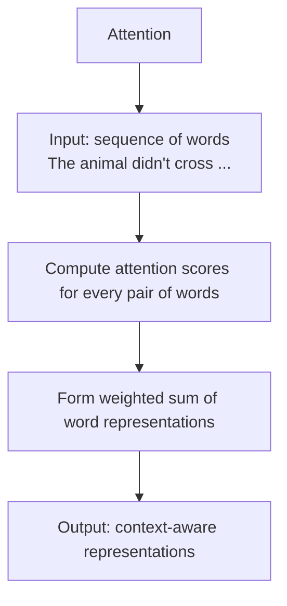
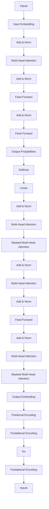
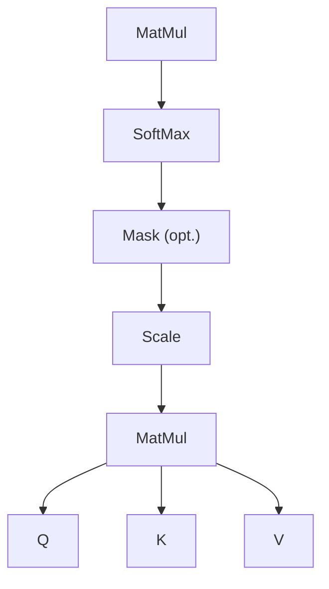
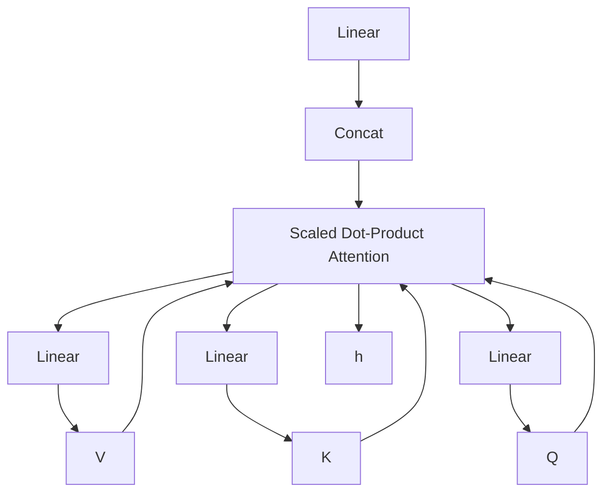
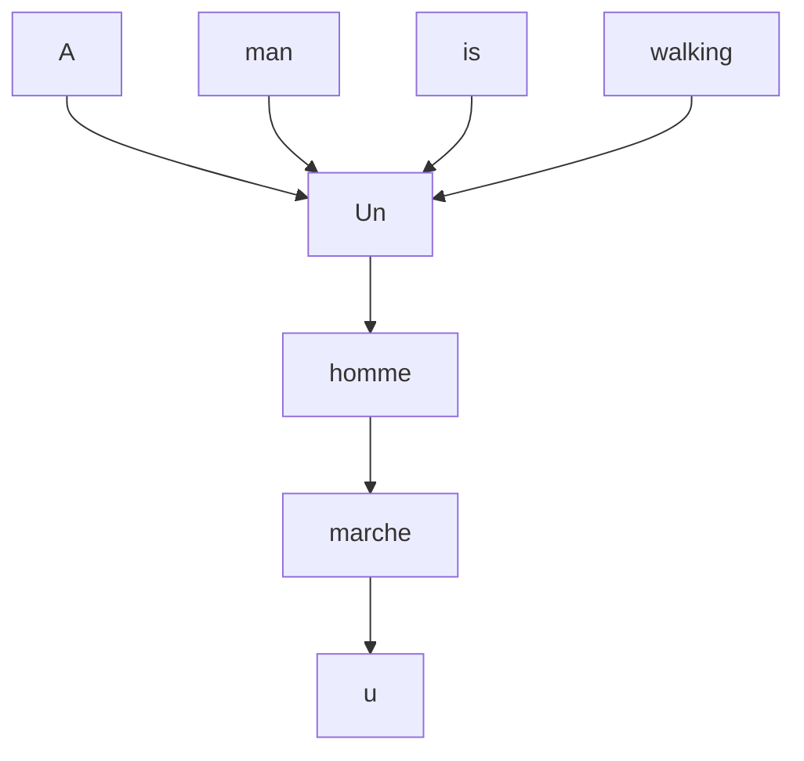

# Deep Learning

# Transformer network

Jan Platoš, Radek Svoboda

May 5, 2026

Department of Computer Science

Faculty of Electrical Engineering and Computer Science

VŠB - Technical University of Ostrava

## Transformer network

- Recurrent neural network works in synchronized serial way.  
- This prevent efficient computation in parallel.  
- The attention-mechanism looks at an input sequence and decides at each step which other parts of the sequence are important.  
- The attention mechanism helps the decoder to focus on the important part of the input sequence.

## Transformer network - Attention- What it is?

- Allows the model to focus on relevant parts of the input when processing each word.  
- Inspired by how humans read – we don't process all words equally.  
- For each word:

• Computes how much attention it should pay to every other word in the sentence.  
- Creates a weighted sum of all word representations.

\- Output: a context-aware representation of each word in the sentence.


<details>
<summary>flowchart</summary>


</details>

• Each input word is projected into three vectors:

- Query (Q) – What we are looking for.  
• Key (K) – What each word offers.  
- Value (V) – The content/information of each word.

\- For each word, compute attention weights:

$$
\text { Attention } (Q, K, V) = \text { softmax } \left(\frac {Q K ^ {T}}{\sqrt {d _ {k}}}\right) V
$$

\- The result is a new representation that captures the context of the word.

Self-Attention Heatmap  


<details>
<summary>heatmap</summary>

| Words attended to | The | animal | didn't | cross | the | street |
|---|---|---|---|---|---|---|
| The | 0.2 | 0.3 | 0.1 | 0.1 | 0.2 | 0.1 |
| animal | 0.1 | 0.4 | 0.2 | 0.1 | 0.1 | 0.1 |
| didn't | 0.1 | 0.2 | 0.4 | 0.1 | 0.1 | 0.1 |
| words crossing | 0.1 | 0.1 | 0.1 | 0.4 | 0.2 | 0.1 |
| the | 0.1 | 0.2 | 0.1 | 0.2 | 0.3 | 0.1 |
| street | 0.1 | 0.1 | 0.2 | 0.2 | 0.1 | 0.3 |
</details>


<details>
<summary>heatmap</summary>

| | The agreement on the European Economic Area was signed in August 1992 |
|---|---|
| L' | |
| accord | (not labeled) |
| sur | (not labeled) |
| la | (not labeled) |
| zone | (not labeled) |
| économique | (not labeled) |
| européenne | (not labeled) |
| a | (not labeled) |
| été | (not labeled) |
| signé | (not labeled) |
| en | (not labeled) |
| août | (not labeled) |
| 1992 | (not labeled) |
| . | (not labeled) |
| <end> | (not labeled) |
</details>

- The attention allows you to look at the totality of a sentence to make connections between any particular word and its relevant context.  
- For each input that the LSTM (Encoder) reads, the attention-mechanism takes into account several other inputs at the same time and decides which ones are important by attributing different weights to those inputs.  
- The Decoder will then take as input the encoded sentence and the weights provided by the attention-mechanism.

- Transformer is a novel architecture that utilize Attention to process Sequence2Sequence tasks.  
- It consist on Encoder and Decoder but they are not based on the recurrent connections.  
- Encoder and Decoder are composed of modules that can be stacked on top of each other multiple times (Nx).


<details>
<summary>flowchart</summary>


</details>

Figure 1: The Transformer - model architecture.

## Transformer network - Positional encoding- What is?

- Transformers do not have recurrence or convolution.  
• Therefore, they have no built-in sense of word order.  
- Positional encoding injects information about the position of each token in the sequence.  
• These encodings are added to the input embeddings.  
- Uses sinusoidal functions to ensure unique and continuous position representation.

$$
\mathsf {P E} _ {(p o s, 2 i)} = \sin \left(\frac {p o s}{1 0 0 0 0 ^ {2 i / d _ {\mathrm{model}}}}\right)
$$

$$
\mathsf {P E} _ {(p o s, 2 i + 1)} = \cos \left(\frac {p o s}{1 0 0 0 0 ^ {2 i / d _ {\mathrm{model}}}}\right)
$$

- pos is the position in the sequence (e.g., 0, 1, 2, ...).  
- $i$ is the dimension index.  
- $d_{model}$ is the total dimension of the embedding vector.

Sinusoid absolute positional encoding  


<details>
<summary>heatmap</summary>

| input dimension | 0    | 1    | 2    | 3    | 4    | 5    | 6    | 7    | 8    | 9    | 10   | 11   |
| --------------- | ---- | ---- | ---- | ---- | ---- | ---- | ---- | ---- | ---- | ---- | ---- | ---- |
| 0               | -0.8 | -0.8 | -0.8 | -0.8 | -0.8 | -0.8 | -0.8 | -0.8 | -0.8 | -0.8 | -0.8 | -0.8 |
| 1               | -0.8 | -0.8 | -0.8 | -0.8 | -0.8 | -0.8 | -0.8 | -0.8 | -0.8 | -0.8 | -0.8 | -0.8 |
| 2               | -0.8 | -0.8 | -0.8 | -0.8 | -0.8 | -0.8 | -0.8 | -0.8 | -0.8 | -0.8 | -0.8 | -0.8 |
| 3               | -0.8 | -0.8 | -0.8 | -0.8 | -0.8 | -0.8 | -0.8 | -0.8 | -0.8 | -0.8 | -0.8 | -0.8 |
| 4               | -0.8 | -0.8 | -0.8 | -0.8 | -0.8 | -0.8 | -0.8 | -0.8 | -0.8 | -0.8 | -0.8 | -0.8 |
| 5               | -0.8 | -0.8 | -0.8 | -0.8 | -0.8 | -0.8 | -0.8 | -0.8 | -0.8 | -0.8 | -0.8 | -0.8 |
| 6               | -0.8 | -0.8 | -0.8 | -0.8 | -0.8 | -0.8 | -0.8 | -0.8 | -0.8 | -0.8 | -0.8 | -0.8 |
| 7               | -0.8 | -0.8 | -0.8 | -0.8 | -0.8 | -0.8 | -0.8 | -0.8 | -0.8 | -0.8 | -0.8 | -0.8 |
| 8               | -0.8 | -0.8 | -0.8 | -0.8 | -0.8 | -0.8 | -0.8 | -0.8 | -0.8 | -0.8 | -0.8 | -0.8 |
| 9               | -0.8 | -0.8 | -0.8 | -0.8 | -0.8 | -0.8 | -0.8 | -0.8 | -0.8 | -0.8 | -0.8 | -0.8 |
| 10              | -0.8 | -0.8 | -0.8 | -0.8 | -0.8 | -0.8 | -0.8 | -0.8 | -0.8 | -0.8 | -0.8 | -0.8 |
| 11              | -0.8 | -0.8 | -0.8 | -0.8 | -0.8 | -0.8 | -0.8 | -0.8 | -0.8 | -0.8 | -0.8 | -0.8 |
The data is a heatmap with a color scale ranging from ~-1 to ~1 for each row and column of the time step axis.
</details>

\- Sinusoidal functions are used to provide:

- Unique yet smoothly varying encoding for each position.  
- Ability to interpolate or generalize to longer sequences.  
- Simple mathematical patterns that can capture relative distances.

• Alternative: learned positional encodings

- Positional vectors are trainable.  
- More flexible, but limited to sequence lengths seen during training.

\- Without PE:

\- Model loses word order completely (e.g., “dog bites man” = “man bites dog”).

Sinusoidal Positional Encoding  


<details>
<summary>heatmap</summary>

| Position | 0 | 1 | 2 | 3 | 4 | 5 | 6 | 7 | 8 | 9 | 10 | 11 | 12 | 13 | 14 | 15 |
| --- | --- | --- | --- | --- | --- | --- | --- | --- | --- | --- | --- | --- | --- | --- | --- | --- |
| 48 | Low | Low | Low | Low | Low | Low | Low | Low | Low | Low | Low | Low | Low | Low | Low | Low |
| 45 | Low | Low | Low | Low | Low | Low | Low | Low | Low | Low | Low | Low | Low | Low | Low | Low |
| 39 | Low | Low | Low | Low | Low | Low | Low | Low | Low | Low | Low | Low | Low | Low | Low | Low |
| 36 | Low | Low | Low | Low | Low | Low | Low | Low | Low | Low | Low | Low | Low | Low | Low | Low |
| 33 | Low | Low | Low | Low | Low | Low | Low | Low | Low | Low | Low | Low | Low | Low | Low | Low |
| 30 | Low | Low | Low | Low | Low | Low | Low | Low | Low | Low | Low | Low | Low | Low | Low | Low |
</details>

Learned Positional Encoding (simulated)  


<details>
<summary>heatmap</summary>

| Position | 0 | 1 | 2 | 3 | 4 | 5 | 6 | 7 | 8 | 9 | 10 | 11 | 12 | 13 | 14 | 15 |
| --- | --- | --- | --- | --- | --- | --- | --- | --- | --- | --- | --- | --- | --- | --- | --- | --- |
| 0 | Blue | Orange | Light Blue | Red | Light Blue | Light Blue | Light Blue | Red | Light Blue | Dark Blue | Light Blue | Light Blue | Light Blue | Light Blue | Light Blue | Light Blue |
| 1 | Blue | Orange | Light Blue | Red | Light Blue | Light Blue | Light Blue | Red | Light Blue | Dark Blue | Light Blue | Light Blue | Light Blue | Light Blue | Light Blue | Light Blue |
| 2 | Dark Blue | Orange | Light Blue | Red | Light Blue | Light Blue | Light Blue | Red | Light Blue | Dark Blue | Light Blue | Light Blue | Light Blue | Light Blue | Light Blue | Light Blue |
| 3 | Orange | Orange | Light Blue | Red | Light Blue | Light Blue | Light Blue | Red | Light Blue | Dark Blue | Light Blue | Light Blue | Light Blue | Light Blue | Light Blue | Light Blue |
| 4 | Orange | Orange | Light Blue | Red | Light Blue | Light Blue | Light Blue | Red | Light Blue | Dark Blue | Light Blue | Light Blue | Light Blue | Light Blue | Light Blue | Light Blue |
| 5 | Medium Blue | Orange | Light Blue | Red | Light Blue | Light Blue | Light Blue | Red | Light Blue | Dark Blue | Light Blue | Light Blue | Light Blue | Light Blue | Light Blue | Light Blue |
| 6 | Medium Orange | Orange | Light Blue | Red | Light Blue | Light Blue | Light Blue | Red | Light Blue | Dark Blue | Light Blue | Light Blue | Light Blue | Light Blue | Light Blue | Light Blue |
</details>

- Instead of computing attention once, we do it in parallel multiple times (heads).  
• Each head learns different projections of Q, K, V with its own parameters:

$$
\text { head } _ {i} = \text { Attention } (Q W _ {i} ^ {Q}, K W _ {i} ^ {K}, V W _ {i} ^ {V})
$$

\- All heads are concatenated and projected again:

$$
\operatorname{MultiHead} (Q, K, V) = \operatorname{Concat} \left(\operatorname{head} _ {1}, \dots , \operatorname{head} _ {h}\right) W ^ {O}
$$

\- This allows the model to jointly attend to information from different representation subspaces.

Scaled Dot-Product Attention  


<details>
<summary>flowchart</summary>


</details>

Multi-Head Attention  


<details>
<summary>flowchart</summary>


</details>

Figure 2: (left) Scaled Dot-Product Attention. (right) Multi-Head Attention consists of several attention layers running in parallel.

- Multi-head attention = multiple attention mechanisms in parallel.  
• Each head uses its own learned projection matrices:

$$
Q W _ {i} ^ {Q}, \quad K W _ {i} ^ {K}, \quad V W _ {i} ^ {V}
$$

- Different heads can focus on different types of relationships (e.g. syntax, semantics).  
- The outputs of all heads are concatenated and linearly projected:

$$
\operatorname{Concat} \left(\text {head} _ {1}, \dots , \text {head} _ {h}\right) W ^ {0}
$$

\- Encoder and decoder use multi-head attention differently:

- Encoder: attends to all positions in the input.  
- Decoder: attends to previous positions (masked).  
- Encoder-decoder: decoder attends to encoder output.

## Training a Transformer (Seq2Seq model):

- Uses teacher forcing – the true previous output is fed into the decoder.  
- The target sequence is right-shifted by one position.  
- A <sos> token is added at the beginning, and <eos> at the end.  
- A causal mask ensures decoder only sees previous positions.  
- Loss is computed between decoder output and original target sequence.

- The target sequence is right-shifted to prevent the model from copying input.  
- A <sos> token is added at the beginning, and <eos> at the end.  
- A causal mask ensures that each decoder step sees only previous tokens.  
- The loss is computed against the original (unshifted) target sequence.

## Inference – autoregressive decoding:

1. Input the full encoder sequence.  
2. Start decoder with <sos> token.  
3. Predict the first output token.  
4. Append it to the decoder input and repeat.  
5. Stop when the model predicts <eos>.

At each step, the decoder sees its own past outputs and the encoder context.

Transformer Inference (Autoregressive Decoding)  


<details>
<summary>flowchart</summary>


</details>

• BERT - Bidirectional Encoder Representations from Transformers.  
- Uses a Transformer-based network with pre-trained deep bidirectional representations from unlabeled text by jointly conditioning on both left and right context in all layers.  
- BERT makes use of Transformer, an attention mechanism that learns contextual relations between words (or sub-words) in a text.  
- Transformer includes two separate mechanisms — an encoder that reads the text input and a decoder that produces a prediction for the task. Since BERT's goal is to generate a language model, only the encoder mechanism is necessary.

- As opposed to directional models, which read the text input sequentially (left-to-right or right-to-left), the Transformer encoder reads the entire sequence of words at once.  
- Therefore it is considered bidirectional, though it would be more accurate to say that it's non-directional. This characteristic allows the model to learn the context of a word based on all of its surroundings (left and right of the word).  
- The input is a sequence of tokens, which are first embedded into vectors and then processed in the neural network.  
- The output is a sequence of vectors of size H, in which each vector corresponds to an input token with the same index.  
- When training language models, there is a challenge of defining a prediction goal.


<details>
<summary>flowchart</summary>

```mermaid
graph TD
  A["Embedding"] --> B["W1"]
  A --> C["W2"]
  A --> D["W3"]
  A --> E["[MASK"]]
  A --> F["W5"]
  B --> G["W1"]
  C --> H["W2"]
  D --> I["W3"]
  E --> J["W4"]
  F --> K["W5"]
  L["Embedding to vocab + softmax"] --> M["Classification Layer: Fully-connected layer + GELU + Norm"]
  M --> N["O1"]
  M --> O["O2"]
  M --> P["O3"]
  M --> Q["O4"]
  M --> R["O5"]
  N --> S["Transformer encoder"]
  O --> S
  P --> S
  Q --> S
  R --> S
```
</details>

- Before feeding word sequences into BERT, 15% of the words in each sequence are replaced with a [MASK] token.  
- The model then attempts to predict the original value of the masked words, based on the context provided by the other, non-masked, words in the sequence.  
- In technical terms, the prediction of the output words requires:

1. Adding a classification layer on top of the encoder output.  
2. Multiplying the output vectors by the embedding matrix, transforming them into the vocabulary dimension.  
3. Calculating the probability of each word in the vocabulary with softmax.

\- The BERT loss function takes into consideration only the prediction of the masked values and ignores the prediction of the non-masked words.

- In the BERT training process, the model receives pairs of sentences as input and learns to predict if the second sentence in the pair is the subsequent sentence in the original document.  
- During training, 50% of the inputs are a pair in which the second sentence is the subsequent sentence in the original document, while in the other 50% a random sentence from the corpus is chosen as the second sentence.  
- The assumption is that the random sentence will be disconnected from the first sentence.

\- To help the model distinguish between the two sentences in training, the input is processed in the following way before entering the model:

1. A [CLS] token is inserted at the beginning of the first sentence and a [SEP] token is inserted at the end of each sentence.  
2. A sentence embedding indicating Sentence A or Sentence B is added to each token. Sentence embeddings are similar in concept to token embeddings with a vocabulary of 2.  
3. A positional embedding is added to each token to indicate its position in the sequence. The concept and implementation of positional embedding are presented in the Transformer paper.

<table><tr><td rowspan="2">Input</td><td colspan="6">[MASK]</td><td colspan="5">[MASK]</td></tr><tr><td>[CLS]</td><td>my</td><td>dog</td><td>is</td><td>cute</td><td>[SEP]</td><td>he</td><td>likes</td><td>play</td><td>##ing</td><td>[SEP]</td></tr><tr><td>Token Embeddings</td><td> $E_{[CLS]}$ </td><td> $E_{my}$ </td><td> $E_{[MASK]}$ </td><td> $E_{is}$ </td><td> $E_{cute}$ </td><td> $E_{[SEP]}$ </td><td> $E_{he}$ </td><td> $E_{[MASK]}$ </td><td> $E_{play}$ </td><td> $E_{##ing}$ </td><td> $E_{[SEP]}$ </td></tr><tr><td rowspan="2">Sentence Embedding</td><td>+</td><td>+</td><td>+</td><td>+</td><td>+</td><td>+</td><td>+</td><td>+</td><td>+</td><td>+</td><td>+</td></tr><tr><td> $E_A$ </td><td> $E_A$ </td><td> $E_A$ </td><td> $E_A$ </td><td> $E_A$ </td><td> $E_A$ </td><td> $E_B$ </td><td> $E_B$ </td><td> $E_B$ </td><td> $E_B$ </td><td> $E_B$ </td></tr><tr><td rowspan="2">Transformer Positional Embedding</td><td>+</td><td>+</td><td>+</td><td>+</td><td>+</td><td>+</td><td>+</td><td>+</td><td>+</td><td>+</td><td>+</td></tr><tr><td> $E_0$ </td><td> $E_1$ </td><td> $E_2$ </td><td> $E_3$ </td><td> $E_4$ </td><td> $E_5$ </td><td> $E_6$ </td><td> $E_7$ </td><td> $E_8$ </td><td> $E_9$ </td><td> $E_{10}$ </td></tr></table>

\- To predict if the second sentence is indeed connected to the first, the following steps are performed:

1. The entire input sequence goes through the Transformer model.  
2. The output of the [CLS] token is transformed into a $2 \times 1$ shaped vector, using a simple classification layer (learned matrices of weights and biases).  
3. Calculating the probability of IsNextSequence with softmax.

\- When training the BERT model, Masked LM and Next Sentence Prediction are trained together, with the goal of minimizing the combined loss function of the two strategies.

## Transformer network - BERT - How to use BERT (Fine-tuning)

\- BERT can be used for a wide variety of language tasks, while only adding a small layer to the core model:

1. Classification tasks such as sentiment analysis are done similarly to Next Sentence classification, by adding a classification layer on top of the Transformer output for the [CLS] token.  
2. In Question Answering tasks (e.g. SQuAD v1.1), the software receives a question regarding a text sequence and is required to mark the answer in the sequence. Using BERT, a Q&A model can be trained by learning two extra vectors that mark the beginning and the end of the answer.  
3. In Named Entity Recognition (NER), the software receives a text sequence and is required to mark the various types of entities (Person, Organization, Date, etc) that appear in the text. Using BERT, a NER model can be trained by feeding the output vector of each token into a classification layer that predicts the NER label.

1. What is a Transformer? by Maxime,  
https://medium.com/inside-machine-learning/  
what-is-a-transformer-d07dd1fbec04

2. A Beginner's Guide to Attention Mechanisms and Memory Networks https://wiki.pathmind.com/attention-mechanism-memory-network

3. What is Teacher Forcing for Recurrent Neural Networks? by Jason Brownlee https://machinelearningmastery.com/ teacher-forcing-for-recurrent-neural-networks/

4. Positional Encoding: Everything You Need to Know by Darjan Salaj
https://www.inovex.de/de/blog/
positional-encoding-everything-you-need-to-know

## Transformer network - References ii

5. Luong, Minh-Thang, Hieu Pham, and Christopher D. Manning. "Effective approaches to attention-based neural machine translation." arXiv preprint arXiv:1508.04025 (2015).  
6. Devlin, Jacob, et al. "Bert: Pre-training of deep bidirectional transformers for language understanding." arXiv preprint arXiv:1810.04805 (2018).  
7. BERT Explained: State of the art language model for NLP by Rani Horev
https://towardsdatascience.com/
bert-explained-state-of-the-art-language-model-for-nlp-f8b21a  
8. Understanding BERT Transformer: Attention isn't all you need by Damien Sileo https://medium.com/synapse-dev/understanding-bert-transformer-attention-isnt-all-you-need-58

## Questions?