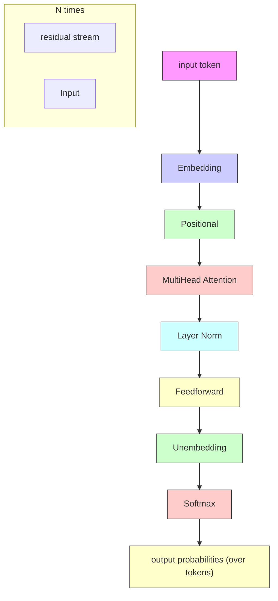
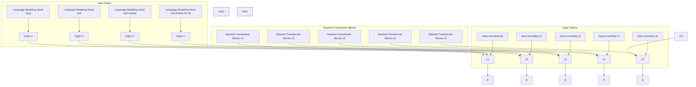
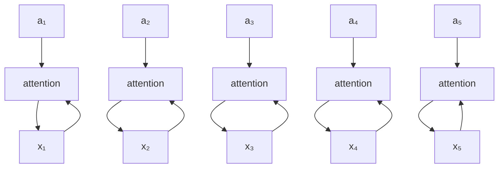
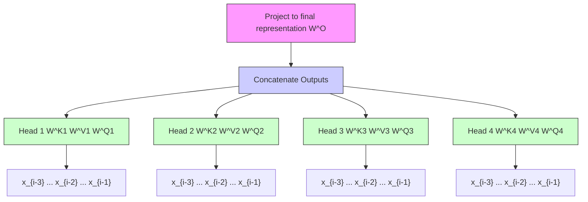
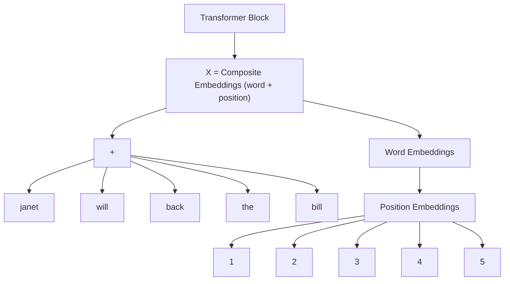
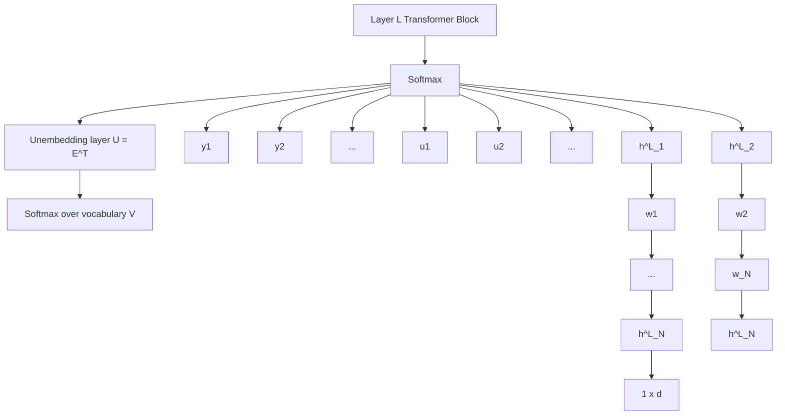
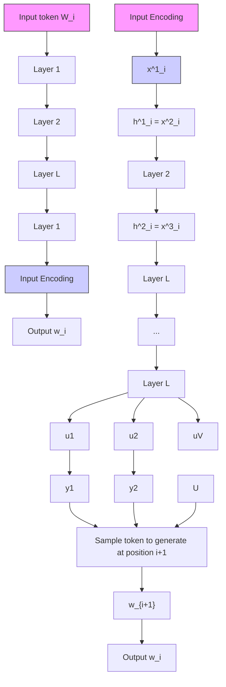
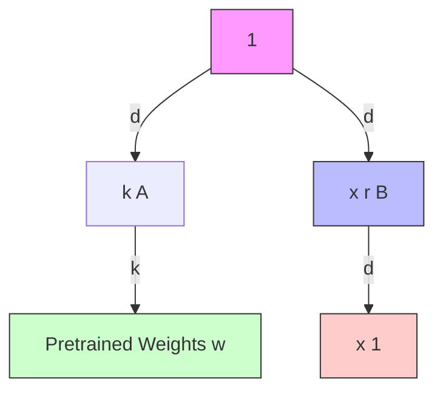
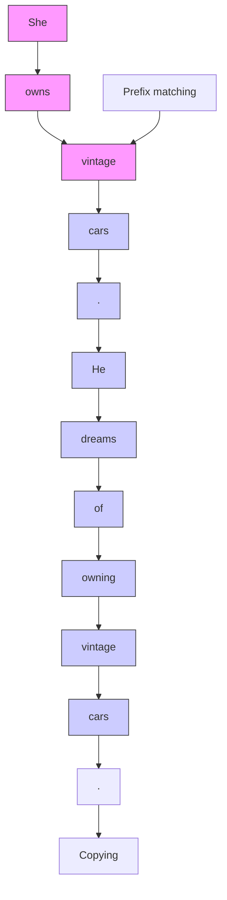

## CHAPTER

## 8

## Transformers

"The true art of memory is the art of attention"

Samuel Johnson, Idler #74, September 1759

In this chapter we introduce the transformer, the standard architecture for building large language models. As we discussed in the prior chapter, transformer-based large language models have completely changed the field of speech and language processing. Indeed, every subsequent chapter in this textbook will make use of them. As with the previous chapter, we'll focus for this chapter on the use of transformers to model left-to-right (sometimes called causal or autoregressive) language modeling, in which we are given a sequence of input tokens and predict output tokens one by one by conditioning on the prior context.


<details>
<summary>flowchart</summary>


</details>

Figure 8.1 A transformer decoder for language modeling, showing the residual stream for processing an input token. A single token is embedded and passed forward in the network, with the feedforward and attention components adding information. The multihead attention layer takes inputs (not shown in detail) from the neighboring token streams. This is thus one column of an autoregressive transformer language model, taking an input token and outputting a distribution over next tokens.

Fig. 8.1 sketches the transformer architecture following a single token as it is passes up through the layers of the network. Each token is first converted to an embedding from the embedding matrix E. Recall from Chapter 6 in Section ?? that E is a linear layer that maps a token id to a vector embedding representing that token. Each token in the vocabulary has an initial embedding representation in E.

Transformers also have a special mechanism for encoding the position/index of the token in the input string, which is simply added to the embedding. The resulting embedding represents both the word and its position. and is then passed through a set of N transformer blocks.

It's common to think of each of these transformer blocks as part of a stream in which the input embedding is directly passed up to the output, while simultaneously being enriched by the application of various processing modules: the multi-head attention layer, feedforward networks and the layer normalization. The value of the stream at any layer is the sum of the original embedding and all the outputs from all the previous layers and blocks.

The core intuition of the transformer, and the component that distinguishes it from the feedforward layers we saw in Chapter 6, is this multi-head attention layer, also called a self-attention layer. Attention can be thought of as a way to build contextual representations of a token's meaning by attending to and integrating information from surrounding tokens, helping the model learn how tokens relate to each other over large spans. It can also be thought of as a way to move information from one residual stream to another, augmenting the stream at one token position with information from another token position.

After the $N$ transformer blocks we take the output embedding that is produced by the final transformer block, pass it through an linear unembedding matrix $\mathbf{U}$ and then a softmax over the vocabulary to generate a distribution over possible next tokens. These last two components (the unembedding matrix and the softmax) are sometimes called the language modeling head. In the rest of this chatper we'll introduce attention and the rest of these modules in more detail.

Fig. ?? shows the transformer architecture applied to a context window with the words So long and thanks for, showing at each token position what is the most likely token to be generated. In this full figure, the set of N blocks maps an entire context window of input vectors $(\mathbf{x}_{1},..., \mathbf{x}_{n})$ to a window of output vectors $(\mathbf{h}_{1},..., \mathbf{h}_{n})$ of the same length. A column might contain from 12 to 96 or more stacked blocks. The arrows in the figure show how information from the hidden representations of preceding tokens is incorporated into the transformer block.

Transformer-based language models are complex, and so the details will unfold over this chapter and the next few chapters. Chapter 7 already discussed how language models are pretrained, and how tokens are generated via sampling. In the rest of this chapter we'll introduce multi-head attention, the rest of the transformer block, and the input encoding and language modeling head components of the transformer. Chapter 9 introduces masked language modeling and the BERT family of bidirectional transformer encoder models. Chapter 10 shows how to instruction-tune language models to perform NLP tasks, and how to align the model with human preferences. Chapter 12 will introduce machine translation with the encoder-decoder architecture. And we'll see application of the transformer to speech recognition, as well as further use of the encoder-decoder architecture, in Chapter 15.

## 8.1 Attention

Recall from Chapter 5 that for word2vec and other static embeddings, the representation of a word's meaning is always the same vector irrespective of the context: the word chicken, for example, is always represented by the same fixed vector. So a static vector for the word it might somehow encode that this is a pronoun used for animals and inanimate entities. But in context it has a much richer meaning. Consider it in one of these two sentences:


<details>
<summary>flowchart</summary>


</details>

Figure 8.2 The architecture of a (left-to-right) transformer, showing how each input token get encoded, passed through a set of stacked transformer blocks, and then a language model head that predicts the next token. The embeddings at each token position in the residual stream are passed up the stack, and the arrows in the figure shows how information from the hidden representations of preceding tokens are also incorporated.

(8.1) The chicken didn't cross the road because it was too tired.

(8.2) The chicken didn't cross the road because it was too wide.

In (8.1) it is the chicken (i.e., the reader knows that the chicken was tired), while in (8.2) it is the road (and the reader knows that the road was wide). $^{1}$ That is, if we are to compute the meaning of this sentence, we'll need the meaning of it to be associated with the chicken in the first sentence and associated with the road in the second one, sensitive to the context.

Furthermore, consider reading left to right like a causal language model, processing the sentence up to the word it:

(8.3) The chicken didn't cross the road because it

At this point we don't yet know which thing it is going to end up referring to! So a representation of it at this point might have aspects of both chicken and road as the reader is trying to guess what happens next.

This fact that words have rich linguistic relationships with other words that may be far away pervades language. Consider two more examples:

(8.4) The keys to the cabinet are on the table.

(8.5) I walked along the pond, and noticed one of the trees along the bank.

In (8.4), the phrase The keys is the subject of the sentence, and in English and many languages, must agree in grammatical number with the verb are; in this case both are plural. In English we can't use a singular verb like is with a plural subject like keys (we'll discuss agreement more in Chapter 18). In (8.5), we know that bank refers to the side of a pond or river and not a financial institution because of the context, including words like pond. (We'll discuss word senses more in Chapter 9.)

contextual embeddings

The point of all these examples is that these contextual words that help us compute the meaning of words in context can be quite far away in the sentence or paragraph. Transformers can build contextual representations of word meaning, contextual embeddings, by integrating the meaning of these helpful contextual words. In a transformer, layer by layer, we build up richer and richer contextualized representations of the meanings of input tokens. At each layer, we compute the representation of a token i by combining information about i from the previous layer with information about the neighboring tokens to produce a contextualized representation for each word at each position.

Attention is the mechanism in the transformer that weighs and combines the representations from appropriate other tokens in the context from layer k to build the representation for tokens in layer $k + 1$ .


<details>
<summary>bar chart</summary>

columns corresponding to input tokens
| Layer | Token | Token Description |
| :--- | :--- | :--- |
| Layer k+1 | The | The |
| Layer k+1 | chicken | chicken |
| Layer k+1 | didn't | didn't |
| Layer k+1 | cross | cross |
| Layer k+1 | the | the |
| Layer k+1 | road | road |
| Layer k+1 | because | because |
| Layer k+1 | it | it |
| self-attention distribution | the | the |
| self-attention distribution | chicken | chicken |
| self-attention distribution | didn't | didn't |
| self-attention distribution | cross | cross |
| self-attention distribution | the | the |
| self-attention distribution | road | road |
| self-attention distribution | because | because |
| self-attention distribution | it | it |
| self-attention distribution | was | was |
| self-attention distribution | too | too |
| self-attention distribution | tired | tired |
columns corresponding to input tokens
</details>

Figure 8.3 The self-attention weight distribution $\alpha$ that is part of the computation of the representation for the word $it$ at layer $k + 1$ . In computing the representation for $it$ , we attend differently to the various words at layer $k$ , with darker shades indicating higher self-attention values. Note that the transformer is attending highly to the columns corresponding to the tokens chicken and road, a sensible result, since at the point where $it$ occurs, it could plausibly corefer with the chicken or the road, and hence we'd like the representation for $it$ to draw on the representation for these earlier words. Figure adapted from Uszkoreit (2017).

Fig. 8.3 shows a schematic example simplified from a transformer (Uszkoreit, 2017). The figure describes the situation when the current token is it and we need to compute a contextual representation for this token at layer $k+1$ of the transformer, drawing on the representations (from layer k) of every prior token. The figure uses color to represent the attention distribution over the contextual words: the tokens chicken and road both have a high attention weight, meaning that as we are computing the representation for it, we will draw most heavily on the representation for chicken and road. This will be useful in building the final representation for it, since it will end up coreferring with either chicken or road.

Let's now turn to how this attention distribution is represented and computed.

## 8.1.1 Attention more formally

As we've said, the attention computation is a way to compute a vector representation for a token at a particular layer of a transformer, by selectively attending to and integrating information from prior tokens at the previous layer. Attention takes an input representation $x_{i}$ corresponding to the input token at position i, and a context window of prior inputs $x_{1}..x_{i-1}$ , and produces an output $a_{i}$ .

In causal, left-to-right language models, the context is any of the prior words. That is, when processing $x_{i}$ , the model has access to $x_{i}$ as well as the representations of all the prior tokens in the context window (context windows consist of thousands of tokens) but no tokens after i. (By contrast, in Chapter 9 we’ll generalize attention so it can also look ahead to future words.)

Fig. 8.4 illustrates this flow of information in an entire causal self-attention layer, in which this same attention computation happens in parallel at each token position i. Thus a self-attention layer maps input sequences $(\mathbf{x}_{1},..., \mathbf{x}_{n})$ to output sequences of the same length $(\mathbf{a}_{1},..., \mathbf{a}_{n})$ .


<details>
<summary>flowchart</summary>


</details>

Figure 8.4 Information flow in causal self-attention. When processing each input $x_{i}$ , the model attends to all the inputs up to, and including $x_{i}$ .

Simplified version of attention At its heart, attention is really just a weighted sum of context vectors, with a lot of complications added to how the weights are computed and what gets summed. For pedagogical purposes let's first describe a simplified intuition of attention, in which the attention output $\mathbf{a}_i$ at token position $i$ is simply the weighted sum of all the representations $\mathbf{x}_j$ , for all $j \leq i$ ; we'll use $\alpha_{ij}$ to mean how much $\mathbf{x}_j$ should contribute to $\mathbf{a}_i$ :

$$
\text { Simplified   version: } \quad \mathbf {a} _ {i} = \sum_ {j \leq i} \alpha_ {i j} \mathbf {x} _ {j} \tag {8.6}
$$

Each $\alpha_{ij}$ is a scalar used for weighing the value of input $\mathbf{x}_j$ when summing up the inputs to compute $\mathbf{a}_i$ . How shall we compute this $\alpha$ weighting? In attention we weight each prior embedding proportionally to how similar it is to the current token $i$ . So the output of attention is a sum of the embeddings of prior tokens weighted by their similarity with the current token embedding. We compute similarity scores via dot product, which maps two vectors into a scalar value ranging from $-\infty$ to $\infty$ . The larger the score, the more similar the vectors that are being compared. We'll normalize these scores with a softmax to create the vector of weights $\alpha_{ij}, j \leq i$ .

$$
\text { Simplified   Version: } \quad \operatorname{score} (\mathbf {x} _ {i}, \mathbf {x} _ {j}) = \mathbf {x} _ {i} \cdot \mathbf {x} _ {j} \tag {8.7}
$$

$$
\alpha_ {i j} = \text { softmax } (\text { score } (\mathbf {x} _ {i}, \mathbf {x} _ {j})) \forall j \leq i \tag {8.8}
$$

Thus in Fig. 8.4 we compute $a_{3}$ by computing three scores: $x_{3} \cdot x_{1}$ , $x_{3} \cdot x_{2}$ and $x_{3} \cdot x_{3}$ , normalizing them by a softmax, and using the resulting probabilities as weights indicating each of their proportional relevance to the current position i. Of course, the softmax weight will likely be highest for $x_{i}$ , since $x_{i}$ is very similar to itself, resulting in a high dot product. But other context words may also be similar to i, and the softmax will also assign some weight to those words. Then we use these weights as the $\alpha$ values in Eq. 8.6 to compute the weighted sum that is our $a_{3}$ .

The simplified attention in equations 8.6 - 8.8 demonstrates the attention-based approach to computing $\mathbf{a}_i$ : compare the $\mathbf{x}_i$ to prior vectors, normalize those scores into a probability distribution used to weight the sum of the prior vectors. But now we're ready to remove the simplifications.

attention head
head

A single attention head using query, key, and value matrices Now that we've seen a simple intuition of attention, let's introduce the actual attention head, the version of attention that's used in transformers. (The word head is often used in transformers to refer to specific structured layers). The attention head allows us to distinctly represent three different roles that each input embedding plays during the course of the attention process:

query
key
value

- As the current element being compared to the preceding inputs. We'll refer to this role as a query.  
- In its role as a preceding input that is being compared to the current element to determine a similarity weight. We'll refer to this role as a key.  
- And finally, as a value of a preceding element that gets weighted and summed up to compute the output for the current element.

To capture these three different roles, transformers introduce weight matrices $W^{Q}$ , $W^{K}$ , and $W^{V}$ . These weights will project each input vector $x_{i}$ into a representation of its role as a query, key, or value:

$$
\mathbf {q} _ {i} = \mathbf {x} _ {i} \mathbf {W} ^ {\mathrm{Q}}; \quad \mathbf {k} _ {i} = \mathbf {x} _ {i} \mathbf {W} ^ {\mathrm{K}}; \quad \mathbf {v} _ {i} = \mathbf {x} _ {i} \mathbf {W} ^ {\mathrm{V}} \tag {8.9}
$$

Given these projections, when we are computing the similarity of the current element $\mathbf{x}_i$ with some prior element $\mathbf{x}_j$ , we'll use the dot product between the current element's query vector $\mathbf{q}_i$ and the preceding element's key vector $\mathbf{k}_j$ . Furthermore, the result of a dot product can be an arbitrarily large (positive or negative) value, and exponentiating large values can lead to numerical issues and loss of gradients during training. To avoid this, we scale the dot product by a factor related to the size of the embeddings, via dividing by the square root of the dimensionality of the query and key vectors $(d_k)$ . We thus replace the simplified Eq. 8.7 with Eq. 8.11. The ensuing softmax calculation resulting in $\alpha_{ij}$ remains the same, but the output calculation for $\textbf{head}_i$ is now based on a weighted sum over the value vectors $\mathbf{v}$ (Eq. 8.13).

Here's a final set of equations for computing self-attention for a single self-attention output vector $\mathbf{a}_i$ from a single input vector $\mathbf{x}_i$ . This version of attention computes $\mathbf{a}_i$ by summing the values of the prior elements, each weighted by the similarity of its key to the query from the current element:

$$
\mathbf {q} _ {i} = \mathbf {x} _ {i} \mathbf {W} ^ {\mathrm{Q}}; \quad \mathbf {k} _ {j} = \mathbf {x} _ {j} \mathbf {W} ^ {\mathrm{K}}; \quad \mathbf {v} _ {j} = \mathbf {x} _ {j} \mathbf {W} ^ {\mathrm{V}} \tag {8.10}
$$

$$
\operatorname{score} (\mathbf {x} _ {i}, \mathbf {x} _ {j}) = \frac {\mathbf {q} _ {i} \cdot \mathbf {k} _ {j}}{\sqrt {d _ {k}}} \tag {8.11}
$$

$$
\alpha_ {i j} = \text { softmax } (\text { score } (\mathbf {x} _ {i}, \mathbf {x} _ {j})) \forall j \leq i \tag {8.12}
$$

$$
\mathbf {h e a d} _ {i} = \sum_ {j \leq i} \alpha_ {i j} \mathbf {v} _ {j} \tag {8.13}
$$

$$
\mathbf {a} _ {i} = \text {   head } _ {i} \mathbf {W} ^ {\mathrm{O}} \tag {8.14}
$$

We illustrate this in Fig. 8.5 for the case of calculating the value of the third output $a_{3}$ in a sequence.

Note that we've also introduced one more matrix, $\mathbf{W}_{\mathbf{O}}$ , which is left-multiplied by the attention head. This is necessary to reshape the output of the head. The input to attention $\mathbf{x}_{\mathbf{i}}$ and the output from attention $\mathbf{a}_{\mathbf{i}}$ both have the same dimensionality $[1\times d]$ . We often call $d$ the model dimensionality, and indeed as we'll discuss in


<details>
<summary>flowchart</summary>

```mermaid
graph TD
  A["1 x d"] --> B["×1 × dv"]
  C["2 x3's query with the keys for x1, x2, and x3"] --> D["×1 × dv"]
  E["3 x3"] --> F["×1 × dv"]
  G["4 x3"] --> H["×1 × dv"]
  I["5 x3"] --> J["×1 × dv"]
  K["6 x3"] --> L["×1 × dv"]
  M["7 x3"] --> N["×1 × dv"]
  O["8 x3"] --> P["Output of self-attention a₃ [1 × d"]]
  Q["9 x3"] --> R["W⁰ [dv × d"] [1 × dv]]
  S["10 x3"] --> T["Sum the weighted value vectors [1 × dv"]]
  U["11 x3"] --> V["α₃,₁ → α₃,₂ → α₃,₃"]
  W["12 x3"] --> X["α₃,₁ → α₃,₂ → α₃,₃"]
  Y["13 x3"] --> Z["α₃,₁ → α₃,₂ → α₃,₃"]
  AA["14 x3"] --> AB["α₃,₁ → α₃,₂ → α₃,₃"]
  AC["15 x3"] --> AD["α₃,₁ → α₃,₂ → α₃,₃"]
  AE["16 x3"] --> AF["α₃,₁ → α₃,₂ → α₃,₃"]
  AG["17 x3"] --> AH["α₃,₁ → α₃,₂ → α₃,₃"]
  AI["18 x3"] --> AJ["α₃,₁ → α₃,₂ → α₃,₃"]
  AK["19 x3"] --> AL["α₃,₁ → α₃,₂ → α₃,₃"]
  AM["20 x3"] --> AN["α₃,₁ → α₃,₂ → α₃,₃"]
  AO["21 x3"] --> AP["α₃,₁ → α₃,₂ → α₃,₃"]
  AQ["22 x3"] --> AR["α₃,₁ → α₃,₂ → α₃,₃"]
  AS["23 x3"] --> AT["α₃,₁ → α₃,₂ → α₃,₃"]
  AU["24 x3"] --> AV["α₃,₁ → α₃,₂ → α₃,₃"]
  AW["25 x3"] --> AX["α₃,₁ → α₃,₂ → α₃,₃"]
  AY["26 x3"] --> AZ["α₃,₁ → α₃,₂ → α₃,₃"]
  BA["27 x3"] --> BB["α₃,₁ → α₃,₂ → α₃,₃"]
  BC["28 x3"] --> BD["α₃,₁ → α₃,₂ → α₃,₃"]
  BE["29 x3"] --> BF["α₃,₁ → α₃,₂ → α₃,₃"]
  BG["30 x3"] --> BH["α₃,₁ → α₃,₂ → α₃,₃"]
  BI["31 x3"] --> BJ["α₃,₁ → α₃,₂ → α₃,₃"]
  BK["32 x3"] --> BL["α₃,₁ → α₃,₂ → α₃,₃"]
  BM["33 x3"] --> BN["α₃,₁ → α₃,₂ → α₃,₃"]
  BO["34 x3"] --> BP["α₃,₁ → α₃,₂ → α₃,₃"]
  BP --> BQ["X1: k q v W^K W^Q W^V X1: [1 × d"]]
    BX["X2: k q v W^K W^Q W^V X2: [1 × d"]]
    BY["X3: k q v W^K W^Q W^V X3: [1 × d"]]
```
</details>

Figure 8.5 Calculating the value of $\mathbf{a}_3$ , the third element of a sequence using causal (left-to-right) self-attention.

Section 8.2 the output $h_{i}$ of each transformer block, as well as the intermediate vectors inside the transformer block also have the same dimensionality $[1 \times d]$ . Having everything be the same dimensionality makes the transformer very modular.

So let's talk shapes. How do we get from $[1 \times d]$ at the input to $[1 \times d]$ at the output? Let's look at all the internal shapes. We'll have a dimension $d_k$ for the query and key vectors. The query vector and the key vector are both dimensionality $[1 \times d_k]$ , so we can take their dot product $\mathbf{q}_i \cdot \mathbf{k}_j$ to produce a scalar. We'll have a separate dimension $d_v$ for the value vectors. The transform matrix $\mathbf{W}^{\mathbf{Q}}$ has shape $[d \times d_k]$ , $\mathbf{W}^{\mathbf{K}}$ is $[d \times d_k]$ , and $\mathbf{W}^{\mathbf{V}}$ is $[d \times d_v]$ . So the output of $\mathbf{head}_i$ in equation Eq. 8.13 is of shape $[1 \times d_v]$ . To get the desired output shape $[1 \times d]$ we'll need to reshape the head output, and so $\mathbf{W}^{\mathbf{O}}$ is of shape $[d_v \times d]$ . In the original transformer work (Vaswani et al., 2017), $d$ was 512, $d_k$ and $d_v$ were both 64.

Multi-head Attention Equations 8.11-8.13 describe a single attention head. But actually, transformers use multiple attention heads. The intuition is that each head might be attending to the context for different purposes: heads might be specialized to represent different linguistic relationships between context elements and the current token, or to look for particular kinds of patterns in the context.

So in multi-head attention we have A separate attention heads that reside in parallel layers at the same depth in a model, each with its own set of parameters that allows the head to model different aspects of the relationships among inputs. Thus each head i in a self-attention layer has its own set of query, key, and value matrices: $W^{Qi}$ , $W^{Ki}$ , and $W^{Vi}$ . These are used to project the inputs into separate query, key, and value embeddings for each head.

When using multiple heads the model dimension d is still used for the input and output, the query and key embeddings have dimensionality $d_{k}$ , and the value embeddings are of dimensionality $d_{v}$ (again, in the original transformer paper $d_{k}=$

multi-head attention

$d_{v}=64, A=8,$ and $d=512$ ). Thus for each head $i$ , we have weight layers $\mathbf{W}^{\mathbf{Q}\mathbf{i}}$ of shape $[d\times d_{k}]$ , $\mathbf{W}^{\mathbf{K}\mathbf{i}}$ of shape $[d\times d_{k}]$ , and $\mathbf{W}^{\mathbf{V}\mathbf{i}}$ of shape $[d\times d_{v}]$ .

Below are the equations for attention augmented with multiple heads; Fig. 8.6 shows an intuition.

$$
\mathbf {q} _ {i} ^ {c} = \mathbf {x} _ {i} \mathbf {W} ^ {\mathbf {Q c}}; \quad \mathbf {k} _ {j} ^ {c} = \mathbf {x} _ {j} \mathbf {W} ^ {\mathbf {K c}}; \quad \mathbf {v} _ {j} ^ {c} = \mathbf {x} _ {j} \mathbf {W} ^ {\mathbf {V c}}; \quad \forall c 1 \leq c \leq A \tag {8.15}
$$

$$
\operatorname{score} ^ {c} (\mathbf {x} _ {i}, \mathbf {x} _ {j}) = \frac {\mathbf {q} _ {i} ^ {c} \cdot \mathbf {k} _ {j} ^ {c}}{\sqrt {d _ {k}}} \tag {8.16}
$$

$$
\alpha_ {i j} ^ {c} = \text { softmax } (\text { score } ^ {c} (\mathbf {x} _ {i}, \mathbf {x} _ {j})) \forall j \leq i \tag {8.17}
$$

$$
\mathbf {h e a d} _ {i} ^ {c} = \sum_ {j \leq i} \alpha_ {i j} ^ {c} \mathbf {v} _ {j} ^ {c} \tag {8.18}
$$

$$
\mathbf {a} _ {i} = \left(\mathbf {h e a d} ^ {1} \oplus \mathbf {h e a d} ^ {2} \dots \oplus \mathbf {h e a d} ^ {A}\right) \mathbf {W} ^ {O} \tag {8.19}
$$

$$
\text { MultiHeadAttention } (\mathbf {x} _ {i}, [ \mathbf {x} _ {1}, \dots , \mathbf {x} _ {i - 1} ]) = \mathbf {a} _ {i} \tag {8.20}
$$

Note in Eq. 8.20 that MultiHeadAttention is a function of the current input $\mathbf{x}_i$ , as well as all the other inputs. For the causal or left-to-right attention that we use in this chapter, the other inputs are only to the left, but we'll also see a version of attention in Chapter 9 where attention is a function of the tokens to the right as well. We'll return to this idea about causal inputs in Eq. 8.34 when we introduce the idea of masking the right context.

The output of each of the A heads is of shape $[1 \times d_{v}]$ , and so the output of the multi-head layer with A heads consists of A vectors of shape $[1 \times d_{v}]$ . These are concatenated to produce a single output with dimensionality $[1 \times Ad_{v}]$ . Then we use yet another linear projection $W^{0} \in R^{Ad_{v} \times d}$ to reshape it, resulting in the multi-head attention vector $a_{i}$ with the correct output shape $[1 \times d]$ at each input i.

## 8.2 Transformer Blocks

residual stream

The self-attention calculation lies at the core of what's called a transformer block, which, in addition to the self-attention layer, includes three other kinds of layers: (1) a feedforward layer, (2) residual connections, and (3) normalizing layers (colloquially called “layer norm”).

Fig. 8.7 illustrates a transformer block, sketching a common way of thinking about the block that is called the residual stream (Elhage et al., 2021). In the residual stream viewpoint, we consider the processing of an individual token i through the transformer block as a single stream of d-dimensional representations for token position i. This residual stream starts with the original input vector, and the various components read their input from the residual stream and add their output back into the stream.

The input at the bottom of the stream is an embedding for a token, which has dimensionality d. This initial embedding gets passed up (by residual connections), and is progressively added to by the other components of the transformer: the attention layer that we have seen, and the feedforward layer that we will introduce. Before the attention and feedforward layer is a computation called the layer norm.

Thus the initial vector is passed through a layer norm and attention layer, and the result is added back into the stream, in this case to the original input vector $x_{i}$ . And then this summed vector is again passed through another layer norm and a feedforward layer, and the output of those is added back into the residual, and we'll use $\mathbf{h}_i$ to refer to the resulting output of the transformer block for token $i$ .


<details>
<summary>flowchart</summary>


</details>

Figure 8.6 The multi-head attention computation for input $x_{i}$ , producing output $a_{i}$ . A multi-head attention layer has A heads, each with its own query, key, and value weight matrices. In this figure, we show A = 4, a smaller value than is usually used, just to fit on the page. The outputs from each of the heads are of shape $[1 \times d_{v}]$ and are concatenated and then projected into a different space by the $W_{0}$ matrix. Usually the dimensionality $d_{v}$ of the heads is set so that $d_{v} = d/A$ , with the result that $W_{0}$ is a square matrix of shape $[Ad_{v} \times d] = [d \times d]$ . usually of the same size, then projected d, thus producing an output of the same size as the input.

```mermaid
graph TD
  A["x_{i-2}"] --> B["MultiHead Attention"]
  C["x_{i-1}"] --> D["MultiHead Attention"]
  E["x_i"] --> F["MultiHead Attention"]
  G["h_i"] --> H["MultiHead Attention"]
  I["h_i"] --> J["MultiHead Attention"]
  K["Feedforward"] --> L["Layer Norm"]
  M["..."] --> N["..."]
  O["Layer Norm"] --> P["Layer Norm"]
  Q["+"] --> R["+"]
  S["+"] --> T["+"]
  U["+"] --> V["+"]
  W["+"] --> X["+"]
  Y["+"] --> Z["+"]
    style A fill:#f9f,stroke:#333
    style C fill:#f9f,stroke:#333
    style E fill:#f9f,stroke:#333
    style Q fill:#f9f,stroke:#333
    style M fill:#f9f,stroke:#333
    style O fill:#f9f,stroke:#333
    style R fill:#ccf,stroke:#333
    style S fill:#ccf,stroke:#333
    style T fill:#ccf,stroke:#333
    style U fill:#ccf,stroke:#333
    style V fill:#ccf,stroke:#333
    style W fill:#ccf,stroke:#333
    style X fill:#ccf,stroke:#333
```


<details>
<summary>flowchart</summary>


</details>

Figure 8.7 The architecture of a transformer block showing the residual stream, showing how most information flows up through the residual stream, and only the attention module is sensitive to information from other streams at prior token positions. In this figure and throughout the chapter, we use the prenorm version of the architecture, in which the layer norms happen before the attention and feedforward layers rather than after. The first

We've already seen the attention layer, so let's now introduce the feedforward and layer norm computations in the context of processing a single input $\mathbf{x}_i$ at token

position i.

Feedforward layer The feedforward layer is a fully-connected 2-layer network, i.e., one hidden layer, two weight matrices, as introduced in Chapter 6. The weights are the same for each token position i, but are different from layer to layer. It is common to make the dimensionality $d_{ff}$ of the hidden layer of the feedforward network be larger than the model dimensionality d. (For example in the original transformer model, d = 512 and $d_{ff} = 2048$ .)

$$
\operatorname{FFN} \left(\mathbf {x} _ {i}\right) = \operatorname{ReLU} \left(\mathbf {x} _ {i} \mathbf {W} _ {\mathbf {1}} + b _ {1}\right) \mathbf {W} _ {\mathbf {2}} + b _ {2} \tag {8.21}
$$

layer norm

Layer Norm At two stages in the transformer block we normalize the vector (Ba et al., 2016). This process, called layer norm (short for layer normalization), is one of many forms of normalization that can be used to improve training performance in deep neural networks by keeping the values of a hidden layer in a range that facilitates gradient-based training.

Layer norm is a variation of the z-score from statistics, applied to a single vector in a hidden layer. That is, the term layer norm is a bit confusing; layer norm is not applied to an entire transformer layer, but just to the embedding vector of a single token. Thus the input to layer norm is a single vector of dimensionality d and the output is that vector normalized, again of dimensionality d. The first step in layer normalization is to calculate the mean, $\mu$ , and standard deviation, $\sigma$ , over the elements of the vector to be normalized. Given an embedding vector x of dimensionality d, these values are calculated as follows.

$$
\mu = \frac {1}{d} \sum_ {i = 1} ^ {d} x _ {i} \tag {8.22}
$$

$$
\sigma = \sqrt {\frac {1}{d} \sum_ {i = 1} ^ {d} (x _ {i} - \mu) ^ {2}} \tag {8.23}
$$

Given these values, the vector components are normalized by subtracting the mean from each and dividing by the standard deviation. The result of this computation is a new vector with zero mean and a standard deviation of one.

$$
\hat {\mathbf {x}} = \frac {(\mathbf {x} - \mu)}{\sigma} \tag {8.24}
$$

Finally, in the standard implementation of layer normalization, two learnable parameters, $\gamma$ and $\beta$ , representing gain and offset values, are introduced.

$$
\text { LayerNorm } (\mathbf {x}) = \gamma \frac {(\mathbf {x} - \mu)}{\sigma} + \beta \tag {8.25}
$$

Putting it all together The function computed by a transformer block can be expressed by breaking it down with one equation for each component computation, using $\mathbf{t}$ (of shape $[1\times d]$ ) to stand for transformer and superscripts to demarcate each computation inside the block:

$$
\mathbf {t} _ {i} ^ {\mathbf {1}} = \text { LayerNorm } (\mathbf {x} _ {i}) \tag {8.26}
$$

$$
\mathbf {t} _ {i} ^ {2} = \text { MultiHeadAttention } (\mathbf {t} _ {i} ^ {1}, [ \mathbf {t} _ {1} ^ {1}, \dots , \mathbf {t} _ {N} ^ {1} ]) \tag {8.27}
$$

$$
\mathbf {t} _ {i} ^ {3} = \mathbf {t} _ {i} ^ {2} + \mathbf {x} _ {i} \tag {8.28}
$$

$$
\mathbf {t} _ {i} ^ {4} = \text { LayerNorm } (\mathbf {t} _ {i} ^ {3}) \tag {8.29}
$$

$$
\mathbf {t} _ {i} ^ {\mathbf {5}} = \operatorname{FFN} (\mathbf {t} _ {i} ^ {\mathbf {4}}) \tag {8.30}
$$

$$
\mathbf {h} _ {i} = \mathbf {t} _ {i} ^ {5} + \mathbf {t} _ {i} ^ {3} \tag {8.31}
$$

token-mixing

Notice that the only component that takes as input information from other tokens (other residual streams) is multi-head attention, which (as we see from Eq. 8.27) looks at all the neighboring tokens in the context. The output from attention, however, is then added into this token's embedding stream. In fact, Elhage et al. (2021) show that we can view attention heads as literally moving information from the residual stream of a neighboring token into the current stream. The high-dimensional embedding space at each position thus contains information about the current token and about neighboring tokens, albeit in different subspaces of the vector space. Fig. 8.8 shows a visualization of this movement. We therefore call the attention function the token-mixing component of the architecture, because it mixes information from neighboring token streams into the current stream.


<details>
<summary>text_image</summary>

Token A
residual
stream
Token B
residual
stream
</details>

Figure 8.8 An attention head can move information from token A's residual stream into token B's residual stream.

Crucially, the input and output dimensions of transformer blocks are matched so they can be stacked. Each token vector $x_{i}$ at the input to the block has dimensionality d, and the output $h_{i}$ also has dimensionality d. Transformers for large language models stack many of these blocks, from 12 layers (used for the T5 or GPT-3-small language models) to 96 layers (used for GPT-3 large), to even more for more recent models. We’ll come back to this issue of stacking in a bit.

Equation 8.26 and following are just the equation for a single transformer block, but the residual stream metaphor goes through all the transformer layers, from the first transformer blocks to the 12th, in a 12-layer transformer. At the earlier transformer blocks, the residual stream is representing the current token. At the highest transformer blocks, the residual stream is usually representing the following token, since at the very end it's being trained to predict the next token.

Once we stack many blocks, there is one more requirement: at the very end of the last (highest) transformer block, there is a single extra layer norm that is run on the last $h_{i}$ of each token stream (just below the language model head layer that we will define soon). $^{2}$

## 8.3 Parallelizing computation using a single matrix X

This description of multi-head attention and the rest of the transformer block has been from the perspective of computing a single output at a single time step $i$ in a single residual stream. But as we pointed out earlier, the attention computation performed for each token to compute $\mathbf{a}_i$ is independent of the computation for each other token, and that's also true for all the computation in the transformer block computing $\mathbf{h}_i$ from the input $\mathbf{x}_i$ . That means we can easily parallelize the entire computation, taking advantage of efficient matrix multiplication routines.

We do this by packing the input embeddings for the $N$ tokens of the input sequence into a single matrix $\mathbf{X}$ of size $[N\times d]$ . Each row of $\mathbf{X}$ is the embedding of one token of the input. Transformers for large language models commonly have an input length $N$ from 1K to 32K; much longer contexts of 128K or even up to millions of tokens can also be achieved with architectural changes like special long-context mechanisms that we don't discuss here. So for vanilla transformers, we can think of $\mathbf{X}$ having between 1K and 32K rows, each of the dimensionality of the embedding $d$ (the model dimension).

Parallelizing attention Let's first see this for a single attention head and then turn to multiple heads, and then add in the rest of the components in the transformer block. For one head we multiply $\mathbf{X}$ by the query, key, and value matrices $\mathbf{W}^{\mathbf{Q}}$ of shape $[d\times d_k]$ , $\mathbf{W}^{\mathbf{K}}$ of shape $[d\times d_k]$ , and $\mathbf{W}^{\mathbf{V}}$ of shape $[d\times d_v]$ , to produce matrices $\mathbf{Q}$ of shape $[N\times d_k]$ , $\mathbf{K}$ of shape $[N\times d_k]$ , and $\mathbf{V}$ of shape $[N\times d_v]$ , containing all the key, query, and value vectors:

$$
\mathbf {Q} = \mathbf {X W} ^ {\mathrm{Q}}; \quad \mathbf {K} = \mathbf {X W} ^ {\mathrm{K}}; \quad \mathbf {V} = \mathbf {X W} ^ {\mathrm{V}} \tag {8.32}
$$

Given these matrices we can compute all the requisite query-key comparisons simultaneously by multiplying Q and $K^{T}$ in a single matrix multiplication. The product is of shape $N \times N$ , visualized in Fig. 8.9.


<details>
<summary>text_image</summary>

q1·k1 q1·k2 q1·k3 q1·k4
q2·k1 q2·k2 q2·k3 q2·k4
q3·k1 q3·k2 q3·k3 q3·k4
q4·k1 q4·k2 q4·k3 q4·k4
N
N
</details>

Figure 8.9 The $N \times N$ $\mathbf{QK}^{\top}$ matrix showing how it computes all $q_{i} \cdot k_{j}$ comparisons in a single matrix multiple.

Once we have this $\mathbf{QK}^{\top}$ matrix, we can very efficiently scale these scores, take the softmax, and then multiply the result by $\mathbf{V}$ resulting in a matrix of shape $N\times d$ : a vector embedding representation for each token in the input. We've reduced the entire self-attention step for an entire sequence of $N$ tokens for one head to the following computation:

$$
\mathbf {h e a d} = \text { softmax } \left(\operatorname{mask} \left(\frac {\mathbf {Q K} ^ {\top}}{\sqrt {d _ {k}}}\right)\right) \mathbf {V} \tag {8.33}
$$

$$
\mathbf {A} = \text {   head   } \mathbf {W} ^ {0} \tag {8.34}
$$

Masking out the future You may have noticed that we introduced a mask function in Eq. 8.34 above. This is because the self-attention computation as we've described it has a problem: the calculation of $\mathbf{QK}^{\mathrm{T}}$ results in a score for each query value to every key value, including those that follow the query. This is inappropriate in the setting of language modeling: guessing the next word is pretty simple if you already know it! To fix this, the elements in the upper-triangular portion of the matrix are set to $-\infty$ , which the softmax will turn to zero, thus eliminating any knowledge of words that follow in the sequence. This is done in practice by adding a mask matrix $M$ in which $M_{ij} = -\infty \forall j > i$ (i.e. for the upper-triangular portion) and $M_{ij} = 0$ otherwise. Fig. 8.10 shows the resulting masked $\mathbf{QK}^{\mathrm{T}}$ matrix. (we'll see in Chapter 9 how to make use of words in the future for tasks that need it).

N

<table><tr><td>q1·k1</td><td>-∞</td><td>-∞</td><td>-∞</td></tr><tr><td>q2·k1</td><td>q2·k2</td><td>-∞</td><td>-∞</td></tr><tr><td>q3·k1</td><td>q3·k2</td><td>q3·k3</td><td>-∞</td></tr><tr><td>q4·k1</td><td>q4·k2</td><td>q4·k3</td><td>q4·k4</td></tr></table>

N  
Figure 8.10 The $N \times N QK^{T}$ matrix showing the $q_{i} \cdot k_{j}$ values, with the upper-triangle portion of the comparisons matrix zeroed out (set to $-\infty$ , which the softmax will turn to zero).

Fig. 8.11 shows a schematic of all the computations for a single attention head parallelized in matrix form.  


<details>
<summary>text_image</summary>

X
Input
Token 1
Input
Token 2
Input
Token 3
Input
Token 4
N x d
W^Q
x
d x d_k
= Q
Query
Token 1
Query
Token 2
Query
Token 3
Query
Token 4
N x d_k
X
Input
Token 1
Input
Token 2
Input
Token 3
Input
Token 4
W^K
x
d x d_k
= K
Key
Token 1
Key
Token 2
Key
Token 3
Key
Token 4
N x d_k
X
Input
Token 1
Input
Token 2
Input
Token 3
Input
Token 4
W^V
x
d x d_v
= V
Value
Token 1
Value
Token 2
Value
Token 3
Value
Token 4
N x d_v
mask
Q
q1 X K^T = QK^T masked V A
q2    \u03bb    \u03bb    \u03bb    \u03bb    \u03bb    \u03bb    \u03bb    \u03bb    \u03bb    \u03bb    \u03bb    \u03bb    \u03bb    \u03bb    \u03bb    \u03bb    \u03bb    \u2667 a1
q3        d_k x N   q1·k1 q1·k2 q1·k3 q1·k4   q2·k1 q2·k2 q2·k3 q2·k4   q3·k1 q3·k2 q3·k3 q3·k4   q4·k1 q4·k2 q4·k3 q4·k4   N x N   N x N   N x d_v   N x d_v
</details>

Figure 8.11 Schematic of the attention computation for a single attention head in parallel. The first row shows the computation of the Q, K, and V matrices. The second row shows the computation of $QK^{T}$ , the masking (the softmax computation and the normalizing by dimensionality are not shown) and then the weighted sum of the value vectors to get the final attention vectors.

Fig. 8.9 and Fig. 8.10 also make it clear that attention is quadratic in the length of the input, since at each layer we need to compute dot products between each pair of tokens in the input. This makes it expensive to compute attention over very long documents (like entire novels). Nonetheless modern large language models manage to use quite long contexts of thousands or tens of thousands of tokens.

Parallelizing multi-head attention In multi-head attention, as with self-attention, the input and output have the model dimension d, the key and query embeddings have dimensionality $d_{k}$ , and the value embeddings are of dimensionality $d_{v}$ (again, in the original transformer paper $d_{k} = d_{v} = 64$ , A = 8, and d = 512). Thus for each head c, we have weight layers $W^{Q}_{c}$ of shape $[d \times d_{k}]$ , $W^{K}_{c}$ of shape $[d \times d_{k}]$ , and $W^{V}_{c}$ of shape $[d \times d_{v}]$ , and these get multiplied by the inputs packed into X to produce Q of shape $[N \times d_{k}]$ , K of shape $[N \times d_{k}]$ , and V of shape $[N \times d_{v}]$ . The output of each of the A heads is of shape $[N \times d_{v}]$ , and so the output of the multi-head layer with A heads consists of A matrices of shape $[N \times d_{v}]$ . To make use of these matrices in further processing, they are concatenated to produce a single output with dimensionality $[N \times Ad_{v}]$ . Finally, we use a final linear projection $W^{O}$ of shape $[Ad_{v} \times d]$ , that reshapes it to the original output dimension for each token. Multiplying the concatenated $[N \times Ad_{v}]$ matrix output by $W^{O}$ of shape $[Ad_{v} \times d]$ yields the self-attention output A of shape $[N \times d]$ .

$$
\mathbf {Q} ^ {\mathrm{i}} = \mathbf {X W} ^ {\mathrm{Qi}}; \quad \mathbf {K} ^ {\mathrm{i}} = \mathbf {X W} ^ {\mathrm{Ki}}; \quad \mathbf {V} ^ {\mathrm{i}} = \mathbf {X W} ^ {\mathrm{Vi}} \tag {8.35}
$$

$$
\mathbf {h e a d} _ {i} = \text { SelfAttention } (\mathbf {Q} ^ {\mathrm{i}}, \mathbf {K} ^ {\mathrm{i}}, \mathbf {V} ^ {\mathrm{i}}) = \text { softmax } \left(\text { mask } \left(\frac {\mathbf {Q} ^ {\mathrm{i}} \mathbf {K} ^ {\mathrm{iT}}}{\sqrt {d _ {k}}}\right)\right) \mathbf {V} ^ {\mathrm{i}} \tag {8.36}
$$

$$
\text { MultiHeadAttention } (\mathbf {X}) = \left(\mathbf {h e a d} _ {1} \oplus \mathbf {h e a d} _ {2} \dots \oplus \mathbf {h e a d} _ {A}\right) \mathbf {W} ^ {\mathbf {0}} \tag {8.37}
$$

Putting it all together with the parallel input matrix X The function computed in parallel by an entire layer of N transformer blocks—each block over one of the N input tokens—can be expressed as:

$$
\mathbf {O} = \mathbf {X} + \text { MultiHeadAttention } (\text { LayerNorm } (\mathbf {X})) \tag {8.38}
$$

$$
\mathbf {H} = \mathbf {O} + \operatorname{FFN} (\text { LayerNorm } (\mathbf {O})) \tag {8.39}
$$

Note that in Eq. 8.38 we are using X to mean the input to the layer, wherever it comes from. For the first layer, as we will see in the next section, that input is the initial word + positional embedding vectors that we have been describing by X. But for subsequent layers k, the input is the output from the previous layer $H^{k-1}$ . We can also break down the computation performed in a transformer layer, showing one equation for each component computation. We'll use T (of shape $[N \times d]$ ) to stand for transformer and superscripts to demarcate each computation inside the block, and again use X to mean the input to the block from the previous layer or the initial embedding:

$$
\mathbf {T} ^ {1} = \text { LayerNorm } (\mathbf {X}) \tag {8.40}
$$

$$
\mathbf {T} ^ {2} = \text { MultiHeadAttention } (\mathbf {T} ^ {1}) \tag {8.41}
$$

$$
\mathbf {T} ^ {3} = \mathbf {T} ^ {2} + \mathbf {X} \tag {8.42}
$$

$$
\mathbf {T} ^ {4} = \text { LayerNorm } (\mathbf {T} ^ {3}) \tag {8.43}
$$

$$
\mathbf {T} ^ {5} = \operatorname{FFN} (\mathbf {T} ^ {4}) \tag {8.44}
$$

$$
\mathbf {H} = \mathbf {T} ^ {5} + \mathbf {T} ^ {3} \tag {8.45}
$$

Here when we use a notation like $\mathrm{FFN}(\mathbf{T}^{3})$ we mean that the same FFN is applied in parallel to each of the N embedding vectors in the window. Similarly, each of the

N tokens is normed in parallel in the LayerNorm. Crucially, the input and output dimensions of transformer blocks are matched so they can be stacked. Since each token $x_{i}$ at the input to the block is represented by an embedding of dimensionality $[1 \times d]$ , that means the input X and output H are both of shape $[N \times d]$ .

## 8.4 The input: embeddings for token and position

embedding

Let's talk about where the input $\mathbf{X}$ comes from. Given a sequence of $N$ tokens ( $N$ is the context length in tokens), the matrix $\mathbf{X}$ of shape $[N \times d]$ has an embedding for each word in the context. The transformer does this by separately computing two embeddings: an input token embedding, and an input positional embedding.

A token embedding, introduced in Chapter 6, is a vector of dimension d that will be our initial representation for the input token. (As we pass vectors up through the transformer layers in the residual stream, this embedding representation will change and grow, incorporating context and playing a different role depending on the kind of language model we are building.) The set of initial embeddings are stored in the embedding matrix E, which has a row for each of the $|V|$ tokens in the vocabulary. (Reminder that V here means the vocabulary of tokens, this V is not related to the value vector.) Thus each word is a row vector of d dimensions, and E has shape $[|V| \times d]$ .

Given an input token string like Thanks for all the we first convert the tokens into vocabulary indices (these were created when we first tokenized the input using BPE or SentencePiece). So the representation of thanks for all the might be w = [5, 4000, 10532, 2224]. Next we use indexing to select the corresponding rows from E, (row 5, row 4000, row 10532, row 2224).

Another way to think about selecting token embeddings from the embedding matrix is to represent tokens as one-hot vectors of shape $[1 \times |V|]$ , i.e., with one dimension for each word in the vocabulary. Recall that in a one-hot vector all the elements are 0 except one, the element whose dimension is the word's index in the vocabulary, which has value 1. So if the word “thanks” has index 5 in the vocabulary, $x_{5} = 1$ , and $x_{i} = 0 \forall i \neq 5$ , as shown here:

$$
[ \emptyset \emptyset \emptyset \emptyset 1 \emptyset \emptyset \dots \emptyset \emptyset \emptyset \emptyset ]
$$

$$
\begin{array}{c c c c c c c c c c} 1 & 2 & 3 & 4 & 5 & 6 & 7 & \dots & \dots & | V | \end{array}
$$

Multiplying by a one-hot vector that has only one non-zero element $x_{i}=1$ simply selects out the relevant row vector for word i, resulting in the embedding for word i, as depicted in Fig. 8.12.


<details>
<summary>text_image</summary>

1 5 |V|
0000100...0000
×
5
E
= 1 d
|V|
</details>

Figure 8.12 Selecting the embedding vector for word $V_{5}$ by multiplying the embedding matrix E with a one-hot vector with a 1 in index 5.

We can extend this idea to represent the entire token sequence as a matrix of one-hot vectors, one for each of the $N$ positions in the transformer's context window, as shown in Fig. 8.13.

one-hot vector


<details>
<summary>text_image</summary>

|V|
0 0 0 0 |1 |0 0 ... 0 0 0 0
0 0 0 0 0 0 0 ... 0 0 |1 |0
1 |0 0 0 0 0 0 ... 0 0 0 0
...
N
0 0 0 0 |1 |0 0 ... 0 0 0 0
×
d
E
= 
d
N
</details>

Figure 8.13 Selecting the embedding matrix for the input sequence of token ids W by multiplying a one-hot matrix corresponding to W by the embedding matrix E.

positional embeddings

absolute position

These token embeddings are not position-dependent. To represent the position of each token in the sequence, we combine these token embeddings with positional embeddings specific to each position in an input sequence.

Where do we get these positional embeddings? The simplest method, called absolute position, is to start with randomly initialized embeddings corresponding to each possible input position up to some maximum length. For example, just as we have an embedding for the word fish, we'll have an embedding for the position 3. As with word embeddings, these positional embeddings are learned along with other parameters during training. We can store them in a matrix $E_{\mathrm{pos}}$ of shape $[N \times d]$ .

To produce an input embedding that captures positional information, we just add the word embedding for each input to its corresponding positional embedding. The individual token and position embeddings are both of size $[1 \times d]$ , so their sum is also $[1 \times d]$ , This new embedding serves as the input for further processing. Fig. 8.14 shows the idea.


<details>
<summary>flowchart</summary>


</details>

Figure 8.14 A simple way to model position: add an embedding of the absolute position to the token embedding to produce a new embedding of the same dimensionality.

The final representation of the input, the matrix X, is an $[N \times d]$ matrix in which each row i is the representation of the ith token in the input, computed by adding $\mathbf{E}[id(i)]$ —the embedding of the id of the token that occurred at position i—, to P[i], the positional embedding of position i.

A potential problem with the simple position embedding approach is that there will be plenty of training examples for the initial positions in our inputs and correspondingly fewer at the outer length limits. These latter embeddings may be poorly trained and may not generalize well during testing. An alternative is to choose a static function that maps integer inputs to real-valued vectors in a way that better handles sequences of arbitrary length. A combination of sine and cosine functions with differing frequencies was used in the original transformer work. Sinusoidal position embeddings may also help in capturing the inherent relationships among the

relative position

positions, like the fact that position 4 in an input is more closely related to position 5 than it is to position 17.

A more complex style of positional embedding methods extend this idea of capturing relationships even further to directly represent relative position instead of absolute position, often implemented in the attention mechanism at each layer rather than being added once at the initial input.

## 8.5 The Language Modeling Head

language modeling head
head

The last component of the transformer we must introduce is the language modeling head. Here we are using the word head to mean the additional neural circuitry we add on top of the basic transformer architecture when we apply pretrained transformer models to various tasks. The language modeling head is the circuitry we need to do language modeling.

Recall that language models, from the simple n-gram models of Chapter 3 through the feedforward and RNN language models of Chapter 6 and Chapter 13, are word predictors. Given a context of words, they assign a probability to each possible next word. For example, if the preceding context is “Thanks for all the” and we want to know how likely the next word is “fish” we would compute:

## $P(\text{fish}|\text{Thanks for all the})$

Language models give us the ability to assign such a conditional probability to every possible next word, giving us a distribution over the entire vocabulary. The n-gram language models of Chapter 3 compute the probability of a word given counts of its occurrence with the $n - 1$ prior words. The context is thus of size $n - 1$ . For transformer language models, the context is the size of the transformer's context window, which can be quite large, like 32K tokens for large models (and much larger contexts of millions of words are possible with special long-context architectures).

The job of the language modeling head is to take the output of the final transformer layer from the last token N and use it to predict the upcoming word at position $N+1$ . Fig. 8.15 shows how to accomplish this task, taking the output of the last token at the last layer (the d-dimensional output embedding of shape $[1 \times d]$ ) and producing a probability distribution over words (from which we will choose one to generate).

The first module in Fig. 8.15 is a linear layer, whose job is to project from the output $h_N^L$ , which represents the output token embedding at position $N$ from the final block $L$ , (hence of shape $[1 \times d]$ ) to the logit vector, or score vector, that will have a single score for each of the $|V|$ possible words in the vocabulary $V$ . The logit vector $\mathbf{u}$ is thus of dimensionality $[1 \times |V|]$ .

weight tying

This linear layer can be learned, but more commonly we tie this matrix to (the transpose of) the embedding matrix E. Recall that in weight tying, we use the same weights for two different matrices in the model. Thus at the input stage of the transformer the embedding matrix (of shape $[|V| \times d]$ ) is used to map from a one-hot vector over the vocabulary (of shape $[1 \times |V|]$ ) to an embedding (of shape $[1 \times d]$ ). And then in the language model head, $E^{T}$ , the transpose of the embedding matrix (of shape $[d \times |V|]$ ) is used to map back from an embedding (shape $[1 \times d]$ ) to a vector over the vocabulary (shape $[1 \times |V|]$ ). In the learning process, E will be optimized to be good at doing both of these mappings. We therefore sometimes call the transpose $E^{T}$ the unembedding layer because it is performing this reverse mapping.

unembedding


<details>
<summary>flowchart</summary>


</details>

Figure 8.15 The language modeling head: the circuit at the top of a transformer that maps from the output embedding for token N from the last transformer layer ( $h_{N}^{L}$ ) to a probability distribution over words in the vocabulary V.

A softmax layer turns the logits u into the probabilities y over the vocabulary.

$$
\mathbf {u} = \mathbf {h} _ {\mathrm{N}} ^ {\mathrm{L}} \mathbf {E} ^ {\mathrm{T}} \tag {8.46}
$$

$$
\mathbf {y} = \operatorname{softmax} (\mathbf {u}) \tag {8.47}
$$

We can use these probabilities to do things like help assign a probability to a given text. But the most important usage is to generate text, which we do by sampling a word from these probabilities y. We might sample the highest probability word ('greedy' decoding), or use another of the sampling methods from Section ?? or Section 8.6.

In either case, whatever entry $y_{k}$ we choose from the probability vector $\mathbf{y}$ , we generate the word that has that index $k$ .

Fig. 8.16 shows the total stacked architecture for one token $i$ . Note that the input to each transformer layer $x_{i}^{\ell}$ is the same as the output from the preceding layer $h_i^{\ell -1}$ .

A terminological note before we conclude: You will sometimes see a transformer used for this kind of unidirectional causal language model called a decoder-only model. This is because this model constitutes roughly half of the encoder-decoder model for transformers that we'll see how to apply to machine translation in Chapter 12. (Confusingly, the original introduction of the transformer had an encoder-decoder architecture, and it was only later that the standard paradigm for causal language model was defined by using only the decoder part of this original architecture).

decoder-only model

## 8.6 More on Sampling

The sampling methods we introduce below each have parameters that enable trading off two important factors in generation: quality and diversity. Methods that emphasize the most probable words tend to produce generations that are rated by people as more accurate, more coherent, and more factual, but also more boring and more repetitive. Methods that give a bit more weight to the middle-probability words tend to be more creative and more diverse, but less factual and more likely to be incoherent or otherwise low-quality.


<details>
<summary>flowchart</summary>


</details>

Figure 8.16 A transformer language model (decoder-only), stacking transformer blocks and mapping from an input token $w_{i}$ to a predicted next token $w_{i + 1}$ .

## 8.6.1 Top-k sampling

top-k sampling

Top-k sampling is a simple generalization of greedy decoding. Instead of choosing the single most probable word to generate, we first truncate the distribution to the top k most likely words, renormalize to produce a legitimate probability distribution, and then randomly sample from within these k words according to their renormalized probabilities. More formally:

1. Choose in advance a number of words $k$  
2. For each word in the vocabulary $V$ , use the language model to compute the likelihood of this word given the context $p(w_{t}|\mathbf{w}_{< t})$  
3. Sort the words by their likelihood, and throw away any word that is not one of the top k most probable words.  
4. Renormalize the scores of the k words to be a legitimate probability distribu-

tion.

5. Randomly sample a word from within these remaining $k$ most-probable words according to its probability.

When k = 1, top-k sampling is identical to greedy decoding. Setting k to a larger number than 1 leads us to sometimes select a word which is not necessarily the most probable, but is still probable enough, and whose choice results in generating more diverse but still high-enough-quality text.

## 8.6.2 Nucleus or top-p sampling

One problem with top-k sampling is that k is fixed, but the shape of the probability distribution over words differs in different contexts. If we set k = 10, sometimes the top 10 words will be very likely and include most of the probability mass, but other times the probability distribution will be flatter and the top 10 words will only include a small part of the probability mass.

top-p sampling

An alternative, called top-p sampling or nucleus sampling (Holtzman et al., 2020), is to keep not the top k words, but the top p percent of the probability mass. The goal is the same; to truncate the distribution to remove the very unlikely words. But by measuring probability rather than the number of words, the hope is that the measure will be more robust in very different contexts, dynamically increasing and decreasing the pool of word candidates.

Given a distribution $P(w_{t}|\mathbf{w}_{<t})$ , we sort the distribution from most probable, and then the top-p vocabulary $V^{(p)}$ is the smallest set of words such that

$$
\sum_ {w \in V ^ {(p)}} P (w | \mathbf {w} _ {<   t}) \geq p. \tag {8.48}
$$

## 8.7 Training

We described the training process for language models in the prior chapter. Recall that large language models are trained with cross-entropy loss, also called the negative log likelihood loss. At time t the cross-entropy loss is the negative log probability the model assigns to the next word in the training sequence, $-\log p(w_{t+1})$ .

Fig. 8.17 illustrates the general training approach. At each step, given all the preceding words, the final transformer layer produces an output distribution over the entire vocabulary. During training, the probability assigned to the correct word by the model is used to calculate the cross-entropy loss for each item in the sequence. The loss for a training sequence is the average cross-entropy loss over the entire sequence. The weights in the network are adjusted to minimize the average CE loss over the training sequence via gradient descent.

With transformers, each training item can be processed in parallel since the output for each element in the sequence is computed separately.

Large models are generally trained by filling the full context window (for example 4096 tokens for GPT4 or 8192 for Llama 3) with text. If documents are shorter than this, multiple documents are packed into the window with a special end-of-text token between them. The batch size for gradient descent is usually quite large (the largest GPT-3 model uses a batch size of 3.2 million tokens).


<details>
<summary>flowchart</summary>

```mermaid
graph TD
    subgraph Input Tokens
  A["Input Encoding"] --> B["x1"]
  A --> C["x2"]
  A --> D["x3"]
  A --> E["x4"]
  A --> F["x5"]
  G["Stacked Transformer Blocks"] --> H["..."]
  G --> I["..."]
  G --> J["..."]
  G --> K["..."]
  G --> L["..."]
  M["Language Modeling Head"] --> N["..."]
  M --> O["..."]
  M --> P["..."]
  M --> Q["..."]
  M --> R["..."]
  M --> S["..."]
  T["Last Layer"] --> U["..."]
  T --> V["..."]
  T --> W["..."]
  T --> X["..."]
  T --> Y["..."]
  Z["Long Layer"] --> AA["..."]
  Z --> AB["..."]
  Z --> AC["..."]
  Z --> AD["..."]
  AE["Long Layer"] --> AF["..."]
  AE --> AG["..."]
  AE --> AH["..."]
  AE --> AI["..."]
  AJ["Long Layer"] --> AK["..."]
  AJ --> AL["..."]
  AJ --> AM["..."]
  AJ --> AN["..."]
  AO["Long Layer"] --> AP["..."]
  AO --> AQ["..."]
  AO --> AR["..."]
  AO --> AS["..."]
  AT["Long Layer"] --> AU["..."]
  AT --> AV["..."]
  AT --> AW["..."]
  AX["Long Layer"] --> AY["..."]
  AX --> AZ["..."]
  AX --> BA["..."]
  BB["Long Layer"] --> BC["..."]
  BB --> BD["..."]
  BB --> BE["..."]
  BF["Long Layer"] --> BG["..."]
  BF --> BH["..."]
  BF --> BI["..."]
  BJ["Long Layer"] --> BK["..."]
  BJ --> BL["..."]
  BJ --> BM["..."]
  BN["Long Layer"] --> BO["..."]
  BN --> BP["..."]
  BN --> BQ["..."]
  BR["Long Layer"] --> BS["..."]
  BR --> BT["..."]
  BR --> BU["..."]
  BV["Long Layer"] --> BW["..."]
  BV --> BX["..."]
  BV --> BY["..."]
  BZ["Stacked Transformer Blocks"] --> CA["x1"]
  BZ --> CB["x2"]
  BZ --> CC["x3"]
  BZ --> CD["x4"]
  BZ --> CE["x5"]
    end
    subgraph Input Tokens
  CF["Xo"] --> CG["E"]
    end
    subgraph Input Encoding
  CH["E"] --> CI["E"]
    end
    subgraph Input Tokens
  CJ["E"] --> CK["E"]
    end
    subgraph Stacked Transformer Blocks
  CL["x1"] --> CM["x2"] & CN["x3"] & CO["x4"] & CE["x5"]
    end
    subgraph Stacked Transformer Blocks
        CD["x1"] & CN["x2"] & CO["x3"] & CE["x4"] & CE["x5"]
    end
    subgraph Stacked Transformer Blocks
        DD["x1"] & CM["x2"] & CO["x3"] & CE["x4"] & CE["x5"]
    end
    subgraph Stacked Transformer Blocks
  DF["XO"] & DG["XL"] --> DH["XL0"], DH["XL1"], DH["XL2"], DH["XL3"], DH["XL4"], DH["XL5"]
    end
    subgraph Stacked Transformer Blocks
        ID["XL0"] & ID["XL1"] & ID["XL2"] & ID["XL3"] & ID["XL4"] & ID["XL5"]
    end
    subgraph Stacked Transformer Blocks
        AE["XL0"] & AE["XL1"] & AE["XL2"] & AE["XL3"] & AE["XL4"] & AE["XL5"]
    end
    subgraph Stacked Transformer Blocks
        AF["XL0"] & AF["XL1"] & AF["XL2"] & AF["XL3"] & AF["XL4"] & AF["XL5"]
    end
    subgraph Stacked Transformer Blocks
        AG["XL0"] & AG["XL1"] & AG["XL2"] & AG["XL3"] & AG["XL4"] & AG["XL5"]
    end
    subgraph Stacked Transformer Blocks
        AH["XL0"] & AH["XL1"] & AH["XL2"] & AH["XL3"] & AH["XL4"] & AH["XL5"]
    end
    subgraph Stacked Transformer Blocks
        AI["XL0"] & AI["XL1"] & AI["XL2"] & AI["XL3"] & AI["XL4"] & AI["XL5"]
    end
    subgraph Stacked Transformer Blocks
        AJ["XL0"] & AJ["XL1"] & AJ["XL2"] & AJ["XL3"] & AJ["XL4"] & AJ["XL5"]
    end
    subgraph Stacked Transformer Blocks
        AK["XL0"] & AK["XL1"] & AK["XL2"] & AK["XL3"] & AK["XL4"] & AK["XL5"]
    end
    subgraph Stacked Transformer Blocks
        AL["XL0"] & AL["XL1"] & AL["XL2"] & AL["XL3"] & AL["XL4"] & AL["XL5"]
    end
    subgraph Stacked Transformer Blocks
        AM["XL0"] & AM["XL1"] & AM["XL2"] & AM["XL3"] & AM["XL4"] & AM["XL5"]
    end
    subgraph Stacked Transformer Blocks
        AN["XL0"] & AN["XL1"] & AN["XL2"] & AN["XL3"] & AN["XL4"] & AN["XL5"]
    end
    subgraph Stacked Transformer Blocks
        AO["XL0"] & AO["XL1"] & AO["XL2"] & AO["XL3"] & AO["XL4"] & AO["XL5"]
    end
    subgraph Stacked Transformer Blocks
        AP["XL0"] & AP["XL1"] & AP["XL2"] & AP["XL3"] & AP["XL4"] & AP["XL5"]
    end
    subgraph Stacked Transformer Blocks
        AQX["XL0"] & AQX["XL1"] & AQX["XL2"] & AQX["XL3"] & AQX["XL4"] & AQX["XL5"]
    end
    subgraph Stacked Transformer Blocks
        ARX[Yx1, x2, ..., x3, ..., x4, ..., x5, ..., x6, ..., x7, ..., x8, ..., x9, ..., x10, ..., x11, ..., x12, ..., x13, ..., x14, ..., x15, ..., x16, ..., x17, ..., x18, ..., x19, ..., x20, ..., x21, ..., x22, ..., x23, ..., x24, ..., x25, ..., x26, ..., x27, ..., x28, ..., x29, ..., x30, ..., x31, ..., x32, ..., x33, ..., x34, ..., x35, ..., x36, ..., x37, ..., x38, ..., x39, ..., x40, ..., x41, ..., x42, ..., x43, ..., x44, ..., x45, ..., x46, ..., x47, ..., x48, ..., x49, ..., x50, ... |
```
</details>

Figure 8.17 Training a transformer as a language model.

## 8.8 Dealing with Scale

Large language models are large. For example the Llama 3.1 405B Instruct model from Meta has 405 billion parameters (it has L=126 layers, model dimensionality d=16,384, and A=128 attention heads) and was trained on 15.6 terabytes of text tokens using a vocabulary of 128K tokens (Llama Team, 2024). So there is a lot of research on understanding how LLMs scale, and especially how to implement them given limited resources. In the next few sections we discuss how to think about scale (the concept of scaling laws), and important techniques for getting language models to work efficiently, such as the KV cache and parameter-efficient fine tuning (PEFT).

## 8.8.1 Scaling laws

The performance of large language models has shown to be mainly determined by 3 factors: model size (the number of parameters not counting embeddings), dataset size (the amount of training data), and the amount of compute used for training. That is, we can improve a model by adding parameters (adding more layers or having wider contexts or both), by training on more data, or by training for more iterations.

The relationships between these factors and performance are known as scaling laws. Roughly speaking, the performance of a large language model (the loss) scales as a power-law with each of these three properties of model training.

For example, Kaplan et al. (2020) found the following three relationships for loss L as a function of the number of non-embedding parameters N, the dataset size D, and the compute budget C, for models training with limited parameters, dataset,

scaling laws

or compute budget, if in each case the other two properties are held constant:

$$
L (N) = \left(\frac {N _ {c}}{N}\right) ^ {\alpha_ {N}} \tag {8.49}
$$

$$
L (D) = \left(\frac {D _ {c}}{D}\right) ^ {\alpha_ {D}} \tag {8.50}
$$

$$
L (C) = \left(\frac {C _ {c}}{C}\right) ^ {\alpha_ {C}} \tag {8.51}
$$

The number of (non-embedding) parameters N can be roughly computed as follows (ignoring biases, and with d as the input and output dimensionality of the model, $d_{attn}$ as the self-attention layer size, and $d_{ff}$ the size of the feedforward layer):

$$
N \approx 2 d n _ {\text { layer }} (2 d _ {\text { attn }} + d _ {\text { ff }})
$$

$$
\approx 1 2 n _ {\text { layer }} d ^ {2} \tag {8.52}
$$

$$
(\text { assuming   } d _ {\mathrm{attn}} = d _ {\mathrm{ff}} / 4 = d)
$$

Thus GPT-3, with $n = 96$ layers and dimensionality $d = 12288$ , has $12 \times 96 \times 12288^2 \approx 175$ billion parameters.

The values of $N_{c}$ , $D_{c}$ , $C_{c}$ , $\alpha_{N}$ , $\alpha_{D}$ , and $\alpha_{C}$ depend on the exact transformer architecture, tokenization, and vocabulary size, so rather than all the precise values, scaling laws focus on the relationship with loss. $^{3}$

Scaling laws can be useful in deciding how to train a model to a particular performance, for example by looking at early in the training curve, or performance with smaller amounts of data, to predict what the loss would be if we were to add more data or increase model size. Other aspects of scaling laws can also tell us how much data we need to add when scaling up a model.

## 8.8.2 KV Cache

We saw in Fig. 8.11 and in Eq. 8.34 (repeated below) how the attention vector can be very efficiently computed in parallel for training, via two matrix multiplications:

$$
\mathbf {A} = \text { softmax } \left(\frac {\mathbf {Q} \mathbf {K} ^ {\intercal}}{\sqrt {d _ {k}}}\right) \mathbf {V} \tag {8.53}
$$

Unfortunately we can't do quite the same efficient computation in inference as in training. That's because at inference time, we iteratively generate the next tokens one at a time. For a new token that we have just generated, call it $\mathbf{x}_i$ , we need to compute its query, key, and values by multiplying by $\mathbf{W}^{\mathbf{Q}}$ , $\mathbf{W}^{\mathbf{K}}$ , and $\mathbf{W}^{\mathbf{V}}$ respectively. But it would be a waste of computation time to recompute the key and value vectors for all the prior tokens $\mathbf{x}_{<i}$ ; at prior steps we already computed these key and value vectors! So instead of recomputing these, whenever we compute the key and value vectors we store them in memory in the KV cache, and then we can just grab them from the cache when we need them. Fig. 8.18 modifies Fig. 8.11 to show the computation that takes place for a single new token, showing which values we can take from the cache rather than recompute.

KV cache


<details>
<summary>text_image</summary>

Q
X
k1 k2 k3 k4 = QK^T
q4
1 x dk
dk x N
1 x N
V
x
v1
v2
v3
v4
N x dv = A
a4
1 x dv
</details>

Figure 8.18 Parts of the attention computation (extracted from Fig. 8.11) showing, in black, the vectors that can be stored in the cache rather than recomputed when computing the attention score for the 4th token.

## 8.8.3 Parameter Efficient Fine Tuning

As we mentioned above, it's very common to take a language model and give it more information about a new domain by finetuning it (continuing to train it to predict upcoming words) on some additional data.

Fine-tuning can be very difficult with very large language models, because there are enormous numbers of parameters to train; each pass of batch gradient descent has to backpropagate through many many huge layers. This makes finetuning huge language models extremely expensive in processing power, in memory, and in time. For this reason, there are alternative methods that allow a model to be finetuned without changing all the parameters. Such methods are called parameter-efficient fine tuning or sometimes PEFT, because we efficiently select a subset of parameters to update when finetuning. For example we freeze some of the parameters (don't change them), and only update some particular subset of parameters.

Here we describe one such model, called LoRA, for Low-Rank Adaptation. The intuition of LoRA is that transformers have many dense layers which perform matrix multiplication (for example the $W^{Q}$ , $W^{K}$ , $W^{V}$ , $W^{O}$ layers in the attention computation). Instead of updating these layers during finetuning, with LoRA we freeze these layers and instead update a low-rank approximation that has fewer parameters.

Consider a matrix W of dimensionality $[k \times d]$ that needs to be updated during finetuning via gradient descent. Normally this matrix would get updates $\Delta W$ of dimensionality $[k \times d]$ , for updating the $k \times d$ parameters after gradient descent. In LoRA, we freeze W and update instead a low-rank decomposition of W. We create two matrices A and B, where A has size $[k \times r]$ and B has size $[r \times d]$ , and we choose r to be quite small, $r << \min(d, k)$ . During finetuning we update A and B instead of W. That is, we replace $W + \Delta W$ with $W + AB$ . Fig. 8.19 shows the intuition. For replacing the forward pass h = xW, the new forward pass is instead:

$$
\mathbf {h} = \mathbf {x W} + \mathbf {x A B} \tag {8.54}
$$

LoRA has a number of advantages. It dramatically reduces hardware requirements, since gradients don't have to be calculated for most parameters. The weight updates can be simply added in to the pretrained weights, since AB is the same size as W). That means it doesn't add any time during inference. And it also means it's possible to build LoRA modules for different domains and just swap them in and out by adding them in or subtracting them from W.

In its original version LoRA was applied just to the matrices in the attention computation (the $W^{Q}$ , $W^{K}$ , $W^{V}$ , and $W^{O}$ layers). Many variants of LoRA exist.


<details>
<summary>flowchart</summary>


</details>

Figure 8.19 The intuition of LoRA. We freeze W to its pretrained values, and instead fine-tune by training a pair of matrices A and B, updating those instead of W, and just sum W and the updated AB.

## 8.9 Interpreting the Transformer

interpretability

How does a transformer-based language model manage to do so well at language tasks? The subfield of interpretability, sometimes called mechanistic interpretability, focuses on ways to understand mechanistically what is going on inside the transformer. In the next two subsections we discuss two well-studied aspects of transformer interpretability.

## 8.9.1 In-Context Learning and Induction Heads

As a way of getting a model to do what we want, we can think of prompting as being fundamentally different than pretraining. Learning via pretraining means updating the model's parameters by using gradient descent according to some loss function. But prompting with demonstrations can teach a model to do a new task. The model is learning something about the task from those demonstrations as it processes the prompt.

Even without demonstrations, we can think of the process of prompting as a kind of learning. For example, the further a model gets in a prompt, the better it tends to get at predicting the upcoming tokens. The information in the context is helping give the model more predictive power.

The term in-context learning was first proposed by Brown et al. (2020) in their introduction of the GPT3 system, to refer to either of these kinds of learning that language models do from their prompts. In-context learning means language models learning to do new tasks, better predict tokens, or generally reduce their loss during the forward-pass at inference-time, without any gradient-based updates to the model's parameters.

in-context learning

induction heads

How does in-context learning work? While we don't know for sure, there are some intriguing ideas. One hypothesis is based on the idea of induction heads (Elhage et al., 2021; Olsson et al., 2022). Induction heads are the name for a circuit, which is a kind of abstract component of a network. The induction head circuit is part of the attention computation in transformers, discovered by looking at mini language models with only 1-2 attention heads.

The function of the induction head is to predict repeated sequences. For example if it sees the pattern AB...A in an input sequence, it predicts that B will follow, instantiating the pattern completion rule AB...A→B. It does this by having a prefix matching component of the attention computation that, when looking at the current token A, searches back over the context to find a prior instance of A. If it finds one, the induction head has a copying mechanism that “copies” the token B that followed the earlier A, by increasing the probability the B will occur next. Fig. 8.20 shows an example.


<details>
<summary>flowchart</summary>


</details>

Figure 8.20 An induction head looking at vintage uses the prefix matching mechanism to find a prior instance of vintage, and the copying mechanism to predict that cars will occur again. Figure from Crosbie and Shutova (2022).

ablating

Olsson et al. (2022) propose that a generalized fuzzy version of this pattern completion rule, implementing a rule like $A^{*}B^{*}\ldots A\rightarrow B$ , where $A^{*}\approx A$ and $B^{*}\approx B$ (by $\approx$ we mean they are semantically similar in some way), might be responsible for in-context learning. Suggestive evidence for their hypothesis comes from Crosbie and Shutova (2022), who show that ablating induction heads causes in-context learning performance to decrease. Ablation is originally a medical term meaning the removal of something. We use it in NLP interpretability studies as a tool for testing causal effects; if we knock out a hypothesized cause, we would expect the effect to disappear. Crosbie and Shutova (2022) ablate induction heads by first finding attention heads that perform as induction heads on random input sequences, and then zeroing out the output of these heads by setting certain terms of the output matrix $W^{0}$ to zero. Indeed they find that ablated models are much worse at in-context learning: they have much worse performance at learning from demonstrations in the prompts.

## 8.9.2 Logit Lens

logit lens

Another useful interpretability tool, the logit lens (Nostalgebraist, 2020), offers a way to visualize what the internal layers of the transformer might be representing.

The idea is that we take any vector from any layer of the transformer and, pretending that it is the prefinal embedding, simply multiply it by the unembedding layer to get logits, and compute a softmax to see the distribution over words that that vector might be representing. This can be a useful window into the internal representations of the model. Since the network wasn't trained to make the internal representations function in this way, the logit lens doesn't always work perfectly, but this can still be a useful trick to help us visualize the internal layers of a transformer.

## 8.10 Summary

This chapter has introduced the transformer and its components for the language modeling task introduced in the previous chapter. Here's a summary of the main points that we covered:

- Transformers are non-recurrent networks based on multi-head attention, a kind of self-attention. A multi-head attention computation takes an input vector $\mathbf{x}_i$ and maps it to an output $\mathbf{a}_i$ by adding in vectors from prior tokens, weighted by how relevant they are for the processing of the current word.  
- A transformer block consists of a residual stream in which the input from the prior layer is passed up to the next layer, with the output of different components added to it. These components include a multi-head attention layer followed by a feedforward layer, each preceded by layer normalizations. Transformer blocks are stacked to make deeper and more powerful networks.  
- The input to a transformer is computed by adding an embedding (computed with an embedding matrix) to a positional encoding that represents the sequential position of the token in the window.  
- Language models can be built out of stacks of transformer blocks, with a language model head at the top, which applies an unembedding matrix to the output H of the top layer to generate the logits, which are then passed through a softmax to generate word probabilities.  
- Transformer-based language models have a wide context window (200K tokens or even more for very large models with special mechanisms) allowing them to draw on enormous amounts of context to predict upcoming words.  
- There are various computational tricks for making large language models more efficient, such as the KV cache and parameter-efficient finetuning.

## Historical Notes

The transformer (Vaswani et al., 2017) was developed drawing on two lines of prior research: self-attention and memory networks.

Encoder-decoder attention, the idea of using a soft weighting over the encodings of input words to inform a generative decoder (see Chapter 12) was developed by Graves (2013) in the context of handwriting generation, and Bahdanau et al. (2015) for MT. This idea was extended to self-attention by dropping the need for separate encoding and decoding sequences and instead seeing attention as a way of weighting the tokens in collecting information passed from lower layers to higher layers (Ling et al., 2015; Cheng et al., 2016; Liu et al., 2016).

Other aspects of the transformer, including the terminology of key, query, and value, came from memory networks, a mechanism for adding an external read-write memory to networks, by using an embedding of a query to match keys representing content in an associative memory (Sukhbaatar et al., 2015; Weston et al., 2015; Graves et al., 2014).

MORE HISTORY TBD IN NEXT DRAFT.

Ba, J. L., J. R. Kiros, and G. E. Hinton. 2016. Layer normalization. NeurIPS workshop.  
Bahdanau, D., K. H. Cho, and Y. Bengio. 2015. Neural machine translation by jointly learning to align and translate. ICLR 2015.  
Brown, T., B. Mann, N. Ryder, M. Subbiah, J. Kaplan, P. Dhariwal, A. Neelakantan, P. Shyam, G. Sastry, A. Askell, S. Agarwal, A. Herbert-Voss, G. Krueger, T. Henighan, R. Child, A. Ramesh, D. M. Ziegler, J. Wu, C. Winter, C. Hesse, M. Chen, E. Sigler, M. Litwin, S. Gray, B. Chess, J. Clark, C. Berner, S. McCandlish, A. Radford, I. Sutskever, and D. Amodei. 2020. Language models are few-shot learners. NeurIPS, volume 33.  
Cheng, J., L. Dong, and M. Lapata. 2016. Long short-term memory-networks for machine reading. EMNLP.  
Crosbie, J. and E. Shutova. 2022. Induction heads as an essential mechanism for pattern matching in in-context learning. ArXiv preprint.  
Elhage, N., N. Nanda, C. Olsson, T. Henighan, N. Joseph, B. Mann, A. Askell, Y. Bai, A. Chen, T. Conerly, N. Das-Sarma, D. Drain, D. Ganguli, Z. Hatfield-Dodds, D. Hernandez, A. Jones, J. Kernion, L. Lovitt, K. Ndousse, D. Amodei, T. Brown, J. Clark, J. Kaplan, S. McCandlish, and C. Olah. 2021. A mathematical framework for transformer circuits. White paper.  
Graves, A. 2013. Generating sequences with recurrent neural networks. ArXiv.  
Graves, A., G. Wayne, and I. Danihelka. 2014. Neural Turing machines. ArXiv.  
Holtzman, A., J. Buys, L. Du, M. Forbes, and Y. Choi. 2020. The curious case of neural text degeneration. ICLR.  
Kaplan, J., S. McCandlish, T. Henighan, T. B. Brown, B. Chess, R. Child, S. Gray, A. Radford, J. Wu, and D. Amodei. 2020. Scaling laws for neural language models. ArXiv preprint.  
Ling, W., C. Dyer, A. W. Black, I. Trancoso, R. Fernandez, S. Amir, L. Marujo, and T. Luís. 2015. Finding function in form: Compositional character models for open vocabulary word representation. EMNLP.  
Liu, Y., C. Sun, L. Lin, and X. Wang. 2016. Learning natural language inference using bidirectional LSTM model and inner-attention. ArXiv.  
Llama Team. 2024. The llama 3 herd of models.  
Nostalgebraist. 2020. Interpreting gpt: the logit lens. White paper.  
Olsson, C., N. Elhage, N. Nanda, N. Joseph, N. DasSarma, T. Henighan, B. Mann, A. Askell, Y. Bai, A. Chen, et al. 2022. In-context learning and induction heads. ArXiv preprint.  
Sukhbaatar, S., A. Szlam, J. Weston, and R. Fergus. 2015. End-to-end memory networks. NeurIPS.  
Uszkoreit, J. 2017. Transformer: A novel neural network architecture for language understanding. Google Research blog post, Thursday August 31, 2017.  
Vaswani, A., N. Shazeer, N. Parmar, J. Uszkoreit, L. Jones, A. N. Gomez, Ł. Kaiser, and I. Polosukhin. 2017. Attention is all you need. NeurIPS.  
Weston, J., S. Chopra, and A. Bordes. 2015. Memory networks. ICLR 2015.