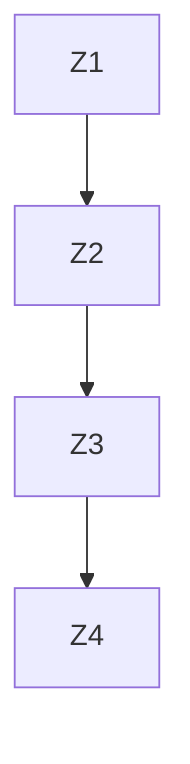
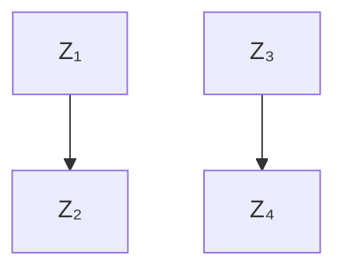
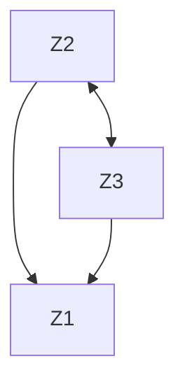

# Statistical Learning

Rajen D. Shah

r.shah@statslab.cam.ac.uk

Course webpage: http://www.statslab.cam.ac.uk/\~rds37/stat\_learning.html

In this course we will study a selection of important modern statistical methods. This selection is heavily biased towards my own interests, but I hope it will nevertheless give you a flavour of some of the most important recent methodological developments in statistics.

Over the last 25 years, the sorts of datasets that statisticians have been challenged to study have changed greatly. Where in the past, we were used to datasets with many observations with a few carefully chosen variables, we are now seeing datasets where the number of variables can run into the thousands and greatly exceed the number of observations. For example, with microarray data, we typically have gene expression values measured for several thousands of genes, but only for a few hundred tissue samples. The classical statistical methods are often simply not applicable in these “high-dimensional” situations.

The course is divided into 5 chapters (of unequal size). Module I encompasses the first two chapters, and Module II covers the last three. Our first chapter will start by introducing ridge regression, a simple generalisation of ordinary least squares. Our study of this will lead us to some beautiful connections with functional analysis and ultimately one of the most successful and flexible classes of learning algorithms: kernel machines.

The second chapter will give an introduction to the Lasso, a method which has been at the centre of much of the developments that have occurred in high-dimensional statistics, and will allow us to perform regression in the seemingly hopeless situation when the number of parameters we are trying to estimate is larger than the number of observations.

Chapter three gives and more in depth study of the Lasso, and some of its extensions. In the fourth chapter we will study graphical modelling and provide an introduction to the exciting field of causal inference. Where the previous chapters consider methods for relating a particular response to a large collection of (explanatory) variables, graphical modelling will give us a way of understanding relationships between the variables themselves. Ultimately we would like to infer causal relationships between variables based on (observational) data. This may seem like a fundamentally impossible task, yet we will show how by developing the graphical modelling framework further, we can begin to answer such causal questions.

Statistics is not only about developing methods that can predict well in the presence of noise, but also about assessing the uncertainty in our predictions and estimates. In the final chapter we will tackle the problem of how to quantify uncertainty in high-dimensional regression settings.

Before we begin the main material of the course, we will briefly review two key classical statistical methods: ordinary least squares and maximum likelihood estimation. This will help to set the scene and provide a warm-up for the modern methods to come later.

## Classical statistics

## Ordinary least squares

Imagine data are available in the form of observations $(Y_{i}, x_{i}) \in \mathbb{R} \times \mathbb{R}^{p}, i = 1, \ldots, n$ , and the aim is to infer a simple regression function relating the average value of a response, $Y_{i}$ , and a collection of predictors or variables, $x_{i}$ . This is an example of regression analysis, one of the most important tasks in statistics.

A linear model for the data assumes that it is generated according to

$$
Y = X \beta^ {0} + \varepsilon , \tag {0.0.1}
$$

where $Y \in R^{n}$ is the vector of responses; $X \in R^{n \times p}$ is the predictor matrix (or design matrix) with ith row $x_{i}^{T}$ ; $\varepsilon \in R^{n}$ represents random error; and $\beta^{0} \in R^{p}$ is the unknown vector of coefficients.

Provided $p \ll n$ , a sensible way to estimate $\beta$ is by ordinary least squares (OLS). This yields an estimator $\hat{\beta}^{OLS}$ with

$$
\hat {\beta} ^ {\mathrm{OLS}} := \underset {\beta \in \mathbb {R} ^ {p}} {\arg \min} \| Y - X \beta \| _ {2} ^ {2} = (X ^ {T} X) ^ {- 1} X ^ {T} Y, \tag {0.0.2}
$$

provided $X$ has full column rank.

Under the assumptions that (i) $\mathbb{E}(\varepsilon_i) = 0$ and (ii) $\operatorname{Var}(\varepsilon) = \sigma^2 I$ , we have that:

- $\mathbb{E}_{\beta^0,\sigma^2}(\hat{\beta}^{\mathrm{OLS}}) = \mathbb{E}\{(X^T X)^{-1}X^T(X\beta^0 + \varepsilon)\} = \beta^0.$  
- $\mathrm{Var}_{\beta^0,\sigma^2}(\hat{\beta}^{\mathrm{OLS}}) = (X^TX)^{-1}X^TX\mathrm{Var}(\varepsilon)X(X^TX)^{-1} = \sigma^2 (X^TX)^{-1}.$

The Gauss–Markov theorem states that OLS is the best linear unbiased estimator in our setting: for any other estimator $\tilde{\beta}$ that is linear in Y (so $\tilde{\beta} = AY$ for some fixed matrix A), we have

$$
\mathrm{Var} _ {\beta^ {0}, \sigma^ {2}} (\tilde {\beta}) - \mathrm{Var} _ {\beta^ {0}, \sigma^ {2}} (\hat {\beta} ^ {\mathrm{OLS}})
$$

is positive semi-definite.

## Maximum likelihood estimation

The method of least squares is just one way to construct as estimator. A more general technique is that of maximum likelihood estimation. Here given data $y \in R^{n}$ that we take as a realisation of a random variable Y, we specify its density $f(y; \theta)$ up to some unknown vector of parameters $\theta \in \Theta \subseteq R^{d}$ , where $\Theta$ is the parameter space. The likelihood function is a function of $\theta$ for each fixed y given by

$$
L (\theta) := L (\theta ; y) = c (y) f (y; \theta),
$$

where $c(y)$ is an arbitrary constant of proportionality. The maximum likelihood estimate of $\theta$ maximises the likelihood, or equivalently it maximises the log-likelihood

$$
\ell (\theta) := \ell (\theta ; y) = \log f (y; \theta) + \log (c (y)).
$$

A very useful quantity in the context of maximum likelihood estimation is the Fisher information matrix with jkth $(1 \leq j, k \leq d)$ entry

$$
i _ {j k} (\theta) := - \mathbb {E} _ {\theta} \bigg \{\frac {\partial^ {2}}{\partial \theta_ {j} \partial \theta_ {k}} \ell (\theta) \bigg \}.
$$

It can be thought of as a measure of how hard it is to estimate $\theta$ when it is the true parameter value. The Cramér–Rao lower bound states that if $\tilde{\theta}$ is an unbiased estimator of $\theta$ , then under regularity conditions,

$$
\mathrm{Var} _ {\theta} (\tilde {\theta}) - i ^ {- 1} (\theta)
$$

is positive semi-definite.

A remarkable fact about maximum likelihood estimators (MLEs) is that (under quite general conditions) they are asymptotically normally distributed, asymptotically unbiased and asymptotically achieve the Cramér–Rao lower bound.

Assume that the Fisher information matrix when there are n observations, $i^{(n)}(\theta)$ (where we have made the dependence on n explicit) satisfies $i^{(n)}(\theta)/n \to I(\theta)$ for some positive definite matrix I. Then denoting the maximum likelihood estimator of $\theta$ when there are n observations by $\hat{\theta}^{(n)}$ , under regularity conditions, as the number of observations $n \to \infty$ we have

$$
\sqrt {n} (\hat {\theta} ^ {(n)} - \theta) \xrightarrow {d} N _ {d} (0, I ^ {- 1} (\theta)).
$$

Returning to our linear model, if we assume in addition that $\varepsilon_{i} \sim N(0, \sigma^{2})$ , then the log-likelihood for $(\beta, \sigma^{2})$ is

$$
\ell (\beta , \sigma^ {2}) = - \frac {n}{2} \log (\sigma^ {2}) - \frac {1}{2 \sigma^ {2}} \sum_ {i = 1} ^ {n} (y _ {i} - x _ {i} ^ {T} \beta) ^ {2}.
$$

We see that the maximum likelihood estimate of $\beta$ and OLS coincide. It is easy to check that

$$
i (\beta , \sigma^ {2}) = \left( \begin{array}{c c} \sigma^ {- 2} X ^ {T} X & 0 \\ 0 & n \sigma^ {- 4} / 2 \end{array} \right).
$$

The general theory for MLEs would suggest that approximately $\sqrt{n}(\hat{\beta}-\beta)\sim N_{p}(0,n\sigma^{2}(X^{T}X)^{-1})$ ; in fact it is straight-forward to show that this distributional result is exact.

## Contents

## 1 Kernel machines 1

1.1 Ridge regression 1

1.1.1 The singular value decomposition and principal components analysis 3

1.2 v-fold cross-validation ..... 4

1.3 The kernel trick 5

1.4 Kernels 7

1.4.1 Examples of kernels 8

1.4.2 Reproducing kernel Hilbert spaces . . . . . . . . . . . . . . . . . . 9

1.4.3 The representer theorem 12

1.5 Kernel ridge regression 13

1.6 Other kernel machines 16

1.6.1 The support vector machine 16

1.6.2 Logistic regression 18

1.7 Large-scale kernel machines 19

## 2 Introduction to the Lasso 21

2.1 Model selection 21

2.2 The Lasso estimator 22

2.2.1 Convexity and the Lasso 23

2.2.2 Prediction error of the Lasso with no assumptions on the design . . 24

2.2.3 Concentration inequalities I 24

## 3 The Lasso and beyond 27

3.1 Some facts from optimisation theory and convex analysis ..... 27

3.1.1 Subgradients 27

3.1.2 The Lagrangian method 29

3.2 Lasso solutions 29

3.3 Variable selection 29

3.4 Prediction and estimation 30

3.5 The compatibility condition 32

3.5.1 Concentration inequalities II 33

3.5.2 The compatibility condition and random design ..... 34

3.6 Computation 35

3.7 Extensions of the Lasso 36

3.7.1 Structural penalties 36  
3.7.2 Reducing the bias of the Lasso 37

## 4 Graphical modelling and causal inference 39

4.1 Graphs 39  
4.2 Conditional independence graphs 41  
4.3 Gaussian graphical models 42

4.3.1 Normal conditionals 42  
4.3.2 Nodewise regression 42  
4.3.3 The precision matrix and conditional independence ..... 43  
4.3.4 The Graphical Lasso 44

4.4 Structural equation models 45  
4.5 Interventions 46  
4.6 The Markov properties on DAGs 47  
4.7 Causal structure learning 47

4.7.1 Three obstacles 47  
4.7.2 The PC algorithm 49

## 5 High-dimensional inference 52

5.1 Using the debiased Lasso in practice 55

## Chapter 1

## Kernel machines

Let us revisit the linear model with

$$
Y _ {i} = x _ {i} ^ {T} \beta^ {0} + \varepsilon_ {i}.
$$

For unbiased estimators of $\beta^{0}$ , their variance gives a way of comparing their quality in terms of squared error loss. For a potentially biased estimator, $\tilde{\beta}$ , the relevant quantity is

$$
\begin{array}{l} \mathbb {E} _ {\beta^ {0}, \sigma^ {2}} \{(\tilde {\beta} - \beta^ {0}) (\tilde {\beta} - \beta^ {0}) ^ {T} \} = \mathbb {E} [ \{\tilde {\beta} - \mathbb {E} (\tilde {\beta}) + \mathbb {E} (\tilde {\beta}) - \beta^ {0} \} \{\tilde {\beta} - \mathbb {E} (\tilde {\beta}) + \mathbb {E} (\tilde {\beta}) - \beta^ {0} \} ^ {T} ] \\ = \mathrm{Var} (\tilde {\beta}) + \{\mathbb {E} (\tilde {\beta} - \beta^ {0}) \} \{\mathbb {E} (\tilde {\beta} - \beta^ {0}) \} ^ {T}, \\ \end{array}
$$

a sum of squared bias and variance terms. A crucial part of the optimality arguments for OLS and MLEs was unbiasedness. Do there exist biased methods whose variance is reduced compared to OLS such that their overall prediction error is lower? Yes!—in fact the use of biased estimators is essential in dealing with settings where the number of parameters to be estimated is large compared to the number of observations. In the first two chapters we’ll explore two important methods for variance reduction based on different forms of penalisation: rather than forming estimators via optimising a least squares or log-likelihood term, we will introduce an additional penalty term that encourages estimates to be shrunk towards 0 in some sense. This will allow us to produce reliable estimators that work well when classical MLEs are infeasible, and in other situations can greatly out-perform the classical approaches.

## 1.1 Ridge regression

One way to reduce the variance of $\hat{\beta}^{\mathrm{OLS}}$ is to shrink the estimated coefficients towards 0. Ridge regression [Hoerl and Kennard, 1970] does this by solving the following optimisation problem

$$
(\hat {\mu} _ {\lambda} ^ {\mathrm{R}}, \hat {\beta} _ {\lambda} ^ {\mathrm{R}}) = \underset {(\mu , \beta) \in \mathbb {R} \times \mathbb {R} ^ {p}} {\arg \min} \{\| Y - \mu \mathbf {1} - X \beta \| _ {2} ^ {2} + \lambda \| \beta \| _ {2} ^ {2} \}.
$$

Here 1 is an n-vector of 1's. We see that the usual OLS objective is penalised by an additional term proportional to $\|\beta\|_{2}^{2}$ . The parameter $\lambda \geq 0$ , which controls the severity of the penalty and therefore the degree of the shrinkage towards 0, is known as a regularisation parameter or tuning parameter. We have explicitly included an intercept term which is not penalised. The reason for this is that were the variables to have their origins shifted so e.g. a variable representing temperature is given in units of Kelvin rather than Celsius, the fitted values would not change. However, $X\hat{\beta}$ is not invariant under scale transformations of the variables so it is standard practice to centre each column of X (hence making them orthogonal to the intercept term) and then scale them to have $\ell_{2}$ -norm $\sqrt{n}$ .

It is straightforward to show that after this standardisation of X, $\hat{\mu}_{\lambda}^{R} = \bar{Y} := \sum_{i=1}^{n} Y_{i}/n$ , so we may assume that $\sum_{i=1}^{n} Y_{i} = 0$ by replacing $Y_{i}$ by $Y_{i} - \bar{Y}$ and then we can remove $\mu$ from our objective function. In this case

$$
\hat {\beta} _ {\lambda} ^ {\mathrm{R}} = (X ^ {T} X + \lambda I) ^ {- 1} X ^ {T} Y.
$$

In this form, we can see how the addition of the $\lambda I$ term helps to stabilise the estimator. Note that when X does not have full column rank (such as in high-dimensional situations), we can still compute this estimator. On the other hand, when X does have full column rank, we have the following theorem.

Theorem 1. For $\lambda$ sufficiently small (depending on $\beta^{0}$ and $\sigma^{2}$ ),

$$
\mathbb {E} (\hat {\beta} ^ {\mathrm{OLS}} - \beta^ {0}) (\hat {\beta} ^ {\mathrm{OLS}} - \beta^ {0}) ^ {T} - \mathbb {E} (\hat {\beta} _ {\lambda} ^ {\mathrm{R}} - \beta^ {0}) (\hat {\beta} _ {\lambda} ^ {\mathrm{R}} - \beta^ {0}) ^ {T}
$$

is positive definite.

Proof. First we compute the bias of $\hat{\beta}_{\lambda}^{\mathrm{R}}$ . We drop the subscript $\lambda$ and superscript $R$ for convenience.

$$
\begin{array}{l} \mathbb {E} (\hat {\beta}) - \beta^ {0} = (X ^ {T} X + \lambda I) ^ {- 1} X ^ {T} X \beta^ {0} - \beta^ {0} \\ = (X ^ {T} X + \lambda I) ^ {- 1} (X ^ {T} X + \lambda I - \lambda I) \beta^ {0} - \beta^ {0} \\ = - \lambda (X ^ {T} X + \lambda I) ^ {- 1} \beta^ {0}. \\ \end{array}
$$

Now we look at the variance of $\hat{\beta}$ .

$$
\begin{array}{l} \operatorname{Var} (\hat {\beta}) = \mathbb {E} \{(X ^ {T} X + \lambda I) ^ {- 1} X ^ {T} \varepsilon \} \{(X ^ {T} X + \lambda I) ^ {- 1} X ^ {T} \varepsilon \} ^ {T} \\ = \sigma^ {2} (X ^ {T} X + \lambda I) ^ {- 1} X ^ {T} X (X ^ {T} X + \lambda I) ^ {- 1}. \\ \end{array}
$$

Thus $\mathbb{E}(\hat{\beta}^{\mathrm{OLS}} - \beta^{0})(\hat{\beta}^{\mathrm{OLS}} - \beta^{0})^{T} - \mathbb{E}(\hat{\beta} -\beta^{0})(\hat{\beta} -\beta^{0})^{T}$ is equal to

$$
\sigma^ {2} (X ^ {T} X) ^ {- 1} - \sigma^ {2} (X ^ {T} X + \lambda I) ^ {- 1} X ^ {T} X (X ^ {T} X + \lambda I) ^ {- 1} - \lambda^ {2} (X ^ {T} X + \lambda I) ^ {- 1} \beta^ {0} \beta^ {0 ^ {T}} (X ^ {T} X + \lambda I) ^ {- 1}.
$$

After some simplification, we see that this is equal to

$$
\lambda (X ^ {T} X + \lambda I) ^ {- 1} [ \sigma^ {2} \{2 I + \lambda (X ^ {T} X) ^ {- 1} \} - \lambda \beta^ {0} \beta^ {0 ^ {T}} ] (X ^ {T} X + \lambda I) ^ {- 1}.
$$

Thus $\mathbb{E}(\hat{\beta}^{\mathrm{OLS}} - \beta^{0})(\hat{\beta}^{\mathrm{OLS}} - \beta^{0})^{T} - \mathbb{E}(\hat{\beta} -\beta^{0})(\hat{\beta} -\beta^{0})^{T}$ is positive definite for $\lambda >0$ if and only if

$$
\sigma^ {2} \{2 I + \lambda (X ^ {T} X) ^ {- 1} \} - \lambda \beta^ {0} \beta^ {0 T}
$$

is positive definite, which is true for $\lambda > 0$ sufficiently small (we can take $0 < \lambda < 2\sigma^2 / \| \beta^0 \|_2^2$ ).

The theorem says that $\hat{\beta}_{\lambda}^{\mathrm{R}}$ outperforms $\hat{\beta}^{\mathrm{OLS}}$ provided $\lambda$ is chosen appropriately. To be able to use ridge regression effectively, we need a way of selecting a good $\lambda$ —we will come to this very shortly. What the theorem doesn't really tell us is in what situations we expect ridge regression to perform well. To understand that, we will turn to one of the key matrix decompositions used in statistics, the singular value decomposition (SVD).

## 1.1.1 The singular value decomposition and principal components analysis

The singular value decomposition (SVD) is a generalisation of an eigendecomposition of a square matrix. We can factorise any $X \in R^{n \times p}$ into its SVD

$$
X = U D V ^ {T}.
$$

Here the $U \in R^{n \times n}$ and $V \in R^{p \times p}$ are orthogonal matrices and $D \in R^{n \times p}$ has $D_{11} \geq D_{22} \geq \cdots \geq D_{mm} \geq 0$ where $m := \min(n, p)$ and all other entries of D are zero. To compute such a decomposition requires $O(np \min(n, p))$ operations. The rth columns of U and V are known as the rth left and right singular vectors of X respectively, and $D_{rr}$ is the rth singular value.

When n > p, we can replace U by its first p columns and D by its first p rows to produce another version of the SVD (sometimes known as the thin SVD). Then $X = UDV^{T}$ where $U \in R^{n \times p}$ has orthonormal columns (but is no longer square) and D is square and diagonal. There is an equivalent version for when p > n.

Let us take $X \in \mathbb{R}^{n \times p}$ as our matrix of predictors and suppose $n \geq p$ . Using the (thin) SVD we may write the fitted values from ridge regression as follows.

$$
\begin{array}{l} X \hat {\beta} _ {\lambda} ^ {R} = X (X ^ {T} X + \lambda I) ^ {- 1} X ^ {T} Y \\ = U D V ^ {T} \left(V D ^ {2} V ^ {T} + \lambda I\right) ^ {- 1} V D U ^ {T} Y \\ = U D \left(D ^ {2} + \lambda I\right) ^ {- 1} D U ^ {T} Y \\ = \sum_ {j = 1} ^ {p} U _ {j} \frac {D _ {j j} ^ {2}}{D _ {j j} ^ {2} + \lambda} U _ {j} ^ {T} Y. \\ \end{array}
$$

Here we have used the notation (that we shall use throughout the course) that $U_{j}$ is the jth column of U. For comparison, the fitted values from OLS (when X has full column rank) are

$$
X \hat {\beta} ^ {\mathrm{OLS}} = X (X ^ {T} X) ^ {- 1} X ^ {T} Y = U U ^ {T} Y.
$$

Both OLS and ridge regression compute the coordinates of Y with respect to the columns of U. Ridge regression then shrinks these coordinates by the factors $D_{jj}^{2}/(D_{jj}^{2}+\lambda)$ ; if $D_{jj}$ is small, the amount of shrinkage will be larger.

To interpret this further, note that the SVD is intimately connected with Principal Components Analysis (PCA). Consider $v \in R^{p}$ with $\|v\|_{2} = 1$ . Since the columns of X have had their means subtracted, the sample variance of $Xv \in R^{n}$ , is

$$
\frac {1}{n} v ^ {T} X ^ {T} X v = \frac {1}{n} v ^ {T} V D ^ {2} V ^ {T} v.
$$

Writing $a = V^{T}v$ , so $\| a\| _2 = 1$ , we have

$$
\frac {1}{n} v ^ {T} V D ^ {2} V ^ {T} v = \frac {1}{n} a ^ {T} D ^ {2} a = \frac {1}{n} \sum_ {j} a _ {j} ^ {2} D _ {j j} ^ {2} \leq \frac {1}{n} D _ {1 1} \sum_ {j} a _ {j} ^ {2} = \frac {1}{n} D _ {1 1} ^ {2}.
$$

As $\|XV_{1}\|_{2}^{2}/n = D_{11}^{2}/n$ , $V_{1}$ determines the linear combination of the columns of X which has the largest sample variance, when the coefficients of the linear combination are constrained to have $\ell_{2}$ -norm 1. $XV_{1} = D_{11}U_{1}$ is known as the first principal component of X. Subsequent principal components $D_{22}U_{2}, \ldots, D_{pp}U_{p}$ have maximum variance $D_{jj}^{2}/n$ , subject to being orthogonal to all earlier ones—see example sheet 1 for details.

Returning to ridge regression, we see that it shrinks Y most in the smaller principal components of X. Thus it will work well when most of the signal is in the large principal components of X. We now turn to the problem of choosing $\lambda$ .

## 1.2 v-fold cross-validation

Cross-validation is a general technique for selecting a good regression method from among several competing regression methods. We illustrate the principle with ridge regression, where we have a family of regression methods given by different $\lambda$ values.

So far, we have considered the matrix of predictors X as fixed and non-random. However, in many cases, it makes sense to think of it as random. Let us assume that our data are i.i.d. pairs $(x_{i}, Y_{i})$ , $i = 1, \ldots, n$ . Then ideally, we might want to pick a $\lambda$ value such that

$$
\mathbb {E} \{(Y ^ {*} - x ^ {* T} \hat {\beta} _ {\lambda} ^ {\mathrm{R}} (X, Y)) ^ {2} | X, Y \} \tag {1.2.1}
$$

is minimised. Here $(x^{*}, Y^{*}) \in \mathbb{R}^{p} \times \mathbb{R}$ is independent of $(X, Y)$ and has the same distribution as $(x_{1}, Y_{1})$ , and we have made the dependence of $\hat{\beta}_{\lambda}^{R}$ on the training data $(X, Y)$ explicit. This $\lambda$ is such that conditional on the original training data, it minimises the expected prediction error on a new observation drawn from the same distribution as the training data.

A less ambitious goal is to find a $\lambda$ value to minimise the expected prediction error,

$$
\mathbb {E} [ \mathbb {E} \{(Y ^ {*} - x ^ {* T} \hat {\beta} _ {\lambda} ^ {\mathrm{R}} (X, Y)) ^ {2} | X, Y \} ] \tag {1.2.2}
$$

where compared with $(1.2.1)$ , we have taken a further expectation over the training set.

We still have no way of computing (1.2.2) directly, but we can attempt to estimate it. The idea of v-fold cross-validation is to split the data into v groups or folds of roughly equal size: $(X^{(1)}, Y^{(1)}), \ldots, (X^{(v)}, Y^{(v)})$ . Let $(X^{(-k)}, Y^{(-k)})$ be all the data except that in the kth fold. For each $\lambda$ on a grid of values, we compute $\hat{\beta}_{\lambda}^{\mathrm{R}}(X^{(-k)}, Y^{(-k)})$ : the ridge regression estimate based on all the data except the kth fold. Writing $\kappa(i)$ for the fold to which $(x_{i}, Y_{i})$ belongs, we choose the value of $\lambda$ that minimises

$$
\mathrm{CV} (\lambda) = \frac {1}{n} \sum_ {i = 1} ^ {n} \left\{Y _ {i} - x _ {i} ^ {T} \hat {\beta} _ {\lambda} ^ {\mathrm{R}} \left(X ^ {(- \kappa (i))}, Y ^ {(- \kappa (i))}\right) \right\} ^ {2}. \tag {1.2.3}
$$

Writing $\lambda_{\mathrm{CV}}$ for the minimiser, our final estimate of $\beta^0$ can then be $\hat{\beta}_{\lambda_{\mathrm{CV}}}^{R}(X,Y)$ .

Note that for each i,

$$
\mathbb {E} \left\{Y _ {i} - x _ {i} ^ {T} \hat {\beta} _ {\lambda} ^ {\mathrm{R}} \left(X ^ {(- \kappa (i))}, Y ^ {(- \kappa (i))}\right) \right\} ^ {2} = \mathbb {E} \left[ \mathbb {E} \left\{Y _ {i} - x _ {i} ^ {T} \hat {\beta} _ {\lambda} ^ {\mathrm{R}} \left(X ^ {(- \kappa (i))}, Y ^ {(- \kappa (i))}\right) \right\} ^ {2} \mid X ^ {(- \kappa (i))}, Y ^ {(- \kappa (i))} \right]. \tag {1.2.4}
$$

This is precisely the expected prediction error in $(1.2.2)$ but with the training data X, Y replaced with a training data set of smaller size. If all the folds have the same size, then $\mathrm{CV}(\lambda)$ is an average of n identically distributed quantities, each with expected value as in $(1.2.4)$ . However, the quantities being averaged are not independent as they share the same data.

Thus cross-validation gives a biased estimate of the expected prediction error. The amount of the bias depends on the size of the folds, the case when the v = n giving the least bias—this is known as leave-one-out cross-validation. The quality of the estimate, though, may be worse as the quantities being averaged in $(1.2.3)$ will be highly positively correlated. Typical choices of v are 5 or 10.

Cross-validation aims to allow us to choose the single best $\lambda$ (or more generally regression procedure); we could instead aim to find the best weighted combination of regression procedures. Returning to our ridge regression example, suppose $\lambda$ is restricted to a grid of values $\lambda_{1} > \lambda_{2} > \cdots > \lambda_{L}$ . We can then minimise

$$
\frac {1}{n} \sum_ {i = 1} ^ {n} \left\{Y _ {i} - \sum_ {l = 1} ^ {L} w _ {l} x _ {i} ^ {T} \hat {\beta} _ {\lambda_ {l}} ^ {\mathrm{R}} (X ^ {(- \kappa (i))}, Y ^ {(- \kappa (i))}) \right\} ^ {2}
$$

over $w \in R^{L}$ subject to $w_{l} \geq 0$ for all l. This is a non-negative least-squares optimisation, for which efficient algorithms are available. This is sometimes known as stacking [Wolpert, 1992, Breiman, 1996] and it can often outperform cross-validation.

## 1.3 The kernel trick

The fitted values from ridge regression are

$$
X (X ^ {T} X + \lambda I) ^ {- 1} X ^ {T} Y. \tag {1.3.1}
$$

An alternative way of writing this is suggested by the following

$$
X ^ {T} \left(X X ^ {T} + \lambda I\right) = \left(X ^ {T} X + \lambda I\right) X ^ {T}
$$

$$
(X ^ {T} X + \lambda I) ^ {- 1} X ^ {T} = X ^ {T} (X X ^ {T} + \lambda I) ^ {- 1}
$$

$$
X (X ^ {T} X + \lambda I) ^ {- 1} X ^ {T} Y = X X ^ {T} (X X ^ {T} + \lambda I) ^ {- 1} Y. \tag {1.3.2}
$$

Two remarks are in order:

- Note while $X^T X$ is $p \times p$ , $XX^T$ is $n \times n$ . Computing fitted values using (1.3.1) would require roughly $O(np^2 + p^3)$ operations. If $p \gg n$ this could be extremely costly. However, our alternative formulation would only require roughly $O(n^2 p + n^3)$ operations, which could be substantially smaller.  
- We see that the fitted values of ridge regression depend only on inner products $K = XX^{T}$ between observations (note $K_{ij} = x_{i}^{T}x_{j}$ ).

Now suppose that we believe the signal depends quadratically on the predictors:

$$
Y _ {i} = x _ {i} ^ {T} \beta + \sum_ {k, l} x _ {i k} x _ {i l} \theta_ {k l} + \varepsilon_ {i}.
$$

We can still use ridge regression provided we work with an enlarged set of predictors

$$
x _ {i 1}, \ldots , x _ {i p}, x _ {i 1} x _ {i 1}, \ldots , x _ {i 1} x _ {i p}, x _ {i 2} x _ {i 1}, \ldots , x _ {i 2} x _ {i p}, \ldots , x _ {i p} x _ {i p}.
$$

This will give us $O(p^{2})$ predictors. Our new approach to computing fitted values would therefore have complexity $O(n^{2}p^{2} + n^{3})$ , which could be rather costly if p is large.

However, rather than first creating all the additional predictors and then computing the new K matrix, we can attempt to directly compute K. To this end consider

$$
\begin{array}{l} (1 + x _ {i} ^ {T} x _ {j}) ^ {2} = \left(1 + \sum_ {k} x _ {i k} x _ {j k}\right) ^ {2} \\ = 1 + 2 \sum_ {k} x _ {i k} x _ {j k} + \sum_ {k, l} x _ {i k} x _ {i l} x _ {j k} x _ {j l}. \\ \end{array}
$$

Observe this amounts to an inner product between vectors of the form

$$
(1, \sqrt {2} x _ {i 1}, \dots , \sqrt {2} x _ {i p}, x _ {i 1} x _ {i 1}, \dots , x _ {i 1} x _ {i p}, x _ {i 2} x _ {i 1}, \dots , x _ {i 2} x _ {i p}, \dots , x _ {i p} x _ {i p}) ^ {T}. \tag {1.3.3}
$$

Thus if we set

$$
K _ {i j} = (1 + x _ {i} ^ {T} x _ {j}) ^ {2} \tag {1.3.4}
$$

and plug this into the formula for the fitted values, it is exactly as if we had performed ridge regression on an enlarged set of variables given by (1.3.3). Now computing K using (1.3.4) would require only p operations per entry, so $O(n^{2}p)$ operations in total. It thus seems we have improved things by a factor of p using our new approach. This is a nice computational trick, but more importantly for us it serves to illustrate some general points.

- Since ridge regression only depends on inner products between observations, rather than fitting non-linear models by first mapping the original data $x_{i} \in \mathbb{R}^{p}$ to $\phi(x_{i}) \in \mathbb{R}^{d}$ (say) using some feature map $\phi$ (which could, for example introduce quadratic effects), we can instead try to directly compute $k(x_{i}, x_{j}) = \langle \phi(x_{i}), \phi(x_{j}) \rangle$ .  
- In fact rather than thinking in terms of feature maps, we can instead try to think about an appropriate measure of similarity $k(x_{i}, x_{j})$ between observations. Modelling in this fashion is sometimes much easier.

We will now formalise and extend what we have learnt with this example.

## 1.4 Kernels

We have seen how a model with quadratic effects can be fitted very efficiently by replacing the inner product matrix (known as the Gram matrix) $XX^{T}$ in (1.3.2) with the matrix in (1.3.4). It is then natural to ask what other non-linear models can be fitted efficiently using this sort of approach.

We won't answer this question directly, but instead we will try to understand the sorts of similarity measures $k$ that can be represented as inner products between transformations of the original data.

That is, we will study the similarity measures $k : X \times X \to R$ from the input space X to R for which there exists a feature map $\phi : X \to H$ where H is some (real) inner product space with

$$
k (x, x ^ {\prime}) = \langle \phi (x), \phi (x ^ {\prime}) \rangle . \tag {1.4.1}
$$

Recall that an inner product space is a real vector space H endowed with a map $\langle\cdot,\cdot\rangle:H\times H\to R$ that obeys the following properties.

(i) Symmetry: $\langle u, v \rangle = \langle v, u \rangle$ .  
(ii) Linearity: for $a, b \in R \langle au + bw, v \rangle = a \langle u, v \rangle + b \langle w, v \rangle$ .  
(iii) Positive-definiteness: $\langle u, u \rangle \geq 0$ with equality if and only if $u = 0$ .

Definition 1. A positive definite kernel or more simply a kernel (for brevity) k is a symmetric map $k : X \times X \to R$ for which for all $n \in N$ and all $x_{1}, \ldots, x_{n} \in X$ , the matrix K with entries

$$
K _ {i j} = k (x _ {i}, x _ {j})
$$

is positive semi-definite.

A kernel is a little like an inner product, but need not be bilinear in general. However, a form of the Cauchy–Schwarz inequality does hold for kernels.

## Proposition 2.

$$
k (x, x ^ {\prime}) ^ {2} \leq k (x, x) k (x ^ {\prime}, x ^ {\prime}).
$$

Proof. The matrix

$$
\left( \begin{array}{c c} k (x, x) & k (x, x ^ {\prime}) \\ k (x ^ {\prime}, x) & k (x ^ {\prime}, x ^ {\prime}) \end{array} \right)
$$

must be positive semi-definite so in particular its determinant must be non-negative. □

First we show that any inner product of feature maps will give rise to a kernel.

Proposition 3. k defined by $k(x, x') = \langle \phi(x), \phi(x') \rangle$ is a kernel.

Proof. Let $x_{1},\ldots ,x_{n}\in \mathcal{X}$ , $\alpha_{1},\ldots ,\alpha_{n}\in \mathbb{R}$ and consider

$$
\begin{array}{l} \sum_ {i, j} \alpha_ {i} k (x _ {i}, x _ {j}) \alpha_ {j} = \sum_ {i, j} \alpha_ {i} \langle \phi (x _ {i}), \phi (x _ {j}) \rangle \alpha_ {j} \\ = \left\langle \sum_ {i} \alpha_ {i} \phi (x _ {i}), \sum_ {j} \alpha_ {j} \phi (x _ {j}) \right\rangle \geq 0. \\ \end{array}
$$

Showing that every kernel admits a representation of the form (1.4.1) is slightly more involved, and we delay this until after we have studied some examples.

## 1.4.1 Examples of kernels

Proposition 4. Suppose $k_{1}, k_{2}, \ldots$ are kernels.

(i) If $\alpha_{1},\alpha_{2}\geq 0$ then $\alpha_{1}k_{1} + \alpha_{2}k_{2}$ is a kernel. If $\lim_{m\to \infty}k_m(x,x') =:k(x,x')$ exists for all $x,x^{\prime}\in \mathcal{X}$ , then $k$ is a kernel.

(ii) The pointwise product $k = k_{1}k_{2}$ is a kernel.

Linear kernel. $k(x,x^{\prime}) = x^{T}x^{\prime}$

Polynomial kernel. $k(x, x') = (1 + x^{T}x')^{d}$ . To show this is a kernel, we can simply note that $1 + x^{T}x'$ gives a kernel owing to the fact that 1 is a kernel and (i) of Proposition 4. Next (ii) and induction shows that k as defined above is a kernel.

Gaussian kernel. The highly popular Gaussian kernel is defined by

$$
k (x, x ^ {\prime}) = \exp \bigg (- \frac {\| x - x ^ {\prime} \| _ {2} ^ {2}}{2 \sigma^ {2}} \bigg).
$$

For x close to $x'$ it is large whilst for x far from $x'$ the kernel quickly decays towards 0. The additional parameter $\sigma^{2}$ known as the bandwidth controls the speed of the decay to zero. Note it is less clear how one might find a corresponding feature map and indeed any feature map that represents this must be infinite dimensional.

To show that it is a kernel first decompose $\|x-x'\|_{2}^{2}=\|x\|_{2}^{2}+\|x'\|_{2}^{2}-2x^{T}x'$ . Note that by Proposition 3,

$$
k _ {1} (x, x ^ {\prime}) = \exp \left(- \frac {\| x \| _ {2} ^ {2}}{2 \sigma^ {2}}\right) \exp \left(- \frac {\| x ^ {\prime} \| _ {2} ^ {2}}{2 \sigma^ {2}}\right)
$$

is a kernel. Next writing

$$
k _ {2} (x, x ^ {\prime}) = \exp (x ^ {T} x ^ {\prime} / \sigma^ {2}) = \sum_ {r = 0} ^ {\infty} \frac {(x ^ {T} x ^ {\prime} / \sigma^ {2}) ^ {r}}{r !}
$$

and using (i) of Proposition 4 shows that $k_{2}$ is a kernel. Finally observing that $k = k_{1}k_{2}$ and using (ii) shows that the Gaussian kernel is indeed a kernel.

Sobolev kernel. Take X to be $[0,1]$ and let $k(x,x') = \min(x,x')$ . Note this is the covariance function of Brownian motion so it must be positive definite.

Jaccard similarity kernel. Take X to be the set of all subsets of $\{1,\ldots,p\}$ . For $x, x' \in X$ with $x \cup x' \neq \emptyset$ define

$$
k (x, x ^ {\prime}) = \frac {| x \cap x ^ {\prime} |}{| x \cup x ^ {\prime} |}
$$

and if $x \cup x' = \emptyset$ then set $k(x, x') = 1$ . Showing that this is a kernel is left to the example sheet.

## 1.4.2 Reproducing kernel Hilbert spaces

Theorem 5. For every kernel k there exists a feature map $\phi$ taking values in some inner product space H such that

$$
k (x, x ^ {\prime}) = \langle \phi (x), \phi (x ^ {\prime}) \rangle . \tag {1.4.2}
$$

Proof. We will take H to be the vector space of functions of the form

$$
f (\cdot) = \sum_ {i = 1} ^ {n} \alpha_ {i} k (\cdot , x _ {i}), \tag {1.4.3}
$$

where $n \in N$ , $x_{i} \in X$ and $\alpha_{i} \in R$ . Our feature map $\phi : X \to H$ will be

$$
\phi (x) = k (\cdot , x). \tag {1.4.4}
$$

We now define an inner product on $\mathcal{H}$ . If $f$ is given by (1.4.3) and

$$
g (\cdot) = \sum_ {j = 1} ^ {m} \beta_ {j} k (\cdot , x _ {j} ^ {\prime}) \tag {1.4.5}
$$

we define their inner product to be

$$
\langle f, g \rangle = \sum_ {i = 1} ^ {n} \sum_ {j = 1} ^ {m} \alpha_ {i} \beta_ {j} k (x _ {i}, x _ {j} ^ {\prime}). \tag {1.4.6}
$$

We need to check this is well-defined as the representations of $f$ and $g$ in (1.4.3) and (1.4.5) need not be unique. To this end, note that

$$
\sum_ {i = 1} ^ {n} \sum_ {j = 1} ^ {m} \alpha_ {i} \beta_ {j} k (x _ {i}, x _ {j} ^ {\prime}) = \sum_ {i = 1} ^ {n} \alpha_ {i} g (x _ {i}) = \sum_ {j = 1} ^ {m} \beta_ {j} f (x _ {j} ^ {\prime}). \tag {1.4.7}
$$

The first equality shows that the inner product does not depend on the particular expansion of g whilst the second equality shows that it also does not depend on the expansion of f. Thus the inner product is well-defined.

First we check that with $\phi$ defined as in (1.4.4) we do have relationship (1.4.2). Observe that

$$
\langle k (\cdot , x), f \rangle = \sum_ {i = 1} ^ {n} \alpha_ {i} k (x _ {i}, x) = f (x), \tag {1.4.8}
$$

so in particular we have

$$
\langle \phi (x), \phi (x ^ {\prime}) \rangle = \langle k (\cdot , x), k (\cdot , x ^ {\prime}) \rangle = k (x, x ^ {\prime}).
$$

It remains to show that it is indeed an inner product. It is clearly symmetric and $(1.4.7)$ shows linearity. We now need to show positive definiteness.

First note that

$$
\langle f, f \rangle = \sum_ {i, j} \alpha_ {i} k (x _ {i}, x _ {j}) \alpha_ {j} \geq 0 \tag {1.4.9}
$$

by positive definiteness of the kernel. Now from (1.4.8),

$$
f (x) ^ {2} = (\langle k (\cdot , x), f \rangle) ^ {2}.
$$

If we could use the Cauchy–Schwarz inequality on the right-hand side, we would have

$$
f (x) ^ {2} \leq \langle k (\cdot , x), k (\cdot , x) \rangle \langle f, f \rangle , \tag {1.4.10}
$$

which would show that if $\langle f, f \rangle = 0$ then necessarily $f = 0$ ; the final property we need to show that $\langle \cdot, \cdot \rangle$ is an inner product. However, in order to use the traditional Cauchy-Schwarz inequality we need to first know we're dealing with an inner product, which is precisely what we're trying to show!

Although we haven't shown that $\langle \cdot, \cdot \rangle$ is an inner product, we do have enough information to show that it is itself a kernel. We may then appeal to Proposition 2 to obtain (1.4.10). With this in mind, we argue as follows. Given functions $f_1, \ldots, f_m$ and coefficients $\gamma_1, \ldots, \gamma_m \in \mathbb{R}$ , we have

$$
\sum_ {i, j} \gamma_ {i} \langle f _ {i}, f _ {j} \rangle \gamma_ {j} = \left\langle \sum_ {i} \gamma_ {i} f _ {i}, \sum_ {j} \gamma_ {j} f _ {j} \right\rangle \geq 0
$$

where we have used linearity and (1.4.9), showing that it is a kernel.

To further discuss the space H we recall some facts from analysis. Any inner product space B is also a normed space: for $f \in B$ we may define $\|f\|_{B}^{2} := \langle f, f \rangle_{B}$ . Recall that a Cauchy sequence $(f_{m})_{m=1}^{\infty}$ in B has $\|f_{m} - f_{n}\|_{B} \to 0$ as $n, m \to \infty$ . A normed space where every Cauchy sequence has a limit (in the space) is called complete, and a complete inner product space is called a Hilbert space.

Hilbert spaces may be thought of as the (potentially) infinite-dimensional analogues of finite-dimensional Euclidean spaces. For later use we note that if V is a closed subspace of a Hilbert space B, then any $f \in B$ has a decomposition $f = u + v$ with $u \in V$ and

$$
v \in V ^ {\perp} := \{v \in \mathcal {B}: \langle v, u \rangle_ {\mathcal {B}} = 0 \text {for all} u \in V \}.
$$

By adding the limits of Cauchy sequences to $\mathcal{H}$ (from Theorem 5) we can make $\mathcal{H}$ a Hilbert space. Indeed, note that if $(f_m)_{m=1}^{\infty} \in \mathcal{H}$ is Cauchy then since by (1.4.10) we have

$$
| f _ {m} (x) - f _ {n} (x) | \leq \sqrt {k (x , x)} \| f _ {m} - f _ {n} \| _ {\mathcal {H}},
$$

we may define function $f^{*}: X \to R$ by $f^{*}(x) = \lim_{m \to \infty} f_{m}(x)$ . We can check that all such $f^{*}$ can be added to H to create a Hilbert space.

In fact, the completion of H is a special type of Hilbert space known as a reproducing kernel Hilbert space (RKHS).

Definition 2. A Hilbert space $\mathcal{B}$ of functions $f:\mathcal{X}\to \mathbb{R}$ is a reproducing kernel Hilbert space (RKHS) if for all $x\in \mathcal{X}$ , there exists $k_{x}\in \mathcal{B}$ such that

$$
f (x) = \left\langle k _ {x}, f \right\rangle \quad \text {   for   all   } f \in \mathcal {B}.
$$

The function

$$
k: \mathcal {X} \times \mathcal {X} \to \mathbb {R}
$$

$$
(x, x ^ {\prime}) \mapsto \langle k _ {x}, k _ {x ^ {\prime}} \rangle = k _ {x ^ {\prime}} (x)
$$

is known as the reproducing kernel of $\mathcal{B}$ .

By Proposition 3 the reproducing kernel of any RKHS is a (positive definite) kernel, and one may show (as Theorem 5 indicates) that to any kernel k is associated a (unique) RKHS that has reproducing kernel k.

## Examples

Linear kernel. Here $\mathcal{H}=\{f:f(x)=\beta^{T}x,\beta\in\mathbb{R}^{p}\}$ and if $f(x)=\beta^{T}x$ then $\|f\|_{H}^{2}=||\beta||_{2}^{2}$ .

Sobolev kernel. It can be shown that $\mathcal{H}$ is roughly the space of continuous functions $f:[0,1]\to \mathbb{R}$ with $f(0) = 0$ that are differentiable almost everywhere, and for which $\int_0^1 f'(x)^2 dx < \infty$ . It contains the class of Lipschitz functions (functions $f:[0,1]\to \mathbb{R}$ for which there exists some $L$ with $|f(x) - f(y)|\leq L|x - y|$ for all $x,y\in [0,1]$ ) that are 0 at the origin. The norm is

$$
\left(\int_ {0} ^ {1} f ^ {\prime} (x) ^ {2} d x\right) ^ {1 / 2}.
$$

Though the construction of the RKHS from a kernel is explicit, it can be challenging to understand precisely the space and the form of the norm.

## 1.4.3 The representer theorem

To recap, what we have shown so far is that replacing the matrix $XX^{T}$ in the definition of an algorithm by K derived from a positive definite kernel is essentially equivalent to running the same algorithm on some mapping of the original data, though with the modification that instances of $x_{i}^{T}x_{j}$ become $\langle\phi(x_{i}),\phi(x_{j})\rangle$ .

But what exactly is the optimisation problem we are solving when performing kernel ridge regression? Clearly it is determined by the kernel or equivalently by the RKHS. Note we know that an alternative way of writing the usual ridge regression optimisation is

$$
\underset {f \in \mathcal {H}} {\arg \min} \left\{\sum_ {i = 1} ^ {n} \left\{Y _ {i} - f \left(x _ {i}\right) \right\} ^ {2} + \lambda \| f \| _ {\mathcal {H}} ^ {2} \right\} \tag {1.4.11}
$$

where H is the RKHS corresponding to the linear kernel. The following theorem shows in particular that kernel ridge regression (i.e. ridge regression replacing $XX^{T}$ with K) with kernel k is equivalent to the above with H now being the RKHS corresponding to k.

Theorem 6 (Representer theorem, [Kimeldorf and Wahba, 1970, Schölkopf et al., 2001]). Let $c: \mathbb{R}^n \times \mathcal{X}^n \times \mathbb{R}^n \to \mathbb{R}$ be an arbitrary loss function, and let $J: [0, \infty) \to \mathbb{R}$ be strictly increasing. Let $x_1, \ldots, x_n \in \mathcal{X}$ , $Y \in \mathbb{R}^n$ . Finally, let $f \in \mathcal{H}$ where $\mathcal{H}$ is an RKHS with reproducing kernel $k$ , and let $K_{ij} = k(x_i, x_j)$ $i, j = 1, \ldots, n$ . Then $\hat{f}$ minimises

$$
Q _ {1} (f) := c \left(Y, x _ {1}, \dots , x _ {n}, f \left(x _ {1}\right), \dots , f \left(x _ {n}\right)\right) + J \left(\| f \| _ {\mathcal {H}} ^ {2}\right)
$$

over $f\in \mathcal{H}$ iff. $\hat{f} (\cdot) = \sum_{i = 1}^{n}\hat{\alpha}_{i}k(\cdot ,x_{i})$ and $\hat{\alpha}\in \mathbb{R}^n$ minimises $Q_{2}$ over $\alpha \in \mathbb{R}^n$ where

$$
Q _ {2} (\alpha) = c (Y, x _ {1}, \ldots , x _ {n}, K \alpha) + J (\alpha^ {T} K \alpha).
$$

Proof. Suppose $\hat{f}$ minimises $Q_{1}$ . We may write $\hat{f} = u + v$ where $u\in V:= \operatorname {span}\{k(\cdot ,x_1),\ldots ,k(\cdot ,x_n)\}$ and $v\in V^{\perp}$ . Then

$$
\hat {f} (x _ {i}) = \langle k (\cdot , x _ {i}), u + v \rangle = \langle k (\cdot , x _ {i}), u \rangle = u (x _ {i}).
$$

Meanwhile, by Pythagoras' theorem we have $J(\| \hat{f}\|_{\mathcal{H}}^2) = J(\| u\|_{\mathcal{H}}^2 + \| v\|_{\mathcal{H}}^2) \geq J(\| u\|_{\mathcal{H}}^2)$ with equality iff. $v = 0$ . Thus by optimality of $\hat{f}$ , $v = 0$ , so $\hat{f}(\cdot) = \sum_{i=1}^{n} \alpha_i k(\cdot, x_i)$ for $\alpha \in \mathbb{R}^n$ . Now observe that if $\hat{f}$ takes this form, then $\| \hat{f}\|_{\mathcal{H}}^2 = \alpha^T K\alpha$ , so $Q_1(\hat{f}) = Q_2(\alpha)$ . Then by optimality of $\hat{f}$ , we have that $\alpha$ must minimise $Q_2$ .

Now suppose $\hat{\alpha}$ minimises $Q_{2}$ and $\hat{f} (\cdot) = \sum_{i = 1}^{n}\hat{\alpha}_{i}k(\cdot ,x_{i})$ . Note that $Q_{1}(\hat{f}) = Q_{2}(\hat{\alpha})$ . If $\tilde{f}\in \mathcal{H}$ has $Q_{1}(\tilde{f})\leq Q_{1}(\hat{f})$ , by the argument above, writing $\tilde{f} = u + v$ with $u\in V$ , $v\in V^{\perp}$ , we know that $Q_{1}(u)\leq Q_{1}(\tilde{f})$ . But by optimality of $\hat{\alpha}$ we have $Q_{1}(\hat{f})\leq Q_{1}(u)$ , so $Q_{1}(\hat{f}) = Q_{1}(\tilde{f})$ .

Consider the result specialised the ridge regression objective. We see that $(1.4.11)$ is essentially equivalent to minimising

$$
\| Y - K \alpha \| _ {2} ^ {2} + \lambda \alpha^ {T} K \alpha ,
$$

and you may check (see example sheet 1) that the minimiser $\hat{\alpha}$ satisfies $K\hat{\alpha} = K(K + \lambda I)^{-1}Y$ . Thus (1.4.11) is indeed an alternative way of expressing kernel ridge regression.

Viewing the result in the opposite direction gives a more “sensational” perspective. If you had set out trying to minimise $Q_{1}$ , it might appear completely hopeless as H could be infinite-dimensional. However, somewhat remarkably we see that this reduces to finding the coefficients $\hat{\alpha}_{i}$ which solve the simple(r) optimisation problem $Q_{2}$ .

The result also tells us how to form predictions: given a new observation x, our prediction for $f(x)$ is

$$
\hat {f} (x) = \sum_ {i = 1} ^ {n} \hat {\alpha} _ {i} k (x, x _ {i}).
$$

## 1.5 Kernel ridge regression

We have seen how the kernel trick allows us to solve a potentially infinite-dimensional version of ridge regression. This may seem impressive, but ultimately we should judge kernel ridge regression on its statistical properties e.g. predictive performance. Consider a setting where

$$
Y _ {i} = f ^ {0} (x _ {i}) + \varepsilon_ {i}, \qquad \mathbb {E} (\varepsilon) = 0, \mathrm{Var} (\varepsilon) = \sigma^ {2} I.
$$

We shall assume that $f^{0} \in H$ where H is an RKHS with reproducing kernel k. By scaling $\sigma^{2}$ , we may assume $\|f^{0}\|_{H} \leq 1$ . Let K be the kernel matrix $K_{ij} = k(x_{i}, x_{j})$ with eigenvalues $d_{1} \geq d_{2} \geq \cdots \geq d_{n} \geq 0$ . We will see that the predictive performance depends delicately on these eigenvalues.

Let $\hat{f}_{\lambda}$ be the estimated regression function from kernel ridge regression with kernel k:

$$
\hat {f} _ {\lambda} = \underset {f \in \mathcal {H}} {\arg \min} \left\{\sum_ {i = 1} ^ {n} \{Y _ {i} - f (x _ {i}) \} ^ {2} + \lambda \| f \| _ {\mathcal {H}} ^ {2} \right\}.
$$

Theorem 7. The mean squared prediction error (MSPE) may be bounded above in the following way:

$$
\frac {1}{n} \mathbb {E} \left\{\sum_ {i = 1} ^ {n} \left\{f ^ {0} (x _ {i}) - \hat {f} _ {\lambda} (x _ {i}) \right\} ^ {2} \right\} \leq \frac {\sigma^ {2}}{n} \sum_ {i = 1} ^ {n} \frac {d _ {i} ^ {2}}{(d _ {i} + \lambda) ^ {2}} + \frac {\lambda}{4 n} \tag {1.5.1}
$$

$$
\leq \frac {\sigma^ {2}}{n} \frac {1}{\lambda} \sum_ {i = 1} ^ {n} \min (d _ {i} / 4, \lambda) + \frac {\lambda}{4 n}.
$$

Proof. We know from the representer theorem that

$$
\left(\hat {f} _ {\lambda} (x _ {1}), \dots , \hat {f} _ {\lambda} (x _ {n})\right) ^ {T} = K (K + \lambda I) ^ {- 1} Y.
$$

You will show on the example sheet that

$$
\left(f ^ {0} (x _ {1}), \ldots , f ^ {0} (x _ {n})\right) ^ {T} = K \alpha ,
$$

for some $\alpha \in \mathbb{R}^n$ , and moreover that $\| f^0\|_{\mathcal{H}}^2\geq \alpha^T K\alpha$ . Let the eigendecomposition of $K$ be given by $K = UDU^{T}$ with $D_{ii} = d_i$ and define $\theta = U^{T}K\alpha$ . We see that $n$ times the LHS of (1.5.1) is

$$
\begin{array}{l} \mathbb {E} \| K (K + \lambda I) ^ {- 1} (U \theta + \varepsilon) - U \theta \| _ {2} ^ {2} = \mathbb {E} \| D U ^ {T} (U D U ^ {T} + \lambda I) ^ {- 1} (U \theta + \varepsilon) - \theta \| _ {2} ^ {2} \\ = \mathbb {E} \| D (D + \lambda I) ^ {- 1} (\theta + U ^ {T} \varepsilon) - \theta \| _ {2} ^ {2} \\ = \| \{D (D + \lambda I) ^ {- 1} - I \} \theta \| _ {2} ^ {2} + \mathbb {E} \| D (D + \lambda I) ^ {- 1} U ^ {T} \varepsilon \| _ {2} ^ {2}. \\ \end{array}
$$

To compute the second term, we use the ‘trace trick’:

$$
\begin{array}{l} \mathbb {E} \| D (D + \lambda I) ^ {- 1} U ^ {T} \varepsilon \| _ {2} ^ {2} = \mathbb {E} [ \{D (D + \lambda I) ^ {- 1} U ^ {T} \varepsilon \} ^ {T} D (D + \lambda I) ^ {- 1} U ^ {T} \varepsilon ] \\ = \mathbb {E} [ \mathrm{tr} \{D (D + \lambda I) ^ {- 1} U ^ {T} \varepsilon \varepsilon^ {T} U D (D + \lambda I) ^ {- 1} \} ] \\ = \sigma^ {2} \mathrm{tr} \{D (D + \lambda I) ^ {- 1} D (D + \lambda I) ^ {- 1} \} \\ = \sigma^ {2} \sum_ {i = 1} ^ {n} \frac {d _ {i} ^ {2}}{(d _ {i} + \lambda) ^ {2}}. \\ \end{array}
$$

For the first term, we have

$$
\| \{D (D + \lambda I) ^ {- 1} - I \} \theta \| _ {2} ^ {2} = \sum_ {i = 1} ^ {n} \frac {\lambda^ {2} \theta_ {i} ^ {2}}{(d _ {i} + \lambda) ^ {2}}.
$$

Now as $\theta = DU^{T}\alpha$ note that $\theta_{i} = 0$ when $d_{i} = 0$ . Let $D^{+}$ be the diagonal matrix with $i$ th diagonal entry equal to $D_{ii}^{-1}$ if $D_{ii} > 0$ and 0 otherwise. Then

$$
\sum_ {i: d _ {i} > 0} \frac {\theta_ {i} ^ {2}}{d _ {i}} = \| \sqrt {D ^ {+}} \theta \| _ {2} ^ {2} = \alpha^ {T} K U D ^ {+} U ^ {T} K \alpha = \alpha^ {T} U D D ^ {+} D U ^ {T} \alpha = \alpha^ {T} K \alpha \leq 1.
$$

By Hölder's inequality we have

$$
\sum_ {i = 1} ^ {n} \frac {\theta_ {i} ^ {2}}{d _ {i}} \frac {d _ {i} \lambda^ {2}}{(d _ {i} + \lambda) ^ {2}} \leq \max _ {i = 1, \ldots , n} \frac {d _ {i} \lambda^ {2}}{(d _ {i} + \lambda) ^ {2}} \leq \lambda / 4,
$$

using the inequality $(a+b)^{2}\geq4ab$ in the final line. Finally note that

$$
\frac {d _ {i} ^ {2}}{(d _ {i} + \lambda) ^ {2}} \leq \min \{1, d _ {i} ^ {2} / (4 d _ {i} \lambda) \} = \min (\lambda , d _ {i} / 4) / \lambda .
$$

To interpret this result further, it will be helpful to express it in terms of $\hat{\mu}_{i} := d_{i}/n$ (the eigenvalues of K/n) and $\lambda_{n} := \lambda/n$ . We have

$$
\frac {1}{n} \mathbb {E} \bigg \{\sum_ {i = 1} ^ {n} \{f ^ {0} (x _ {i}) - \hat {f} _ {\lambda} (x _ {i}) \} ^ {2} \bigg \} \leq \frac {\sigma^ {2}}{\lambda_ {n}} \frac {1}{n} \sum_ {i = 1} ^ {n} \min (\hat {\mu} _ {i} / 4, \lambda_ {n}) + \lambda_ {n} / 4 =: \delta_ {n} (\lambda_ {n}). \tag {1.5.2}
$$

Here we have treated the $x_{i}$ as fixed, but we could equally well think of them as random. Consider a setup where the $x_{i}$ are i.i.d. and independent of $\varepsilon$ . If we take a further expectation on the RHS of (1.5.2), our result still holds true (the $\hat{\mu}_{i}$ are random in this setting). Ideally we would like to then replace $\mathbb{E}\min(\hat{\mu}_{i}/4,\lambda_{n})$ with a quantity more directly related to the kernel k.

Mercer's theorem is helpful in this regard. This guarantees (under some mild conditions) an eigendecomposition for kernels, which are somewhat like infinite-dimensional analogues of symmetric positive semi-definite matrices. Under certain technical conditions, we may write

$$
k (x, x ^ {\prime}) = \sum_ {j = 1} ^ {\infty} \mu_ {j} e _ {j} (x) e _ {j} (x ^ {\prime})
$$

where given some density $p(x)$ on X, the eigenfunctions $e_{j}$ and corresponding eigenvalues $\mu_{j}$ obey the integral equation

$$
\mu_ {j} e _ {j} (x ^ {\prime}) = \int_ {\mathcal {X}} k (x, x ^ {\prime}) e _ {j} (x) p (x) d x,
$$

and the $e_{j}$ form an orthonormal basis of H in the sense that

$$
\int_ {\mathcal {X}} e _ {i} (x) e _ {j} (x) p (x) d x = \mathbb {1} _ {\{i = j \}}.
$$

One can further show that (ignoring a multiplicative constant)

$$
\mathbb {E} \bigg (\frac {1}{n} \sum_ {i = 1} ^ {n} \min (\hat {\mu} _ {i} / 4, \lambda_ {n}) \bigg) \leq \frac {1}{n} \sum_ {i = 1} ^ {\infty} \min (\mu_ {i} / 4, \lambda_ {n}).
$$

When $k$ is the Sobolev kernel and $p(x)$ is the uniform density on $[0,1]$ , we find the eigenvalues satisfy

$$
\mu_ {j} / 4 = \frac {1}{\pi^ {2} (2 j - 1) ^ {2}}.
$$

Thus

$$
\begin{array}{l} \sum_ {i = 1} ^ {\infty} \min (\mu_ {i} / 4, \lambda_ {n}) \leq \frac {\lambda_ {n}}{2} \bigg (\frac {1}{\sqrt {\pi^ {2} \lambda_ {n}}} + 1 \bigg) + \frac {1}{\pi^ {2}} \int_ {\{(\pi^ {2} \lambda_ {n}) ^ {- 1 / 2} + 1 \} / 2} ^ {\infty} \frac {1}{(2 x - 1) ^ {2}} d x \\ = \sqrt {\lambda_ {n}} / \pi + \lambda_ {n} / 2 = O (\sqrt {\lambda_ {n}}) \\ \end{array}
$$

as $\lambda_{n}\to 0$ . Putting things together, we see that

$$
\mathbb {E} (\delta_ {n} (\lambda_ {n})) = O \bigg (\frac {\sigma^ {2}}{n \lambda_ {n} ^ {1 / 2}} + \lambda_ {n} \bigg).
$$

Thus an optimal $\lambda_{n}\sim (\sigma^{2} / n)^{2 / 3}$ gives an error rate of order $(\sigma^2 /n)^{2 / 3}$ .

In fact, one can show that this is the best error rate one can achieve with any estimator in this problem. More generally Yang et al. [2015] shows that for essentially any RKHS H we have

$$
\inf _ {\hat {f}} \sup _ {f ^ {0}: \| f ^ {0} \| _ {\mathcal {H}} \leq 1} \mathbb {E} \bigg \{\frac {1}{n} \sum_ {i = 1} ^ {n} \{f ^ {0} (x _ {i}) - \hat {f} (x _ {i}) \} ^ {2} \bigg \} \geq c \inf _ {\lambda_ {n}} \delta_ {n} (\lambda_ {n})
$$

where c > 0 is a constant and $\hat{f}$ is allowed to range over all (measurable) functions of the data Y, X. The conclusion is that kernel ridge regression is the optimal regression procedure up to a constant factor in terms of MSPE when the true signal $f^{0}$ is from an RKHS.

## 1.6 Other kernel machines

Thus far we have we have only considered applying the kernel trick to ridge regression, which as we have seen has attractive theoretical properties as a regression method. However the kernel trick and the representer theorem are much more generally applicable. In settings where the $Y_{i}$ are not continuous but are in $\{-1,1\}$ (e.g. labels for spam and ham, fraud and not fraud etc.), popular approaches include kernel logistic regression and the support vector machine (SVM) [Cortes and Vapnik, 1995].

## 1.6.1 The support vector machine

Consider first the simple case where the data in the two classes $\{x_{i}\}_{i:Y_{i}=1}$ and $\{x_{i}\}_{i:Y_{i}=-1}$ are separable by a hyperplane through the origin, so there exists $\beta\in R^{p}$ with $\|\beta\|_{2}=1$ such that $Y_{i}\beta^{T}x_{i}>0$ for all i. Note $\beta$ would then be a unit normal vector to a plane that separates the two classes.

There may be an infinite number of planes that separate the classes, in which case it seems sensible to use the plane that maximises the margin between the two classes. Consider therefore the following optimisation problem.

$$
\max _ {\beta \in \mathbb {R} ^ {p}, M \geq 0} M
$$

subject to $Y_{i}x_{i}^{T}\beta/\|\beta\|_{2}\geq M, i=1,\ldots,n.$

Note that by normalising $\beta$ above we need not impose the constraint that $\|\beta\|_{2}=1$ .

Suppose now that the classes are not separable. One way to handle this is to replace the constraint $Y_{i}x_{i}^{T}\beta/\|\beta\|_{2}\geq M$ with a penalty for how far over the margin boundary $x_{i}$ is. This penalty should be zero if $x_{i}$ is on the correct side of the boundary (i.e. when $Y_{i}x_{i}^{T}\beta/\|\beta\|_{2}\geq M$ ), and should be equal to the distance over the boundary, $M-Y_{i}x_{i}^{T}\beta/\|\beta\|_{2}$ otherwise. It will in fact be more convenient to penalise according to $1-Y_{i}x_{i}^{T}\beta/(\|\beta\|_{2}M)$ in the latter case, which is the distance measured in units of M. This penalty is invariant to $\beta$ undergoing any positive scaling, so we may set $\|\beta\|_{2}=1/M$ , thus eliminating M from the objective function. Switching $\max1/\|\beta\|_{2}$ with $\min\|\beta\|_{2}^{2}$ and adding the penalty we arrive at

$$
\underset {\beta \in \mathbb {R} ^ {p}} {\arg \min} \| \beta \| _ {2} ^ {2} + \lambda \sum_ {i = 1} ^ {n} (1 - Y _ {i} x _ {i} ^ {T} \beta) _ {+},
$$

where $(\cdot)_{+}$ denotes the positive part. Replacing $\lambda$ with $1/\lambda$ we can write the objective in the more familiar-looking form

$$
\underset {\beta \in \mathbb {R} ^ {p}} {\arg \min} \sum_ {i = 1} ^ {n} (1 - Y _ {i} x _ {i} ^ {T} \beta) _ {+} + \lambda \| \beta \| _ {2} ^ {2}.
$$

Thus far we have restricted ourselves to hyperplanes through the origin but we would more generally want to consider any translate of these i.e. any hyperplane. This can be achieved by allowing ourselves to translate the $x_{i}$ by an arbitrary vector b, giving

$$
\underset {\beta \in \mathbb {R} ^ {p}, b \in \mathbb {R} ^ {p}} {\arg \min} \sum_ {i = 1} ^ {n} (1 - Y _ {i} (x _ {i} - b) ^ {T} \beta) _ {+} + \lambda \| \beta \| _ {2} ^ {2},
$$

or equivalently

$$
(\hat {\mu}, \hat {\beta}) = \underset {(\mu , \beta) \in \mathbb {R} \times \mathbb {R} ^ {p}} {\arg \min} \sum_ {i = 1} ^ {n} \{1 - Y _ {i} (x _ {i} ^ {T} \beta + \mu) \} _ {+} + \lambda \| \beta \| _ {2} ^ {2}. \tag {1.6.1}
$$

This final objective defines the support vector classifier; given a new observation $x$ predictions are obtained via $\mathrm{sgn}(\hat{\mu} + x^T\hat{\beta})$ .

Note that the objective in $(1.6.1)$ may be re-written as

$$
(\hat {\mu}, \hat {f}) = \underset {(\mu , f) \in \mathbb {R} \times \mathcal {H}} {\arg \min} \sum_ {i = 1} ^ {n} [ 1 - Y _ {i} \{f (x _ {i}) + \mu \} ] _ {+} + \lambda \| f \| _ {\mathcal {H}} ^ {2}, \tag {1.6.2}
$$

where H is the RKHS corresponding to the linear kernel. The representer theorem (more specifically the variant in question 10 of example sheet 1) shows that $(1.6.2)$ for an arbitrary RKHS with kernel k and kernel matrix K is equivalent to the support vector machine

$$
(\hat {\mu}, \hat {\alpha}) = \underset {(\mu , \alpha) \in \mathbb {R} \times \mathbb {R} ^ {n}} {\arg \min} \sum_ {i = 1} ^ {n} [ 1 - Y _ {i} \{K _ {i} ^ {T} \alpha + \mu \} ] _ {+} + \lambda \alpha^ {T} K \alpha .
$$

Predictions at a new $x$ are given by

$$
\mathrm{sgn} \bigg (\hat {\mu} + \sum_ {i = 1} ^ {n} \hat {\alpha} _ {i} k (x, x _ {i}) \bigg).
$$

## 1.6.2 Logistic regression

Recall that standard logistic regression may be motivated by assuming

$$
\log \left(\frac {\mathbb {P} (Y _ {i} = 1)}{\mathbb {P} (Y _ {i} = - 1)}\right) = x _ {i} ^ {T} \beta^ {0}
$$

and picking $\hat{\beta}$ to maximise the log-likelihood. This leads to (see example sheet) the following optimisation problem:

$$
\underset {\beta \in \mathbb {R} ^ {p}} {\arg \min} \sum_ {i = 1} ^ {n} \log \{1 + \exp (- Y _ {i} x _ {i} ^ {T} \beta) \}.
$$

The ‘kernelised’ version is given by

$$
\underset {f \in \mathcal {H}} {\arg \min} \left\{\sum_ {i = 1} ^ {n} \log [ 1 + \exp \{- Y _ {i} f (x _ {i}) \} ] + \lambda \| f \| _ {\mathcal {H}} ^ {2} \right\},
$$

where H is an RKHS. As in the case of the SVM, the representer theorem gives a finite-dimensional optimisation that is equivalent to the above.

## 1.7 Large-scale kernel machines

We introduced the kernel trick as a computational device that avoided performing calculations in a high or infinite dimensional feature space and, in the case of kernel ridge regression reduced computation down to forming the $n \times n$ matrix $K$ and then inverting $K + \lambda I$ . This can be a huge saving, but when $n$ is very large, this can present serious computational difficulties. Even if $p$ is small, the $O(n^3)$ cost of inverting $K + \lambda I$ may cause problems. What's worse, the fitted regression function is a sum over $n$ terms:

$$
\hat {f} (\cdot) = \sum_ {i = 1} ^ {n} \hat {\alpha} _ {i} k (x _ {i}, \cdot).
$$

Even to evaluate a prediction at a single new observation requires $O(n)$ computations unless $\hat{\alpha}$ is sparse.

In recent years, there has been great interest in speeding up computations for kernel machines. We will discuss one exciting approach based on random feature expansions. Given a kernel k, the key idea is to develop a random map

$$
\hat {\phi}: \mathcal {X} \to \mathbb {R} ^ {b}
$$

with b small such that $\mathbb{E}\{\hat{\phi}(x)^{T}\hat{\phi}(x')\}=k(x,x')$ . In a sense we are trying to reverse the kernel trick by approximating the kernel using a random feature map. To increase the quality of the approximation of the kernel, we can consider

$$
x \mapsto \frac {1}{\sqrt {L}} (\hat {\phi} _ {1} (x), \ldots , \hat {\phi} _ {L} (x)) \in \mathbb {R} ^ {L b}
$$

with each $(\hat{\phi}_{l}(x))_{l=1}^{L}$ being i.i.d. for each x. Let $\Phi$ be the matrix with ith row given by $(\hat{\phi}_{1}(x_{i}),\ldots,\hat{\phi}_{L}(x_{i}))/\sqrt{L}$ . We may then run our learning algorithm replacing the initial matrix of predictors X with $\Phi$ . For example, when performing ridge regression, we can compute

$$
(\Phi^ {T} \Phi + \lambda I) ^ {- 1} \Phi^ {T} Y,
$$

which would require $O(nL^2 b^2 + L^3 b^3)$ operations: a cost linear in $n$ . Predicting a new observation would cost $O(Lb)$ .

The work of Rahimi and Recht [2007] proposes a construction of such a random mapping $\hat{\phi}$ for shift-invariant kernels, that is kernels for which there exists a function $h$ with $k(x,x^{\prime}) = h(x - x^{\prime})$ for all $x,x^{\prime}\in \mathcal{X} = \mathbb{R}^{p}$ . A useful property of such kernels is given by Bochner's theorem.

Theorem 8 (Bochner's theorem). Let $k: \mathbb{R}^p \times \mathbb{R}^p \to \mathbb{R}$ be a continuous kernel. Then $k$ is shift-invariant if and only if there exists some $c > 0$ and distribution $F$ on $\mathbb{R}^p$ such that when $W \sim F$

$$
k (x, x ^ {\prime}) = c \mathbb {E} e ^ {i (x - x ^ {\prime}) ^ {T} W} = c \mathbb {E} \cos ((x - x ^ {\prime}) ^ {T} W).
$$

To make use of this theorem, first observe the following. Let $u \sim U[-\pi, \pi]$ , $x, y \in R$ . Then

$$
2 \mathbb {E} \cos (x + u) \cos (y + u) = 2 \mathbb {E} \{(\cos x \cos u - \sin x \sin u) (\cos y \cos u - \sin y \sin u) \}.
$$

Now as $u \stackrel{d}{=} -u$ , $\mathbb{E}\cos u\sin u = \mathbb{E}\cos(-u)\sin(-u) = -\mathbb{E}\cos u\sin u = 0$ . Also of course $\cos^{2}u + \sin^{2}u = 1$ so $E\cos^{2}u = E\sin^{2}u = 1/2$ . Thus

$$
2 \mathbb {E} \cos (x + u) \cos (y + u) = \cos x \cos y + \sin x \sin y = \cos (x - y).
$$

Given a shift-invariant kernel $k$ with associated distribution $F$ , suppose $W \sim F$ and let $u \sim U[-\pi, \pi]$ independently. Define

$$
\hat {\phi} (x) = \sqrt {2 c} \cos (W ^ {T} x + u).
$$

Then

$$
\begin{array}{l} \mathbb {E} \hat {\phi} (x) \hat {\phi} (x ^ {\prime}) = 2 c \mathbb {E} [ \mathbb {E} \{\cos (W ^ {T} x + u) \cos (W ^ {T} x ^ {\prime} + u) | W \} ] \\ = c \mathbb {E} \cos ((x - x ^ {\prime}) ^ {T} W) = k (x, x ^ {\prime}). \\ \end{array}
$$

As a concrete example of this approach, let us take the Gaussian kernel $k(x,x') = \exp \{-\| x - x'\|_2^2 /(2\sigma^2)\}$ . Note that if $W\sim N(0,\sigma^{-2}I)$ , it has characteristic function $\mathbb{E}(e^{it^T W}) = e^{-\| t\|_2^2 /(2\sigma^2)}$ so we may take $\hat{\phi} (x) = \sqrt{2}\cos (W^T x + u)$ .

## Chapter 2

# Introduction to the Lasso

## 2.1 Model selection

Let us revisit the linear model $Y = X\beta^{0} + \varepsilon$ where $\mathbb{E}(\varepsilon) = 0$ , $\operatorname{Var}(\varepsilon) = \sigma^{2}I$ . In many modern datasets, there are reasons to believe there are many more variables present than are necessary to explain the response. Let S be the set $S = \{k : \beta_{k}^{0} \neq 0\}$ and suppose $s := |S| \ll p$ .

The MSPE of OLS is

$$
\begin{array}{l} \frac {1}{n} \mathbb {E} \| X \beta^ {0} - X \hat {\beta} ^ {\mathrm{OLS}} \| _ {2} ^ {2} = \frac {1}{n} \mathbb {E} \{(\beta^ {0} - \hat {\beta} ^ {\mathrm{OLS}}) ^ {T} X ^ {T} X (\beta^ {0} - \hat {\beta} ^ {\mathrm{OLS}}) \} \\ = \frac {1}{n} \mathbb {E} [ \operatorname{tr} \left\{\left(\beta^ {0} - \hat {\beta} ^ {\mathrm{OLS}}\right) \left(\beta^ {0} - \hat {\beta} ^ {\mathrm{OLS}}\right) ^ {T} X ^ {T} X \right\} ] \\ = \frac {1}{n} \mathrm{tr} [ \mathbb {E} \{(\beta^ {0} - \hat {\beta} ^ {\mathrm{OLS}}) (\beta^ {0} - \hat {\beta} ^ {\mathrm{OLS}}) ^ {T} \} X ^ {T} X ] \\ = \frac {1}{n} \mathrm{tr} (\mathrm{Var} (\hat {\beta} ^ {\mathrm{OLS}}) X ^ {T} X) = \frac {p}{n} \sigma^ {2}. \\ \end{array}
$$

If we could identify S and then fit a linear model using just these variables, we'd obtain an MSPE of $\sigma^{2}s/n$ which could be substantially smaller than $\sigma^{2}p/n$ . Furthermore, it can be shown that parameter estimates from the reduced model are more accurate. The smaller model would also be easier to interpret.

We now briefly review some classical model selection strategies.

## Best subset regression

A natural approach to finding S is to consider all $2^{p}$ possible regression procedures each involving regressing the response on a different sets of explanatory variables $X_{M}$ where M is a subset of $\{1,\ldots,p\}$ . We can then pick the best regression procedure using cross-validation (say). For general design matrices, this involves an exhaustive search over all subsets, so this is not really feasible for p > 50.

## Forward selection

This can be seen as a greedy way of performing best subsets regression. Given a target model size m (the tuning parameter), this works as follows.

1. Start by fitting an intercept only model.  
2. Add to the current model the predictor variable that reduces the residual sum of squares the most.  
3. Continue step 2 until m predictor variables have been selected.

## 2.2 The Lasso estimator

The Least absolute shrinkage and selection operator (Lasso) [Tibshirani, 1996] estimates $\beta^0$ by $\hat{\beta}_{\lambda}^{\mathrm{L}}$ , where $(\hat{\mu}^{\mathrm{L}},\hat{\beta}_{\lambda}^{\mathrm{L}})$ minimise

$$
\frac {1}{2 n} \| Y - \mu \mathbf {1} - X \beta \| _ {2} ^ {2} + \lambda \| \beta \| _ {1} \tag {2.2.1}
$$

over $(\mu, \beta) \in \mathbb{R} \times \mathbb{R}^p$ . Here $\| \beta \|_1$ is the $\ell_1$ -norm of $\beta$ : $\| \beta \|_1 = \sum_{k=1}^{p} |\beta_k|$ .

Like ridge regression, $\hat{\beta}_{\lambda}^{L}$ shrinks the OLS estimate towards the origin, but there is an important difference. The $\ell_{1}$ penalty can force some of the estimated coefficients to be exactly 0. In this way the Lasso can perform simultaneous variable selection and parameter estimation. As we did with ridge regression, we can centre and scale the X matrix, and also centre Y and thus remove $\mu$ from the objective. Define

$$
Q _ {\lambda} (\beta) = \frac {1}{2 n} \| Y - X \beta \| _ {2} ^ {2} + \lambda \| \beta \| _ {1}. \tag {2.2.2}
$$

Now the minimiser(s) of $Q_{\lambda}(\beta)$ will also be the minimiser(s) of

$$
\| Y - X \beta \| _ {2} ^ {2} \text {subject to} \| \beta \| _ {1} \leq \| \hat {\beta} _ {\lambda} ^ {\mathrm{L}} \| _ {1}.
$$

Similarly, with the Ridge regression objective, we know that $\hat{\beta}_{\lambda}^{\mathrm{R}}$ minimises $\| Y - X\beta \|_2^2$ subject to $\| \beta \|_2 \leq \| \hat{\beta}_{\lambda}^{\mathrm{R}} \|_2$ .

Now the contours of the OLS objective $\|Y - X\beta\|_{2}^{2}$ are ellipsoids centred at $\hat{\beta}^{OLS}$ , while the contours of $\|\beta\|_{2}^{2}$ are spheres centred at the origin, and the contours of $\|\beta\|_{1}$ are ‘diamonds’ centred at 0.

The important point to note is that the $\ell_{1}$ ball $\{\beta\in R^{p}:\|\beta\|_{1}\leq\|\hat{\beta}_{\lambda}^{\mathrm{L}}\|_{1}\}$ has corners where some of the components are zero, and it is likely that the OLS contours will intersect the $\ell_{1}$ ball at such a corner.

## 2.2.1 Convexity and the Lasso

One important difference between the Lasso and Best subsets regression is that the former involves a convex optimisation, which makes it computationally tractable for large-scale problems, in contrast to the latter which typically only feasible for problems with p < 50 or so.

Recall that a set $A \subseteq \mathbb{R}^d$ is convex if

$$
x, y \in A \Rightarrow (1 - t) x + t y \in A \quad \text { for   all } t \in (0, 1).
$$

A function $f:\mathbb{R}^d\to \mathbb{R}$ is convex if

$$
f \big ((1 - t) x + t y \big) \leq (1 - t) f (x) + t f (y)
$$

for all $x, y \in \mathbb{R}^d$ and $t \in (0,1)$ .

Proposition 9. (i) Let $f_1, \ldots, f_m: \mathbb{R}^d \to \mathbb{R}$ be convex functions. Then if $c_1, \ldots, c_m \geq 0$ , $c_1f_1 + \cdots c_mf_m$ is a convex function.

(ii) If $f: \mathbb{R}^d \to \mathbb{R}$ is twice continuously differentiable then

(a) $f$ is convex iff. its Hessian $H(x)$ is positive semi-definite for all $x$ ,  
(b) $f$ is strictly convex if $H(x)$ is positive definite for all $x$ .

Lasso solutions need not be unique (e.g. if X has duplicate columns), though for most reasonable design matrices, Lasso solutions will be unique. We will often tacitly assume the Lasso solutions is unique in the statement of our theoretical results. It is however straightforward to show that the Lasso fitted values are unique.

Proposition 10. $X\hat{\beta}_{\lambda}^{\mathrm{L}}$ is unique.

Proof. Fix $\lambda$ and suppose $\hat{\beta}^{(1)}$ and $\hat{\beta}^{(2)}$ are two Lasso solutions giving an optimal objective value of $c^*$ . Now for $t \in (0,1)$ , by strict convexity of $\| \cdot \|_2^2$ ,

$$
\| Y - t X \hat {\beta} ^ {(1)} - (1 - t) X \hat {\beta} ^ {(2)} \| _ {2} ^ {2} \leq t \| Y - X \hat {\beta} ^ {(1)} \| _ {2} ^ {2} + (1 - t) \| Y - X \hat {\beta} ^ {(2)} \| _ {2} ^ {2},
$$

with equality if and only if $X\hat{\beta}^{(1)} = X\hat{\beta}^{(2)}$ . Since $\| \cdot \|_1$ is also convex, we see that

$$
\begin{array}{l} c ^ {*} \leq Q _ {\lambda} (t \hat {\beta} ^ {(1)} + (1 - t) \hat {\beta} ^ {(2)}) \\ = \| Y - t X \hat {\beta} ^ {(1)} - (1 - t) X \hat {\beta} ^ {(2)} \| _ {2} ^ {2} / (2 n) + \lambda \| t \hat {\beta} ^ {(1)} + (1 - t) \hat {\beta} ^ {(2)} \| _ {1} \\ \leq t \| Y - X \hat {\beta} ^ {(1)} \| _ {2} ^ {2} / (2 n) + (1 - t) \| Y - X \hat {\beta} ^ {(2)} \| _ {2} ^ {2} / (2 n) + \lambda \| t \hat {\beta} ^ {(1)} + (1 - t) \hat {\beta} ^ {(2)} \| _ {1} \\ \leq t \{\| Y - X \hat {\beta} ^ {(1)} \| _ {2} ^ {2} / (2 n) + \lambda \| \hat {\beta} ^ {(1)} \| _ {1} \} + (1 - t) \{\| Y - X \hat {\beta} ^ {(2)} \| _ {2} ^ {2} / (2 n) + \lambda \| \hat {\beta} ^ {(2)} \| _ {1} \} \\ = t Q (\hat {\beta} ^ {(1)}) + (1 - t) Q (\hat {\beta} ^ {(2)}) \leq c ^ {*}. \\ \end{array}
$$

Equality must prevail throughout this chain of inequalities, so $X\hat{\beta}^{(1)} = X\hat{\beta}^{(2)}$ .

□

## 2.2.2 Prediction error of the Lasso with no assumptions on the design

A remarkable property of the Lasso is that even when $p \gg n$ , it can still perform well in terms of prediction error. Suppose the columns of X have been centred and scaled (as we will always assume from now on unless stated otherwise) and assume the normal linear model (where we have already centred Y),

$$
Y = X \beta^ {0} + \varepsilon - \bar {\varepsilon} \mathbf {1} \tag {2.2.3}
$$

where $\varepsilon \sim N_{n}(0,\sigma^{2}I)$ .

Theorem 11. Let $\hat{\beta}$ be the Lasso solution when

$$
\lambda = A \sigma \sqrt {\frac {\log (p)}{n}}.
$$

With probability at least $1 - 2p^{-(A^2 /2 - 1)}$

$$
\frac {1}{n} \| X (\beta^ {0} - \hat {\beta}) \| _ {2} ^ {2} \leq 4 A \sigma \sqrt {\frac {\log (p)}{n}} \| \beta^ {0} \| _ {1}.
$$

Proof. From the definition of $\hat{\beta}$ we have

$$
\frac {1}{2 n} \| Y - X \hat {\beta} \| _ {2} ^ {2} + \lambda \| \hat {\beta} \| _ {1} \leq \frac {1}{2 n} \| Y - X \beta^ {0} \| _ {2} ^ {2} + \lambda \| \beta^ {0} \| _ {1}.
$$

Rearranging,

$$
\frac {1}{2 n} \| X (\beta^ {0} - \hat {\beta}) \| _ {2} ^ {2} \leq \frac {1}{n} \varepsilon^ {T} X (\hat {\beta} - \beta^ {0}) + \lambda \| \beta^ {0} \| _ {1} - \lambda \| \hat {\beta} \| _ {1}.
$$

Now $|\varepsilon^T X(\hat{\beta} -\beta^0)|\leq \| X^T\varepsilon \|_\infty \| \hat{\beta} -\beta^0\| _1$ . Let $\Omega = \{\| X^T\varepsilon \|_{\infty} / n\leq \lambda \}$ . Lemma 15 below shows that $\mathbb{P}(\Omega)\geq 1 - 2p^{-(A^2 /2 - 1)}$ . Working on the event $\Omega$ , we obtain

$$
\frac {1}{2 n} \| X (\beta^ {0} - \hat {\beta}) \| _ {2} ^ {2} \leq \lambda \| \beta^ {0} - \hat {\beta} \| _ {1} + \lambda \| \beta^ {0} \| _ {1} - \lambda \| \hat {\beta} \| _ {1},
$$

$$
\frac {1}{n} \| X (\beta^ {0} - \hat {\beta}) \| _ {2} ^ {2} \leq 4 \lambda \| \beta^ {0} \| _ {1}, \qquad \mathrm{bythetriangleinequality.}
$$

## 2.2.3 Concentration inequalities I

The proof of Theorem 11 relies on a lower bound for the probability of the event $\Omega$ . A union bound gives

$$
\begin{array}{l} \mathbb {P} (\| X ^ {T} \varepsilon \| _ {\infty} / n > \lambda) = \mathbb {P} (\cup_ {j = 1} ^ {p} | X _ {j} ^ {T} \varepsilon | / n > \lambda) \\ \leq \sum_ {j = 1} ^ {p} \mathbb {P} (| X _ {j} ^ {T} \varepsilon | / n > \lambda). \\ \end{array}
$$

Now $X_{j}^{T}\varepsilon/n \sim N(0,\sigma^{2}/n)$ , so if we obtain a bound on the tail probabilities of normal distributions, the argument above will give a bound for $\mathbb{P}(\Omega)$ .

Motivated by the need to bound normal tail probabilities, we will briefly discuss the topic of concentration inequalities that provide such bounds for much wider classes of random variables. Concentration inequalities are vital for the study of many modern algorithms and in our case here, they will reveal that the attractive properties of the Lasso presented in Theorem 11 hold true for a variety of non-normal errors.

We begin our discussion with the simplest tail bound, Markov's inequality, which states that given a non-negative random variable $W$ ,

$$
\mathbb {P} (W \geq t) \leq \frac {\mathbb {E} (W)}{t}.
$$

This immediately implies that given a strictly increasing function $\varphi: R \to [0, \infty)$ and any random variable W,

$$
\mathbb {P} (W \geq t) = \mathbb {P} \{\varphi (W) \geq \varphi (t) \} \leq \frac {\mathbb {E} (\varphi (W))}{\varphi (t)}.
$$

Applying this with $\varphi(t)=e^{\alpha t}$ ( $\alpha>0$ ) yields the so-called Chernoff bound:

$$
\mathbb {P} (W \geq t) \leq \inf _ {\alpha > 0} e ^ {- \alpha t} \mathbb {E} e ^ {\alpha W}.
$$

Consider the case when $W \sim N(0, \sigma^{2})$ . Recall that

$$
\mathbb {E} e ^ {\alpha W} = e ^ {\alpha^ {2} \sigma^ {2} / 2}. \tag {2.2.4}
$$

Thus

$$
\mathbb {P} (W \geq t) \leq \inf _ {\alpha > 0} e ^ {\alpha^ {2} \sigma^ {2} / 2 - \alpha t} = e ^ {- t ^ {2} / (2 \sigma^ {2})}.
$$

Note that to arrive at this bound, all we required was (an upper bound on) the moment generating function (mgf) of W (2.2.4).

## Sub-Gaussian variables

Definition 3. We say a random variable $W$ with mean $\mu = \mathbb{E}(W)$ is sub-Gaussian if there exists $\sigma > 0$ such that

$$
\mathbb {E} e ^ {\alpha (W - \mu)} \leq e ^ {\alpha^ {2} \sigma^ {2} / 2}
$$

for all $\alpha \in \mathbb{R}$ . We then say that $W$ is sub-Gaussian with parameter $\sigma$ .

Proposition 12 (Sub-Gaussian tail bound). If W is sub-Gaussian with parameter $\sigma$ and $\mathbb{E}(W)=\mu$ then

$$
\mathbb {P} (W - \mu \geq t) \leq e ^ {- t ^ {2} / (2 \sigma^ {2})}.
$$

As well as Gaussian random variables, the sub-Gaussian class includes bounded random variables.

Lemma 13 (Hoeffding's lemma). If $W$ is mean-zero and takes values in $[a, b]$ , then $W$ is sub-Gaussian with parameter $(b - a)/2$ .

The following proposition shows that analogously to how a linear combination of jointly Gaussian random variables is Gaussian, a linear combination of sub-Gaussian random variables is also sub-Gaussian.

Proposition 14. Let $(W_{i})_{i=1}^{n}$ be a sequence of independent mean-zero sub-Gaussian random variables with parameters $(\sigma_{i})_{i=1}^{n}$ and let $\gamma \in R^{n}$ . Then $\gamma^{T}W$ is sub-Gaussian with parameter $\left(\sum_{i}\gamma_{i}^{2}\sigma_{i}^{2}\right)^{1/2}$ .

Proof.

$$
\begin{array}{l} \mathbb {E} \exp \left(\alpha \sum_ {i = 1} ^ {n} \gamma_ {i} W _ {i}\right) = \prod_ {i = 1} ^ {n} \mathbb {E} \exp (\alpha \gamma_ {i} W _ {i}) \\ \leq \prod_ {i = 1} ^ {n} \exp (\alpha^ {2} \gamma_ {i} ^ {2} \sigma_ {i} ^ {2} / 2) \\ = \exp \left(\alpha^ {2} \sum_ {i = 1} ^ {n} \gamma_ {i} ^ {2} \sigma_ {i} ^ {2} / 2\right). \\ \end{array}
$$

We can now prove a more general version of the probability bound required for Theorem 11.

Lemma 15. Suppose $(\varepsilon_{i})_{i=1}^{n}$ are independent, mean-zero and sub-Gaussian with common parameter $\sigma$ . Note that this includes $\varepsilon \sim N_{n}(0, \sigma^{2}I)$ . Let $\lambda = A\sigma\sqrt{\log(p)/n}$ . Then

$$
\mathbb {P} (\| X ^ {T} \varepsilon \| _ {\infty} / n \leq \lambda) \geq 1 - 2 p ^ {- (A ^ {2} / 2 - 1)}.
$$

Proof.

$$
\mathbb {P} (\| X ^ {T} \varepsilon \| _ {\infty} / n > \lambda) \leq \sum_ {j = 1} ^ {p} \mathbb {P} (| X _ {j} ^ {T} \varepsilon | / n > \lambda).
$$

But $\pm X_j^T\varepsilon /n$ are both sub-Gaussian with parameter $(\sigma^2\| X_j\| _2^2 /n^2)^{1 / 2} = \sigma /\sqrt{n}$ . Thus the RHS is at most

$$
2 p \exp (- A ^ {2} \log (p) / 2) = 2 p ^ {1 - A ^ {2} / 2}.
$$

## Chapter 3

## The Lasso and beyond

In this chapter, we will study the Lasso in more depth and present more precise theory about its behaviour. We will first study the variable selection properties of the Lasso, which will require some basic results in convex analysis that we present below.

## 3.1 Some facts from optimisation theory and convex analysis

## 3.1.1 Subgradients

Definition 4. A vector $v \in \mathbb{R}^d$ is a subgradient of a convex function $f: \mathbb{R}^d \to \mathbb{R}$ at $x$ if

$$
f (y) \geq f (x) + v ^ {T} (y - x) \quad \text { for   all } y \in \mathbb {R} ^ {d}.
$$

The set of subgradients of f at x is called the subdifferential of f at x and denoted $\partial f(x)$ .

In order to make use of subgradients, we will require the following two facts:

Proposition 16. Let $f: \mathbb{R}^d \to \mathbb{R}$ be convex, and suppose $f$ is differentiable at $x$ . Then $\partial f(x) = \{\nabla f(x)\}$ .

Proposition 17. Let $f, g: \mathbb{R}^d \to \mathbb{R}$ be convex, and let $\alpha > 0$ . Then

$$
\partial (\alpha f) (x) = \alpha \partial f (x) = \{\alpha v: v \in \partial f (x) \},
$$

$$
\partial (f + g) (x) = \partial f (x) + \partial g (x) = \{v + w: v \in \partial f (x), w \in \partial g (x) \}.
$$

The following easy (but key) result is often referred to in the statistical literature as the Karush–Kuhn–Tucker (KKT) conditions, though it is actually a much simplified version of them.

Proposition 18. $x^{*}\in \arg \min_{x\in \mathbb{R}^{d}}f(x)$ if and only if $0\in \partial f(x^{*})$

Proof.

$$
f (y) \geq f (x ^ {*}) \quad \text { for   all } y \in \mathbb {R} ^ {d} \Leftrightarrow f (y) \geq f (x ^ {*}) + 0 ^ {T} (y - x) \quad \text { for   all } y \in \mathbb {R} ^ {d}
$$

$$
\Leftrightarrow 0 \in \partial f (x ^ {*}).
$$

Let us now compute the subdifferential of the $\ell_{1}$ -norm. First note that $\|\cdot\|_{1}:R^{d}\to R$ is convex. Indeed it is a norm so the triangle inequality gives $\|tx+(1-t)y\|_{1}\leq t\|x\|_{1}+(1-t)\|y\|_{1}$ . We introduce some notation that will be helpful here and throughout the rest of the course.

For $x \in R^{d}$ and $A = \{k_{1}, \ldots, k_{m}\} \subseteq \{1, \ldots, d\}$ with $k_{1} < \cdots < k_{m}$ , by $x_{A}$ we will mean $(x_{k_{1}}, \ldots, x_{k_{m}})^{T}$ . Similarly if X has d columns we will write $X_{A}$ for the matrix

$$
X _ {A} = (X _ {k _ {1}} \dots X _ {k _ {m}}).
$$

Further in this context, by $A^{c}$ , we will mean $\{1,\ldots,d\}\backslash A$ . Additionally, when in subscripts we will use the shorthand $-j=\{j\}^{c}$ and $-jk=\{j,k\}^{c}$ . Note these column and component extraction operations will always be considered to have taken place first before any further operations on the matrix, so for example $X_{A}^{T}=(X_{A})^{T}$ . Finally, define

$$
\operatorname{sgn} (x _ {1}) = \left\{ \begin{array}{l l} - 1 & \text {if x_{1} <  0} \\ 0 & \text {if x_{1} = 0} \\ 1 & \text {if x_{1} >0}, \end{array} \right.
$$

and

$$
\operatorname{sgn} (x) = (\operatorname{sgn} (x _ {1}), \dots , \operatorname{sgn} (x _ {d})) ^ {T}.
$$

Proposition 19. For $x \in R^{d}$ let $A = \{j : x_{j} \neq 0\}$ . Then

$$
\partial \| x \| _ {1} = \{v \in \mathbb {R} ^ {d}: \| v \| _ {\infty} \leq 1 a n d v _ {A} = \operatorname{sgn} (x _ {A}) \}
$$

Proof. For $j = 1, \ldots, d$ , let

$$
g _ {j}: \mathbb {R} ^ {d} \to \mathbb {R}
$$

$$
x \mapsto | x _ {j} |.
$$

Then $\| \cdot \| = \sum_{j} g_{j}(\cdot)$ so by Proposition 17, $\partial \| x \|_{1} = \sum_{j} \partial g_{j}(x)$ . When $x$ has $x_{j} \neq 0$ , $g_{j}$ is differentiable at $x$ so by Proposition 16 $\partial g_{j}(x) = \{\text{sgn}(x_{j})e_{j}\}$ where $e_{j}$ is the $j$ th unit vector. When $x_{j} = 0$ , if $v \in \partial g_{j}(x)$ we must have

$$
g _ {j} (y) \geq g _ {j} (x) + v ^ {T} (y - x) \quad \text {for all} y \in \mathbb {R} ^ {d},
$$

SO

$$
\left| y _ {j} \right| \geq v ^ {T} (y - x) \quad \text {   for   all   } y \in \mathbb {R} ^ {d}. \tag {3.1.1}
$$

we claim that the above holds iff. $v_{j} \in [-1,1]$ and $v_{-j} = 0$ . For the ‘if’ direction, note that $v^{T}(y - x) = v_{j}y_{j} \leq |y_{j}|$ . Conversely, set $y_{-j} = x_{-j} + v_{-j}$ and $y_{j} = 0$ in (3.1.1) to get $0 \geq \|v_{-j}\|_{2}^{2}$ , so $v_{-j} = 0$ . Then take y with $y_{-j} = x_{-j}$ to get $|y_{j}| \geq v_{j}y_{j}$ for all $y_{j} \in R$ , so $|v_{j}| \leq 1$ . Forming the set sum of the subdifferentials then gives the result.

## 3.1.2 The Lagrangian method

Consider an optimisation problem of the form

$$
\text { minimise } f (x), \text { subject   to } g (x) = 0 \tag {3.1.2}
$$

where $g : R^{d} \to R^{b}$ . Suppose the optimal value is $c^{*} \in R$ . The Lagrangian for this problem is defined as

$$
L (x, \theta) = f (x) + \theta^ {T} g (x)
$$

where $\theta \in \mathbb{R}^b$ . Note that

$$
\inf _ {x \in \mathbb {R} ^ {d}} L (x, \theta) \leq \inf _ {x \in \mathbb {R} ^ {d}: g (x) = 0} L (x, \theta) = c ^ {*}
$$

for all $\theta$ . The Lagrangian method involves finding a $\theta^{*}$ such that the minimising $x^{*}$ on the LHS satisfies $g(x^{*}) = 0$ . This $x^{*}$ must then be a minimiser in the original problem (3.1.2).

## 3.2 Lasso solutions

Equipped with these tools from convex analysis, we can now fully characterise the solutions to the Lasso. We have that $\hat{\beta}_{\lambda}^{L}$ is a Lasso solution if and only if $0 \in \partial Q_{\lambda}(\hat{\beta}_{\lambda}^{L})$ , which is equivalent to

$$
\frac {1}{n} X ^ {T} (Y - X \hat {\beta} _ {\lambda} ^ {\mathrm{L}}) = \lambda \hat {\nu},
$$

for $\hat{\nu}$ with $\| \hat{\nu}\|_{\infty}\leq 1$ and writing $\hat{S}_{\lambda} = \{k:\hat{\beta}_{\lambda ,k}^{\mathrm{L}}\neq 0\}$ , $\hat{\nu}_{\hat{S}_{\lambda}} = \mathrm{sgn}(\hat{\beta}_{\lambda ,\hat{S}_{\lambda}}^{\mathrm{L}})$ . These are known as the KKT conditions for the Lasso.

## 3.3 Variable selection

Consider now the “noiseless” version of the high-dimensional linear model (2.2.3), $Y = X\beta^{0}$ . The case with noise can dealt with by similar arguments to those we will use below when we work on an event that $\|X^{T}\varepsilon\|_{\infty}/n$ is small (see example sheet).

Let $S = \{k : \beta_k^0 \neq 0\}$ , $N = \{1, \ldots, p\} \setminus S$ and assume wlog that $S = \{1, \ldots, s\}$ , and also that $\text{rank}(X_S) = s$ .

Theorem 20. Let $\lambda > 0$ and define $\Delta = X_N^T X_S(X_S^T X_S)^{-1} \mathrm{sgn}(\beta_S^0)$ . If $\| \Delta \|_{\infty} \leq 1$ and for $k \in S$ ,

$$
| \beta_ {k} ^ {0} | > \lambda | \mathrm{sgn} (\beta_ {S} ^ {0}) ^ {T} [ \{\frac {1}{n} X _ {S} ^ {T} X _ {S} \} ^ {- 1} ] _ {k} |, (3. 3. 1)
$$

then there exists a Lasso solution $\hat{\beta}_{\lambda}^{\mathrm{L}}$ with $\mathrm{sgn}(\hat{\beta}_{\lambda}^{\mathrm{L}}) = \mathrm{sgn}(\beta^{0})$ . As a partial converse, if there exists a Lasso solution $\hat{\beta}_{\lambda}^{\mathrm{L}}$ with $\mathrm{sgn}(\hat{\beta}_{\lambda}^{\mathrm{L}}) = \mathrm{sgn}(\beta^{0})$ , then $\| \Delta \|_{\infty} \leq 1$ .

Remark 1. We can interpret $\|\Delta\|_{\infty}$ as the maximum in absolute value over $k \in N$ of the dot product of $\operatorname{sgn}(\beta_{S}^{0})$ and $(X_{S}^{T}X_{S})^{-1}X_{S}^{T}X_{k}$ , the coefficient vector obtained by regressing $X_{k}$ on $X_{S}$ . The condition $\|\Delta\|_{\infty} \leq 1$ is known as the irrepresentable condition.

Proof. Fix $\lambda > 0$ and write $\hat{\beta} = \hat{\beta}_{\lambda}^{\mathrm{L}}$ and $\hat{S} = \{k : \hat{\beta}_k \neq 0\}$ for convenience. The KKT conditions for the Lasso give

$$
\frac {1}{n} X ^ {T} X (\beta^ {0} - \hat {\beta}) = \lambda \hat {\nu}
$$

where $\| \hat{\nu}\|_{\infty}\leq 1$ and $\hat{\nu}_{\hat{S}} = \mathrm{sgn}(\hat{\beta}_{\hat{S}})$ . We can expand this into

$$
\frac {1}{n} \left( \begin{array}{c c} X _ {S} ^ {T} X _ {S} & X _ {S} ^ {T} X _ {N} \\ X _ {N} ^ {T} X _ {S} & X _ {N} ^ {T} X _ {N} \end{array} \right) \binom{\beta_ {S} ^ {0} - \hat {\beta} _ {S}}{- \hat {\beta} _ {N}} = \lambda \binom{\hat {\nu} _ {S}}{\hat {\nu} _ {N}}. \tag {3.3.2}
$$

We prove the converse first. If $\operatorname{sgn}(\hat{\beta}) = \operatorname{sgn}(\beta^{0})$ then $\hat{\nu}_{S} = \operatorname{sgn}(\beta_{S}^{0})$ and $\hat{\beta}_{N} = 0$ . The top block of (3.3.2) gives

$$
\beta_ {S} ^ {0} - \hat {\beta} _ {S} = \lambda (\frac {1}{n} X _ {S} ^ {T} X _ {S}) ^ {- 1} \mathrm{sgn} (\beta_ {S} ^ {0}).
$$

Substituting this into the bottom block, we get

$$
\lambda \frac {1}{n} X _ {N} ^ {T} X _ {S} (\frac {1}{n} X _ {S} ^ {T} X _ {S}) ^ {- 1} \mathrm{sgn} (\beta_ {S} ^ {0}) = \lambda \hat {\nu} _ {N}.
$$

Thus as $\| \hat{\nu}_N\|_{\infty}\leq 1$ , we have $\| \Delta \|_{\infty}\leq 1$ .

For the positive statement, we need to find a $\hat{\beta}$ and $\hat{\nu}$ such that $\mathrm{sgn}(\hat{\beta}_S) = \mathrm{sgn}(\beta_S^0)$ and $\hat{\beta}_N = 0$ , for which the KKT conditions hold. We claim that taking

$$
(\hat {\beta} _ {S}, \hat {\beta} _ {N}) = (\beta_ {S} ^ {0} - \lambda (\frac {1}{n} X _ {S} ^ {T} X _ {S}) ^ {- 1} \mathrm{sgn} (\beta_ {S} ^ {0}), 0)
$$

$$
(\hat {\nu} _ {S}, \hat {\nu} _ {N}) = (\mathrm{sgn} (\beta_ {S} ^ {0}), \Delta)
$$

satisfies (3.3.2). We only need to check that $\operatorname{sgn}(\beta_{S}^{0}) = \operatorname{sgn}(\hat{\beta}_{S})$ , but this follows from (3.3.1). ☐

## 3.4 Prediction and estimation

Consider again the model $Y = X\beta^{0} + \varepsilon - \bar{\varepsilon}1$ where the components of $\varepsilon$ are independent mean-zero sub-Gaussian random variables with common parameter $\sigma$ . Let S, s and N be defined as in the previous section. As we have noted before, in an artificial situation where S is known, we could apply OLS on $X_{S}$ and have an MSPE of $\sigma^{2}s/n$ . Under a so-called compatibility condition on the design matrix, we can obtain a similar MSPE for the Lasso.

Definition 5. Given a matrix of predictors $X \in R^{n \times p}$ and support set S, define

$$
\phi^ {2} = \inf _ {\beta \in \mathbb {R} ^ {p}: \beta_ {S} \neq 0, \| \beta_ {N} \| _ {1} \leq 3 \| \beta_ {S} \| _ {1}} \frac {\frac {1}{n} \| X \beta \| _ {2} ^ {2}}{\frac {1}{s} \| \beta_ {S} \| _ {1} ^ {2}},
$$

where $s = |S|$ and we take $\phi \geq 0$ . The compatibility condition is that $\phi^{2} > 0$ .

Note that if $X^{T}X/n$ has minimum eigenvalue $c_{\min} > 0$ (so necessarily $p \leq n$ ), then $\phi^{2} > c_{\min}$ . Indeed by the Cauchy–Schwarz inequality,

$$
\| \beta_ {S} \| _ {1} = \mathrm{sgn} (\beta_ {S}) ^ {T} \beta_ {S} \leq \sqrt {s} \| \beta_ {S} \| _ {2} \leq \sqrt {s} \| \beta \| _ {2}.
$$

Thus

$$
\phi^ {2} \geq \inf _ {\beta \neq 0} \frac {\frac {1}{n} \| X \beta \| _ {2} ^ {2}}{\| \beta \| _ {2} ^ {2}} = c _ {\mathrm{min}}.
$$

Although in the high-dimensional setting we would have $c_{min} = 0$ , the fact that the infimum in the definition of $\phi^{2}$ is over a restricted set of $\beta$ can still allow $\phi^{2}$ to be positive even in this case, as we discuss after the presentation of the theorem.

Theorem 21. Suppose the compatibility condition holds and let $\hat{\beta}$ be the Lasso solution with $\lambda = A\sigma \sqrt{\log(p) / n}$ for $A > 0$ . Then with probability at least $1 - 2p^{-(A^2 /8 - 1)}$ , we have

$$
\frac {1}{n} \| X (\beta^ {0} - \hat {\beta}) \| _ {2} ^ {2} + \lambda \| \hat {\beta} - \beta^ {0} \| _ {1} \leq \frac {1 6 \lambda^ {2} s}{\phi^ {2}} = \frac {1 6 A ^ {2} \log (p)}{\phi^ {2}} \frac {\sigma^ {2} s}{n}.
$$

Proof. As in Theorem 11 we start with the “basic inequality”:

$$
\frac {1}{2 n} \| X (\hat {\beta} - \beta^ {0}) \| _ {2} ^ {2} + \lambda \| \hat {\beta} \| _ {1} \leq \frac {1}{n} \varepsilon^ {T} X (\hat {\beta} - \beta^ {0}) + \lambda \| \beta^ {0} \| _ {1}.
$$

We work on the event $\Omega = \{2\| X^T\varepsilon \|_{\infty} / n\leq \lambda \}$ where after applying Hölder's inequality, we get

$$
\frac {1}{n} \| X (\hat {\beta} - \beta^ {0}) \| _ {2} ^ {2} + 2 \lambda \| \hat {\beta} \| _ {1} \leq \lambda \| \hat {\beta} - \beta^ {0} \| _ {1} + 2 \lambda \| \beta^ {0} \| _ {1}. \tag {3.4.1}
$$

Lemma 15 shows that $\mathbb{P}(\Omega) \geq 1 - 2p^{-(A^2/8-1)}$ .

To motivate the rest of the proof, consider the following idea. We know

$$
\frac {1}{n} \| X (\hat {\beta} - \beta^ {0}) \| _ {2} ^ {2} \leq 3 \lambda \| \hat {\beta} - \beta^ {0} \| _ {1}.
$$

If we could get

$$
3 \lambda \| \hat {\beta} - \beta^ {0} \| _ {1} \leq \frac {c \lambda}{\sqrt {n}} \| X (\hat {\beta} - \beta^ {0}) \| _ {2}
$$

for some constant $c > 0$ , then we would have that $\| X(\hat{\beta} - \beta^0)\| _2^2 /n\leq c^2\lambda^2$ and also $3\lambda \| \beta^0 -\hat{\beta}\| _1\leq c^2\lambda^2$ .

Returning to the actual proof, write $a = \| X(\hat{\beta} - \beta^0)\| _2^2 /(n\lambda)$ . Then from (3.4.1) we can derive the following string of inequalities:

$$
a + 2 (\| \hat {\beta} _ {N} \| _ {1} + \| \hat {\beta} _ {S} \| _ {1}) \leq \| \hat {\beta} _ {S} - \beta_ {S} ^ {0} \| _ {1} + \| \hat {\beta} _ {N} \| _ {1} + 2 \| \beta_ {S} ^ {0} \| _ {1}
$$

$$
a + \| \hat {\beta} _ {N} \| _ {1} \leq \| \hat {\beta} _ {S} - \beta_ {S} ^ {0} \| _ {1} + 2 \| \beta_ {S} ^ {0} \| _ {1} - 2 \| \hat {\beta} _ {S} \| _ {1}
$$

$$
a + \| \hat {\beta} _ {N} - \beta_ {N} ^ {0} \| _ {1} \leq 3 \| \beta_ {S} ^ {0} - \hat {\beta} _ {S} \| _ {1}
$$

$$
a + \| \hat {\beta} - \beta^ {0} \| _ {1} \leq 4 \| \beta_ {S} ^ {0} - \hat {\beta} _ {S} \| _ {1},
$$

the final inequality coming from adding $\| \beta_S^0 -\hat{\beta}_S\| _1$ to both sides.

Now using the compatibility condition with $\beta = \hat{\beta} -\beta^0$ we have

$$
\frac {1}{n} \| X (\hat {\beta} - \beta^ {0}) \| _ {2} ^ {2} + \lambda \| \beta^ {0} - \hat {\beta} \| _ {1} \leq 4 \lambda \| \beta_ {S} ^ {0} - \hat {\beta} _ {S} \| _ {1}
$$

$$
\leq \frac {4 \lambda}{\phi} \sqrt {\frac {s}{n}} \| X (\hat {\beta} - \beta^ {0}) \| _ {2}. \tag {3.4.2}
$$

From this we get

$$
\frac {1}{\sqrt {n}} \| X (\hat {\beta} - \beta^ {0}) \| _ {2} \leq \frac {4 \lambda \sqrt {s}}{\phi},
$$

and substituting this into the RHS of (3.4.2) gives the result.

## 3.5 The compatibility condition

How strong is the compatibility condition? In order to answer this question, we shall think of X as random and try to understand what conditions on the population covariance matrix $\Sigma^{0} := \mathbb{E}(X^{T}X/n)$ imply that X satisfies a compatibility condition with high probability. To this end let us define

$$
\phi_ {\Sigma} ^ {2} (S) = \inf _ {\beta : \| \beta_ {S} \| _ {1} \neq 0, \| \beta_ {N} \| _ {1} \leq 3 \| \beta_ {S} \| _ {1}} \frac {\beta^ {T} \Sigma \beta}{\| \beta_ {S} \| _ {1} ^ {2} / | S |}
$$

where $\Sigma \in \mathbb{R}^{p\times p}$ . Note then our $\phi^2 = \phi_{\hat{\Sigma}}^2 (S)$ where $\hat{\Sigma} := X^T X / n$ and $S$ is the support set of $\beta^0$ . The following result shows that if $\hat{\Sigma}$ is close to a matrix $\check{\Sigma}$ for which $\phi_{\tilde{\Sigma}}^2 (S) > 0$ , then also $\phi_{\hat{\Sigma}}^2 (S) > 0$ .

Lemma 22. Suppose $\phi_{\tilde{\Sigma}}^{2}(S) > 0$ and $\max_{jk}|\hat{\Sigma}_{jk} - \check{\Sigma}_{jk}|\leq \phi_{\tilde{\Sigma}}^{2}(S) / (32|S|)$ . Then $\phi_{\hat{\Sigma}}^{2}(S)\geq \phi_{\tilde{\Sigma}}^{2}(S) / 2$ .

Proof. In the following we suppress dependence on $S$ . Let $s = |S|$ and let $t = \phi_{\Sigma}^2 / (32s)$ . We have

$$
| \beta^ {T} (\check {\Sigma} - \hat {\Sigma}) \beta | \leq \| \beta \| _ {1} \| (\check {\Sigma} - \hat {\Sigma}) \beta \| _ {\infty} (\text { Hölder })
$$

$$
\leq t \| \beta \| _ {1} ^ {2} (\text { Hölder   again }).
$$

If $\| \beta_N\| _1\leq 3\| \beta_S\| _1$ then

$$
\| \beta \| _ {1} = \| \beta_ {N} \| _ {1} + \| \beta_ {S} \| _ {1} \leq 4 \| \beta_ {S} \| _ {1} \leq 4 \frac {\sqrt {\beta^ {T} \check {\Sigma} \beta}}{\phi_ {\check {\Sigma}} / \sqrt {s}}.
$$

Thus if $\| \beta_N\| _1\leq 3\| \beta_S\| _1$

$$
\beta^ {T} \check {\Sigma} \beta - \frac {\phi_ {\check {\Sigma}} ^ {2}}{3 2 s} \frac {1 6 \beta^ {T} \check {\Sigma} \beta}{\phi_ {\check {\Sigma}} ^ {2} / s} = \frac {1}{2} \beta^ {T} \check {\Sigma} \beta \leq \beta^ {T} \hat {\Sigma} \beta .
$$

We would like to apply the result above with $\check{\Sigma} = \Sigma^{0}$ , and use to argue that if $\Sigma^{0}$ satisfies the compatibility condition, then so will $\hat{\Sigma}$ with high probability. In order to do this, we need to argue that the event that $\max_{jk} |\hat{\Sigma}_{jk} - \Sigma_{jk}^{0}|$ is small occurs with high probability. We can obtain such a result with the aid of concentration inequalities.

## 3.5.1 Concentration inequalities II

When trying to understand the concentration properties of $\hat{\Sigma}_{jk}$ , it will be helpful to have a tail bound for a product of sub-Gaussian random variables. Bernstein's inequality, which applies to random variables satisfying the condition below, is helpful in this regard.

Definition 6 (Bernstein's condition). We say that the random variable $W$ with $\mathbb{E}W = \mu$ satisfies Bernstein's condition with parameter $(\sigma, b)$ where $\sigma, b > 0$ if

$$
\mathbb {E} (| W - \mu | ^ {k}) \leq \frac {1}{2} k! \sigma^ {2} b ^ {k - 2} \quad \text { for } k = 2, 3, \ldots .
$$

Proposition 23 (Bernstein's inequality). Let $W_{1}, W_{2}, \ldots$ be independent random variables with $\mathbb{E}(W_{i}) = \mu$ . Suppose each $W_{i}$ satisfies Bernstein's condition with parameter $(\sigma, b)$ . Then

$$
\mathbb {E} \big (e ^ {\alpha (W _ {i} - \mu)} \big) \leq \exp \left(\frac {\alpha^ {2} \sigma^ {2} / 2}{1 - b | \alpha |}\right) \quad f o r a l l | \alpha | <   1 / b
$$

$$
\mathbb {P} \bigg (\frac {1}{n} \sum_ {i = 1} ^ {n} W _ {i} - \mu \geq t \bigg) \leq \exp \bigg (- \frac {n t ^ {2}}{2 (\sigma^ {2} + b t)} \bigg) \qquad f o r a l l t \geq 0.
$$

Proof. Fix $i$ and let $W = W_{i}$ . We have

$$
\mathbb {E} \left(e ^ {\alpha (W - \mu)}\right) = 1 + \alpha \mathbb {E} (W - \mu) + \sum_ {k = 2} ^ {\infty} \alpha^ {k} \frac {\mathbb {E} \left\{\left(W - \mu\right) ^ {k} \right\}}{k !}
$$

$$
\leq 1 + \frac {\sigma^ {2} \alpha^ {2}}{2} \sum_ {k = 2} ^ {\infty} | \alpha | ^ {k - 2} b ^ {k - 2}
$$

$$
= 1 + \frac {\sigma^ {2} \alpha^ {2}}{2} \frac {1}{1 - | \alpha | b} \leq \exp \left(\frac {\alpha^ {2} \sigma^ {2} / 2}{1 - b | \alpha |}\right),
$$

provided $|\alpha| < 1/b$ and using the inequality $e^{u} \geq 1 + u$ in the final line. For the probability bound, first note that

$$
\mathbb {E} \exp \left(\sum_ {i = 1} ^ {n} \alpha (W _ {i} - \mu) / n\right) = \prod_ {i = 1} ^ {n} \mathbb {E} \exp \{\alpha (W _ {i} - \mu) / n \}
$$

$$
\leq \exp \left(n \frac {(\alpha / n) ^ {2} \sigma^ {2} / 2}{1 - b | \alpha / n |}\right)
$$

for $|\alpha| / n < 1 / b$ . Then we use the Chernoff method and set $\alpha / n = t / (bt + \sigma^2) \in [0, 1 / b)$ .

Lemma 24. Let W, Z be mean-zero and sub-Gaussian with parameters $\sigma_{W}$ and $\sigma_{Z}$ respectively. Then the product WZ satisfies Bernstein's condition with parameter $(8\sigma_{W}\sigma_{Z}, 4\sigma_{W}\sigma_{Z})$ .

Proof. In order to use Bernstein's inequality (Proposition 23) we first obtain bounds on the moments of $W$ and $Z$ . Note that $W^{2k} = \int_0^\infty \mathbb{1}_{\{x < W^{2k}\}} dx$ . Thus by Fubini's theorem

$$
\begin{array}{l} \mathbb {E} (W ^ {2 k}) = \int_ {0} ^ {\infty} \mathbb {P} (W ^ {2 k} > x) d x \\ = 2 k \int_ {0} ^ {\infty} t ^ {2 k - 1} \mathbb {P} (| W | > t) d t \quad \text {   substituting   } t ^ {2 k} = x \\ \leq 4 k \int_ {0} ^ {\infty} t ^ {2 k - 1} \exp \{- t ^ {2} / (2 \sigma_ {W} ^ {2}) \} d t \qquad \text { by Proposition 12 } \\ = 4 k \sigma_ {W} ^ {2} \int_ {0} ^ {\infty} (2 \sigma_ {W} ^ {2} x) ^ {k - 1} e ^ {- x} d x \qquad \text {substituting} t ^ {2} / (2 \sigma_ {W} ^ {2}) = x \\ = 2 ^ {k + 1} \sigma_ {W} ^ {2 k} k!. \\ \end{array}
$$

Next note that for any random variable Y,

$$
\begin{array}{l} \left| \mathbb {E} (Y - \mathbb {E} Y) ^ {k} \right| \leq \mathbb {E} | Y - \mathbb {E} Y | ^ {k} \\ = 2 ^ {k} \mathbb {E} | Y / 2 - \mathbb {E} Y / 2 | ^ {k} \\ \leq 2 ^ {k - 1} (\mathbb {E} | Y | ^ {k} + | \mathbb {E} Y | ^ {k}) \quad \text { by   Jensen's   inequality   applied   to } t \mapsto | t | ^ {k}, \\ \leq 2 ^ {k} \mathbb {E} | Y | ^ {k}. \\ \end{array}
$$

Therefore

$$
\begin{array}{l} \mathbb {E} (| W Z - \mathbb {E} W Z | ^ {k}) \leq 2 ^ {k} \mathbb {E} | W Z | ^ {k} \\ \leq 2 ^ {k} (\mathbb {E} W ^ {2 k}) ^ {1 / 2} (\mathbb {E} Z ^ {2 k}) ^ {1 / 2} \quad \text { by   Cauchy - Schwarz } \\ \leq 2 ^ {k} 2 ^ {k + 1} \sigma_ {W} ^ {k} \sigma_ {Z} ^ {k} k! \\ = \frac {k !}{2} (8 \sigma_ {W} \sigma_ {Z}) ^ {2} (4 \sigma_ {W} \sigma_ {Z}) ^ {k - 2}. \\ \end{array}
$$

## 3.5.2 The compatibility condition and random design

We may now apply this with $\check{\Sigma} = \Sigma^{0}$ . To make the result more readily interpretable, we shall state it in an asymptotic framework. Imagine a sequence of design matrices with n and p growing, each with their own compatibility condition. We will however suppress the asymptotic regime in the notation.

Theorem 25. Suppose the rows of X are i.i.d. and each entry of X is mean-zero sub-Gaussian with parameter v. Suppose $s\sqrt{\log(p)/n} \to 0$ (and $s, p, n > 1$ ) as $n \to \infty$ . Let

$$
\phi_ {\hat {\Sigma}, s} ^ {2} = \min _ {S: | S | = s} \phi_ {\hat {\Sigma}} ^ {2} (S)
$$

$$
\phi_ {\Sigma^ {0}, s} ^ {2} = \min _ {S: | S | = s} \phi_ {\Sigma^ {0}} ^ {2} (S),
$$

and suppose the latter is bounded away from 0. Then $\mathbb{P}(\phi_{\hat{\Sigma},s}^2\geq \phi_{\Sigma^0,s}^2 /2)\to 1$ as $n\to \infty$ .

Proof. In view of Lemma 22, we need only show that

$$
\mathbb {P} (\max _ {j k} | \hat {\Sigma} _ {j k} - \Sigma_ {j k} ^ {0} | \geq \phi_ {\Sigma^ {0}, s} ^ {2} / (3 2 s)) \to 0.
$$

Let $t = \phi_{\Sigma^0,s}^2 / (32s)$ . By a union bound and then Lemma 24 we have

$$
\begin{array}{l} \mathbb {P} (\max _ {j k} | \hat {\Sigma} _ {j k} - \Sigma_ {j k} ^ {0} | \geq \phi_ {\Sigma^ {0}, s} ^ {2} / (3 2 s)) <   p ^ {2} \max _ {j k} \mathbb {P} \Big (\Big | \sum_ {i = 1} ^ {n} X _ {i j} X _ {i k} / n - \Sigma_ {j k} ^ {0} \Big | \geq t \Big) \\ \leq 2 \exp \left(- \frac {n t ^ {2}}{2 (6 4 v ^ {4} + 4 v ^ {2} t))} + 2 \log (p)\right) \\ \leq c _ {1} \exp (- c _ {2} n / s ^ {2} + c _ {3} \log (p)) \to 0. \\ \end{array}
$$

Corollary 26. Suppose the rows of X are independent with distribution $N_{p}(0,\Sigma^{0})$ . Suppose the diagonal entries of $\Sigma^{0}$ are bounded above and the minimum eigenvalue of $\Sigma^{0}$ , $c_{min}$ is bounded away from 0. Then $\mathbb{P}(\phi_{\Sigma,s}^{2}\geq c_{\min}/2)\to1$ provided $s\sqrt{\log(p)/n}\to0$ .

## 3.6 Computation

One of the most efficient ways of computing Lasso solutions is to use a optimisation technique called coordinate descent. This is a quite general way of minimising a function $f : R^{d} \to R$ and works particularly well for functions of the form

$$
f (x) = g (x) + \sum_ {j = 1} ^ {d} h _ {j} (x _ {j})
$$

where g is convex and differentiable and each $h_{j}: R \to R$ is convex (and so continuous). We start with an initial guess of the minimiser $x^{(0)}$ (e.g. $x^{(0)} = 0$ ) and repeat for $m = 1, 2, \ldots$ .

$$
x _ {1} ^ {(m)} = \underset {x _ {1} \in \mathbb {R}} {\arg \min} f (x _ {1}, x _ {2} ^ {(m - 1)}, \ldots , x _ {d} ^ {(m - 1)})
$$

$$
x _ {2} ^ {(m)} = \underset {x _ {2} \in \mathbb {R}} {\arg \min} f (x _ {1} ^ {(m)}, x _ {2}, x _ {3} ^ {(m - 1)}, \ldots , x _ {d} ^ {(m - 1)})
$$

$$
\begin{array}{c} \vdots \\ x _ {d} ^ {(m)} = \underset {x _ {d} \in \mathbb {R}} {\arg \min} f (x _ {1} ^ {(m)}, x _ {2} ^ {(m)}, \ldots , x _ {d - 1} ^ {(m)}, x _ {d}). \end{array}
$$

Tseng [2001] proves that provided $A_{0} = \{x : f(x) \leq f(x^{(0)})\}$ is compact, then every converging subsequence of $x^{(m)}$ will converge to a minimiser of f.

Corollary 27. Suppose $A^{0}$ is compact. Then

(i) There exists a minimiser of $f$ , $x^{*}$ and $f(x^{(m)}) \to f(x^{*})$ .

(ii) If $x^{*}$ is the unique minimiser of $f$ then $x^{(m)} \to x^{*}$ .

Proof. $f$ is a continuous function so it attains its infimum on the compact set $A_0$ . Suppose $f(x^{(m)}) \nrightarrow f(x^*)$ . Then there exists $\epsilon > 0$ and a subsequence $(x^{(m_j)})_{j=0}^{\infty}$ such that $f(x^{(m_j)}) \geq f(x^*) + \epsilon$ for all $j$ . Note that since $f(x^{(m)}) \leq f(x^{(m-1)})$ , we know that $x^{(m)} \in A_0$ for all $m$ . Thus if $A_0$ is compact then any subsequence of $(x^{(m)})_{m=0}^{\infty}$ has a further subsequence that converges by the Bolzano–Weierstrass theorem. Let $\tilde{x}$ be the limit of the converging subsequence of $(x^{(m_j)})_{j=0}^{\infty}$ . Then $f(\tilde{x}) \geq f(x^*) + \epsilon$ , contradicting the result of Tseng [2001]. Thus (i) holds. The proof of (ii) is similar.

We often want to solve the Lasso on a grid of $\lambda$ values $\lambda_{0} > \cdots > \lambda_{L}$ (for the purposes of cross-validation for example). To do this, we can first solve for $\lambda_{0}$ , and then solve at subsequent grid points by using the solution at the previous grid points as an initial guess (known as a warm start). An active set strategy can further speed up computation. This works as follows: For $l = 1, \ldots, L$

1. Initialise $A = \{k : \hat{\beta}_{\lambda_{l-1}, k}^{\mathrm{L}} \neq 0\}$ .  
2. Perform coordinate descent only on coordinates in $A$ obtaining a solution $\hat{\beta}$ (all components $\hat{\beta}_k$ with $k \notin A$ are set to zero).  
3. Let $V = \{k : |X_{k}^{T}(Y - X\hat{\beta})|/n > \lambda_{l}\}$ , the set of coordinates which violate the KKT conditions when $\hat{\beta}$ is taken as a candidate solution.  
4. If $V$ is empty, we set $\hat{\beta}_{\lambda_l}^{\mathrm{L}} = \hat{\beta}$ . Else we update $A \gets A \cup V$ and return to 2.

## 3.7 Extensions of the Lasso

We can add an $\ell_{1}$ penalty to many other log-likelihoods, or more generally other loss functions besides the squared-error loss that arises from the normal linear model. For Lasso-penalised generalised linear models, such as logistic regression, similar theoretical results to those we have obtained are available and computations can proceed in a similar fashion to above.

## 3.7.1 Structural penalties

The Lasso penalty encourages the estimated coefficients to be shrunk towards 0 and sometimes exactly to 0. Other penalty functions can be constructed to encourage different types of sparsity.

## Group Lasso

Suppose we have a partition $G_{1},\ldots ,G_{q}$ of $\{1,\dots ,p\}$ (so $\cup_{k = 1}^{q}G_{k} = \{1,\dots ,p\}$ , $G_{j}\cap G_{k} = \emptyset$ for $j\neq k$ ). The group Lasso penalty [Yuan and Lin, 2006] is given by

$$
\lambda \sum_ {j = 1} ^ {q} m _ {j} \| \beta_ {G _ {j}} \| _ {2}.
$$

The multipliers $m_{j} > 0$ serve to balance cases where the groups are of very different sizes; typically we choose $m_{j} = \sqrt{|G_{j}|}$ . This penalty encourages either an entire group G to have $\hat{\beta}_{G} = 0$ or $\hat{\beta}_{k} \neq 0$ for all $k \in G$ . Such a property is useful when groups occur through coding for categorical predictors or when expanding predictors using basis functions.

## Fused Lasso

If there is a sense in which the coefficients are ordered, so $\beta_{j}^{0}$ is expected to be close to $\beta_{j+1}^{0}$ , a fused Lasso penalty [Tibshirani et al., 2005] may be appropriate. This takes the form

$$
\lambda_ {1} \sum_ {j = 1} ^ {p - 1} | \beta_ {j} - \beta_ {j + 1} | + \lambda_ {2} \| \beta \| _ {1},
$$

where the second term may be omitted depending on whether shrinkage towards 0 is desired. As an example, consider the simple setting where $Y_{i} = \mu_{i}^{0} + \varepsilon_{i}$ , and it is thought that the $(\mu_{i}^{0})_{i=1}^{n}$ form a piecewise constant sequence. Then one option is to minimise over $\mu \in R^{n}$ , the following objective

$$
\frac {1}{n} \| Y - \mu \| _ {2} ^ {2} + \lambda \sum_ {i = 1} ^ {n - 1} | \mu_ {i} - \mu_ {i + 1} |.
$$

## 3.7.2 Reducing the bias of the Lasso

One potential drawback of the Lasso is that the same shrinkage effect that sets many estimated coefficients exactly to zero also shrinks all non-zero estimated coefficients towards zero. One possible solution is to take $\hat{S}_{\lambda} = \{k : \hat{\beta}_{\lambda,k}^{\mathrm{L}} \neq 0\}$ and then re-estimate $\beta_{\hat{S}_{\lambda}}^{0}$ by OLS regression on $X_{\hat{S}_{\lambda}}$ .

Another option is to re-estimate using the Lasso on $X_{\hat{S}_{\lambda}}$ ; this procedure is known as the relaxed Lasso [Meinshausen, 2007]. The adaptive Lasso [Zou, 2006] takes an initial estimate of $\beta^{0}$ , $\hat{\beta}^{\mathrm{init}}$ (e.g. from the Lasso) and then performs weighted Lasso regression:

$$
\hat {\beta} _ {\lambda} ^ {\mathrm{adapt}} = \underset {\beta \in \mathbb {R} ^ {p}: \beta_ {\hat {S} _ {\mathrm{init}} ^ {c}} = 0} {\arg \min} \left\{\frac {1}{2 n} \| Y - X \beta \| _ {2} ^ {2} + \lambda \sum_ {k \in \hat {S} _ {\mathrm{init}}} \frac {| \beta_ {k} |}{| \hat {\beta} _ {k} ^ {\mathrm{init}} |} \right\},
$$

where $\hat{S}_{\mathrm{init}} = \{k:\hat{\beta}_{k}^{\mathrm{init}}\neq 0\}$ .

Yet another approach involves using a family of non-convex penalty functions $p_{\lambda,\gamma} : [0, \infty) \to [0, \infty)$ and attempting to minimise

$$
\frac {1}{2 n} \| Y - X \beta \| _ {2} ^ {2} + \sum_ {k = 1} ^ {p} p _ {\lambda , \gamma} (| \beta_ {k} |).
$$

A prominent example is the minimax concave penalty (MCP) [Zhang, 2010] which takes

$$
p _ {\lambda , \gamma} ^ {\prime} (u) = \left(\lambda - \frac {u}{\gamma}\right) _ {+}.
$$

One disadvantage of using a non-convex penalty is that there may be multiple local minima which can make optimisation problematic. However, typically if the non-convexity is not too severe, coordinate descent can produce reasonable results.

## Chapter 4

# Graphical modelling and causal inference

So far we have considered the problem of relating a particular response to a large collection of explanatory variables.

In some settings however, we do not have a distinguished response variable and instead we would like to better understand relationships between all the variables. In other situations, rather than being able to predict variables, we would like to understand causal relationships between them. Representing relationships between random variables through graphs will be an important tool in tackling these problems.

## 4.1 Graphs

Definition 7. A graph is a pair $\mathcal{G} = (V, E)$ where $V$ is a set of vertices or nodes and $E \subseteq V \times V$ with $(v, v) \notin E$ for any $v \in V$ is a set of edges.

Let $Z = (Z_{1},\ldots ,Z_{p})^{T}$ be a collection of random variables. The graphs we will consider will always have $V = \{1,\dots ,p\}$ so $V$ indexes the random variables.

Let $j, k \in V$ .

- We say there is an edge between $j$ and $k$ and that $j$ and $k$ are adjacent if either $(j, k) \in E$ or $(k, j) \in E$ .  
- An edge $(j,k)$ is undirected if also $(k,j) \in E$ . We then sometimes write $\{j,k\} \in E$ and $j - k$ to represent this. Otherwise if only $(j,k) \in E$ the edge is directed and we may write $j \to k$ to represent this.  
- If all edges in the graph are (un)directed we call it an (un)directed graph. We can represent graphs as pictures: for example, we can draw the graph when $p = 4$ and $E = \{(2,1), (3,4), (2,3)\}$ as

flowchart

If instead we have $E = \{\{1,2\}, \{2,4\}\}$ we get the undirected graph

flowchart

- A graph $\mathcal{G}_1 = (V_1, E_1)$ is a subgraph of $\mathcal{G} = (V, E)$ if $V_1 \subseteq V$ and $E_1 \subseteq E$ and a proper subgraph if either of these are proper inclusions.  
- Say $j$ is a parent of $k$ and $k$ is a child of $j$ if $j \to k$ . The sets of parents and children of $k$ will be denoted $\mathrm{pa}(k)$ and $\mathrm{ch}(k)$ respectively.  
- A set of three nodes is called a v-structure if one node is a child of the two other nodes, and these two nodes are not adjacent.  
- The skeleton of $\mathcal{G}$ is a copy of $\mathcal{G}$ with every edge replaced by an undirected edge.  
- A path from $j$ to $k$ is a sequence $j = j_1, j_2, \ldots, j_m = k$ of (at least two) distinct vertices such that $j_l$ and $j_{l+1}$ are adjacent. Such a path is a directed path if $j_l \to j_{l+1}$ for all $l$ . We then call $k$ a descendant of $j$ . The set of descendants of $j$ will be denoted $\mathrm{de}(j)$ . If $j_{l-1} \to j_l \leftarrow j_{l+1}$ , $j_l$ is called a collider (relative to the path).  
- A directed cycle is (almost) a directed path but with the start and end points the same. A partially directed acyclic graph (PDAG) is a graph containing no directed cycles. A directed acyclic graph (DAG) is a directed graph containing no directed cycles.  
- In a DAG, a path between $j_1$ and $j_m$ ( $j_1, j_2, \ldots, j_m$ ) is blocked by a set $S$ with neither $j_1$ nor $j_m$ in $S$ whenever there is a node $j_l$ such that one of the following two possibilities hold:

1. $j_l \in S$ and we don't have $j_{l-1} \to j_l \leftarrow j_{l+1}$  
2. $j_{l-1} \rightarrow j_l \leftarrow j_{l+1}$ and neither $j_l$ nor any of its descendants are in S.

\- If $\mathcal{G}$ is a DAG, given a triple of subsets of nodes $A, B, S$ , we say $S$ $d$ -separates $A$ from $B$ if $S$ blocks every path from $A$ to $B$ .

\- The moralised graph of a DAG $\mathcal{G}$ is the undirected graph obtained by adding edges between (marrying) the parents of each node and removing all edge directions.

Definition 8. Given a DAG $\mathcal{G}$ with $V = \{1, \ldots, p\}$ , we say that a permutation $\pi$ of $V$ is a topological (or causal) ordering of the variables if it satisfies

$$
\pi (j) <   \pi (k) \qquad \mathrm{whenever} k \in \mathrm{de} (j).
$$

Proposition 28. Every DAG has a topological ordering.

Proof. We use induction on the number of nodes p. Clearly the result is true when p = 1.

Now we show that in any DAG, we can find a node with no parents. Pick any node and move to one of its parents, if possible. Then move to one of the new node's parents, and continue in this fashion. This procedure must terminate since no node can be visited twice, or we would have found a cycle. The final node we visit must therefore have no parents, which we call a source node.

Suppose then that $p \geq 2$ , and we know that all DAGs with p-1 nodes have a topological ordering. Find a source s (wlog s = p) and form a new DAG $\tilde{G}$ with p-1 nodes by removing the source (and all edges emanating from it). Note we keep the labelling of the nodes in this new DAG the same. This smaller DAG must have a topological order $\tilde{\pi}$ . A topological ordering $\pi$ for our original DAG is then given by $\pi(s) = 1$ and $\pi(k) = \tilde{\pi}(k) + 1$ for $k \neq s$ . ☐

## 4.2 Conditional independence graphs

We would like to understand which variables may be ‘related’ to each other. Trying to find pairs of variables that are independent and so unlikely to be related to each other is not necessarily a good way to proceed as each variable may be correlated with a large number of variables without being directly related to them. A better approach is to use conditional independence.

Definition 9. If X, Y and Z are random vectors with a joint density $f_{XYZ}$ (w.r.t. a product measure $\mu$ ) then we say X is conditionally independent of Y given Z, and write

$$
X \perp Y | Z
$$

if

$$
f _ {X Y | Z} (x, y | z) = f _ {X | Z} (x | z) f _ {Y | Z} (y | z).
$$

Equivalently

$$
X \perp \perp Y | Z \Longleftrightarrow f _ {X | Y Z} (x | y, z) = f _ {X | Z} (x | z).
$$

We will first look at how undirected graphs can be used to visualise conditional independencies between random variables; thus in the next few subsections by graph we will mean undirected graph.

Definition 10. Let $Z = (Z_{1}, \ldots, Z_{p})^{T}$ be a collection of random variables with joint law P. The conditional independence graph (CIG) for P is the graph with $V = \{1, \ldots, p\}$ and an edge $\{j, k\}$ between j and k if and only if

$$
Z _ {j} \nparallel Z _ {k} \mid Z _ {- j k}.
$$

## 4.3 Gaussian graphical models

Estimating the CIG given samples from P is a difficult task in general. However, in the case where P is multivariate Gaussian, things simplify considerably as we shall see. We begin with some notation. For a matrix $M \in R^{p \times p}$ , and sets $A, B \subseteq \{1, \ldots, p\}$ , let $M_{A,B}$ be the $|A| \times |B|$ submatrix of M consisting of those rows and columns of M indexed by the sets A and B respectively. The submatrix extraction operation is always performed first (so e.g. $M_{k,-k}^{T} = (M_{k,-k})^{T}$ ).

## 4.3.1 Normal conditionals

Now let $Z \sim N_p(\mu, \Sigma)$ with $\Sigma$ positive definite. Note $\Sigma_{A,A}$ is also positive definite for any $A$ .

Proposition 29.

$$
Z _ {A} | Z _ {B} = z _ {B} \sim N _ {| A |} (\mu_ {A} + \Sigma_ {A, B} \Sigma_ {B, B} ^ {- 1} (z _ {B} - \mu_ {B}), \Sigma_ {A, A} - \Sigma_ {A, B} \Sigma_ {B, B} ^ {- 1} \Sigma_ {B, A})
$$

Proof. Idea: write $Z_{A}=MZ_{B}+(Z_{A}-MZ_{B})$ with matrix $M\in R^{|A|\times|B|}$ such that $Z_{A}-MZ_{B}$ and $Z_{B}$ are independent, i.e. such that

$$
\operatorname{Cov} (Z _ {B}, Z _ {A} - M Z _ {B}) = \Sigma_ {B, A} - \Sigma_ {B, B} M ^ {T} = 0.
$$

This occurs when we take $M^{T} = \Sigma_{B,B}^{-1}\Sigma_{B,A}$ . Because $Z_{A} - MZ_{B}$ and $Z_{B}$ are independent, the distribution of $Z_{A} - MZ_{B}$ conditional on $Z_{B} = z_{B}$ is equal to its unconditional distribution. Now

$$
\begin{array}{l} \mathbb {E} (Z _ {A} - M Z _ {B}) = \mu_ {A} - \Sigma_ {A, B} \Sigma_ {B, B} ^ {- 1} \mu_ {B} \\ \mathrm{Var} (Z _ {A} - M Z _ {B}) = \Sigma_ {A, A} + \Sigma_ {A, B} \Sigma_ {B, B} ^ {- 1} \Sigma_ {B, B} \Sigma_ {B, B} ^ {- 1} \Sigma_ {B, A} - 2 \Sigma_ {A, B} \Sigma_ {B, B} ^ {- 1} \Sigma_ {B, A} \\ = \Sigma_ {A, A} - \Sigma_ {A, B} \Sigma_ {B, B} ^ {- 1} \Sigma_ {B, A}. \\ \end{array}
$$

Since $MZ_{B}$ is a function of $Z_{B}$ and $Z_{A}-MZ_{B}$ is normally distributed, we have the result. ☐

## 4.3.2 Nodewise regression

Specialising to the case where $A = \{k\}$ and $B = A^{c}$ we see that when conditioning on $Z_{-k} = z_{-k}$ , we may write

$$
Z _ {k} = m _ {k} + z _ {- k} ^ {T} \Sigma_ {- k, - k} ^ {- 1} \Sigma_ {- k, k} + \varepsilon_ {k},
$$

where

$$
\begin{array}{l} m _ {k} = \mu_ {k} - \Sigma_ {k, - k} \Sigma_ {- k, - k} ^ {- 1} \mu_ {- k} \\ \varepsilon_ {k} | Z _ {- k} = z _ {- k} \sim N (0, \Sigma_ {k, k} - \Sigma_ {k, - k} \Sigma_ {- k, - k} ^ {- 1} \Sigma_ {- k, k}). \\ \end{array}
$$

Note that if the $j$ th element of the vector of coefficients $\Sigma_{-k,-k}^{-1}\Sigma_{-k,k}$ is zero, then the distribution of $Z_{k}$ conditional on $Z_{-k}$ will not depend at all on the $j$ th component of $Z_{-k}$ . Then if that $j$ th component was $Z_{j'}$ , we would have that $Z_{k}|Z_{-k}=z_{-k}$ has the same distribution as $Z_{k}|Z_{-j'k}=z_{-j'k}$ , so $Z_{k}\perp Z_{j}|Z_{-j'k}$ .

Thus given $x_{1},\ldots,x_{n}\stackrel{\mathrm{i.i.d.}}{\sim}Z$ and writing

$$
X = \left( \begin{array}{c} x _ {1} ^ {T} \\ \vdots \\ x _ {n} ^ {T} \end{array} \right),
$$

we may estimate the coefficient vector $\Sigma_{-k,-k}^{-1}\Sigma_{-k,k}$ by regressing $X_{k}$ on $X_{\{k\}^{c}}$ and including an intercept term.

The technique of neighbourhood selection [Meinshausen and Bühlmann, 2006] involves performing such a regression for each variable, using the Lasso. There are two options for populating our estimate of the CIG with edges based on the Lasso estimates. Writing $\hat{S}_k$ for the selected set of variables when regressing $X_{k}$ on $X_{\{k\}^c}$ , we can use the "OR" rule and put an edge between vertices $j$ and $k$ if and only if $k \in \hat{S}_j$ or $j \in \hat{S}_k$ . An alternative is the "AND" rule where we put an edge between $j$ and $k$ if and only if $k \in \hat{S}_j$ and $j \in \hat{S}_k$ .

Another popular approach to estimating the CIG works by first directly estimating $\Omega$ , as we'll now see.

## 4.3.3 The precision matrix and conditional independence

The following facts about blockwise inversion of matrices will help us to interpret the mean and variance in Proposition 29.

Proposition 30. Let $M \in R^{p \times p}$ be a symmetric positive definite matrix and suppose

$$
M = \left( \begin{array}{c c} P & Q ^ {T} \\ Q & R \end{array} \right)
$$

with P and R square matrices. The Schur complement of R is $P - Q^{T}R^{-1}Q =: S$ . We have that S is positive definite and

$$
M ^ {- 1} = \left( \begin{array}{c c} S ^ {- 1} & - S ^ {- 1} Q ^ {T} R ^ {- 1} \\ - R ^ {- 1} Q S ^ {- 1} & R ^ {- 1} + R ^ {- 1} Q S ^ {- 1} Q ^ {T} R ^ {- 1} \end{array} \right).
$$

Furthermore $\det(M) = \det(S)\det(R)$ .

Let $\Omega = \Sigma^{-1}$ be the precision matrix. Note that $\Sigma_{k,k} - \Sigma_{k,-k}\Sigma_{-k,-k}^{-1}\Sigma_{-k,k} = \Omega_{kk}^{-1}$ , and more generally that $\mathrm{Var}(Z_A|Z_{A^c}) = \Omega_{A,A}^{-1}$ . Also, we see that $\Sigma_{-k,-k}^{-1}\Sigma_{-k,k} = -\Omega_{kk}^{-1}\Omega_{-k,k}$ , so

$$
(\Sigma_ {- k, - k} ^ {- 1} \Sigma_ {- k, k}) _ {j} = 0 \Leftrightarrow \left\{ \begin{array}{l l} \Omega_ {j, k} = 0 \text {for} j <   k \\ \Omega_ {j + 1, k} = 0 \text {for} j \geq k. \end{array} \right.
$$

Thus

$$
Z _ {k} \perp \perp Z _ {j} | Z _ {- j k} \Leftrightarrow \Omega_ {j k} = 0.
$$

This motivates another approach to estimating the CIG.

## 4.3.4 The Graphical Lasso

Recall that the density of $N_{p}(\mu ,\Sigma)$ is

$$
f (z) = \frac {1}{(2 \pi) ^ {p / 2} \mathrm{det} (\Sigma) ^ {1 / 2}} \exp \bigg (- \frac {1}{2} (z - \mu) ^ {T} \Sigma^ {- 1} (z - \mu) \bigg).
$$

The log-likelihood of $(\mu, \Sigma)$ based on an i.i.d. sample $x_{1}, \ldots, x_{n}$ is

$$
\ell (\mu , \Omega) = \frac {n}{2} \log \det (\Omega) - \frac {1}{2} \sum_ {i = 1} ^ {n} (x _ {i} - \mu) ^ {T} \Omega (x _ {i} - \mu).
$$

Write

$$
\bar {X} = \frac {1}{n} \sum_ {i = 1} ^ {n} x _ {i}, \qquad S = \frac {1}{n} \sum_ {i = 1} ^ {n} (x _ {i} - \bar {X}) (x _ {i} - \bar {X}) ^ {T}.
$$

Then

$$
\begin{array}{l} \sum_ {i = 1} ^ {n} (x _ {i} - \mu) ^ {T} \Omega (x _ {i} - \mu) = \sum_ {i = 1} ^ {n} (x _ {i} - \bar {X} + \bar {X} - \mu) ^ {T} \Omega (x _ {i} - \bar {X} + \bar {X} - \mu) \\ = \sum_ {i = 1} ^ {n} (x _ {i} - \bar {X}) ^ {T} \Omega (x _ {i} - \bar {X}) + n (\bar {X} - \mu) ^ {T} \Omega (\bar {X} - \mu) \\ + 2 \sum_ {i = 1} ^ {n} (x _ {i} - \bar {X}) ^ {T} \Omega (\bar {X} - \mu). \\ \end{array}
$$

Also,

$$
\begin{array}{l} \sum_ {i = 1} ^ {n} (x _ {i} - \bar {X}) ^ {T} \Omega (x _ {i} - \bar {X}) = \sum_ {i = 1} ^ {n} \mathrm{tr} \{(x _ {i} - \bar {X}) ^ {T} \Omega (x _ {i} - \bar {X}) \} \\ = \sum_ {i = 1} ^ {n} \operatorname{tr} \left\{\left(x _ {i} - \bar {X}\right) \left(x _ {i} - \bar {X}\right) ^ {T} \Omega \right\} \\ = n \operatorname{tr} (S \Omega). \\ \end{array}
$$

Thus

$$
\ell (\mu , \Omega) = - \frac {n}{2} \{\mathrm{tr} (S \Omega) - \log \det (\Omega) + (\bar {X} - \mu) ^ {T} \Omega (\bar {X} - \mu) \}
$$

and

$$
\max _ {\mu \in \mathbb {R} ^ {p}} \ell (\mu , \Omega) = - \frac {n}{2} \{\mathrm{tr} (S \Omega) - \log \det (\Omega) \}.
$$

Hence the maximum likelihood estimate of $\Omega$ , $\hat{\Omega}^{ML}$ can be obtained by solving

$$
\min _ {\Omega : \Omega \succ 0} \{- \log \det (\Omega) + \operatorname{tr} (S \Omega) \},
$$

where $\Omega \succ 0$ means $\Omega$ is positive definite. One can show that the objective is convex and we are minimising over a convex set. As

$$
\begin{array}{l} \frac {\partial}{\partial \Omega_ {j k}} \log \det (\Omega) = (\Omega^ {- 1}) _ {k j} = (\Omega^ {- 1}) _ {j k}, \\ \frac {\partial}{\partial \Omega_ {j k}} \mathrm{tr} (S \Omega) = S _ {k j} = S _ {j k}, \\ \end{array}
$$

if $X$ has full column rank so $S$ is positive definite, $\hat{\Omega}^{ML} = S^{-1}$ .

The graphical Lasso [Yuan and Lin, 2007] penalises the log-likelihood for $\Omega$ and solves

$$
\min _ {\Omega : \Omega \succ 0} \{- \log \det (\Omega) + \operatorname{tr} (S \Omega) + \lambda \| \Omega \| _ {1} \},
$$

where $\|\Omega\|_{1}=\sum_{j,k}|\Omega_{jk}|$ ; this results in a sparse estimate of the precision matrix from which an estimate of the CIG can be constructed. Often the $\|\Omega\|_{1}$ is modified such that the diagonal elements are not penalised.

## 4.4 Structural equation models

Conditional independence graphs give us some understanding of the relationships between variables. However they do not tell us how, if we were to set the kth variable to a particular value, say 0.5, then how the distribution of the other values would be altered. Yet this is often the sort of question that we would like to answer.

In order to reach this more ambitious goal, we introduce the notion of structural equation models (SEMs). These give a way of representing the data generating process. We will now have to make use of not just undirected graphs but other sorts of graphs (and particularly DAGs), so by graph we will now mean any sort of graph satisfying definition 7.

Definition 11. A structural equation model S for a random vector $Z \in R^{p}$ is a collection of p equations

$$
Z _ {k} = h _ {k} (Z _ {P _ {k}}, \varepsilon_ {k}), \qquad k = 1, \ldots , p
$$

where

- $\varepsilon_1, \ldots, \varepsilon_p$ are all independent random variables;  
- $P_k \subseteq \{1, \ldots, p\} \setminus \{k\}$ are such that the graph with edges given by $P_k$ being $\text{pa}(k)$ is a DAG.

Example 4.4.1. Consider the following (totally artificial) SEM which has whether you are taking this course $(Z_{1}=1)$ depending on whether you went to the statistical modelling course $(Z_{2}=1)$ and whether you have heard about machine learning $(Z_{3}=1)$ . Suppose

$$
\begin{array}{l} Z _ {3} = \varepsilon_ {3} \sim \mathrm{Bern} (1 / 4) \\ Z _ {2} = \mathbb {1} _ {\{\varepsilon_ {2} (1 + Z _ {3}) > 1 / 2 \}} \qquad \varepsilon_ {2} \sim U [ 0, 1 ] \\ Z _ {1} = \mathbb {1} _ {\{\varepsilon_ {1} (Z _ {2} + Z _ {3}) > 1 / 2 \}} \qquad \varepsilon_ {1} \sim U [ 0, 1 ]. \\ \end{array}
$$

The corresponding DAG is

flowchart

Note that an SEM for Z determines its law. Indeed using a topological ordering $\pi$ for the associated DAG, we can write each $Z_{k}$ as a function of $\varepsilon_{\pi^{-1}(1)}, \varepsilon_{\pi^{-1}(2)}, \ldots, \varepsilon_{\pi^{-1}(\pi(k))}$ . Importantly, though, we can use it to tell us much more than simply the law of Z: for example we can query properties of the distribution of Z after having set a particular component to any given value. This is what we study next.

## 4.5 Interventions

Given an SEM S, we can replace one (or more) of the structural equations by a new structural equation, for example for a chosen variable k we could replace the structural equation $Z_{k} = h_{k}(Z_{P_{k}}, \varepsilon_{k})$ by $Z_{k} = \tilde{h}_{k}(\tilde{Z}_{\tilde{P}_{k}}, \tilde{\varepsilon}_{k})$ . This gives us a new structural equation model $\tilde{S}$ which in turn determines a new joint law for Z.

When we have $\tilde{h}_{k}(\tilde{Z}_{\tilde{P}_{k}},\tilde{\varepsilon}_{k})=a$ for some $a\in R$ , so we are setting the value of $Z_{k}$ to be a, we call this a (perfect) intervention. Expectations and probabilities under this new law for Z are written by adding $|do(Z_{k}=a)$ e.g. $\mathbb{E}(Z_{j}|do(Z_{k}=a))$ . Note that this will in general be different from the conditional expectation $\mathbb{E}(Z_{j}|Z_{k}=a)$ .

Example 4.4.1 continued. After the intervention $do(Z_2 = 1)$ (everyone is forced to go to statistical modelling), we have a new SEM $\tilde{\mathcal{S}}$ :

$$
Z _ {3} = \varepsilon_ {3} \sim \mathrm{Bern} (1 / 4)
$$

$$
Z _ {2} = 1
$$

$$
Z _ {1} = \mathbb {1} _ {\{\varepsilon_ {1} (1 + Z _ {3}) > 1 / 2 \}} \quad \varepsilon_ {1} \sim U [ 0, 1 ].
$$

Thus $\mathbb{P}(Z_1 = 1|do(Z_2 = 1)) = \frac{1}{4}\frac{3}{4} +\frac{3}{4}\frac{1}{2} = \frac{9}{16}$ . On the other hand,

$$
\begin{array}{l} \mathbb {P} (Z _ {1} = 1 | Z _ {2} = 1) = \sum_ {j \in \{0, 1 \}} \mathbb {P} (Z _ {1} = 1 | Z _ {2} = 1, Z _ {3} = j) \mathbb {P} (Z _ {3} = j | Z _ {2} = 1) \\ = \frac {1}{\mathbb {P} (Z _ {2} = 1)} \sum_ {j \in \{0, 1 \}} \mathbb {P} (Z _ {1} = 1 | Z _ {2} = 1, Z _ {3} = j) \mathbb {P} (Z _ {2} = 1 | Z _ {3} = j) \mathbb {P} (Z _ {3} = j) \\ = \frac {1}{\frac {1}{4} \frac {3}{4} + \frac {3}{4} \frac {1}{2}} \left(\frac {3}{4} \frac {3}{4} \frac {1}{4} + \frac {1}{2} \frac {1}{2} \frac {3}{4}\right) \\ = \frac {7}{1 2} \neq \frac {9}{1 6}. \\ \end{array}
$$

## 4.6 The Markov properties on DAGs

The DAG of an SEM can encode a number of conditional independencies present in the law of the random vector Z. To understand this, we first introduce some so-called Markov properties on DAGs.

Let $P$ be the joint law of $Z$ and suppose it has a density $f$ .

Definition 12. Given a DAG G, we say P satisfies the

(i) Markov factorisation property w.r.t. the DAG $\mathcal{G}$ if

$$
f (z _ {1}, \ldots , z _ {p}) = \prod_ {k = 1} ^ {p} f (z _ {k} | z _ {\mathrm{pa} (k)}).
$$

(ii) global Markov property w.r.t. the DAG G if for all disjoint A, B, S ⊆ {1, . . . , p},

$$
A, B d \text {-separated by} S \Rightarrow Z _ {A} \perp \perp Z _ {B} | Z _ {S}.
$$

Theorem 31. If P has a density f (with respect to a product measure), then all Markov properties in definition 12 are equivalent.

In view of this, we will henceforth use the term Markov to mean global Markov.

Proposition 32. Let P be the law of an SEM with DAG G. Then P obeys the Markov factorisation property w.r.t. G.

Thus we can read off from the DAG of an SEM a great deal of information concerning the distribution it generates. We can use this to help us calculate the effects of interventions.

We have seen now how an SEM can be used to not only query properties of the joint distribution, but also to determine the effects of certain perturbations to the system. In many settings, we may not have a prespecified SEM to work with, but instead we would like to learn the DAG from observational data. This is the problem we turn to next.

## 4.7 Causal structure learning

Given a sample of observations from P, we would like to determine the DAG which generated it. We can think of this task in terms of two subtasks: firstly we need to understand how to extract information concerning P from a sample, which is a traditional statistical question of the sort we are used to; secondly, given P itself, we need to relate this to the DAG which generated it. The latter problem is unique to casual inference and we discuss this first.

## 4.7.1 Three obstacles

There are three obstacles to causal structure learning. The first two are more immediate but the last is somewhat subtle.

## Causal minimality

We know that if P is generated by an SEM with DAG G, then P will be Markov w.r.t. G. Conversely, one can show that if P is Markov w.r.t. a DAG G, then there is also an SEM with DAG G that could have generated P. But P will be Markov w.r.t. a great number of DAGs, e.g. $Z_{1}$ and $Z_{2}$ being independent can be represented by

$$
Z _ {1} = 0 \times Z _ {2} + \varepsilon_ {1} = \varepsilon_ {1}, \qquad Z _ {2} = \varepsilon_ {2}.
$$

This motivates the following definition.

Definition 13. P satisfies causal minimality with respect to G if it is (global) Markov w.r.t. G but not to a proper subgraph of G with the same nodes.

## Markov equivalent DAGs

It is possible for two different DAGs to satisfy the same collection of d-separations e.g.

For a DAG $\mathcal{G}$ , let

$\mathcal{M}(\mathcal{G}) = \{\text{distributions } P : P \text{ satisfies the global Markov property w.r.t. } \mathcal{G}\}$ .

Definition 14. We say two DAGs $\mathcal{G}_1$ and $\mathcal{G}_2$ are Markov equivalent if $\mathcal{M}(\mathcal{G}_1) = \mathcal{M}(\mathcal{G}_2)$ .

Proposition 33. Two DAGs are Markov equivalent if and only if they have the same skeleton and v-structures.

The set of all DAGs that are Markov equivalent to a DAG can be represented by a completed PDAG (CPDAG) which contains an edge $(j,k)$ if and only if one member of the Markov equivalence class does. We can only ever hope to obtain the Markov equivalence class i.e. the CPDAG of a DAG with which P satisfies causal minimality (unless we place restrictions on the functional forms of the SEM equations).

## Faithfulness

Consider the following SEM.

$$
Z _ {1} = \varepsilon_ {1}
$$

$$
Z _ {2} = \alpha Z _ {1} + \varepsilon_ {2}
$$

$$
Z _ {3} = \beta Z _ {1} + \gamma Z _ {2} + \varepsilon_ {3},
$$

where $\varepsilon \sim N_3(0,I)$ . Then $(Z_{1},Z_{2},Z_{3})\sim N_{3}(0,\Sigma) = P^{0}$ with

$$
\Sigma = \left( \begin{array}{c c c} 1 & \alpha & \beta + \alpha \gamma \\ \alpha & \alpha^ {2} + 1 & \alpha \beta + \gamma (\alpha^ {2} + 1) \\ \beta + \alpha \gamma & \alpha \beta + \gamma (\alpha^ {2} + 1) & \beta^ {2} + \gamma^ {2} (\alpha^ {2} + 1) + 2 \beta \gamma \alpha + 1 \end{array} \right).
$$

If $\beta + \alpha \gamma = 0$ e.g. if $\beta = -1$ , $\alpha, \gamma = 1$ , then $Z_1 \perp Z_3$ . We claim that in this case $P^0$ can also be generated by the SEM

$$
\tilde {Z} _ {1} = \tilde {\varepsilon} _ {1}
$$

$$
\tilde {Z} _ {2} = \tilde {Z} _ {1} + \tilde {\alpha} \tilde {Z} _ {3} + \tilde {\varepsilon} _ {2}
$$

$$
\tilde {Z} _ {3} = \tilde {\varepsilon} _ {3}.
$$

Here the $\tilde{\varepsilon}_{j}$ are independent with $\tilde{\varepsilon}_{1}\sim N(0,1)$ , $\tilde{\varepsilon}_{3}\sim N(0,2)$ , $\tilde{\alpha}=1/2$ and $\tilde{\varepsilon}_{3}\sim N(0,1/2)$ . Writing the DAGs for the two SEMs above as G and $\tilde{G}$ , note that $P^{0}$ satisfies causal minimality w.r.t. both G and $\tilde{G}$ .

Definition 15. We say $P$ is faithful to the DAG $\mathcal{G}$ if it is Markov w.r.t. $\mathcal{G}$ and for all disjoint $A, B, S \subseteq \{1, \ldots, p\}$ ,

$$
A, B d \text {-separated by} S \Leftarrow Z _ {A} \perp \perp Z _ {B} | Z _ {S}.
$$

Faithfulness demands that all conditional independencies in P are represented in the DAG. In our example $P^{0}$ is not faithful to G, but it is faithful to $\tilde{G}$ .

## 4.7.2 The PC algorithm

Proposition 34. If nodes j and k in a DAG G are adjacent, then no set can d-separate them. If they are not adjacent and $\pi$ is a topological order with $\pi(j) < \pi(k)$ , then they are d-separated by $\text{pa}(k)$ .

Proof. Consider a path $j = j_{1}, \ldots, j_{m} = k$ . We may assume we don't have $j_{m-1} \to k$ as otherwise the path would be blocked since $j_{m-1} \in \text{pa}(k)$ . Let l be the largest $l'$ with $j_{l'-1} \to j_{l'} \leftarrow j_{l'+1}$ ; this must exist as otherwise we would have a directed path from k to j contradicting the topological ordering. In order for the path to be active, $j_{l'}$ must have a descendant in $\text{pa}(k)$ , but this would introduce a cycle. □

This shows in particular that any non-adjacent nodes must have a d-separating set. If we assume that P is faithful w.r.t. a DAG G, we can check whether nodes j and k are adjacent in G by testing whether there is a set S with $Z_{j} \perp \perp Z_{k}|Z_{S}$ . If there is no such set S, j and k must be adjacent. This allows us to recover the skeleton of G.

Proposition 35. Suppose we have a triple of nodes j, k, l in a DAG and the only non-adjacent pair is j, k (i.e. in the skeleton j - l - k).

(i) If the nodes are in a v-structure $(j \rightarrow l \leftarrow k)$ then no S that d-separates j and k can contain l.  
(ii) If there exists an $S$ that $d$ -separates $j$ and $k$ and $l \notin S$ , then we must have $j \to l \leftarrow k$ .

Proof. For (i) note that any set containing l cannot block the path j, l, k. For (ii) note we know that the path j, l, k is blocked by S, so we must have $j \rightarrow l \leftarrow k$ . □

This last result then allows us to find the v-structures given the skeleton and a d-separating set $S(j, k)$ corresponding to each absent edge. Given a skeleton and v-structures, it may be possible to orient further edges by making use of the acyclicity of DAGs; we do not cover this here.

## Population version

The PC-algorithm, named after its inventors Peter Spirtes and Clarke Glymour [Spirtes et al., 2000], exploits the fact that we need not search over all sets S but only subsets of either $\mathrm{pa}(j)$ or $\mathrm{pa}(k)$ for efficiency. The version assumes P is known and so conditional independencies can be queried directly. A sample version that is applicable in practice is given in the following subsection. We denote the set of nodes that are adjacent to a node j in graph G by $\mathrm{adj}(\mathcal{G}, j)$ .

Algorithm 1 First part of the PC algorithm: finding the skeleton.  
Set $\hat{\mathcal{G}}$ to be the complete undirected graph. Set $\ell = -1$ .   
repeat  
    Increment $\ell \to \ell + 1$ .  
    repeat  
    Select a (new) ordered pair of nodes $j, k$ that are adjacent in $\hat{\mathcal{G}}$ and such that $|\operatorname{adj}(\hat{\mathcal{G}}, j) \setminus \{k\}| \geq \ell$ .  
    repeat  
    Choose new $S \subseteq \operatorname{adj}(\hat{\mathcal{G}}, j) \setminus \{k\}$ with $|S| = \ell$ .  
    If $Z_j \perp Z_k |Z_S$ then delete edges $(j, k)$ and $(k, j)$ and set $S(j, k) = S(k, j) = S$ .  
    until edges $(j, k)$ , $(k, j)$ are deleted or all relevant subsets have been chosen.  
    until all relevant ordered pairs have been chosen.  
until for every ordered pair $j, k$ that are adjacent in $\hat{\mathcal{G}}$ we have $|\operatorname{adj}(\hat{\mathcal{G}}, j) \setminus \{k\}| < \ell$ .

Suppose P is faithful to DAG $G^{0}$ . At each stage of the Algorithm 1 we must have that the skeleton is a subgraph of $\hat{G}$ . By the end of the algorithm, for each pair j, k adjacent in $\hat{G}$ , we would have searched through $\operatorname{adj}(\hat{\mathcal{G}}, j)$ and $\operatorname{adj}(\hat{\mathcal{G}}, k)$ for sets S such that $Z_{j} \perp Z_{k}|Z_{S}$ . If P were faithful to $G^{0}$ then, we would know that j and k must be adjacent in $G^{0}$ . That is the output of Algorithm 1 would be the skeleton of $G^{0}$ .

Algorithm 2 Second part of the PC algorithm: finding the v-structures  
for all pairs of non-adjacent variables $j, k$ (in skeleton $\hat{\mathcal{G}}$ ) with common neighbour $l$ do
If $l \notin S(j, k)$ then orient $j \to l \leftarrow k$ .
end for

## Sample version

The sample version of the PC algorithm replaces the querying of conditional independence with a conditional independence test applied to data $x_{1},\ldots,x_{n}$ . The level of the test $\alpha$ will be a tuning parameter of the method. If the data are assumed to be multivariate normal, the (sample) partial correlation can be used to test conditional independence since if $Z_{j} \perp \perp Z_{k}|Z_{S}$ then

$$
\mathrm{Corr} (Z _ {j}, Z _ {k} | Z _ {S}) := \rho_ {j k \cdot S} = 0.
$$

To compute the sample partial correlation, we regress $X_{j}$ and $X_{k}$ on $X_{S}$ and compute the correlation between the resulting residuals.

## Chapter 5

# High-dimensional inference

Consider the normal linear model $Y = X\beta^{0} + \varepsilon$ where $\varepsilon \sim N_{n}(0, \sigma^{2}I)$ . In the low-dimensional setting, the fact that $\hat{\beta}^{\mathrm{OLS}} - \beta^{0} \sim N_{p}(0, \sigma^{2}(X^{T}X)^{-1})$ allows us to form confidence intervals for components of $\beta_{j}^{0}$ and perform hypothesis tests with $H_{0}: \beta_{j}^{0} = 0$ , for example.

One might hope that studying the distribution of $\hat{\beta}_{\lambda}^{L}-\beta^{0}$ would enable us to perform these tasks in the high-dimensional setting when $p\gg n$ . However, the distribution of $\hat{\beta}_{\lambda}^{L}-\beta^{0}$ is intractable and depends delicately on the unknown $\beta^{0}$ , making it unsuitable as a basis for establishing confidence intervals.

Whilst several methods have been proposed over the years, typically they have involved placing conditions on the unknown $\beta^{0}$ , other than the usual assumption of sparsity. Given that the task is to perform inference for $\beta^{0}$ , such conditions are undesirable. In the last couple of years, there has been a breakthrough on this front [Zhang and Zhang, 2014, Van de Geer et al., 2014], and here we will aim to cover the main ideas in this exciting development. Our treatment follows Van de Geer et al. [2014].

We begin our investigation by considering the KKT conditions of the Lasso. Fix $\lambda > 0$ and let $\hat{\beta}$ be the Lasso estimator with tuning parameter $\lambda$ . Recall that the KKT conditions give

$$
\frac {1}{n} X ^ {T} (Y - X \hat {\beta}) = \lambda \hat {\nu}
$$

where $\|\hat{\nu}\|_{\infty} \leq 1$ and writing $\hat{S} = \{k : \hat{\beta}_{k} \neq 0\}$ , $\hat{\nu}_{\hat{S}} = \operatorname{sgn}(\hat{\beta}_{\hat{S}})$ . Setting $\hat{\Sigma} = X^{T}X/n$ and rearranging we have

$$
\hat {\Sigma} (\hat {\beta} - \beta^ {0}) + \lambda \hat {\nu} = \frac {1}{n} X ^ {T} \varepsilon .
$$

The key idea is now to form an approximate inverse $\hat{\Theta}$ of $\hat{\Sigma}$ . Then we have

$$
\hat {\beta} + \lambda \hat {\Theta} \hat {\nu} - \beta^ {0} = \frac {1}{n} \hat {\Theta} X ^ {T} \varepsilon + \frac {1}{\sqrt {n}} \Delta
$$

where $\Delta = \sqrt{n} (\hat{\Theta}\hat{\Sigma} -I)(\beta^0 -\hat{\beta})$ . Define

$$
\hat {b} = \hat {\beta} + \lambda \hat {\Theta} \hat {\nu} = \hat {\beta} + \hat {\Theta} X ^ {T} (Y - X \hat {\beta}) / n,
$$

which we shall refer to as the debiased Lasso. If we choose $\hat{\Theta}$ such that $\Delta$ is small, we will have $\hat{b}-\beta^{0}\approx\hat{\Theta}X^{T}\varepsilon/n$ , which can be used as a basis for performing inference.

We already know that under a compatibility condition on the design matrix $X$ , $\| \hat{\beta} - \beta^0 \|_1$ is small (Theorem 21) with high probability. If we can also show that the $\ell_{\infty}$ -norms of rows of $\hat{\Theta} \hat{\Sigma} - I$ are small, we can leverage this fact using Hölder's inequality to show that $\| \Delta \|_{\infty}$ is small. Let $\hat{\theta}_j$ be the $j$ th row of $\hat{\Theta}$ . Then $\| (\hat{\Sigma} \hat{\Theta}^T - I)_j \|_{\infty} \leq \eta$ is equivalent to

$$
\frac {1}{n} \| X _ {- j} ^ {T} X \hat {\theta} _ {j} \| _ {\infty} \leq \eta \mathrm{and} | X _ {j} ^ {T} X \hat {\theta} _ {j} / n - 1 | \leq \eta .
$$

The first of these inequalities is somewhat reminiscent of the KKT conditions for the Lasso. Let

$$
\hat {\gamma} ^ {(j)} = \underset {\gamma \in \mathbb {R} ^ {p - 1}} {\arg \min} \left\{\frac {1}{2 n} \| X _ {j} - X _ {- j} \gamma \| _ {2} ^ {2} + \lambda_ {j} \| \gamma \| _ {1} \right\}. \tag {5.0.1}
$$

Further let

$$
\hat {\tau} _ {j} ^ {2} = X _ {j} ^ {T} (X _ {j} - X _ {- j} \hat {\gamma} ^ {(j)}) / n = \frac {1}{n} \| X _ {j} - X _ {- j} \hat {\gamma} ^ {(j)} \| _ {2} ^ {2} + \lambda_ {j} \| \hat {\gamma} ^ {(j)} \| _ {1};
$$

see the example sheet for the final equality. Then set

$$
\begin{array}{l} \hat {\theta} _ {j} = - \frac {1}{\hat {\tau} _ {j} ^ {2}} (\hat {\gamma} _ {1} ^ {(j)}, \dots , \hat {\gamma} _ {j - 1} ^ {(j)}, - 1, \hat {\gamma} _ {j} ^ {(j)}, \dots , \hat {\gamma} _ {p - 1} ^ {(j)}) ^ {T}. \\ \begin{array}{c} \uparrow \\ j \text {th position} \end{array} \\ \end{array}
$$

Note that by construction,

$$
X \hat {\theta} _ {j} = \frac {X _ {j} - X _ {- j} \hat {\gamma} ^ {(j)}}{X _ {j} ^ {T} (X - X _ {- j} \hat {\gamma} ^ {(j)}) / n}.
$$

Thus $X_{j}^{T}X\hat{\theta}_{j} / n = 1$ and by the KKT conditions of the Lasso optimisation (5.0.1), we have $\hat{\tau}_j^2\| X_{-j}^T X\hat{\theta}_j\|_\infty /n\leq \lambda_j$ .

Thus with the choice of $\hat{\Theta}$ defined as above, we have

$$
\| \Delta \| _ {\infty} \leq \sqrt {n} \| \hat {\beta} - \beta^ {0} \| _ {1} \max _ {j} \frac {\lambda_ {j}}{\hat {\tau} _ {j} ^ {2}}
$$

When can we expect $\lambda_{j}/\hat{\tau}_{j}^{2}$ to be small? One way of answering this is to consider a random design setting. Let us assume that each row of X is independent and distributed as $N_{p}(0,\Sigma)$ where $\Sigma$ is positive definite. Write $\Omega = \Sigma^{-1}$ . From Proposition 29 and our study of the neighbourhood selection procedure (see also Section 4.3.3), we know that for each j, we can write

$$
X _ {j} = X _ {- j} \gamma^ {(j)} + \varepsilon^ {(j)}, \tag {5.0.2}
$$

where $\varepsilon_i^{(j)}|X_{-j}\stackrel {\mathrm{i.i.d.}}{\sim}N(0,\Omega_{jj}^{-1})$ and $\gamma^{(j)} = -\Omega_{jj}^{-1}\Omega_{-j,j}$ . Theorem 21 can therefore be used to understand properties of $\hat{\gamma}^{(j)}$ and hence the $\hat{\tau}_j^2$ . In order to apply this result however, we need $\gamma^{(j)}$ to be sparse. Let us therefore define

$$
s _ {j} = \sum_ {k \neq j} \mathbb {1} _ {\{\Omega_ {k j} \neq 0 \}}
$$

and $s_{\max} = \max(\max_j s_j, s)$ . In order to make the following result more easily interpretable, we will consider an asymptotic regime where X, s, $s_{\max}$ etc. are all allowed to change as $n \to \infty$ , though we suppress this in the notation. We will consider $\sigma$ as constant.

Theorem 36. Suppose the minimum eigenvalue of $\Sigma$ is always at least $c_{\mathrm{min}} > 0$ and $\max_j \Sigma_{jj} \leq 1$ . Suppose further that $s_{\mathrm{max}} \sqrt{\log(p)/n} \to 0$ . Then there exists constants $A_1, A_2$ such that setting $\lambda = \lambda_j = A_1 \sqrt{\log(p)/n}$ , we have

$$
\sqrt {n} (\hat {b} - \beta^ {0}) = W + \Delta
$$

$$
W | X \sim N _ {p} (0, \sigma^ {2} \hat {\Theta} \hat {\Sigma} \hat {\Theta} ^ {T}),
$$

and as $n,p\to \infty$

$$
\mathbb {P} (\| \Delta \| _ {\infty} > A _ {2} s \log (p) / \sqrt {n}) \to 0.
$$

Proof. Consider the sequence of events $\Lambda_{n}$ described by the following properties:

• $\phi_{\hat{\Sigma},s}^{2}\geq c_{\min}/2$ and $\phi_{\hat{\Sigma}_{-j,-j},s_{j}}^{2}\geq c_{\min}/2$ for all j,  
- $2\| X^T\varepsilon \|_{\infty} / n \leq \lambda$ and $2\| X_{-j}^{T}\varepsilon^{(j)}\|_{\infty} / n \leq \lambda$ for all $j$ ,  
- $\| \varepsilon^{(j)}\| _2^2 /n\geq \Omega_{jj}^{-1}(1 - 4\sqrt{\log(p) / n})$ for all $j$ .

You will show on the example sheet that then $\mathbb{P}(\Lambda_{n})\to1$ for $A_{1}$ sufficiently large. In the following we work on $\Lambda_{n}$ , and $c_{1},c_{2},\ldots$ will be constants.

By Theorem 21, we have

$$
\| \hat {\beta} - \beta^ {0} \| _ {1} \leq c _ {1} s \sqrt {\log (p) / n}.
$$

We now seek a lower bound for the $\hat{\tau}_j^2$ . Consider the linear models in (5.0.2). Note that the maximum eigenvalue of $\Omega$ is at most $c_{\mathrm{min}}^{-1}$ so $\Omega_{jj} \leq c_{\mathrm{min}}^{-1}$ . Also, $\Omega_{jj}^{-1} = \mathrm{Var}(X_{ij}|X_{i,-j}) \leq \mathrm{Var}(X_{ij}) = \Sigma_{jj} \leq 1$ . Thus applying Theorem 21 to the linear models (5.0.2), we know that

$$
\| \gamma^ {(j)} - \hat {\gamma} ^ {(j)} \| _ {1} \leq c _ {2} s _ {j} \sqrt {\log (p) / n}.
$$

Then

$$
\begin{array}{l} \hat {\tau} _ {j} ^ {2} \geq \frac {1}{n} \| X _ {j} - X _ {- j} \hat {\gamma} ^ {(j)} \| _ {2} ^ {2} \geq \frac {1}{n} \| \varepsilon^ {(j)} \| _ {2} ^ {2} - \frac {2}{n} \| X _ {- j} ^ {T} \varepsilon^ {(j)} \| _ {\infty} \| \gamma^ {(j)} - \hat {\gamma} ^ {(j)} \| _ {1} \\ \geq \Omega_ {j j} ^ {- 1} (1 - 4 \sqrt {\log (p) / n}) - \frac {c _ {4} s _ {\max} \log (p)}{n} \\ \geq c _ {\mathrm{min}} / 2 \\ \end{array}
$$

for all j when n is sufficiently large. Putting things together we see that on $\Lambda_{n}$ ,

$$
\begin{array}{l} \| \Delta \| _ {\infty} \leq \lambda \sqrt {n} \| \hat {\beta} - \beta^ {0} \| _ {1} \max _ {j} \hat {\tau} _ {j} ^ {- 2} \\ \leq 2 A _ {1} \sqrt {\log (p)} (c _ {1} s \sqrt {\log (p) / n}) / c _ {\min} \leq A _ {2} s \log (p) / \sqrt {n} \\ \end{array}
$$

where $A_{2} = 2c_{1}A_{1} / c_{\mathrm{min}}$ . Thus

$$
\mathbb {P} (\| \Delta \| _ {\infty} > A _ {2} s \log (p) / \sqrt {n}) \leq \mathbb {P} (\Lambda_ {n} ^ {c}) \to 0.
$$

## 5.1 Using the debiased Lasso in practice

Theorem 36 shows in particular that

$$
\sqrt {n} (\hat {b} _ {j} - \beta_ {j} ^ {0}) \approx W _ {j}
$$

where $W_{j} \sim N(0, \sigma^{2}(\hat{\Theta}\hat{\Sigma}\hat{\Theta}^{T})_{jj})$ . Let $(\hat{\Theta}\hat{\Sigma}\hat{\Theta}^{T})_{jj} = d_{j}$ . The approximate equality above suggests constructing $(1-\alpha)$ -level confidence intervals of the form

$$
\left[ \hat {b} _ {j} - z _ {\alpha / 2} \sigma \sqrt {d _ {j}} / \sqrt {n}, \hat {b} _ {j} + z _ {\alpha / 2} \sigma \sqrt {d _ {j}} / \sqrt {n} \right],
$$

where $z_{\alpha}$ is the upper $\alpha$ point of a standard normal. The only unknown quantity in the confidence interval above is $\sigma$ : this can be estimated using e.g. the square-root / scaled Lasso [Sun and Zhang, 2012].

## Bibliography

L. Breiman. Stacked regressions. Machine Learning, 24:49–64, 1996.  
C. Cortes and V. Vapnik. Support-vector networks. Machine learning, 20(3):273–297, 1995.  
A. Hoerl and R. Kennard. Ridge regression: Biased estimation for nonorthogonal problems. Technometrics, pages 55–67, 1970.  
G. S. Kimeldorf and G. Wahba. A correspondence between bayesian estimation on stochastic processes and smoothing by splines. The Annals of Mathematical Statistics, 41(2): 495-502, 1970.  
N. Meinshausen. Relaxed lasso. Computational Statistics and Data Analysis, 52:374–393, 2007.  
N. Meinshausen and P. Bühlmann. High dimensional graphs and variable selection with the lasso. Annals of Statistics, 34:1436-1462, 2006.  
A. Rahimi and B. Recht. Random features for large-scale kernel machines. In Advances in Neural Information Processing Systems, pages 1177-1184, 2007.  
B. Schölkopf, R. Herbrich, and A. J. Smola. A generalized representer theorem. In International Conference on Computational Learning Theory, pages 416–426. Springer, 2001.  
P. Spirtes, C. N. Glymour, and R. Scheines. Causation, prediction, and search. MIT press, 2000.  
T. Sun and C.-H. Zhang. Scaled sparse linear regression. Biometrika, page ass043, 2012.  
R. Tibshirani. Regression shrinkage and selection via the lasso. Journal of the Royal Statistical Society, Series B, 58:267–288, 1996.  
R. Tibshirani, M. Saunders, S. Rosset, J. Zhu, and K. Knight. Sparsity and smoothness via the fused lasso. Journal of the Royal Statistical Society: Series B (Statistical Methodology), 67(1):91–108, 2005.  
P. Tseng. Convergence of a block coordinate descent method for nondifferentiable minimization. Journal of optimization theory and applications, 109(3):475-494, 2001.  
S. Van de Geer, P. Bühlmann, Y. Ritov, R. Dezeure, et al. On asymptotically optimal confidence regions and tests for high-dimensional models. The Annals of Statistics, 42(3):1166–1202, 2014.  
D. Wolpert. Stacked generalization. Neural Networks, 5:241-259, 1992.  
Y. Yang, M. Pilanci, and M. J. Wainwright. Randomized sketches for kernels: Fast and optimal non-parametric regression. arXiv preprint arXiv:1501.06195, 2015.  
M. Yuan and Y. Lin. Model selection and estimation in regression with grouped variables. Journal of the Royal Statistical Society: Series B, 68:49–67, 2006.  
M. Yuan and Y. Lin. Model selection and estimation in the gaussian graphical model. Biometrika, 94(1):19–35, 2007.  
C.-H. Zhang. Nearly unbiased variable selection under minimax concave penalty. The Annals of statistics, pages 894-942, 2010.  
C.-H. Zhang and S. S. Zhang. Confidence intervals for low dimensional parameters in high dimensional linear models. Journal of the Royal Statistical Society: Series B (Statistical Methodology), 76(1):217–242, 2014.  
H. Zou. The adaptive lasso and its oracle properties. Journal of the American Statistical Association, 101:1418–1429, 2006.