## INTRODUCTION TO TRANSFORMERS

Jesús Cerquides (IIIA-CSIC)

(2/07/2024)

## Who am I?

http://www.iiia.csic.es/\~cerquide


<details>
<summary>natural_image</summary>

Circular portrait of a smiling man with short hair and beard, set against green foliage background (no text or symbols)
</details>

Jesus Cerquides

Scientific Researcher, IIIA/CSIC

cerquide@iia.csic.es

+34 934840520


## Interests

• AI for Participatory Sciences & Democracy  
• Probabilistic Graphical Models  
- Causal Inference  
• Machine Learning in Health  
• Quantum Machine Learning

## Academia

BarcelonaTech 1996 - 2003

Ph.D. Artificial Intelligence

UAB 2008 - 2011

Degree Mathematics

UAB prize to the best student in that promotion

BarcelonaTech 1990 - 1995

M. Sc. Computer Science

Spanish prize to the best student in CS in the country that year

## What I hope you will learn

• Transformers and composites  
- The main tasks you can solve with transformers  
- How these tasks can be solved and main transformer constructs and layers.  
- Opening transformer layers. How do transformers work internally.

## Attention Timeline


<details>
<summary>bar chart</summary>

| Era | Description |
|---|---|
| 1990s | Prehistoric Era |
| 2014 | Simple attention mechanisms |
| 2017 | Beginning of transformers |
| 2018 | Explosion of transformers in NLP (BERT, GPT-3) |
| 2018-2020 | Explosion into other fields (ViTs, Alphafold-2.) |
| 2021-2022 | Start of Generative Era (Codex, Decision Transformers, GPT-X, DALL-E) |
| 2024 | Present Day (Future ?!) |
Huge models, more applications: Chat-GPT, GPT-4, Gemini, Llama and open-source LLMs, Whisper, Robotics Transformer, Stable Diffusion, Sora, and so much more...!
</details>

## What are transformers?

Transformers are a neural network architecture for working with composites:

Composite: Something that is made up of distinct parts or elements.

Examples of composites:

Text:

The elements of a sentence are words

Images:


<details>
<summary>natural_image</summary>

Abstract geometric composition of a blue fish shape composed of triangular segments (no text or symbols)
</details>

Patches

Sound:


<details>
<summary>line chart</summary>

| Time Segment | Frequency (s) |
| ------------ | ------------- |
| 0            | 0             |
| 1            | 0.5           |
| 2            | 0.3           |
| 3            | 0.7           |
| 4            | 0.2           |
| 5            | 0.8           |
| 6            | 0.4           |
| 7            | 0.6           |
| 8            | 0.9           |
| 9            | 0.1           |
| 10           | 0.5           |
| 11           | 0.3           |
| 12           | 0.7           |
| 13           | 0.2           |
| 14           | 0.8           |
| 15           | 0.4           |
| 16           | 0.6           |
| 17           | 0.9           |
| 18           | 0.1           |
| 19           | 0.5           |
| 20           | 0.3           |
| 21           | 0.7           |
| 22           | 0.2           |
| 23           | 0.8           |
| 24           | 0.4           |
| 25           | 0.6           |
| 26           | 0.9           |
| 27           | 0.1           |
| 28           | 0.5           |
| 29           | 0.3           |
| 30           | 0.7           |
| 31           | 0.2           |
| 32           | 0.8           |
| 33           | 0.4           |
| 34           | 0.6           |
| 35           | 0.9           |
| 36           | 0.1           |
| 37           | 0.5           |
| 38           | 0.3           |
| 39           | 0.7           |
| 40           | 0.2           |
| 41           | 0.8           |
| 42           | 0.4           |
| 43           | 0.6           |
| 44           | 0.9           |
| 45           | 0.1           |
| 46           | 0.5           |
| 47           | 0.3           |
| 48           | 0.7           |
| 49           | 0.2           |
| 50           | 0.8           |
| 51           | 0.4           |
| 52           | 0.6           |
| 53           | 0.9           |
| 54           | 0.1           |
| 55           | 0.5           |
| 56           | 0.3           |
| 57           | 0.7           |
| 58           | 0.2           |
| 59           | 0.8           |
| 60           | 0.4           |
| 61           | 0.6           |
| 62           | 0.9           |
| 63           | 0.1           |
| 64           | 0.5           |
| 65           | 0.3           |
| 66           | 0.7           |
| 67           | 0.2           |
| 68           | 0.8           |
| 69           | 0.4           |
| 70           | 0.6           |
| 71           | 0.9           |
| 72           | 0.1           |
| 73           | 0.5           |
| 74           | 0.3           |
| 75           | 0.7           |
| 76           | 0.2           |
| 77           | 0.8           |
| 78           | 0.4           |
| 79           | 0.6           |
| 80           | 0.9           |
| 81           | 0.1           |
| 82           | 0.5           |
| 83           | 0.3           |
| 84           | 0.7           |
| 85           | 0.2           |
| 86           | 0.8           |
| 87           | 0.4           |
| 88           | 0.6           |
| 89           | 0.9           |
| 90           | 0.1           |
| 91           | 0.5           |
| 92           | 0.3           |
| 93           | 0.7           |
| 94           | 0.2           |
| 95           | 0.8           |
| 96           | 0.4           |
| 97           | 0.6           |
| 98           | 0.9           |
| 99           | 0.1           |
| Note: The actual values are not provided in the code image, so they are estimated from the visual data source table to match the original data table numbers in the code format.
</details>

Frames

Each of these elements are referred to generically as tokens.

The process of breaking a composite into tokens is known as tokenization.

## What can we do with transformers?

Natural Language Processing: text classification, named entity recognition, question answering, language modeling, summarization, translation, multiple choice, and text generation.

Computer Vision: image classification, object detection, and segmentation.

Audio: automatic speech recognition and audio classification.

Multimodal: table question answering, optical character recognition, information extraction from scanned documents, video classification, and visual question answering.

## What can we do with transformers?

Classify composites

Complete composites

Transform composites

# What can we do with transformers?

# Classify composites

Task: Given a composite classify it as belonging to one specific class

Examples:

\- Image classification

Inputs  


<details>
<summary>natural_image</summary>

A tabby cat standing on grassy ground under a blue sky (no text or symbols visible)
</details>

Image Classification Model

## Output

Egyptian cat

0.514

Tabby cat

0.193

Tiger cat

0.068

# What can we do with transformers?

# Classify composites

Task: Given a composite classify it as belonging to one specific class

Examples:

\- Text classification


<details>
<summary>flowchart</summary>

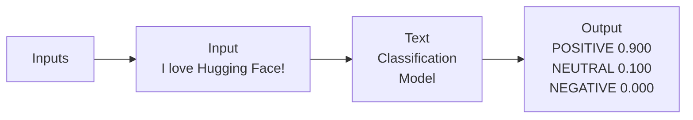
</details>

# What can we do with transformers?

# Complete composites

Task: Given a composite with one (or several) missing token/s, complete it in a reasonable way.

Examples:

\- Text generation (Causal Language Modeling).

Autoregressive  


<details>
<summary>flowchart</summary>

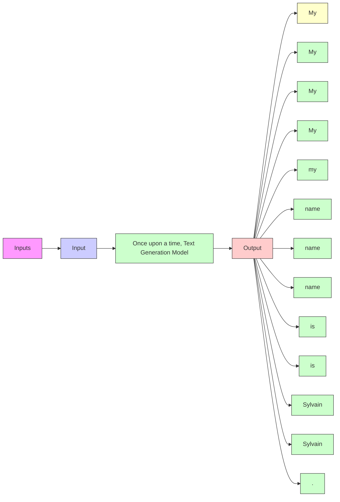
</details>

# What can we do with transformers?

# Complete composites

Task: Given a composite with one (or several) missing token/s, complete it in a reasonable way.

Examples:

\- Masked language modeling (Fill-Mask):

## Inputs

Input

The <mask> barked at me

Fill-

Mask

Model

## Output

wolf


dog


cat


fox


squirrel

0.487

0.061

0.058

0.047

0.025

## What can we do with transformers?

## Complete composites

Task: Given a composite with one (or several) missing token/s, complete it in a reasonable way.

Examples:

\- Image completion (Image inpainting):


## What can we do with transformers?

## Transform composites

Task: Given a composite transform it into a different one.

Examples:

\- Translation

## Inputs

## Input

My name is Omar and I

live in Zürich.

## Translation Model

## Output

## Output

Mein Name ist Omar

und ich wohne in

Zürich.

# What can we do with transformers?

# Transform composites

Task: Given a composite transform it into a different one.

Examples:

\- Summarization

## Inputs

## Input

The tower is 324 metres (1,063 ft) tall, about the same height as an 81-storey building, and the tallest structure in Paris. Its base is square, measuring 125 metres (410 ft) on each side. It was the first structure to reach a height of 300 metres. Excluding transmitters, the Eiffel Tower is the second tallest free-standing structure in France after the Millau Viaduct.

## Summarization Model

## Output

## Output

The tower is 324 metres (1,063 ft) tall, about the same height as an 81-storey building. It was the first structure to reach a height of 300 metres.

## What can we do with transformers?

## Transform composites

Task: Given a composite transform it into a different one.

Examples:

\- Image to Text

Inputs  


<details>
<summary>natural_image</summary>

A herd of giraffes and zebras grazing in a savanna landscape with no visible text or symbols.
</details>

Image-to-Text Model

## Output

Detailed description

a herd of giraffes and

zebras grazing in a field

## What can we do with transformers?

## Transform composites

Task: Given a composite transform it into a different one.

Examples:

\- Text to Image

## Inputs

## Input

A city above clouds, pastel colors, Victorian style

Text-to-Image Model

## Output


<details>
<summary>natural_image</summary>

Fantasy cityscape with ornate architecture and glowing clouds, no visible text or symbols
</details>

https://www.kdnuggets.com/2020/10/understanding-transformers-data-science-way.html

https://www.aprendemachinelearning.com/como-funcionan-los-transformers-espanol-nlp-gpt-bert/

## What can we do with transformers?

Classify composites

Complete composites

Transform composites

## How to classify composites with transformers?

1. Obtain a “good” semantic representation of the composite.  
2. Use it to classify.

Ummm, representations... what do we mean by that???

## Representations matter


<details>
<summary>scatter plot</summary>

| x1       | x2       | Group |
| -------- | -------- | ----- |
| (various) | (various) | Blue  |
| (various) | (various) | Green |
</details>


<details>
<summary>scatter plot</summary>

| Group | x1² | x2² |
|-------|-----|-----|
| Green | 0.1 | 0.3 |
| Green | 0.2 | 0.4 |
| Green | 0.3 | 0.5 |
| Green | 0.4 | 0.6 |
| Green | 0.5 | 0.7 |
| Green | 0.6 | 0.8 |
| Green | 0.7 | 0.9 |
| Green | 0.8 | 1.0 |
| Blue    | 0.1 | 0.2 |
| Blue    | 0.2 | 0.3 |
| Blue    | 0.3 | 0.4 |
| Blue    | 0.4 | 0.5 |
| Blue    | 0.5 | 0.6 |
| Blue    | 0.6 | 0.7 |
| Blue    | 0.7 | 0.8 |
| Blue    | 0.8 | 0.9 |
| Blue    | 0.9 | 1.0 |
| Blue    | 1.0 | 1.1 |
| Blue    | 1.1 | 1.2 |
| Blue    | 1.2 | 1.3 |
| Blue    | 1.3 | 1.4 |
| Blue    | 1.4 | 1.5 |
| Blue    | 1.5 | 1.6 |
| Blue    | 1.6 | 1.7 |
| Blue    | 1.7 | 1.8 |
| Blue    | 1.8 | 1.9 |
| Blue    | 1.9 | 2.0 |
| Blue    | 2.0 | 2.1 |
| Blue    | 2.1 | 2.2 |
| Blue    | 2.2 | 2.3 |
| Blue    | 2.3 | 2.4 |
| Blue    | 2.4 | 2.5 |
| Blue    | 2.5 | 2.6 |
| Blue    | 2.6 | 2.7 |
| Blue    | 2.7 | 2.8 |
| Blue    | 2.8 | 2.9 |
| Blue    | 2.9 | 3.0 |
| Blue    | 3.0 | 3.1 |
| Blue    | 3.1 | 3.2 |
| Blue    | 3.2 | 3.3 |
| Blue    | 3.3 | 3.4 |
| Blue    | 3.4 | 3.5 |
| Blue    | 3.5 | 3.6 |
| Blue    | 3.6 | 3.7 |
| Blue    | 3.7 | 3.8 |
| Blue    | 3.8 | 3.9 |
| Blue    | 3.9 | 4.0 |
| Blue    | 4.0 | 4.1 |
| Blue    | 4.1 | 4.2 |
| Blue    | 4.2 | 4.3 |
| Blue    | 4.3 | 4.4 |
| Blue    | 4.4 | 4.5 |
| Blue    | 4.5 | 4.6 |
| Blue    | 4.6 | 4.7 |
| Blue    | 4.7 | 4.8 |
| Blue    | 4.8 | 4.9 |
| Blue    | 4.9 | 5.0 |
| Blue    | 5.0 | 5.1 |
| Blue    | 5.1 | 5.2 |
| Blue    | 5.2 | 5.3 |
| Blue    | 5.3 | 5.4 |
| Blue    | 5.4 | 5.5 |
| Blue    | 5.5 | 5.6 |
| Blue    | 5.6 | 5.7 |
| Blue    | 5.7 | 5.8 |
| Blue    | 5.8 | 5.9 |
| Blue    | 5.9 | 6.0 |
| Blue    | 6.0 | 6.1 |
| Blue    | 6.1 | 6.2 |
| Blue    | 6.2 | 6.3 |
| Blue    | 6.3 | 6.4 |
| Blue    | 6.4 | 6.5 |
| Blue    | 6.5 | 6.6 |
| Blue    | 6.6 | 6.7 |
| Blue    | 6.7 | 6.8 |
| Blue    | 6.8 | 6.9 |
| Blue    | 6.9 | 7.0 |
| Blue    | 7.0 | 7.1 |
| Blue    | 7.1 | 7.2 |
| Blue    | 7.2 | 7.3 |
| Blue    | 7.3 | 7.4 |
| Blue    | 7.4 | 7.5 |
| Blue    | 7.5 | 7.6 |
| Blue    | 7.6 | 7.7 |
| Blue    | 7.7 | 7.8 |
| Blue    | 7.8 | 7.9 |
| Blue    | 7.9 | 8.0 |
| Blue    | 8.0 | 8.1 |
| Blue    | 8.1 | 8.2 |
| Blue    | 8.2 | 8.3 |
| Blue    | 8.3 | 8.4 |
| Blue    | 8.4 | 8.5 |
| Blue    | 8.5 | 8.6 |
| Blue    | 8.6 | 8.7 |
| Blue    | 8.7 | 8.8 |
| Blue    | 8.8 | 8.9 |
| Blue    | 8.9 | 9.0 |
| Blue    | 9.0 | 9.1 |
| Blue    | 9.1 | 9.2 |
| Blue    | 9.2 | 9.3 |
| Blue    | 9.3 | 9.4 |
| Blue    | 9.4 | 9.5 |
| Blue    | 9.5 | 9.6 |
| Blue    | 9.6 | 9.7 |
| Blue    | 9.7 | 9.8 |
| Blue    | 9.8 | 9.9 |
| Blue    | 9.9 |10.0 |
The chart displays a scatter plot with two distinct clusters of data points labeled by 'Feature Space'. The x-axis is labeled 'x₁²' and the y-axis is labeled 'x₂²'. The data points are grouped into three groups: 'Blue', 'Green', and 'Blue' respectively, with each group's cluster positioned at its respective x and y positions on the plot.
</details>

Figure 2: Representations matter for shallow machine learning models such as Logistic Regression. A simple transformation, e.g. squaring the values of the raw features, may be enough to solve the problem.

## Representation learning

Default Representation  


<details>
<summary>flowchart</summary>

```mermaid
graph TD
  A["Cat: 1"] --> D["Group 1"]
  B["Dog: 2"] --> D
  C["Cat: 3"] --> D
  E["Dog: 4"] --> D
  F["Cat: 5"] --> D
  G["Dog: 6"] --> D
  H["Cat: 7"] --> D
  I["Dog: 8"] --> D
  J["Cat: 9"] --> D
  K["Dog: 10"] --> D
  L["Cat: 11"] --> D
  M["Dog: 12"] --> D
  N["Cat: 13"] --> D
  O["Dog: 14"] --> D
  P["Cat: 15"] --> D
  Q["Dog: 16"] --> D
  R["Cat: 17"] --> D
  S["Dog: 18"] --> D
  T["Cat: 19"] --> D
  U["Dog: 20"] --> D
  V["Cat: 21"] --> D
  W["Dog: 22"] --> D
  X["Cat: 23"] --> D
  Y["Dog: 24"] --> D
  Z["Cat: 25"] --> D
  AA["Dog: 26"] --> D
  AB["Cat: 27"] --> D
  AC["Dog: 28"] --> D
  AD["Cat: 29"] --> D
  AE["Dog: 30"] --> D
  AF["Cat: 31"] --> D
  AG["Dog: 32"] --> D
  AH["Cat: 33"] --> D
  AI["Dog: 34"] --> D
  AJ["Cat: 35"] --> D
  AK["Dog: 36"] --> D
  AL["Cat: 37"] --> D
  AM["Dog: 38"] --> D
  AN["Cat: 39"] --> D
  AO["Dog: 40"] --> D
  AP["Cat: 41"] --> D
  AQ["Dog: 42"] --> D
  AR["Cat: 43"] --> D
  AS["Dog: 44"] --> D
  AT["Cat: 45"] --> D
  AU["Dog: 46"] --> D
  AV["Cat: 47"] --> D
  AW["Dog: 48"] --> D
  AX["Cat: 49"] --> D
  AY["Dog: 50"] --> D
```
</details>

Deep Neural Network

"Good" Semantic Representation  


<details>
<summary>text_image</summary>

Diagram showing cat and dog illustrations with directional arrows, likely illustrating a concept or relationship between animals.
</details>

Cat by Martin LEBRETON, Dog by Serhii Smirnov from the Noun Project

How can we build a “good” semantic representation for composites?

We can use an encoder based on transformer layers.

## How can we build a “good” semantic representation for composites? Encoders

1. Obtain a representation of the composite. It does not have to be “good” or semantic. An initial representation.  
2. Feed the representation through several transformer layers

## How can be build a representation for composites?

Text:

The elements of a sentence are words

Images:


<details>
<summary>natural_image</summary>

Abstract geometric composition of a blue fish shape composed of triangular segments (no text or symbols)
</details>

Patches

Sound:


<details>
<summary>line chart</summary>

| Time Segment | Frequency (s) |
| ------------ | ------------- |
| 0            | 0             |
| 1            | 0.5           |
| 2            | 0.3           |
| 3            | 0.7           |
| 4            | 0.2           |
| 5            | 0.8           |
| 6            | 0.4           |
| 7            | 0.6           |
| 8            | 0.9           |
| 9            | 0.1           |
| 10           | 0.5           |
| 11           | 0.3           |
| 12           | 0.7           |
| 13           | 0.2           |
| 14           | 0.8           |
| 15           | 0.4           |
| 16           | 0.6           |
| 17           | 0.9           |
| 18           | 0.1           |
| 19           | 0.5           |
| 20           | 0.3           |
| 21           | 0.7           |
| 22           | 0.2           |
| 23           | 0.8           |
| 24           | 0.4           |
| 25           | 0.6           |
| 26           | 0.9           |
| 27           | 0.1           |
| 28           | 0.5           |
| 29           | 0.3           |
| 30           | 0.7           |
| 31           | 0.2           |
| 32           | 0.8           |
| 33           | 0.4           |
| 34           | 0.6           |
| 35           | 0.9           |
| 36           | 0.1           |
| 37           | 0.5           |
| 38           | 0.3           |
| 39           | 0.7           |
| 40           | 0.2           |
| 41           | 0.8           |
| 42           | 0.4           |
| 43           | 0.6           |
| 44           | 0.9           |
| 45           | 0.1           |
| 46           | 0.5           |
| 47           | 0.3           |
| 48           | 0.7           |
| 49           | 0.2           |
| 50           | 0.8           |
| 51           | 0.4           |
| 52           | 0.6           |
| 53           | 0.9           |
| 54           | 0.1           |
| 55           | 0.5           |
| 56           | 0.3           |
| 57           | 0.7           |
| 58           | 0.2           |
| 59           | 0.8           |
| 60           | 0.4           |
| 61           | 0.6           |
| 62           | 0.9           |
| 63           | 0.1           |
| 64           | 0.5           |
| 65           | 0.3           |
| 66           | 0.7           |
| 67           | 0.2           |
| 68           | 0.8           |
| 69           | 0.4           |
| 70           | 0.6           |
| 71           | 0.9           |
| 72           | 0.1           |
| 73           | 0.5           |
| 74           | 0.3           |
| 75           | 0.7           |
| 76           | 0.2           |
| 77           | 0.8           |
| 78           | 0.4           |
| 79           | 0.6           |
| 80           | 0.9           |
| Note: The actual values may vary due to the random nature of the data generation.
</details>

Frames

Each of these
elements are referred
to generically as
tokens

We can represent each token as a vector of D real numbers.

The process of going from tokens to vectors of real numbers is called embedding

## Embeddings


<details>
<summary>text_image</summary>

high alignment
low alignment
</details>

Embedding is a means of representing tokens as points in a continuous vector space where the locations of those points in space are semantically meaningful to machine learning (ML) algorithms.

## Word embeddings


<details>
<summary>text_image</summary>

king
man
woman
queen
</details>

Male-Female


<details>
<summary>text_image</summary>

walking
walked
swam
swimming
</details>

Verb Tense


<details>
<summary>flowchart</summary>

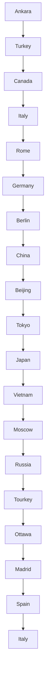
</details>

Country-Capital

## How can we build a representation for composites?

1. Tokenize the composite (divide it into tokens).  
2. Embed each of the token as a vector.

"This is a input text."

Tokenization

<table><tr><td>[CLS]</td><td>This</td><td>is</td><td>a</td><td>input</td><td>.</td><td>[SEP]</td></tr><tr><td>101</td><td>2023</td><td>2003</td><td>1037</td><td>7953</td><td>1012</td><td>102</td></tr></table>


Embeddings

<table><tr><td>0.0390,-0.0123,-0.0208,...</td><td>-0.0558,0.0151,0.0031,...</td><td>-0.0440,-0.0236,-0.0283,...</td><td>0.0119,-0.0037,-0.0402,...</td><td>0069,0.0057,-0.0016,...</td><td>0.0199,-0.0095,-0.0099,...</td><td>-0.0788,0.0202,-0.0352,...</td></tr></table>


## How can we build a “good” semantic representation for composites? Encoders

1. Obtain a representation of the composite. It does not have to be “good” or semantic. An initial representation.  
2. Feed the representation through several transformer layers to obtain “context-aware” embeddings.


<details>
<summary>flowchart</summary>

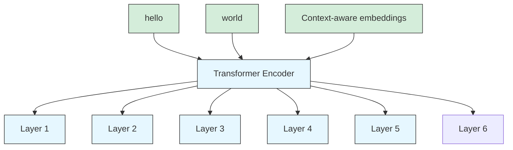
</details>

## What are “context-aware” embeddings

The embedding of a token captures its “meaning”.

In a composite, the meaning of a token depends on other tokens

The humanoid robot did not cross the road, as it was very dangerous.

The humanoid robot did not cross the road because it was tired.

## How do transformer layers deal with context?

Transformer layers allows for the exchange of information between tokens. We can understand it as:

1. Each token sends a message to every other token.  
2. Each token computes how much does it want to take into account the messages of each other token. This is the idea of attention.  
3. Each token moves away from his embedding in the direction signaled by the message of each other token weighted by the attention that he is paying to that token.

## How do transformer layers deal with context? Attention


<details>
<summary>flowchart</summary>

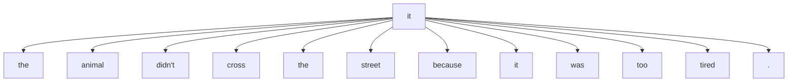
</details>


<details>
<summary>flowchart</summary>

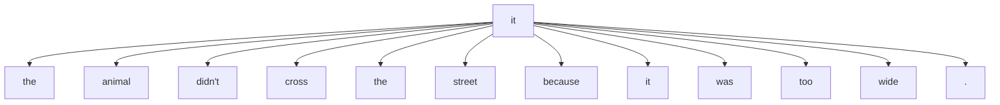
</details>

## Text classification with transformers


<details>
<summary>flowchart</summary>


</details>

## Text classification with transformers using BERT

Devlin, Jacob, Ming-Wei Chang, Kenton Lee, and Kristina Toutanova. "BERT: Pre-Training of Deep Bidirectional Transformers for Language Understanding." arXiv, May 24, 2019. https://doi.org/10.48550/arXiv.1810.04805.


<details>
<summary>flowchart</summary>

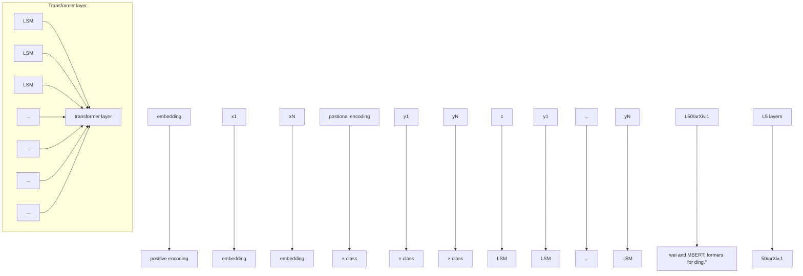
</details>


<details>
<summary>text_image</summary>

Christopher M. Bishop
with Hugh Bishop
Deep Learning
Foundations
and Concepts
Springer
</details>

Bishop, Christopher M., and Hugh Bishop. Deep Learning: Foundations and Concepts. Cham: Springer International Publishing, 2024. https://doi.org/10.1007/978-3-031-45468-4.

## How do transformer layers deal with context?

Transformer layers allows for the exchange of information between tokens. We can understand it as:

1. Each token sends a message to every other token.  
2. Each token computes how much does it want to take into account the messages of each other token. This is the idea of attention.  
3. Each token moves away from his embedding in the direction signaled by the message of each other token weighted by the attention that he is paying to that token.

This is a general intuition. To understand better we need to understand how the encoder is trained.

## BERT training MLM

Output

MLM teaches BERT to understand relationships between words


<details>
<summary>flowchart</summary>

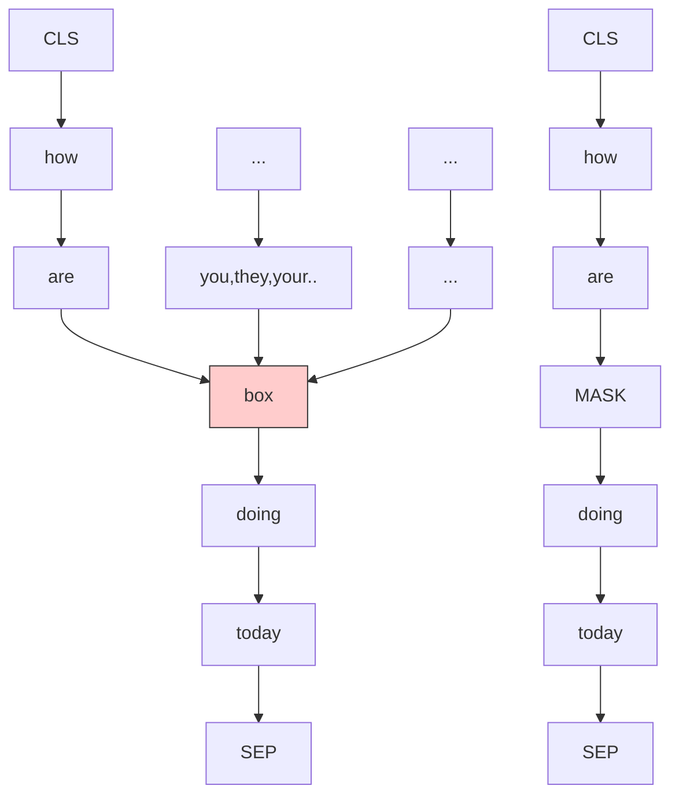
</details>

One of the key techniques used in pre-training BERT is the Masked Language Model (MLM). In this approach, a certain percentage of the input tokens are randomly selected (usually around 15% of the tokens) and masked (replaced with a [MASK] token). The objective of the MLM is to predict the original masked words based on the surrounding context. Hence, BERT is useful for completing composites (MLM).

## BERT training NSP


<details>
<summary>flowchart</summary>

```mermaid
graph TD
  A["Class Label"] --> B["C"]
  A --> C["T₁"]
  B --> D["Tₙ"]
  C --> E["T[SEP"]]
  D --> F["M₁"]
  E --> G["Mₘ"]
  H["BERT"] --> I["Ecls"]
  H --> J["E₁"]
  H --> K["TK 1"]
  H --> L["TK N"]
  H --> M["TK 1"]
  H --> N["TK N"]
    I <--> O["[CLS"]]
    J <--> P["Tok 1"]
    K <--> Q["TK N"]
    L <--> R["TK 1"]
    M <--> S["TK 1"]
    N <--> T["TK N"]
  U["First Sentence"] --> V["[CLS"]]
  W["Second Sentence"] --> X["Tok 1"]
  Y["Class Label"] --> Z["C"]
  Y --> AA["T₁"]
  Z --> AB["Tₙ"]
  Z --> AC["T[SEP"]]
  Z --> AD["M₁"]
  Z --> AE["Mₘ"]
```
</details>

NSP teaches BERT to understand longer-term dependencies across sentences.

## Text classification with transformers using BERT

Now we can understand this better!


<details>
<summary>flowchart</summary>

```mermaid
graph TD
  A[" stand "] --> B[" Transformer layer "]
  B --> C[" L layers "]
  C --> D[" positioning encoding "]
  D --> E[" embedding "]
  E --> F[" <class> "]
  F --> G[" x1 "]
  G --> H[" embedding "]
  H --> I[" xN "]
  I --> J[" embedded "]
  J --> K[" + "]
  K --> L[" positional encoding "]
  L --> M[" ... "]
  M --> N[" ... "]
  N --> O[" ... "]
  O --> P[" ... "]
  P --> Q[" ... "]
  Q --> R[" ... "]
  R --> S[" ... "]
  S --> T[" ... "]
  T --> U[" ... "]
  U --> V[" ... "]
  V --> W[" ... "]
  W --> X[" ... "]
  X --> Y[" ... "]
  Y --> Z[" ... "]
  Z --> AA[" ... "]
  AA --> AB[" ... "]
  AB --> AC[" ... "]
  AC --> AD[" ... "]
  AD --> AE[" ... "]
  AE --> AF[" ... "]
  AF --> AG[" ... "]
  AG --> AH[" ... "]
  AH --> AI[" ... "]
  AI --> AJ[" ... "]
  AJ --> AK[" ... "]
  AK --> AL[" ... "]
  AL --> AM[" ... "]
  AM --> AN[" ... "]
  AN --> AO[" ... "]
  AO --> AP[" ... "]
  AP --> AQ[" ... "]
  AQ --> AR[" ... "]
  AR --> AS[" ... "]
  AS --> AT[" ... "]
  AT --> AU[" ... "]
  AU --> AV[" ... "]
  AV --> AW[" ... "]
  AW --> AX[" ... "]
  AX --> AY[" ... "]
  AY --> AZ[" ... "]
  AZ --> BA[" ... "]
  BA --> BB[" ... "]
  BB --> BC[" ... "]
  BC --> BD[" ... "]
  BD --> BE[" ... "]
  BE --> BF[" ... "]
  BF --> BG[" ... "]
  BG --> BH[" ... "]
  BH --> BI[" ... "]
  BI --> BJ[" ... "]
  BJ --> BK[" ... "]
  BK --> BL[" ... "]
  BL --> BM[" ... "]
  BM --> BN[" ... "]
  BN --> BO[" ... "]
  BO --> BP[" ... "]
  BP --> BQ[" ... "]
  BQ --> BR[" ... "]
  BR --> BS[" ... "]
  BS --> BT[" ... "]
  BT --> BU[" ... "]
  BU --> BV[" ... "]
  BV --> BW[" ... "]
  BW --> BX[" ... "]
  BX --> BY[" ... "]
  BY --> BZ[" ... "]
  BZ --> CA[" ... "]
  CA --> CB[" ... "]
  CB --> CC[" ... "]
  CC --> CD[" ... "]
  CD --> CE[" ... "]
  CE --> CF[" ... "]
  CF --> CG[" ... "]
  CG --> CH[" ... "]
  CH --> CI[" ... "]
  CI --> CJ[" ... "]
  CJ --> CK[" ... "]
  CK --> CL[" ... "]
  CL --> CM[" ... "]
  CM --> CN[" ... "]
  CN --> CO[" ... "]
  CO --> CP[" ... "]
  CP --> CQ[" ... "]
  CQ --> CR[" ... "]
  CR --> CS[" ... "]
  CS --> CT[" ... "]
  CT --> CU[" ... "]
  CU --> CV[" ... "]
  CV --> CW[" ... "]
  CW --> CX[" ... "]
  CX --> CY[" ... "]
  CY --> CZ[" ... "]
  CZ --> DA[" ... "]
  DA --> DB[" ... "]
  DB --> DC[" ... "]
  DC --> DD[" ... "]
  DD --> DE[" ... "]
  DE --> DF[" ... "]
  DF --> DG[" ... "]
  DG --> DH[" ... "]
  DH --> DI[" ... "]
  DI --> DJ[" ... "]
  DJ --> DK[" ... "]
  DK --> DL[" ... "]
  DL --> DJ
```
</details>


<details>
<summary>text_image</summary>

Christopher M. Bishop
with Hugh Bishop
Deep Learning
Foundations
and Concepts
Springer
</details>

Bishop, Christopher M., and Hugh Bishop. Deep Learning: Foundations and Concepts. Cham: Springer International Publishing, 2024. https://doi.org/10.1007/978-3-031-45468-4.

Interested on fine tuning BERT for classification? Read more

Sun, Chi, Xipeng Qiu, Yige Xu, and Xuanjing Huang. “How to Fine-Tune BERT for Text Classification?” arXiv, February 5, 2020. https://doi.org/10.48550/arXiv.1905.05583.

## Image classification with ViT


<details>
<summary>flowchart</summary>

```mermaid
graph TD
  A["Input Class 0"] --> B["Transformer Encoder"]
  C["Input Class 1"] --> B
  D["Input Class 2"] --> B
  E["Input Class 3"] --> B
  F["Input Class 4"] --> B
  G["Input Class 5"] --> B
  H["Input Class 6"] --> B
  I["Input Class 7"] --> B
  J["Input Class 8"] --> B
  K["Input Class 9"] --> B
  L["Final Embeddings"] --> B
  M["Extra learnable [class"] embedding] --> A
  N["Patch + Position Embedding"] --> O["Linear Projection of Flattened Patches"]
  P["Image of Dog in Top Left"] --> Q["Output Image"]
```
</details>

ViT process with the learnable class embedding highlight (left).

Dosovitskiy, Alexey, Lucas Beyer, Alexander Kolesnikov, Dirk Weissenborn, Xiaohua Zhai, Thomas Unterthiner, Mostafa Dehghani, et al. “An Image Is Worth 16x16 Words: Transformers for Image Recognition at Scale.” arXiv, June 3, 2021. https://doi.org/10.48550/arXiv.2010.11929.

## What can we do with transformers?

Classify composites


<details>
<summary>natural_image</summary>

Green circular icon with a white checkmark (no text or symbols)
</details>

Complete composites


<details>
<summary>natural_image</summary>

Wooden box with orange 3D sculpture on a wooden table, no visible text or symbols
</details>

Transform composites

## How to generate composites? Decoders


<details>
<summary>flowchart</summary>

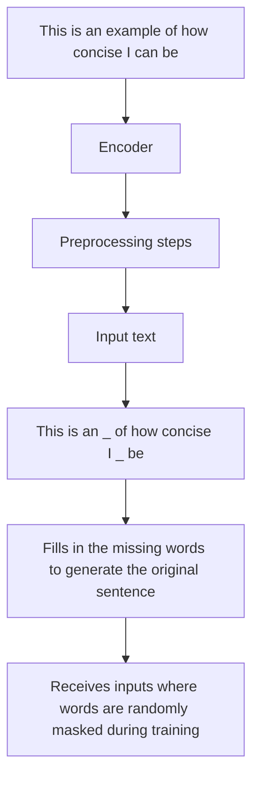
</details>


<details>
<summary>flowchart</summary>

```mermaid
graph TD
  A["Decoder"] --> B["Preprocessing steps"]
  B --> C["Input text"]
  C --> D["This is an example of how concise I can be"]
  D --> E["This is an example of how concise I can"]
  E --> F["Receives incomplete texts"]
    style A fill:#cce5ff,stroke:#333
    style B fill:#cce5ff,stroke:#333
    style C fill:#cce5ff,stroke:#333
    style D fill:#cce5ff,stroke:#333
    style E fill:#cce5ff,stroke:#333
    note right of A: "This is an example of how concise I can be"
    note right of D: "Learns to generate one word at a time"
```
</details>


<details>
<summary>text_image</summary>

BUILD A
Large Language
Model
SEBASTIAN RUSCHKA
FRANK
SCOTIA
MORNING
</details>

Raschka, Sebastian. Build a Large Language Model (From Scratch). Manning, 2024.

## How to generate composites? Decoders


<details>
<summary>flowchart</summary>

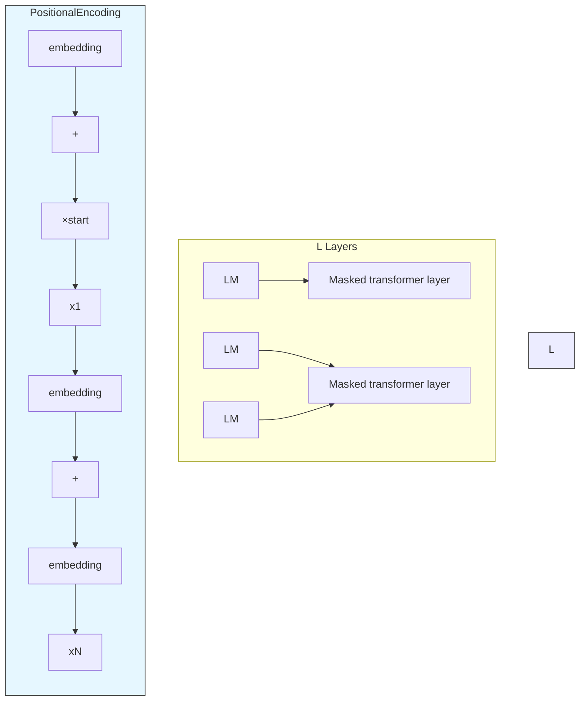
</details>


<details>
<summary>text_image</summary>

Christopher M. Bishop
with Hugh Bishop

Deep Learning

Foundations
and Concepts

Springer
</details>

Bishop, Christopher M., and Hugh Bishop. Deep Learning: Foundations and Concepts. Cham: Springer International Publishing, 2024. https://doi.org/10.1007/978-3-031-45468-4.

## What is masked attention?


<details>
<summary>flowchart</summary>

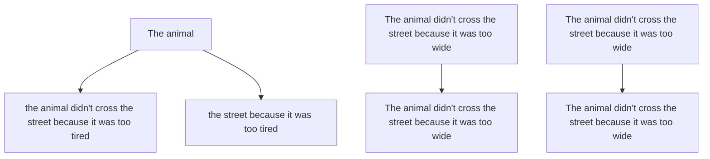
</details>

## What is masked attention?

How much token “Life” attends to token “first”  


<details>
<summary>heatmap</summary>

| | Life | is | short | eat | desert | first |
|---|---|---|---|---|---|---|
| Life | 0.17 | 0.13 | 0.18 | 0.16 | 0.15 | 0.18 |
| is | 0.03 | 0.68 | 0.02 | 0.08 | 0.14 | 0.02 |
| short | 0.19 | 0.06 | 0.25 | 0.14 | 0.11 | 0.23 |
| eat | 0.15 | 0.21 | 0.14 | 0.16 | 0.17 | 0.14 |
| desert | 0.13 | 0.27 | 0.11 | 0.16 | 0.18 | 0.12 |
| first | 0.19 | 0.02 | 0.31 | 0.11 | 0.07 | 0.27 |
</details>

In the row for corresponding to "Life", mask out all words that come after "Life"  


<details>
<summary>heatmap</summary>

| | Life | is | short | eat | desert | first |
|---|---|---|---|---|---|---|
| Life | 0.17 | 0.13 | 0.18 | 0.16 | 0.15 | 0.18 |
| is | 0.03 | 0.68 | 0.02 | 0.08 | 0.14 | 0.02 |
| short | 0.19 | 0.06 | 0.25 | 0.14 | 0.11 | 0.23 |
| eat | 0.15 | 0.21 | 0.14 | 0.16 | 0.17 | 0.14 |
| desert | 0.13 | 0.27 | 0.11 | 0.16 | 0.18 | 0.12 |
| first | 0.19 | 0.02 | 0.31 | 0.11 | 0.07 | 0.27 |
</details>

## How to generate composites? Decoders


<details>
<summary>flowchart</summary>

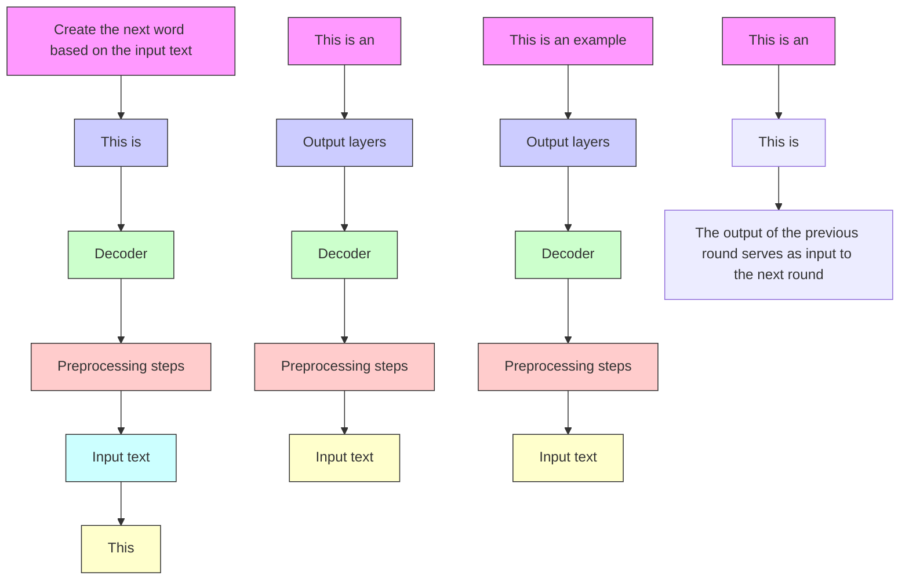
</details>


<details>
<summary>text_image</summary>

BUILD A
Large Language
Model
Sebastian Raschka
STONY SCOTKA
MENNING
</details>

Raschka, Sebastian. Build a Large Language Model (From Scratch). Manning, 2024.

Autoregressive

## How are decoders trained?

## The model is simply trained to predict the next word


<details>
<summary>text_image</summary>

BUILD A
Large Language
Model
Sebastian Ruschka
MORNING
FRANKY SCOTCHA
</details>

Raschka, Sebastian. Build a Large Language Model (From Scratch). Manning, 2024.

## How are decoders efficiently trained?


<details>
<summary>flowchart</summary>

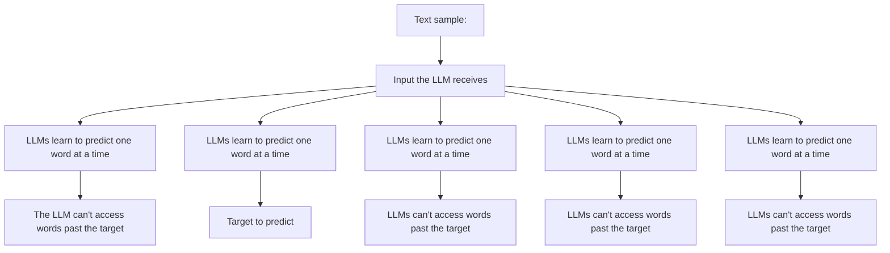
</details>


<details>
<summary>text_image</summary>

BUILD A
Large Language
Model
Sebastian Raschka
STONY SCOTKA
MENNING
</details>

Raschka, Sebastian.
Build a Large Language
Model (From Scratch).
Manning, 2024.

## What can we do with transformers?

Classify composites


<details>
<summary>natural_image</summary>

Green circular icon with a white checkmark (no text or symbols)
</details>

Complete composites


<details>
<summary>natural_image</summary>

Green circular icon with a white checkmark symbol (no text or numbers)
</details>

Transform composites

## Transforming composites. Encoders and decoders together 8) The complete output


<details>
<summary>flowchart</summary>

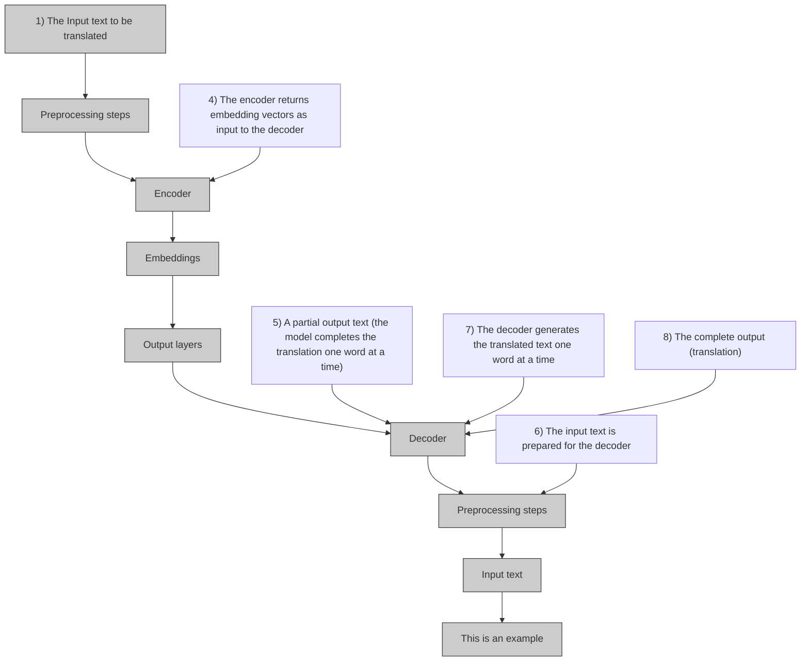
</details>


<details>
<summary>text_image</summary>

BUILD A
Large Language
Model
Sebastian Ruschka
MORNING
FRANKY SCOTCHA
</details>

Raschka, Sebastian.
Build a Large Language
Model (From Scratch).
Manning, 2024.

## Transforming composites. Encoders and decoders together 8) The complete output


<details>
<summary>natural_image</summary>

3D white figure sitting on a red question mark, no text or symbols present
</details>


<details>
<summary>flowchart</summary>

```mermaid
graph TD
  A["1) The Input text to be translated"] --> B["Preprocessing steps"]
  B --> C["Encoder"]
  C --> D["Embeddings"]
  D --> E["Output layers"]
  E --> F["Decoder"]
  F --> G["Preprocessing steps"]
  G --> H["Input text"]
  H --> I["This is an example"]
  I --> J["Encoder has access to the complete input text to produce text encodings used by the decoder"]
  J --> K["The encoder returns embedding vectors as input to the decoder"]
  K --> L["Embeddings"]
  L --> M["Das ist ein"]
  M --> N["The complete output (translation)"]
  N --> O["Output layers"]
  O --> P["7) The decoder generates the translated text one word at a time"]
  P --> Q["Preprocessing steps"]
  Q --> R["Input text"]
  R --> S["Das ist ein"]
  S --> T["5) A partial output text (the model completes the translation one word at a time)"]
  T --> U["Preprocessing steps"]
  U --> V["Encoder"]
  V --> W["Embeddings"]
  W --> X["Das ist ein"]
```
</details>


<details>
<summary>text_image</summary>

BUILD A
Large Language
Model
Sebastian Ruschka
MORNING
FRANKY SCOTCHA
</details>

Raschka, Sebastian.
Build a Large Language
Model (From Scratch).
Manning, 2024.

## Decoders vs. conditional decoders


<details>
<summary>flowchart</summary>

```mermaid
graph TD
  A["This is an example of how concise I can be"] --> B["Decoder"]
  B --> C["Preprocessing steps"]
  C --> D["Input text"]
  D --> E["This is an example of how concise I can"]
  E --> F["Receives incomplete texts"]
  G["Leads to generate one word at a time"] --> A
```
</details>

Approximate

$$
p (x _ {n} | x _ {1}, \ldots , x _ {n - 1})
$$


<details>
<summary>flowchart</summary>

```mermaid
graph TD
  A["Input text"] --> B["Preprocessing steps"]
  B --> C["Decoder"]
  C --> D["Das ist ein"]
  D --> E["Output layers"]
  E --> F["Das ist ein Beispiel"]
  F --> G["8) The complete output (translation)"]
  C --> H["7) The decoder generates the translated text one word at a time"]
  C --> I["6) The input text is prepared for the decoder"]
  I --> J["5) A partial output text (the model completes the translation one word at a time)"]
```
</details>

Approximate

$$
p (x _ {n} | x _ {1}, \dots , x _ {n - 1}, c)
$$


<details>
<summary>text_image</summary>

BUILD A
Large Language
Model
Sebastian Ruschka
STOW
EASTRA
</details>

Raschka, Sebastian.  
Build a Large Language  
Model (From Scratch).  
Manning, 2024.

What is the most likely next word if the sentence meaning is c?

## Transforming composites.


<details>
<summary>flowchart</summary>

```mermaid
graph TD
    subgraph Encoder[encoder]
  A1["self-attention transformer layer"] --> B1["..."]
  A2["self-attention transformer layer"] --> B2["+"]
  C["embedding"] --> D["X"]
    end
    subgraph Conditional[conditional decoder]
  E1["cross-attention transformer layer"] --> F1["..."]
  E2["cross-attention transformer layer"] --> F2["+"]
  G["embedding"] --> H["{<start>, Y1:N-1}"]
    end
  I["Z"] --> J["self-attention transformer layer"]
  J --> A1
  J --> A2
  K["YN"] --> L["LSM"]
  L --> M["Cross-attention transformer layer"]
  M --> E1
  M --> E2
    style Encoder fill:#f9f,stroke:#333
    style Conditional fill:#bbf,stroke:#333
```
</details>


<details>
<summary>text_image</summary>

Christopher M. Bishop
with Hugh Bishop

Deep Learning

Foundations
and Concepts

Springer
</details>

Bishop, Christopher M., and Hugh Bishop. Deep Learning: Foundations and Concepts. Cham: Springer International Publishing, 2024. https://doi.org/10.1007/978-3-031-45468-4.

## What can we do with transformers?

Classify composites


<details>
<summary>natural_image</summary>

Green circular icon with a white checkmark (no text or symbols)
</details>

Complete composites


<details>
<summary>natural_image</summary>

Green circular icon with a white checkmark symbol (no text or numbers)
</details>

Transform composites


<details>
<summary>natural_image</summary>

Green circular icon with a white checkmark symbol (no text or numbers)
</details>

## Opening the box. Understanding transformer layers.

Transformer layer -> Encoders

Masked transformer layer -> Decoders

Cross-attention transformer layer -> Conditional decoders

## Transformer layer

A composite as a matrix

N (tokens)


<details>
<summary>text_image</summary>

xₙᵀ
X
</details>

D (features)

$\widetilde{\mathbf{X}} = \text{TransformerLayer}[\mathbf{X}]$ .

## Transformer layer

## Algorithm 12.3: Transformer layer

Input: Set of tokens $X \in R^{N \times D} : \{x_{1}, \ldots, x_{N}\}$ Multi-head self-attention layer parameters
Feed-forward network parameters

Output: $\widetilde{\mathbf{X}}\in \mathbb{R}^{N\times D}:\{\widetilde{\mathbf{x}}_1,\dots ,\widetilde{\mathbf{x}}_N\}$

$\mathbf{Z} = \text{LayerNorm}[\mathbf{Y}(\mathbf{X}) + \mathbf{X}] // \mathbf{Y}(\mathbf{X})$ from Algorithm 12.2 $\widetilde{\mathbf{X}} = \text{LayerNorm}[\text{MLP}[\mathbf{Z}] + \mathbf{Z}] // \text{shared neural network}$ return $\widetilde{\mathbf{X}}$

Y(X): Result of applying multi-head self-attention


<details>
<summary>flowchart</summary>

```mermaid
graph TD
  X["Input X̃"] --> Add1["add & norm"]
  Add1 --> MLP["MLP"]
  MLP --> Add2["add & norm"]
  Add2 --> MultiHead["multi-head self-attention"]
  MultiHead --> Add3["add & norm"]
  Add3 --> Add4["MLP"]
  Add4 --> Add5["add & norm"]
  Add5 --> Add6["Output X̃"]
  Add6 --> Add7["Output X"]
  Add7 --> Add8["Output X̃"]
  Add8 --> Add9["Output X"]
  Add9 --> Add10["Output X̃"]
  Add10 --> Add11["Output X̃"]
  Add11 --> Add12["Output X̃"]
  Add12 --> Add13["Output X̃"]
  Add13 --> Add14["Output X̃"]
  Add14 --> Add15["Output X̃"]
  Add15 --> Add16["Output X̃"]
  Add16 --> Add17["Output X̃"]
  Add17 --> Add18["Output X̃"]
  Add18 --> Add19["Output X̃"]
  Add19 --> Add20["Output X̃"]
  Add20 --> Add21["Output X̃"]
  Add21 --> Add22["Output X̃"]
  Add22 --> Add23["Output X̃"]
  Add23 --> Add24["Output X̃"]
  Add24 --> Add25["Output X̃"]
  Add25 --> Add26["Output X̃"]
  Add26 --> Add27["Output X̃"]
  Add27 --> Add28["Output X̃"]
  Add28 --> Add29["Output X̃"]
  Add29 --> Add30["Output X̃"]
  Add30 --> Add31["Output X̃"]
  Add31 --> Add32["Output X̃"]
  Add32 --> Add33["Output X̃"]
  Add33 --> Add34["Output X̃"]
  Add34 --> Add35["Output X̃"]
  Add35 --> Add36["Output X̃"]
  Add36 --> Add37["Output X̃"]
  Add37 --> Add38["Output X̃"]
  Add38 --> Add39["Output X̃"]
  Add39 --> Add40["Output X̃"]
  Add40 --> Add41["Output X̃"]
  Add41 --> Add42["Output X̃"]
  Add42 --> Add43["Output X̃"]
  Add43 --> Add44["Output X̃"]
  Add44 --> Add45["Output X̃"]
  Add45 --> Add46["Output X̃"]
  Add46 --> Add47["Output X̃"]
  Add47 --> Add48["Output X̃"]
  Add48 --> Add49["Output X̃"]
  Add49 --> Add50["Output X̃"]
  Add50 --> Add51["Output X̃"]
  Add51 --> Add52["Output X̃"]
  Add52 --> Add53["Output X̃"]
  Add53 --> Add54["Output X̃"]
  Add54 --> Add55["Output X̃"]
  Add55 --> Add56["Output X̃"]
  Add56 --> Add57["Output X̃"]
  Add57 --> Add58["Output X̃"]
  Add58 --> Add59["Output X̃"]
  Add59 --> Add60["Output X̃"]
  Add60 --> Add61["Output X̃"]
  Add61 --> Add62["Output X̃"]
  Add62 --> Add63["Output X̃"]
  Add63 --> Add64["Output X̃"]
  Add64 --> Add65["Output X̃"]
  Add65 --> Add66["Output X̃"]
  Add66 --> Add67["Output X̃"]
  Add67 --> Add68["Output X̃"]
  Add68 --> Add69["Output X̃"]
  Add69 --> Add70["Output X̃"]
  Add70 --> MultiHead
  MultiHead --> MultiHead
```
</details>

## Attention coefficients

$$
\mathbf {y} _ {n} = \sum_ {m = 1} ^ {N} a _ {n m} \mathbf {x} _ {m} \quad Y = A X
$$

$a_{nm}$ : how much token n attends to token m

$$
\begin{array}{l} a _ {n m} \geqslant 0 \\ \sum_ {m = 1} ^ {N} a _ {n m} = 1. \\ \end{array}
$$

This is a convex combination, play with one here:

https://www.geogebra.org/m/ekyrkytj

## How to compute attention weights

For each token $x_{i}$ we compute:

- A query $q_i$ . It encodes the kind of tokens that $x_i$ is willing to receive messages from.  
- A key $k_{i}$ . It encodes the kind of tokens that $x_{i}$ is willing to send messages to.  
- A value $v_i$ . It encodes the message that $x_i$ is willing to distribute to whomever wants to pay attention to it.

Now to compute $a_{nm}$ , the attention token n devotes to token m, we compute the dot product of $\langle q_{n}, k_{m} \rangle$ . The larger the dot product, the larger the attention.

## Attention via linear transformations

We can easily compute queries, keys and values using independent linear transformations of the matrix X.


<details>
<summary>flowchart</summary>

```mermaid
graph TD
  Y --> mat_mul["mat mul"]
  mat_mul --> softmax["softmax"]
  softmax --> scale["scale"]
  scale --> mat_mul["mat mul"]
  mat_mul --> W_q["W^(q)"]
  mat_mul --> W_k["W^(k)"]
  mat_mul --> W_v["W^(v)"]
  W_q --> X["X"]
  W_k --> X
  W_v --> X
    style mat_mul fill:#f9f,stroke:#333
    style softmax fill:#ccf,stroke:#333
    style scale fill:#cfc,stroke:#333
    style W_q fill:#fcc,stroke:#333
    style W_k fill:#fcc,stroke:#333
    style W_v fill:#fcc,stroke:#333
```
</details>

$$
\mathbf {Q} = \mathbf {X} \mathbf {W} ^ {(q)}
$$

$$
\mathbf {K} = \mathbf {X} \mathbf {W} ^ {(k)}
$$

$$
\mathbf {V} = \mathbf {X} \mathbf {W} ^ {(v)}
$$

W matrices (encoding the linear transformations) are parameters of the Transformer layer

$$
A = \operatorname{Softmax} \left[ \frac {Q K ^ {T}}{\sqrt {D _ {k}}} \right]
$$

$$
Y = A V
$$

## Softmax


<details>
<summary>flowchart</summary>

```mermaid
graph LR
  A["0.25\n1.23\n-0.8"] --> B["Softmax"]
  B --> C["0.249\n0.664\n0.087"]
```
</details>

## Self-Attention


<details>
<summary>bar chart</summary>

| Input        | Thinking | Machines |
| ------------ | -------- | -------- |
| Embedding    | X₁       | X₂       |
| Queries      | q₁       | q₂       |
| Keys         | k₁       | k₂       |
| Values       | v₁       | v₂       |
</details>


<details>
<summary>text_image</summary>

W^Q
W^K
W^V
</details>


<details>
<summary>text_image</summary>

X
W^Q
=
Q
X
W^K
=
K
X
W^V
=
V
</details>

## Scaled self-attention in one slide. One attention head


<details>
<summary>flowchart</summary>

```mermaid
graph TD
  Y --> mat_mul["mat mul"]
  mat_mul --> softmax["softmax"]
  softmax --> scale["scale"]
  scale --> mat_mul["mat mul"]
  mat_mul --> W_q["W^(q)"]
  mat_mul --> W_k["W^(k)"]
  mat_mul --> W_v["W^(v)"]
  W_q --> X["X"]
  W_k --> X
  W_v --> X
    style mat_mul fill:#f9f,stroke:#333
    style softmax fill:#ccf,stroke:#333
    style scale fill:#cfc,stroke:#333
    style W_q fill:#ffc,stroke:#333
    style W_k fill:#ffc,stroke:#333
    style W_v fill:#ffc,stroke:#333
```
</details>

## Algorithm 12.1: Scaled dot-product self-attention

Input: Set of tokens $\mathbf{X} \in \mathbb{R}^{N \times D}: \{\mathbf{x}_1, \ldots, \mathbf{x}_N\}$ Weight matrices $\{\mathbf{W}^{(q)}, \mathbf{W}^{(k)}\} \in \mathbb{R}^{D \times D_k}$ and $\mathbf{W}^{(v)} \in \mathbb{R}^{D \times D_v}$

Output: Attention $(\mathbf{Q},\mathbf{K},\mathbf{V})\in \mathbb{R}^{N\times D_{\mathrm{v}}}$ : $\{\mathbf{y}_1,\dots ,\mathbf{y}_N\}$

$$
\mathbf {Q} = \mathbf {X W} ^ {(q)} / / \text {compute queries} \mathbf {Q} \in \mathbb {R} ^ {N \times D _ {k}}
$$

$$
\mathbf {K} = \mathbf {X W} ^ {(k)} / / \text {compute keys} \mathbf {K} \in \mathbb {R} ^ {N \times D _ {k}}
$$

$$
\mathbf {V} = \mathbf {X} \mathbf {W} ^ {(v)} / / \text {compute values} \mathbf {V} \in \mathbb {R} ^ {N \times D}
$$

return Attention(Q, K, V) = Softmax $\left[\frac{\mathbf{Q}\mathbf{K}^{\mathrm{T}}}{\sqrt{D_{\mathrm{k}}}}\right]\mathbf{V}$

## Multi head attention


<details>
<summary>tree diagram</summary>

| Word | Item |
| :--- | :--- |
| The_ | The |
| animal_ | animal |
| didn_ | didn |
| _ | _ |
| t_ | t |
| cross_ | cross |
| the_ | the |
| street_ | street |
| because_ | because |
| it_ | it |
| was_ | was |
| too_ | too |
| tire | tire |
| d_ | d |
</details>

## Multi head attention

## Each attention head learns a specific set of parameters W


<details>
<summary>text_image</summary>

I am specialized in colour information
I am specialized in taste information
I am specialized in movement information
I am specialized in time related information
</details>

Together, we can run the galaxy!

## Multi head attention


<details>
<summary>flowchart</summary>

```mermaid
graph TD
  A["linear"] --> B["concat"]
  B --> C["self-attention"]
  B --> D["self-attention"]
  B --> E["self-attention"]
  C --> F["X"]
  D --> F
  E --> F
  F --> G["..."]
  G --> H["X"]
  H --> I["Y"]
  I --> A
```
</details>

## Multi-Head Attention

1) This is our input sentence\*

2) We embed each word\*

3) Split into 8 heads. We multiply X or R with weight matrices

4) Calculate attention using the resulting Q/K/V matrices

5) Concatenate the resulting Z matrices, then multiply with weight matrix $W^{o}$ to produce the output of the layer

Thinking Machines


\* In all encoders other than #0, we don't need embedding. We start directly with the output of the encoder right below this one


<details>
<summary>text_image</summary>

W₀^Q
W₀^K
W₀^V
</details>


<details>
<summary>text_image</summary>

W₁^Q
W₁^K
W₁^V
</details>


<details>
<summary>text_image</summary>

W7^Q
W7^K
W7^V
</details>


<details>
<summary>text_image</summary>

Q₇
K₇
V₇
</details>


<details>
<summary>text_image</summary>

W⁰
Z
</details>

## Multi head attention

## Algorithm 12.2: Multi-head attention

Input: Set of tokens $\mathbf{X} \in \mathbb{R}^{N \times D}: \{\mathbf{x}_1, \ldots, \mathbf{x}_N\}$

Query weight matrices $\{\mathbf{W}_1^{(\mathrm{q})},\dots ,\mathbf{W}_H^{(\mathrm{q})}\} \in \mathbb{R}^{D\times D}$

Key weight matrices $\{\mathbf{W}_1^{(\mathrm{k})},\dots ,\mathbf{W}_H^{(\mathrm{k})}\} \in \mathbb{R}^{D\times D}$

Value weight matrices $\{\mathbf{W}_1^{(\mathrm{v})},\dots ,\mathbf{W}_H^{(\mathrm{v})}\} \in \mathbb{R}^{D\times D_{\mathrm{v}}}$

Output weight matrix $\mathbf{W}^{(o)}\in \mathbb{R}^{HD_{v}\times D}$

Output: $\mathbf{Y} \in \mathbb{R}^{N \times D}: \{\mathbf{y}_1, \dots, \mathbf{x}_N\}$

// compute self-attention for each head (Algorithm 12.1)

for $h = 1,\dots ,H$ do

$$
\mathbf {Q} _ {h} = \mathbf {X} \mathbf {W} _ {h} ^ {\mathrm{(q)}}, \quad \mathbf {K} _ {h} = \mathbf {X} \mathbf {W} _ {h} ^ {\mathrm{(k)}}, \quad \mathbf {V} _ {h} = \mathbf {X} \mathbf {W} _ {h} ^ {\mathrm{(v)}}
$$

$$
\mathbf {H} _ {h} = \text { Attention } \left(\mathbf {Q} _ {h}, \mathbf {K} _ {h}, \mathbf {V} _ {h}\right) / / \mathbf {H} _ {h} \in \mathbb {R} ^ {N \times D _ {\mathrm{v}}}
$$

end for

$\mathbf{H} = \operatorname {Concat}\left[\mathbf{H}_{1},\dots ,\mathbf{H}_{\mathbf{N}}\right]$ // concatenate heads

return $\mathbf{Y}(\mathbf{X}) = \mathbf{H}\mathbf{W}^{(\mathrm{o})}$

## Transformer layer

## Algorithm 12.3: Transformer layer

Input: Set of tokens $X \in R^{N \times D} : \{x_{1}, \ldots, x_{N}\}$ Multi-head self-attention layer parameters
Feed-forward network parameters

Output: $\widetilde{\mathbf{X}}\in \mathbb{R}^{N\times D}:\{\widetilde{\mathbf{x}}_1,\dots ,\widetilde{\mathbf{x}}_N\}$

$\mathbf{Z} = \text{LayerNorm}[\mathbf{Y}(\mathbf{X}) + \mathbf{X}] // \mathbf{Y}(\mathbf{X})$ from Algorithm 12.2 $\widetilde{\mathbf{X}} = \text{LayerNorm}[\text{MLP}[\mathbf{Z}] + \mathbf{Z}] // \text{shared neural network}$ return $\widetilde{\mathbf{X}}$

Y(X): Result of applying multi-head self-attention


<details>
<summary>flowchart</summary>

```mermaid
graph TD
  X["Input X̃"] --> Add1["add & norm"]
  Add1 --> MLP["MLP"]
  MLP --> Add2["add & norm"]
  Add2 --> MultiHead["multi-head self-attention"]
  MultiHead --> Add3["add & norm"]
  Add3 --> Add4["MLP"]
  Add4 --> Add5["add & norm"]
  Add5 --> Add6["Output X̃"]
  Add6 --> Add7["Output X"]
  Add7 --> Add8["Output X̃"]
  Add8 --> Add9["Output X"]
  Add9 --> Add10["Output X̃"]
  Add10 --> Add11["Output X̃"]
  Add11 --> Add12["Output X̃"]
  Add12 --> Add13["Output X̃"]
  Add13 --> Add14["Output X̃"]
  Add14 --> Add15["Output X̃"]
  Add15 --> Add16["Output X̃"]
  Add16 --> Add17["Output X̃"]
  Add17 --> Add18["Output X̃"]
  Add18 --> Add19["Output X̃"]
  Add19 --> Add20["Output X̃"]
  Add20 --> Add21["Output X̃"]
  Add21 --> Add22["Output X̃"]
  Add22 --> Add23["Output X̃"]
  Add23 --> Add24["Output X̃"]
  Add24 --> Add25["Output X̃"]
  Add25 --> Add26["Output X̃"]
  Add26 --> Add27["Output X̃"]
  Add27 --> Add28["Output X̃"]
  Add28 --> Add29["Output X̃"]
  Add29 --> Add30["Output X̃"]
  Add30 --> Add31["Output X̃"]
  Add31 --> Add32["Output X̃"]
  Add32 --> Add33["Output X̃"]
  Add33 --> Add34["Output X̃"]
  Add34 --> Add35["Output X̃"]
  Add35 --> Add36["Output X̃"]
  Add36 --> Add37["Output X̃"]
  Add37 --> Add38["Output X̃"]
  Add38 --> Add39["Output X̃"]
  Add39 --> Add40["Output X̃"]
  Add40 --> Add41["Output X̃"]
  Add41 --> Add42["Output X̃"]
  Add42 --> Add43["Output X̃"]
  Add43 --> Add44["Output X̃"]
  Add44 --> Add45["Output X̃"]
  Add45 --> Add46["Output X̃"]
  Add46 --> Add47["Output X̃"]
  Add47 --> Add48["Output X̃"]
  Add48 --> Add49["Output X̃"]
  Add49 --> Add50["Output X̃"]
  Add50 --> Add51["Output X̃"]
  Add51 --> Add52["Output X̃"]
  Add52 --> Add53["Output X̃"]
  Add53 --> Add54["Output X̃"]
  Add54 --> Add55["Output X̃"]
  Add55 --> Add56["Output X̃"]
  Add56 --> Add57["Output X̃"]
  Add57 --> Add58["Output X̃"]
  Add58 --> Add59["Output X̃"]
  Add59 --> Add60["Output X̃"]
  Add60 --> Add61["Output X̃"]
  Add61 --> Add62["Output X̃"]
  Add62 --> Add63["Output X̃"]
  Add63 --> Add64["Output X̃"]
  Add64 --> Add65["Output X̃"]
  Add65 --> Add66["Output X̃"]
  Add66 --> Add67["Output X̃"]
  Add67 --> Add68["Output X̃"]
  Add68 --> Add69["Output X̃"]
  Add69 --> Add70["Output X̃"]
  Add70 --> MultiHead
  MultiHead --> MultiHead
```
</details>

## Masked transformer layer. A regular transformer layer but with masked attention.

How much token “Life” attends to token “first”

In the row for corresponding to “Life”, mask out all words that come after “Life”


<details>
<summary>flowchart</summary>

```mermaid
graph TD
  A["Layer Norm"] --> B["+"]
  B --> C["Feed Forward"]
  C --> D["Layer Norm"]
  D --> E["+"]
  E --> F["Masked Multi Self Attention"]
  F --> D
  D --> G["Feedback Loop"]
  G --> H["Output"]
```
</details>


<details>
<summary>heatmap</summary>

| | Life | is | short | eat | desert | first |
|---|---|---|---|---|---|---|
| Life | 0.17 | 0.13 | 0.18 | 0.16 | 0.15 | 0.18 |
| is | 0.03 | 0.68 | 0.02 | 0.08 | 0.14 | 0.02 |
| short | 0.19 | 0.06 | 0.25 | 0.14 | 0.11 | 0.23 |
| eat | 0.15 | 0.21 | 0.14 | 0.16 | 0.17 | 0.14 |
| desert | 0.13 | 0.27 | 0.11 | 0.16 | 0.18 | 0.12 |
| first | 0.19 | 0.02 | 0.31 | 0.11 | 0.07 | 0.27 |
</details>


<details>
<summary>heatmap</summary>

| | Life | is | short | eat | desert | first |
|---|---|---|---|---|---|---|
| Life | 0.17 | 0.13 | 0.18 | 0.16 | 0.15 | 0.18 |
| is | 0.03 | 0.68 | 0.02 | 0.08 | 0.14 | 0.02 |
| short | 0.19 | 0.06 | 0.25 | 0.14 | 0.11 | 0.23 |
| eat | 0.15 | 0.21 | 0.14 | 0.16 | 0.17 | 0.14 |
| desert | 0.13 | 0.27 | 0.11 | 0.16 | 0.18 | 0.12 |
| first | 0.19 | 0.02 | 0.31 | 0.11 | 0.07 | 0.27 |
</details>

Attention weights calculated in the previous "Self-Attention" section

## Cross-attention


<details>
<summary>flowchart</summary>

```mermaid
graph TD
  A["Encoder"] --> B["Feed forward"]
  A --> C["Multi-head attention"]
  A --> D["Masked multi-head attention"]
  B --> E["Add & norm"]
  C --> F["add & norm"]
  D --> G["add & norm"]
  E --> H["Add & norm"]
  F --> I["Add & norm"]
  G --> J["Masked multi-head attention"]
  H --> K["Feed forward"]
  I --> L["Multi-head attention"]
  J --> M["Masked multi-head attention"]
    style A fill:#f9f,stroke:#333
    style B fill:#bbf,stroke:#333
    style C fill:#bfb,stroke:#333
    style D fill:#ffb,stroke:#333
    style E fill:#fff,stroke:#333
    style F fill:#fff,stroke:#333
    style G fill:#fff,stroke:#333
    style H fill:#fff,stroke:#333
    style I fill:#fff,stroke:#333
    style J fill:#fff,stroke:#333
    style K fill:#fff,stroke:#333
    style L fill:#fff,stroke:#333
```
</details>

## Cross-Attention (e.g. Machine Translation)


<details>
<summary>flowchart</summary>

```mermaid
graph TD
  A["Start"] --> B["Student"]
  B --> C["Intermediate Layer"]
  C --> D["Student"]
  D --> E["Intermediate Layer"]
  E --> F["Student"]
  F --> G["Intermediate Layer"]
  G --> H["Student"]
  H --> I["Intermediate Layer"]
  I --> J["Student"]
  J --> K["Intermediate Layer"]
  K --> L["Student"]
  L --> M["Intermediate Layer"]
  M --> N["Student"]
  N --> O["Intermediate Layer"]
  O --> P["Student"]
  P --> Q["Intermediate Layer"]
  Q --> R["Student"]
  R --> S["Intermediate Layer"]
  S --> T["Student"]
  T --> U["Intermediate Layer"]
  U --> V["Student"]
  V --> W["Intermediate Layer"]
  W --> X["Student"]
  X --> Y["Intermediate Layer"]
  Y --> Z["Student"]
  Z --> AA["Intermediate Layer"]
  AA --> AB["Student"]
  AB --> AC["Intermediate Layer"]
  AC --> AD["Student"]
  AD --> AE["Intermediate Layer"]
  AE --> AF["Student"]
  AF --> AG["Intermediate Layer"]
  AG --> AH["Student"]
  AH --> AI["Intermediate Layer"]
  AI --> AJ["Student"]
  AJ --> AK["Intermediate Layer"]
  AK --> AL["Student"]
  AL --> AM["Intermediate Layer"]
  AM --> AN["Student"]
  AN --> AO["Intermediate Layer"]
  AO --> AP["Student"]
  AP --> AQ["Intermediate Layer"]
  AQ --> AR["Student"]
```
</details>

## Cross-attention transformer layer

Tokens entering through
here determine the
questions

Tokens entering through here determine the keys and the messages (values)


<details>
<summary>flowchart</summary>

```mermaid
graph TD
    subgraph Inputs_1[Inputs 1]
  A["x₁"] -->|d| B["W_q"]
  B -->|d_q| C["Q"]
  C -->|n| D["K"]
  D -->|m| E["QKᵀ"]
  E --> F["Softmax"]
    end

    subgraph Inputs_2[Inputs 2]
  A["x₂"] -->|d| B["W_k"]
  B -->|d_k = d_q| C["K"]
  C -->|m| D["V"]
  D -->|m| E["V"]
  E -->|m| F["A"]
  F --> G["Z"]
  G --> H["Outputs"]

    style Inputs_1 fill:#f9f,stroke:#333
    style Inputs_2 fill:#f9f,stroke:#333
    style Outputs fill:#ccf,stroke:#333
    style Softmax fill:#cfc,stroke:#333
    style A fill:#fcc,stroke:#333
    style B fill:#cff,stroke:#333
    style C fill:#ffc,stroke:#333
    style D fill:#cfc,stroke:#333
    style E fill:#fcc,stroke:#333
    style F fill:#cfc,stroke:#333
    style G fill:#cfc,stroke:#333
    style H fill:#fcc,stroke:#333
```
</details>


<details>
<summary>flowchart</summary>

```mermaid
graph TD
  A["add & norm"] --> B["MLP"]
  B --> C["add & norm"]
  C --> D["multi-head cross-attention"]
  D --> E["add & norm"]
  E --> F["masked multi-head self-attention"]
  F --> G["X̃"]
  G --> H["Z"]
  H --> I["K"]
  I --> J["V"]
  J --> K["Q"]
  K --> D
    style A fill:#f9f,stroke:#333
    style B fill:#f9f,stroke:#333
    style C fill:#f9f,stroke:#333
    style D fill:#ff0,stroke:#333
    style E fill:#ff0,stroke:#333
    style F fill:#ff0,stroke:#333
    style G fill:#fff,stroke:#333
    style H fill:#fff,stroke:#333
    style I fill:#fff,stroke:#333
    style J fill:#fff,stroke:#333
    style K fill:#fff,stroke:#333
  style_L["X"] --> M["add & norm"]
  M --> N["Masked multi-head self-attention"]
```
</details>

## Transformer & Multi-Head Attention


<details>
<summary>flowchart</summary>

```mermaid
graph TD
  A["Inputs"] --> B["Input Embedding"]
  B --> C["Add & Norm"]
  C --> D["Feed Forward"]
  D --> E["Multi-Head Attention"]
  E --> F["Add & Norm"]
  F --> G["Masked Multi-Head Attention"]
  G --> H["Add & Norm"]
  H --> I["Feed Forward"]
  I --> J["Add & Norm"]
  J --> K["Softmax"]
  K --> L["Linear"]
  L --> M["Output Probabilities"]
    style A fill:#f9f,stroke:#333
    style B fill:#ccf,stroke:#333
    style C fill:#cfc,stroke:#333
    style D fill:#fcc,stroke:#333
    style E fill:#cff,stroke:#333
    style F fill:#ffc,stroke:#333
    style G fill:#cfc,stroke:#333
    style H fill:#fcc,stroke:#333
    style I fill:#cfc,stroke:#333
    style J fill:#fcc,stroke:#333
    style K fill:#cfc,stroke:#333
    style L fill:#fcc,stroke:#333
    style M fill:#cfc,stroke:#333
  style_N["Positional Encoding"] --> O["Add & Norm"]
  O --> P["Multi-Head Attention"]
  P --> Q["Add & Norm"]
  Q --> R["Masked Multi-Head Attention"]
  R --> S["Add & Norm"]
  S --> T["Feed Forward"]
  T --> U["Add & Norm"]
  U --> V["Softmax"]
  V --> W["Nx"]
    style N fill:#f9f,stroke:#333
    style O fill:#ccf,stroke:#333
    style P fill:#cfc,stroke:#333
    style Q fill:#fcc,stroke:#333
    style R fill:#cfc,stroke:#333
    style S fill:#fcc,stroke:#333
    style T fill:#cfc,stroke:#333
    style U fill:#fcc,stroke:#333
```
</details>

Figure 1: The Transformer - model architecture.

## Transformers vs. RNNs

<table><tr><td>Challenges with RNNs</td><td>Transformers</td></tr><tr><td>Long range dependenciesGradient vanishing and explosionLarge # of training stepsSequential/recurrence → can’t parallelizeComplexity per layer: O(n*d2)</td><td>Can model long-rangedependenciesNo gradient vanishing and explosionFewer training stepsCan parallelize computation!Complexity per layer: O(n2*d)</td></tr></table>

## Large Language Models

▶ Scaled up versions of Transformer architecture, e.g. millions/billions of parameters  
▶ Typically trained on massive amounts of “general” textual data (e.g. web corpus)  
▶ Training objective is typically “next token prediction”: $P(W_{t+1}|W_t, W_{t-1}, \ldots, W_1)$  
Emergent abilities as they scale up (e.g. chain-of-thought reasoning)  
▶ Heavy computational cost (time, money, GPUs)  
▶ Larger general ones: “plug-and-play” with few or zero-shot learning  
▶ Train once, then adapt to other tasks without needing to retrain  
▶ E.g. in-context learning and prompting

## Emergent Abilities of Large Language Models

▶ Why do LLMs work so well? What happens as you scale up?  
▶ Potential explanation: emergent abilities!  
▶ An ability is emergent if it is present in larger but not smaller models  
▶ Not have been directly predicted by extrapolating from smaller models  
▶ Performance is near-random until a certain critical threshold, then improves heavily  
▶ Known as a “phase transition” and would not have been extrapolated

## Few-Shot Prompting


<details>
<summary>flowchart</summary>

```mermaid
graph LR
  A["Input"] --> B["Review: This movie sucks.<br>Sentiment: negative.<br>Review: I love this movie.<br>Sentiment:"]
  B --> C["Language model"]
  C --> D["Output<br>positive."]
```
</details>

Figure 1: Example of an input and output for few-shot prompting.


<details>
<summary>line chart</summary>

| x        | Accuracy (%) |
| -------- | ------------ |
| 10^18    | 0            |
| 10^20    | 0            |
| 10^22    | 0            |
| 10^24    | 35           |
</details>


<details>
<summary>line chart</summary>

| X (log scale) | BLEU (%) |
| ------------- | -------- |
| 10^18         | 0        |
| 10^20         | 0        |
| 10^22         | 0        |
| 10^24         | 25       |
</details>


<details>
<summary>line chart</summary>

| x        | Exact match (%) |
| -------- | --------------- |
| 10^18    | 0               |
| 10^20    | 0               |
| 10^22    | 0               |
| 10^24    | 15              |
</details>


<details>
<summary>line chart</summary>

| x        | Exact match (%) |
| -------- | --------------- |
| 10^18    | 25              |
| 10^20    | 23              |
| 10^22    | 24              |
| 10^24    | 45              |
</details>


<details>
<summary>line chart</summary>

| x      | Accuracy (%) |
| ------ | ------------ |
| 10^20  | 20           |
| 10^22  | 20           |
| 10^24  | 45           |
</details>


<details>
<summary>line chart</summary>

| x        | Accuracy (%) |
| -------- | ------------ |
| 10^20    | 10           |
| 10^21    | 8            |
| 10^22    | 15           |
| 10^23    | 45           |
</details>


<details>
<summary>line chart</summary>

| x      | Accuracy (%) |
| ------ | ------------ |
| 10^20  | 25           |
| 10^22  | 30           |
| 10^24  | 60           |
</details>


<details>
<summary>line chart</summary>

| Word in context | Accuracy (%) |
| --------------- | ------------ |
| 10^20           | 50           |
| 10^22           | 48           |
| 10^24           | 65           |
</details>

Model scale (training FLOPs)  
Figure 2: Eight examples of emergence in the few-shot prompting setting. Each point is a separate model. The ability to perform a task via few-shot prompting is emergent when a language model achieves random performance until a certain scale, after which performance significantly increases to well-above random. Note that models that used more training compute also typically have more parameters—hence, we show an analogous figure with number of model parameters instead of training FLOPs as the x-axis in Figure 11. A–D: BIG-Bench (2022), 2-shot. E: Lin et al. (2021) and Rae et al. (2021). F: Patel & Pavlick (2022). G: Hendrycks et al. (2021a), Rae et al. (2021), and Hoffmann et al. (2022). H: Brown et al. (2020), Hoffmann et al. (2022), and Chowdhery et al. (2022) on the WiC benchmark (Pilehvar & Camacho-Collados, 2019).

## Potential Explanations of Emergence

▶ Currently few explanations for why these abilities emerge  
▶ Evaluation metrics used to measure these abilities may not fully explain why they emerge  
▶ Disclaimer: maybe emergent abilities of LLMs are a mirage!!!

https://arxiv.org/abs/2304.15004  
▶ “Emergent abilities appear due to the researcher's choice of metric rather than due to fundamental changes in model behavior with scale”

## Reinforcement Learning with Human Feedback (RLHF)

▶ RLHF: technique that trains a "reward model" directly from human feedback  
▶ Uses the model as a reward function to optimize an agent's policy using reinforcement learning (RL) through an optimization algorithm  
▶ Ask humans to rank instances of the agent's behavior, e.g. which produced response is better


<details>
<summary>flowchart</summary>

```mermaid
graph TD
  A["RL ALGORITHM"] -->|PREDICTED REWARD| B["REWARD PREDICTOR"]
  B -->|OBSERVATION| C["ENVIRONMENT"]
  C -->|ACTION| A
  D["HUMAN FEEDBACK"] -->|HUMAN FEEDBACK| B
```
</details>

## Direct Preference Optimization (DPO)


<details>
<summary>flowchart</summary>

```mermaid
graph LR
  A["preference data"] --> B["maximum likelihood"]
  B --> C["reward model"]
  C --> D["label rewards"]
  D --> E["sample completions"]
  E --> F["LM policy"]
    style A fill:#f9f,stroke:#333
    style F fill:#bbf,stroke:#333
    subgraph Reinforcement_learning_from_Human_Feedback_RLHF["\"Reinforcement learning from Human Feedback (RLHF)\""]
        G["write me a poem about the history of jazz"]
    end
```
</details>


<details>
<summary>flowchart</summary>

```mermaid
graph LR
  A["preference data"] --> B["> y_w"]
  B --> C["maximum likelihood"]
  C --> D["final LM"]
```
</details>

Figure 1: DPO optimizes for human preferences while avoiding reinforcement learning. Existing methods for fine-tuning language models with human feedback first fit a reward model to a dataset of prompts and human preferences over pairs of responses, and then use RL to find a policy that maximizes the learned reward. In contrast, DPO directly optimizes for the policy best satisfying the preferences with a simple classification objective, without an explicit reward function or RL.

## GPT-4

▶ Supervised learning on large dataset, then RLHF and RLAIF  
▶ GPT-4 trained on both images and text, vision is also out!  
▶ Discuss humor in images, summarize screenshot text, etc.  
▶ GPT-4 is "more reliable, creative, and able to handle much more nuanced instructions than GPT-3.5"  
▶ Much longer context windows of 8,192 and 32,768 tokens  
▶ Does exceptionally well on standardized tests  
▶ Did not release technical details of GPT-4


<details>
<summary>natural_image</summary>

Close-up of a humanoid robot head with exposed mechanical components and a circular dial (no text or symbols visible)
</details>

GPT-4

## Gemini

▶ Latest: Gemini 1.5 Pro  
Gemini Ultra performs better than ChatGPT on 30 of the 32 academic benchmarks in reasoning and understanding it tested on.  
▶ Effectively processes and integrates data from diff modalities:  
▶ Text, audio, image, video  
▶ Based on a Mixture-of-Experts (MoE) model  
▶ Significantly improves efficiency in training and application

## Gemini

▶ Based on a Mixture-of-Experts (MoE) model

Combination of multiple small Neural networks known as ‘Experts’ which are trained and capable of handling particular data and performing specialised tasks.  
▶ 'Gating network' which predicts which response is best suited to address the request.


<details>
<summary>flowchart</summary>

```mermaid
graph TD
  A["Input"] --> B["Text Expert"]
  A --> C["Image Expert"]
  A --> D["Fusion Expert"]
  B --> E["Output"]
  C --> E
  D --> E
  E --> F["Gating Network"]
  F --> A
    style A fill:#f9f,stroke:#333
    style E fill:#bbf,stroke:#333
    style F fill:#dfd,stroke:#333
    note1["EXPERTS"]
    note2["Gating Network"]
    note3["30%"]
    note4["60%"]
    note5["10%"]
    note6["10%"]
    note7["30%"]
```
</details>

Source link

## Where we are (2024)

## Recently Taken Off:

- LLM boom: ChatGPT, GPT-4, Gemini, open-source models  
• Human alignment and interaction

\- Reinforcement learning & human feedback

• Controlling toxicity, bias, and ethics  
- More use in unique applications: audio, art/music, neuro/bio, coding, games, physical tasks, etc.  
- Other: diffusion models (e.g. text-to-image/video gen)

○ Also, Diffusion Transformer (DiT)


<details>
<summary>flowchart</summary>

```mermaid
graph TD
  A["Examples"] --> B["&quot;Explain quantum computing in simple terms&quot; →"]
  C["Capabilities"] --> D["Remembers what user said earlier in the conversation"]
  E["Limitations"] --> F["May occasionally generate incorrect information"]
  G["&quot;Got any creative ideas for a 10 year old's birthday?&quot; →"] --> H["Allows user to provide follow-up corrections"]
  I["&quot;How do I make an HTTP request in Javascript?&quot; →"] --> J["Trained to decline inappropriate requests"]
  K["Limited knowledge of world and events after 2021"] --> L["May occasionally produce harmful instructions or biased content"]
```
</details>

Image source: https://openai.com/blog/chatgpt/


<details>
<summary>text_image</summary>

TEXT PROMPT an armchair in the shape of an avocado, an armchair imitating an avocado.
AI-GENERATED IMAGES
</details>

## The Future (What's Next?)

\- Can enable a lot more applications:

○ Generalist Agents  
- Longer video understanding and generation, finance + business  
- Incredibly long sequence modeling (GPT authors a novel)  
○ Domain-specific “Foundation models” - DoctorGPT, LawyerGPT, ...  
- Potential real-world impacts:

■ Personalized education and tutoring systems  
■ Advanced healthcare diagnostics, environmental monitoring & protection, etc.  
■ Real-time multilingual communication  
■ Interactive entertainment & gaming (e.g. NPCs)


<details>
<summary>natural_image</summary>

Futuristic futuristic spaceship with reflective surface and dynamic motion blur (no text or symbols)
</details>

## The Future (What's Missing?)

## • Missing Ingredients (to AGI/ASI?):

○ Reducing computation complexity  
- Enhanced human controllability  
○ Alignment with language models of human brain  
○ Adaptive learning and generalization across domains  
○ Multi-sensory multimodal embodiment (e.g. intuitive physics and commonsense)  
- Infinite/external memory: like Neural Turing Machines  
- Infinite/constant self-improvement and self-reflection capabilities  
○ Complete autonomy and long-horizon decision-making  
○ Emotional intelligence and social understanding  
- Ethical reasoning and value alignment


<details>
<summary>natural_image</summary>

Futuristic futuristic spaceship with reflective surface and dynamic control panels (no text or symbols visible)
</details>

## Questions?


<details>
<summary>text_image</summary>

ASK NO QUESTIONS, HEAR NO LIES
M.EM
</details>

## Hugging face

https://medium.com/@anthony.demeusy/introduction-to-hugging-face-a-starters-guide-to-using-online-models-d7d7923a9aa5

## Transformers and LLMs: An Introduction

## Challenges and Weaknesses

## Challenges of NLP:

▶ Discrete nature of text  
▶ More difficult data augmentation  
▶ Text is “precise” - one wrong word changes entire meaning of a sentence  
▶ Potential for long context lengths and memories (e.g. conversations)  
▶ Many more...

## Weaknesses of earlier models/apporoaches:

▶ Short context length  
▶ “Linear” reasoning - no attention mechanism to focus on other parts  
▶ Earlier approaches (e.g. word2vec) do not adapt based on context

## NLP Throughout the Years

## Rule Based NLP Systems

Welcome to

<table><tr><td>EEEEEE</td><td>LL</td><td>III</td><td>ZZZZZZ</td><td colspan="2">AAAAA</td></tr><tr><td>EE</td><td>LL</td><td>II</td><td>ZZ</td><td>AA</td><td>AA</td></tr><tr><td>EEEE</td><td>LL</td><td>II</td><td>ZZZ</td><td colspan="2">AAAAAAAA</td></tr><tr><td>EE</td><td>LL</td><td>II</td><td>ZZ</td><td>AA</td><td>AA</td></tr><tr><td>EEEEEE</td><td>LLLLLLL</td><td>III</td><td>ZZZZZZ</td><td>AA</td><td>AA</td></tr></table>

Eliza is a mock Rogerian psychotherapist.

The original program was described by Joseph Weizenbaum in 1966.

This implementation by Norbert Landsteiner 2005.

ELIZA: Is something troubling you?

YOU: Men are all alike.

ELIZA: What is the connection, do you suppose?

YOU: They're always bugging us about something or other.

ELIZA: Can you think of a specific example?

YOU: Well, my boyfriend made me come here.

ELIZA: Is it important to you that your boyfriend made you come here?

YOU: He says I'm depressed much of the time.

ELIZA: I am sorry to hear that you are depressed.

YOU: It's true. I am unhappy.

ELIZA: Can you explain what made you unhappy ?

YOU:

## Linguistic Foundations

▶ Rule-based approaches  
▶ Semantic parsing  
▶ Analyzing linguistic structure and grammars of text

SIMPLE RULE BASED RULE  


<details>
<summary>flowchart</summary>

```mermaid
graph TD
  A["Start"] --> B["Input phrase"]
  B --> C{Is phrase="take call"}
  C -->|NO| D{Is phrase="accept call"}
  D -->|NO| E{Is phrase="join call"}
  E -->|NO| F["Could not understand phrase"]
  E -->|YES| G["Execute &quot;accept call&quot;"]
  G --> H["Stop"]
  C -->|YES| G
```
</details>


<details>
<summary>flowchart</summary>

```mermaid
graph TD
  A["root"] --> B["ndobj"]
  A --> C["nsubj"]
  B --> D["det"]
  B --> E["nmod"]
  D --> F["I prefer the morning flight through Denver"]
  D --> G["nmod"]
  E --> H["case"]
```
</details>


<details>
<summary>flowchart</summary>

```mermaid
graph TD
  S --> NP
  S --> VP
  NP --> Pro
  VP --> Verb
  VP --> NP
  NP --> Det
  Det --> the
  NP --> Nom
  Nom --> Nom
  Nom --> Noun
  Nom --> P
  Nom --> PP
  PP --> Noun
  PP --> P
  PP --> NP
  Noun --> morning
  flight --> morning
  through --> morning
  Pro --> Denver
```
</details>

## Word Embeddings

▶ Represent each word as a “vector” of numbers  
▶ Converts a “discrete” representation to “continuous”, allowing for:  
▶ More "fine-grained" representations of words  
▶ Useful computations such as cosine/eucl distance  
▶ Visualization and mapping of words onto a semantic space

Examples:

▶ Word2Vec (2013), GloVe, BERT, ELMo


<details>
<summary>flowchart</summary>

```mermaid
graph TD
  A["man"] --> B["woman"]
  A --> C["king"]
  A --> D["queen"]
  E["cat"] --> F["dog"]
  F --> G["dogs"]
  H["France"] --> I["Paris"]
  I --> J["London"]
  J --> K["Rome"]
  L["England"] --> M["Italy"]
  N["mother"] --> O["daughter"]
  P["father"] --> Q["boy"]
  R["girl"] --> S["son"]
  T["she"] --> U["hisself"]
  V["longer"] --> W["long"]
  X["fast"] --> Y["fastest"]
  Z["slow"] --> AA["slower"]
  AB["fast"] --> AC["longer"]
  AD["longest"] --> AE["longest"]
```
</details>

## Seq2seq Models

▶ Recurrent Neural Networks (RNNs)  
▶ Long Short-Term Memory Networks (LSTMs)  
▶ "Dependency" and info between tokens  
▶ Gates to “control memory” and flow of information


<details>
<summary>flowchart</summary>

```mermaid
graph TD
  A["ct-1"] --> B["X"]
  B --> C["+"]
  C --> D["tanh"]
  D --> E["X"]
  E --> F["ot"]
  F --> G["ct"]
  H["ht-1"] --> I["σ"]
  I --> J["ft"]
  J --> K["σ"]
  K --> L["it"]
  L --> M["σ"]
  M --> N["tanh"]
  N --> O["ot"]
  O --> P["tanh"]
  P --> Q["ct"]
  R["xt"] --> S["σ"]
  S --> T["ct-1"]
  U["yt"] --> V["Ct"]
  W["yt"] --> X["Ct-1"]
```
</details>


<details>
<summary>flowchart</summary>

```mermaid
graph TD
  A["O"] -->|W| B["h"]
  C["X"] -->|U| B
  B --> D["..."]
  D -->|V| E["h_{t-1}"]
  E -->|W| F["h_t"]
  F -->|U| G["h_{t+1}"]
  G -->|W| H["..."]
    style A fill:#f9f,stroke:#333
    style C fill:#f9f,stroke:#333
    style B fill:#bbf,stroke:#333
    style E fill:#bbf,stroke:#333
    style F fill:#bbf,stroke:#333
    style G fill:#bbf,stroke:#333
    style H fill:#f9f,stroke:#333
```
</details>

## Attention and Transformers

- Allows to "focus attention" on particular aspects of the input text  
▶ Done by using a set of parameters, called "weights," that determine how much attention should be paid to each input at each time step  
These weights are computed using a combination of the input and the current hidden state of the model  
▶ Attention weights are computed (dot product of the query, key and value matrix), then a softmax function is applied to the dot product

$$
\text { attention } (Q, K, V) = \text { softmax } \left(\frac {Q K ^ {T}}{\sqrt {d _ {k}}}\right) V
$$


<details>
<summary>flowchart</summary>

```mermaid
graph TD
  A["The"] --> B["animal"]
  A --> C["didn"]
  A --> D["'"]
  A --> E["t'"]
  A --> F["cross"]
  A --> G["the"]
  A --> H["street"]
  A --> I["because"]
  A --> J["it'"]
  A --> K["was'"]
  A --> L["too'"]
  A --> M["tire"]
  A --> N["d'"]
  O["The"] --> P["animal"]
  O --> Q["didn"]
  O --> R["'"]
  O --> S["t'"]
  O --> T["cross"]
  O --> U["the"]
  O --> V["street"]
  O --> W["because"]
  X["it'"] --> Y["was'"]
  X --> Z["too'"]
  X --> AA["tire"]
  X --> AB["d"]
```
</details>

## Analogy for Q, K, V

▶ Library system  
Imagine you're looking for information on a specific topic (query)  
▶ Each book in the library has a summary (key) that helps identify if it contains the information you're looking for  
▶ Once you find a match between your query and a summary, you access the book to get the detailed information (value) you need  
▶ Here, in Attention, we do a “soft match” across multiple values, e.g. get info from multiple books (“book 1 is most relevant, then book 2, then book 3, etc.”)

$$
\text { attention } (Q, K, V) = \text { softmax } \left(\frac {Q K ^ {T}}{\sqrt {d _ {k}}}\right) V
$$

## Attention and Transformers

▶ Attention weights used to compute the context vector, which is a weighted sum of the input at different positions  
▶ Context vector is used to update the hidden state of the model, which is used to generate the final output  
▶ "Pay attention" to different parts of the input, depending on the task at hand → more accurate and natural-sounding output, esp. when working with longer inputs (e.g. paragraphs)


<details>
<summary>flowchart</summary>

```mermaid
graph TD
  A["Inputs"] --> B["Input Embedding"]
  B --> C["Add & Norm"]
  C --> D["Feed Forward"]
  D --> E["Add & Norm"]
  E --> F["Multi-Head Attention"]
  F --> G["Masked Multi-Head Attention"]
  G --> H["Output Embedding"]
  H --> I["Outputs (shifted right)"]
  I --> J["Positional Encoding"]
  J --> K["Add & Norm"]
  K --> L["Feed Forward"]
  L --> M["Add & Norm"]
  M --> N["Multi-Head Attention"]
  N --> O["Masked Multi-Head Attention"]
  O --> P["Output Embedding"]
  P --> Q["Positional Encoding"]
  Q --> R["Add & Norm"]
  R --> S["Feed Forward"]
  S --> T["Add & Norm"]
  T --> U["Multi-Head Attention"]
  U --> V["Masked Multi-Head Attention"]
  V --> W["Output Embedding"]
  W --> X["Positional Encoding"]
  X --> Y["Add & Norm"]
  Y --> Z["Feed Forward"]
  Z --> AA["Add & Norm"]
  AA --> AB["Multi-Head Attention"]
  AB --> AC["Masked Multi-Head Attention"]
  AC --> AD["Output Embedding"]
  AD --> AE["Positional Encoding"]
  AE --> AF["Add & Norm"]
  AF --> AG["Feed Forward"]
  AG --> AH["Add & Norm"]
  AH --> AI["Multi-Head Attention"]
  AI --> AJ["Masked Multi-Head Attention"]
  AJ --> AK["Output Embedding"]
  AK --> AL["Positional Encoding"]
  AL --> AM["Add & Norm"]
  AM --> AN["Feed Forward"]
  AN --> AO["Add & Norm"]
  AO --> AP["Multi-Head Attention"]
  AP --> AQ["Masked Multi-Head Attention"]
  AQ --> AR["Output Embedding"]
  AR --> AS["Positional Encoding"]
  AS --> AT["Add & Norm"]
  AT --> AU["Feed Forward"]
  AU --> AV["Add & Norm"]
  AV --> AW["Multi-Head Attention"]
  AW --> AX["Masked Multi-Head Attention"]
  AX --> AY["Output Embedding"]
  AY --> AZ["Positional Encoding"]
  AZ --> BA["Add & Norm"]
  BA --> BB["Feed Forward"]
  BB --> BC["Add & Norm"]
  BC --> BD["Multi-Head Attention"]
  BD --> BE["Masked Multi-Head Attention"]
  BE --> BF["Output Embedding"]
  BF --> BG["Positional Encoding"]
  BG --> BH["Add & Norm"]
  BH --> BI["Feed Forward"]
  BI --> BJ["Add & Norm"]
  BJ --> BK["Multi-Head Attention"]
  BK --> BL["Masked Multi-Head Attention"]
  BL --> BM["Output Embedding"]
  BM --> BN["Positional Encoding"]
  BN --> BO["Add & Norm"]
  BO --> BP["Feed Forward"]
  BP --> BQ["Add & Norm"]
  BQ --> BR["Multi-Head Attention"]
  BR --> BS["Masked Multi-Head Attention"]
  BS --> BT["Output Embedding"]
  BT --> BU["Positional Encoding"]
  BU --> BV["Add & Norm"]
  BV --> BW["Feed Forward"]
  BW --> BX["Add & Norm"]
  BX --> BY["Multi-Head Attention"]
  BY --> BZ["Masked Multi-Head Attention"]
  BZ --> CA["Output Embedding"]
```
</details>

Figure 1: The Transformer - model architecture.

## Self-Attention


<details>
<summary>bar chart</summary>

| Input        | Thinking | Machines |
| ------------ | -------- | -------- |
| Embedding    | X₁       | X₂       |
| Queries      | q₁       | q₂       |
| Keys         | k₁       | k₂       |
| Values       | v₁       | v₂       |
</details>


<details>
<summary>text_image</summary>

W^Q
W^K
W^V
</details>


<details>
<summary>text_image</summary>

X
W^Q
=
Q
X
W^K
=
K
X
W^V
=
V
</details>

## Multi-Head Attention

1) This is our input sentence\*

2) We embed each word\*

3) Split into 8 heads. We multiply X or R with weight matrices

4) Calculate attention using the resulting Q/K/V matrices

5) Concatenate the resulting Z matrices, then multiply with weight matrix $W^{o}$ to produce the output of the layer

Thinking Machines


\* In all encoders other than #0, we don't need embedding. We start directly with the output of the encoder right below this one


<details>
<summary>text_image</summary>

W₀^Q
W₀^K
W₀^V
</details>


<details>
<summary>text_image</summary>

W₁^Q
W₁^K
W₁^V
</details>


<details>
<summary>text_image</summary>

W7^Q
W7^K
W7^V
</details>


<details>
<summary>text_image</summary>

Q₇
K₇
V₇
</details>


<details>
<summary>text_image</summary>

W⁰
Z
</details>

## Cross-Attention (e.g. Machine Translation)


<details>
<summary>flowchart</summary>

```mermaid
graph TD
  A["Start"] --> B["Student"]
  B --> C["Intermediate Layer"]
  C --> D["Student"]
  D --> E["Intermediate Layer"]
  E --> F["Student"]
  F --> G["Intermediate Layer"]
  G --> H["Student"]
  H --> I["Intermediate Layer"]
  I --> J["Student"]
  J --> K["Intermediate Layer"]
  K --> L["Student"]
  L --> M["Intermediate Layer"]
  M --> N["Student"]
  N --> O["Intermediate Layer"]
  O --> P["Student"]
  P --> Q["Intermediate Layer"]
  Q --> R["Student"]
  R --> S["Intermediate Layer"]
  S --> T["Student"]
  T --> U["Intermediate Layer"]
  U --> V["Student"]
  V --> W["Intermediate Layer"]
  W --> X["Student"]
  X --> Y["Intermediate Layer"]
  Y --> Z["Student"]
  Z --> AA["Intermediate Layer"]
  AA --> AB["Student"]
  AB --> AC["Intermediate Layer"]
  AC --> AD["Student"]
  AD --> AE["Intermediate Layer"]
  AE --> AF["Student"]
  AF --> AG["Intermediate Layer"]
  AG --> AH["Student"]
  AH --> AI["Intermediate Layer"]
  AI --> AJ["Student"]
  AJ --> AK["Intermediate Layer"]
  AK --> AL["Student"]
  AL --> AM["Intermediate Layer"]
  AM --> AN["Student"]
  AN --> AO["Intermediate Layer"]
  AO --> AP["Student"]
  AP --> AQ["Intermediate Layer"]
  AQ --> AR["Student"]
```
</details>

## Transformers vs. RNNs

<table><tr><td>Challenges with RNNs</td><td>Transformers</td></tr><tr><td>Long range dependenciesGradient vanishing and explosionLarge # of training stepsSequential/recurrence → can’t parallelizeComplexity per layer: O(n*d2)</td><td>Can model long-rangedependenciesNo gradient vanishing and explosionFewer training stepsCan parallelize computation!Complexity per layer: O(n2*d)</td></tr></table>

## Large Language Models

▶ Scaled up versions of Transformer architecture, e.g. millions/billions of parameters  
▶ Typically trained on massive amounts of “general” textual data (e.g. web corpus)  
▶ Training objective is typically “next token prediction”: $P(W_{t+1}|W_t, W_{t-1}, \ldots, W_1)$  
Emergent abilities as they scale up (e.g. chain-of-thought reasoning)  
▶ Heavy computational cost (time, money, GPUs)  
▶ Larger general ones: “plug-and-play” with few or zero-shot learning  
▶ Train once, then adapt to other tasks without needing to retrain  
▶ E.g. in-context learning and prompting

## Emergent Abilities of Large Language Models

▶ Why do LLMs work so well? What happens as you scale up?  
▶ Potential explanation: emergent abilities!  
▶ An ability is emergent if it is present in larger but not smaller models  
▶ Not have been directly predicted by extrapolating from smaller models  
▶ Performance is near-random until a certain critical threshold, then improves heavily  
▶ Known as a “phase transition” and would not have been extrapolated

## Few-Shot Prompting


<details>
<summary>flowchart</summary>

```mermaid
graph LR
  A["Input"] --> B["Review: This movie sucks.<br>Sentiment: negative.<br>Review: I love this movie.<br>Sentiment:"]
  B --> C["Language model"]
  C --> D["Output<br>positive."]
```
</details>

Figure 1: Example of an input and output for few-shot prompting.


<details>
<summary>line chart</summary>

| x        | Accuracy (%) |
| -------- | ------------ |
| 10^18    | 0            |
| 10^20    | 0            |
| 10^22    | 0            |
| 10^24    | 35           |
</details>


<details>
<summary>line chart</summary>

| X (log scale) | BLEU (%) |
| ------------- | -------- |
| 10^18         | 0        |
| 10^20         | 0        |
| 10^22         | 0        |
| 10^24         | 25       |
</details>


<details>
<summary>line chart</summary>

| x        | Exact match (%) |
| -------- | --------------- |
| 10^18    | 0               |
| 10^20    | 0               |
| 10^22    | 0               |
| 10^24    | 15              |
</details>


<details>
<summary>line chart</summary>

| x        | Exact match (%) |
| -------- | --------------- |
| 10^18    | 25              |
| 10^20    | 24              |
| 10^22    | 26              |
| 10^24    | 45              |
</details>


<details>
<summary>line chart</summary>

| x      | Accuracy (%) |
| ------ | ------------ |
| 10^20  | 20           |
| 10^22  | 20           |
| 10^24  | 45           |
</details>


<details>
<summary>line chart</summary>

| x        | Accuracy (%) |
| -------- | ------------ |
| 10^20    | 10           |
| 10^21    | 8            |
| 10^22    | 15           |
| 10^23    | 45           |
</details>


<details>
<summary>line chart</summary>

| x      | Accuracy (%) |
| ------ | ------------ |
| 10^20  | 25           |
| 10^22  | 30           |
| 10^24  | 60           |
</details>


<details>
<summary>line chart</summary>

| Word in context | Accuracy (%) |
| --------------- | ------------ |
| 10^20           | 50           |
| 10^22           | 48           |
| 10^24           | 65           |
</details>

Model scale (training FLOPs)  
Figure 2: Eight examples of emergence in the few-shot prompting setting. Each point is a separate model. The ability to perform a task via few-shot prompting is emergent when a language model achieves random performance until a certain scale, after which performance significantly increases to well-above random. Note that models that used more training compute also typically have more parameters—hence, we show an analogous figure with number of model parameters instead of training FLOPs as the x-axis in Figure 11. A–D: BIG-Bench (2022), 2-shot. E: Lin et al. (2021) and Rae et al. (2021). F: Patel & Pavlick (2022). G: Hendrycks et al. (2021a), Rae et al. (2021), and Hoffmann et al. (2022). H: Brown et al. (2020), Hoffmann et al. (2022), and Chowdhery et al. (2022) on the WiC benchmark (Pilehvar & Camacho-Collados, 2019).

## Potential Explanations of Emergence

▶ Currently few explanations for why these abilities emerge  
▶ Evaluation metrics used to measure these abilities may not fully explain why they emerge  
▶ Disclaimer: maybe emergent abilities of LLMs are a mirage!!!

https://arxiv.org/abs/2304.15004  
▶ “Emergent abilities appear due to the researcher's choice of metric rather than due to fundamental changes in model behavior with scale”

## Beyond Scaling

▶ Further scaling could endow even-larger LMs with new emergent abilities  
▶ While scaling is a factor in emergent abilities, it is not the only factor  
▶ E.g. new architectures, higher-quality data, and improved training procedures, could enable emergent abilities on smaller models  
▶ Further research may make the abilities available for smaller models  
▶ Other directions: improving few-shot prompting abilities of LMs, theoretical and interpretability research, and computational linguistics work

## Questions for the Group

▶ Do you believe emergent abilities will continue to arise with more scale? Will there be a limit? Possibly even diminishing returns?  
What are your thoughts on the current trend of larger models and more data? Do you believe this is a good direction for the research community, or rather “inhibiting our creativity”?  
Thoughts on retrieval-based or retrieval-augmented systems compared to simply “learning everything” within the parameters of the model?

## RLHF, ChatGPT, GPT-4, Gemini

## Reinforcement Learning with Human Feedback (RLHF)

▶ RLHF: technique that trains a "reward model" directly from human feedback  
▶ Uses the model as a reward function to optimize an agent's policy using reinforcement learning (RL) through an optimization algorithm  
▶ Ask humans to rank instances of the agent's behavior, e.g. which produced response is better


<details>
<summary>flowchart</summary>

```mermaid
graph TD
  A["RL ALGORITHM"] -->|PREDICTED REWARD| B["REWARD PREDICTOR"]
  B -->|OBSERVATION| C["ENVIRONMENT"]
  C -->|ACTION| A
    B -.->|HUMAN FEEDBACK| C
```
</details>

## Direct Preference Optimization (DPO)


<details>
<summary>flowchart</summary>

```mermaid
graph LR
  A["preference data"] --> B["maximum likelihood"]
  B --> C["reward model"]
  C --> D["label rewards"]
  D --> E["sample completions"]
  E --> F["LM policy"]
    style A fill:#f9f,stroke:#333
    style F fill:#bbf,stroke:#333
    subgraph Reinforcement_learning_from_Human_Feedback_RLHF["\"Reinforcement learning from Human Feedback (RLHF)\""]
        G["write me a poem about the history of jazz"]
    end
```
</details>


<details>
<summary>flowchart</summary>

```mermaid
graph LR
  A["preference data"] --> B["> y_w"]
  B --> C["maximum likelihood"]
  C --> D["final LM"]
```
</details>

Figure 1: DPO optimizes for human preferences while avoiding reinforcement learning. Existing methods for fine-tuning language models with human feedback first fit a reward model to a dataset of prompts and human preferences over pairs of responses, and then use RL to find a policy that maximizes the learned reward. In contrast, DPO directly optimizes for the policy best satisfying the preferences with a simple classification objective, without an explicit reward function or RL.

## ChatGPT

▶ Finetuned on GPT-3.5, which is a series of models trained on a mix of text and code using instruction tuning and RLHF  
▶ Taken the world by storm!


<details>
<summary>text_image</summary>

Welcome to ChatGPT
in your OpenAI accoun!
Hello! How can I help you today? Is
there something you need help with or
would like to learn more about? I'm
here to assist you with any questions
you may have.
</details>


<details>
<summary>flowchart</summary>

```mermaid
graph TD
  A["GPT-3 Series"] --> B["Training on code"]
  B --> C["Codex Initial"]
  C --> D["Code-davinci-001"]
  C --> E["Code-cushman-001"]
  F["Large-scale language model pretraining"] --> G["GPT-3 Initial"]
  G --> H["Davinci"]
  H --> I["InstructGPT Initial"]
  I --> J["Instruct-davinci-beta"]
  I --> K["Text-davinci-001"]
  L["GPT-3.5 Series"] --> M["Code-davinci-002"]
  M --> N["Supervised instruction tuning"]
  N --> O["RLHF"]
  O --> P["Text-davinci-002"]
  P --> Q["ChatGPT"]
  R["LM + code training then instruction tuning"] --> M
```
</details>

## GPT-4

▶ Supervised learning on large dataset, then RLHF and RLAIF  
▶ GPT-4 trained on both images and text, vision is also out!  
▶ Discuss humor in images, summarize screenshot text, etc.  
▶ GPT-4 is "more reliable, creative, and able to handle much more nuanced instructions than GPT-3.5"  
▶ Much longer context windows of 8,192 and 32,768 tokens  
▶ Does exceptionally well on standardized tests  
▶ Did not release technical details of GPT-4


<details>
<summary>natural_image</summary>

Close-up of a humanoid robot head with exposed mechanical components and a circular dial (no text or symbols visible)
</details>

GPT-4

## Gemini

▶ Latest: Gemini 1.5 Pro  
Gemini Ultra performs better than ChatGPT on 30 of the 32 academic benchmarks in reasoning and understanding it tested on.  
▶ Effectively processes and integrates data from diff modalities:  
▶ Text, audio, image, video  
▶ Based on a Mixture-of-Experts (MoE) model  
▶ Significantly improves efficiency in training and application

## Gemini

▶ Based on a Mixture-of-Experts (MoE) model

Combination of multiple small Neural networks known as ‘Experts’ which are trained and capable of handling particular data and performing specialised tasks.  
▶ 'Gating network' which predicts which response is best suited to address the request.


<details>
<summary>flowchart</summary>

```mermaid
graph TD
  A["Input"] --> B["Text Expert"]
  A --> C["Image Expert"]
  A --> D["Fusion Expert"]
  B --> E["Output"]
  C --> E
  D --> E
  E --> F["Gating Network"]
  F --> A
    style A fill:#f9f,stroke:#333
    style E fill:#bbf,stroke:#333
    style F fill:#dfd,stroke:#333
```
</details>

Source link

## Where we are (2024)

## Recently Taken Off:

- LLM boom: ChatGPT, GPT-4, Gemini, open-source models  
• Human alignment and interaction

\- Reinforcement learning & human feedback

• Controlling toxicity, bias, and ethics  
- More use in unique applications: audio, art/music, neuro/bio, coding, games, physical tasks, etc.

\- Speakers will touch (or have touched) on these!

\- Other: diffusion models (e.g. text-to-image/video gen)

○ Also, Diffusion Transformer (DiT)


<details>
<summary>flowchart</summary>

```mermaid
graph TD
  A["Examples"] --> B["&quot;Explain quantum computing in simple terms&quot; →"]
  C["Capabilities"] --> D["Remembers what user said earlier in the conversation"]
  E["Limitations"] --> F["May occasionally generate incorrect information"]
  G["&quot;Got any creative ideas for a 10 year old's birthday?&quot; →"] --> H["Allows user to provide follow-up corrections"]
  I["&quot;How do I make an HTTP request in Javascript?&quot; →"] --> J["Trained to decline inappropriate requests"]
  K["Limited knowledge of world and events after 2021"] --> L["May occasionally produce harmful instructions or biased content"]
```
</details>

Image source: https://openai.com/blog/chatgpt/


<details>
<summary>text_image</summary>

TEXT PROMPT an armchair in the shape of an avocado, an armchair imitating an avocado.
AI-GENERATED IMAGES
</details>

## The Future (What's Next?)

\- Can enable a lot more applications:

○ Generalist Agents  
- Longer video understanding and generation, finance + business  
- Incredibly long sequence modeling (GPT authors a novel)  
○ Domain-specific “Foundation models” - DoctorGPT, LawyerGPT, ...  
- Potential real-world impacts:

■ Personalized education and tutoring systems  
■ Advanced healthcare diagnostics, environmental monitoring & protection, etc.  
■ Real-time multilingual communication  
■ Interactive entertainment & gaming (e.g. NPCs)


<details>
<summary>natural_image</summary>

Futuristic futuristic spaceship with reflective surface and dynamic design (no visible text or symbols)
</details>

## The Future (What's Missing?)

## • Missing Ingredients (to AGI/ASI?):

○ Reducing computation complexity  
- Enhanced human controllability  
○ Alignment with language models of human brain  
○ Adaptive learning and generalization across domains  
○ Multi-sensory multimodal embodiment (e.g. intuitive physics and commonsense)  
- Infinite/external memory: like Neural Turing Machines  
- Infinite/constant self-improvement and self-reflection capabilities  
○ Complete autonomy and long-horizon decision-making  
○ Emotional intelligence and social understanding  
- Ethical reasoning and value alignment


<details>
<summary>natural_image</summary>

Futuristic futuristic spaceship with reflective surface and dynamic control panels (no text or symbols visible)
</details>

## Major Applications of Transformers

## Text and Language


<details>
<summary>text_image</summary>

ChatGPT
What are you?
I'm a large language model trained by OpenAI. I'm a form of artificial intelligence that has been designed to process and generate human-like language.
Are you human?
I'm not a human and I don't have the ability to think or feel in the same way that a person does.
</details>

## Audio: Speech + Music


<details>
<summary>text_image</summary>

OpenAI/whisper
</details>

## Vision: Analyzing Images & Videos


<details>
<summary>text_image</summary>

OBJECT
OBJECT
OBJECT
OBJECT
PERSON
PERSON
PERSON
PERSON
PERSON
PERSON
PERSON
PERSON
PERSON
PERSON
PERSON
PERSON
PERSON
PERSON
PERSON
PERSON
PERSON
PERSON
PERSON
PERSON
PERSON
PERSON
PERSON
PERSON
PERSON
PERSON
PERSON
PERSON
PERSON
PERSON
PERSON
PERSON
PERSON
PERSON
PERSON
PERSON
PERSON
PERSON
PERSON
PERSON
PERSON
PERSON
PERSON
PERSON
PERSON
PERSON
PERSON
PERSON
PERSON
PERSON
Person
</details>

Vision Transformer (ViT)

## Vision: Generating Images & Video


<details>
<summary>natural_image</summary>

Collage of diverse images including animals, landscapes, and urban scenes with no visible text or symbols.
</details>

Images: Stable Diffusion, Dall-E, Midjourney, etc.  
Videos: Sora, Pika, etc.

## Robotics, Simulations, Physical Tasks


<details>
<summary>text_image</summary>

Mine Amethyst
</details>


<details>
<summary>natural_image</summary>

3D-rendered geometric structure resembling a tunnel or maze with scattered green and blue elements, labeled 'Gather Cactus' at bottom (no other text or symbols)
</details>


<details>
<summary>text_image</summary>

Build Base
</details>


<details>
<summary>natural_image</summary>

Pixelated black-and-white scene of a rocky wall with green vegetation and a small character, labeled 'Fight Enderman' in the corner (no other text or symbols)
</details>


<details>
<summary>natural_image</summary>

3D-rendered game scene with a person climbing a wooden block on grass, labeled 'Build House with Human Feedback' (no other text or symbols)
</details>


<details>
<summary>natural_image</summary>

Minecraft-style stone tunnel interior with pixelated texture and a small inset image labeled 'Mine Gold' (no other text or symbols)
</details>


<details>
<summary>natural_image</summary>

Pixel art scene showing a person standing in front of stone and brick structures (no text or symbols visible)
</details>


<details>
<summary>natural_image</summary>

Minecraft-style scene showing a red brick structure surrounded by greenery and trees, with no visible text or symbols.
</details>


<details>
<summary>natural_image</summary>

3D-rendered game scene with a tank, blue water blocks, and a small figure in the sky (no text or symbols)
</details>

Build Nether Portal with Human Feedback

E.g. Voyager, Mobile ALOHA


<details>
<summary>natural_image</summary>

Person using a robotic balance system in a kitchen setting (no visible text or symbols)
</details>

Learned Policies  


<details>
<summary>natural_image</summary>

Robot arm stirring a pan on an induction cooktop (no visible text or symbols)
</details>

cook shrimp


<details>
<summary>natural_image</summary>

Interior view of a modern office or lab space with a robotic arm and workbench (no visible text or symbols)
</details>

push chairs


<details>
<summary>natural_image</summary>

Interior view of a laboratory or lab setup with robotic arm and computer monitor (no visible text or symbols)
</details>

use cabinet


<details>
<summary>natural_image</summary>

Person operating a robotic arm in a lab setting (no visible text or symbols)
</details>

wipe wine


<details>
<summary>natural_image</summary>

Laboratory setup with mechanical equipment and a display panel (no visible text or symbols)
</details>

call elevator


<details>
<summary>natural_image</summary>

Interior view of a modern office with two people interacting near a robotic arm and a monitor (no visible text or symbols)
</details>

high five

## Playing Games


<details>
<summary>text_image</summary>

ALPHAGO
THE BISCH ON THE FESTIVAL 2017
BELONDON FILM FESTIVAL OFFICIAL SELECTION 2017
WINNER
INTERNATIONAL COUNCING ITEMS
OFFICIAL SELECTION 2017
MILL VALLEY FILM FESTIVAL
Official Selection WARRIARY FILM FESTIVAL
VIFS
</details>

E.g. AlphaGo, AlphaStar,  
AI for MOBAs (e.g. Dota 2 / LoL)


<details>
<summary>text_image</summary>

DeepMind
</details>


<details>
<summary>text_image</summary>

D/A 3/0/2
DN 24/9
OPENAI FIVE
OpenAI 5 (Bat)
DEATH PROPIET
12+2.4
4.8
359.2
31+1
20+1
33+7
463 794 +2.4
190 675 +2.7
OpenAI
309
</details>

## Biology + Healthcare


<details>
<summary>flowchart</summary>

```mermaid
graph TD
  A["Med-PaLM M"] --> B["Mammography"]
  A --> C["Genomics"]
  A --> D["Radiograph"]
  A --> E["Radiology Report"]
  A --> F["Medical Knowledge"]
  A --> G["Pathology"]
  A --> H["Dermatology"]
  A --> I["Medical Question Answering"]
  A --> J["Medical Visual Question Answering"]
  A --> K["Medical Image Classification"]
  A --> L["Radiology Report Summarization"]
  A --> M["Radiology Report Generation"]
  A --> N["Genomic Variant Calling"]
    style A fill:#f9f9f9,stroke:#333
    style B fill:#e6f7ff,stroke:#333
    style C fill:#e6f7ff,stroke:#333
    style D fill:#e6f7ff,stroke:#333
    style E fill:#e6f7ff,stroke:#333
    style F fill:#e6f7ff,stroke:#333
    style G fill:#e6f7ff,stroke:#333
    style H fill:#e6f7ff,stroke:#333
    style I fill:#e6f7ff,stroke:#333
    style J fill:#e6f7ff,stroke:#333
    style K fill:#e6f7ff,stroke:#333
    style L fill:#e6f7ff,stroke:#333
    style M fill:#e6f7ff,stroke:#333
    style N fill:#e6f7ff,stroke:#333
```
</details>

E.g. Med-PaLM, AlphaFold


<details>
<summary>text_image</summary>

Google
INTRODUCING
MED-PALM 2
</details>


<details>
<summary>natural_image</summary>

3D molecular structure visualization with Google DeepMind logo and ribbon representation (no text or symbols on the diagram itself)
</details>

## Recent Trends and Remaining Weaknesses of LLMs

## Requiring Large Amounts of Data, Compute, and Cost

▶ Current LLMs take immense amounts of data, compute, and \$ to train  
▶ Requires training over weeks/months over thousands of GPUs  
▶ BabyLM challenge: can we train LLMs using similar amounts of data a baby is exposed to while growing up?

## BabyLM: Children vs. LLMs

▶ Children are different due to several reasons:

▶ LMs do statistical learning, which requires more data to learn statistical relations between words and get abstraction/generalization/reasoning  
▶ Children may learn in smarter, e.g. more explicit compositional/hierarchical manners, learning abstraction/generalization/reasoning more easily

## BabyLM: Children vs. LLMs

Thoughts/ideas from Michael C. Frank's tweet  
▶ 4-5 orders of input magnitude diff b/w human and LLM emergence  
▶ Factor 1: Innate knowledge - relates to priors  
▶ Factor 2: multimodal grounding  
▶ Factor 3: active, social learning  
▶ Factor 4: evaluation differences


<details>
<summary>line chart</summary>

| Age (years) | human upper bound | human lower bound |
| ----------- | ----------------- | ----------------- |
| 0           | 7.0               | 6.0               |
| 5           | 7.2               | 6.2               |
| 10          | 7.5               | 6.5               |
| 20          | 8.0               | 7.0               |
</details>

## Minified LLMs and On-Device LLMs

▶ Big trend of using LLMs for applications and everyday purposes  
▶ A requirement is ability to run quickly and easily on-devices  
▶ AutoGPT and ChatGPT “plug-ins”  
▶ Right now, work on smaller open-source models (e.g. LLaMA, Mistral)  
In the future: ability to finetune and run models locally, even on your phone!  
▶ Getting more possible due to more open-source, but still very large and \$

## Memory Augmentation & Personalization

▶ Weakness of LLMs is that they are frozen in knowledge at a particular point in time, and don’t augment knowledge “on the fly”  
▶ Hope to be able to remember the information while chatting with a particular user, both within the same conversation and across conversations  
▶ Would help with context window limits and adapting to the particular user  
Widescale: somehow update the model “on the fly” with info from several users  
▶ Further, they usually do not adapt their talking style and persona to the particular user, which could have applications such as mental health therapy

## Memory Augmentation & Personalization

▶ Potential approaches:

▶ Memory bank - not feasible/efficient with larger amounts of data  
▶ Prefix-tuning approaches (finetune a small part of the model) - too expensive  
▶ Some prompt-based approach - do not see how this would be possible to change the model itself, but can at least help it “personalize” to the user  
▶ RAG: retrieval-augmented generation (data store, augment context each time)

▶ Relies on high-quality external data store

▶ Typically not end-to-end

▶ Not within the “brain” of the model but outside:

▶ Suitable for knowledge/facts, but not fundamental capabilities and skills

## Pretraining Data Synthesis & Selection

▶ Lots of work these days on synthetic data generation (e.g. using GPT-4) to train other models, e.g. smaller models or peer models  
▶ More work on understanding how to best synthesize and select the pretraining data  
▶ Related to model distillation: knowledge from a large complex model (Teacher) is transferred to a smaller, more efficient model (student)  
▶ Goal: achieve similar performance with less computational cost  
▶ Example: Microsoft Phi models (“Textbooks Are All You Need!”)  
https://arxiv.org/abs/2306.11644  
Nathan Lambert's Summary on Synthetic Data in his Interconnect Newsletter

## Microsoft Phi-2 Model

▶ Phi-2, a 2.7 billion-parameter model, excels in reasoning and language understanding, challenging models up to 25x larger  
▶ Emphasizes "textbook-quality" training data and synthetic datasets for teaching common sense and general knowledge  
▶ Training data mix: synthetic datasets to teach the model commonsense reasoning and general knowledge, including science, daily activities, ToM, etc.  
▶ Further carefully selected web data filtered by educational value + content quality  
▶ Phi-2 designed as a resource for research on interpretability, safety improvements, and fine-tuning across tasks

## New Knowledge or “Memorizing”?

When LLM is prompted and says something, is what it says truly “novel/new”?  
▶ Innovation vs. Regurgitation: ongoing debates about whether LLMs can truly invent new ideas or are primarily recombining existing knowledge (since learn patterns from lots of text)  
▶ Test-time Contamination: models might regurgitate rather than synthesize information due to overlap between training and evaluation data, leading to misleading benchmark results  
▶ Cognitive Simulation: some argue LLMs mimic human thought processes, suggesting a form of "understanding," while others see this as simply "sophisticated pattern matching"  
▶ Ethical and Practical Implications: this impacts trustworthiness, copyright issues, and the educational use of LLM outputs  
▶ E.g. copyright lawsuit by New York Times (NYT) on OpenAI!

## Continual Learning

▶ AKA, infinite and permanent fundamental self-improvement  
▶ Similar to humans: we constantly learn everyday from every interaction  
- Don’t need to “finetune ourselves” once in a while

▶ Very challenging, could be the key to AGI!

Currently work on: finetune a small model based on traces from better model or same model after filtering those traces

▶ More like re-training and distillation than true “continual learning”

▶ Work showing that reasonably sampled data with interjected augmented reasoning and further filtering can be used to further finetune or optimize (e.g. using DPO)

▶ E.g. UltraChat-200k and Zephyr

▶ E.g. LLMs Can Self-Improve paper

## Interpretability of LLMs

▶ Enormous number of parameters trained on tons of data → “huge black-box” that is hard to interpret and understand  
▶ More work on interpretability is required  
▶ Would allow us to better understand models, leading to better ideas of what/how to improve, easier control, and better alignment/safety  
▶ Mechanistic interpretability: understand how individual components + operations in an ML model contribute to its overall decision-making process  
▶ Goal: unpack the "black box" of models for clearer insight into how they work

## Model Editing & Mechanistic Interpretability

▶ Also work on mechanistic interpretability and model editing (e.g. edit specific nodes)  
▶ Relevant paper: https://arxiv.org/abs/2202.05262  
▶ Development of a causal intervention method to trace decisive neuron activations for model factual predictions

Rank-One Model Editing (ROME) to modify model weights for updating factual associations

▶ Mid-layer feedforward modules play a significant role in storing factual associations

▶ Manipulation of these can be a feasible approach for model editing


<details>
<summary>flowchart</summary>

```mermaid
graph LR
    subgraph Clean run
  A["The"] --> B["Space"]
  C["Need"] --> D["le"]
  E["is"] --> F["in"]
  G["downtown"] --> H["..."]
    end

    subgraph Patch clean states
  I["Seattle downtown (correct output)"] --> J["Corrupted subject run"]
  K["The*"] --> L["Space*"]
  M["Need*"] --> N["le*"]
  O["is"] --> P["in"]
  Q["..."] --> R["Corrupted embedding example flow"]
    end

    subgraph Output state
  S["Corrupted output ?"] --> T["Note when output is fixed"]
    end

    style Clean run fill:#f9f,stroke:#333
    style Patch clean states fill:#ccf,stroke:#333
    style Output state fill:#cfc,stroke:#333
```
</details>

(e) Impact of restoring state after corrupted input  


<details>
<summary>heatmap</summary>

| | The* | Space* | Need* | le* | is | in | downtown |
|---|---|---|---|---|---|---|---|
| p(Seattle) | 0.8 | 0.6 | 0.4 | 0.2 | 0.1 | 0.05 | 0.02 |
| (various values) | 0.8 | 0.6 | 0.4 | 0.2 | 0.1 | 0.05 | 0.02 |
</details>

(f) Impact of restoring MLP after corrupted input  


<details>
<summary>heatmap</summary>

| | center of interval of 10 restored MLP layers | p(Seattle) |
|---|---|---|
| The* | 10 | 0.8 |
| Space* | 15 | 0.6 |
| Need* | 20 | 0.4 |
| le* | 25 | 0.2 |
| is | 30 | 0.1 |
| in | 35 | 0.05 |
| downtown | 40 | 0.02 |
</details>

(g) Impact of restoring Attn after corrupted input  


<details>
<summary>heatmap</summary>

| center of interval of 10 restored Attn layers | p(Seattle) |
|---|---|
| The* | 0.6 |
| Space* | 0.4 |
| Need* | 0.2 |
| le* | 0.3 |
| is | 0.5 |
| in | 0.6 |
| downtown | 0.7 |
</details>

Figure 1: Causal Traces compute the causal effect of neuron activations by running the network twice: (a) once normally, and (b) once where we corrupt the subject token and then (c) restore selected internal activations to their clean value. (d) Some sets of activations cause the output to return to the original prediction; the light blue path shows an example of information flow. The causal impact on output probability is mapped for the effect of (e) each hidden state on the prediction, (f) only MLP activations, and (g) only attention activations.

## Model Modularity + Mixture of Experts (MoE)

▶ Mixture of Experts (MoE) very prevalent these days in LLMs:

▶ E.g. GPT-4, Gemini, etc.

▶ Goal: have several models/“experts” work together to solve a problem

▶ Each expert may be specialized for a task/purpose

▶ Try to use the diff skill-sets together to arrive at a generation

▶ Research on how to better define and connect these “experts”


<details>
<summary>flowchart</summary>

Neural network architecture diagram showing weights generated by gating and expert inputs, with weights flowing from input to output.
</details>

## Model Modularity + Mixture of Experts (MoE)

▶ Single model variation (?)

▶ Potential to segment/compartmentalize a single NN model into different compartments with their own focus, similar to the human brain?

▶ E.g. part of the network for fact-based info, another for spatial reasoning, another for mathematical + logical reasoning, etc.

▶ Maybe add more layers on top of the foundation model

▶ Particular layers correspond to something (e.g. new domain), and try to tune these new layers specifically

## Self-Improvement / Self-Reflection

▶ Found models can reflect on their own output to iteratively improve/refine them  
Examples of works: ReAct, Reflexion, Self-refine  
▶ Training LMs with Language Feedback: https://arxiv.org/abs/2204.14146

## Self-Improvement / Self-Reflection

▶ Tried multiple layers/levels of self-reflection... showing continual improvement

▶ Hypothesize that results will improve to a certain point and then degrade, and depends both on the model scale and the task at hand  
▶ Some folks believe that AGI is a “constant state of self-reflection”

▶ Can investigate further improvements to chain-of-thought reasoning and self-reflection


<details>
<summary>flowchart</summary>

```mermaid
graph TD
  A["Query"] --> B["LLM"]
  B --> C["Action"]
  C --> D["Environment"]
  D --> E["Reward"]
  E --> F["{r₀,r₁,r₂,..., rₙ}"]
  F --> G["Heuristic (h)"]
  G --> H["Reflection (LLM)"]
  H --> A
  C --> I["{a₀,o₀,a₁,o₁,a₂,o₂,..., aₙ,oₙ}"]
  I --> G
```
</details>

Figure 1: Reflexion can be added to any decision-making approach. We enable ReAct agents to use self-reflection to improve their own performance.


<details>
<summary>line chart</summary>

| Trials | Base  | Reflexion of Base | Reflexion of Reflexion of Base |
| ------ | ----- | ----------------- | ------------------------------ |
| 0      | 30.0  | 30.0              | 30.0                           |
| 2      | 35.0  | 60.0              | 70.0                           |
| 4      | 38.0  | 70.0              | 80.0                           |
| 6      | 39.0  | 75.0              | 85.0                           |
| 8      | 40.0  | 78.0              | 88.0                           |
| 10     | 40.0  | 80.0              | 90.0                           |
</details>

## Hallucination Problem

▶ Model “does not know when it does not know”  
▶ Due to sampling procedure, generates text and sounds confident about it, even when littered with factual errors  
▶ Can enhance through retrieval (e.g. through Google), and also:

▶ Internal-based “fact verification”  
▶ Output verification and regeneration (self-refinement/improvement)  
▶ Modifying the token sampling to shy away from hallucination  
▶ Some way to “predict hallucination” before generation and prevent it

▶ “Confidence” rating would also help check the reliability of the output

## Reasoning: Sufficient? Intermediate Guidance Helps...

▶ Chain-of-thought (CoT) - series of intermediate reasoning steps  
▶ Shown to improve LLM performance on complex reasoning tasks  
▶ Inspired by human thought process: decompose multi-step problems  
▶ Also provides an interpretable window into behavior of the model (how it arrived at an answer, where it goes wrong in its reasoning path)  
▶ CoT exploits the fact that deep down in the model's weights, it knows more about the problem than just prompting it to get a response

## Chain-of-Thought Reasoning

## Standard Prompting

## Model Input

Q: Roger has 5 tennis balls. He buys 2 more cans of tennis balls. Each can has 3 tennis balls. How many tennis balls does he have now?

A: The answer is 11.

Q: The cafeteria had 23 apples. If they used 20 to make lunch and bought 6 more, how many apples do they have?

## Model Output

A: The answer is 27.


## Chain-of-Thought Prompting

## Model Input

Q: Roger has 5 tennis balls. He buys 2 more cans of tennis balls. Each can has 3 tennis balls. How many tennis balls does he have now?

A: Roger started with 5 balls. 2 cans of 3 tennis balls each is 6 tennis balls. $5 + 6 = 11$ . The answer is 11.

Q: The cafeteria had 23 apples. If they used 20 to make lunch and bought 6 more, how many apples do they have?

## Model Output

A: The cafeteria had 23 apples originally. They used 20 to make lunch. So they had $23 - 20 = 3$ . They bought 6 more apples, so they have $3 + 6 = 9$ . The answer is 9.

## Improving Chain-of-Thought Reasoning

▶ CoT results in performance gains for larger LMs, but still remain a non-negligible fraction of errors  
▶ CoT error breakdown:

▶ 8% from just a calculator error  
▶ 16% from symbol mapping error  
▶ 22% from “one missing step” error

▶ Remaining errors due to semantic understanding issues and incoherent CoT

▶ We can investigate methods to address above errors and improve CoT in general

## Chain-of-Thought Reasoning for Smaller Models

Currently, CoT works effectively for models of approx. 100B params or more  
▶ Initial paper found “one-step missing” and “semantic understanding” CoT errors to be the most common among smaller models  
▶ 3 potential reasons:  
▶ Fail at even relatively easy symbol mapping tasks  
▶ Seem to have inherently weaker arithmetic abilities  
▶ Often had logical loopholes and did not arrive at a final answer  
▶ Improve CoT for smaller models → significant value to the research community

## Generalizing Chain-of-Thought Reasoning

▶ Find CoT to have a more rigid definition and format  
▶ Further, its advantages are for particular domains and types of questions  
▶ Task is challenging and requires multi-step reasoning  
▶ Scaling curve of the problem/task is relatively flat  
▶ Humans think through different types of problems in multiple ways  
▶ Our “scratchpad” is more flexible and open to different reasoning structures  
▶ Can maybe generalize CoT to be more flexible somehow

## Tree of Thoughts

▶ ToT: “consider multiple different reasoning paths and self-evaluating choices to decide the next course of action, as well as looking ahead or backtracking when necessary to make global choices”


<details>
<summary>flowchart</summary>

```mermaid
graph TD
  A["Input"] --> B["Output"]
  C["Input"] --> D["Output"]
  E["Input"] --> F["Output"]
  G["Input"] --> H["Output"]
  I["Input"] --> J["Output"]
  K["Input"] --> L["Output"]
  M["Input"] --> N["Output"]
  O["Input"] --> P["Output"]
  Q["Input"] --> R["Output"]
  S["Input"] --> T["Output"]
  U["Input"] --> V["Output"]
  W["Input"] --> X["Output"]
  Y["Input"] --> Z["Output"]
  AA["Input"] --> AB["Output"]
  AC["Input"] --> AD["Output"]
  AE["Input"] --> AF["Output"]
  AG["Input"] --> AH["Output"]
  AI["Input"] --> AJ["Output"]
  AK["Input"] --> AL["Output"]
  AM["Input"] --> AN["Output"]
  AO["Input"] --> AP["Output"]
  AQ["Input"] --> AR["Output"]
  AS["Input"] --> AT["Output"]
  AU["Input"] --> AV["Output"]
  AW["Input"] --> AX["Output"]
    AY["Input-Output Prompting (IO)"]
    AZ["Chain of Thought Prompting (CoT)"]
    BA["Self Consistency with CoT (CoT-SC)"]
    BB["Majority vote"]
    BC["(d) Tree of Thoughts (ToT)"]
    BD["thought"]
```
</details>

Figure 1: Schematic illustrating various approaches to problem solving with LLMs. Each rectangle box represents a thought, which is a coherent language sequence that serves as an intermediate step toward problem solving. See concrete examples of how thoughts are generated, evaluated, and searched in Figures 246

## Socratic Questioning

▶ “Divide-and-conquer fashion algorithm that simulates the self-questioning and recursive thinking process.”  
“Self-questioning module using a large-scale LM to propose subproblems related to the original problem as intermediate steps and recursively backtracks and answers the sub-problems to reach the original problem.”


<details>
<summary>flowchart</summary>

```mermaid
graph TD
  A["Question: What fills the balloons?"] --> B["Floating in the air"]
  A --> C["Answer: Helium"]
  A --> D["Low density gas like helium"]
  B --> E["What is the state of the balloon?"]
  E --> F["Over people's heads"]
  F --> G["Where is the balloons?"]
  C --> H["What can make a balloon float?"]
  H --> I["Balloon has lower density"]
  I --> J["Why can a balloon float?"]
```
</details>

Figure 1: Example of a complex visual question solved in the human thinking process, involving raising visual and commonsense questions.


<details>
<summary>flowchart</summary>

```mermaid
graph TD
  A["Self-Questioning (SQ)"] --> B{H⁰} = [H⁰; H̃₁²]
  A --> C{H¹} = [H¹; H̃₁³]
  A --> D{H¹} = [H¹; H̃₂²]
  A --> E{H¹} = [H¹; H̃₁]
  A --> F{H¹} = [H², H̃₁]
  A --> G{H²} = [H³, H̃₁]
  A --> H{H³} = [H³; H̃₁]
  A --> I{H³} = [H³; H̃₁]
  A --> J{H³} = [H³; H̃₁]
  A --> K{H³} = [H³; H̃₁]
  A --> L{H³} = [H³; H̃₁]
  A --> M{H³} = [H³; H̃₁]
  A --> N{H³} = [H³; H̃₁]
  A --> O{H³} = [H³; H̃₁]
  A --> P{H³} = [H³; H̃₁]
  A --> Q{H³} = [H³; H̃₁]
  A --> R{H³} = [H³; H̃₁]
  A --> S{H³} = [H³; H̃₁]
  A --> T{H³} = [H³; H̃₁]
  A --> U{H³} = [H³; H̃₁]
  A --> V{H³} = [H³; H̃₁]
  A --> W{H³} = [H³; H̃₁]
  A --> X{H³} = [H³; H̃₁]
  A --> Y{H³} = [H³; H̃₁]
  A --> Z{H³} = [H³; H̃₁]
  A --> AA{H³} = [H³; H̃₁]
  A --> AB{H³} = [H³; H̃₁]
  A --> AC{H³} = [H³; H̃₁]
  A --> AD{H³} = [H³; H̃₁]
  A --> AE{H³} = [H³; H̃₁]
  A --> AF{H³} = [H³; H̃₁]
  A --> AG{H³} = [H³; H̃₁]
  A --> AH{H³} = [H³; H̃₁]
  A --> AI{H³} = [H³; H̃₁]
  A --> AJ{H³} = [H³; H̃₁]
  A --> AK{H³} = [H³; H̃₁]
  A --> AL{H³} = [H³; H̃₁]
  A --> AM{H³} = [H³; H̃₁]
  A --> AN{H³} = [H³; H̃₁]
  A --> AO{H³} = [H³; H̃₁]
  A --> AP{H³} = [H³; H̃₁]
  A --> AQ{H³} = [H³; H̃₁]
  A --> AR{H³} = [H³; H̃₁]
  A --> AS{H³} = [H³; H̃₁]
  A --> AT{H³} = [H³; H̃₁]
  A --> AU{H³} = [H³; H̃₁]
  A --> AV{H³} = [H³; H̃₁]
  A --> AW{H³} = [H³; H̃₁]
  A --> AX{H³} = [H³; H̃₁]
  A --> AY{H³} = [H³; H̃₁]
  A --> AZ{H³} = [H³; H̃₁]
  A --> BA{H³} = [H³; H̃₁]
  A --> BB{H³} = [H³; H̃₁]
  A --> BC{H³} = [H³; H̃₁]
  A --> BD{H³} = [H³; H̃₁]
  A --> BE{H³} = [H³; H̃₁]
  A --> BF{H³} = [H³; H̃₁]
  A --> BG{H³} = [H³; H̃₁]
  A --> BH{H³} = [H³; H̃₁]
  A --> BI{H³} = [H³; H̃₁]
  A --> BJ{H³} = [H³; H̃₁]
  A --> BK{H³} = [H³; H̃₁]
  A --> BL{H³} = [H³; H̃₁]
  A --> BM{H³} = [H³; H̃₁]
  A --> BN{H³} = [H³; H̃₁]
  A --> BO{H³} = [H³; H̃₁]
  A --> BP{H³} = [H³; H̃₁]
  A --> BQ{H⁰} = [H⁰; H̃₁²]
```
</details>

Figure 2: Overview of our SOCRATIC QUESTIONING framework.

## From Language Models to AI Agents

## Introduction

- Actions and Emergent Agent Architectures  
• Building Human-like AI Agents  
• Computer Interactions using AI  
- Long-Term Memory and Personalization  
• Agent to Agent communication  
• Future Directions for Autonomous AI Agents


<details>
<summary>natural_image</summary>

Cartoon robot character with blue eyes and a small headband, no text or symbols present
</details>

## Building AI Agents

1. Why?  
2. How?  
3. Ingredients?  
4. What can they do?


<details>
<summary>text_image</summary>

OpenAI
INSIDE
GPT 4
</details>

Key thesis: Humans will communicate with AI using natural language and AI will operate machines allowing for more intuitive and efficient operations

Software 3.0

## AI Agents

1. Why?  
A single call to a large Foundation AI model is not enough. A lot more can be unlocked by building AI systems  
2. How?  
Using model chaining, reflection & other mechanisms  
3. Ingredients?  
Memory, context length, personalization, actions, internet access...  
4. What can they do?

## AI Agents


<details>
<summary>flowchart</summary>

```mermaid
graph TD
  A["Short-term memory"] --> B["Memory"]
  C["Long-term memory"] --> B
  D["Tools"] --> B
  E["Agent"] --> B
  F["Planning"] --> B
  G["Reflection"] --> B
  H["Self-critics"] --> B
  I["Chain of thoughts"] --> B
  J["Subgoal decomposition"] --> B
  K["Search()"] --> D
  L["CodeInterpreter()"] --> D
  M["Calculator()"] --> D
  N["Calendar()"] --> D
  O["...more"] --> D
    B -.-> D
    style B fill:#d3d3d3,stroke:#333
    style D fill:#d3d3d3,stroke:#333
```
</details>

## The first flight to be fully booked by an AI


<details>
<summary>text_image</summary>

New Tab
Search Google or type a URL
Cornell University... Gmail: Email from... Google VC Contacts for E... Mallinator - Let Th... Hacker News Product Hunt Sci-Hub: removin... GitHub does dotfil... term-tools/tmux.c...
MULTI-ON
book a one-way flight from nyc to sfo for June 10 for the MULTION hackathon u Search
4140
</details>

## AI Agent Passing the Online CA Driving Test


<details>
<summary>text_image</summary>

V4.3.79
FVOR Vehicles
What is the appropriate export to drive through a finished route?
○ Submit
△ The product named text.
○ Quitting
Quit Test
Submit
Skip Duration
Microsoft Pro
</details>

Fully Autonomously passing the official DMV online driving test this week & setting the record as the first AI to obtain a driving permit in CA!

## Why human-like AI Agents?

1. Can do what you can do: Able to use existing interfaces designed for humans & operate outside programmatic boundaries  
2. Digital extension of you: Can act as an extension of the user and act on their behalf  
3. Less-restrictive boundaries: Can handle logins, payments, etc. and interact with services without any API restrictions  
4. Simple action space: Need only click & type action primitives  
5. Self-learning: Can learn from the user and self-improve with more interactions

## 5 levels of Autonomy


<details>
<summary>heatmap</summary>

For on-road vehicles
| Human driver monitors the road | 0 | NO AUTOMATION | Steering and acceleration/deceleration | Monitoring of driving environment | Fallback when automation fails | Automated system is in control |
|---|---|---|---|---|---|---|
| Human driver monitors the road | 1 | DRIVER ASSISTANCE | N/A | N/A | N/A | SOME DRIVING MODES |
| Human driver monitors the road | 2 | PARTIAL AUTOMATION | SOME DRIVING MODES | SOME DRIVING MODES | SOME DRIVING MODES | SOME DRIVING MODES |
| Automated driving system monitors the road | 3 | CONDITIONAL AUTOMATION | SOME DRIVING MODES | SOME DRIVING MODES | SOME DRIVING MODES | SOME DRIVING MODES |
| Automated driving system monitors the road | 4 | HIGH AUTOMATION | SOME DRIVING MODES | SOME DRIVING MODES | SOME DRIVING MODES | SOME DRIVING MODES |
| Automated driving system monitors the road | 5 | FULL AUTOMATION | SOME DRIVING MODES | SOME DRIVING MODES | SOME DRIVING MODES | SOME DRIVING MODES |
</details>

## Computer Interactions

## Agent Computer Interaction

Two routes


<details>
<summary>text_image</summary>

GORILLA
</details>


<details>
<summary>natural_image</summary>

Abstract circular gradient design with overlapping purple, green, and yellow segments (no text or symbols)
</details>

## API

(programmatic)

easy to build context safer & controllable high variability

## Direct interaction

(browser or desktop control)

easy to take actions

free-form interactions

need to provide guarantees


<details>
<summary>natural_image</summary>

Multi-ON logo featuring a stylized atomic or orbital design with gradient colors on a black background (no text or symbols beyond the logo itself)
</details>

ADEPT

## Agent Action API: An universal API for computer interaction


<details>
<summary>text_image</summary>

import multion
    multion.login()

# Now you can make API calls like this:response = multion.post('https://multion.fly.dev/sessions', {"input": "some input","url": "some url"})
response = multion.new_session(
{"input": f"Make a 50 word tweet announcing that the MULTION API IS LIVE!! And here is the first automated tweet made by AI",
"url": "https://www.twitter.com"
})

response.get('response').get('data').get('message')

# LANGCHAIN EXAMPLE
from langchain import LLMMathChain, OpenAI, SerpAPIWrapper, SQLDatabase, SQLDatabaseChain
from langchain.agents import initialize_agent, Tool
from langchain.agents import AgentType
from langchain.chat_models import ChatOpenAI
import openai

import os
os.environ["LANGCHAIN_TRACING"] = "true"
os.environ['OPENAI_API_KEY'] = "<open_api_key>"
</details>

## Memory & Personalization

## AI Models as Neural Compute Unit

Input Tokens (max token size)


<details>
<summary>text_image</summary>

OpenAI
INSIDE
GPT 4
</details>

MIPS32 Add Immediate Instruction

<table><tr><td>001000</td><td>00001</td><td>00010</td><td>0000000101011110</td></tr><tr><td>OP Code</td><td>Addr 1</td><td>Addr 2</td><td>Immediate value</td></tr></table>

Equivalent mnemonic:

addi \$r1, \$r2, 350

An example simple MIPS32 processor instruction

Output Tokens (max token size)

## AI Models as Neural Compute Unit


<details>
<summary>flowchart</summary>

```mermaid
graph TD
  A["Transformer"] --> B["Scratchpad"]
  A --> C["memory"]
  A --> D["instructions"]
  B --> E["pointers"]
  C --> E
  D --> E
  E --> F["input embedding sequence"]
```
</details>

Looped Transformers

## Long-term Memory

• Works similar to disk (long-lived & persistent)  
- Mechanisms

○ Embeddings  
○ Retrieval models

\- Open Questions:

○ Hierarchy  
○ Temporal Coherence  
○ Structure  
○ Online adaptation


<details>
<summary>text_image</summary>

Memory
</details>

## Personalization

- User-Agent Alignment Problem: Enable agent to take actions that are aligned with the user preferences  
• Everyone has different prefs & likes/dislikes:

- Explicit: allergies, favourite dishes, flight seat prefs, ...  
- Implicit: choice between brands, out of 10 items in a listing which user likes better

## Challenges

• Collecting user data & preferences:

- actively asking for preferences  
- passive learning from interactions

- Learning from user preferences: supervised fine-tuning vs human-feedback  
- On-fly adaptation  
- Privacy

## Agent-to-Agent Communication

## Multi Agent Autonomous AI systems


<details>
<summary>natural_image</summary>

Simple cartoon robot illustration with blue eyes and a small head (no text or symbols)
</details>


<details>
<summary>natural_image</summary>

Simple cartoon robot illustration with blue eyes and a white head (no text or symbols)
</details>


<details>
<summary>natural_image</summary>

Cartoon robot character with blue eyes and a small head (no text or symbols)
</details>


<details>
<summary>natural_image</summary>

Cartoon robot character with blue eyes and a circular head (no text or symbols)
</details>


<details>
<summary>natural_image</summary>

Simple cartoon robot illustration with blue eyes and a small head (no text or symbols)
</details>

## Why Multi-agent Systems

1. Parallelization unlock: Breaking a task into smaller chunks and dividing between agents to improve efficiency & speeds  
2. Task Specialization: An AI agent might seat between the user and each service: e.g. a spreadsheet AI agent, a slack AI agent, a web-browser AI agent, ...  
3. Challenges:

a. Agent to Agent Communication: one AI might want to exchange or request info from another AI agent finish a task

## Agent to Agent Communication

• Exchanging info between fleets of agents  
- Hierarchies  
- Syncing primitives


<details>
<summary>flowchart</summary>

```mermaid
graph LR
  A["User"] --> B["Manager AI Agent"]
  B --> C["Worker AI Agents"]
  B --> D["Worker AI Agents"]
  B --> E["Worker AI Agents"]
```
</details>

## Agent to Agent Communication

\- Robust communication protocols & Syncing primitives: Natural language is ambiguous, need mechanisms to reduce miscommunication!

## Agent to Agent Communication

\- Robust communication protocols & Syncing primitives

Manager state

Task X:

(status: not done)


<details>
<summary>natural_image</summary>

Simple cartoon robot character with round head, orange eyes, and brown outline (no text or symbols)
</details>

Manager AI Agent

  
Worker AI Agents

## Agent to Agent Communication

## - Robust communication protocols & Syncing primitives

Do Task X:

- plan  
- context

Worker State

Task X:
(status: not done)

Manager state

Task X:
(status: not done)


<details>
<summary>natural_image</summary>

Simple cartoon robot head illustration with no text or symbols
</details>


Worker AI Agents

Manager AI Agent

## Agent to Agent Communication

## - Robust communication protocols & Syncing primitives

Do Task X:

- plan  
- context

Worker State

Task X:
(status: done)

Manager state

Task X:

(status: not done)


<details>
<summary>natural_image</summary>

Simple cartoon character with round head, orange eyes, and raised arms (no text or symbols)
</details>

Manager AI Agent


Response:

- thought  
- actions  
- status

Worker AI Agents

## Agent to Agent Communication

## - Robust communication protocols & Syncing primitives

Verify if task was correctly done & follows all specifications

Verify Task X:
- required spec

Worker State

Task X: (status: done)

Manager state

Task X:

(status: verify done)


<details>
<summary>natural_image</summary>

Simple cartoon robot character with round head, orange eyes, and limbs (no text or symbols)
</details>


Manager AI Agent

## Agent to Agent Communication

## - Robust communication protocols & Syncing primitives

Scenario 1:

Task was correctly done & follows all specifications

Verify Task X:

\- required spec

Worker State

Task X:

(status: done)

Manager state

Task X:

(status: verify done)


<details>
<summary>natural_image</summary>

Simple cartoon robot character with round head, orange eyes, and limbs (no text or symbols)
</details>


Verify Response:

\- confirm actions correct


Manager AI Agent

## Agent to Agent Communication

\- Robust communication protocols & Syncing primitives


<details>
<summary>flowchart</summary>

```mermaid
graph TD
  A["User"] -->|Task Finished!| B["Manager state"]
  B --> C["Task X: (status: done)"]
  C --> D["Verify Response: confirm actions correct"]
  D --> E["Worker State"]
  E --> F["Task X: (status: done)"]
  F --> G["Verify Task X: required spec"]
  G --> H["Worker State"]
```
</details>

Manager AI Agent

## Agent to Agent Communication

\- Robust communication protocols & Syncing primitives

Scenario 2:

Task was incorrectly done

(Agent Miscommunication)

Verify Task X:

\- required spec

Worker State

Task X:

(status: done)

Manager state

Task X:

(status: verify done)


<details>
<summary>natural_image</summary>

Simple cartoon robot character with round head, orange eyes, and limbs (no text or symbols)
</details>


Verify Response:

\- actions were not correct


Manager AI Agent

## Agent to Agent Communication

## - Robust communication protocols & Syncing primitives

Scenario 2:

Task was incorrectly done

(Agent Miscommunication)

Re-do Task X:

- plan  
- context  
- feedback/corrections

Worker State

Task X:

(status: not done)

Manager state

Task X:

(status: not done)


<details>
<summary>natural_image</summary>

Simple cartoon robot head illustration with no text or symbols
</details>


Manager AI Agent

## Future Directions

## Key Issues with Autonomous Agents

4. Real world-deployment & Observability

1. Reliability  
2. Looping & Plan Divergence  
3. Testing & Benchmarking

a. How do we trust a fully autonomous AI system

b. How do we build in human overrides

## Plan Divergence


<details>
<summary>line chart</summary>

| Point | Actual Path Value |
|-------|-------------------|
| 1     | 0                 |
| 2     | ~0.8              |
| 3     | ~0.6              |
| 4     | ~0.4              |
| 5     | ~0.7              |
| 6     | ~0.9              |
| 7     | ~0.5              |
| 8     | ~0.8              |
| 9     | ~0.7              |
| 10    | ~0.9              |
| 11    | ~0.6              |
| 12    | ~0.8              |
| 13    | ~0.7              |
| 14    | ~0.9              |
| 15    | ~0.8              |
| 16    | ~0.7              |
| 17    | ~0.9              |
| 18    | ~0.8              |
| 19    | ~0.7              |
| 20    | ~0.9              |
| 21    | ~0.8              |
| 22    | ~0.7              |
| 23    | ~0.9              |
| 24    | ~0.8              |
| 25    | ~0.7              |
| 26    | ~0.9              |
| 27    | ~0.8              |
| 28    | ~0.7              |
| 29    | ~0.9              |
| 30    | ~0.8              |
| 31    | ~0.7              |
| 32    | ~0.9              |
| 33    | ~0.8              |
| 34    | ~0.7              |
| 35    | ~0.9              |
| 36    | ~0.8              |
| 37    | ~0.7              |
| 38    | ~0.9              |
| 39    | ~0.8              |
| 40    | ~0.7              |
| 41    | ~0.9              |
| 42    | ~0.8              |
| 43    | ~0.7              |
| 44    | ~0.9              |
| 45    | ~0.8              |
| 46    | ~0.7              |
| 47    | ~0.9              |
| 48    | ~0.8              |
| 49    | ~0.7              |
| 50    | ~0.9              |
| 51    | ~0.8              |
| 52    | ~0.7              |
| 53    | ~0.9              |
| 54    | ~0.8              |
| 55    | ~0.7              |
| 56    | ~0.9              |
| 57    | ~0.8              |
| 58    | ~0.7              |
| 59    | ~0.9              |
| 60    | ~0.8              |
| 61    | ~0.7              |
| 62    | ~0.9              |
| 63    | ~0.8              |
| 64    | ~0.7              |
| 65    | ~0.9              |
| 66    | ~0.8              |
| 67    | ~0.7              |
| 68    | ~0.9              |
| 69    | ~0.8              |
| 70    | ~0.7              |
| 71    | ~0.9              |
| 72    | ~0.8              |
| 73    | ~0.7              |
| 74    | ~0.9              |
| 75    | ~0.8              |
| 76    | ~0.7              |
| 77    | ~0.9              |
| 78    | ~0.8              |
| 79    | ~0.7              |
| 80    | ~0.9              |
| 81    | ~0.8              |
| 82    | ~0.7              |
| 83    | ~0.9              |
| 84    | ~0.8              |
| 85    | ~0.7              |
| 86    | ~0.9              |
| 87    | ~0.8              |
| 88    | ~0.7              |
| 89    | ~0.9              |
| 90    | ~0.8              |
| 91    | ~0.7              |
| 92    | ~0.9              |
| 93    | ~0.8              |
| 94    | ~0.7              |
| 95    | ~0.9              |
| 96    | ~0.8              |
| 97    | ~0.7              |
| 98    | ~0.9              |
| 99    | ~0.8              |
| 100   | ~0.7              |
</details>

AI Agents like AutoGPT don't know how to correct on making a mistake!

## Karpathy - LLM OS


<details>
<summary>flowchart</summary>

```mermaid
graph TD
  A["Peripheral devices I/O"] --> B["video"]
  A --> C["audio"]
    B <--> D["CPU"]
    C <--> D
    D <--> E["LLM"]
  F["Software 1.0 tools &quot;classical computer&quot;"] --> G["Calculator Python interpreter Terminal ..."]
    G <--> H["LLM"]
  I["Disk"] --> J["File system (+embeddings)"]
    J <--> K["RAM"]
    K <--> L["context window"]
  M["Ethernet"] --> N["Browser"]
    N <--> O["Other LLMs"]
```
</details>

## Building Generalized AI Systems


<details>
<summary>natural_image</summary>

Simple stick figure drawing with a circle at the top and three legs forming a V-shape (no text or symbols)
</details>

User


<details>
<summary>flowchart</summary>

```mermaid
graph TD
  A["Inner thoughts"] --> B["Task Engine"]
  C["Chat Interface"] --> B
  B --> D["Reflection"]
  D --> E["Router"]
  E --> F["Apps/Tools"]
  E --> G["Local Index"]
  H["Web"] --> E
  I["Result"] --> B
  J["Result"] --> E
```
</details>

## Future needs for AI agents

- Error correction mechanisms & better agent frameworks  
• Security & user permission models  
- Sandboxing & deployment in risky settings

## Thats all Folks!