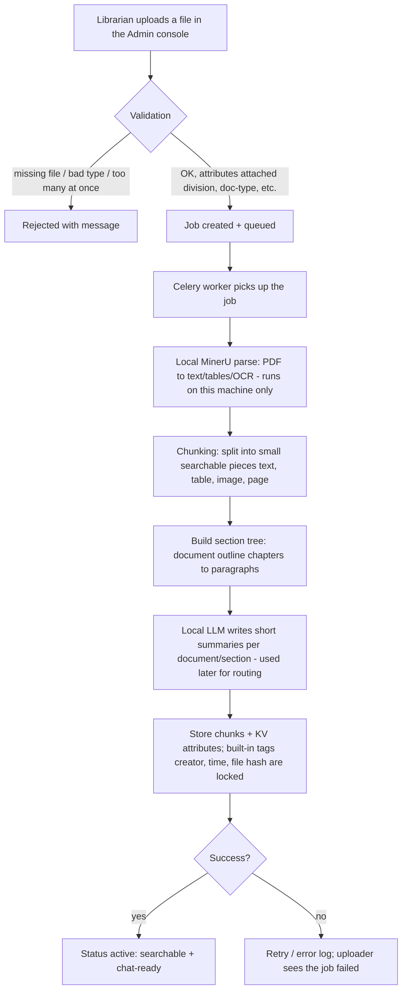
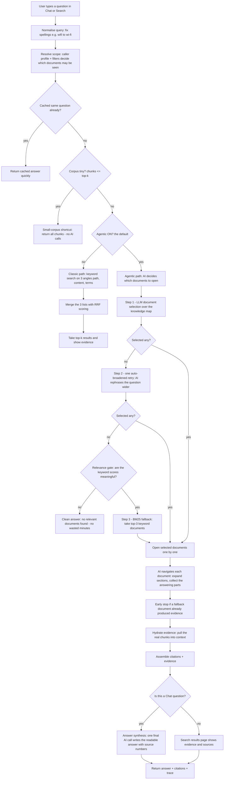
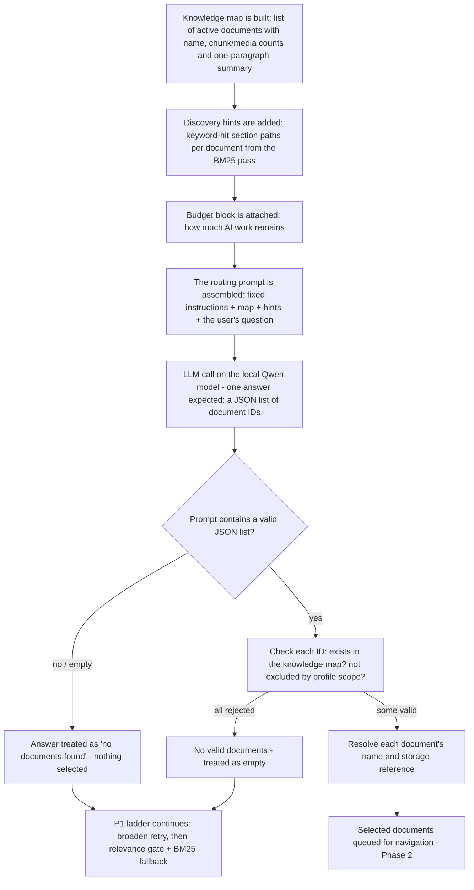

# Ziru System Flowcharts (fresh-review edition)

Plain-English overview of the two main journeys: **how a document gets into the
system** and **what happens when someone asks a question**. Every acronym is
explained in the glossary at the bottom. Diagrams use Mermaid (renders on GitHub).

## Flow 1 — Document intake (how a PDF becomes searchable knowledge)



**Plain-English walk-through:** a librarian uploads a security-standard PDF, tags it
with labels such as `division`, a background worker parses it locally into text and
tables, splits it into paragraph-sized searchable units, records the document's
outline, and asks the local AI to write short summaries. Only then does it become
visible to search and chat. Nothing is sent to any cloud service.

## Flow 2 — Retrieval (what happens when a query is entered)



**Plain-English walk-through:** the question is cleaned up, limited to documents the
user may see, and checked against a cache. Tiny corpora skip straight to an answer.
For normal corpora, the classic path is plain keyword search; the agentic path (the
default) lets the AI first *choose* documents — retrying once with a broader wording
if it picks nothing, and only then trusting the keyword list (guarded by a relevance
check so unrelated questions end quickly and honestly). Chosen documents are then
read section by section until the answering parts are collected, and chat writes a
final readable answer with numbered sources. Token/time budgets cap how much AI work
a single question can consume.


## Deep dive — Step J: LLM document selection over the knowledge map

This is the AI's "routing" decision: **which documents might contain the answer?**
It is deliberately the *only* step where the AI chooses documents — everything after
it (navigation) assumes the choice was right, which is why this step gets so much
attention and has two safety nets (the broaden retry and the BM25 fallback).



### What the AI actually sees (real example, shortened)

```text
You are a document routing assistant.

=== Resource Status ===
Planning Budget: HEALTHY (0% used)
When budget is TIGHT, prefer fewer high-confidence selections...

=== Document Corpus Overview ===
- [doc_16af985e2f68] PG for Website and Web Application Security_EN.pdf  chunks=129 media=4
  top_summary:
      This document includes: Website and Web Application Security, ...
      🔍 Discovery hints: 3. Website and Web Application Security; Annex E: OWASP...
- [doc_df69fa4dd2dd] PG for IGS_EN.pdf  chunks=...
- [doc_aaa61c4e8178] PG for Security Log Management_EN.pdf  chunks=...
... (up to 50 documents, most with summaries)
=== End Overview ===

User query: {the question}

Return ONLY a JSON array of document IDs, e.g.: ["doc_abc123", "doc_def456"]
Do not include any explanation.
```

Key facts a reviewer should know:

1. **The AI never reads the documents at this step** — only file names, chunk/media
   counts, one-paragraph summaries, and keyword-hit hints. That is by design (cheap),
   and it is also why narrow wording can fail: if the question's words do not appear
   in the summaries, the AI sometimes concludes "nothing matches" and returns an
   empty list.
2. **The answer must be a bare JSON list** of document IDs. Anything else (prose,
   invalid formatting) is parsed as "no documents found".
3. **Checks after the answer:** every returned ID must exist in the knowledge map and
   must not be excluded by the user's profile scope. Rejected IDs are dropped.
4. **Money/time guardrails:** this call is charged to the *bootstrap pool* (a reserved
   token allowance). If the allowance is exhausted the call is treated as empty — it
   never over-spends. On the local Qwen model one call takes roughly **5–40 seconds**
   depending on overview size and server cache warmth.
5. **It is intentionally non-deterministic** (low randomness, but not zero): the same
   question can return documents on one attempt and an empty list on the next. That
   measured behaviour is exactly why the P1 ladder exists — Step J's empty answer is
   not the end of the turn; it triggers Step L (broaden retry) and, if needed, the
   relevance-gated BM25 fallback.
6. **What the user sees afterwards:** the chosen documents appear in the trace
   (`kg_select` entry) with their names and the reason `LLM selected from KG overview`,
   so a reviewer can always see which documents the AI chose and why.

## Glossary (plain English)

| Term | What it means here |
|---|---|
| **API** | The program interface the web screens talk to |
| **Agentic** | AI-driven search: the LLM plans, chooses documents, and browses them step by step |
| **BM25** | A standard keyword-scoring formula used by the search engine (frozen, unchanged) |
| **Celery** | The background worker that processes uploads in the queue |
| **Chunk** | A small searchable piece of a document: a paragraph, table, image, or whole page |
| **KV attributes** | Labels stored as key-value pairs, e.g. `division=ssd`, used for filtering and profiles |
| **KG / Knowledge map** | A summary map of all documents (name + short summary + stats) that the AI reads to choose documents |
| **LLM** | Large Language Model — here the local Qwen model running on this machine via Unsloth |
| **MinerU** | The local PDF→text/table/OCR parser (no cloud, no API key) |
| **OCR** | Turning scanned images of text into real text |
| **P1 ladder** | The 3-step document-selection fallback: original AI pick → broader re-ask → keyword fallback |
| **Bootstrap pool** | A reserved token allowance for the AI's document-choosing calls, so one turn can never over-spend |
| **Routing** | The AI's act of choosing which documents may contain the answer, based on the knowledge map |
| **Profile scope** | Which documents a user may see, derived from their account profile labels |
| **Redis** | Fast local cache/message store used for jobs, sessions and query caching |
| **Rerank** | A switch that is currently stored but not yet active in the engine |
| **RRF** | A simple method to merge several keyword result lists into one ranked list |
| **Section tree** | The document's outline: chapters → sections → paragraphs, used for navigation |
| **Top-k** | How many final results to return (default 8, adjustable up to 50) |