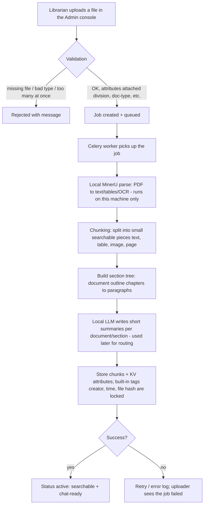
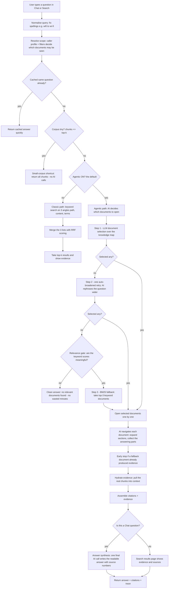

# Ziru System Flowcharts (fresh-review edition)

Plain-English overview of the two main journeys: **how a document gets into the
system** and **what happens when someone asks a question**. Every acronym is
explained in the glossary at the bottom. Diagrams use Mermaid (renders on GitHub).

## Flow 1 — Document intake (how a PDF becomes searchable knowledge)

**Plain-English walk-through:** a librarian uploads a security-standard PDF, tags it
with labels such as `division`, a background worker parses it locally into text and
tables, splits it into paragraph-sized searchable units, records the document's
outline, and asks the local AI to write short summaries. Only then does it become
visible to search and chat. Nothing is sent to any cloud service.

## Flow 2 — Retrieval (what happens when a query is entered)

**Plain-English walk-through:** the question is cleaned up, limited to documents the
user may see, and checked against a cache. Tiny corpora skip straight to an answer.
For normal corpora, the classic path is plain keyword search; the agentic path (the
default) lets the AI first *choose* documents — retrying once with a broader wording
if it picks nothing, and only then trusting the keyword list (guarded by a relevance
check so unrelated questions end quickly and honestly). Chosen documents are then
read section by section until the answering parts are collected, and chat writes a
final readable answer with numbered sources. Token/time budgets cap how much AI work
a single question can consume.

## Glossary (plain English)

| Term | What it means here |
|---|---|
| **API** | The program interface the web screens talk to |
| **Agentic** | AI-driven search: the LLM plans, chooses documents, and browses them step by step |
| **BM25** | A standard keyword-scoring formula used by the search engine (frozen, unchanged) |
| **Celery** | The background worker that processes uploads in the queue |
| **Chunk** | A small searchable piece of a document: a paragraph, table, image, or whole page |
| **KV attributes** | Labels stored as key-value pairs, e.g. `division=ssd`, used for filtering and profiles |
| **KG / Knowledge map** | A summary map of all documents (name + short summary + stats) that the AI reads to choose documents |
| **LLM** | Large Language Model — here the local Qwen model running on this machine via Unsloth |
| **MinerU** | The local PDF→text/table/OCR parser (no cloud, no API key) |
| **OCR** | Turning scanned images of text into real text |
| **P1 ladder** | The 3-step document-selection fallback: original AI pick → broader re-ask → keyword fallback |
| **Profile scope** | Which documents a user may see, derived from their account profile labels |
| **Redis** | Fast local cache/message store used for jobs, sessions and query caching |
| **Rerank** | A switch that is currently stored but not yet active in the engine |
| **RRF** | A simple method to merge several keyword result lists into one ranked list |
| **Section tree** | The document's outline: chapters → sections → paragraphs, used for navigation |
| **Top-k** | How many final results to return (default 8, adjustable up to 50) |
