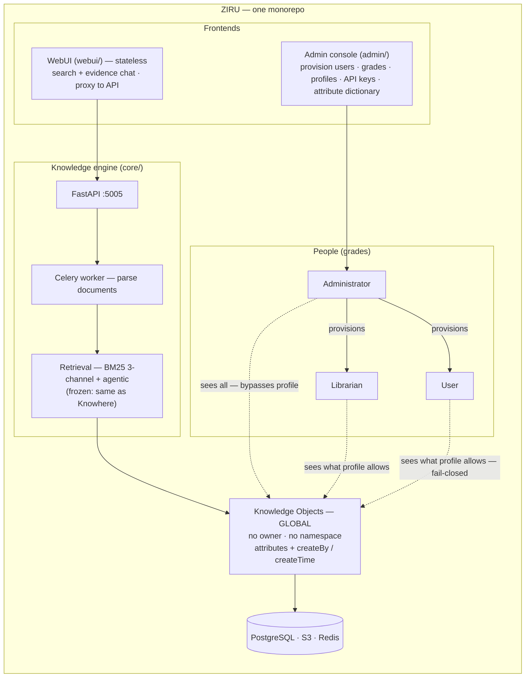
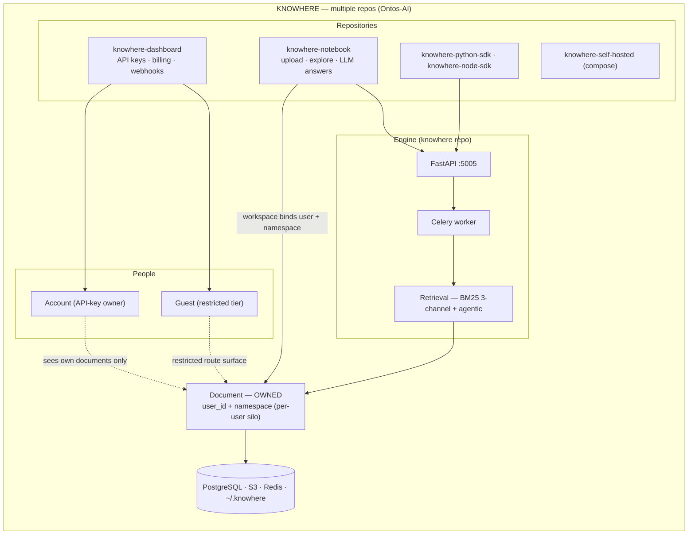

# Architecture — Ziru vs Knowhere

A side-by-side view of the components and the document–knowledge–user
relationships, before and after the fork. The two diagrams share the same
skeleton (People → Frontends → Engine → Knowledge) so the changes are easy to
spot.

## The one-sentence difference

- **Knowhere** — *every account keeps its own private corner* (each document
  is tied to a `user_id` + `namespace`), wrapped in SaaS machinery (billing,
  credits, guest tier, telemetry), spread across several repositories.
- **Ziru** — *one shared library everyone reads from*, governed by *who you
  are* (grade + profile) instead of *what you own*, in one monorepo, with the
  SaaS machinery removed.

## Ziru

## Knowhere

## Side-by-side comparison

| Concept | Knowhere | Ziru |
|---|---|---|
| Repositories | 5+ separate repos | 1 monorepo |
| Who owns a document | a user + a namespace | nobody — global knowledge object |
| Access control | owner sees own docs | grade + profile, fail-closed |
| Chat output | LLM synthesizes answers | evidence + citations only |
| SaaS surface | billing, credits, guest, telemetry | none |
| Cache scope | per (user, namespace) | global |
| Frontends | dashboard + notebook + SDKs | admin console + stateless webui |
| Document tags | namespace string | attribute dictionary (typed keys) |

## What stayed the same

The **engine is frozen** — the document parser and the retrieval core
(BM25 3-channel RRF + agentic navigation) are unchanged from Knowhere. The
fork changes *organization and access*, not *how documents are understood*.

## Rendering

- `architecture.md` (this file) renders the Mermaid diagrams on GitHub.
- `architecture-ziru.png` and `architecture-knowhere.png` are exported images
  of the two diagrams (generated from `architecture-ziru.mmd` /
  `architecture-knowhere.mmd`) for slides and documents.
