# Ziru Admin Guide

This guide is for **administrator** accounts in Ziru. Administrators have full access to the admin console: user management, the attribute dictionary, all documents (including creator information), archiving, jobs, API keys, webhooks, and settings.

The admin console is a web application that talks directly to the core Ziru API.

- Console URL: <http://localhost:81>
- API base: <http://127.0.0.1:5005>

## 1. Signing in

1. Open <http://localhost:81>. You are redirected to the **Ziru Admin** login page.
2. Enter your core API email and password.
3. Click **Sign in**.

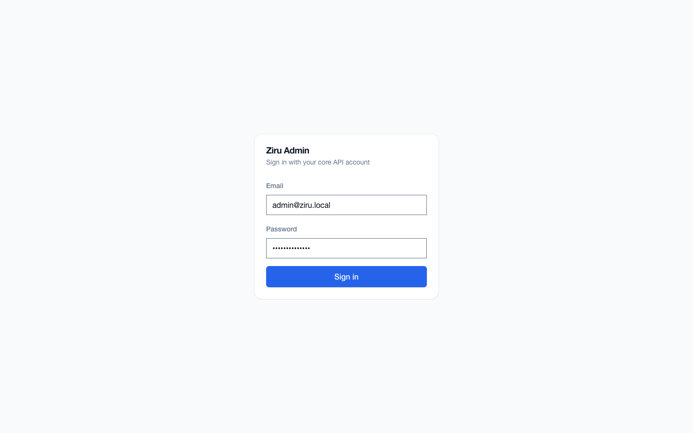

After a successful login you land on the **Overview** page. The sidebar shows every administrator navigation item: Overview, Users, API Keys, Attributes, Documents, Jobs, Webhooks, and Settings.

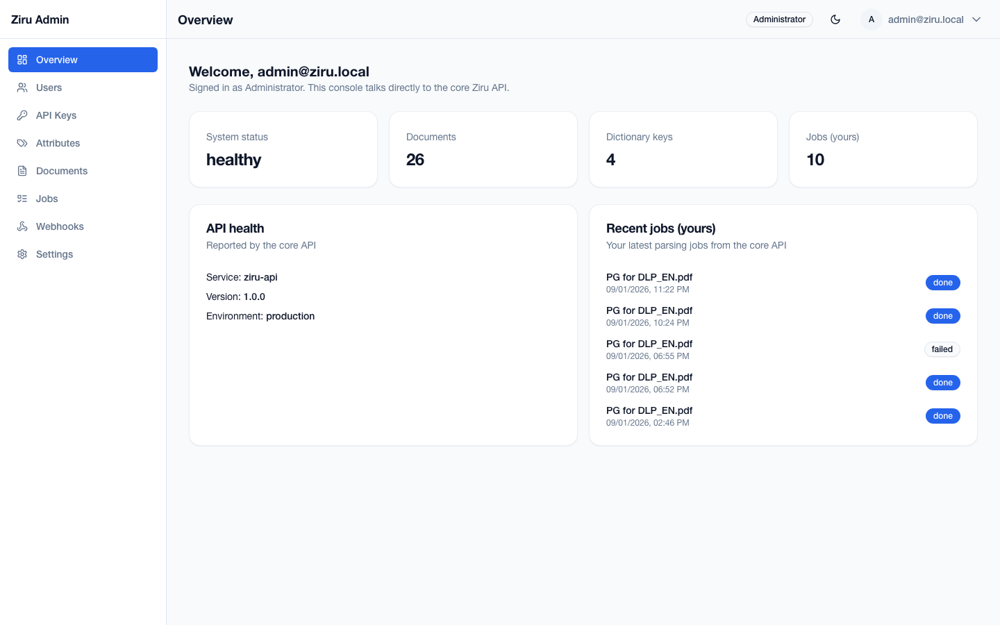

## 2. First-login password change

If your account was just created (or an administrator reset your password), the console shows the forced password-change screen before you can continue.

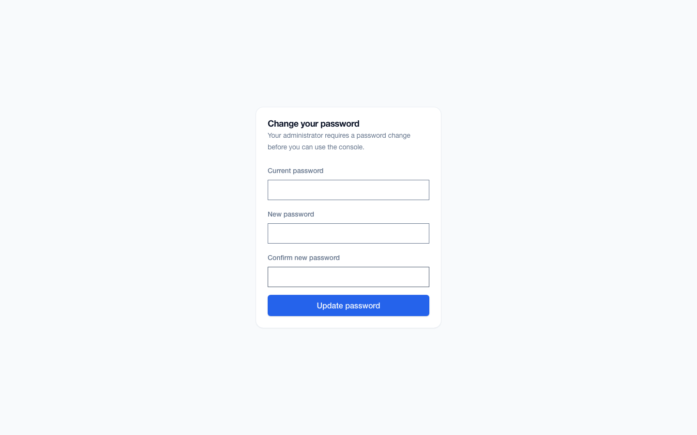

To complete the change:

1. Type your **Current password**.
2. Choose a **New password**. The policy requires at least 8 characters with uppercase, lowercase, and a digit.
3. Type the same value in **Confirm new password**.
4. Click the primary submit button on the forced-change screen.

The current session stays active. Your other sessions are signed out.

## 3. Overview dashboard

The Overview page summarizes the system:

- **System status** – health reported by the core API.
- **Documents** – total document count.
- **Dictionary keys** – number of attribute dictionary entries.
- **Jobs (yours)** – jobs owned by the signed-in administrator account.
- **API health** – service, version, and environment.
- **Recent jobs (yours)** – the latest parsing jobs for this account.

Click any linked statistic card to jump to the matching page.

## 4. Managing users

Open **Users** from the sidebar.

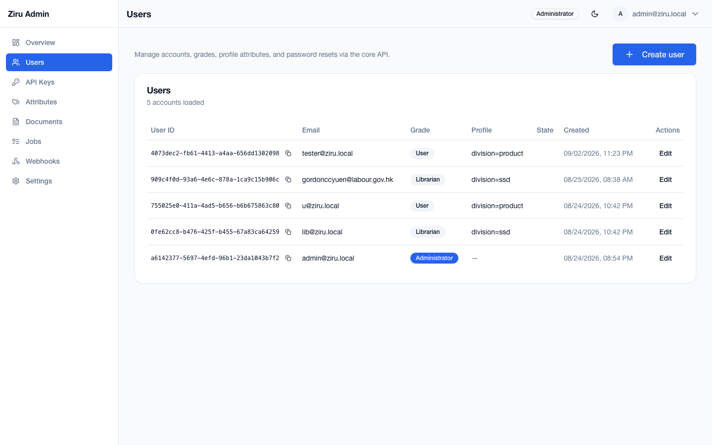

The table shows each account's email, grade, profile attributes, sign-in state, and creation time. Administrators can:

- **Create user** – click **Create user**.
- **Edit a user** – change grade, profile, disable an account, or reset a password.
- **View/reset temporary password** – the API returns a one-time temporary password when a password reset is requested.

### Creating a librarian or user

1. Click **Create user**.
2. Fill in **Email** and an **Initial password** (required unless you provide an SSO provider and subject).
3. Choose a **Grade**: `user` or `librarian`.
4. Add **Profile attributes** from the attribute dictionary. The attribute editor uses allowed values from the dictionary when available.
5. Click **Create user**.

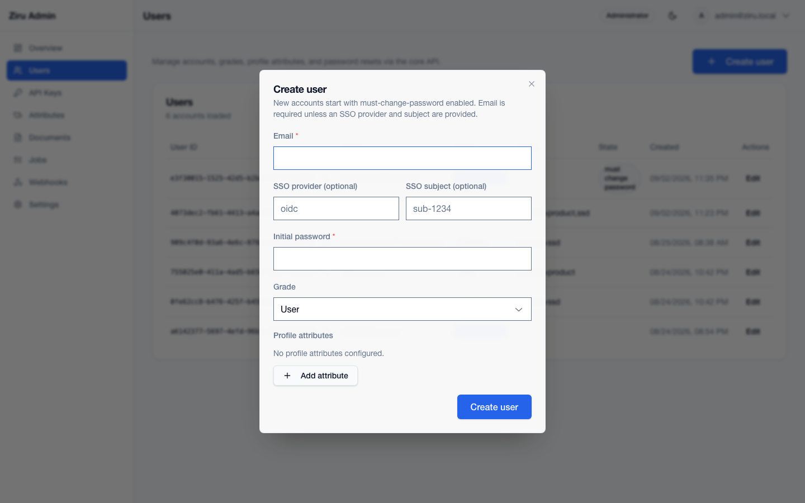

New accounts are created with must-change-password enabled, so the user must change their password on first sign-in.

## 5. Attribute dictionary

Open **Attributes** from the sidebar.

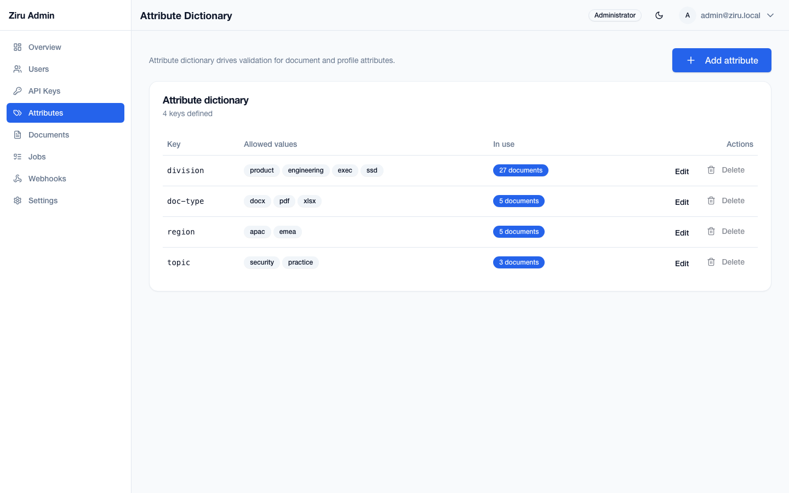

The dictionary drives validation for document and profile attributes. Each entry has:

- **Key** – the attribute name, for example `division`.
- **Allowed values** – optional. When set, documents and profiles may only use those values.
- **In use** – how many documents currently use the key.

Administrators can add, edit, and delete dictionary entries. Built-in reserved keys such as `createBy`, `createTime`, `fileHash`, and `originalFile` cannot be created as dictionary keys. A key that is in use by documents cannot be deleted until it is no longer used.

## 6. Documents

Open **Documents** from the sidebar.

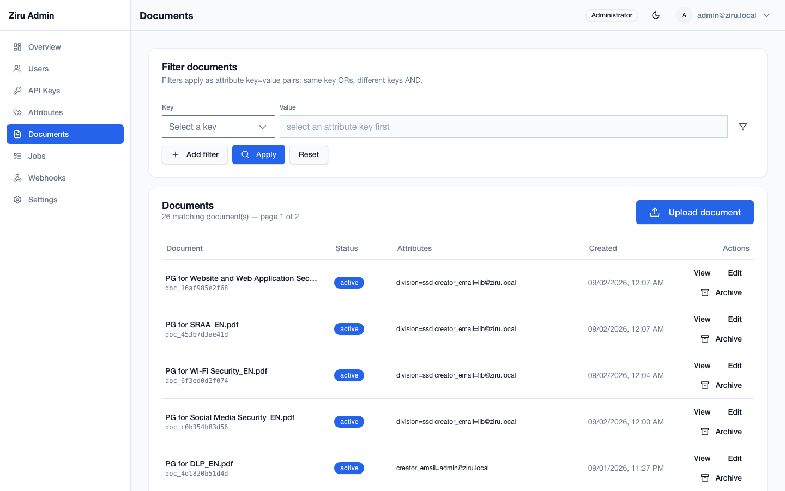

Administrators see all documents in a denser table with columns **Document**, **Status**, **Attributes**, **Created**, and **Actions** (there is no **Updated** column). The **Attributes** column shows the document's custom dictionary attributes plus the creator email (rendered from the `createBy` built-in attribute); the `createTime`, `fileHash`, and `originalFile` built-ins are hidden from the table but remain visible in the **View** dialog. Both administrators and librarians see the **Edit** action; only administrators see **Archive**. You can filter the list with key/value filters; the same key is OR-ed and different keys are AND-ed.

### Uploading a document

1. Click **Upload document**.
2. Choose one or more files (up to 10 per batch).
3. Add optional dictionary attributes. The upload starts a parse job for each file.
4. Click **Upload**.

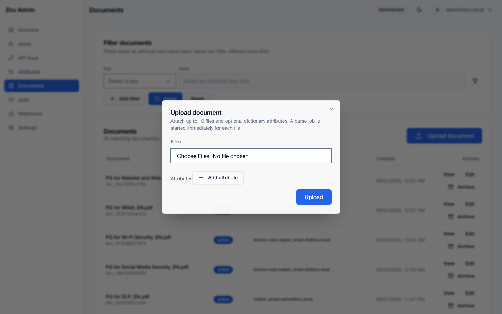

After upload, the console shows the accepted parse job id. You can follow it on the Jobs page.

### Editing attributes

Click **Edit** on a document row to open the **Edit attributes** dialog. This replaces all non-built-in attributes. Built-in attributes are shown read-only at the bottom.

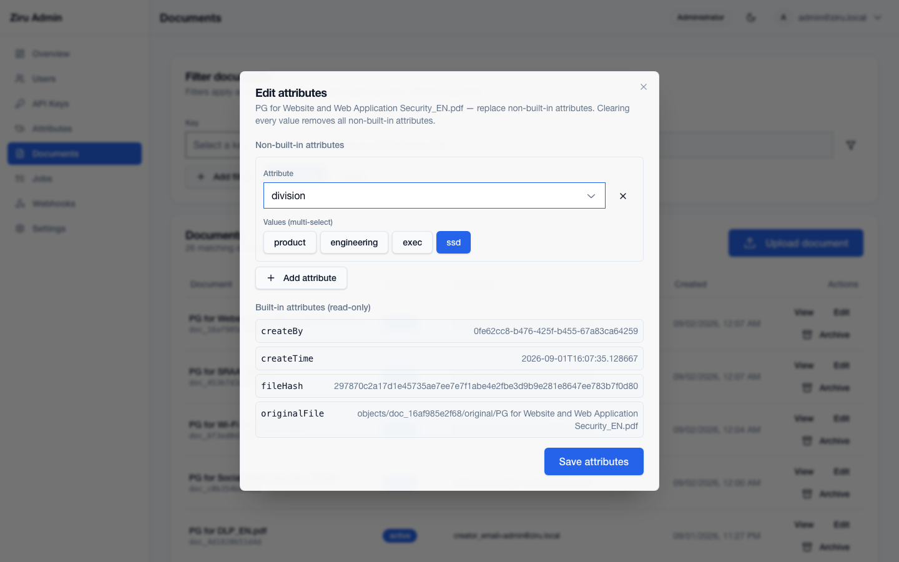

### Viewing the original file

Click **View** on a document row to see the full attribute map. For documents that have an `originalFile` attribute, the dialog includes a **view original** link that opens the original file.

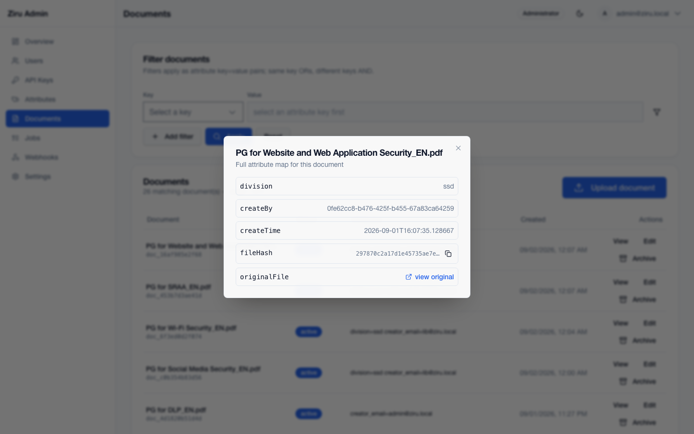

### Archiving

Click **Archive** on a document row and confirm. Archived documents are removed from listings.

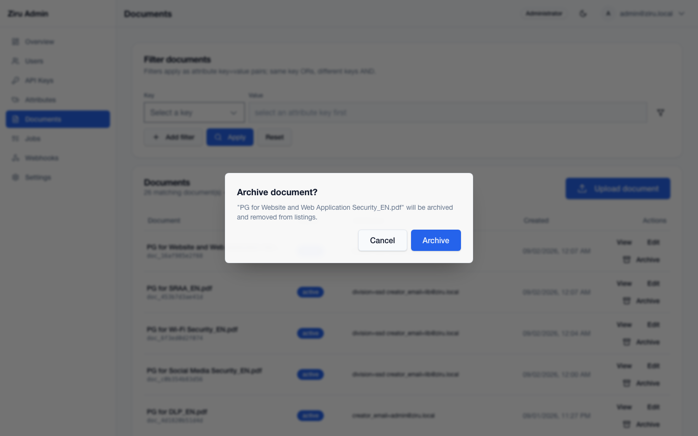

## 7. Jobs

Open **Jobs** from the sidebar.

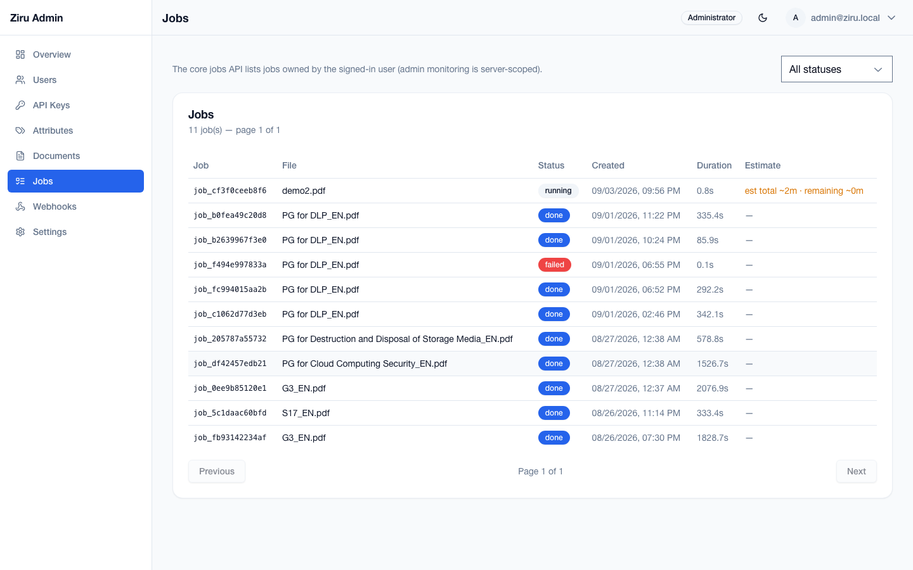

The Jobs page lists parsing jobs owned by the signed-in administrator account and shows:

- **Job** – the job id.
- **File** – the source file name.
- **Status** – `pending`, `waiting-file`, `running`, `converting`, `done`, or `failed`.
- **Created** – creation time.
- **Duration** – completed job duration.
- **Estimate** – for **running** jobs, the estimated total duration and remaining time. Completed jobs show a dash.

The page refreshes automatically every 60 seconds. Use the status selector to filter by status.

## 8. API keys

Open **API Keys** from the sidebar.

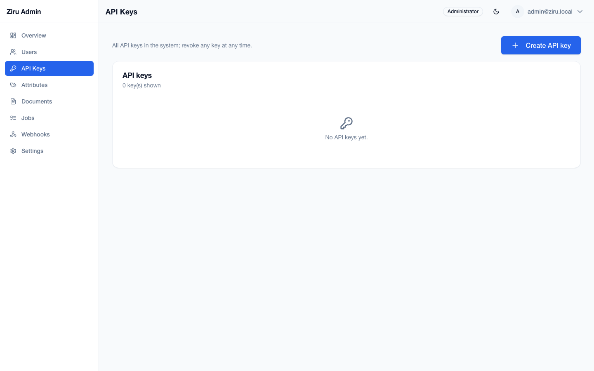

Administrators can see all API keys in the system and revoke any key. To create a key on behalf of a user:

1. Click **Create API key**.
2. Select the **Owner** user.
3. Enter a **Name**.
4. Optionally set an **Expires at** value (defaults to now + 3 months; empty means never expires).
5. Click **Create key**.

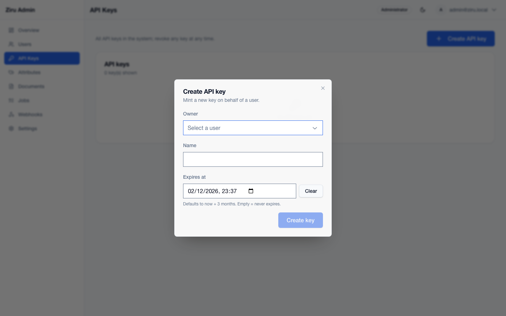

The raw key is shown only once. Copy it immediately and store it somewhere safe.

## 9. Webhooks and Settings

- **Webhooks** – manage webhook endpoints and inspect delivery logs.
- **Settings** – account settings and password change. The administrator's API keys are also visible here.

Only administrators should use the user-management, dictionary-management, document-archiving, and API-key minting/revocation controls.
