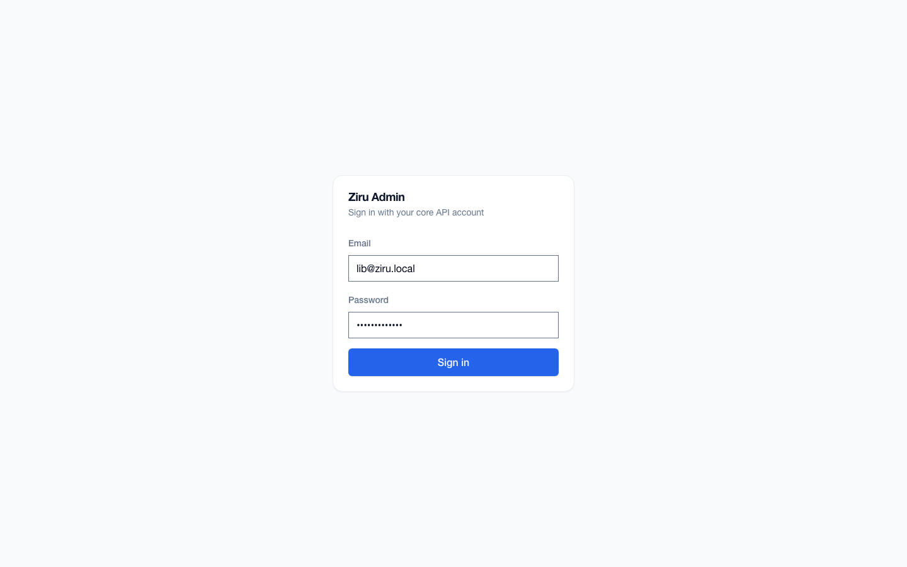
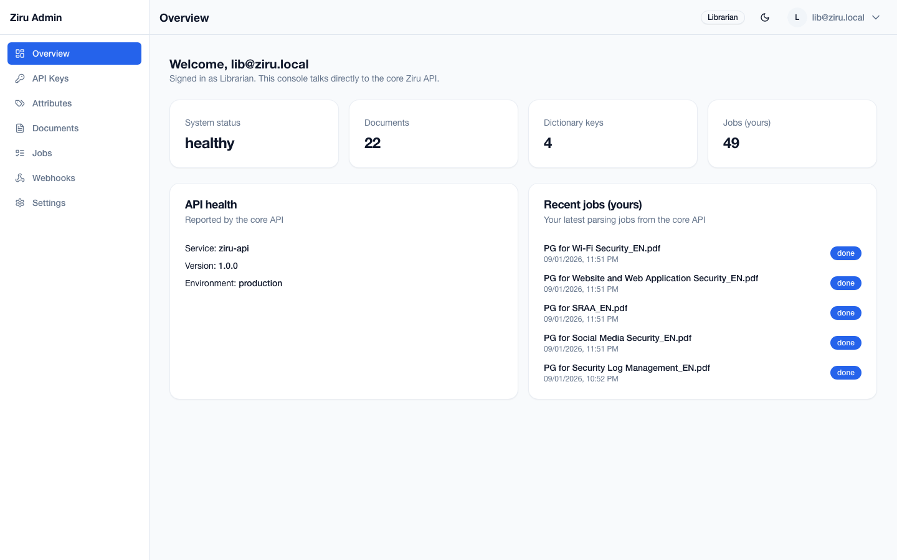
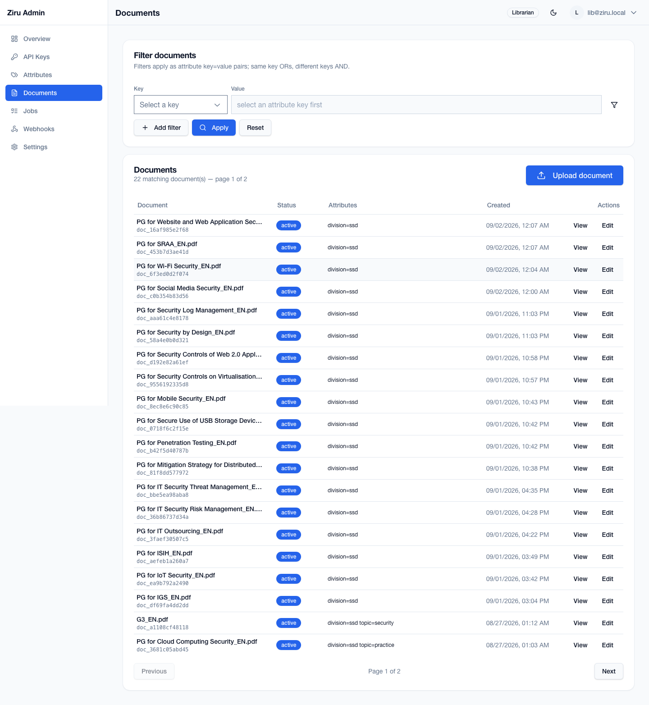
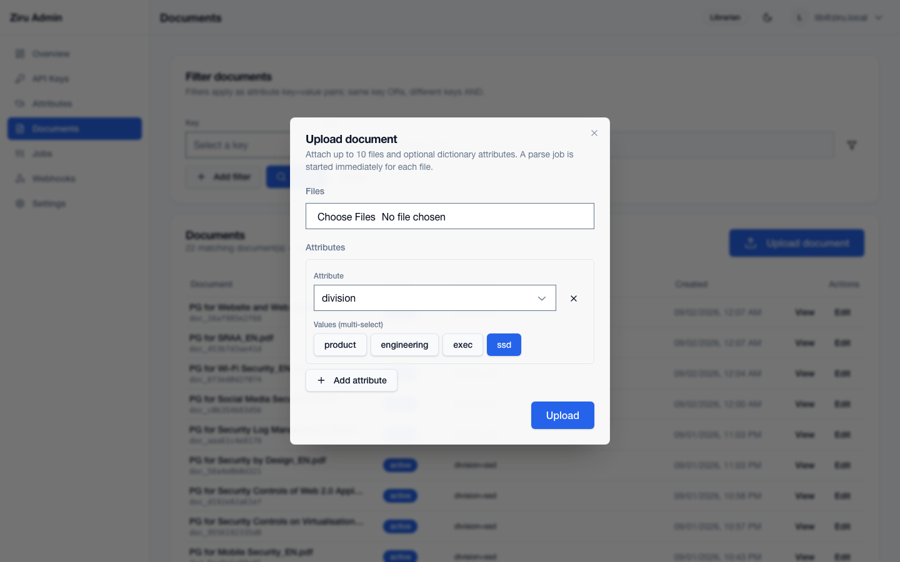
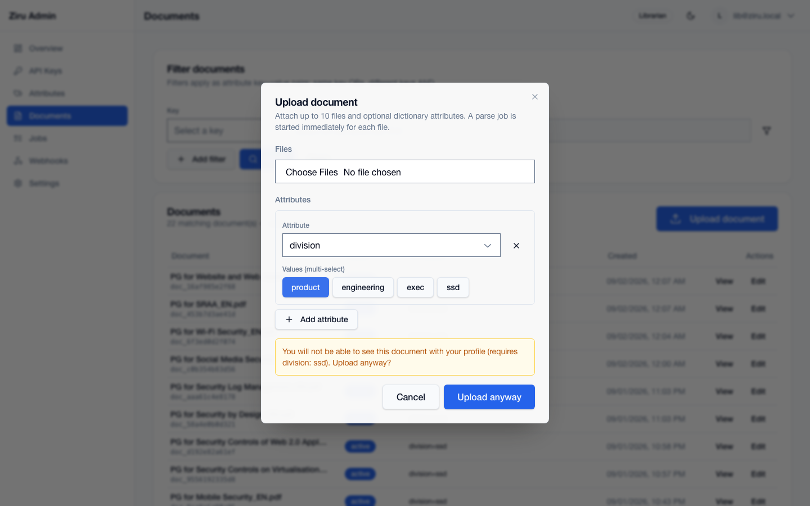
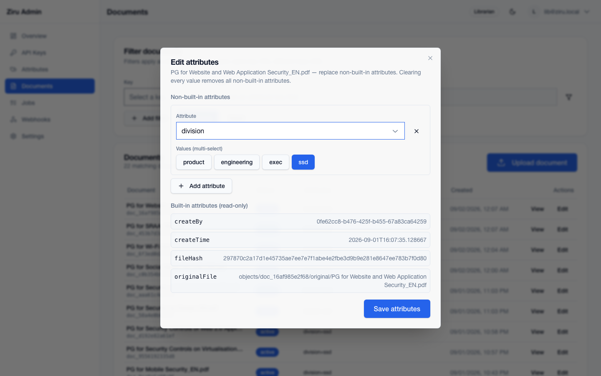
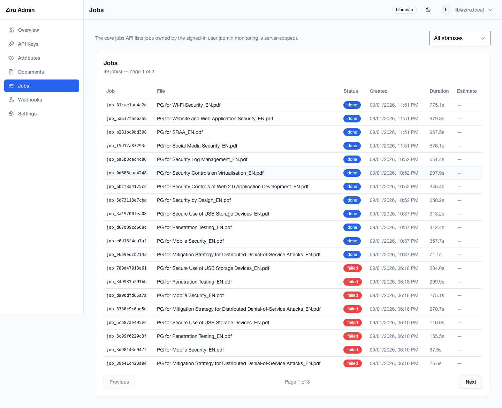

# Ziru Librarian Guide

This guide is for **librarian** accounts. A librarian can add documents to the knowledge base and maintain document attributes, but cannot manage users, change the attribute dictionary, or archive documents.

In the admin console a librarian sees: Overview, API Keys, Attributes, Documents, Jobs, Webhooks, and Settings. There is no **Users** menu.

- Console URL: <http://localhost:81>

## 1. Signing in

1. Open <http://localhost:81>.
2. Enter your librarian email and password.
3. Click **Sign in**.

After sign-in you land on the Overview dashboard.

The dashboard shows system health, document/dictionary/job totals, and recent jobs for your account.

## 2. What a librarian can and cannot do

Can do:

- Upload documents and attach dictionary attributes.
- Edit attributes on existing documents.
- View the attribute dictionary (read-only).
- View the API key list for the signed-in account (read-only).
- View jobs created by the signed-in account.

Cannot do:

- Manage users (no Users page).
- Add, edit, or delete dictionary entries.
- Archive documents.
- Create or revoke API keys.

## 3. Documents

Open **Documents** from the sidebar.

The Documents page shows the documents visible to your profile. Librarians see the **Upload document** button and **Edit** actions, but no **Archive** action. The attributes column shows dictionary attributes without the built-in `createBy`, `createTime`, `fileHash`, and `originalFile` fields.

Use the filter card to narrow the list by key/value pairs. The same key is OR-ed; different keys are AND-ed.

## 4. Uploading with profile-prefilled attributes

1. Click **Upload document**.
2. The **Attributes** section is pre-filled from your profile. For example, a librarian with profile `division: ssd` starts with a `division` row set to `ssd`.

3. Choose one or more files.
4. Adjust attributes if needed.
5. Click **Upload** to start a parse job for each file.

## 5. The invisibility warning

Ziru is fail-closed: a document is only visible when your profile constraints are satisfied by the document's attributes. If you change the upload attributes to values outside your profile, the console warns you before upload.

In the example below, a librarian whose profile requires `division: ssd` changed the upload attribute to a value that does not include `ssd`. The dialog shows:

> You will not be able to see this document with your profile (requires division: ssd). Upload anyway?

You can still click **Upload anyway**, but you will not see the resulting document in your own listings afterward. Click **Cancel** to return and fix the attributes.

## 6. Editing attributes on an existing document

1. On the Documents page, find the document and click **Edit**.
2. In the **Edit attributes** dialog, change the non-built-in attribute values.
3. Built-in attributes are shown read-only at the bottom.
4. Click **Save attributes**.

## 7. Jobs

Open **Jobs** from the sidebar.

The Jobs page lists parsing jobs owned by your librarian account. It shows job id, source file, status, creation time, duration, and the estimated time remaining while a job is running. The page auto-refreshes every 60 seconds.

## 8. API keys (read-only)

Open **API Keys** from the sidebar. Librarians can see their own keys but cannot create or revoke keys. Contact an administrator to mint or revoke a key.

> The API key page is read-only for non-administrators: the same rule applies to the WebUI Settings page.
