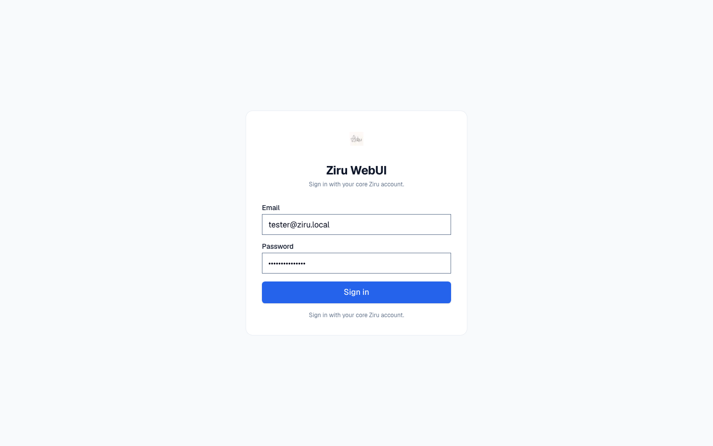
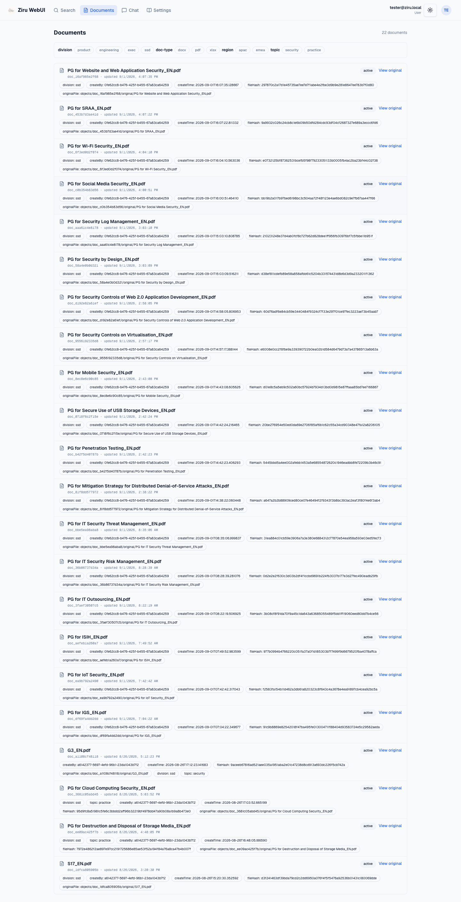
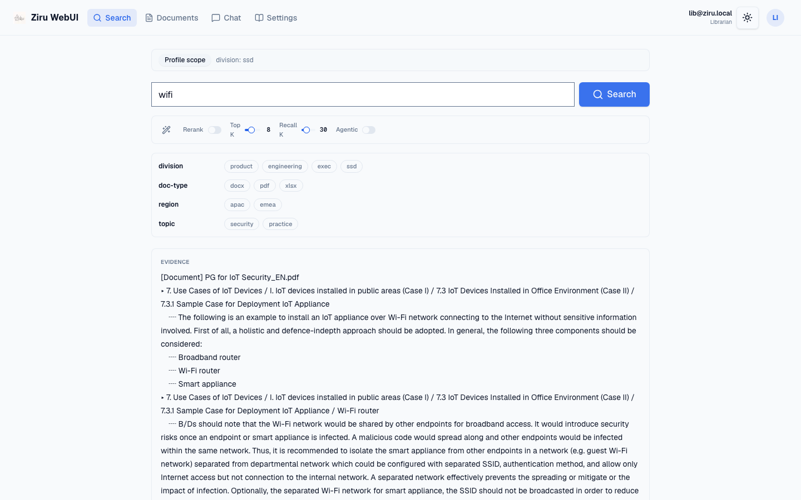
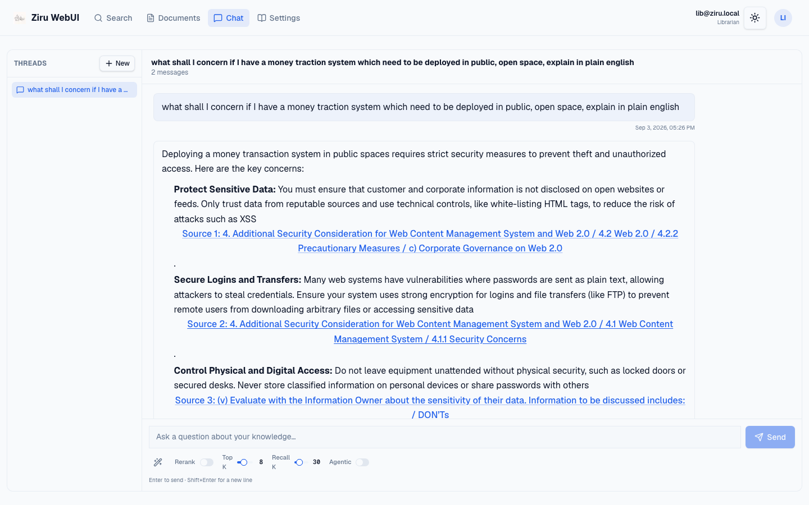
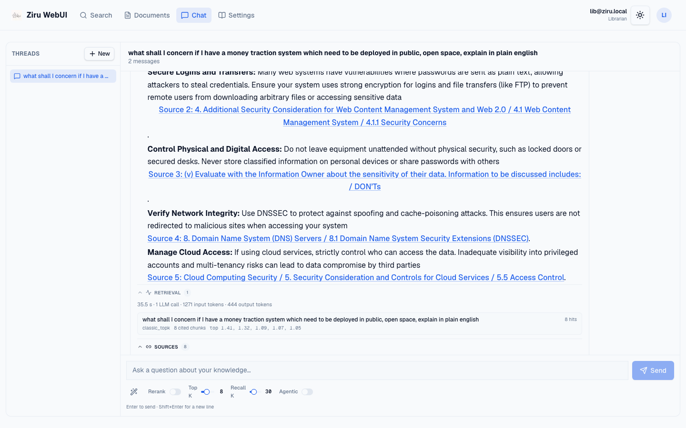
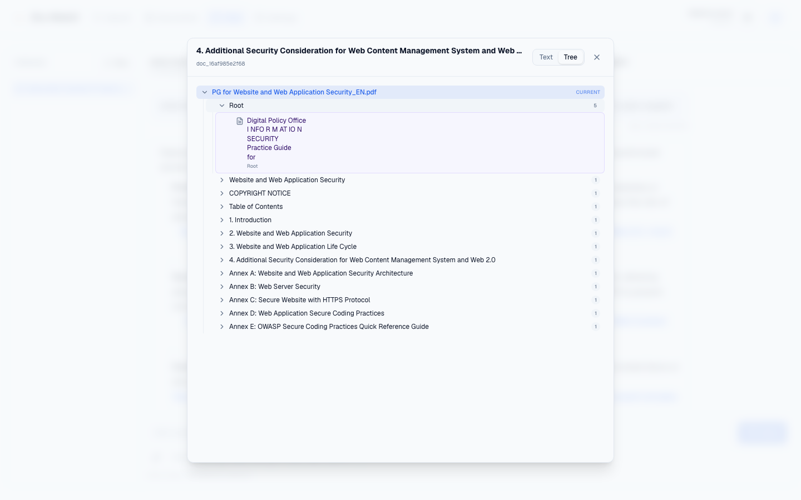
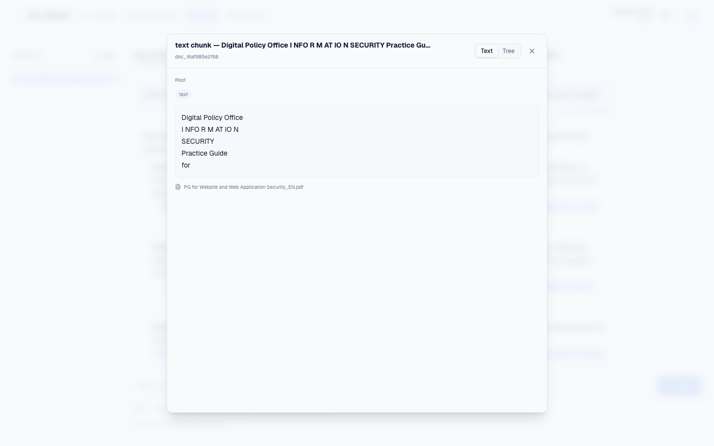
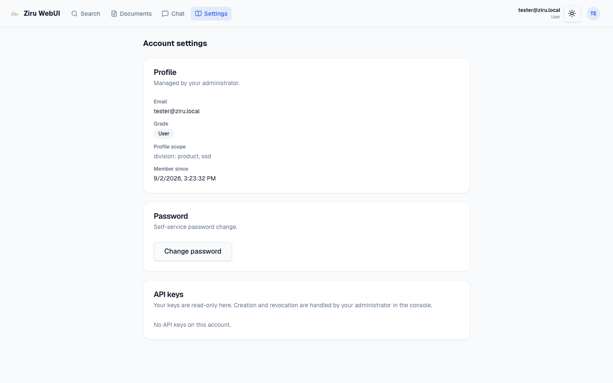
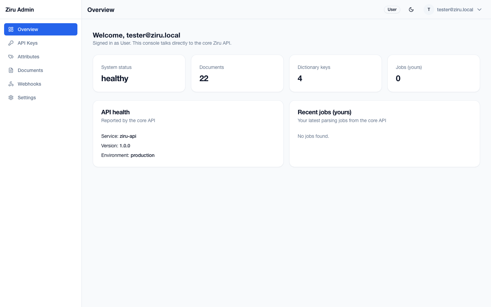
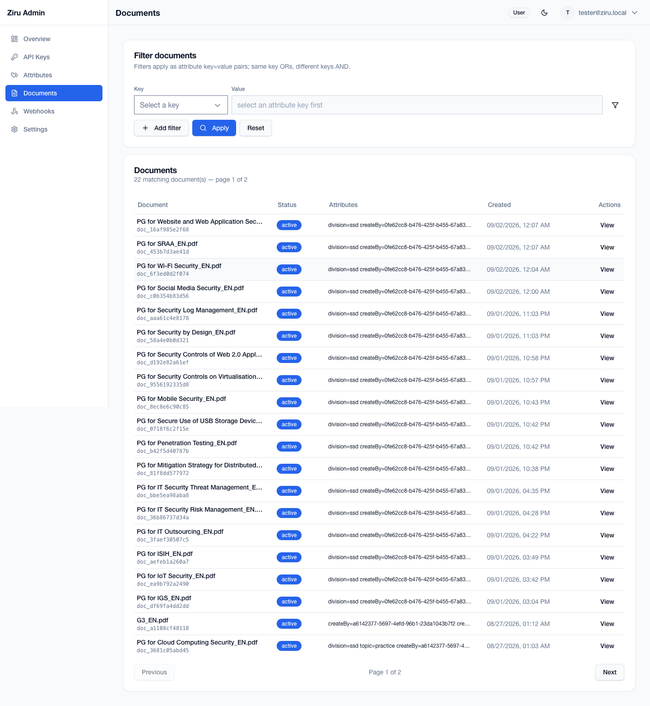

# Ziru User Guide

This guide is for **user** accounts. A user has read-only access to the knowledge base through the Ziru WebUI: browse documents, search, and chat with traceable sources. Users cannot upload documents or manage the dictionary.

- WebUI URL: <http://localhost:80>
- Console URL: <http://localhost:81> (limited read-only console)

## 1. Signing in to the WebUI

1. Open <http://localhost:80>.
2. Enter your core Ziru email and password.
3. Click **Sign in**.

The WebUI has four tabs: **Search**, **Documents**, **Chat**, and **Settings**.

## 2. Browsing documents (profile-scoped)

Open **Documents**.

The Documents page lists documents that match your profile scope. Use the attribute chips at the top to narrow the list further. Each row shows the document name, id, update time, status, and its attributes, plus a **View original** link when the original file is available.

Your visible corpus is profile-scoped. In the screenshot, the signed-in user's profile scope is `division: product, ssd`, so documents with `division: ssd` are shown.

## 3. Searching the knowledge base

Open **Search**.

1. Type a question or keywords in the search box.
2. Optionally select attribute filters. If you leave filters empty, the search automatically uses your profile scope.
3. Click **Search**.

Search returns evidence text and ranked source passages. Each result card shows the source document, section path, score, and links to view the document or original file. The retrieval settings (rerank, top K, recall K, agentic) are available above the filters.

## 4. Chat with trace, sources, and chunk pane

Open **Chat**.

1. Click **New** to create a thread.
2. Type a question in the composer.
3. Press **Enter** or click **Send**.

The assistant returns a synthesized plain-English answer with inline [Source N] markers. It may take up to a few minutes on the local Qwen model (the answer retries up to three times, then falls back to the retrieved evidence only if all three attempts come back empty). Message timestamps use your browser's local timezone.

Below the answer, expand **Retrieval** to see the trace (queries, hit counts, LLM call count, tokens) and **Sources** to see the cited passages.

Click a source passage (or a [Source N] marker) to open the **Source chunk** pane. It opens in **Tree** view, showing the selected document's real section tree with chunk-count badges, expandable sections, and chunk-leaf cards.

Click a chunk leaf to switch to **Text** view with that chunk's full content. The full text is fetched on demand when the leaf is not already one of the cited passages. You can also use the **Text/Tree** toggle at any time.

## 5. Settings

Open **Settings**.

The Settings page shows:

- **Profile** – email, grade, profile scope, and member-since date (managed by your administrator).
- **Password** – self-service password change via **Change password**.
- **API keys** – your keys, read-only. Creation and revocation are handled by an administrator.

## 6. Limited console access

A user can also sign in to the admin console at <http://localhost:81>, but the console is read-only and limited.

The sidebar for a user has no **Users** and no **Jobs** items. It shows Overview, API Keys, Attributes, Documents, Webhooks, and Settings.

On **Documents**, a user can only **View** a document; there is no **Upload document**, **Edit**, or **Archive** action.

The **Attributes** page and **API Keys** page are read-only for users. Use the WebUI for day-to-day knowledge access and the console only when you need the read-only attribute view.
